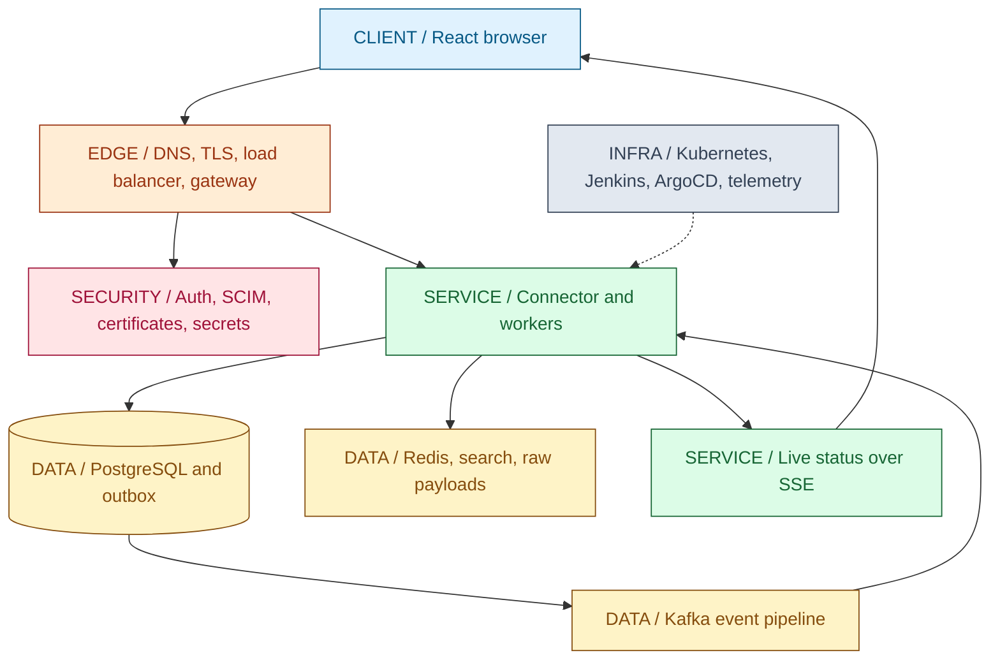
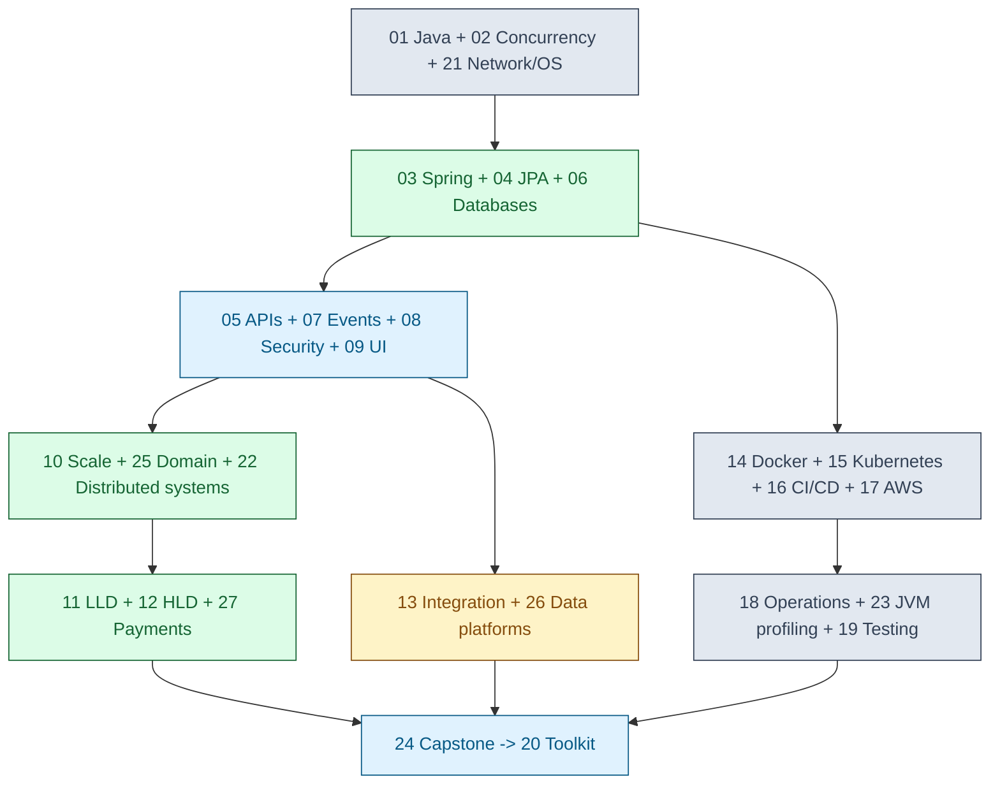
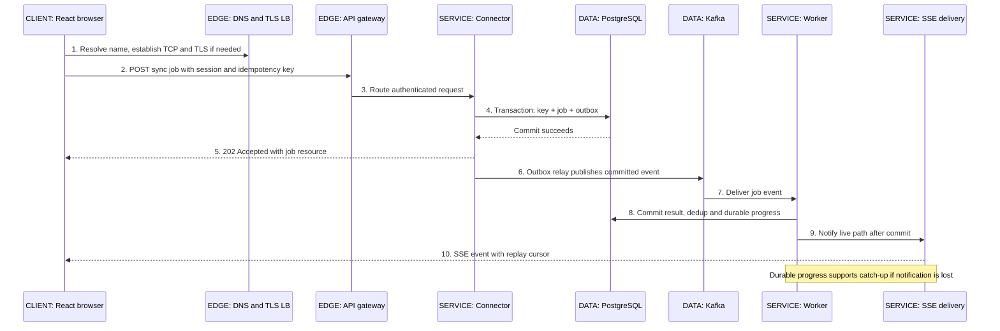

# 00 / The System Before the Details

**The Java Full-Stack Guide**

A connected reference for Java backend and full-stack interviews. IntegrationHub, the system throughout this guide, is fictional. Its architecture is a teaching device, not a description of any employer or client.

**Version assumptions.** Java 21 is the runnable-example baseline; later Java releases will be distinguished where relevant. Spring Boot 4.0.x and Spring Cloud 2025.1.x are the provisional framework families: the [official compatibility table](https://spring.io/projects/spring-cloud) was consulted on 2026-10-05 and lists that pairing. Chapter 03 will cover migration differences from Boot 3.x. PostgreSQL 17, Kafka 4.x, and Kubernetes 1.34 are illustrative infrastructure baselines, not recommendations to deploy an old patch. This chapter does not require those runtimes.

**[VERIFY: exact patches, support windows, and dependency/plugin compatibility must be rechecked against Spring's compatibility table, the Spring Boot system requirements, and the PostgreSQL, Kafka, Kubernetes and JDK vendor release documentation before executable examples are pinned.]**

## Big Picture

The arrows show responsibility and data movement, not a requirement that every component be deployed separately. In particular, the identity service is not contacted for every request when a service can validate a signed access token using trusted keys and the required claim checks.

## What You Will Be Able to Explain

- Follow a request from a browser through the network, an authorization boundary, a database commit, a message, and a UI update.
- Say what is durable at each point, who owns a decision, and which outcomes are still uncertain after a timeout.
- Separate a database transaction from a business workflow and from message delivery guarantees.
- Choose the next chapter from a concrete interview gap instead of memorizing a disconnected tool list.
- Explain one mechanism, one trade-off, and one failure case before reaching for product names.

> [!INTERVIEW]
> An interviewer can change the framework or cloud provider without changing the underlying question. Be able to identify the invariant: what must remain true when a request is duplicated, a process pauses, or a connection breaks?

## How to Read This Guide

Start with the request journey below. For each unfamiliar boundary, follow its chapter link. A chapter should leave you able to explain the mechanism aloud, predict a failure, and justify a design choice. Definitions alone do not establish that understanding.

There are three useful passes. First, read each big picture and its IntegrationHub placement. Second, work through traces, runnable examples, and failure cases. Third, answer the interview corner without looking, then compare your answer with the model answer. For code, change an assumption and rerun the test; for design, change a constraint and reconsider the decision.

**Recommended reading order:** 00, 01, 02, 21, 03, 04, 06, 05, 07, 26, 08, 09, 10, 25, 22, 11, 12, 27, 13, 14, 15, 16, 17, 18, 23, 19, 24, then 20.

Chapter numbers are permanent identifiers, not prerequisites. The order puts networking before framework request handling, databases before API durability promises, architecture before case studies, and JVM profiling after operational diagnosis. The capstone is the last narrative chapter; the interview toolkit is the final appendix.

| Reading route | Use when | Avoid when | Start here |
|---|---|---|---|
| Connected foundation | You can write Spring code but cannot trace what happens underneath | You are trying to locate one precise failure during an incident | 00 -> 01 -> 02 -> 21 -> 03 |
| Production diagnosis | You have a symptom and can identify its boundary | You are guessing the failing layer from a dashboard color | [18 Operations](18-operations.md#ch18-operations), then 23, 06, or 21 |
| Design interview | You can reason about APIs and persistence and need to defend decisions | You are substituting memorized diagrams for requirements | [10 Foundations](10-system-design.md#ch10-system-design) -> 25 -> 22 -> 11/12 -> 27 |
| Revision | You have already worked the mechanisms and need retrieval practice | You have not yet understood the basic request journey | Cheat sheets; [20 Toolkit, planned](20-toolkit.md#ch20-toolkit) |

This guide intentionally excludes DSA/LeetCode, ML/AI engineering, mobile, Spark/Hadoop, blockchain, embedded systems, and hard real-time systems. It cannot guarantee passing any interview. A hiring process may independently assess algorithms, communication, or domain experience that a reference document cannot substitute for.

## Chapter Dependency Map

These are learning dependencies, not software imports. Testing is shown near operations for revision, but examples are tested from the first executable chapter. Use the [chapter directory](#guide-directory) for individual chapter links and publication status.

## IntegrationHub: One System, Explicit Boundaries

A tenant connects a source application, maps fields, starts a bulk synchronization, and watches progress. Work can continue after the browser closes. Different tenants must not access one another's credentials, payloads, or results. A retry must not silently turn one requested job into two.

> [!PRODUCTION]
> **Where this lives in IntegrationHub.** The same sync job connects [browser behavior](09-frontend.md#ch09-frontend), [Spring request handling](03-spring.md#ch03-spring), [durable state](06-databases.md#ch06-databases), [event delivery](07-messaging.md#ch07-messaging), and [production diagnosis](18-operations.md#ch18-operations). Later chapters deepen those mechanisms without inventing a different system.

### What Owns What?

| Component | Responsibility | Must not quietly become |
|---|---|---|
| React UI | Render state, start jobs, reconnect live progress | The authority for tenant membership or durable completion |
| Gateway | Route requests, enforce coarse limits, handle the browser/session boundary | The only authorization check in the system |
| Auth/Token and SCIM | Authenticate, issue/validate identity contracts, provision authorized tenant users | A justification for trusting arbitrary tenant headers |
| Connector service | Authorize a sync, validate its contract, record acceptance, execute connector policies | A transaction spanning every external system |
| Certificate/secret service | Resolve authorized secret references and coordinate rotation | A store of plaintext secrets in job events or logs |
| PostgreSQL | Own operational jobs, keys, checkpoints, and outbox records | A shared free-for-all where every service writes every table |
| Kafka | Retain and distribute events by partition | Automatic exactly-once effects in an external API |
| Redis / Elasticsearch / MongoDB | Cache and fan-out / search projection / optional raw payload retention | Three interchangeable sources of truth |
| Kubernetes and delivery | Run and replace workloads from approved artifacts | A guarantee that a healthy process is producing correct business results |

The initial teaching design has one write region and a shared-schema tenant model inside each service's owned data. `tenant_id` participates in authorization, lookup predicates, and relevant uniqueness constraints. A job ID is not proof that the caller may access it. Defense-in-depth database controls are covered in [06](06-databases.md#ch06-databases) and [08](08-security.md#ch08-security).

A connector's configuration stores a secret reference, not the secret itself. The worker obtains the secret through an authorized path. Raw source payloads are optional, retained only for a stated purpose and duration. Durable progress belongs to a job; the live connection is merely one view of it.

> [!DECISION]
> This guide includes microservices to expose network and ownership boundaries. A real small team should consider a modular monolith first. The [architecture chapter](25-architecture.md#ch25-architecture) compares use and avoid conditions; adding Kafka, Redis, and Kubernetes does not by itself improve a design.

## Request Journey: From Click to Durable Progress

**Scenario:** an authenticated user starts a sync. This is an illustrative successful path with explicit failure boundaries, not a benchmark or a production trace. The public connection in this trace uses HTTPS over TCP; HTTP/3 uses QUIC instead and is covered in [21](21-network-os.md#ch21-network-os). Existing connections and DNS caches may skip setup work.

### 1. Resolve and Connect

The browser needs an address for the requested hostname. [DNS resolution and caching](21-network-os.md#ch21-network-os) may involve browser, OS, and recursive resolver caches; a request does not necessarily reach an authoritative server. If there is no reusable connection, the client establishes [TCP](21-network-os.md#ch21-network-os) and then negotiates [TLS](08-security.md#ch08-security). Certificate verification checks the intended server identity through the browser's trust configuration; encryption without authentication would not establish whom the client reached.

The [load balancer](10-system-design.md#ch10-system-design) selects a healthy upstream. Public TLS termination does not automatically encrypt the next hop. The [network chapter](21-network-os.md#ch21-network-os) explains L4 versus L7 behavior, connection reuse, and separate connect/read timeouts. The [cloud chapter](17-cloud.md#ch17-cloud) maps those roles onto a VPC and ALB.

### 2. Carry Identity, Not an Untrusted Tenant Claim

The earlier login used [OAuth authorization code with PKCE and OIDC](08-security.md#ch08-security). For this walkthrough the browser uses a same-origin secure HttpOnly session cookie at the gateway/BFF boundary; the gateway can forward an access token internally. [CSRF protections](08-security.md#ch08-security) apply to state-changing cookie-authenticated requests. OIDC establishes identity; the service still authorizes an action on a specific tenant resource.

The [React client](09-frontend.md#ch09-frontend) sends `POST /v1/sync-jobs` with a stable [idempotency key](05-apis-realtime.md#ch05-apis-realtime) for this logical attempt. Double-clicking or retrying after a lost response must not create an unrelated key. The server scopes the key by tenant and operation, records a digest of the request, and rejects reuse for different content.

### 3. Route, Validate, Authorize

The [gateway](03-spring.md#ch03-spring) routes the request and applies a coarse [rate limit](10-system-design.md#ch10-system-design). At the connector service, [Spring Security, MVC, validation and proxies](03-spring.md#ch03-spring) lead to business logic that checks permission for the connector and tenant. Token signature validation is only one check; issuer, audience, lifetime, and the actual authorization policy also matter.

The request runs on a [Java execution model](02-concurrency.md#ch02-concurrency) and consumes finite resources: threads or virtual threads, sockets, and [database connections](06-databases.md#ch06-databases). Virtual threads do not make a ten-connection database pool capable of ten thousand simultaneous queries. The [JVM](01-java-jvm.md#ch01-java-jvm) and [OS](21-network-os.md#ch21-network-os) chapters identify what is actually scheduled and allocated.

### 4. Make Acceptance Durable

Inside one [database transaction](06-databases.md#ch06-databases), the connector records the idempotency result, job, and [outbox event](07-messaging.md#ch07-messaging). A tenant-scoped unique constraint arbitrates concurrent duplicate requests. Application code alone cannot safely decide uniqueness with an unprotected check-then-insert.

[JPA flushing](04-jpa.md#ch04-jpa) is not synonymous with a committed transaction. The server must not claim durable acceptance merely because an object was added to a persistence context. Once commit succeeds, a later process crash must not erase the accepted job within the stated database durability and recovery assumptions.

> [!MECHANISM]
> The outbox closes one specific gap: persisting a job and recording the intent to publish happen atomically in one database. It does not atomically commit a PostgreSQL transaction and a Kafka transaction. The relay may publish an event again after a crash; consumer idempotency remains necessary.

### 5. Return Acceptance, Not Completion

The [HTTP response](05-apis-realtime.md#ch05-apis-realtime) is `202 Accepted` with a job resource the caller can query. The sync may still fail later. If the server commits and the response is lost, the client's timeout means **unknown outcome**, not **the server did nothing**. A retry with the same key recovers the prior logical result under the API's retention contract.

The stored acceptance result must not be held forever without a policy. Retention must cover the documented client retry window and business risk; an expired key may no longer deduplicate an old request. Payments require stronger reconciliation reasoning, explored separately in [27](27-payments.md#ch27-payments).

### 6. Publish Committed Work

The outbox relay reads committed work and publishes to [Kafka](07-messaging.md#ch07-messaging). It waits for the configured broker acknowledgement before recording progress, but a failure between publish and that record can still create a duplicate. [Log-based CDC](07-messaging.md#ch07-messaging) is another relay implementation, not permission to discard idempotency.

Partitioning by a stable job key can preserve order for that job within a partition. It does not establish global order across jobs. Kafka offsets are positions in partitions, not a universal business progress counter. [Distributed ordering and consistency](22-distributed.md#ch22-distributed) give the vocabulary to explain that boundary precisely.

### 7. Execute with Bounded Failure

A worker consumes the event, resolves its [connector strategy](11-lld.md#ch11-lld), obtains authorized [credentials](08-security.md#ch08-security), and calls a source or destination application. [Integration techniques](13-integration.md#ch13-integration) handle pagination, mapping, checkpoints, quarantine, and bulk APIs. [Resilience policies](10-system-design.md#ch10-system-design) bound timeouts and concurrency, use backoff with jitter, and avoid retrying every failure indiscriminately.

An external timeout may hide a successful side effect. The worker uses the provider's idempotency contract or a reconciliation path; blindly issuing another non-idempotent operation is not safe. A circuit breaker stops selected calls temporarily, but it does not undo the calls already made or guarantee another system's recovery.

### 8. Commit Effects Before Advancing Consumption

For database-local effects, the worker stores its deduplication record, business update, and durable progress in one transaction. The [consumer offset](07-messaging.md#ch07-messaging) advances only after the intended durable processing boundary. A crash after the database commit and before offset commit produces redelivery; the deduplication contract makes that replay harmless for the covered effects.

[Elasticsearch projections and Redis caches](06-databases.md#ch06-databases) may lag the authority. A missing search result is not proof the job was never accepted. [Analytics feeds](26-data-platform.md#ch26-data-platform) are separate derived consumers; a warehouse delay should not block operational acceptance without an explicit business reason.

### 9. Deliver Live Progress without Making the Socket the Database

The live path reads committed progress and sends [SSE](05-apis-realtime.md#ch05-apis-realtime) events as `text/event-stream`. Proxies need appropriate buffering and timeout configuration. After disconnection, an event ID and `Last-Event-ID` can identify a replay cursor; they do not manufacture a replay store. A retention gap requires an explicit reset/snapshot path.

With multiple SSE nodes, [pub/sub fan-out](07-messaging.md#ch07-messaging) routes live events to interested connections. Redis Pub/Sub is not a durable event history. Kafka consumers in one group load-balance partitions; they do not deliver every event to every node. Slow clients need bounded buffers and a disconnect/catch-up policy rather than unlimited memory growth. [The UI](09-frontend.md#ch09-frontend) handles reconnects and ignores stale progress without inferring success from silence.

### 10. Make the Whole Journey Observable

[OpenTelemetry trace context](18-operations.md#ch18-operations) connects HTTP spans to asynchronous work through message metadata; asynchronous work may require appropriate span links. [Prometheus metrics, Loki logs, and Grafana views](18-operations.md#ch18-operations) answer different questions. Use logs/traces for per-job investigation; unbounded job and tenant metric labels can cause excessive cardinality.

[Jenkins and ArgoCD](16-delivery.md#ch16-delivery) deliver the service image to [Kubernetes](15-kubernetes.md#ch15-kubernetes), but readiness only establishes the configured readiness condition. Test the business path with [integration and end-to-end checks](19-testing.md#ch19-testing). If memory or latency deteriorates, follow evidence into [JVM profiling](23-jvm-performance.md#ch23-jvm-performance) instead of changing GC flags at random.

## The Boundaries an Interviewer Will Probe

| Failure point | What the caller knows | Safe design direction | Deep explanation |
|---|---|---|---|
| Response lost after commit | Outcome is uncertain | Reuse the idempotency key and retrieve the accepted job | [05 APIs](05-apis-realtime.md#ch05-apis-realtime) |
| Relay publishes, then crashes | Publication may be repeated | Idempotent consumer with correctly scoped durable deduplication | [07 Messaging](07-messaging.md#ch07-messaging) |
| Worker commits, offset does not | Event may be delivered again | Keep covered effects and deduplication atomic | [06 Databases](06-databases.md#ch06-databases), [07 Messaging](07-messaging.md#ch07-messaging) |
| External API times out | External side effect may have happened | Provider idempotency or reconciliation; do not infer failure from timeout | [27 Payments](27-payments.md#ch27-payments) |
| SSE process is replaced | Connection is gone; job need not be lost | Reconnect, replay or retrieve a current snapshot | [05 APIs](05-apis-realtime.md#ch05-apis-realtime), [15 Kubernetes](15-kubernetes.md#ch15-kubernetes) |
| Cache/search lags | Derived view is stale | Read authority when correctness requires it; monitor projection lag | [06 Databases](06-databases.md#ch06-databases) |

> [!TRAP]
> "Kafka gives exactly once, so our payment cannot duplicate" crosses several unrelated guarantees. Name the covered producers, broker transactions, consumer processing, database commit, and external effects. Then show the crash boundary where your assertion could fail.

## A Repeatable Interview Answer

Use this structure for a mechanism question: **purpose -> boundary -> steps -> invariant -> failure -> trade-off -> evidence**. For a design problem, start with requirements and assumptions before using the structure. Do not assert a number unless it is measured or derived from named assumptions.

For example, when asked why the connector uses an outbox: first explain the need to durably accept a job even if the broker is temporarily unavailable. Identify the database transaction boundary. Trace the job and outbox inserts, commit, publish, and relay checkpoint. State the invariant that an accepted job has a recorded publication intent. Name the duplicate-publication crash window. Admit relay lag and operational complexity. Describe a test that crashes the relay after publish and verifies idempotent replay.

That answer is stronger than saying "outbox guarantees consistency" because it limits the guarantee and gives a way to falsify the design. It also leads naturally to [testing](19-testing.md#ch19-testing), [distributed guarantees](22-distributed.md#ch22-distributed), and [operational alerts](18-operations.md#ch18-operations).

## Concept Index: Explained Here

| Concept | Explanation |
|---|---|
| Connected learning and scope | [How to read](#ch00-how-to-read) |
| Learning prerequisites | [Dependency map](#ch00-dependencies) |
| IntegrationHub and ownership boundaries | [System responsibilities](#ch00-integrationhub) |
| Operational source of truth versus derived views | [System responsibilities](#ch00-integrationhub) |
| End-to-end request journey | [Ten-step trace](#ch00-request-journey) |
| Acceptance versus completion; timeout uncertainty | [Request journey, steps 4-5](#ch00-request-journey) |
| Cross-system failure boundaries | [Failure matrix](#ch00-failure-boundaries) |
| Interview answer structure | [Purpose through evidence](#ch00-answer-structure) |

The [coverage index](#guide-concept-index) routes all registered terms to their owning chapters and, where available, their explanatory sections. Use the [chapter directory](#guide-directory) for current publication status. A planned destination is a reservation, not completed reference material. The final global index is reviewed in Chapter 20 after all narrative chapters exist.

## Related Chapters

The [chapter directory](#guide-directory) links all 28 chapter IDs. Every related chapter destination includes a return link to this master map; the build verifies these reciprocal relationships. The [capstone](24-capstone.md#ch24-capstone) will return to this same system after the detailed chapters. It has not been written in this edition.

## One-Page Cheat Sheet

**The path:** browser -> DNS/TCP/TLS -> load balancer/gateway -> service -> PostgreSQL job + outbox commit -> Kafka -> idempotent worker -> durable progress -> SSE -> browser.

**The ownership:** UI renders; gateway routes; identity establishes credentials; service authorizes and decides; database owns operational truth; broker delivers; derived stores project; telemetry explains; deployment replaces processes.

**The invariants:** authorize tenant access on every path; accept durably before claiming acceptance; scope idempotency keys and deduplication records; do not leak secrets; bound work and buffers; assume processes and connections can disappear.

**The distinctions:** flush is not commit; accepted is not completed; timeout is not proof of no effect; replay is not automatic correctness; encryption is not authorization; healthy Pod is not correct workflow; Kafka offset is not global order; live update is not durable storage.

**The interview order:** clarify requirements -> state assumptions -> draw ownership boundaries -> trace the successful path -> crash it at a boundary -> explain recovery -> defend a trade-off -> name a validating test or metric.

**Find the mechanism:** Java 01; concurrency 02; network/OS 21; Spring 03; JPA 04; SQL/stores 06; API/SSE 05; events 07; security 08; UI 09; scale 10; domains 25; distribution 22; LLD 11; HLD 12; payments 27; integration 13; delivery 14-17; operations 18; profiling 23; tests 19.

## Interview Corner

### Basic: What Does `202 Accepted` Promise?

It reports acceptance for processing, not completed work. In this API's stronger application contract, acceptance is returned after the job and publication intent commit. The caller follows a job resource for the eventual result. HTTP status alone does not implement durability.

### Internals: Why Not Write the Database and Then Publish Directly?

A crash between those operations can leave committed work with no publication intent that a relay can find. Recording the intent in the same local transaction closes that gap. Publishing remains asynchronous and can duplicate; consumer correctness is a separate contract.

### Trace/Debug: The Browser Timed Out, but a Job Appeared. Is That a Bug?

Not necessarily. The database may have committed before the response was lost. Correlate the tenant-scoped key and job with traces and durable records. Retry with the same key according to the API contract; a newly generated key may create another job. Also check whether the timeout budget is appropriate.

### Scenario: A User Sees Another Tenant's Progress. What Do You Check?

Treat it as an authorization incident, not a rendering glitch. Check the session-to-tenant authorization decision, job lookup predicates, SSE subscription authorization, replay-store queries, and fan-out channel isolation. Contain the exposure, preserve safe audit evidence, and add cross-tenant negative tests. Do not log additional sensitive payloads while investigating.

### Scenario: Should Every Service Use Every Technology in This Diagram?

No. Keep a component only for a defined need and an ownership/operational model the team can support. Redis must have a cache, quota, or fan-out purpose; search must justify its projection; Kafka must justify asynchronous retention and consumption; a modular monolith may be sufficient. The guide shows boundaries to teach them, not a minimum production shopping list.

### Follow-Up: What Have You Actually Measured Here?

No throughput, latency, or availability measurement is asserted. This chapter is a conceptual trace. The publication build and validation results are recorded separately in the review log; later performance exercises must state hardware, workload, version, measurement method, and actual output.