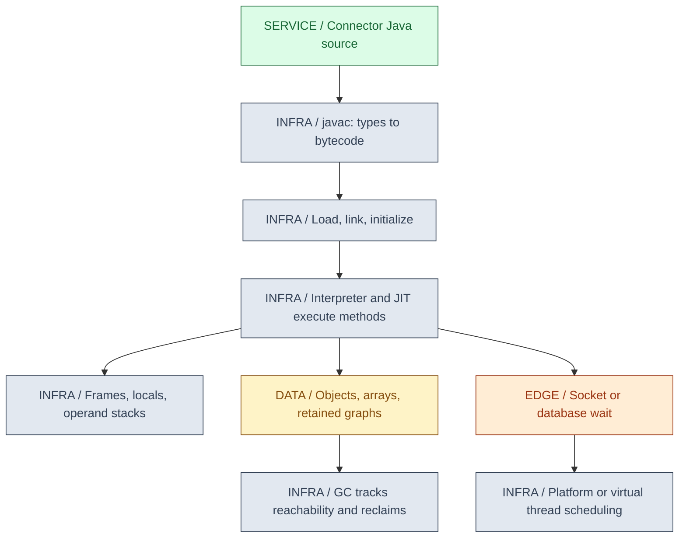
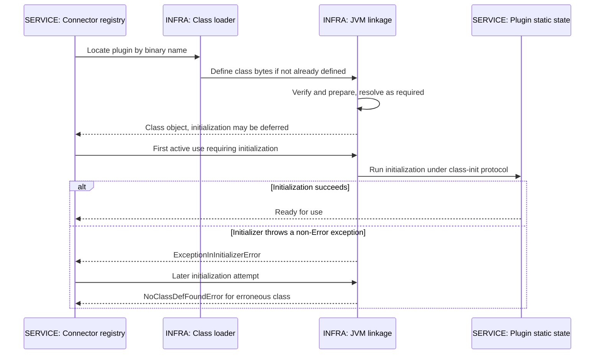
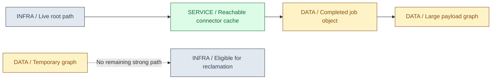
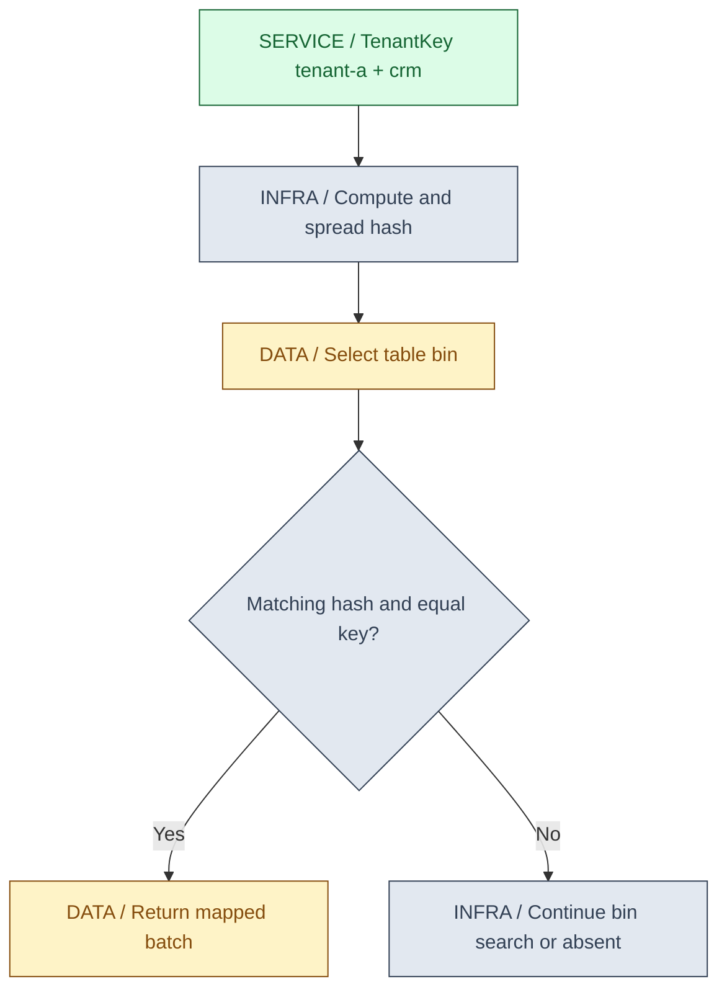
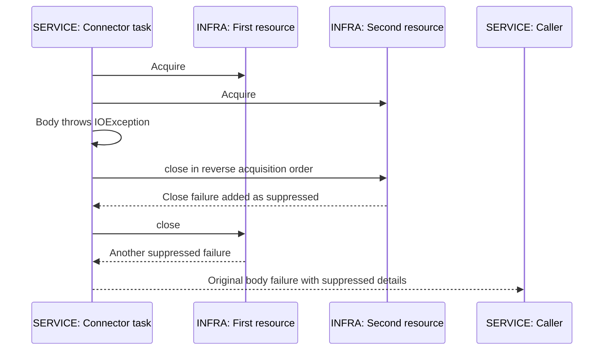
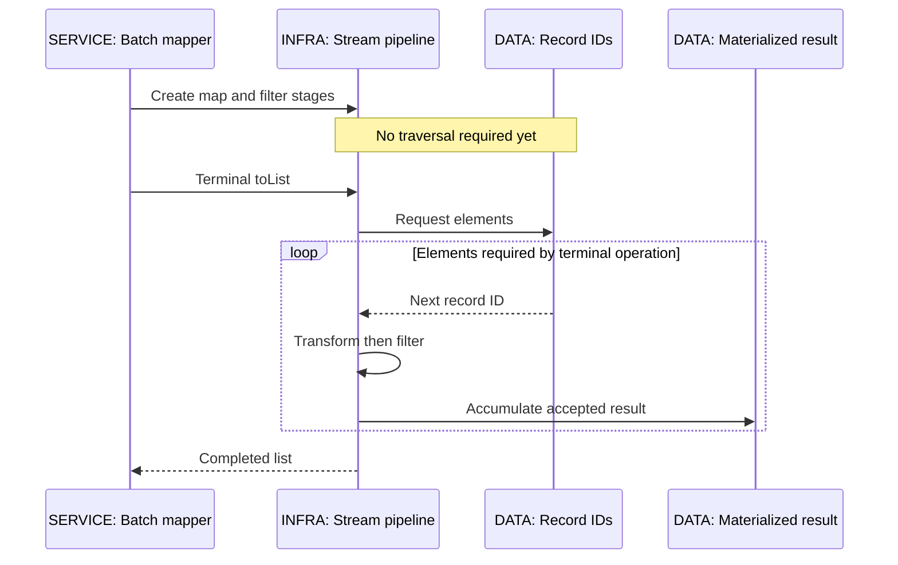
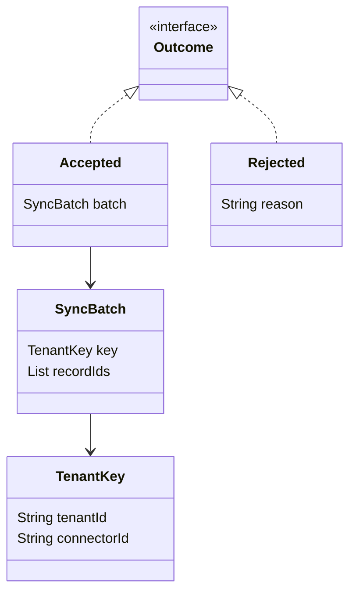
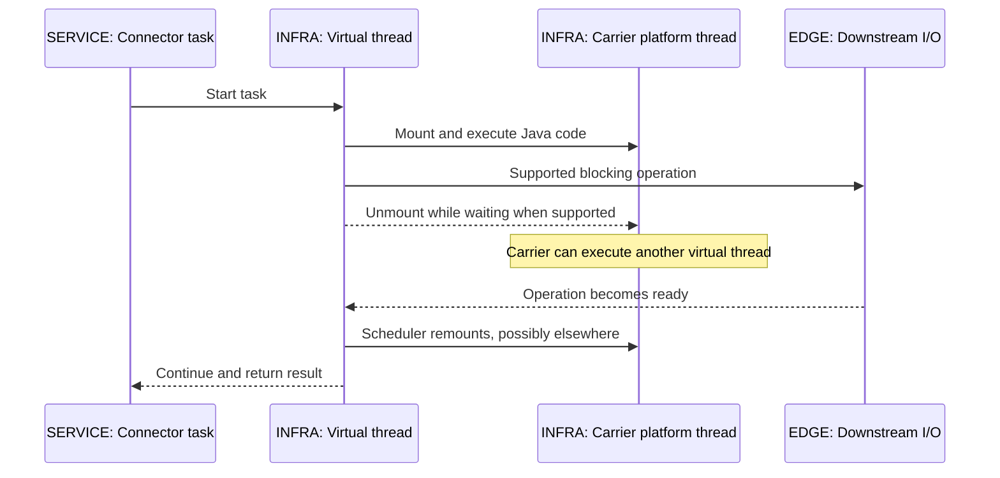

<a id="ch01-java-jvm"></a>
# 01 / Core Java and the JVM

**From source code to a running connector.** This chapter explains the runtime and language contracts behind IntegrationHub's Java services. IntegrationHub is fictional. Its deployment, workload and incidents here are teaching scenarios, not measured production evidence.

**Version assumptions:** examples target Java 21 without preview features, using an OpenJDK/HotSpot mental model where implementation details matter. Java 25 is the latest LTS in the Oracle roadmap consulted on 2026-10-05; LTS is a vendor support commitment, not a different language specification. The reference system retains Spring Boot 4.0.x / Spring Cloud 2025.1.x, Kubernetes 1.34, PostgreSQL 17 and Kafka 4.x as illustrative families from Chapter 00. None is required or executed for this chapter; it introduces no new Spring dependency pairing. The family-level Spring compatibility check is recorded in [00](00-master-map.md#ch00-master-map).

**[VERIFY: before using these examples in a service, check the chosen JDK vendor's current patch/support policy and the exact Spring Boot system requirements and Spring Cloud compatibility matrix. Java 25 LTS status was checked against the Oracle roadmap; the runnable source deliberately remains Java 21.]**

**Execution status:** NOT EXECUTED. No JDK compiler was found on PATH, in JAVA_HOME, or in the common installed-JDK locations checked. Two complete source labs and an offline runner are provided under the guide's `code/01-java-jvm/` directory. Compilation, runtime assertions, GC observations and throughput are not claimed. The runner recorded the missing-JDK condition. Mermaid diagrams are rendered as embedded SVG in the published guide; that successful rendering is separate from Java execution.

## Big Picture



The diagram separates compilation, runtime execution, memory lifetime and waiting. These interact, but solving one does not solve the others: a faster collector cannot repair an unbounded cache, and virtual threads cannot fix a CPU-heavy field-mapping algorithm.

## What You Will Be Able to Explain

- Trace a connector from source compilation through class loading, initialization and method execution.
- Distinguish language/JVM guarantees from HotSpot choices, and heap pressure from total process-memory pressure.
- Explain HashMap lookup, equality, resize and collision handling without treating implementation thresholds as API guarantees.
- Use generic bounds, resource ownership, immutable value carriers and Streams without hiding unsafe casts or side effects.
- Explain records, sealed hierarchies and pattern matching as design tools rather than syntax trivia.
- Describe what virtual threads release while waiting, what they still consume, and what changed after Java 21.

> [!PRODUCTION]
> **Where this lives in IntegrationHub.** The [request journey](00-master-map.md#ch00-master-map) reaches a Java connector that validates tenant-scoped keys, loads connector implementations, transforms a batch and waits on external I/O. [Spring proxies](03-spring.md#ch03-spring) build on runtime types; [JPA](04-jpa.md#ch04-jpa) retains entity graphs; [concurrency](02-concurrency.md#ch02-concurrency) determines safe sharing; [container limits](15-kubernetes.md#ch15-kubernetes) constrain the entire process. Use [23](23-jvm-performance.md#ch23-jvm-performance) for actual profiling rather than guessing from these diagrams.

<a id="ch01-versions"></a>
## 1. Java 8 to the Current LTS: Keep Three Versions Separate

A service has a **source/API target**, a **build JDK**, and a **runtime JDK**. A newer compiler can target an older supported release with `--release`, which constrains language and platform API use as well as class-file targeting. It cannot make an independently compiled third-party library compatible with that target. Maven or Gradle toolchains and CI must agree with the deployment image; their mechanics belong in [16](16-delivery.md#ch16-delivery).

**Why it matters:** a developer may compile a connector on a newer JDK while the image still runs an older one. The class loader can reject an unsupported class-file version before the request handler runs. Separately, a dependency compiled against a method absent at runtime can fail with a linkage error even if your own source looks compatible.

| Release milestone | Useful capabilities to recognize | Use when | Avoid when |
|---|---|---|---|
| 8 | Lambdas, functional interfaces, Streams, default interface methods, java.time | Reading existing enterprise code and reasoning about its contracts | Assuming modern record or virtual-thread syntax is available |
| 11 | LTS migration context; standard HTTP client; local-variable type inference arrived in 10 | Maintaining services pinned to a compatible supported distribution | Treating `var` as dynamic typing or overlooking module-era access restrictions |
| 17 | LTS baseline including records, finalized in 16, and sealed classes, finalized in 17 | Modeling values and controlled hierarchies in supported services | Assuming Java 21 pattern-switch and virtual-thread APIs are present |
| 21 | Virtual threads, record patterns, pattern matching for switch, sequenced collections | This guide's no-preview example baseline | Assuming all preview features in 21 are stable APIs |
| 25 | Current LTS context; includes the earlier Java 24 monitor-pinning change | Planning an upgrade with library, agent and runtime validation | Treating a new LTS as a reason to skip regression or load testing |

**[VERIFY: release-specific feature claims should be checked against JEPs 286, 395, 409, 431, 440, 441 and 444 and the chosen release documentation. A feature being available does not mean its related preview APIs are stable; this chapter uses no preview APIs.]**

**Mechanism:** compiler checks source -> emits bytecode and metadata -> runtime validates the class format -> resolves referenced types/members -> executes under that runtime's implementation. Changing the runtime can change GC/JIT behavior without changing the Java source contract. The big-picture diagram shows these separate stages.

**Trap:** `var` infers a static type from an initializer; it does not allow the variable to accept unrelated types later. A runtime upgrade also does not enable newer source syntax when the compiler target remains 21.

**Interview check:** "We compiled with Java 25. Can we deploy on 21?" Answer: only if the application and all runtime dependencies are compatible with 21, the application was compiled to that target, and the deployed behavior was tested. A successful build on 25 alone proves none of those together.

<a id="ch01-jvm-architecture"></a>
## 2. JVM Architecture: What Executes the Method?

The **JDK** provides development tools such as the compiler alongside runtime components. The **JVM** is the abstract execution machine specified by the JVMS, with implementations such as HotSpot. A runtime image supplies the VM and required libraries; modern packaging does not require a separately installed desktop JRE. A JAR is an archive of classes/resources, not a prestarted JVM.

In IntegrationHub, a connector's field-mapping method begins as bytecode. An interpreter can execute that bytecode, while HotSpot gathers execution profiles and may compile frequently executed code into machine code. Calls may be inlined; optimizations depend on assumptions about observed types and control flow. If an assumption stops holding, deoptimization can return execution to a less optimized form while preserving Java semantics.

The point is not "Java is interpreted" versus "Java is compiled." Both can participate during one process lifetime. A tiny loop timed at startup may measure loading, compilation, allocation or timer effects instead of the steady-state operation. Benchmark methodology belongs in [23](23-jvm-performance.md#ch23-jvm-performance); this chapter presents no timings.

### Method Invocation Trace

- A caller evaluates arguments. Java passes their values, including reference values.
- Method resolution establishes the referenced member; virtual dispatch selects an implementation based on the actual receiver where applicable.
- The abstract execution model creates a frame with local-variable storage and an operand stack. These are distinct from the collection class named Stack.
- Bytecode computes values, invokes methods and may allocate objects. Physical implementation can optimize away some allocations/frames while preserving observable behavior.
- Normal return passes a result to the caller; exceptional completion searches for a matching handler and unwinds as needed.

The big-picture diagram's execution/stack/heap branches are this trace. Inlining does not mean source methods cease to exist semantically. The runtime retains information needed for deoptimization and diagnostics, although a sampled profile is not a complete history of every invocation.

> [!MECHANISM]
> **Pass-by-value, including references.** A method receives a copy of the caller's reference. It can mutate an object both references identify, but assigning its parameter to another object does not reassign the caller's variable. CoreJavaLab.changeReference checks both behaviors. Returning a mutable object can still leak ownership even though parameter passing is by value.

**Use when / avoid when:** use the JVM model to identify which lifecycle or memory boundary failed. Avoid deriving performance numbers or physical object layouts from the abstract frame model. A Java reference is not a contract exposing a fixed memory address.

**Production case:** a newly rolled-out Pod has different latency from a warmed process. Separate startup/class loading, dependency initialization, JIT warm-up and actual downstream waits. Do not disable the JIT or multiply replicas based on a single short startup sample.

**Interview check:** "Why does warm-up matter?" Answer: the runtime may load classes, collect profiles and compile/optimize code over time. A representative measurement needs a controlled workload and measurement phase, not simply an arbitrary sleep.

<a id="ch01-class-loading"></a>
## 3. Loading, Linking and Initialization Are Different Events

**Why they exist:** Java can discover and load code at runtime while still checking format, types, access and linkage. The runtime must distinguish merely knowing a class from executing that class's initialization side effects.

**Loading** obtains a binary representation and creates a runtime class. **Linking** includes verification, preparation and resolution. Verification checks constraints on the class and bytecode; preparation creates static fields with default values. Resolution translates symbolic references into runtime entities and may happen lazily. **Initialization** runs the class initialization procedure, including its static initialization logic. Constant-variable rules are special; do not reduce the complete specification to "every static read runs a static block."

Runtime class identity includes the **binary name and defining class loader**. Two plugin loaders can define different types with the same printed name. A ClassCastException between apparently identical names is therefore possible. The default ClassLoader delegation model generally checks parents before defining a class itself; custom frameworks may use different delegation policies. Do not claim that every loader in every environment follows an unconditional parent-first law.



The JVM coordinates initialization across threads. A thread can wait for another thread to finish initialization; slow or cyclic initialization dependencies can obstruct startup. Initializing a class also initializes its superclass and specified superinterfaces as required by the specification, not every interface it happens to reference.

Calling `Class.forName` with initialization disabled demonstrates loading without requesting initialization. Creating an instance or invoking an appropriate static method requires initialization. Reading an inlined constant may not. Do not put network access in static initializers: failure can poison the class's initialization state for that defining loader, and retrying the business method will not reset it.

### A Complete Initialization Probe

**NOT EXECUTED.** The following complete Java 21 program matches `code/01-java-jvm/LoadingLab.java`. The guide checks source synchronization; that is not Java compilation. Run it in a fresh JVM. The success text is source code, not claimed terminal output.

```java
import java.util.ArrayList;
import java.util.List;

public final class LoadingLab {
    private static final List<String> events = new ArrayList<>();

    static final class Plugin {
        static {
            events.add("initialized");
        }
    }

    static final class BrokenPlugin {
        static final int CONFIG = readConfig();

        private static int readConfig() {
            throw new IllegalStateException("missing teaching configuration");
        }
    }

    public static void main(String[] args) throws Exception {
        ClassLoader loader = LoadingLab.class.getClassLoader();
        Class<?> loaded = Class.forName("LoadingLab$Plugin", false, loader);
        if (!events.isEmpty()) {
            throw new AssertionError("Loading alone must not initialize Plugin");
        }
        Class<?> initialized = Class.forName("LoadingLab$Plugin", true, loader);
        if (loaded != initialized || !events.equals(List.of("initialized"))) {
            throw new AssertionError("One class identity and one initialization");
        }
        Class.forName("LoadingLab$Plugin", true, loader);
        if (events.size() != 1) {
            throw new AssertionError("Initialization must not repeat");
        }
        try {
            Class.forName("LoadingLab$BrokenPlugin", true, loader);
            throw new AssertionError("First initialization must fail");
        } catch (ExceptionInInitializerError failure) {
            if (!(failure.getCause() instanceof IllegalStateException)) {
                throw new AssertionError("Original failure cause is preserved", failure);
            }
        }
        try {
            Class.forName("LoadingLab$BrokenPlugin", true, loader);
            throw new AssertionError("Erroneous class must not initialize again");
        } catch (NoClassDefFoundError expected) {
            System.out.println("LoadingLab: all checks passed");
        }
    }
}
```

### Read the Failure Precisely

| Symptom | Mechanism to investigate | First evidence |
|---|---|---|
| ClassNotFoundException | Explicit dynamic lookup cannot locate a requested class | Requested name, actual runtime classpath/module configuration, loader |
| NoClassDefFoundError | Runtime needs a definition that cannot be made usable; can also mean earlier initialization failed | Earliest causal exception, not only the last retry's stack |
| NoSuchMethodError | Caller and runtime dependency disagree on a member signature | Dependency convergence, deployed artifact, runtime library versions |
| UnsupportedClassVersionError | Runtime does not support the class-file version | Build target and every deployed dependency's bytecode target |
| Same-name ClassCastException | Distinct defining loaders or genuinely different types | Both Class objects and defining loaders |

**Use when / avoid when:** dynamic loading is useful for real plugin isolation or discovery; avoid custom class loaders just to implement a Strategy pattern. IntegrationHub can start with dependency-injected connectors and a factory. [11](11-lld.md#ch11-lld) explains that design; [03](03-spring.md#ch03-spring) explains proxy/lifecycle effects.

**Interview check:** "The class exists in the JAR. Why NoClassDefFoundError?" Answer: existence is insufficient. Inspect the loader/dependency path and the first initialization failure. An erroneous class can fail later uses even though its bytes are present.

<a id="ch01-memory"></a>
## 4. Memory and GC: Follow the Reference, Not Just the Allocation

**Why automatic memory management exists:** code should not manually free every object or access freed storage. The runtime finds objects that are no longer reachable under its reference-processing rules and can reclaim their memory. This does not define when a socket is closed or how much work the service should admit.

The JVM specification defines shared heap and method-area concepts plus per-thread execution areas. HotSpot implements class metadata largely in native-memory Metaspace; that is not a second Java object heap. Class mirror objects and ordinary referenced application data still occupy heap. Platform-thread stacks, JIT code cache, direct buffers and other native allocations also consume process memory.

**Heap limit is not process limit.** Reserving address space, committing memory and resident memory are different observations. Setting the maximum heap close to a Kubernetes container limit leaves insufficient space for nonheap/native usage and can result in process termination. The application need not receive a catchable OutOfMemoryError first. [15](15-kubernetes.md#ch15-kubernetes) owns OOMKilled diagnosis; [23](23-jvm-performance.md#ch23-jvm-performance) owns memory measurements.



This is a reachability sketch, not a promise of immediate reclamation. A completed job can remain strongly reachable through a cache, listener, queue, static registry or thread-local value. The collector is correct to retain it even when the business no longer needs it: that mismatch is a common Java memory leak.

### Allocation-to-Reclamation Trace

- The request constructs a payload/DTO graph; the runtime allocates storage unless optimization can eliminate the physical allocation while preserving semantics.
- Locals, fields and container entries keep references. Losing one local reference does not remove all other paths.
- A tracing collector discovers live objects from its root model and handles mutations during concurrent phases with implementation-specific barriers/protocols.
- Unreachable objects become reclaimable. Depending on the collector, survivors may be copied or relocated and references updated, or space reclaimed differently.
- New allocations use reclaimed capacity. An object being eligible does not promise a particular collection time or a returned OS page.

**Generational hypothesis:** many objects die young, so generational collectors can focus effort on young allocations while retaining older survivors. References from older to younger objects require tracking; otherwise a young-only collection could incorrectly overlook a live path. Region-based designs such as G1 are not a literal permanently contiguous "three boxes" drawing of Eden, survivor and old space.

**Pause versus concurrency:** concurrent work overlaps application execution; it does not imply the collector has no pauses or free CPU cost. Throughput, latency and memory overhead are different objectives. Start with a supported default, obtain GC/allocation evidence, then consider a change. No universal best heap size or pause flag follows from this chapter.

| Choice or technique | Use when | Avoid when |
|---|---|---|
| Strong references and explicit bounded caches | Data must remain available while owned; size/expiry/eviction policy is explicit | Retaining every completed sync or its full raw payload indefinitely |
| Weak references | Association must not by itself keep a referent alive | Implementing an authoritative business store or predictable cache policy |
| G1 starting point | A balanced, supported baseline fits the deployment and measured goals | Treating defaults as proof of sufficient latency under any workload |
| Evaluate ZGC | Measured pause objectives justify evaluating its resource trade-offs | Assuming lower pause time means faster business operations or zero overhead |
| Try-with-resources | A resource has deterministic close ownership | Waiting for GC to release scarce sockets or database connections |

**[VERIFY: collector availability/defaults, heap ergonomics, object layout and container-awareness behavior vary by JDK vendor, release and platform. Check the selected runtime's GC tuning guide and actual configuration; do not reuse Java 21 tuning flags blindly on Java 25.]**

**Traps:** setting a local variable to null is rarely a principled fix for an owning collection retaining the same object. Soft references are not a predictable cache-size policy. Finalization is not a resource-lifetime strategy; use explicit ownership and close. String interning can share canonical string instances, but is not a blanket optimization for unbounded tenant data.

**Production trace:** heap occupancy after comparable collections trends upward while completed-job cache cardinality grows. Capture the relevant telemetry and a permitted heap analysis, find retaining paths/dominators, inspect cache eviction, and bound retained history. High allocation rate with stable retained heap is a different problem. Do not infer a leak from one high-utilization sample or forcibly trigger GC as the only test.

**Interview check:** "Can GC collect a cycle?" Yes, a cycle with no retaining path under the collector's reachability rules can be reclaimed; tracing GC is not simple reference counting. "Why is the Pod out of memory when heap looks fine?" Check native/direct/thread/code/metadata usage and the cgroup limit as well as heap, with appropriate measurements.

<a id="ch01-collections"></a>
## 5. Collections Internals: Equality Is Part of Your Data Model

IntegrationHub needs a batch's ordered record IDs, a connector lookup table and perhaps a bounded work queue. Choose their contracts first: order, uniqueness, identity, lookup and mutation patterns, ownership and concurrency. A collection class name alone does not establish safe sharing.

### HashMap: Trace a Lookup

The key's hash helps select a bin; equality distinguishes keys within that search. Equal keys must have equal hash codes; unequal keys can collide. A null return may mean no mapping or a mapped null value for a HashMap, so use the appropriate presence contract rather than assuming all maps disallow null.



In OpenJDK's implementation the table length is a power of two; a spread hash selects a bin via a mask. Nodes store a hash, key, value and linkage. An insertion either replaces a matching key's value or adds an entry. As size exceeds a capacity/load threshold, resizing allocates a larger table and redistributes entries. This costs work and temporary capacity; repeatedly growing large per-request maps can increase allocation pressure.

Tree bins mitigate heavy collisions under qualifying conditions. The common interview shorthand "at eight entries it always becomes a tree" is not an API guarantee and omits capacity and insertion-path details. Do not promise an unconditional logarithmic worst case for arbitrary malicious/non-comparable keys merely because tree bins exist. Sensible keys and bounded input still matter.

**[VERIFY: spread hashing, power-of-two sizing, tree-bin thresholds, resize behavior and tree-bin lookup details are OpenJDK implementation facts, not Map guarantees. Check HashMap.java in the exact JDK source tag when an interview asks for numerical thresholds or implementation complexity.]**

### Mutable-Key Failure, Step by Step

A key enters a map with one equality/hash-relevant state. It is then mutated. A subsequent lookup computes the new state-dependent hash and may search a different bin or fail a stored-hash match. The entry can still be present during iteration but no longer be found by ordinary lookup. This is why merely synchronizing a mutable key does not make it a good key: the identity contract itself changed.

CoreJavaLab uses a validated immutable TenantKey record with tenant and connector ID. A new equal key finds the entry; a different tenant does not. Its CollisionKey intentionally gives two unequal values the same hash to prove collision is not equality, not to recommend constant production hashes.

For entity keys, consider lifecycle carefully: a generated database ID appearing after insertion can change equals/hashCode behavior. [04](04-jpa.md#ch04-jpa) owns entity identity and persistence-specific choices. Record auto-generated equality is convenient only when its components describe the identity you intend.

### Other Structures and Their Costs

| Structure | Mechanism | Use when | Avoid when |
|---|---|---|---|
| ArrayList | Resizable reference array; constant-time indexed access, amortized append, shifts for middle changes | Ordered batches with scans/appends/indexing | Assuming every insertion is cheap or resizing has no allocation cost |
| LinkedList | Linked nodes; traversal to an index; local relink after locating a node | A measured need fits its deque/list contract | Choosing it for "fast insertion" while repeatedly searching by index |
| ArrayDeque | Resizable circular array for ends | In-memory stack or FIFO under single-owner/external coordination | Needing null elements, bounded blocking admission, or concurrent safety without coordination |
| HashMap / HashSet | Hash-bin lookup; HashSet delegates membership storage to a map | Lookup/uniqueness without sorted order | Depending on iteration order or mutating key identity |
| LinkedHashMap | Hash lookup plus linked encounter order; optional access order | Stable iteration or a carefully implemented local eviction policy | Assuming access-order reads are structurally read-only or thread-safe |
| TreeMap / TreeSet | Ordered tree governed by comparison | Sorted/range operations | A comparator inconsistent with intended key identity |
| ConcurrentHashMap | Concurrent access with atomic per-key operations | Shared lookup/update with a suitable per-key contract | Assuming several separate calls or keys form one transaction |

HashMap has no promised iteration order. A fail-fast iterator's ConcurrentModificationException is best-effort bug detection, not a concurrency protocol. Wrapping a collection as unmodifiable prevents mutations through that view; it does not necessarily take a snapshot or deeply freeze elements. `List.copyOf` gives an unmodifiable shallow snapshot and rejects null elements. Mutable element state still needs ownership discipline.

**Production case:** a tenant ID is omitted from a cache key, so different tenants with the same connector ID share an entry. This is a data-model/security failure, not a collision bug. Equal strings are supposed to compare equal; include the complete authorized scope in the key and validate cross-tenant negative cases in [19](19-testing.md#ch19-testing).

**Interview check:** "Why not ConcurrentHashMap everywhere?" It has a concurrency contract and costs, not automatic business atomicity. A thread-confined map needs no concurrent coordination; a check-then-act across multiple shared entries still needs a larger design. Detailed concurrent collections belong in [02](02-concurrency.md#ch02-concurrency).

<a id="ch01-generics"></a>
## 6. Generics: Compile-Time Constraints, Not Magic Runtime Containers

**Why they exist:** a connector pipeline should not require unchecked casts at every transform. Generics express relationships between input and output types and reject many invalid programs before execution. They also improve API contracts for callers.

Generic types are normally invariant: a list of Integer is not a list of Number, because a writable Number list could accept a Double. Wildcards describe constrained views. A producer with an upper bound can yield values usable as that bound; a consumer with a lower bound can accept values of that lower-bound type. This is **producer extends, consumer super**, relative to how this operation uses the parameter, not a label permanently attached to a collection.


CoreJavaLab.copyNumbers declares a descriptive type parameter bounded by Number, an `extends` source and a `super` destination. In its call, Integer elements flow to a Number list without an unchecked cast. From an upper-bounded wildcard list, adding an arbitrary Number is unsafe because the actual list might be Integer-only. From a lower-bounded view, reading gives only the safely known Object type unless further information is available. A wildcard is not general permission to mix types.

### Erasure Trace

- The compiler checks type arguments and constraints at call sites.
- It emits erased method/type representations, retaining generic signature metadata where specified; "erased" does not mean every trace of generics disappears from class files.
- It inserts casts where needed and can generate bridge methods to preserve overriding behavior after erasure.
- Runtime objects do not generally distinguish a list instantiated with String from one instantiated with Integer by reified element type. Arrays, in contrast, have runtime component-type checks.
- Raw types or unchecked boundaries can pollute a collection; the failure may surface later at a compiler-inserted cast, far from the unsafe insertion.

**Use when / avoid when:** use a generic API when it preserves a meaningful relationship across values, such as a typed mapper. Use a named domain type when it clarifies a concrete business contract. Avoid elaborate wildcard signatures that make a simple API harder to consume, and avoid suppressing warnings without isolating and justifying the cast.

**Trap:** `List<?>` is not the same contract as `List<Object>`. The former can represent a list of an unknown element type; the latter promises callers can add any Object. Likewise, primitive type arguments are not available in ordinary Java 21 generics; boxing adds objects/indirection and null-unboxing risks. Specialized primitive Streams can avoid boxing for suitable numeric operations.

**Production case:** raw payload mapping puts a numeric identifier into a collection assumed to contain strings. Serialization fails later or silently coerces the wrong shape. Keep untrusted JSON/schema validation at the [integration boundary](13-integration.md#ch13-integration), not hidden behind a generic cast. Generics validate Java typing, not a remote system's data.

**Interview check:** "Does type erasure mean no runtime casts?" No. The compiler often inserts casts at typed retrieval sites; erasure is one reason heap pollution can be detected late.

<a id="ch01-exceptions"></a>
## 7. Exceptions and Resource Ownership

**Why exceptions exist:** a method must signal failure without pretending it produced a valid value. The caller needs both the failure category and a preserved causal path. Java distinguishes checked exceptions, unchecked RuntimeExceptions and Errors; checking is a compiler rule about handling/declaring, not a reliable taxonomy of retryable versus permanent failures.

Checked exceptions can make a recoverable condition explicit at an API boundary. Unchecked exceptions can express invalid arguments or a domain/framework failure contract without declarations everywhere. An Error generally signals a condition ordinary business code should not casually catch and continue from. Do not turn every Throwable into "try again."

### Body Failure Plus Close Failure



Try-with-resources closes successfully initialized resources in reverse order. If the body already failed, subsequent close failures are suppressed on the primary exception. If acquisition of a later resource fails, previously acquired resources still close. If no body failure exists, a close failure can become the primary failure. Preserve this information when translating exceptions.

CoreJavaLab.resourceFailures constructs two AutoCloseable resources whose close methods deliberately throw. It checks the body exception, close order and suppressed exceptions. These are simulated resources, not real file descriptors; the test isolates language behavior.

| Policy | Use when | Avoid when |
|---|---|---|
| Propagate a checked exception | The caller can meaningfully choose recovery and the contract should require attention | Declaring generic Exception across every layer without semantic value |
| Translate with the original cause | A lower-level failure must cross a domain/API boundary | Replacing the stack/cause with only the message text |
| Try-with-resources | This scope owns an AutoCloseable lifetime | Closing a shared resource that this scope merely borrowed |
| Return an explicit domain outcome | Rejection is an expected business alternative | Encoding transport failure as an apparently successful empty result |
| Catch at a task/request boundary | You can map/report failure and complete that unit coherently | Logging and continuing with corrupted or partially initialized state |

**Interrupts:** blocking APIs can report interruption through InterruptedException and clear the interrupt status. Propagate the exception when your contract allows it. When translating it and not rethrowing it directly, usually restore the status so higher-level cancellation can observe it. Whether to stop, retry or translate is a policy decision; swallowing interruption in an endless loop defeats shutdown.

**Traps:** a return or throw in finally can mask an earlier result or exception. Logging the same failure at every layer creates noise without extra evidence. Catching Exception does not catch Error; catching Throwable and ignoring it is rarely a recovery strategy. Retryability depends on the operation and external-effect uncertainty, not merely the exception superclass.

**Production case:** a connector catches an I/O failure and returns an empty batch, advancing a checkpoint as if there were no source records. Silent data loss follows. Keep "source returned no records" separate from "source could not be read" and connect error policy to [batch restartability](07-messaging.md#ch07-messaging) and [API error contracts](05-apis-realtime.md#ch05-apis-realtime).

**Interview check:** "Why is a close failure missing from the main message?" It may be suppressed on a primary failure. Inspect `getSuppressed()` and preserve causes; do not infer that close succeeded from the top-level message alone.

<a id="ch01-functional-streams"></a>
## 8. Functional Java and Streams: A Description of Work Is Not Work Done

Functional interfaces describe a single abstract operation, such as transforming, testing or consuming a value. A lambda supplies its implementation; a method reference is another way to express a compatible operation. Captured local variables must be final or effectively final, but the objects those references identify may still be mutable. A captured ArrayList is not made thread-safe by appearing in a lambda.

Streams describe a pipeline over a source. They do not store another copy of the collection by definition. Intermediate operations typically build a lazy pipeline; a terminal operation drives traversal. Stateless stages such as map/filter can be fused, while stateful operations such as sorted or distinct may need buffering/bookkeeping. Short-circuiting operations may consume only part of a source.



An important nuance: the implementation can eliminate work when it can derive the result without executing a stage, within the Stream contract. A count on a known-size source can make a debugging peek misleading. Side effects in intermediate stages are therefore not a reliable business protocol. Use explicit operations and contracts for required effects, not "this lambda ought to run."

CoreJavaLab.genericsAndStreams uses a deliberately sequential diagnostic map with a tiny side-effect list to observe traversal with toList. The chapter does not generalize that trace to optimized count or parallel execution. The same method checks single-use behavior, an unmodifiable result and duplicate-key failure in toMap.

### A Pipeline Walkthrough

For three synthetic record IDs, strip surrounding spaces, discard empty IDs, normalize the remainder with an explicit locale, then materialize. The domain policy determines whether normalization is valid: external IDs are often case-sensitive, so IntegrationHub must not uppercase real identifiers just because the teaching probe does. The test's uppercase conversion is a visible transformation, not a connector rule.

For grouping, use a collector that owns its accumulation/combination instead of mutating an external shared map from a parallel lambda. Reductions require an appropriate identity and associative combination when partitioning work; subtraction is not a valid interchangeable associative combiner. A merge function for duplicate keys is a business decision, not an arbitrary way to silence an exception.

| Technique | Use when | Avoid when |
|---|---|---|
| Plain loop | Control flow, early exit, checked failures or required effects are clearer | Repeating a declarative transform more obscurely out of habit |
| Sequential Stream | A bounded transformation/filter/group pipeline is readable and testable | Hiding retries, transactions or remote side effects inside map/peek |
| Parallel Stream | Sufficient CPU-bound, splittable work with valid reduction and measured benefit | Blocking connector HTTP calls, thread-local transaction assumptions, or shared mutable accumulation |
| Stream.toList | An unmodifiable result matches the API | Assuming you can append, or assuming deep element immutability |
| Collect to a specified collection | The caller needs a chosen mutable collection contract | Relying on an unspecified collector implementation type |
| Optional return | Absence is a legitimate result | Replacing error information with empty, or blindly calling get |

**[VERIFY: parallel Stream scheduling/pool interactions, optimization behavior and collection-return contracts must be checked against the chosen JDK's Stream API and implementation. Do not treat the common-pool execution pattern as a universal caller-controlled executor contract.]**

**Resource trap:** collection-backed Streams generally do not own external resources, but an I/O-backed Stream can. Close an owned `Files.lines` stream deterministically. A terminal operation does not universally mean the underlying I/O resource has been closed. Materializing all rows can also defeat streaming's memory benefit; bound batches and checkpoints in [13](13-integration.md#ch13-integration).

**Production case:** parallelStream invokes blocking provider calls, consumes shared execution capacity, loses assumed thread-local context and overloads a rate-limited provider. Choose an explicit concurrency/admission policy rather than a one-word parallelization change. [02](02-concurrency.md#ch02-concurrency) and [10](10-system-design.md#ch10-system-design) cover the execution and resilience boundaries.

**Interview check:** "Why did peek not log every record?" The pipeline may not have been consumed, may short-circuit, or may be optimized so the stage is unnecessary. Logging via peek is not proof of complete business processing.

<a id="ch01-values-patterns"></a>
## 9. Records, Sealed Types and Pattern Matching

**Why these features exist:** a batch envelope is data with an invariant; a processing outcome is a constrained alternative; reading that alternative should not require repeated casts. These are different modeling needs, even though their syntax often appears together.

A record defines a transparent carrier with component fields, accessors and generated value-oriented members. It is implicitly final and its component fields are final. A compact constructor can validate and defensively transform constructor arguments. This is **shallow immutability** unless component values themselves have the required immutability/ownership behavior. A record containing a mutable list can expose mutations; an array component also has array equality semantics unless explicitly handled.

CoreJavaLab.SyncBatch uses List.copyOf so callers cannot mutate its list through either the original list or the returned list reference. Strings in that list are immutable, making this particular element contract simple. If the list held mutable payload objects, the copy would not freeze them. Constructor validation rejects bad IDs before a key enters a map.



This is a small Java model, not the persistence schema or job-lifecycle state machine. Sealed Outcome permits Accepted and Rejected; the record implementations are final. A sealed hierarchy limits direct implementations according to the language's package/module rules. Permitted subtypes must choose final, sealed or non-sealed behavior as applicable; a non-sealed branch intentionally reopens extension.

Pattern matching tests and binds a value with a type/shape. In the lab's describe method, a switch covers both permitted outcomes and record patterns bind their components. Adding another direct alternative forces a useful exhaustiveness review at compilation in this closed setup. Pattern matching does not validate arbitrary business invariants or make a remote JSON schema automatically compatible.

Null remains a design decision. The lab rejects a null outcome explicitly before switching. If an API intentionally accepts null, handle that contract explicitly; an exhaustive list of non-null alternatives is not permission to ignore null. Dominated cases and guards also affect which pattern can match; clearer ordering beats clever patterns.

| Model | Use when | Avoid when |
|---|---|---|
| Record value carrier | Components define the data, equality and exposed contract | Mutable identity/lifecycle or representation hiding is essential |
| Ordinary class | Encapsulation, controlled mutation or identity needs custom behavior | Writing boilerplate solely to reproduce a simple value carrier |
| Sealed hierarchy | A bounded set of domain alternatives enables exhaustive reasoning | Third-party connector implementations must extend an open SPI freely |
| Open interface with implementations | Plugin extensibility is part of the contract | You require the compiler to know every implementation |
| Pattern switch | Alternatives and their handling read clearly together | Hiding unchecked assumptions about null, invariants or external schema evolution |

**Production traps:** generated toString can expose sensitive component values, so do not place raw secrets in convenient DTOs and log them. A record is not automatically a suitable JPA entity; entity proxies and lifecycle constraints need separate analysis in [04](04-jpa.md#ch04-jpa). Sealing IntegrationHub's connector SPI prevents the extension model it was meant to support; seal internal outcomes instead, and keep connector strategies open where required.

**Interview check:** "Is every record a good HashMap key?" No. Component equality/hash stability must fit the intended identity. A mutable component can still make a record unsafe as a key, and a secret-bearing record can create logging risks through generated members.

<a id="ch01-virtual-threads"></a>
## 10. Virtual Threads: Cheap Waiting, Not Unlimited Work

**Why they exist:** synchronous request code is easy to reason about, but dedicating an expensive OS-backed platform thread to every mostly-waiting request can limit concurrency. A virtual thread is a Java Thread managed by the runtime and scheduled onto carrier platform threads. The OS schedules those carriers; it does not directly schedule each Java virtual thread.



### Trace the Resources

- The executor creates a virtual thread for the task, rather than borrowing one from a virtual-thread pool.
- While running CPU instructions it needs a carrier and CPU time. Virtual does not mean running without a processor.
- Many supported blocking JDK operations park/unmount the virtual thread while awaiting readiness; not every native/library call has identical behavior.
- Its stack/state and referenced request objects still occupy memory. Cheap waiting can make excessive admitted work consume substantial heap.
- When readiness arrives, the scheduler makes it runnable and mounts it again. A different carrier does not mean a different logical Thread identity.
- Completion/failure must still be observed. Executors do not turn submitted failures into automatically handled business outcomes.

CoreJavaLab.virtualThreadIdentity submits one task and checks Thread.currentThread().isVirtual through a Future with a bounded get wait. It cancels in cleanup and closes the executor. This demonstrates an API/identity contract only; it does not test I/O unmounting, pinning, throughput, or production cancellation. ExecutorService.close can wait for tasks; a timed Future.get alone is not a guarantee that all later cleanup returns within the same deadline.

### Java 21 Versus Later Runtimes

In Java 21, a virtual thread performing a blocking operation while holding a synchronized monitor can pin its carrier; some native/foreign-call situations also prevent unmounting. Long frequent pinning can undermine scalability even though mutual exclusion remains correct. Short in-memory synchronized sections are not automatically a reason for a mass lock rewrite.

JEP 491, delivered in Java 24 and inherited by Java 25, changed monitor handling so synchronized constructs no longer cause that same ordinary monitor-pinning limitation. Native callbacks and other specified cases can remain problematic; it is not a promise that all blocking code now releases carriers. The Java 21 diagnostic property jdk.tracePinnedThreads was removed as part of that change, so copying an old diagnosis command can mislead.

**[VERIFY: pinning and diagnostic claims are version-sensitive. Check JEP 444 for Java 21 and JEP 491 for the Java 24 change, plus the exact deployed vendor build and library/native-call path. Both JEPs were consulted for this chapter; no pinning experiment was executed.]**

> [!TRAP]
> A virtual thread does not create a new database connection, downstream quota, CPU core or durable transaction. IntegrationHub must bound admitted work and concurrent resource use. A semaphore can limit active calls but an unbounded number of tasks waiting on that semaphore can still exhaust memory. Admission limits and deadlines belong outside the scarce-resource boundary too.

| Execution model | Use when | Avoid when |
|---|---|---|
| Virtual thread per task | Many independent blocking-style tasks spend time waiting and libraries cooperate | CPU throughput is the bottleneck or unlimited admission hides a queue in memory |
| Bounded platform-thread executor | CPU work or legacy/library constraints require controlled execution | One blocked task per thread makes the chosen capacity insufficient for the workload |
| Reactive/event-loop model | End-to-end nonblocking pipelines and streaming/backpressure contracts are valuable | Blocking on the event loop or paying complexity without a requirement |

Do not pool virtual threads merely to make them scarce; limit the resource explicitly. Do not create an expensive per-thread database connection/cache for every virtual thread via ThreadLocal. Thread-local values belong to the logical virtual thread, not whichever carrier runs it; propagation of request/transaction/trace context to new tasks still needs an explicit policy.

**Production case:** after enabling virtual threads, the service accepts much more waiting work, yet throughput stays bounded by a downstream quota and heap rises. Inspect in-flight requests, queue/admission limits, retained request size, database pool wait and remote latency. The solution is not necessarily more carriers. [02](02-concurrency.md#ch02-concurrency), [05](05-apis-realtime.md#ch05-apis-realtime) and [23](23-jvm-performance.md#ch23-jvm-performance) provide the deeper execution, reactive and sizing tools.

**Interview check:** "Will virtual threads make JSON transformation faster?" Not by themselves. They improve how compatible waiting work consumes OS threads; CPU work still needs CPU and may need a different bounded execution strategy.

<a id="ch01-code"></a>
## Lab Contracts and Evidence

The files below accompany this chapter in `docs/java-fs-guide/code/01-java-jvm/`. They require only an existing JDK 21+, not Maven downloads, Spring or a running database. The runner accepts an existing JDK path and compiles with the Java 21 release target. It records PASS, FAIL or NOT EXECUTED; in this environment the recorded result is **NOT EXECUTED**.

| Lab | Contract checks present in source | What it does not prove |
|---|---|---|
| CoreJavaLab.java / valuesAndCollections | Defensive snapshot, mutation rejection, record equality, tenant-scoped key lookup, deliberate hash collision, pass-by-value, sealed result handling | Security authorization, distributed idempotency, map performance or shared-state concurrency |
| CoreJavaLab.java / genericsAndStreams | Variance transfer, laziness, sequential diagnostic traversal, single-use stream, result mutation rejection, duplicate-key collector failure | Parallel safety or scheduling, bulk-sync memory bounds, external schema validity |
| CoreJavaLab.java / resourceFailures | Reverse close order, primary and suppressed exceptions | Real socket, file or connection-pool cleanup |
| CoreJavaLab.java / virtualThreadIdentity | Virtual-thread identity through observed Future result | Pinning, I/O unmounting, scheduling fairness, bounded production latency |
| LoadingLab.java | Loading versus initialization; once-only initialization; first failure versus erroneous-class reuse | Plugin isolation, all linkage failures, class-loader leaks or concurrent initialization deadlock |

No expected console transcript is presented as an observation. The chapter's inline LoadingLab listing must stay byte-equivalent after newline normalization to its runnable source. Application checks remain unexecuted until a JDK is available. GC timing and JIT behavior require dedicated measured experiments rather than assertions that rely on nondeterministic collection timing.

<a id="ch01-concept-index"></a>
## Explained-Here Index and Sources

| Concept | Owning section |
|---|---|
| Java release/API/runtime targeting | [Version boundaries](#ch01-versions) |
| JVM architecture, JIT and pass-by-value | [Runtime execution](#ch01-jvm-architecture) |
| Class loaders, linking and initialization failure | [Class lifecycle](#ch01-class-loading) |
| JVM memory, GC, reachability and retained graphs | [Memory and GC](#ch01-memory) |
| Collections, equals/hashCode and map internals | [Collections](#ch01-collections) |
| Generics, variance, erasure and heap pollution | [Generic contracts](#ch01-generics) |
| Exceptions, suppression and resource ownership | [Failure contracts](#ch01-exceptions) |
| Lambdas, functional interfaces, Streams and Optional | [Functional pipelines](#ch01-functional-streams) |
| Records, sealed types and pattern matching | [Value and alternative modeling](#ch01-values-patterns) |
| Virtual threads, carriers and pinning | [Waiting and resource bounds](#ch01-virtual-threads) |
| Runnable source and execution limitations | [Lab contracts](#ch01-code) |

Primary references consulted for volatile/current claims: [Oracle Java support roadmap](https://www.oracle.com/java/technologies/java-se-support-roadmap.html), [JVMS 21 loading/linking/initialization](https://docs.oracle.com/javase/specs/jvms/se21/html/jvms-5.html), [JEP 444 virtual threads](https://openjdk.org/jeps/444), and [JEP 491 monitor pinning](https://openjdk.org/jeps/491). Further authoritative references for the mechanisms are the [JVMS runtime areas](https://docs.oracle.com/javase/specs/jvms/se21/html/jvms-2.html), [Java 21 API](https://docs.oracle.com/en/java/javase/21/docs/api/index.html), [JLS generics/types](https://docs.oracle.com/javase/specs/jls/se21/html/jls-4.html) and [JLS exceptions and resource statements](https://docs.oracle.com/javase/specs/jls/se21/html/jls-14.html). The latter are reading references, not a claim that every page was fetched or every platform-specific behavior executed during this review.

## Related Chapters

Return to the [master request journey](00-master-map.md#ch00-master-map), then continue to [02 Concurrency](02-concurrency.md#ch02-concurrency). Runtime types feed [03 Spring](03-spring.md#ch03-spring); equality and retention affect [04 JPA](04-jpa.md#ch04-jpa). Waiting crosses [21 Network/OS](21-network-os.md#ch21-network-os); nonblocking alternatives are in [05 APIs](05-apis-realtime.md#ch05-apis-realtime). Apply the patterns in [11 LLD](11-lld.md#ch11-lld), prove them with [19 Testing](19-testing.md#ch19-testing), and measure them in [23 JVM performance](23-jvm-performance.md#ch23-jvm-performance). Generated reciprocal links also cover the other explicitly referenced chapters.

<a id="ch01-cheat-sheet"></a>
## One-Page Cheat Sheet

**Execution:** source/API target, build JDK and runtime JDK are separate. Bytecode can be interpreted and JIT-compiled. Optimizations must preserve language behavior; warm-up is not a benchmark methodology.

**Classes:** load bytes -> verify/prepare -> resolve as needed -> initialize on required use. Class identity includes defining loader. An initial non-Error initializer failure can surface as ExceptionInInitializerError; later use can fail with NoClassDefFoundError.

**Memory:** heap is not total process memory. Follow retaining paths; unreachable cycles can be collected. GC does not deterministically close sockets. Large allocation rate and a growing retained live set are different observations.

**Values and collections:** references are passed by value. Equal keys require equal hashes; collisions need not be equal. Keep key identity stable and tenant-scoped. HashMap is unordered and not a synchronization mechanism. ArrayList is a strong default for bounded batches; choose other structures by contract.

**Types:** generics are invariant; producer extends, consumer super. Erasure can leave signature metadata and inserted casts. Raw types can move a failure away from its cause. Records are shallowly immutable; seal closed alternatives, not an intentionally open connector SPI.

**Failures and Streams:** preserve causes/suppressed exceptions; close owned resources; respect interruption. Streams are lazy and single-use; terminal operations drive consumption. Avoid required side effects in intermediate stages and blocking I/O in uncontrolled parallel pipelines.

**Threads:** virtual threads share carriers while compatible waits suspend; they still consume memory and CPU when running. Bound admission, database use and remote concurrency. Java 21 monitor pinning differs from Java 24/25. No Java lab was executed in this edition.

<a id="ch01-interview"></a>
## Interview Corner

### Basic: How Are JDK, JVM and Bytecode Related?

The JDK supplies development tools and runtime components. javac emits class files containing bytecode and metadata. A JVM loads/links/initializes the classes and executes them, possibly using both interpretation and compiled machine code. Portability still depends on compatible bytecode, libraries and native/runtime requirements.

### Internals: Why Can Two Classes with the Same Name Be Incompatible?

Their defining class loaders may differ. Runtime identity is not the printed binary name alone. Inspect the actual Class objects and defining loaders before blaming a compiler bug.

### Trace/Debug: A Connector Static Initializer Failed Once; Why Do Retries Look Different?

The initial non-Error failure can be wrapped in ExceptionInInitializerError. That runtime class is then erroneous; later initialization attempts can yield NoClassDefFoundError. Find the original cause, fix configuration/initialization design, and establish a fresh valid class lifecycle; retrying a business call is not a class reset.

### Scenario: Should a Plugin Registry Download Secrets in a Static Block?

No. Static initialization couples type readiness to an external dependency and its failure semantics. Use an explicit lifecycle with timeout, authorization, retry policy and observable readiness appropriate to the service. A factory or injected registry is usually clearer than an implicit startup side effect.

### Basic: Is Java Pass-by-Reference?

No. It passes values, including object-reference values. Reassigning a parameter changes that local reference; mutating the shared object can be visible through the caller's reference. Visibility across threads still needs the concurrency contract from Chapter 02.

### Internals: Why Can HashMap Find One of Two Keys with the Same Hash?

Hashing narrows the search; equality identifies the matching key. Collision handling retains distinct unequal keys. A poor hash affects distribution/work, not permission to treat unequal keys as the same mapping.

### Trace/Debug: A Key Appears in Iteration but get Returns Null. What Do You Check?

Check whether fields used by equals/hashCode changed after insertion, whether the lookup key uses the same identity policy, and whether a null mapping is legitimate. Also check unsafe concurrent access. Do not immediately blame resizing or a hash collision.

### Scenario: Which Key Prevents Tenant Cache Mix-Ups?

A stable key containing every dimension of the authorized lookup scope, such as tenant and connector ID. That prevents accidental key aliasing but is not itself authorization. Enforce tenant permission on every access path and test equal connector IDs across different tenants.

### Basic: Can GC Fix a Memory Leak?

It reclaims objects that are reclaimable under reachability/reference rules. It cannot infer that the business no longer wants objects still held by an unbounded cache or listener. Remove or bound the retaining ownership after collecting evidence.

### Internals: Why Can Heap Fit Yet the Container Be Killed?

The container accounts for more than Java heap. Native/direct allocations, metadata, platform-thread stacks, code cache and other process/runtime memory need headroom. Examine container and process evidence rather than setting maximum heap equal to the container limit.

### Trace/Debug: Does a Rising Heap Graph Prove a Leak?

No. Compare live-set/retention behavior across comparable workload and collection conditions, and inspect retaining paths if warranted. Allocation bursts, delayed collection and cache warm-up can raise occupancy without an ever-growing retained graph. Avoid claims from one sample.

### Basic: Why Is List of Integer Not List of Number?

A writable Number list could accept Double and break an Integer list's contract. Use an upper-bounded view when only reading number values and a lower-bounded view for accepting specific values. The appropriate variance depends on the operation.

### Internals: How Can a Generic List Throw ClassCastException on Retrieval?

Raw types or unchecked code may have inserted a value violating the assumed element type. Erasure means that insertion may not check the full generic contract; a compiler-inserted cast at retrieval reveals the pollution. Trace backward to the unchecked boundary.

### Trace/Debug: Both the Work and close Failed. Which Exception Wins?

With try-with-resources, the body failure remains primary and close failures are suppressed, with successfully acquired resources closed in reverse order. Preserve causes and suppressed details when adapting the failure to the domain/API.

### Scenario: Is IOException Always Retryable?

No. Retryability depends on the operation, failure cause, deadlines and whether a remote effect might already have happened. Retrying a non-idempotent write after an uncertain timeout can duplicate effects. Exception inheritance is not an idempotency guarantee.

### Basic: Why Did a Stream Do Nothing?

There may be no terminal operation. Even with one, short-circuiting and permitted optimizations can skip stages/elements. A pipeline describes processing; it is not a queue of guaranteed callback invocations. Inspect the terminal contract.

### Internals: Why Can Parallel Reduction Give the Wrong Answer?

The identity, accumulator or combiner may violate reduction requirements, including associativity, or shared mutable state may race. Splitting and combining work must preserve the intended result. A sequential run looking correct does not prove the parallel contract.

### Scenario: Should a Connector Use parallelStream for HTTP Calls?

Not as a default. Blocking calls, provider limits, retries, deadlines and context propagation require an explicit execution/admission policy. Consider bounded concurrency with a suitable executor or a nonblocking pipeline, and measure the real workload.

### Basic: Does a Record Freeze a List Component?

No. Its field reference is final, but the referenced list or elements may mutate. A defensive unmodifiable snapshot protects the list structure; deep immutability requires an element contract too. Validate nulls and other invariants deliberately.

### Internals: Why Pair a Sealed Hierarchy with Pattern Switch?

The compiler can reason about a controlled set of alternatives and check coverage in a suitable exhaustive switch. Records can expose components to patterns. Null, non-sealed branches and external schema evolution still require explicit decisions.

### Scenario: Should the Connector Interface Be Sealed?

Only if the allowed implementations really are closed. For an extensible connector SPI, an open interface supports plugins; seal internal outcomes or commands whose alternatives the application owns. Match the model to extension requirements.

### Basic: Is a Virtual Thread a Faster OS Thread?

No. It is a Java thread the runtime schedules on carrier platform threads. Compatible waiting can release a carrier; running code still uses CPU. It improves concurrency economics for suitable workloads, not the instruction speed of a computation.

### Trace/Debug: A Virtual-Thread Service Has Low CPU and Growing Latency. What Next?

Inspect downstream wait, pool acquisition, admission/backlog, retained in-flight data and version-appropriate pinning evidence. Name the actual runtime before repeating Java 21 monitor advice on Java 25. Low CPU alone does not prove a scheduler defect.

### Scenario: Does More Waiting Capacity Mean We Can Remove Limits?

No. Each task retains state and competes for finite downstream capacity. Bound admission as well as active calls, apply deadlines, observe completion and cancel appropriately. A semaphore in front of an unlimited population of waiting tasks is not a bounded system.