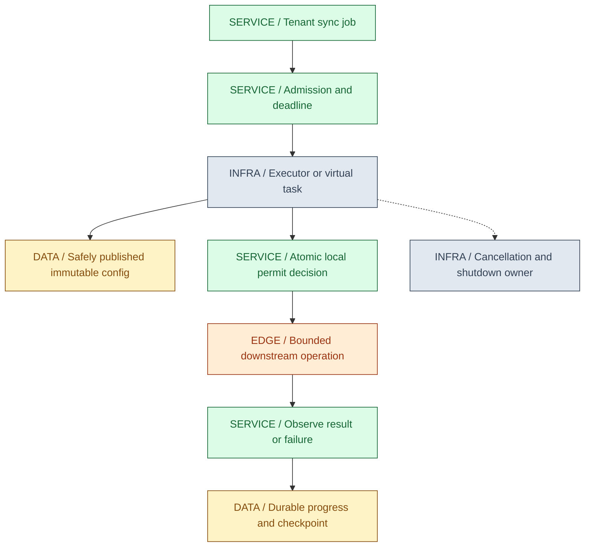
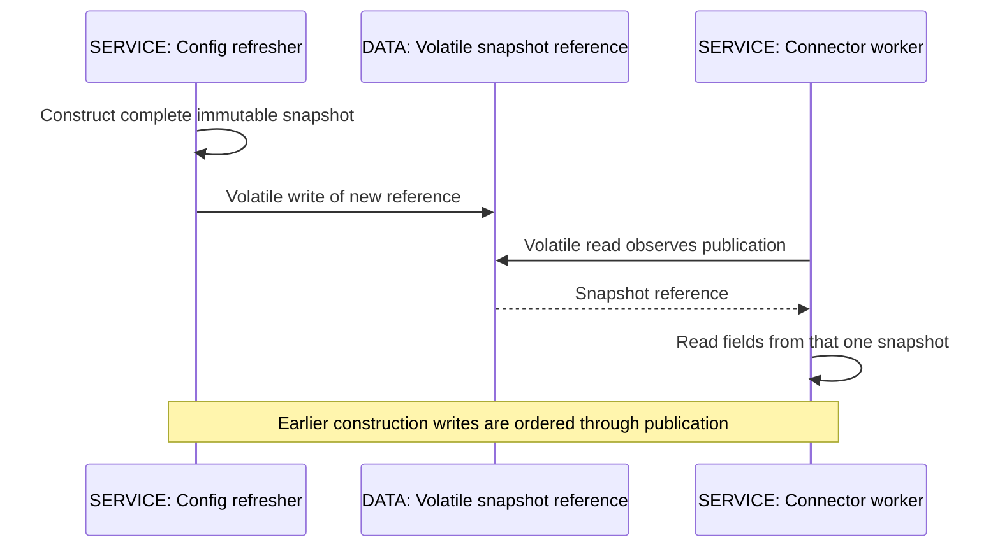
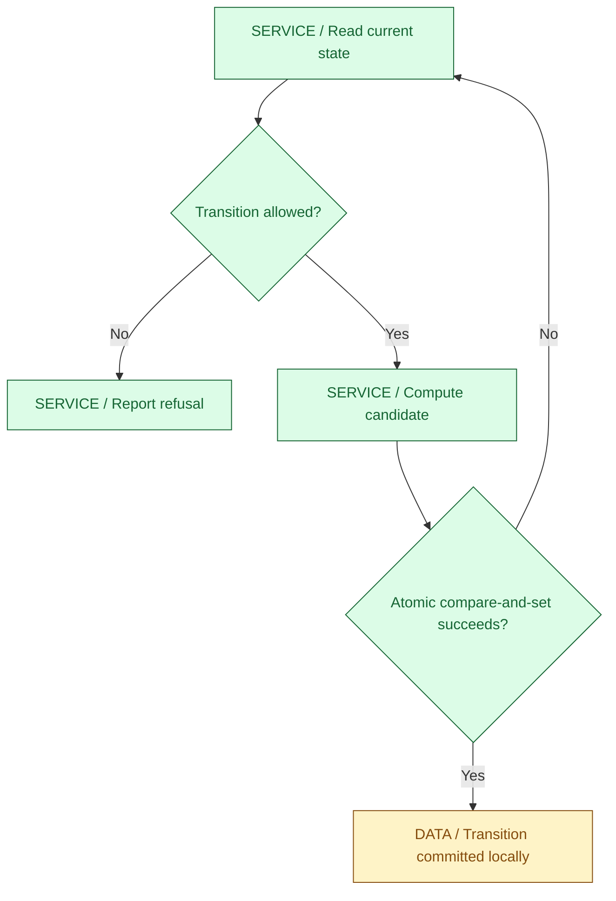
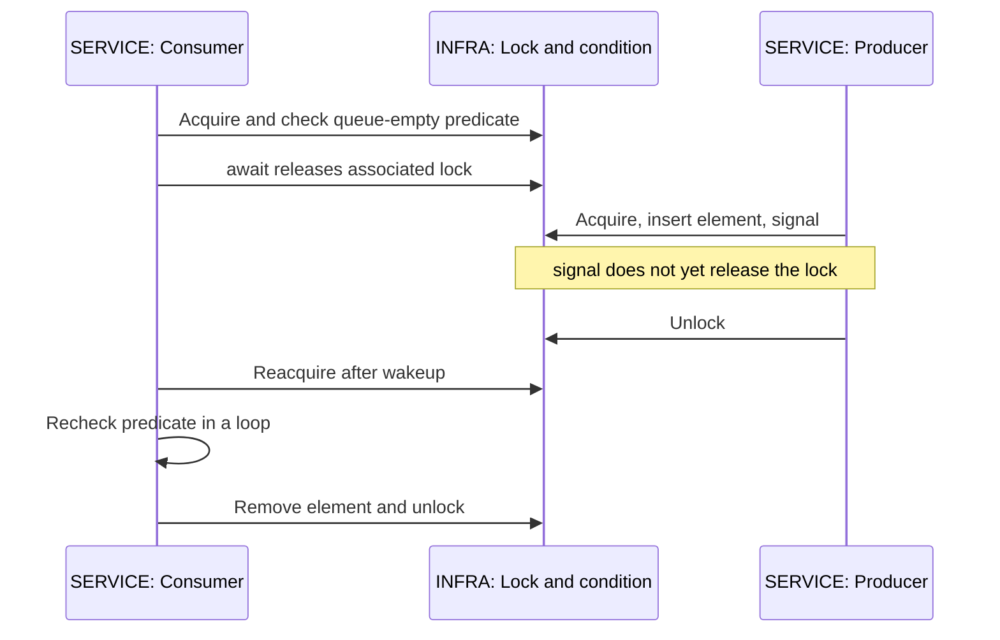
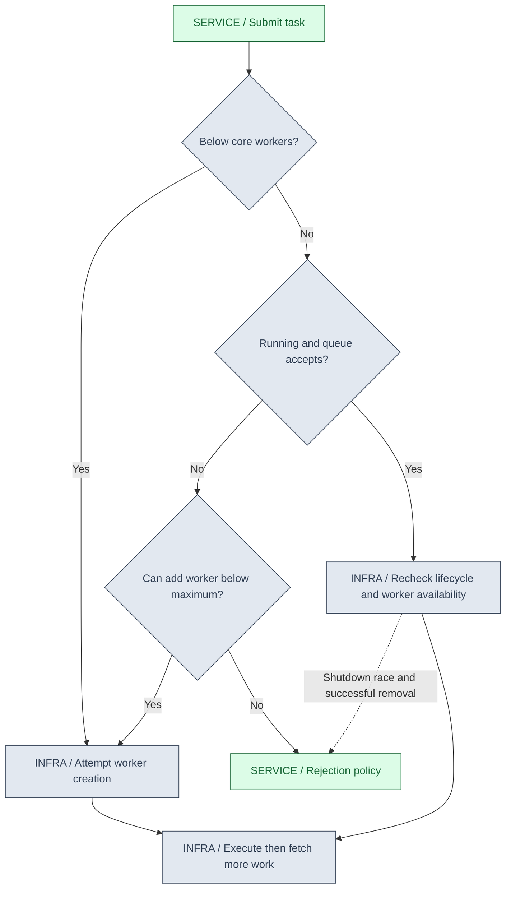
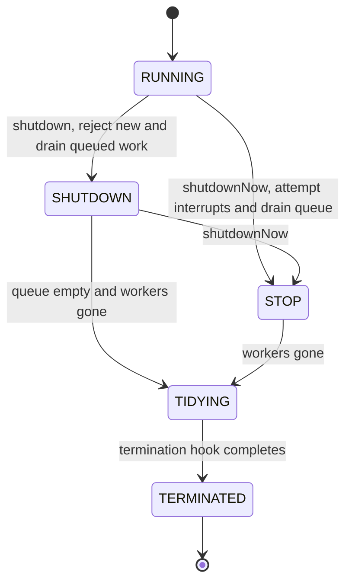
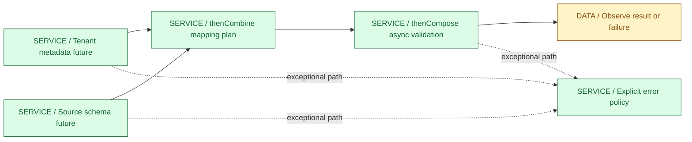
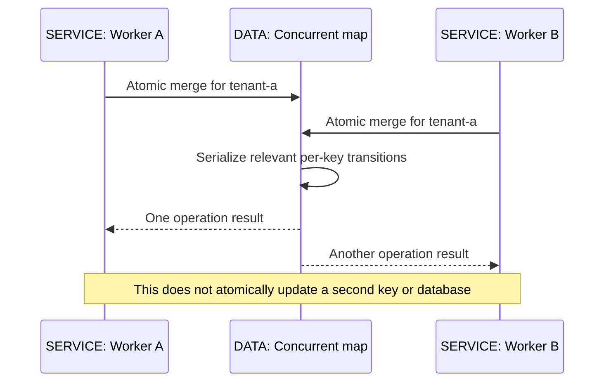
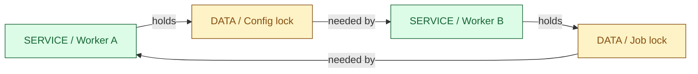
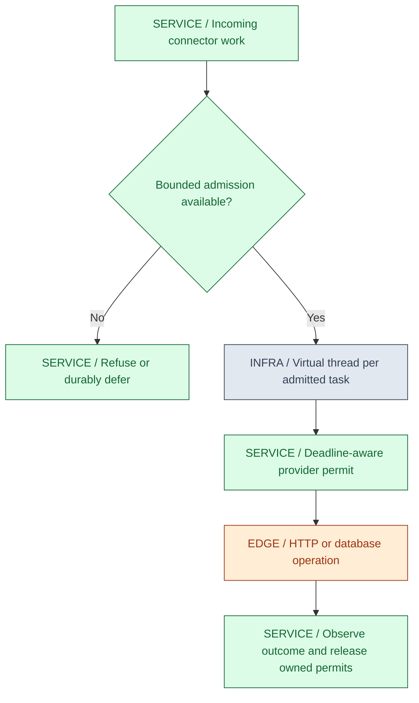

<a id="ch02-concurrency"></a>
# 02 / Concurrency and the Memory Model

**Correct shared state, bounded work, observable completion.** Concurrency lets IntegrationHub overlap independent sync jobs and I/O waits. It also creates races over configuration, quotas, progress and shutdown. IntegrationHub is fictional; all schedules, capacities and incidents in this chapter are teaching examples, not observed production behavior.

**Version assumptions:** Java 21 without preview features is the source baseline. Java 25 remains the current-LTS comparison checked in Chapter 01; monitor-pinning changes are distinguished where relevant. The surrounding reference design still assumes illustrative Spring Boot 4.0.x / Spring Cloud 2025.1.x, Kubernetes 1.34, PostgreSQL 17 and Kafka 4.x. No framework or infrastructure runtime is required by these standalone labs; this chapter introduces no new Spring pairing. The prior family-level compatibility check is documented in [00](00-master-map.md#ch00-master-map).

**[VERIFY: confirm the deployed JDK vendor/build and framework patch compatibility against the JDK release notes, Spring Boot system requirements and Spring Cloud compatibility table. Java 21 source compatibility does not validate a production executor configuration or third-party driver's cancellation behavior.]**

**Execution status:** NOT EXECUTED. The local runner found no compiler through PATH/JAVA_HOME and recorded that result. Both complete Java labs are under `code/02-concurrency/`; no Java dependencies or JDK were downloaded. Compilation, runtime assertions, stress behavior, pinning and performance remain unverified. Mermaid diagrams are rendered as embedded SVG in the published guide; Java execution remains a separate, unverified requirement.

## Big Picture



One successful run is not a proof of thread safety. Name the shared state, the invariant, the operation that changes it atomically, and the ordering that makes it visible. Then explain what happens when admission fails, waiting is interrupted, or a worker never returns.

## What You Will Be Able to Explain

- Separate visibility, ordering, atomicity, safety and liveness, and identify the happens-before relationship for a handoff.
- Choose confinement, immutable snapshots, monitors, atomics or locks from the invariant rather than familiarity with an API.
- Trace ThreadPoolExecutor submission, worker growth, queueing, rejection, result handling and shutdown.
- Compose CompletableFuture stages without hidden blocking, dropped failures or imaginary cancellation guarantees.
- Use concurrent collections without assuming multi-call transactions or consistent whole-map snapshots.
- Diagnose deadlocks and pool starvation, and bound virtual-thread work without confusing local permits with distributed quotas.

> [!PRODUCTION]
> **Where this lives in IntegrationHub.** A connector worker shares read-mostly configuration, enforces local outbound concurrency and reports progress while many jobs run. The [durable request journey](00-master-map.md#ch00-master-map) remains authoritative: an in-memory lock does not replace [database constraints](06-databases.md#ch06-databases), [idempotent event processing](07-messaging.md#ch07-messaging), or [distributed coordination](22-distributed.md#ch22-distributed). [Spring](03-spring.md#ch03-spring) may schedule or proxy work, but its beans still obey Java concurrency contracts.

<a id="ch02-jmm"></a>
## 1. The JMM: Which Observations Are Legal?

The Java Memory Model defines allowed observations of shared-memory operations across threads. It lets compilers and processors optimize while constraining correctly synchronized programs. It is not a tutorial instruction to "flush all caches" every time a keyword appears. Hardware coherence alone does not establish a Java-level synchronization contract.

**Visibility** asks whether one thread can observe another's updates. **Ordering** asks which effects must precede which observations. **Atomicity** asks whether a relevant operation can be interleaved or partially observed. **Safety** means an invariant is not violated; **liveness** means required progress is possible. A perfectly visible counter can still lose updates, and a mutually exclusive critical section can still deadlock.

Two conflicting accesses to the same variable, at least one a write, constitute a data race when they are not ordered by happens-before. A broader business race can also occur among individually thread-safe operations: checking a concurrent map and later inserting is not one indivisible reservation. Conversely, making something run in a single thread can eliminate the need for shared-memory coordination if ownership really stays confined.

### Construct a Happens-Before Chain

Happens-before is a partial order, not wall-clock ordering. Within one thread, earlier actions in program order happen-before later actions. Synchronization adds edges between threads; transitivity combines them. If initialization happens-before publication and publication happens-before a reader's access, the relevant earlier writes are ordered before that access. A timestamp in a log is not such an edge.

| Handoff | Ordering you can use | Boundary to remember |
|---|---|---|
| Unlock then later lock of the same monitor | Writes before release are ordered before reads after acquisition | Locking a different object provides no matching monitor handoff |
| Volatile write then subsequent read of that same volatile variable | Prior writes are published through the volatile synchronization edge | It does not make a group of later mutations atomic |
| Thread.start | Actions before start are ordered before actions in the started thread | Calling run directly is an ordinary method call, not a new thread |
| Successful Thread.join observing termination | Joined thread's actions are ordered before the joiner's subsequent actions | A timed join that returns while the target is alive is not proof of termination |
| Task submission and Future.get | Pre-submission actions precede task actions, which precede actions following result retrieval | Mutating captured state after submission races unless separately coordinated |
| BlockingQueue handoff | Actions before placing an element precede subsequent access/removal by another thread | Mutating the transferred object afterward requires another ownership protocol |
| CountDownLatch countDown and successful await | Pre-countDown actions precede actions after the corresponding await completes | Timeout/interrupt is not successful completion of the wait |

These are contract summaries, not an exhaustive formal definition. The [JLS memory-model chapter](https://docs.oracle.com/javase/specs/jls/se21/html/jls-17.html) and [concurrent package memory-consistency documentation](https://docs.oracle.com/en/java/javase/21/docs/api/java.base/java/util/concurrent/package-summary.html) are the primary references. For correctly synchronized programs, the JMM provides the familiar sequentially consistent reasoning model; a data race removes that general assurance, not all language guarantees.



### Safe Publication Is Not Permanent Thread Safety

Safe publication makes a constructed object visible through a valid handoff. If another thread later mutates it, those mutations need their own contract. Returning a mutable ArrayList from a safely published singleton does not make the list safe to share. An immutable object can be shared much more simply, provided its construction and references do not leak inappropriately.

Final fields have special initialization-safety semantics for correctly constructed objects. Do not let this escape during construction through a listener registration, overridable method or started task. Final does not make referenced objects deeply immutable, and it is not a general mechanism for promptly communicating a replacement reference. Prefer an obvious publication mechanism instead of depending on subtleties to justify a racy reference field.

**Use when / avoid when:** use a happens-before proof for each state handoff. Avoid "it usually sees the change," sleeps, yields, log statements, or an assumed CPU memory barrier as a correctness argument. Logging can perturb timing and may add synchronization, so a race disappearing under logging is a clue, not a fix.

**IntegrationHub failure:** a configuration refresher mutates a shared map in place while workers read it. Workers can see inconsistent policy fields even if a flag is volatile. Publish a validated immutable snapshot, or guard all participating state with one appropriate lock. Read the snapshot reference once per logical decision; two separate reads may select two different configurations.

**Interview checks:** basic: visibility is not atomicity. Internals: identify the exact publication edge and transitive chain. Debug: find the first unsynchronized mutation after publication. Scenario: replacing an immutable policy object is simpler than coordinating many mutable fields independently.

<a id="ch02-publication"></a>
## 2. A Complete Snapshot Publication Example

**NOT EXECUTED.** The complete listing matches `code/02-concurrency/SnapshotLab.java`. It is a finite teaching probe, not a production spin-wait design. The reader may start before or after publication; correctness comes from the contracts, not which schedule this one execution happens to take. No console output is asserted here.

```java
import java.util.Map;
import java.util.Objects;
import java.util.concurrent.Executors;
import java.util.concurrent.TimeUnit;

public final class SnapshotLab {
    record Limits(Map<String, Integer> byTenant) {
        Limits {
            byTenant = Map.copyOf(byTenant);
            if (byTenant.values().stream().anyMatch(limit -> limit < 1)) {
                throw new IllegalArgumentException("Limits must be positive");
            }
        }
    }

    static final class Registry {
        private volatile Limits current = new Limits(Map.of());

        void replace(Limits next) {
            current = Objects.requireNonNull(next);
        }

        Limits snapshot() {
            return current;
        }
    }

    public static void main(String[] args) throws Exception {
        var registry = new Registry();
        var oldSnapshot = registry.snapshot();
        try (var executor = Executors.newVirtualThreadPerTaskExecutor()) {
            var reader = executor.submit(() -> {
                long deadline = System.nanoTime() + TimeUnit.SECONDS.toNanos(5);
                while (System.nanoTime() - deadline < 0) {
                    Limits observed = registry.snapshot();
                    if (observed.byTenant().containsKey("tenant-a")) {
                        return observed.byTenant().get("tenant-a");
                    }
                    if (Thread.currentThread().isInterrupted()) {
                        throw new InterruptedException("Reader cancelled");
                    }
                    Thread.onSpinWait();
                }
                throw new AssertionError("Reader deadline exceeded");
            });
            try {
                registry.replace(new Limits(Map.of("tenant-a", 3)));
                if (reader.get(10, TimeUnit.SECONDS) != 3) {
                    throw new AssertionError("Published snapshot contents");
                }
                if (!oldSnapshot.byTenant().isEmpty()) {
                    throw new AssertionError("Prior snapshot must remain unchanged");
                }
            } finally {
                reader.cancel(true);
            }
        }
        System.out.println("SnapshotLab: all checks passed");
    }
}
```

**Trace:** the Registry initially owns an empty snapshot. The writer validates a replacement, copies the map into an unmodifiable representation, and assigns the volatile reference. The reader takes one local reference and inspects only that snapshot. The previously obtained snapshot stays unchanged. String keys and Integer values keep the element contract simple; mutable values would need deeper ownership reasoning.

The main thread obtains the reader's result through Future.get, establishing the result-observation boundary. The five- and ten-second limits are test failure guards, not latency targets or measured performance. Thread.onSpinWait is only a hint; the repeated volatile read supplies the ordering contract. A production waiter should generally use a blocking coordination mechanism or request-driven snapshot reads.

**Trap:** this is not a test that proves removing volatile always causes visible corruption. Final-field semantics, scheduling and runtime behavior can make many incorrect variants appear to pass. Use the JMM argument as the proof obligation and tests as supporting evidence. Compare-and-set or a suitable lock is needed if multiple writers must update from the current value without losing each other's changes; simple replacement deliberately allows the latest published assignment to replace the prior policy.

<a id="ch02-synchronized-volatile"></a>
## 3. synchronized and volatile: Match the Size of the Invariant

**Why monitors exist:** several related reads/writes may need to behave as one protected operation. Acquiring an object's monitor provides mutual exclusion against other code acquiring that same monitor; releasing and reacquiring it provides memory ordering. A synchronized instance method uses the receiver's monitor, while a static synchronized method uses the corresponding Class object's monitor. These are not the same lock.

**Mechanism:** acquire monitor -> inspect guarded state -> validate/update the invariant -> release even on exceptional method/block exit. Java monitors are reentrant: the owning thread can acquire the same monitor again. Reentrancy avoids self-deadlock for that case; it does not prevent cycles involving different locks or resources. Synchronizing on one instance does not coordinate another instance or another Pod.

ConcurrencyLab.Quota guards a check-and-decrement under one synchronized method. Starting with one available unit, two reservations can yield only one success. The entire invariant is inside the monitor; reading remaining outside that monitor and then calling a separately synchronized decrement would reopen a race.

**Volatile is different:** a volatile read/write is an ordered access to that variable; it does not hold a critical section around surrounding code. Increment is read, compute, write, so two threads can both read the old value and overwrite one another even when the field is volatile.

| Step in a constructed schedule | Worker A | Worker B | Shared counter |
|---|---|---|---|
| Start | No work yet | No work yet | 0 |
| Read | Copies 0 locally | Copies 0 locally | 0 |
| Compute | Computes 1 | Computes 1 | 0 |
| Write | Writes 1 | Later writes 1 | 1 |

This is an allowed interleaving, not measured output. ConcurrencyLab deliberately splits the increment and uses a barrier after both reads so the schedule is reproducible if the test runs. It demonstrates why ordering each access is not enough; it is not a claim that a normal ++ expression always loses exactly one update.

| Tool | Use when | Avoid when |
|---|---|---|
| Thread confinement | One task/thread owns mutable state until a defined handoff | A reference secretly escapes to another task or callback |
| Immutable snapshot with volatile reference | Independent readers need a coherent replaceable configuration | Writers must perform a coordinated read-modify-write without replacement conflicts |
| Volatile flag | One state transition/notification is sufficient and cancellation can be observed | The worker is stuck in I/O that never checks it, or several fields must update atomically |
| synchronized | A clear multi-field invariant fits a small, well-defined critical section | A global lock spans slow network calls or uncontrolled callbacks |
| Atomic variable | A single state value has an appropriate atomic operation | Updating several independent atomics is incorrectly treated as one transaction |

**wait/notify mechanics:** a thread must own the object's monitor to call wait/notify. wait releases that monitor while waiting and reacquires it before returning or throwing. notify/notifyAll do not transfer ownership immediately; the notifying thread still holds the monitor until it releases it. Wait in a loop that checks the predicate because another thread may consume the condition and wakeups can be spurious. Sleep does not release held monitors. Prefer BlockingQueue or other higher-level coordination where it matches the problem.

**Production failure:** a synchronized connector cache performs a remote token refresh while holding a global monitor. Every unrelated tenant lookup now waits behind the provider. Move remote work out of the shared critical section, but preserve duplicate-refresh coordination with a per-key in-flight result or carefully scoped state machine. Merely deleting synchronized trades serialization for races.

**Interview checks:** basic: volatile is not a lock. Internals: name the monitor used by instance versus static methods. Debug: inspect whether all accesses use the same guard. Scenario: protect the complete reservation, not separately the check and mutation.

<a id="ch02-atomics"></a>
## 4. Atomics, CAS and Contention

**Why atomics exist:** simple shared counters and state transitions should not always require a manually managed lock. AtomicInteger.incrementAndGet provides one atomic update, not the split read/write from the preceding schedule. The relevant operation has a point at which it takes effect; separate get and set calls do not become one atomic transaction because the object is atomic.

Compare-and-set tries to replace an expected value with a new value only if the comparison still holds at the atomic operation. A retry loop reads current state, computes a candidate, attempts CAS, and recomputes if another writer won. The application must define what to do when the state no longer permits the operation, such as a quota already exhausted.



CAS can avoid blocking on a monitor, but retries under contention still consume CPU. Lock-free does not mean wait-free, starvation-free, fair or automatically faster. A lock-free algorithm's progress property concerns system-wide progress; a particular participant may repeatedly lose. Do not infer algorithm-wide progress guarantees solely from one atomic instruction.

**The retry-side-effect trap:** an update function supplied to an atomic update operation may run more than once before an update succeeds. Keep it free of external side effects. Calling a payment provider, appending an audit event, or publishing to Kafka in that function can duplicate effects even though only one local state change wins.

**ABA:** a reference/value changes from one state to another and back, so a comparison succeeds although relevant intervening history occurred. A version stamp or a different ownership design can encode that history where it matters. Not every counter use has an ABA requirement; explain the invariant before adding stamped references. Java GC reduces certain reclamation hazards compared with manual memory management but does not erase logical ABA concerns.

| Primitive | Use when | Avoid when |
|---|---|---|
| AtomicInteger / AtomicLong | Exact atomic single-value update or compare-and-set fits the invariant | Check-one-field/update-another must be atomic together |
| AtomicReference to immutable state | A complete state transition can replace one immutable value | Expensive retries or object-graph copies outweigh clarity; external effects are inside the update |
| LongAdder | Highly contended aggregate statistics can tolerate a non-atomic concurrent sum snapshot | Exact quota, sequence generation or money decisions require one current value |
| Lock-protected state | Multiple fields must change together and the contract is clearer under a guard | You hold the guard while doing slow unrelated work |

LongAdder spreads contention across internal state rather than treating every increment as an update to one hot cell. Its sum is not an atomic snapshot during concurrent updates. That is useful for telemetry counters, not a safe admission test such as "sum is below the tenant limit, therefore reserve." False sharing can also make logically independent hot fields contend for cache resources; diagnose it with appropriate profiling rather than guessing a padding recipe.

**[VERIFY: atomic access modes, weak-CAS spurious-failure rules, VarHandle memory effects and LongAdder internals must be checked against the selected JDK's atomic/VarHandle API and exact source. This chapter's labs use ordinary strong atomic operations, not hand-written relaxed-memory algorithms or claimed hardware instruction mappings.]**

**IntegrationHub failure:** several local atomics count started, completed and failed work. Reading them separately can yield a combination that never existed together. For a coherent progress snapshot, define one synchronized/immutable aggregate or accept and document approximate telemetry. Durable business completion still belongs to [06](06-databases.md#ch06-databases) and [07](07-messaging.md#ch07-messaging).

**Interview checks:** basic: atomic get plus atomic set is not atomic increment. Internals: successful CAS is the transition's commit point, not a durable database commit. Debug: high CPU can be retry contention. Scenario: choose LongAdder for statistics, not precise permit accounting.

<a id="ch02-locks"></a>
## 5. Explicit Locks, Conditions and Coordination

ReentrantLock provides explicit acquisition policies beyond intrinsic monitors: interruptible acquisition, timed attempts and optional fairness. Release in finally after successful acquisition; failing to acquire must not lead to an unconditional unlock. A lock is still a local coordination object, not a database lock or cluster-wide lease.

In OpenJDK, many synchronizers build on AbstractQueuedSynchronizer. At a high level, state transitions decide whether acquisition succeeds; unsuccessful contenders enqueue and may park; release can make a successor eligible to retry. Waking does not mean the invariant is now available forever. The details differ across locks and releases; memorize the state/queue/park relationship before memorizing private fields.



Conditions separate waiting sets associated with a lock, such as not-empty and not-full. await releases the associated lock while waiting and reacquires it before normal continuation. Another thread signals after changing the predicate while holding that lock. Always recheck in a loop; signal is not a remembered business event or a queued message. A signal before anyone waits need not be saved for a future waiter.

| Coordination tool | Use when | Avoid when |
|---|---|---|
| ReentrantLock | Timed/interruptible acquisition, conditions or a justified fairness choice is required | Adding lock/unlock boilerplate without a need beyond synchronized |
| ReentrantReadWriteLock | Measured read-heavy access to a mutable structure benefits from concurrent readers | Tiny reads or frequent writes make overhead/delays worse; attempting an unsafe read-to-write upgrade |
| StampedLock optimistic read | Small copied observations can be validated and retried safely | Reentrant calling patterns, unvalidated use of read data or complex object traversal during concurrent mutation |
| Semaphore | Limit concurrent users of a resource without exclusive ownership of a data structure | Treating a permit as a durable/distributed quota or releasing one that was never acquired |
| CountDownLatch | One-time completion of a known number of events | You need to reset the same latch for another round |
| CyclicBarrier / Phaser | Parties coordinate repeated or phased work | Parties can disappear without a defined failure/deregistration policy |
| BlockingQueue | A producer-consumer handoff and optional capacity bound fit directly | Building an extra wait/notify protocol around it unnecessarily |

A fair lock reduces certain forms of acquisition barging but cannot guarantee OS scheduling fairness or a hard response-time bound. Untimed tryLock can have different fairness behavior from queued/timed acquisition. Read-write locks are not universally faster; lock upgrading can deadlock if readers retain their read locks while waiting for exclusive access. Optimistic read is not permission to use torn logical state before stamp validation.

**[VERIFY: fairness exceptions, condition interrupt behavior, StampedLock guarantees and AQS internals are API/implementation-specific. Check the Java 21 lock/condition documentation and the deployed JDK source before attributing a wait state, spinning policy or performance advantage to a particular lock.]**

**Production case:** a connector acquires a semaphore permit, then an exception path returns without releasing it. Capacity declines until all jobs wait. Scope release to a finally block after confirmed acquisition, account for cancellation before acquisition, and monitor wait duration plus admitted/active work. Conversely, releasing after an interrupted failed acquire invents capacity and violates the bound. ConcurrencyLab's interrupted waiter checks that no permit appears from a failed acquisition.

**Interview checks:** basic: a semaphore limits concurrent access, not rate per time interval. Internals: await temporarily releases the associated lock. Debug: a missed predicate check can turn a wakeup into an invalid dequeue. Scenario: prefer an existing bounded queue over a custom condition protocol unless requirements justify one.

<a id="ch02-executors"></a>
## 6. ThreadPoolExecutor: Admission Policy Before Thread Count

**Why executors exist:** separate task submission from thread creation, reuse platform threads, observe results and own shutdown. ThreadPoolExecutor adds explicit workers, a work queue, thread factory and rejection policy. Choosing only maximumPoolSize ignores much of its behavior.

### Submission Trace

Under ordinary running conditions, if fewer than corePoolSize workers exist, attempt to create a worker for the new task. Otherwise try to enqueue it. If queueing fails, attempt to add a worker up to maximumPoolSize. If the executor cannot accept it, invoke the rejection handler. The real implementation rechecks lifecycle and worker conditions around races; a successful queue offer alone does not mean shutdown can be ignored.



The diagram summarizes the successful worker-creation branch; thread creation can itself fail. It does not promise a worker for every submit or omit rejection on shutdown as a real possibility. Below core size refers to worker count, not just workers currently executing useful CPU instructions. Core workers are normally created on demand unless prestarted.

### A Deliberately Small Saturation Trace

Assume core=1, maximum=2, queue capacity=1. Hold the first task behind a latch so it cannot finish. A second task queues; the pool does not grow immediately merely because maximum is two. The third task cannot queue, so an additional worker can start it. Hold that worker too. A fourth task meets both a full queue and the maximum worker count and is rejected by AbortPolicy. Release the latch, then observe every accepted result.

ConcurrencyLab.queueThenGrowThenReject arranges exactly those conditions with startup latches and bounded waits. These capacities are test fixtures, not recommended production values. The assertions are not yet executed in this environment.

| Queue/pool choice | Use when | Avoid when |
|---|---|---|
| Bounded ArrayBlockingQueue with finite workers | Memory/backlog and rejection must be explicit | Capacity is picked without retained-task size, deadline and arrival/service-rate reasoning |
| Unbounded LinkedBlockingQueue | A separately enforced workload bound truly limits submissions | Expecting maximumPoolSize to rescue growth beyond core or absorb sustained overload safely |
| SynchronousQueue | Direct handoff without buffered task storage fits the admission policy | Unbounded worker growth is allowed under a sustained blocking workload |
| Fixed-thread factory executor | Simple finite lab or genuinely bounded producer | Assuming its fixed thread count also bounds its default task queue |
| Separate pools by work class | Slow blocking tasks must not exhaust unrelated CPU/control work | Creating a pool per request and multiplying resources without lifecycle ownership |

A standard fixed thread pool uses an unbounded work queue; its thread count bounds running tasks, not waiting work. A cached pool can grow platform threads aggressively. The labs submit only a fixed tiny number of tasks to their helper pools; do not transplant those factories into an unbounded request path without an admission design.

### Worker and Lifecycle Internals

A worker runs an initial task or repeatedly retrieves another from the queue. Retrieval can wait indefinitely or with keep-alive semantics depending on pool configuration. Excess idle workers may retire; core timeout can be enabled under its documented conditions. Hooks run before/after tasks; hook failures can themselves damage worker availability. Approximate active-count statistics are observability signals, not a reservation API.

OpenJDK's implementation combines lifecycle state and worker count in an atomic control field so updates can coordinate decisions about worker creation and shutdown. Its states conceptually progress through RUNNING, SHUTDOWN or STOP, TIDYING and TERMINATED. The principle is an atomic lifecycle protocol with race rechecks, not the numerical bit layout of a private field.



**[VERIFY: the queue-before-growth and shutdown contracts were checked in the Java 21 ThreadPoolExecutor API. The combined control field, worker loop and internal state encoding must be checked in the exact OpenJDK/vendor source tag; they are not an ExecutorService implementation requirement.]**

### Rejection Is Part of the API Contract

| Policy | Use when | Avoid when |
|---|---|---|
| AbortPolicy | Caller must explicitly handle refused work | Unhandled rejection becomes an unexplained request failure or drops durable work ownership |
| CallerRunsPolicy | Running on the submitter is safe and slowing that submitter is desired | Submitter is an event loop, holds a lock, has a strict latency budget, or rejection follows shutdown |
| DiscardPolicy | Completion truly is not relied on and deliberate loss is acceptable | A caller waits for a submitted Future or the task represents accepted business work |
| Custom reject/defer policy | You have a bounded, observable alternative and precise task ownership | Handler silently pushes work into another unbounded queue |

CallerRunsPolicy runs on the caller only when the executor is not shut down; on shutdown it discards. A discarded FutureTask can leave a returned Future incomplete if nobody cancels/completes it. Silent loss is incompatible with IntegrationHub claiming that durable work has been successfully handed off. For accepted jobs, preserve the durable retry/recovery path from [07](07-messaging.md#ch07-messaging), rather than equating local submission with durable completion.

### execute, submit and Shutdown

An uncaught task failure passed through execute can terminate a worker and reach its uncaught-exception handling. submit wraps work in a Future-bearing task that captures computational failure; ignoring the Future can hide failure. An afterExecute hook's Throwable alone may therefore miss submit failures. Observe results or implement a deliberate completion/reporting policy, preserving exception causes.

shutdown stops acceptance and lets previously accepted work drain; it does not wait for completion. shutdownNow attempts interruption, removes queued tasks and returns those that never began, but cannot force arbitrary code to stop. Removed tasks still need application ownership decisions; do not assume every associated Future automatically completes. awaitTermination returns a status you must inspect. AutoCloseable executor cleanup can wait; it is not automatically bounded by a previous Future timeout.

**Production incident:** CPU is modest while queue age and retained heap rise. Workers may be blocked on remote calls or database acquisition; raising maximum does nothing when an unbounded queue always accepts tasks. Inspect queue type, core/max, active tasks' stacks, queue age, cancellation and downstream budgets. The sizing workflow is in [23](23-jvm-performance.md#ch23-jvm-performance), not a universal thread-count formula.

**Interview checks:** basic: fixed threads do not imply bounded backlog. Internals: trace core -> queue -> maximum -> rejection. Debug: look for captured submit failures. Scenario: make saturation and shutdown visible to callers and durable workers.

<a id="ch02-futures"></a>
## 7. CompletableFuture: Dependency Graphs, Not Cancellation Magic

**Why it exists:** represent an eventual result and compose work that depends on it without forcing the caller to block after every step. A CompletableFuture is a completion object; it does not always own the computation that might complete it. Manual completion, callbacks and remote requests can all feed a future.

For IntegrationHub, two independent metadata reads may run concurrently, then combine into a validated mapping plan. A later asynchronous action needs that plan; compose it. Waiting for the first result before submitting the second removes that overlap; submitting both first and then observing their results does not inherently serialize their execution.



| Operation | Use when | Avoid when |
|---|---|---|
| thenApply | Transform one successful value into another ordinary value | Callback actually returns asynchronous work and you accidentally create nested futures |
| thenCompose | Next operation returns a CompletionStage depending on the first result | Work is independent and could have been started earlier |
| thenCombine | Two independent successful results are needed together | One task depends on the other's result before it can start |
| allOf | Need a stage representing completion of a set | Expecting a typed result list, immediate fail-fast behavior, or sibling cancellation |
| anyOf | First completion, including possible failure, is the desired policy | Expecting first successful result or automatic cancellation of losers |
| handle | Transform either success or failure to a new outcome | Silently converting real data loss into a normal-looking empty batch |
| exceptionally | A specific failure can legitimately recover to a value | Every exception is swallowed under a blanket default |
| whenComplete | Observe/log completion without intentional recovery | Assuming an exception thrown by the callback cannot affect the returned stage |

allOf normally waits for all supplied futures to complete; it has a Void result, so retrieve individual results after appropriate completion/error handling. It is not a task scope that automatically cancels siblings on failure. anyOf is first completion, not "first nonexceptional answer." A business policy for hedged requests needs explicit loser cleanup, deadlines and idempotency.

### Which Thread Runs the Callback?

A non-async continuation may run on the thread completing the upstream stage or a caller participating in completion; when the value is already available, the registration call can run the action inline. Do not put an expensive/blocking continuation there assuming it has its own worker.

Async methods without an explicit executor use the default asynchronous facility. For ordinary CompletableFuture this is typically the common ForkJoinPool, with the documented low-parallelism fallback; subclasses may override the instance default. Supplying an executor to supplyAsync does not permanently bind all later async stages to that executor. Specify the intended executor at execution boundaries that require one. Even an Executor contract does not universally guarantee a separate thread; its implementation matters.

### Timeout, Cancellation and the Underlying Effect

Future.get with a timeout limits the caller's wait. It does not itself cancel the task. CompletableFuture.orTimeout exceptionally completes that same future after the timeout if still incomplete; completeOnTimeout gives that same future a fallback value. Neither guarantees the underlying HTTP/database operation stopped. Because these mutate the future's completion state, applying different caller timeouts to one shared future can affect other observers; a caller-specific derived view needs deliberate design.

CompletableFuture.cancel treats cancellation as exceptional completion; its mayInterruptIfRunning parameter has no effect in that implementation. Contrast a Future returned by executor submission that may attempt to interrupt its running task when cancellation allows it. Even there, interruption is cooperative and a cancelled/done Future is not proof that the external operation never happened or the task released every resource.

get exposes checked interruption/execution-failure handling; join exposes unchecked completion failure and does not provide the same interruptible waiting API. Neither is an invitation to block a scarce worker on another task queued to that same exhausted executor. Compose dependencies or separate execution capacity deliberately.

**[VERIFY: CompletableFuture completion, default-executor and cancellation policies were checked against the Java 21 API. Check the exact completion-stage implementation and HTTP/JDBC client contracts before relying on timeout propagation, interruption, exceptional-result selection or callback execution context.]**

**Context trap:** thread-local transaction/security/logging context does not automatically follow an arbitrary continuation onto another worker. Capture only the immutable authorized metadata you need, propagate it through supported mechanisms, and restore/clear task context in finally according to nesting rules. Never share one EntityManager across arbitrary concurrent tasks; [03](03-spring.md#ch03-spring), [04](04-jpa.md#ch04-jpa) and [18](18-operations.md#ch18-operations) own the framework and tracing contracts.

**Production case:** a timeout fallback reports "zero rows," while the underlying connector is still writing records. A retry overlaps it and duplicates effects. Separate deadline reporting, actual task cancellation and external-effect reconciliation. [05](05-apis-realtime.md#ch05-apis-realtime), [07](07-messaging.md#ch07-messaging) and [27](27-payments.md#ch27-payments) explain why unknown outcome is not confirmed failure.

**Interview checks:** basic: compose flattens a dependent stage; combine joins independent values. Internals: specify the executor per async boundary. Debug: inspect the future that was actually timed out, and the separately owned task. Scenario: cancellation needs task/resource ownership, not just a future flag.

<a id="ch02-collections"></a>
## 8. Concurrent Collections: One Safe Operation Is Not a Transaction

**Why they exist:** reusable structures provide documented coordination instead of requiring every caller to guard a HashMap or queue manually. They are still precise tools with limits. Thread safety of a container does not recursively protect each stored value or establish consistency across multiple calls.

ConcurrentHashMap supports concurrent access and atomic per-key methods such as putIfAbsent, compute and merge under their specified contracts. A containsKey followed by put is not one operation. A non-null retrieval reporting an update has the documented per-key visibility relationship; iteration and aggregate observations are not generally a globally locked snapshot.



The old shorthand "ConcurrentHashMap always uses a fixed set of segment locks" is not a sound description of current OpenJDK implementations. The useful interview explanation is finer-grained coordination, atomic per-key contracts and generally nonblocking retrievals, with implementation-specific CAS/bin locking and resize coordination underneath. Do not claim the entire structure is lock-free or that every read yields the latest wall-clock state of the whole map.

**[VERIFY: ConcurrentHashMap implementation details and concurrent-collection iterator/aggregate guarantees must be checked against the exact JDK API and source tag. Per-key atomicity is an API-level reasoning tool; segment/bin layouts and resize algorithms are not universal concurrent-map contracts.]**

Keep computation callbacks short. Blocking on a remote service inside computeIfAbsent can hold up conflicting updates and entangle lock/order dependencies. The callback is not a durable exactly-once event handler. A mapping can be removed, a computation can fail, or another process can make its own call. Cache-in-flight-future designs also need failure eviction, cancellation and bounded retention, not just a clever map method.

| Collection | Use when | Avoid when |
|---|---|---|
| ConcurrentHashMap | Concurrent lookup and atomic per-key mutations | Multi-key transactions, null key/value semantics, or mutable value safety are assumed |
| ConcurrentSkipListMap | Concurrent sorted/range access is required | Unordered lookup is sufficient and the extra ordering cost is unjustified |
| CopyOnWriteArrayList | Small read-mostly listener/config lists benefit from snapshot iteration | Frequent writes or large arrays cause copying and retained snapshots |
| Bounded BlockingQueue | Producers/consumers need coordination and explicit waiting capacity | Capacity is unbounded, or full-queue handling ignores request deadlines |
| ConcurrentLinkedQueue | Nonblocking unbounded queue semantics fit an independently bounded workload | The queue is expected to enforce backpressure on its own |
| Synchronized collection wrapper | A simple single-guard policy fits | Compound iteration/multiple operations are assumed atomic without taking the correct guard |

ConcurrentHashMap iterators are weakly consistent, while CopyOnWriteArrayList iterators see a snapshot of its backing array at creation. Neither means mutable elements are frozen. A reader retaining a copy-on-write iterator can also retain an old array and its references. [01](01-java-jvm.md#ch01-java-jvm) explains ownership and memory retention.

**Queue semantics matter:** offer can fail immediately, put can wait, and a timed offer can fail after waiting. An executor typically uses offer for admission; naming its queue BlockingQueue does not mean submit blocks until room appears. Account for the waiting producer population as well as queue contents. A blocking queue establishes a handoff for preceding writes, not protection against a producer continuing to mutate an element after enqueueing it.

**Production incident:** two workers independently check that no job is marked running, then each puts a marker. Using a concurrent map protected each individual operation but did not protect the decision. Replace the compound sequence with an appropriate atomic local operation, and still enforce durable job ownership across replicas at the [database](06-databases.md#ch06-databases) or [distributed coordination](22-distributed.md#ch22-distributed) boundary.

**Interview checks:** basic: concurrent container does not imply concurrent elements. Internals: explain atomic per-key methods and weakly consistent traversal. Debug: look for separate get/check/put sequences. Scenario: an in-memory duplicate-suppression map is not cross-Pod idempotency.

<a id="ch02-deadlocks"></a>
## 9. Deadlock, Starvation and Cancellation

Deadlock is a cycle of dependencies where the participants cannot progress. The classic conditions include exclusive resources, holding while waiting, lack of forced resource preemption and circular wait. Resources can be monitors, explicit locks, executor slots, connection-pool entries or application promises. A JVM monitor detector does not necessarily know about the whole business dependency graph.



### Trace a Lock-Order Cycle

Worker A acquires the configuration lock, then requests the job lock. Worker B acquired the job lock and requests the configuration lock. If each retains its first lock while awaiting the second, neither can release the resource the other needs through normal completion. A consistent global acquisition order breaks this cycle when all paths obey it, including callbacks and exceptional paths. Lock reentrancy does not help because ownership is split across different threads.

### Thread-Pool Starvation Deadlock

An executor has all its workers occupied by parent tasks. Each parent submits a child to the same executor and waits for the child's result. The children remain queued because no worker is free. There may be no monitor cycle at all. A larger pool can defer the symptom until concurrency grows; it does not repair the dependency policy. Compose instead of blocking, execute suitable child work directly, or use deliberately separate resources while still bounding admission.

**Starvation** means a participant cannot make progress because other work repeatedly wins resources. **Livelock** means participants keep acting but fail to advance, for example repeatedly backing off and retrying in synchrony. Excessively aggressive CAS retries, unfair acquisition and competing retry loops can create operational symptoms without a deadlock cycle.

| Technique | Use when | Avoid when |
|---|---|---|
| Consistent resource order | Multiple exclusive resources must be acquired | Hidden callbacks acquire resources in a conflicting order |
| Short lock scope and no external calls under lock | Local data mutation is separable from slow work | Releasing the lock breaks an invariant without a reservation/version recheck |
| Timed/interruptible acquisition | You can abort/release/retry with a bounded policy | Timeout simply starts another retry while held resources leak |
| Nonblocking stage composition | Dependent work otherwise exhausts worker slots | Computation still blocks internally on an exhausted external pool |
| Bulkheads and admission bounds | One slow dependency must not occupy all service capacity | The alternative queue or waiting population is unbounded |

### Interruption Is a Request, Not a Kill Signal

Thread.interrupt sets interrupt state or triggers documented interruption behavior in certain blocking operations. It does not safely stop arbitrary code at any instruction. Code should propagate InterruptedException when possible; when translating or terminating at a boundary, preserve the intended cancellation signal, often by restoring interrupt status. Do not catch interruption, log it and continue indefinitely.

Thread.interrupted checks and clears the current thread's status; isInterrupted checks without clearing. Some waits throw InterruptedException and clear status. Acquiring an intrinsic monitor is not an interruptible lock acquisition API; use an appropriate explicit lock if abortable acquisition is required. Socket/driver behavior is API-specific, and remote side effects can survive local cancellation.

ConcurrencyLab interrupts a virtual-thread semaphore waiter and verifies that the path ends without creating a permit. Its latch signals entry into the path, not proof that the OS observed it blocked; interrupt-before-acquire and interrupt-during-acquire are both legitimate schedules. No lab intentionally leaves a permanent deadlock running.

### Diagnose Before Changing Lock Types

Capture a permitted thread dump and relevant traces/queue metrics, then identify what each waiting task owns and awaits. Java BLOCKED usually describes monitor acquisition; parked explicit-lock waits often appear WAITING or TIMED_WAITING. RUNNABLE does not alone prove CPU consumption: native/socket states can require additional evidence. Match repeated observations with CPU, lock contention and downstream metrics rather than diagnosing from one label.

**[VERIFY: deadlock detection and thread-dump visibility differ for platform and virtual threads and across JDK tools/releases. Check ThreadMXBean, jcmd thread-dump documentation and JFR event support for the deployed version; an empty monitor-deadlock report does not prove the absence of pool, resource or virtual-thread deadlocks.]**

**Production incident:** shutdown waits forever because a task swallowed interruption while holding a permit. Trace task ownership, cancellation response and permit release; repair the protocol and add a finite shutdown test. Do not use unsafe forced thread termination as a substitute. Operational capture and incident response belong in [18](18-operations.md#ch18-operations); dump/profiler interpretation in [23](23-jvm-performance.md#ch23-jvm-performance).

**Interview checks:** basic: low CPU does not rule out a severe concurrency incident. Internals: draw held-resource/wait dependencies. Debug: examine pool starvation even with no monitor cycle. Scenario: timeouts need cleanup and terminal outcomes, not an unlimited retry loop.

<a id="ch02-virtual-threads"></a>
## 10. Virtual Threads and Bounded Connector Work

[01](01-java-jvm.md#ch01-java-jvm) explains virtual threads, carriers and Java 21 versus Java 24/25 pinning. Here the question is policy: how much work may enter, which scarce resource does it consume, who cancels it and what result survives a process failure? Moving the same unbounded workload to cheaper threads is not a capacity plan.

Use one virtual thread per task where blocking-style code and libraries fit. Do not pool virtual threads to simulate a fixed worker pool. Apply admission limits and resource-specific concurrency limits explicitly. A semaphore can bound active provider calls, while a separate bounded admission boundary controls how many pending requests, task objects, payloads and waiters exist.



The graph's cleanup path must also cover failed permit acquisition and rejected task creation without releasing unowned permits or leaking already acquired admission. Each permit should have an explicit owner and release point. A concurrency limit of ten per Pod becomes up to forty active calls across four Pods if all are independently saturated; this arithmetic is an assumption-based illustration, not a provider quota claim. Distributed rate/quota enforcement is a separate design in [10](10-system-design.md#ch10-system-design) and [22](22-distributed.md#ch22-distributed).

Deadlines should cover admission waiting, queue waiting, resource acquisition and remote work, not restart the full budget at every stage. Use monotonic elapsed-time reasoning within one process; wall-clock timestamps have a separate role for audit and cross-system time. Every retry consumes the same user/business deadline unless the contract explicitly creates a new attempt.

### Context and Task Lifetime

Virtual thread-local values belong to that logical thread, not its transient carrier. Creating a new task does not inherently propagate every framework context correctly. A database connection per virtual thread can overwhelm a finite pool, and a large thread-local cache multiplied by many tasks can exhaust heap. Pass tenant/job identity explicitly or use a supported context mechanism; preserve authorization and log-redaction rules from [08](08-security.md#ch08-security).

Virtual threads are daemon threads; do not let required work depend on the process staying alive after its other lifecycle owners finish. Observe task completion through owned executors/futures or another managed scope. Executor close can wait for work and is not a hard shutdown deadline. Structured concurrency aims to make related task lifetimes explicit, but API maturity/version support must not be inferred from virtual threads being final.

**[VERIFY: Java 21 virtual-thread contracts, the Java 24 monitor-pinning change, current structured-concurrency/scoped-value API status, and framework context support must be checked against JEP 444, JEP 491 and the selected release/framework documentation. These labs use final Java 21 APIs only and do not test pinning or preview structured-concurrency APIs.]**

| Workload decision | Use when | Avoid when |
|---|---|---|
| Virtual-thread-per-task blocking flow | Independent waiting dominates and all scarce resources are bounded | CPU work is expected to become faster merely by changing the thread type |
| Bounded CPU executor | Parsing/compression/transformation needs controlled CPU parallelism | Pool tasks synchronously wait for children queued to the same exhausted pool |
| End-to-end nonblocking/reactive flow | Backpressure and streaming composition are real requirements | Blocking libraries run on the event loop or cancellation is assumed to undo remote effects |
| Durable queue and worker recovery | Work must outlive browser disconnects or Pod restarts | An in-memory future is used as the only record of accepted work |

**Production case:** virtual-thread count and heap rise while provider throughput stays flat. Look at admission, timeout budgets, permit wait, pool wait, retries and retained payload size. Raising a carrier setting is not the default answer. A virtual-thread application has the same business invariants and distributed uncertainty as a platform-thread application.

**Interview checks:** basic: cheap threads do not make unlimited work safe. Internals: a permit limits a named resource, not all task memory. Debug: inspect waiters outside the queue. Scenario: keep durable job acceptance separate from the lifetime of an in-memory task.

<a id="ch02-testing"></a>
## 11. Test a Contract, Not a Lucky Schedule

The complete sources are SnapshotLab.java and ConcurrencyLab.java under `code/02-concurrency/`. The Windows PowerShell wrapper run.ps1 accepts an already installed JDK via JdkHome, compiles with the Java 21 release target and records actual output in execution.json. Its executed preflight currently says NOT EXECUTED. A publication check verifies the displayed SnapshotLab matches its file; it does not compile Java.

| Probe in source | Controlled condition and assertion | Limit of the evidence |
|---|---|---|
| Snapshot publication | Immutable replacement; reader takes one reference; old snapshot unchanged | Passing once is not proof of every JMM execution or a reliable way to expose a missing volatile |
| Split volatile increment | Barrier places both reads before either write; checks one retained increment | Constructed lost-update schedule, not a probabilistic ++ benchmark |
| Atomic counter | Two finite tasks increment and results are observed | Supports one operation contract, not arbitrary multi-variable atomicity |
| Monitor reservation | Two callers compete for one unit; exactly one succeeds | Local instance only, not replica-wide quota enforcement |
| Queue/grow/reject | Latches keep two workers occupied and one task queued; fourth is rejected | Safety deadlines can fail on a severely delayed machine; no performance conclusion |
| Futures and map merge | Explicit executor, combination/composition/recovery, per-key atomic aggregation | No real network cancellation, transaction propagation or whole-map snapshot proof |
| Interrupted permit wait | Task observes interruption and exits; permit count stays unchanged | Does not prove every external blocking API responds to interrupts |

Use latches/barriers to arrange the interleaving relevant to the bug. Observe every Future, bound waits and release blocked workers in finally so a failed assertion does not strand the suite. Thread.sleep guesses at timing, and a test that succeeds only on the author's laptop is weak evidence. A barrier/latch itself creates ordering, so do not accidentally use it to hide the unsynchronized handoff you meant to investigate.

For subtle JMM outcomes, use an appropriate stress/litmus framework such as jcstress when tooling is available, alongside a specification-based argument. For throughput/latency use workload-driven measurement and JMH where suitable, not a stopwatch around a single run. Neither framework was downloaded or executed here. A source review and a test plan cannot be reported as a Java test pass.

### One Interview Scenario, End to End

**Prompt:** a tenant starts many sync jobs; provider calls become slow; progress counters disagree; shutdown fails to drain. Begin with three separate hypotheses instead of changing every thread pool.

- **Inconsistent progress:** locate the invariant. Several independent atomic counters may need a coherent snapshot, while durable progress must come from committed business state.
- **Growing latency:** inspect admission/backlog, worker blocking, permit/connection wait and retry load. A bounded executor is insufficient if tasks fan out into an unbounded population of futures or virtual threads.
- **Failed shutdown:** stop accepting new work, preserve durable ownership of queued jobs, request cancellation, release owned resources, and observe completion within the declared shutdown budget. Follow up on tasks that ignored interruption.

Then explain which fix is local Java coordination and which belongs to [messaging](07-messaging.md#ch07-messaging), [database transactions](06-databases.md#ch06-databases), [resilience](10-system-design.md#ch10-system-design), or [Kubernetes termination](15-kubernetes.md#ch15-kubernetes). A thread-safe component can still participate in an incorrect distributed workflow.

<a id="ch02-concept-index"></a>
## Explained-Here Index and Sources

| Concept | Explanation |
|---|---|
| JMM, visibility, ordering, happens-before | [Memory contracts](#ch02-jmm) |
| Safe publication and immutable replacement | [Complete snapshot example](#ch02-publication) |
| synchronized, volatile, monitor ownership, wait/notify | [Invariant scope](#ch02-synchronized-volatile) |
| Atomics, CAS, ABA, LongAdder | [Atomic transitions](#ch02-atomics) |
| Locks, conditions, AQS, semaphore, latch and barrier | [Coordination](#ch02-locks) |
| ThreadPoolExecutor, queues, rejection, shutdown | [Executor lifecycle](#ch02-executors) |
| CompletableFuture, composition, timeout and cancellation | [Completion graphs](#ch02-futures) |
| Concurrent collections and handoff | [Collection boundaries](#ch02-collections) |
| Deadlock, starvation, interruption and diagnosis | [Progress failures](#ch02-deadlocks) |
| Virtual threads, admission and context | [Bounded connector work](#ch02-virtual-threads) |
| Deterministic probes and execution status | [Testing contracts](#ch02-testing) |

Primary pages consulted for this chapter: [ThreadPoolExecutor Java 21 API](https://docs.oracle.com/en/java/javase/21/docs/api/java.base/java/util/concurrent/ThreadPoolExecutor.html) and [CompletableFuture Java 21 API](https://docs.oracle.com/en/java/javase/21/docs/api/java.base/java/util/concurrent/CompletableFuture.html). The JLS and concurrent-package references in the JMM section are authoritative reading references, not claims of new runtime evidence. [JEP 444](https://openjdk.org/jeps/444) and [JEP 491](https://openjdk.org/jeps/491) were consulted during Chapter 01 and are reused with their version boundaries intact. Exact vendor implementation and unexecuted lab behavior remain explicit verification items.

## Related Chapters

Start from [00's request journey](00-master-map.md#ch00-master-map) and [01's JVM model](01-java-jvm.md#ch01-java-jvm). Apply task/context behavior in [03 Spring](03-spring.md#ch03-spring), [04 JPA](04-jpa.md#ch04-jpa) and [05 reactive/real-time APIs](05-apis-realtime.md#ch05-apis-realtime). Keep local synchronization distinct from [06 database isolation](06-databases.md#ch06-databases), [07 delivery semantics](07-messaging.md#ch07-messaging) and [22 distributed locks](22-distributed.md#ch22-distributed). [21 Network/OS](21-network-os.md#ch21-network-os) explains blocking at the system boundary; [19 Testing](19-testing.md#ch19-testing) and [23 JVM performance](23-jvm-performance.md#ch23-jvm-performance) deepen validation. Every related destination has a generated return link.

<a id="ch02-cheat-sheet"></a>
## One-Page Cheat Sheet

**Start with the invariant:** shared mutable state needs a documented owner or coordination rule. Visibility is not atomicity; thread safety is not liveness; local atomicity is not durable/distributed correctness.

**Happens-before:** program order plus a matching synchronization edge plus transitivity. Same-monitor unlock/lock, volatile write/read, start/join and documented executor/queue/latch handoffs are useful edges. Sleep, timestamps and "the other thread probably finished" are not proofs.

**Choose deliberately:** confinement first; immutable snapshot for read-mostly replacement; synchronized for a small multi-field invariant; atomics for suitable single-value transitions; explicit locks when timed/interruptible/condition policies are required. LongAdder is for aggregate statistics, not exact quotas.

**Executor path:** core worker -> queue -> growth toward maximum -> rejection. An unbounded queue can prevent growth beyond core while consuming heap. Observe submit results. CallerRuns can run on a dangerous caller and discards after shutdown. Shutdown is a lifecycle protocol, not forced termination.

**Futures:** apply transforms; compose flattens a dependency; combine joins independent results. Specify execution boundaries. allOf is not typed result collection or automatic sibling cancellation. A timeout/cancelled future does not prove its task or remote effect stopped.

**Collections and waits:** per-key atomic methods do not form multi-key transactions. Concurrent containers do not protect mutable values. Await the predicate in a loop; release only acquired permits; respect interruption. Draw resource cycles, including worker slots and database connections.

**Virtual threads:** one per task where appropriate; bound admission and scarce resources, not a virtual-thread pool. Context and lifetime need owners. Java 21 pinning advice is version-specific. Both chapter labs are NOT EXECUTED in this environment.

<a id="ch02-interview"></a>
## Interview Corner

### Basic: What Is the Difference Between Visibility and Atomicity?

Visibility concerns observing writes across threads under the memory contract. Atomicity concerns an operation taking effect without relevant interleaving. Volatile can order counter reads/writes while a read-modify-write still loses an update; a suitable atomic increment or shared lock protects that operation.

### Internals: Show a Happens-Before Chain for a Published Snapshot.

Construct and validate the snapshot, then assign its volatile reference. The reader observes it through that same volatile field, then reads the snapshot's fields. Program-order and volatile synchronization edges compose transitively. Do not mutate the snapshot afterward without a new contract.

### Trace/Debug: The Code Works After Adding Logging. Is It Fixed?

No. Logging can change schedules and add synchronization. Identify the actual shared-variable accesses and missing ordering/invariant. Build a contract-based repair and an appropriate test instead of keeping logging as an accidental memory barrier.

### Scenario: Can final Fields Replace Safe Publication Everywhere?

No. Correct construction gives special final-field guarantees, not a universal replacement-update or later-mutation protocol. Avoid constructor escape and choose a clear handoff. Final references do not deeply freeze mutable collections or signal that a refreshed reference will be observed promptly.

### Basic: Which Object Does synchronized Lock?

An instance method locks its receiver; a static method locks its Class object; a synchronized block locks its specified object. Different instances or different guard objects do not protect the same invariant merely because methods have the same name.

### Internals: What Happens During wait and notify?

wait requires monitor ownership, releases that monitor while waiting, and reacquires it before continuation. notify makes a waiter eligible but does not release the notifier's monitor. Recheck the predicate in a loop; notification is not guaranteed ownership of an available item.

### Trace/Debug: Why Did a Volatile Counter Lose an Increment?

The compound operation read the old value, computed a new one, then wrote it. Another thread could do the same before either write. Volatile orders accesses but does not make the compound action indivisible. Use the atomic operation matching the invariant.

### Scenario: Is AtomicInteger Enough for a Tenant Quota?

Only if the full local decision can be expressed atomically, such as a valid CAS reservation. Separate get/check/decrement is racy; several Pods still have separate counters. A cluster-wide quota requires an appropriate shared authority and failure policy.

### Basic: AtomicLong or LongAdder?

AtomicLong supports exact single-value atomic operations. LongAdder targets contended aggregate updates with a sum that is not an atomic concurrent snapshot. Use the latter for suitable metrics, not sequence generation or an exact capacity decision.

### Internals: Why Must an Atomic Update Function Avoid Side Effects?

It may be evaluated multiple times while the operation retries contention. A provider call or event publish inside it can repeat even if one final local update succeeds. Keep candidate computation pure and coordinate external effects with the proper durable protocol.

### Trace/Debug: A Fair Lock Still Has Slow Requests. Why?

Acquisition policy cannot guarantee OS scheduling or bound the work while the lock is held. Some acquisition methods have fairness exceptions. Inspect hold time, queueing, external calls under lock and workload imbalance before assuming the flag guarantees latency.

### Scenario: Why Not Always Use a Read-Write Lock?

It adds coordination overhead and writer/read interactions that may outweigh benefits for short operations or frequent writes. Measure a suitable read-heavy workload, and do not attempt a read-to-write upgrade while retaining incompatible read ownership. Immutable snapshots may simplify the design.

### Basic: Why Does maximumPoolSize Not Increase My Throughput?

With a queue that keeps accepting work after core workers are present, the usual path queues rather than creating noncore workers. Check core size and queue policy, then the actual bottleneck; increasing workers can still overwhelm downstream resources.

### Internals: Trace core=1, maximum=2, Queue Capacity=1.

Hold the first task running; second queues; third cannot queue and starts a second worker if creation succeeds; hold it too; fourth is rejected under AbortPolicy. When workers can finish concurrently the observed path can differ, which is why the lab explicitly holds them.

### Trace/Debug: Why Did submit Not Log the Task Exception?

Its Future-bearing task captured the exception. Observe the Future or a completion/error-reporting policy; an uncaught-exception handler or afterExecute Throwable alone may not see captured failures. Preserve the underlying cause and avoid silently dropping the result.

### Scenario: Is CallerRunsPolicy Always Safe Backpressure?

No. It runs the task on the submitting thread during saturation, which may be an event loop or a lock-owning caller. After shutdown it discards instead. Decide whether caller execution is safe and whether every accepted/refused task has an observable outcome.

### Basic: thenCompose Versus thenCombine?

Compose starts/joins a stage that depends on the earlier result and flattens the nesting. Combine waits for two independent successful results and derives a value. Choose from the dependency graph, not which method name sounds more asynchronous.

### Internals: Does supplyAsync with My Executor Bind Later Stages?

No. Later non-async stages may execute inline on completion-related threads; later async stages without explicit executors use their default facility. Provide the intended executor at each relevant boundary and do not assume context propagates automatically.

### Trace/Debug: orTimeout Fired, but the Database Query Continued. Is That Possible?

Yes. It completed the future exceptionally; it did not necessarily stop the computation or query. Trace the underlying task handle, driver cancellation and deadlines separately. A remote write may also have happened despite the local timeout.

### Scenario: Does allOf Implement Fail-Fast Sibling Cancellation?

No. It represents completion of all the supplied futures and does not automatically cancel the others on failure. Define the group policy, collect/translate results deliberately and own loser/failed-task cleanup. Do not confuse a completion graph with a managed task lifetime.

### Basic: Is a ConcurrentHashMap of ArrayLists Fully Thread-Safe?

No. Map operations protect their mapping contracts, not arbitrary concurrent mutation of stored lists. Use immutable values, a suitable value-level concurrent structure, or a shared guard that matches the whole invariant.

### Internals: Is computeIfAbsent a Durable Exactly-Once Function?

No. Its coordination is local and tied to a mapping operation under documented conditions. Failure, removal, retries or another process can cause computation again. Do not place non-idempotent external effects in it and call that distributed deduplication.

### Trace/Debug: No Monitor Deadlock Was Found, Yet Every Request Is Stuck.

Inspect worker slots, child futures, connection pools and permits. Parents blocking on children queued to the same full executor can deadlock without a monitor cycle. Virtual-thread diagnostic coverage is also version/tool-specific. Build the full wait-for graph.

### Scenario: Can shutdownNow Guarantee Termination?

No. It attempts to interrupt running work and removes queued tasks; uncooperative work can continue. Inspect the termination result, preserve ownership of never-started jobs, and use documented resource cancellation. Forced unsafe thread stopping is not a correct fallback.

### Basic: Do Virtual Threads Remove the Need for Admission Limits?

No. Each task retains objects and competes for finite external capacity. A million cheap waiters can still exhaust memory or miss every useful deadline. Bound the entire admitted population and each scarce resource separately.

### Internals: Is a Semaphore a Rate Limiter?

It limits concurrent permit holders, not a count per time interval. Faster calls can produce a higher rate with the same concurrency. Provider rate limits need a time-aware policy; replica-wide limits additionally need shared coordination or partitioned budgets.

### Trace/Debug: Cancellation Increased availablePermits Unexpectedly. Why?

Check whether cleanup released a permit after an interrupted or timed-out acquire that never succeeded. Track acquisition success/ownership and release exactly once. Cancellation is a path through the same resource accounting, not permission to reset counts blindly.

### Scenario: How Would You Prove This Code Is Safe?

State the invariant, all access paths, ownership/guard rules, ordering edges, linearization points and failure/cancellation cleanup. Add arranged-interleaving tests and stress tests appropriate to the claim. Passing one run, source review or a clean editor is not a proof of all schedules, and these labs have not yet run locally.