<a id="ch03-spring"></a>
# 03 / Spring and Spring Boot Internals

**Follow the object, the proxy and the request.** IntegrationHub's connector is not transactional or secure because its source contains familiar annotations. The relevant infrastructure must exist, the request must traverse it, and the selected policies must match the business invariant. IntegrationHub is fictional; incidents and traces below are explanatory scenarios, not company architecture or measured runtime evidence.

**Version assumptions:** Java 21, Spring Boot 4.0.x and Spring Framework 7.0.x are the primary baseline; Spring Cloud 2025.1.x is the compatible release-train family. The official Cloud matrix was rechecked on 2026-10-06 and lists 2025.1.x with Boot 4.0.x, plus Boot 4.1.x starting with Cloud 2025.1.2. This chapter stays on Boot 4.0 rather than silently adopting the latest feature line. The Boot 4.0 system-requirements page currently describes 4.0.8 with Java 17 minimum and Framework 7.0.9 or above. Java 21 fits that documented range. The lab pins Boot parent 4.0.8 and Cloud BOM 2025.1.3; importing a BOM is not running Cloud services. Kubernetes 1.34, PostgreSQL 17 and Kafka 4.x remain illustrative IntegrationHub families. The lab uses H2 only for isolated JDBC transaction behavior, not as evidence about PostgreSQL.

**[VERIFY: Boot 4.0.8 and Cloud BOM 2025.1.3 are teaching pins selected after checking the official system requirements and compatibility matrix, not a latest-security-patch recommendation. Recheck the exact artifacts, support windows, JDK range, build plugins and transitive dependencies before execution or deployment; no Maven resolution was possible here.]**

**Execution status:** NOT EXECUTED. Java, Maven and a local Maven repository are unavailable. The offline-only runner recorded this; no Java dependencies were downloaded. Complete Spring proxy and container/transaction labs are supplied in `code/03-spring/`. Compilation and all Spring/H2 assertions remain unverified. MVC, validation, Security, Actuator, Gateway, Config, Feign and discovery are explained but not exercised by those labs. Mermaid diagrams are rendered as embedded SVG; syntax highlighting remains unavailable.

## Big Picture

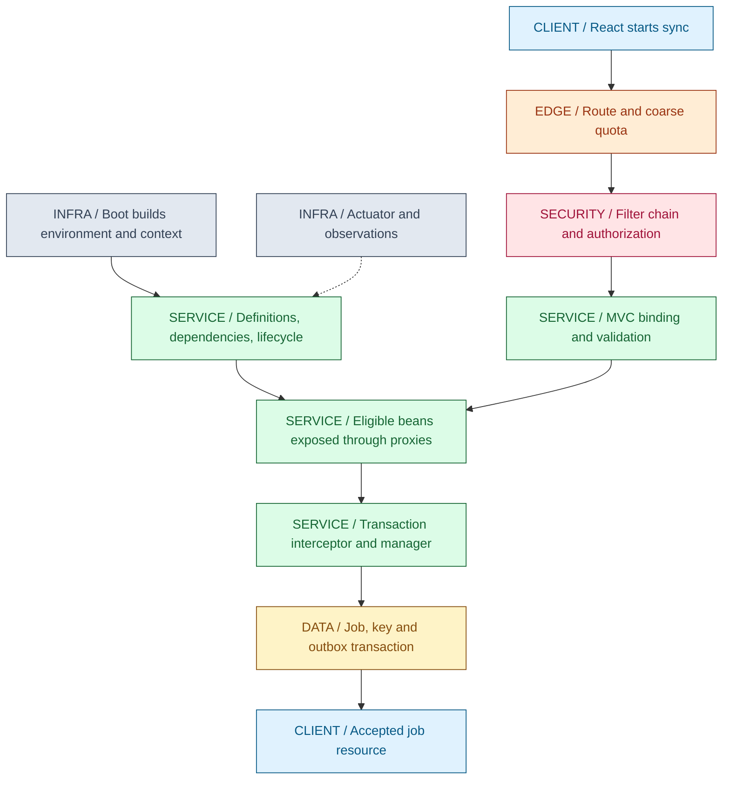

The top path prepares objects; the request path uses them. Initialization is not an HTTP request, dependency injection is not authorization, and a proxy is not a database. Keeping those boundaries separate makes unfamiliar startup and production failures much easier to trace.

## What You Will Be Able to Explain

- Describe how bean definitions become initialized objects, and distinguish definition processors from instance processors.
- Explain JDK versus class-based proxies, self-invocation, configuration enhancement and advice ordering.
- Diagnose auto-configuration using conditions and dependency evidence rather than adding annotations at random.
- Trace a servlet request through filters, MVC argument resolution, validation, controller, service proxy and response conversion.
- Reason about transaction boundaries, rollback-only state, propagation and the limits of thread-bound transactions.
- Place authentication, authorization, Actuator exposure and probes at the right boundaries.
- Choose Gateway, Config, Feign and discovery intentionally, including what Kubernetes can already provide.

> [!PRODUCTION]
> **Where this lives in IntegrationHub.** The [master journey](00-master-map.md#ch00-master-map) enters a connector endpoint whose injected service is a managed proxy. [Java type/runtime rules](01-java-jvm.md#ch01-java-jvm) constrain that proxy, and [concurrency rules](02-concurrency.md#ch02-concurrency) constrain singleton state and task handoffs. The acceptance transaction owns local durable writes, while [07's outbox](07-messaging.md#ch07-messaging) owns later publication. [08](08-security.md#ch08-security) deepens identity and [15](15-kubernetes.md#ch15-kubernetes) deepens runtime networking; neither makes a missing service authorization check acceptable.

<a id="ch03-ioc"></a>
## 1. IoC: The Container Owns Construction, Not Your Invariants

**Why it exists:** a connector service should depend on a token provider and a job store without hard-coding their construction at every call site. Inversion of control moves object assembly and lifecycle policy to a container. Dependency injection is the mechanism by which collaborators are supplied. This supports replaceable implementations and explicit tests; it does not make a poorly chosen dependency graph a good design.

A bean definition describes how to create and configure an object: type or factory method, scope, dependencies, qualifiers, lifecycle callbacks and other metadata. It is not yet the object. Definitions can come from annotated configuration, component scanning, imports or programmatic registration. The container resolves references and creates instances when the relevant scope/laziness rules require them.

### From Definition to Dependency

- Register the service definition and its collaborators, for example a connector registry, secret-reference resolver and job repository.
- Select the constructor/factory method and resolve its arguments against candidate definitions/instances.
- Use type, qualifiers and primary-candidate rules as applicable; ambiguity is an error to understand, not permission to select a random bean.
- Construct the object and complete managed population/initialization before exposing the intended reference to consumers.
- Inject the exposed reference, which may be a proxy rather than the raw object that was constructed.

Constructor injection makes required dependencies visible and permits final fields. It allows a plain unit test to construct the class without starting the container. Setter injection can fit genuinely optional/reconfigurable dependencies; field injection hides requirements and encourages tests coupled to reflection or container startup. A single constructor usually needs no redundant Autowired annotation under modern Spring conventions; do not infer that every constructor overload is automatically unambiguous.

| Assembly choice | Use when | Avoid when |
|---|---|---|
| Constructor injection | Collaborators are required and should be fixed for the object's lifetime | You mistake a very long constructor for a container problem rather than excessive responsibilities |
| Bean factory method | You need explicit construction or integrate a third-party class | Factory methods hide unmanaged secondary objects requiring their own lifecycle |
| Component scanning | Application-owned components follow a clear package boundary | Broad scanning unintentionally registers test/client configuration or misses a sibling module |
| ObjectProvider or scoped proxy | Lookup must be deferred or cross an actual scope boundary | Deferred lookup merely hides a circular architecture dependency |
| Direct new | The object is a plain value/helper with no managed requirements | You expect transaction, async, validation or other container advice on the unmanaged instance |

**Scope is not thread safety.** Singleton means one shared bean instance for that definition in the relevant container, not one object per Java class across the JVM. Two contexts or two definitions can produce different instances. A singleton service may receive many concurrent requests; request data must not live in mutable instance fields without a deliberate ownership model. [02](02-concurrency.md#ch02-concurrency) explains the required coordination.

Prototype means new instance on each relevant container retrieval, not a fresh object every time any method runs. Injecting a prototype into a singleton normally resolves that dependency at injection time, so the singleton can keep one prototype instance. If fresh lookup per operation is required, use an explicit provider/factory. Request/session scopes need the appropriate web context and valid scope lifetime; passing a request-scoped object to an unowned background task is not safe by default.

**Production trap:** a tenant-specific credential field is stored on a singleton connector bean. The next request overwrites it while another task is using it, potentially crossing tenant boundaries. Keep immutable connector definitions shared and authorized per-call context local. Injection fixes wiring, not confidentiality or [data protection](08-security.md#ch08-security).

**Interview checks:** basic: bean definition versus instance. Internals: dependency resolution can supply a proxy. Debug: inspect candidates, qualifiers and scan boundaries. Scenario: a constructor cycle usually indicates responsibilities that need separation; do not reflexively enable circular references.

<a id="ch03-lifecycle"></a>
## 2. Bean Lifecycle: Definitions First, Instances Later

**Why lifecycle hooks exist:** resources may need initialization after dependencies are available and cleanup when their owning context closes. Framework extensions also need points to inspect definitions and wrap instances. A mental model that collapses all of these into "Spring calls the constructor" misses where much of Spring's behavior is installed.

BeanFactoryPostProcessor operates on definition-level/container metadata before ordinary application beans are created; BeanDefinitionRegistryPostProcessor additionally contributes definitions. Configuration-class processing is an important example. BeanPostProcessor works around instance creation/initialization; specialized variants participate in instantiation and dependency population. Auto-proxy infrastructure uses these extension points to expose eligible objects with advice.

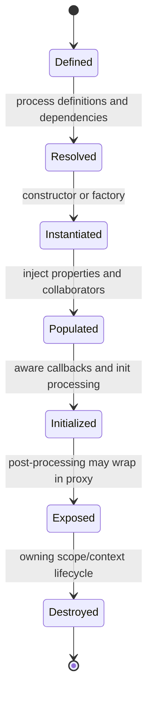

This is a normal-path model, not the exact callback list for every bean. Special infrastructure beans, FactoryBeans, lazy instances, early references and scope proxies add branches. Dependency injection itself can be implemented through specialized post-processors; it is not always a single universal step between two fixed callbacks.

For a typical initialized bean, relevant Aware callbacks provide container context, initialization processing handles PostConstruct, InitializingBean.afterPropertiesSet and a configured init method as applicable, then after-initialization post-processing can expose the advised object. When using multiple initialization mechanisms, understand their order and avoid performing the same expensive action twice. Constructors must establish a valid object; lifecycle hooks are not a reason to publish partially initialized state.

### Initialization Is a Poor Place for Remote Work

A PostConstruct method runs as part of creating the target bean, before callers use the fully exposed proxy in the usual way. A self-call from that initialization method should not be expected to trigger transactional advice. A remote provider outage during startup can block or fail context creation; readiness and retry policy need a conscious lifecycle design, not a network call hidden inside a constructor.

For startup work, distinguish lightweight local validation, asynchronous warm-up, migration, a one-time administrative job and essential initialization that must prevent serving. SmartLifecycle, runners and application events have different timing/ownership semantics. A runner finishing is not a distributed leader-election guarantee, and starting the same runner on every Pod can duplicate work. [22](22-distributed.md#ch22-distributed) owns singleton-job coordination.

Cleanup callbacks apply to objects whose lifecycle the container owns. Singleton destruction on context close does not mean prototype instances are automatically tracked and destroyed after arbitrary use. Request-scoped cleanup also does not make detached background tasks safe. A process kill or node failure can skip normal shutdown entirely; durability cannot depend solely on PreDestroy.

**[VERIFY: exact callback order, early-reference behavior, circular-reference policy, scoped-proxy behavior and AOT/native constraints depend on the Spring/Boot version and bean kind. Check the selected Framework lifecycle/post-processor documentation and test the actual context; the chapter diagram is a normal-path model, not a universal callback trace.]**

| Lifecycle decision | Use when | Avoid when |
|---|---|---|
| Local init validation | Invalid configuration should fail before serving | Slow external calls obscure whether startup or a dependency is unhealthy |
| Managed start/stop component | The component owns a background resource with explicit ordering | A raw unmanaged thread survives context close |
| Explicit job execution | Work needs retries, durable state or single-owner coordination | Every replica's startup implicitly runs the same destructive job |
| Destroy callback | Best-effort orderly cleanup of owned resources | It is treated as the only mechanism to preserve accepted business work |

**Lab connection:** ContainerTransactionLab holds a LifecycleProbe, checks its configured open callback and per-context singleton identity, closes the context, then checks close was invoked. It does not demonstrate every lifecycle callback or Spring Boot startup event. All checks remain unexecuted.

**Interview checks:** basic: post-processors are not all interchangeable. Internals: definition processing precedes ordinary instance work. Debug: a bean can exist without the proxy behavior you expected if it was created too early or outside management. Scenario: choose an explicit startup policy rather than relying on annotations inside initialization.

<a id="ch03-proxies"></a>
## 3. AOP Proxies: Did the Call Cross the Boundary?

**Why AOP exists:** transaction interception, auditing and other cross-cutting behavior should not be manually repeated in every business method. A pointcut selects relevant executions, advice describes the extra behavior, and an advisor associates the selection with the advice. Spring's usual AOP model intercepts method calls through a proxy; it is not arbitrary interception of every field access or every internal method call.

The client holds a proxy. On a selected invocation, the proxy runs an interceptor chain around the target call. Before/after/around behavior depends on the advice; around advice can change whether, how often, or with which result the target executes. Advice ordering therefore has business consequences. Retry outside a transaction can create a fresh transaction per attempt; retry inside one already-rollback-only transaction may not produce the intended recovery.

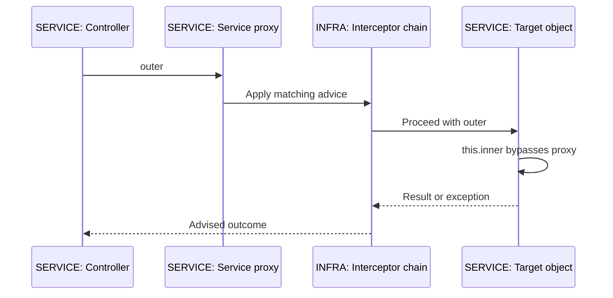

### JDK and Class-Based Proxies

JDK dynamic proxies implement interfaces; consumers should use the exposed interface contract. Class-based proxies create a subclass of the target class. For that mechanism, final classes cannot be subclassed, and final/private methods cannot be overridden for advice. These restrictions should not be misstated as "a final target can never be used behind any Spring proxy": a JDK interface proxy can delegate to a final implementation.

Core Spring and Boot can select different defaults depending on configuration. Explicit proxy settings and framework version matter, so inspect the actual bean type and AopUtils diagnostics rather than reciting one unconditional default. Native-image/AOT environments impose additional constraints beyond the ordinary JVM teaching model.

| Mechanism | Use when | Avoid when |
|---|---|---|
| JDK interface proxy | Consumers need a defined interface contract | Code insists on casting the exposed proxy to a concrete implementation |
| Class-based proxy | The class/method contract supports subclass interception | Final/private/inaccessible methods are assumed interceptable |
| Separate collaborating bean | A cross-cutting boundary must be crossed during a workflow | Splitting classes solely to hide a still-confused business transaction boundary |
| Programmatic transaction template | An explicit lexical boundary is clearer than proxy interception | Repeating low-level transaction code without a reason |
| AspectJ weaving | Requirements genuinely need bytecode-level join points | Introducing operational/build complexity merely to avoid understanding self-invocation |

**Self-invocation:** once execution is inside the target, this.inner is a direct target call, not another call through the caller's proxy. It bypasses advice on inner in the usual proxy model. A class-based proxy does not automatically fix this. Move the advised operation to a collaborator, make the external method the correct boundary, or choose explicit programmatic control. Self-injection/currentProxy approaches add coupling and are rarely the clearest default.

**[VERIFY: proxy defaults, method visibility support and per-bean proxy controls differ across Framework/Boot releases. Official proxy documentation was consulted; the labs deliberately choose interface proxying and class-based transaction proxying explicitly. Do not apply class-proxy final-method restrictions to all interface proxy calls or assume weaving behaves like proxies.]**

### Complete Proxy Boundary Probe

**NOT EXECUTED.** This complete class matches the saved ProxyBoundaryLab.java in the Maven lab. It uses real Spring ProxyFactory, not a homemade simulation. Its success string is code, not observed output. The target is final to demonstrate the interface-proxy distinction; the code does not request a class-based proxy.

```java
package guide.spring;

import java.util.ArrayList;
import java.util.List;
import org.aopalliance.intercept.MethodInterceptor;
import org.springframework.aop.framework.ProxyFactory;

public final class ProxyBoundaryLab {
    public interface Operations {
        void outer();
        void inner();
    }

    public static final class Target implements Operations {
        private final List<String> events;

        Target(List<String> events) {
            this.events = events;
        }

        public void outer() {
            events.add("target:outer");
            inner();
        }

        public void inner() {
            events.add("target:inner");
        }
    }

    public static void main(String[] args) {
        var events = new ArrayList<String>();
        var factory = new ProxyFactory(new Target(events));
        factory.setInterfaces(Operations.class);
        factory.addAdvice((MethodInterceptor) invocation -> {
            events.add("advice:" + invocation.getMethod().getName());
            return invocation.proceed();
        });
        Operations proxy = (Operations) factory.getProxy();
        proxy.outer();
        if (!events.equals(List.of("advice:outer", "target:outer", "target:inner"))) {
            throw new AssertionError("Self-invocation must bypass this proxy's advice: " + events);
        }
        events.clear();
        proxy.inner();
        if (!events.equals(List.of("advice:inner", "target:inner"))) {
            throw new AssertionError("External invocation must cross the proxy: " + events);
        }
        System.out.println("ProxyBoundaryLab: all checks passed");
    }
}
```

The expected event sequences are assertions in unexecuted source, not a terminal transcript. They identify exactly what would disconfirm the explanation: inner advice appearing during target self-invocation or missing during a direct external proxy call under this setup.

### Configuration Enhancement Is a Separate Concern

Full Configuration classes can be enhanced so calls between Bean methods resolve managed beans rather than naively creating unrelated instances. With proxyBeanMethods=false, ordinary method calls between factory methods are ordinary Java calls; use method parameters for dependencies instead. This optimization/control is distinct from transaction/AOP proxying of the beans the configuration creates. The transaction lab disables configuration-method proxying but explicitly enables class-based transaction proxies, demonstrating that these are different decisions.

**Production failure:** a connector's public method calls a private annotated method and assumes its retry/transaction rule applies. The annotation is present but the invocation boundary never existed. Trace the actual exposed reference, interception eligibility and call path before changing isolation levels or increasing retries.

**Interview checks:** basic: annotation metadata is not executable interception by itself. Internals: advisors run on calls through the proxy. Debug: new, self-calls and ineligible methods are common missing boundaries. Scenario: choose the business boundary first, then make the framework call path match it.

<a id="ch03-auto-configuration"></a>
## 4. Boot Startup and Conditional Auto-Configuration

**Why Boot exists:** common applications otherwise repeat dependency selection, infrastructure configuration, runtime packaging and operational setup. Boot layers conventions and conditional configuration over Spring; it does not replace the IoC container or invent a separate transaction model.

SpringBootApplication combines Boot configuration, auto-configuration enablement and component scanning. SpringApplication prepares an Environment and application context, loads source definitions, refreshes the context, and coordinates the application lifecycle. Embedded-web-server startup, runners, events and availability transitions are part of that lifecycle, not one promise that every possible external dependency is ready when the constructor returns.

Auto-configuration candidates come from registered metadata. In current Boot, AutoConfiguration.imports is the standard registration mechanism for auto-configuration classes. Conditions decide whether particular configuration/bean contributions apply: classes on the classpath, web-application kind, properties and already registered bean candidates are common inputs. Do not describe this as scanning every library class for anything that looks useful.

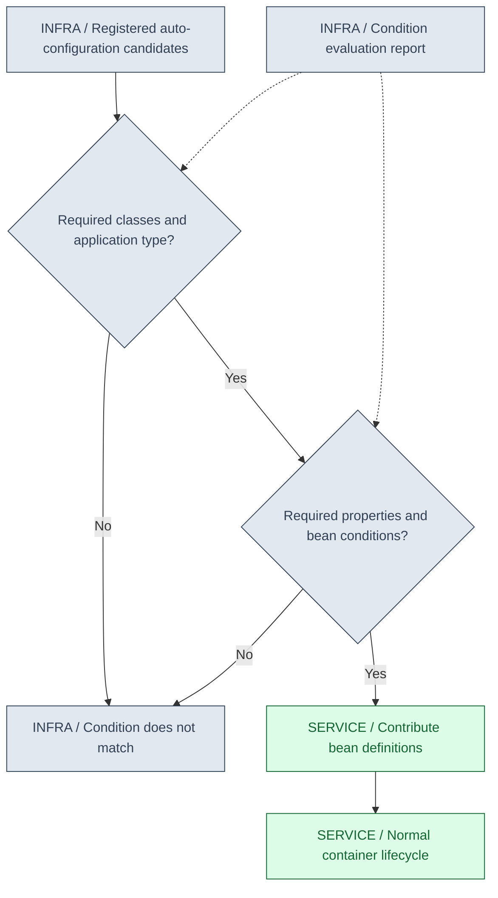

### Backing Off Is Conditional, Not Magical Override

For example, an application-defined DataSource can make the corresponding missing-bean condition fail, so Boot's default contribution backs off. This is different from two definitions colliding under a global override setting. Not every custom bean disables every related auto-configuration; inspect the exact condition and declared type. An overly vague Bean return type can make type-based conditions or resolution harder to reason about.

Starter dependencies make a coherent set of libraries easy to select; auto-configuration reacts to the available capabilities. A BOM manages dependency versions; it does not add the corresponding runtime libraries to the application. A starter also does not prove a feature is enabled under every property/profile combination.

**Diagnostic trace:** identify the missing or unexpected bean -> inspect active profiles and effective properties -> inspect resolved dependencies and application type -> read the condition evaluation report -> inspect user-defined competing beans/exclusions. Boot's debug mode can emit the report; an Actuator conditions endpoint is a separate, access-controlled observation surface. Neither should justify exposing internal configuration publicly.

**[VERIFY: Boot 4 modularization, starter names, auto-configuration packages and condition definitions differ from Boot 3 examples. Check the pinned Boot reference and condition report; official Boot 4.0 auto-configuration documentation was consulted, but no Boot application or report was executed here.]**

| Configuration approach | Use when | Avoid when |
|---|---|---|
| Boot's matching defaults | They satisfy the service contract and can be verified | Defaults are assumed without inspecting profiles/dependencies |
| Application Bean replacing a default | You need a specific implementation and understand backoff conditions | Expecting one custom bean to disable all security/data infrastructure |
| Targeted exclusion | A known auto-configuration must not apply | Broad exclusions hide a missing dependency or break neighboring capabilities |
| Explicit framework configuration | A small lab or unusual integration needs precise control | Rebuilding every Boot convention without a requirement |

**Migration checkpoint:** Boot 3 commonly pairs with Framework 6 and the corresponding Cloud train, while this chapter uses Boot 4/Framework 7. Jakarta package migration from older enterprise APIs, changed module/starter packaging and removed deprecated APIs are different classes of issue. Not every javax package moved: javax.sql.DataSource is still a Java SE API and is deliberately used in the lab. Do not perform a blind global javax-to-jakarta replacement.

**Production failure:** adding an unrelated starter changes the classpath enough to activate an unintended infrastructure path. Startup now fails or uses a different bean. Capture the dependency change and condition report, then choose an explicit supported configuration rather than downgrading random transitive JARs.

**Interview checks:** basic: Boot is Spring plus conventions/integration, not another DI model. Internals: conditions contribute definitions. Debug: backoff differs from override. Scenario: prove which configuration applies using the effective environment and report.

<a id="ch03-configuration"></a>
## 5. External Configuration: Typed Values and Controlled Change

**Why it exists:** the same image should run with different endpoints, capacities and secret references without rebuilding application code. Environment aggregates property sources, while binding maps external values into application configuration. Configuration is an input with validation and authorization needs, not a harmless collection of strings.

ConfigurationProperties is useful for a coherent group such as connector timeouts, concurrency and retry limits. It supports typed binding, including values such as Duration when configured appropriately, and validation when the validation infrastructure/annotations are in place. Register the properties type through the supported scanning/enablement mechanism. A record-style properties object can make immutable startup configuration clear.

Value is convenient for an isolated value or expression, but many scattered placeholders obscure the service's configuration contract. Neither annotation implies live updates to every existing object. Resolving a value at construction time is different from reading the Environment again during an operation, and neither alone safely replaces a live connection pool.

### Resolution Trace

- Assemble property sources from configured locations and inputs.
- Determine active profiles and imports according to Boot's config-data rules.
- Resolve a property's winning source under the documented precedence rules.
- Convert and bind it to the declared target type.
- Validate constraints and cross-field invariants before the component uses it.
- Record a nonsecret version/origin for diagnosis, not raw secret material.

Command-line inputs, environment variables and files can have different precedence, and early bootstrap properties are read at particular phases. A late property source cannot necessarily change an earlier logging/bootstrap decision. Profile documents add another dimension: verify the active configuration, not just a checked-in YAML file. Never assume the mounted file is the value currently inside every bean.

| Technique | Use when | Avoid when |
|---|---|---|
| Typed configuration properties | A coherent, validated configuration contract has several related fields | Invalid cross-field combinations are accepted until the first request |
| Isolated Value injection | One simple value is genuinely local | Scattered injection hides a large shared config schema |
| Immutable rollout configuration | Reproducibility and coordinated replacement matter | Restart is used blindly where a documented safe live-update mechanism is required |
| Controlled live refresh | Specific beans support safe rebind/recreation and change is audited | A property update is assumed to atomically switch all processes/resources |
| Secret references | Application needs a credential through an authorized secret path | Plain secrets enter Git, environment dumps, error messages or full HTTP logs |

**[VERIFY: property-source precedence, relaxed binding, constructor binding, validation activation and config-data imports vary with Boot/Cloud version and application setup. Consult the pinned external-configuration reference and inspect effective origins; no configuration binding or live-refresh test ran in this lab.]**

**IntegrationHub failure:** a concurrency limit refresh lowers the intended bound while many jobs already hold permits. Replacing a number does not settle ownership of existing permits or implement a safe transition. Define how old work drains and when the new policy applies; [02](02-concurrency.md#ch02-concurrency) owns atomic snapshots and resource accounting. Config refresh is a business change, not merely an HTTP management call.

**Interview checks:** basic: property source versus bound object. Internals: conversion/validation occur at binding boundaries. Debug: find the actual winning property origin. Scenario: distinguish restart-safe configuration from stateful resources requiring coordinated refresh.

<a id="ch03-mvc"></a>
## 6. MVC Request Lifecycle: Before and After the Controller

**Why MVC infrastructure exists:** routing, argument conversion, validation, exception translation and response representation are recurring concerns. A controller should translate an HTTP contract into an application call, not parse sockets, authenticate every token and manually serialize every failure.

This section traces the servlet MVC stack, not WebFlux. A servlet container accepts the request and runs its filter chain, including applicable security and other filters. DispatcherServlet is the front controller for MVC dispatch. HandlerMapping locates the handler and related interceptors; HandlerAdapter knows how to invoke it. Argument resolvers obtain path/query/header/principal/body values, conversion and message converters build Java arguments, and validation can reject them before the method body runs.

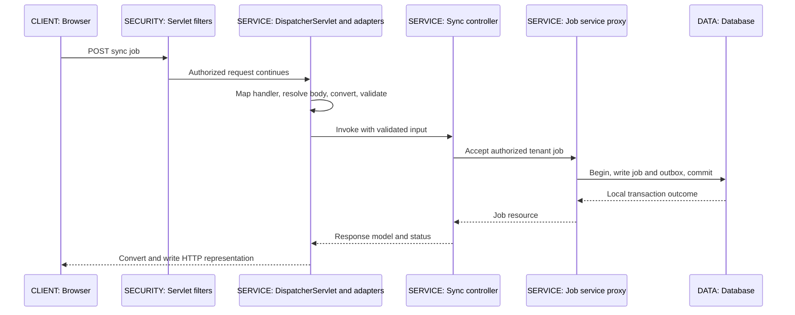

Return-value handlers and message converters produce the response, for example serializing a response body rather than resolving a view. RestController combines controller semantics with response-body handling; it is not a separate HTTP server. A ResponseEntity expresses status, headers and body, not a transaction or authorization guarantee.

### Exception Boundaries Matter

HandlerExceptionResolver infrastructure can translate applicable MVC exceptions; ControllerAdvice/ExceptionHandler centralizes application-specific mappings. A failure earlier in the servlet/security chain may never reach that MVC mechanism. A response already committed or partially streamed cannot always be replaced with a clean error document. Distinguish where the failure happened before assuming one global annotation catches every request failure.

A transaction can commit successfully inside the service proxy, then response serialization can fail later. The client sees a failure or loses the response, but the job may already be durable. Conversely, flushing an entity before returning is not necessarily commit. This is the same unknown-outcome boundary from [00](00-master-map.md#ch00-master-map), with API idempotency in [05](05-apis-realtime.md#ch05-apis-realtime) and persistence mechanics in [04](04-jpa.md#ch04-jpa).

Filters surround servlet-level processing and can reject requests before handler selection. MVC interceptors act around MVC handler invocation and see handler-related context; they are not substitutes for the Security filter chain. Argument resolvers populate controller parameters; service AOP wraps managed method calls. These extension points overlap in capabilities but operate at different boundaries.

| Extension point | Use when | Avoid when |
|---|---|---|
| Servlet filter | Concern spans servlet processing before/after dispatch | You need a selected handler but assume mapping has already happened |
| MVC interceptor | Handler-aware MVC behavior is required | Treating it as complete security coverage for all dispatches/endpoints |
| Argument resolver | A well-defined controller parameter should be derived consistently | Hiding untrusted tenant selection as an already authorized identity |
| ControllerAdvice | Translate applicable MVC/application errors consistently | Expecting it to handle every filter failure or rewrite a committed stream |
| Service advice | A managed application-method boundary owns the concern | HTTP-specific parsing is mixed into every business method |

**Async request trap:** MVC async processing can release a servlet thread while work continues, and later dispatch/completion callbacks have their own context and error behavior. It is not automatically a reactive end-to-end pipeline or a transaction spanning arbitrary new threads. [02](02-concurrency.md#ch02-concurrency) and [05](05-apis-realtime.md#ch05-apis-realtime) explain execution and stream lifetimes.

**Production incident:** the controller breakpoint is never hit and the response is unauthorized, unsupported media type or invalid input. Inspect filter/security decisions, handler mapping, converter selection and binding/validation first. A service bug cannot explain a path that never reached the service.

**Interview checks:** basic: DispatcherServlet dispatches; the container accepts network traffic. Internals: mapping, adaptation, argument resolution and conversion are separate steps. Debug: locate the exception boundary. Scenario: a post-commit serialization failure still needs an idempotent client retry contract.

<a id="ch03-validation"></a>
## 7. Validation: Shape, Business Rules and Database Invariants

**Why validation exists:** reject invalid input early with a stable error contract, while preserving authoritative checks under concurrency. Bean Validation can express local constraints such as nonblank connector IDs or bounded batch size. It does not prove the caller owns that connector, that the provider supports the requested mapping, or that another request has not already used an idempotency key.

Valid triggers cascaded validation at supported boundaries; Validated enables relevant Spring validation/group behavior. The exact MVC or method-validation path depends on annotations, configuration and version. A constraint annotation on an arbitrary object does nothing unless some validator actually invokes it. Nested DTOs and container elements need the appropriate constraints/cascade rules.

### Three Checks, Three Authorities

- **Request shape:** can input be parsed and converted, and do local field/nested constraints hold? Perform this before unnecessary work.
- **Business/security policy:** is the authenticated principal allowed to operate on the resolved tenant resource, and does the requested operation make sense now? The service owns this decision.
- **Durable concurrency invariant:** can the database transaction insert this tenant-scoped key/job without violating uniqueness or another required invariant? The database remains the authority when requests race.

The MVC sequence's validation stage covers the first boundary; the service and database stages cover the others. Keeping one giant validator responsible for every database/remote check can produce expensive duplicated queries and time-of-check/time-of-use races. For example, two validated requests can both see an unused key before either inserts it; a unique constraint plus defined conflict handling is still necessary.

| Validation mechanism | Use when | Avoid when |
|---|---|---|
| Bean Validation on DTOs | Local input constraints are deterministic and cheap | It is mistaken for authentication, authorization or serializable access |
| Cross-field constraint | Several input fields have a stable relationship | A remote provider call is hidden in a field validator without timeout/cost policy |
| Service-level validation | Domain decisions need authorized current context | Every caller can bypass it by calling a lower-level write method |
| Database constraint | An invariant must survive concurrent writers | Relying only on a prior existence check |
| Error translation | Clients need stable codes and field paths | Returning raw exception messages, SQL or secrets |

**[VERIFY: MVC method-validation activation, exception types, validation groups and proxy-based service validation differ across Framework versions and annotation placement. Check the pinned MVC/Bean Validation integration documentation; no controller, validator or error-handler integration test was executed.]**

**Production trap:** validation error text echoes a secret or a rejected raw payload. Return a bounded, sanitized error model and a safe correlation identifier; retain only approved diagnostics. [08](08-security.md#ch08-security) owns data handling, and [19](19-testing.md#ch19-testing) should include malformed input, cross-tenant access and concurrent duplicate-request cases.

**Interview checks:** basic: constraints require an invocation boundary. Internals: binding/conversion may fail before validation. Debug: verify cascades and groups. Scenario: early validation and a database uniqueness constraint solve different problems.

<a id="ch03-transactions"></a>
## 8. Transactional: Metadata, Interceptor, Manager, Resource

**Why declarative transactions exist:** a service operation often needs a local group of database changes to commit or roll back together. Annotation metadata describes the intended policy; a proxy interceptor discovers it, a transaction manager applies it, and participating resource access must use that manager's resource integration. The annotation is not a database feature by itself.

For IntegrationHub acceptance, job, idempotency record and outbox intent should commit in the same local transaction. The later Kafka publish is outside that database commit. [07](07-messaging.md#ch07-messaging) explains the durable relay/duplicate-delivery boundary; using Transactional on a Java method does not turn PostgreSQL plus an HTTP provider plus Kafka into one atomic operation.

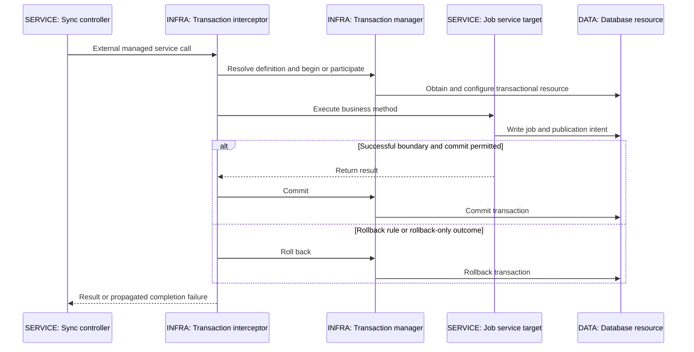

### Thread Binding Is Not Global Scope

With imperative transaction management, relevant resources/synchronizations are commonly bound to the executing thread through Spring's transaction infrastructure. JdbcTemplate participates through its resource utilities instead of casually opening an unrelated connection. A new thread or arbitrary async continuation does not automatically inherit that transaction. Reactive transaction management uses a different context/lifetime model; do not apply the thread-bound story unchanged to a Publisher.

The correct manager matters. A JDBC manager for one DataSource does not automatically coordinate another DataSource or an external system. When multiple managers exist, select/qualify deliberately. Different repositories may participate through different resource integrations; inspect the actual stack before attributing everything to a single annotation.

### Defaults and Rollback Rules

The documented default propagation is REQUIRED and isolation is DEFAULT. The default exception rule rolls back on RuntimeException and Error, not ordinary checked exceptions; explicit rules and newer global rollback configuration can change that. Never say "checked exceptions can never roll back" or "all Spring exceptions always roll back." A caught exception that never reaches the interceptor can also produce a different outcome than an uncaught one, unless the transaction was independently marked rollback-only.

readOnly is a hint/policy input whose enforcement depends on the transaction manager, database and persistence provider. It is not a universal write-prevention security boundary. A configured transaction timeout also does not reliably interrupt arbitrary remote I/O or bound every later cleanup step. Keep database work bounded and avoid holding connections/locks while waiting for slow providers.

| Propagation choice | Use when | Avoid when |
|---|---|---|
| REQUIRED | Service calls should join one local unit if it exists, otherwise start one | Assuming inner success/failure commits independently |
| REQUIRES_NEW | A deliberately independent transaction must suspend an outer one | It accidentally breaks business atomicity or exhausts a pool while outer resources remain held |
| NESTED | Supported resource/manager savepoint semantics fit partial rollback inside one physical transaction | Assuming every JPA/driver/manager supports it or that it commits independently |
| SUPPORTS / NOT_SUPPORTED | The operation's contract intentionally allows participation or suspends it | The resulting no-transaction path performs writes that needed atomicity |
| MANDATORY / NEVER | You want to enforce presence or absence of an existing transaction | These are used without understanding callers' boundaries |

### REQUIRED and the Rollback-Only Surprise

An outer transactional facade calls another bean's transactional method. The inner call participates in the same physical transaction and throws a rollback-triggering exception through its interceptor. The outer code catches the exception and returns normally, but the shared transaction may already be marked rollback-only. When the outer interceptor attempts commit, UnexpectedRollbackException reports that it could not commit as the caller expected. Catching an exception does not undo the transaction manager's state.

ContainerTransactionLab deliberately exercises this with a facade and a separate JobService proxy. It also contrasts an external insertThenFail call, which should roll back, with a nontransactional selfInvokeThenFail call that invokes the annotated method directly on the target. Under the lab's JDBC/H2 setup, that self-call bypasses advice and the insert can auto-commit before the exception. This is a negative fixture, not a recommended service design.

### Diagnosing a Missing or Wrong Transaction

- Was this object obtained from the intended context, or created directly with new?
- Did the caller invoke the exposed proxy, or a target/self/private/final path ineligible for that mechanism?
- Did the advice resolve the intended transaction manager and resource?
- Did an existing outer transaction change the effective propagation/isolation behavior?
- Was the exception thrown through the interceptor, translated, caught, or followed by rollback-only state?
- Did another thread, connection or external service perform work outside the local boundary?
- Did the database commit fail after the method body returned, or did response conversion fail after commit?

**[VERIFY: transactional method visibility, global rollback defaults, reactive cancellation semantics, savepoint support and timeout/read-only enforcement vary by Framework, transaction manager and resource. Official annotation/proxy documentation was consulted; the H2 lab is unexecuted and cannot establish PostgreSQL behavior, production pooling or cross-resource atomicity.]**

**Production failure:** REQUIRES_NEW is added to make audit records survive a failed outer operation, but each caller holds its outer connection while waiting for another. Pool starvation can follow under load if capacity cannot satisfy the nested demand. Make the independent-commit requirement explicit, size/test resources, and consider a durable event design where appropriate. [02](02-concurrency.md#ch02-concurrency), [06](06-databases.md#ch06-databases) and [23](23-jvm-performance.md#ch23-jvm-performance) connect those effects.

**Interview checks:** basic: annotation plus interception plus manager plus participating resource. Internals: logical REQUIRED scopes can share one physical transaction. Debug: distinguish missing proxy from rollback-only participation. Scenario: never put a remote payment effect inside a local transaction and claim it will be undone by rollback.

<a id="ch03-security"></a>
## 9. Spring Security: Select the Chain, Then Authorize the Resource

**Why it exists:** authentication and access policy should be enforced consistently before protected work, not reimplemented ad hoc in controllers. On the servlet stack, a container-level DelegatingFilterProxy delegates to Spring-managed security infrastructure; FilterChainProxy selects the applicable SecurityFilterChain. With multiple chains, matching/order determines which chain handles the request, rather than every chain being concatenated blindly.

Authentication produces an authenticated principal/authorities under a configured mechanism. Authorization asks whether that principal may perform this operation. A verified JWT signature alone does not answer tenant/resource authorization; issuer, audience, time claims and authority mapping need their configured checks, and the service must enforce ownership for the requested connector/job.

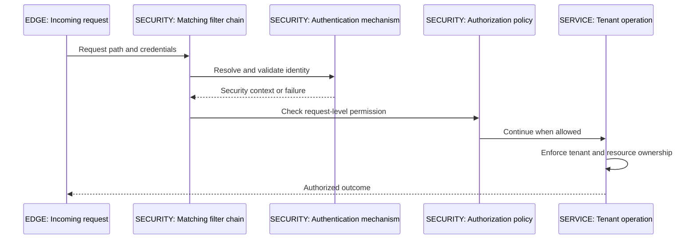

A broad earlier chain can shadow a more specific one. A gap with no applicable chain can leave a request outside expected protection depending on configuration. Request-level matchers and method-level authorization are different enforcement points; method authorization also needs its infrastructure enabled and an eligible call path. Proxy self-invocation can matter there too. Inspect the selected chain and actual authentication rather than asserting that declaring one bean secures every route.

### The IntegrationHub Browser Boundary

The reference browser flow uses a same-origin secure HttpOnly session at the gateway/BFF boundary, with internal access-token handling as appropriate. Cookie-authenticated state-changing requests need CSRF protection. A stateless internal bearer API may have a different CSRF analysis, but a broad "REST means disable CSRF" rule is unsafe. CORS controls browser cross-origin access; it is not authentication or a rule restricting all nonbrowser callers.

Do not accept an arbitrary tenant header just because the gateway sent other useful headers. Strip/rebuild trusted identity metadata at the boundary, authenticate the hop where required, and authorize at the service. SecurityContext and logging/tracing context need supported propagation when work crosses thread/executor boundaries; [02](02-concurrency.md#ch02-concurrency) explains why ThreadLocal does not follow arbitrary future composition automatically.

| Enforcement choice | Use when | Avoid when |
|---|---|---|
| Request-level rules | Paths/methods define a useful first access boundary | Fine-grained resource ownership is assumed from a path pattern alone |
| Method authorization | Application operations need reusable policy independent of one controller | Infrastructure is not enabled or a bypassed method call is assumed intercepted |
| JWT resource-server validation | Service receives tokens for its intended audience and trust model | Signature-only checks or user-controlled authority/tenant claims are blindly trusted |
| Session/cookie boundary | Browser session lifecycle is intentionally server-managed | CSRF, cookie scope, logout/revocation and cross-origin behavior are ignored |

**[VERIFY: SecurityFilterChain defaults/order, matcher APIs, method-security activation, JWT claim validation and management-endpoint security differ by Spring Security/Boot version and configuration. Check the pinned servlet security architecture and test both allowed and denied paths; no authentication or authorization integration test ran in these labs.]**

**Production incident:** a management-path rule is assumed to protect Actuator, but the actual management context/port or selected chain differs. An internal endpoint becomes accessible more broadly than intended. Treat management networking and authentication as part of the attack surface and validate them from outside the process, not only through unit tests of a controller.

**Interview checks:** basic: authentication is not authorization. Internals: first applicable chain and its filters determine the servlet path. Debug: distinguish filter failures from MVC advice failures. Scenario: test cross-tenant denial even for a correctly authenticated token.

<a id="ch03-actuator"></a>
## 10. Actuator: Operational Visibility Is an Access-Control Decision

**Why it exists:** operators need standard health, metrics and diagnostic surfaces without adding custom debugging controllers. Actuator contributes endpoints and integrations; what is enabled, accessible, exposed over HTTP/JMX and authorized are separate concerns. A dependency on Actuator is not a decision to publish every endpoint to the internet.

Health can aggregate indicators; metrics expose measurements through appropriate registries/endpoints; diagnostic surfaces can reveal conditions, mappings or configuration. These can disclose topology, secret-adjacent data or resource usage even when some values are sanitized. A heap dump is especially sensitive and expensive. Minimize exposure, protect it, audit access and bound diagnostic collection.

### Liveness and Readiness Are Different Questions

Liveness asks whether restarting this process is an appropriate response to its state. Readiness asks whether it should receive traffic now. Putting a shared database outage into every Pod's liveness check can create a restart storm without fixing the database. Readiness dependency policy also requires judgment: marking every replica unready during a shared outage may be correct for one service contract and harmful for another.

A management port responding proves that its handler path works, not that the main application connector is healthy. Where supported and appropriate, expose/check relevant probes through the serving path as well. A successful health endpoint does not verify the entire job/outbox/consumer/SSE business workflow. [15](15-kubernetes.md#ch15-kubernetes) covers probes; [18](18-operations.md#ch18-operations) covers SLIs, alerting and synthetic/business checks.

| Operational surface | Use when | Avoid when |
|---|---|---|
| Minimal health endpoint | Infrastructure needs a narrow availability signal | Detailed dependency names/secrets are exposed unnecessarily |
| Metrics registry endpoint | A secured monitoring path consumes bounded-cardinality signals | Tenant/job IDs become unbounded label dimensions |
| Conditions/configuration diagnostics | Authorized troubleshooting needs configuration evidence | They are left broadly exposed after an incident |
| Heap/thread diagnostics | A permitted investigation needs process evidence | Uncontrolled public access or collection without resource/PII review |

**[VERIFY: Actuator endpoint access/exposure defaults, property names, health groups, probe integration and security backoff vary across Boot versions. Verify the pinned operational reference and actual network paths; no Actuator endpoint or Kubernetes probe was executed.]**

**Production trap:** adding a custom SecurityFilterChain changes the assumptions behind Boot's management security defaults. Re-test management access explicitly. A default that protected an endpoint before customization is not evidence for the customized deployment.

**Interview checks:** basic: enablement, exposure and authorization are separate. Internals: health indicators and business success measure different things. Debug: management-port success can hide serving-path failure. Scenario: do not use shared-dependency liveness checks as a substitute for graceful degradation.

<a id="ch03-gateway"></a>
## 11. Spring Cloud Gateway: Match, Filter, Route

**Why it exists:** edge routing, coarse authentication/quotas and request policy benefit from a consistent boundary. A route associates matching predicates with a destination and filters. Predicates select requests; filters modify or short-circuit processing before/after forwarding. This does not make the gateway the owner of every service's business authorization or transaction.

Gateway has distinct server variants, including WebFlux and MVC arrangements in the relevant ecosystem. Do not mix their APIs/property examples or assume the same runtime behavior. In the reactive server, blocking JDBC or synchronous Feign work on an event loop is dangerous. Choose the stack deliberately and use a compatible client/execution model.

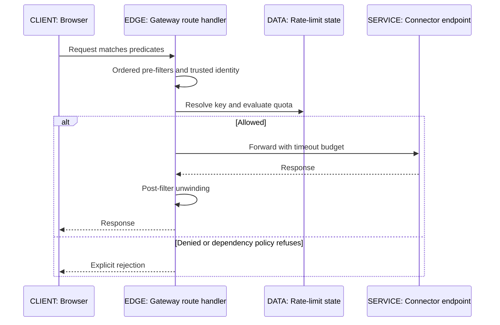

Filter ordering matters. A high-priority filter's pre-work can happen early and post-work late as the chain unwinds. A routing or response-body filter cannot assume a body is freely reusable: buffering, streaming, size limits and data-buffer ownership matter in a reactive stack. Retrying a large upload or rewriting an SSE response can consume memory or break streaming semantics. [05](05-apis-realtime.md#ch05-apis-realtime) owns real-time protocol constraints.

### Rate Limiting Needs a Trusted Key and Failure Policy

A quota filter may use a Redis-backed token-bucket implementation for shared decisions across gateway replicas. The key resolver must derive the intended authorized scope, not accept any header as a tenant identity. Decide how anonymous/empty-key requests behave, how provider outages affect quota checks, and whether rejection is retryable under the API contract. A local limit multiplied across replicas is not a global guarantee.

Coarse ingress quota, provider-specific outbound rate, and concurrent in-flight calls are different limits. A gateway request rate cannot by itself stop a single admitted bulk job from issuing too many provider calls. [10](10-system-design.md#ch10-system-design) connects token buckets, retries and bulkheads; [02](02-concurrency.md#ch02-concurrency) distinguishes concurrency permits from rate per interval.

| Edge choice | Use when | Avoid when |
|---|---|---|
| Gateway route predicate/filter | Shared application-edge policy is genuinely required | The gateway accumulates every domain decision and direct service access bypasses security |
| Redis-backed rate decision | Replicas need coordinated coarse quota state | Redis failure behavior, trusted keys and hot-key load are undefined |
| Infrastructure ingress/load balancer | Standard TLS/routing/traffic distribution is sufficient | It is assumed to implement domain authorization or exactly-once processing |
| Dedicated application endpoint | The operation needs service-owned state/invariants | A complex domain workflow is disguised as a routing filter |

**[VERIFY: Gateway variant, starter names, route/filter configuration namespaces, filter ordering and rate-limiter defaults are release-specific. Check the pinned Spring Cloud Gateway documentation for the chosen WebFlux or MVC server; no route, Redis limiter or streaming proxy was executed.]**

**Production failure:** retries exist at browser, gateway, Feign and worker levels. One logical sync trigger becomes many attempts, exhausting a downstream quota and amplifying uncertain writes. Give retries explicit ownership, share deadline budgets and require the operation's idempotency contract. A gateway retry cannot infer that a timed-out downstream request made no change.

**Interview checks:** basic: predicates match; filters apply behavior. Internals: chain order affects pre/post execution. Debug: check path rewriting, trusted headers, timeouts and body buffering. Scenario: central quotas complement, not replace, tenant checks and outbound provider limits.

<a id="ch03-config-server"></a>
## 12. Config Server and Refresh: Distribution Is Not Atomic Change

**Why it exists:** many services may need versioned external configuration, environment/profile selection and consistent retrieval from a central source. Config Server provides a configuration API over a backend such as Git; clients resolve/import configuration into their Environment according to the configured protocol. A Git commit is not an automatic simultaneous change in all running services.

Modern config-data imports differ from legacy bootstrap patterns. Decide whether remote config is mandatory for startup or optional, and understand the effect on outage behavior. An optional import can allow startup with local defaults; that is dangerous when the missing remote value is safety-critical. Secure config retrieval and backend access; treating the config repository as a secret store requires a separate security analysis.

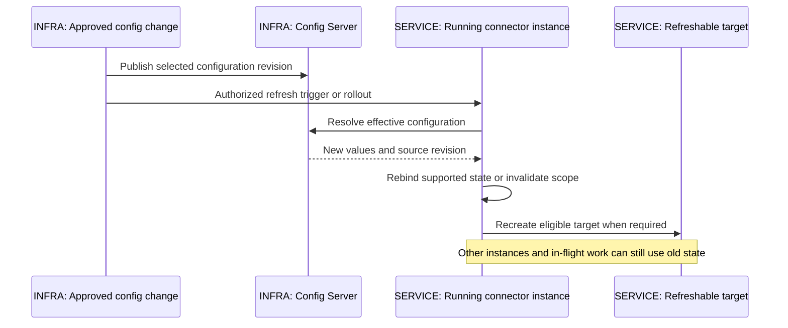

RefreshScope commonly works through a proxy around a lazily initialized target whose cached instance can be invalidated/recreated. Not every bean is refreshable, and changing an Environment entry is not proof that a constructor-injected field changed. Some immutable objects, client resources and AOT/native arrangements have restrictions. Requests in flight may still hold/use old state, so safe refresh requires resource ownership and rollout reasoning.

Spring Cloud Bus can distribute refresh-related events using messaging when configured; it does not turn an asynchronous fleet into an atomic transaction. Protect refresh endpoints, audit revision changes and observe effective configuration per instance. Treat failed/bad refresh as a release incident, with a rollback path and compatibility window.

| Configuration distribution | Use when | Avoid when |
|---|---|---|
| Config Server with versioned backend | Central application-aware/profile-aware config retrieval is needed | It duplicates simpler platform delivery without an ownership/security benefit |
| Refreshable targeted bean | Recreating that resource is supported and in-flight behavior is defined | Updating unrelated state assumes a fleet-wide atomic switch |
| Immutable deployment rollout | Reproducible config/image combinations and controlled rollback matter | The deployment must change safe live parameters too frequently for this policy |
| Kubernetes ConfigMap/Secret delivery | Platform-native configuration distribution fits | Mounted/env values are assumed automatically rebound into all Spring beans |

**[VERIFY: Config Client import/bootstrap behavior, refresh/rebind support, RefreshScope restrictions, Bus integration and management endpoint exposure vary by Cloud/Boot version. Check the selected Config/Common documentation and test the specific bean/resource; no Config Server or refresh cycle was executed.]**

**Production failure:** an old connector instance uses one schema mapping while a refreshed peer uses another against the same checkpoint format. Correctly delivered configuration still breaks the workflow. Version the mapping/checkpoint contract and coordinate compatible transitions through [13](13-integration.md#ch13-integration), [16](16-delivery.md#ch16-delivery) and the later capstone.

**Interview checks:** basic: retrieval, binding and resource recreation are separate. Internals: a refresh proxy does not mutate every reference already held by callers. Debug: inspect effective revision per instance. Scenario: prefer a controlled rollout when a live mixed-version window is unsafe.

<a id="ch03-feign"></a>
## 13. OpenFeign: A Declarative Interface Still Makes a Network Call

**Why it exists:** named client interfaces can centralize remote HTTP contracts and client configuration. Spring Cloud integrates the interface contract, encoder/decoder, interceptors, underlying client, error handling and optional load-balancing/circuit-breaker features. A locally typed interface does not make the remote server trustworthy, available or transactionally attached to the caller.

### Invocation Trace

- The injected client proxy receives an interface method call and interprets its supported annotations/contract metadata.
- Arguments become path/query/header/body data through the selected encoding rules.
- Resolve a fixed URL or a logical service name through the configured destination/load-balancing path.
- Acquire/connect through the underlying HTTP client's pool and send the request under defined timeouts.
- Decode an acceptable response or invoke error handling for non-success responses under the configured contract.
- Apply any explicit retry/circuit/fallback policy and return a value or propagate a meaningful failure.

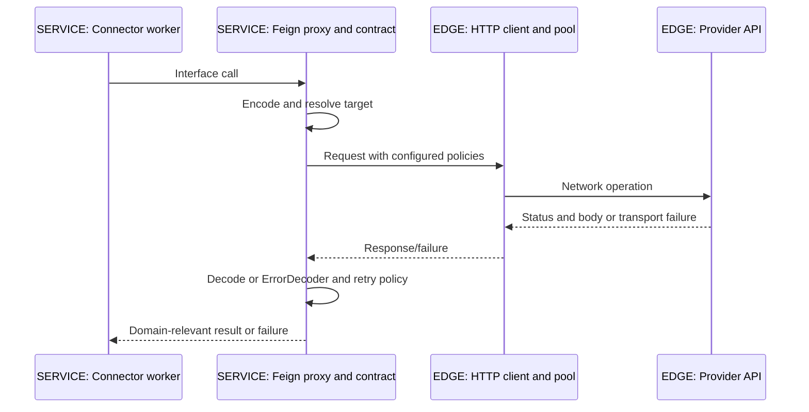

An explicitly supplied URL generally bypasses the logical-name client load-balancing resolution described by Spring Cloud OpenFeign. If name-based load balancing is required, the appropriate LoadBalancer dependency/configuration must exist; declaring a client name is not the same as discovering instances successfully. Avoid sharing a server controller interface indiscriminately with clients: coupling annotation quirks and response models can make independent contract evolution harder.

### Timeouts and Retries Need One Owner

Connect timeout concerns establishing a connection under the client's semantics; read/response timeout concerns waiting for response data. DNS, TLS, pool-acquisition waits and overall deadlines can be separate or library-dependent. Do not claim that one connectTimeout property bounds the entire request, or that a read timeout means the remote handler did nothing. [21](21-network-os.md#ch21-network-os) provides the network trace.

The consulted Spring Cloud OpenFeign reference creates a Retryer.NEVER_RETRY bean by default, unlike assumptions often copied from core Feign behavior. A RetryableException alone does not mean retries occur if the configured retryer refuses them. Choose which failures and operations may retry, cap attempts under a shared deadline, apply backoff/jitter where appropriate, and coordinate with gateway/worker retries.

ErrorDecoder translates relevant HTTP error responses into exceptions; transport failures may follow a different path. A fallback should express a valid degraded business result, not convert failed data retrieval into an empty successful batch that advances a checkpoint. Full Feign logging can expose authorization headers and bodies; keep logs minimized/redacted and consistent with [08](08-security.md#ch08-security).

| Client policy | Use when | Avoid when |
|---|---|---|
| Per-client timeout/pool configuration | Providers have distinct latency and capacity contracts | Global defaults accidentally constrain every client identically |
| ErrorDecoder with typed failures | Caller needs a stable classification of provider HTTP errors | All errors become retryable or sensitive bodies enter exception text |
| Explicit retry policy | Operation is safe to repeat under a bounded deadline | Several layers multiply attempts or external effects are uncertain |
| Circuit-breaker integration | Sustained failures require a defined open/half-open policy | Merely declaring Feign is assumed to install/enable the whole policy |
| Fallback | A genuinely correct degraded result exists | Failure is disguised as successful empty data or authorized absence |

Spring Cloud OpenFeign is described by its current reference as feature-complete, with Spring HTTP Service Clients suggested for new evolution, including blocking/reactive choices. That is not a command to rewrite every working client immediately. Existing code still needs sound timeout, pool, retry and contract testing. Evaluate migration against required features and supported versions rather than assuming declarative HTTP clients are interchangeable.

**[VERIFY: OpenFeign defaults, client selection, Retryer.NEVER_RETRY, ErrorDecoder behavior, URL/load-balancer resolution, refresh support and feature-complete status are release-sensitive. The official reference was consulted; underlying HTTP-client timeout/cancellation semantics and every remote invocation remain untested.]**

**Production incident:** a custom client bean is recreated frequently, creating extra connection pools instead of reusing managed resources. Another common path shares one undersized pool across slow providers and unrelated calls. Inspect client bean lifetime, pool acquisition, active connections, eviction and shutdown. A declarative interface has not removed those network resources.

**Interview checks:** basic: Feign is still an HTTP client call. Internals: contract, encoder/decoder, client and policy layers are separate. Debug: locate pool wait versus connect/read failure. Scenario: a timeout needs idempotency/reconciliation reasoning, not a blanket retry annotation.

<a id="ch03-discovery"></a>
## 14. Discovery and Load Balancing: What Kubernetes Makes Unnecessary

**Why discovery exists:** callers need a stable way to find healthy/relevant destinations while instances move. A registry and a load balancer solve different steps: discovery supplies candidates; selection chooses where to send work. Neither guarantees that the chosen instance survives until the request completes.

Eureka is an application-level registry with client registration/renewal and client-side discovery behavior. It fits some mixed or non-Kubernetes environments, but lease expiry, registry availability, stale caches and rollout timing are part of its operational contract. A discovered address can already be stale; clients still need timeouts and safe failure handling.

In Kubernetes, Services and DNS supply stable discovery/routing abstractions, backed by current endpoints and readiness-related behavior. A normal ClusterIP service path typically distributes connections through the cluster's data plane, not through Spring choosing a Pod on every application call. A headless Service exposes addresses for clients that need different discovery behavior. Exact routing depends on the cluster implementation and protocol.

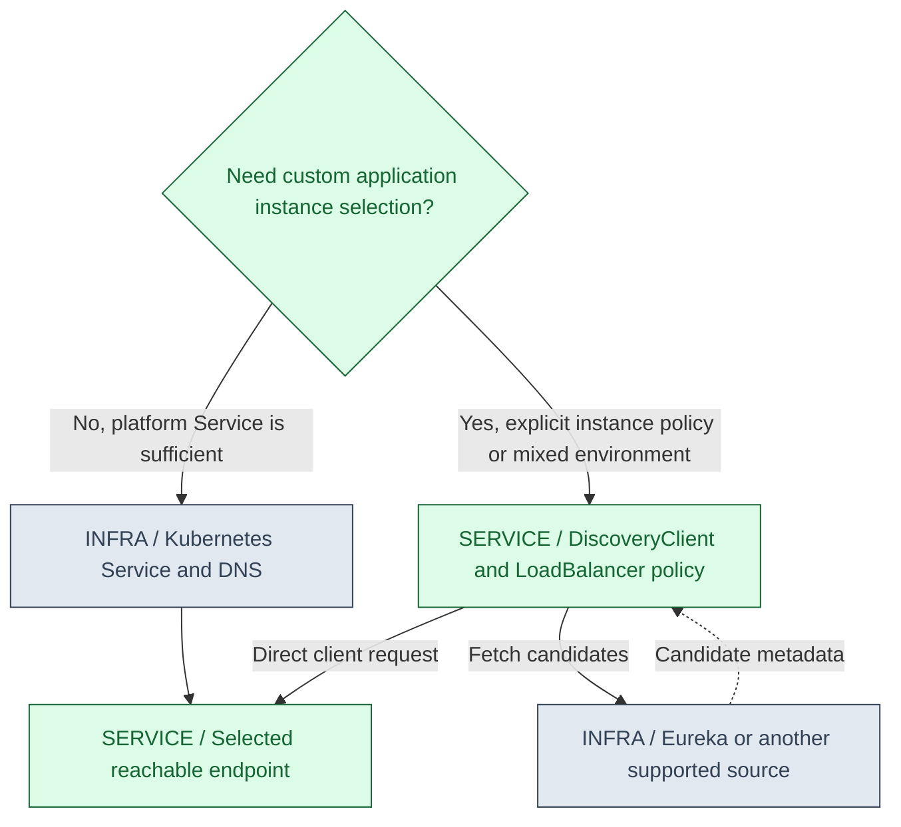

### Client-Side Versus Server-Side Selection

With client-side load balancing, the client obtains an instance set and applies its selection policy before making the request. The registry supplies metadata; it is not the HTTP forwarding hop. With an infrastructure/server-side proxy or virtual service address, the client sends to that address and the infrastructure chooses a backend according to its data-plane behavior. Both have availability and observability costs; simply adding both can create unnecessary indirection or confusing locality policies.

Persistent HTTP connections complicate the shorthand "round robin every request." A connection established through an L4 service path can continue reaching the same backend. HTTP/2 multiplexes requests over a connection, so traffic distribution depends on client connection behavior and any L7 proxy, not just the number of Pods. DNS caching and headless discovery introduce additional staleness considerations explained in [21](21-network-os.md#ch21-network-os).

| Capability | Kubernetes may already supply | Use an additional Spring/Cloud component when | Avoid when |
|---|---|---|---|
| Basic in-cluster discovery | Service naming and DNS | App-level instance metadata/selection or mixed infrastructure requires it | Eureka duplicates the same endpoint directory without a justified policy |
| Traffic distribution | Service data plane and/or ingress/L7 proxy | Client-side selection has a defined routing/locality requirement | Two load-balancing layers conflict or make diagnosis opaque |
| Configuration delivery | ConfigMaps, Secrets, volumes and rollout inputs | Config Server adds needed profile/version/backend behavior across environments | It is kept solely because all microservices are assumed to need it |
| Restart and replica management | Controllers, probes and rollout machinery | Application lifecycle still must own safe work drain and recovery | Platform restarts are mistaken for business retries or transaction recovery |
| Edge routing/TLS | Ingress, Gateway API implementations or external load balancers | Application-edge filters/token/session/quotas require a custom gateway | Two gateways repeat policy without clear responsibility |

Kubernetes does **not** make application authorization, provider-specific retries, idempotency, database invariants, circuit-breaker policy or a good API contract unnecessary. A service mesh can add transport policy and telemetry, but it does not know every domain-side effect. Conversely, not every Spring service on Kubernetes needs Eureka, Config Server and a custom gateway merely to be called a microservice.

**[VERIFY: Eureka lease/cache behavior, Spring Cloud LoadBalancer selection/caching and Kubernetes DNS/Service/endpoint routing depend on release and deployment. Check the actual client and cluster data plane; no registry, Kubernetes service or multi-Pod load-distribution experiment was run.]**

**Production failure:** scaling from two to six Pods does not evenly spread traffic because clients retain a small number of long-lived connections. Measure per-backend load and connection behavior, inspect the routing layer, and choose a compatible client/proxy strategy. Do not conclude that Spring ignored the replica count or claim a universal round-robin guarantee.

**Interview checks:** basic: discovery and selection are separate. Internals: a Service can balance connections rather than each logical request. Debug: inspect stale endpoints, readiness and connection reuse. Scenario: begin with the platform's simplest adequate path and justify every extra registry/proxy.

<a id="ch03-labs"></a>
## 15. Labs, Review Boundaries and a Debugging Routine

The Maven lab is a small Framework application, not a Boot web application. It uses Boot/Cloud dependency management to state an explicit compatibility baseline, but imports only the Framework/JDBC/H2 pieces needed for its mechanisms. No Cloud feature becomes tested because its BOM is imported.

| Source | Assertions present | Not established |
|---|---|---|
| ProxyBoundaryLab.java | Interface-proxy advice on external calls; self-invocation bypass | Boot default proxy selection, weaving, method security or HTTP routing |
| ContainerTransactionLab.java | Singleton identity, init/destroy, explicit class proxy, transaction-active check, external commit/rollback, self-call bypass, rollback-only participation | PostgreSQL isolation, production pool behavior, MVC/Security/Actuator, Gateway/Config/Feign or distributed consistency |
| pom.xml and offline runner | Fixed parent/BOM/plugin declarations; offline invocation; explicit PASS/FAIL/NOT EXECUTED reporting | Dependency availability/resolution, Java compilation or runtime success without tools/cache |

The runner's preflight actually reported NOT EXECUTED. The POM was parsed as XML, which checks structure well-formedness rather than Maven resolution. The chapter's full inline Java listing is checked against the saved file. These checks cannot substitute for a JDK, Maven and real Spring/H2 execution. No fake console transcript, request response or SQL trace is included.

### Trace an Annotation That Appears to Do Nothing

- Identify the exact concern: lifecycle, transaction, caching, async, validation or authorization. Similar-looking annotations use different infrastructure.
- Confirm registration in the intended context and that required infrastructure/dependencies are active.
- Inspect the exposed object and invocation path: managed proxy, unmanaged new, self-call, eligible method and advice order.
- Inspect effective configuration, qualifiers/managers and condition evaluation rather than only source annotations.
- Follow resource boundaries: thread, database connection, HTTP call, broker publication and response serialization.
- Add a negative-path test that distinguishes the claim, such as a write followed by rollback-triggering failure, a denied tenant request or an unmatched security chain.

Tests should scale with the claim. A pure unit test checks domain decisions; a context test checks wiring/proxy behavior; an MVC test checks conversion/errors; an authenticated integration test checks security; a database-backed test checks actual persistence semantics; deployment tests check gateway/config/discovery behavior. [19](19-testing.md#ch19-testing) details test slices and Testcontainers. A happy-path mocked repository test cannot prove rollback.

<a id="ch03-concept-index"></a>
## Explained-Here Index and Sources

| Concept | Explanation |
|---|---|
| IoC, injection, scopes and bean definitions | [Container ownership](#ch03-ioc) |
| Bean lifecycle and post-processors | [Lifecycle](#ch03-lifecycle) |
| Proxies, AOP, self-invocation and configuration enhancement | [Proxy boundary](#ch03-proxies) |
| Boot startup, starters and auto-configuration | [Conditional configuration](#ch03-auto-configuration) |
| External configuration and typed binding | [Configuration](#ch03-configuration) |
| DispatcherServlet, MVC conversion and errors | [Request lifecycle](#ch03-mvc) |
| Validation, authorization and durable constraints | [Validation boundaries](#ch03-validation) |
| Transactional, managers, propagation and rollback-only | [Transaction mechanism](#ch03-transactions) |
| SecurityFilterChain and tenant authorization | [Spring Security](#ch03-security) |
| Actuator, endpoint exposure and probes | [Operational surfaces](#ch03-actuator) |
| Gateway routes, predicates, filters and rate limits | [Gateway](#ch03-gateway) |
| Config Server and refresh | [Configuration distribution](#ch03-config-server) |
| OpenFeign timeouts, decoding and retry policy | [Remote clients](#ch03-feign) |
| Eureka, Kubernetes discovery and load balancing | [Discovery decisions](#ch03-discovery) |
| Runnable source and execution limitations | [Labs and diagnosis](#ch03-labs) |

Primary references consulted in this chapter: [Spring Cloud compatibility](https://spring.io/projects/spring-cloud), [Boot 4.0 system requirements](https://docs.spring.io/spring-boot/4.0/system-requirements.html), [Framework proxy mechanisms](https://docs.spring.io/spring-framework/reference/core/aop/proxying.html), [transaction annotations](https://docs.spring.io/spring-framework/reference/data-access/transaction/declarative/annotations.html), [Boot auto-configuration](https://docs.spring.io/spring-boot/4.0/reference/using/auto-configuration.html), and [OpenFeign reference](https://docs.spring.io/spring-cloud-openfeign/reference/spring-cloud-openfeign.html). Additional owning documentation for unexecuted integrations: [Spring Security servlet architecture](https://docs.spring.io/spring-security/reference/servlet/architecture.html), [Spring Cloud Gateway](https://docs.spring.io/spring-cloud-gateway/reference/), [Spring Cloud Config](https://docs.spring.io/spring-cloud-config/reference/) and [Boot Actuator reference](https://docs.spring.io/spring-boot/4.0/reference/actuator/index.html). Listing an owning reference does not claim every page was fetched or every integration ran.

## Related Chapters

Return to [00 IntegrationHub](00-master-map.md#ch00-master-map); use [01 Java/JVM](01-java-jvm.md#ch01-java-jvm) and [02 Concurrency](02-concurrency.md#ch02-concurrency) beneath these mechanisms. Continue to [04 JPA](04-jpa.md#ch04-jpa), then the [06 database](06-databases.md#ch06-databases) and [05 API](05-apis-realtime.md#ch05-apis-realtime) contracts. [07 Messaging](07-messaging.md#ch07-messaging), [08 Security](08-security.md#ch08-security), [10 Resilience](10-system-design.md#ch10-system-design), [15 Kubernetes](15-kubernetes.md#ch15-kubernetes), [18 Operations](18-operations.md#ch18-operations), [19 Testing](19-testing.md#ch19-testing) and [21 Network/OS](21-network-os.md#ch21-network-os) deepen the boundaries. Generated reciprocal links cover every explicitly referenced destination.

<a id="ch03-cheat-sheet"></a>
## One-Page Cheat Sheet

**Container:** definitions describe construction; managed instances have lifecycle and scope. Constructor injection exposes required dependencies. Singleton is per definition/context, not automatically thread-safe. Definition processors and instance processors are different extension points.

**Proxy:** client -> interceptor chain -> target. Target self-calls bypass usual proxy advice. JDK proxies expose interfaces; subclass proxies cannot override final/private methods. Configuration-method enhancement is separate from a service's transaction proxy.

**Boot:** starters supply libraries, BOMs manage versions, conditions contribute infrastructure definitions. A custom bean may trigger backoff, not a universal override. Check the condition report and effective properties. Boot 3 and Boot 4 package/starter examples are not interchangeable.

**HTTP:** servlet filters/security -> MVC mapping/adapter -> argument conversion/validation -> controller -> service proxy -> response conversion. Earlier filter failures and already committed responses are not universally repairable by ControllerAdvice. Tenant authorization belongs in the service contract too.

**Transaction:** metadata + intercepted call + chosen manager + participating resource. REQUIRED can share a rollback-only transaction; REQUIRES_NEW can need another connection. Read-only/timeout are not universal enforcement. A response failure after commit leaves an uncertain client outcome; use the idempotency contract.

**Operations:** secure Actuator access separately from endpoint enablement/exposure. Liveness is not readiness; a healthy management port is not a completed business workflow. Keep metrics bounded and sensitive diagnostics restricted.

**Cloud:** Gateway matches/filters/routes; Config retrieves/rebinds/recreates eligible state; Feign still performs real HTTP and defaults to no retry in the consulted Spring Cloud reference. Kubernetes often supplies basic discovery/distribution, not business authorization or idempotency. Both Spring labs are NOT EXECUTED.

<a id="ch03-interview"></a>
## Interview Corner

### Basic: What Does the IoC Container Actually Manage?

It registers definitions, resolves dependencies, constructs/configures objects and applies relevant scope/lifecycle/post-processing. It does not automatically make every new object managed or every singleton thread-safe. Business invariants remain the application's responsibility.

### Internals: BeanFactoryPostProcessor Versus BeanPostProcessor?

The former works on definition/container metadata before ordinary instance creation; the latter works around managed instances and can contribute wrapping such as proxies. Specialized variants add earlier hooks. Mixing them up obscures why a definition changed versus why the injected object is a proxy.

### Trace/Debug: Why Did Injecting a Prototype Not Create One per Request?

The singleton's dependency was normally resolved when it was injected. That reference can be reused. If each operation requires a new instance, use an explicit provider/factory or appropriate scope boundary and define who cleans up the resource.

### Scenario: Where Should Tenant-Specific Request State Live?

In an authorized request/task context or local value passed through the operation, not an unsynchronized mutable singleton field. Shared connector configuration can be immutable; credentials and job decisions still need per-call scope and access checks.

### Basic: Why Does Transactional on a Private Self-Called Method Fail to Help?

The ordinary call does not cross the exposed proxy, and private methods are not eligible for subclass overriding. The annotation alone does not create an interception boundary. Put the transaction at a suitable externally invoked managed method or use deliberate programmatic control.

### Internals: Can a Final Class Be Behind a Spring Proxy?

An interface-based JDK proxy can delegate to a final implementation. A class-based proxy cannot subclass a final class. State the proxy mechanism before applying the final/private restrictions; inspect the actual exposed type and configuration.

### Trace/Debug: Why Does a New Service Instance Bypass AOP?

Constructing the target directly does not apply the container's auto-proxy infrastructure. The production caller may receive a managed proxy while a unit test receives a plain object. Separate domain tests from framework-boundary tests so both claims are explicit.

### Scenario: Retry Outside or Inside the Transaction?

It depends on the invariant, but retrying a local failed transaction usually requires a fresh transaction per attempt and safe repeatability. If retries happen inside one rollback-only transaction, later attempts cannot simply restore its commit capability. Also account for remote effects that database rollback cannot undo.

### Basic: What Is Auto-Configuration?

Registered candidate configuration contributes bean definitions when its classpath, environment, application-type and bean conditions match. It is not arbitrary classpath scanning or a second IoC container. User configuration can cause specific defaults to back off.

### Internals: Does Importing a Cloud BOM Enable Gateway?

No. A BOM supplies version management, not runtime libraries, route definitions or a running server. Add only required dependencies and configuration, verify compatibility and test the behavior. The chapter lab imports the BOM but does not run any Cloud service.

### Trace/Debug: An Infrastructure Bean Disappeared After a Change. What First?

Check resolved dependencies, active profiles, effective properties, exclusions and competing beans, then read the condition evaluation report. Determine whether the definition was never contributed, failed during creation or was replaced/backed off. Do not begin by enabling global bean overriding.

### Scenario: Is It Safe to Copy Boot 3 Auto-Configuration Imports into Boot 4?

Not without checking the targeted modules/packages and supported API. Boot 4 reorganized some infrastructure. Match the exact dependency line, consult its reference and compile/test. A blanket javax-to-jakarta replacement is also wrong for Java SE types such as DataSource.

### Basic: What Happens Before the Controller Method Runs?

The container's filters, relevant security chain, MVC handler mapping/adaptation, argument resolution, conversion and validation can all act first. A rejected request may never call the controller. Trace the boundary at which it stopped.

### Internals: Can ControllerAdvice Handle Every Authentication Failure?

No. Servlet/security filters can fail or reject before MVC handling, and their error paths are configured separately. ControllerAdvice applies to relevant MVC exception resolution, not every component in the HTTP stack or a response already committed.

### Trace/Debug: Why Did Two Validated Requests Create a Duplicate-Key Error?

Both can pass a pre-insert existence check before either transaction commits. Validation did not serialize the writes. Keep the database constraint as authority and translate its conflict into the documented tenant-scoped idempotency/API outcome.

### Scenario: The Service Committed but Response Serialization Failed. What Now?

Do not assume the transaction rolled back. The client has an uncertain outcome and should retry/query under the same logical idempotency contract. Server-side response handling cannot undo an already committed transaction merely by returning a different status.

### Basic: What Makes a Method Transactional at Runtime?

Eligible metadata must be consumed by active transaction infrastructure; the call must traverse the intended proxy or weaving boundary; the chosen manager must control the resources being used. A directly constructed annotated class alone supplies none of that interception.

### Internals: Why Does Catching an Inner Failure Still Produce UnexpectedRollbackException?

The inner REQUIRED call may have marked the shared transaction rollback-only when its exception crossed its interceptor. The outer catch does not clear that state. The later outer commit attempt reports that it could not commit as the caller expected.

### Trace/Debug: Why Did a Checked Exception Commit?

Under the usual default rollback rules, ordinary checked exceptions do not trigger rollback. Check explicit method rules and any global rollback configuration as well as whether the exception reached the interceptor. Do not generalize the default to all Spring applications.

### Scenario: Can REQUIRES_NEW Fix Every Transaction Problem?

No. It creates an independent transaction where supported, can consume additional resources while the outer transaction is suspended, and can violate the intended all-or-nothing business outcome. Choose it for a deliberate independent-commit requirement and test pool capacity/failure behavior.

### Basic: Authentication Versus Tenant Authorization?

Authentication establishes a principal under configured trust checks. Authorization decides whether that principal can act on this tenant/resource. A valid token or successful gateway check does not automatically authorize any job ID supplied by the caller.

### Internals: How Do Multiple SecurityFilterChains Interact?

Request matching and order select an applicable chain; they are not all concatenated into one universal rule set. A broad earlier match can shadow another chain. Validate the actual path, including management endpoints and deliberate fallbacks.

### Trace/Debug: Actuator Is Healthy but Users Cannot Reach the API. Why?

The management path may use a different port, context or dependency policy. It can be responsive while the serving connector, route or business dependency fails. Check the main traffic path and appropriate readiness/business signals, not just one health response.

### Scenario: Should a Database Outage Fail Liveness on Every Pod?

Usually not as an automatic rule: restarting application Pods does not repair a shared database and can amplify the outage. Choose liveness for restart-worthy process failures; design readiness and degradation from the service contract.

### Basic: Gateway Predicate Versus Filter?

A predicate participates in selecting a route; a filter changes, surrounds or short-circuits processing. Order affects pre/post behavior. Neither substitutes for service-owned authorization or business invariants.

### Internals: Why Can Config Refresh Leave Mixed Behavior?

Retrieval, rebinding and recreation are separate; only eligible targets refresh, in-flight references may keep old state, and other instances may update later. A fleet refresh is not an atomic distributed commit. Version and observe the configuration transition.

### Trace/Debug: Why Didn't Feign Retry a RetryableException?

The configured retry policy may be NEVER_RETRY, which is the consulted Spring Cloud default. Inspect the actual client, ErrorDecoder, retryer and surrounding resilience layers. The exception type alone does not force a retry or make repeating the operation safe.

### Scenario: Should Every Kubernetes Service Register with Eureka?

No. Kubernetes Service/DNS may already satisfy discovery needs. Add an application registry only for a concrete policy or mixed-environment requirement. Keep client timeouts and endpoint-staleness handling regardless of registry choice.

### Basic: Does a Kubernetes Service Balance Every HTTP Request Equally?

Not universally. L4 connection selection plus persistent connections or HTTP/2 can concentrate many requests on one backend. A client-side selector or L7 proxy has different behavior. Inspect the actual network and connection layer.

### Internals: Why Are Connect and Read Timeouts Not the Whole Deadline?

DNS, pool acquisition, TLS, retries and application processing can consume time outside or differently within those settings, depending on the underlying client. Define an overall deadline and verify the library's precise timeout/cancellation contract.

### Trace/Debug: How Would You Test a Transaction Claim?

Invoke the managed bean through its real proxy against an appropriate database, perform a write, trigger a relevant failure, then inspect durable state from a proper boundary. A mocked repository call count cannot prove commit/rollback, and these supplied labs have not yet run.

### Scenario: Which Cloud Components Would You Keep for IntegrationHub?

Keep each only for a named responsibility: gateway for required edge policy, Config Server if its distribution/version behavior adds value, declarative clients with explicit timeout/retry ownership, and discovery only beyond what the platform already provides. Preserve service authorization, durable outbox/idempotency and observability independently of that choice.