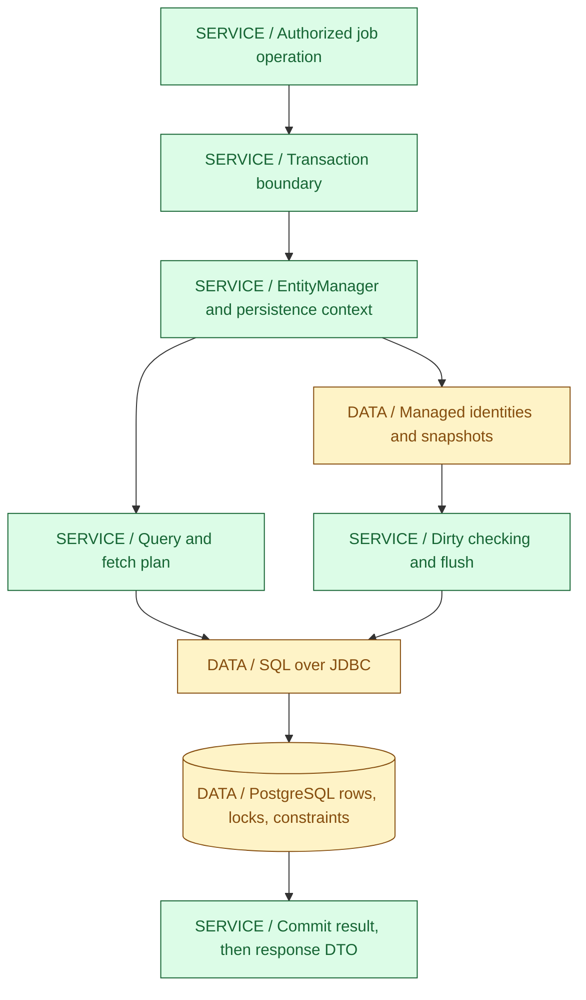
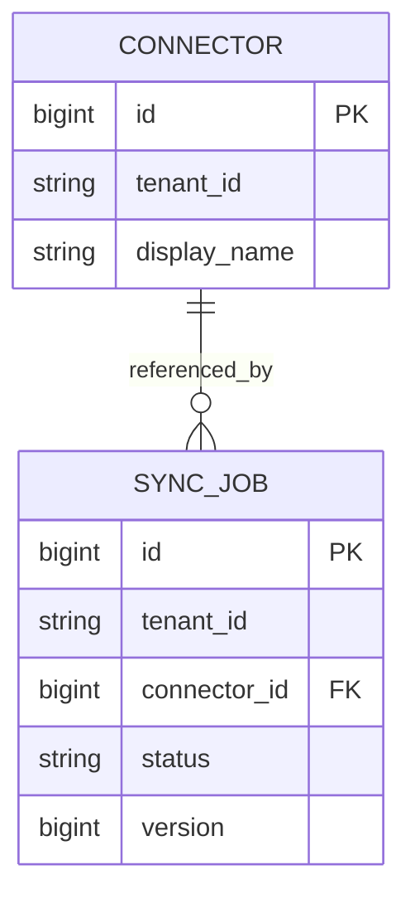
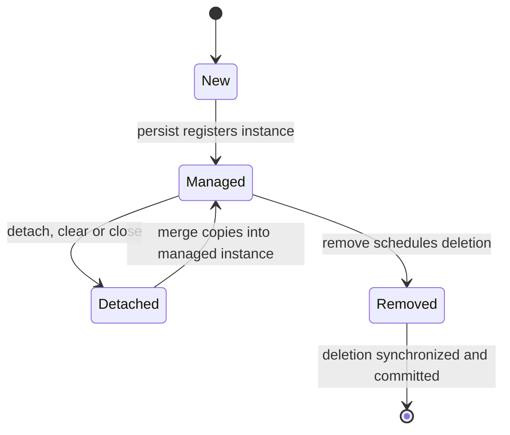
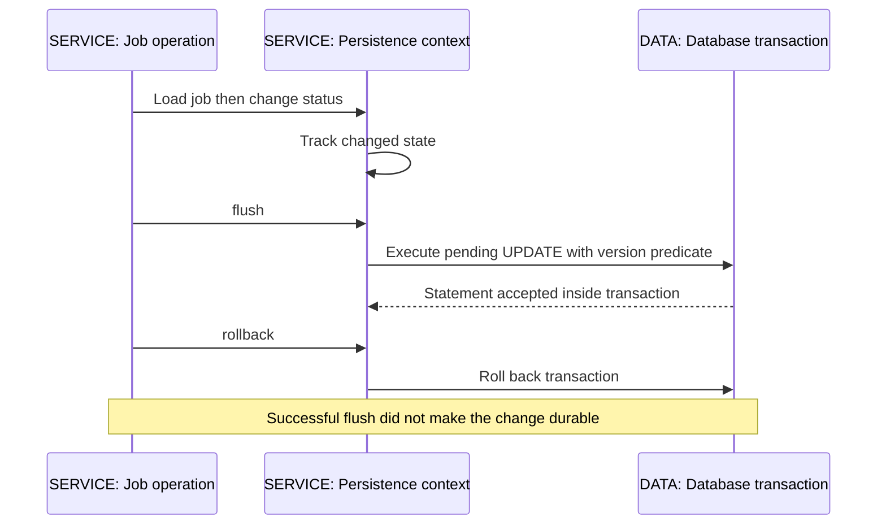
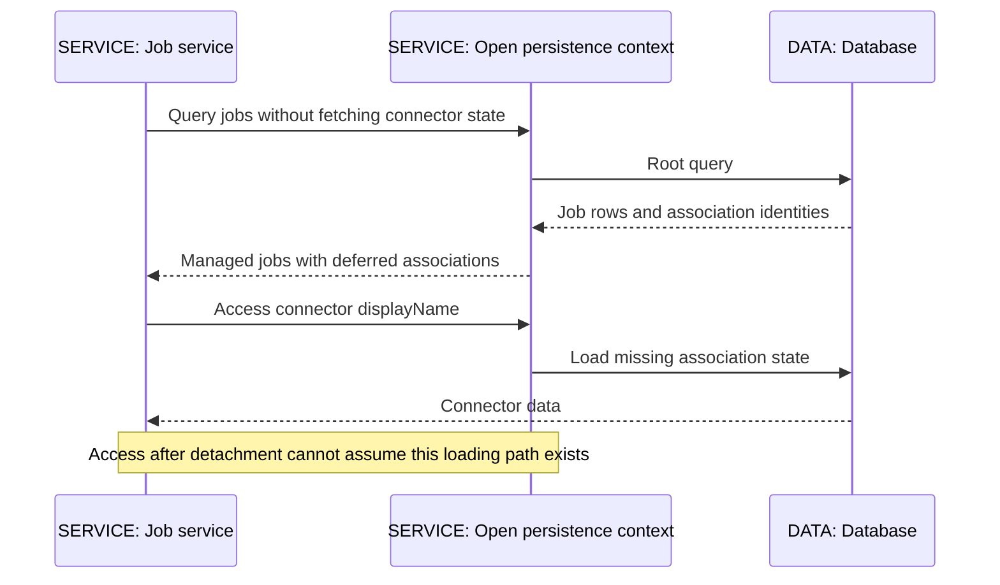
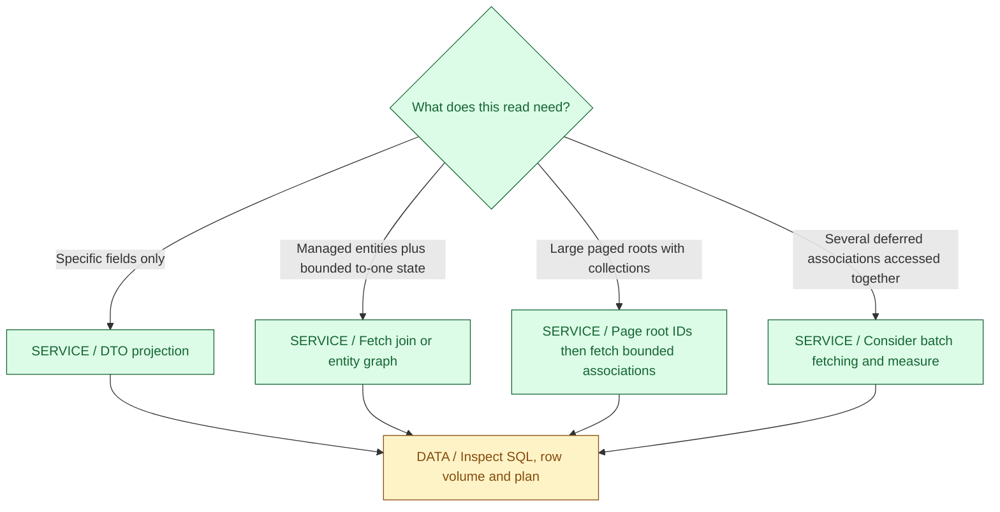
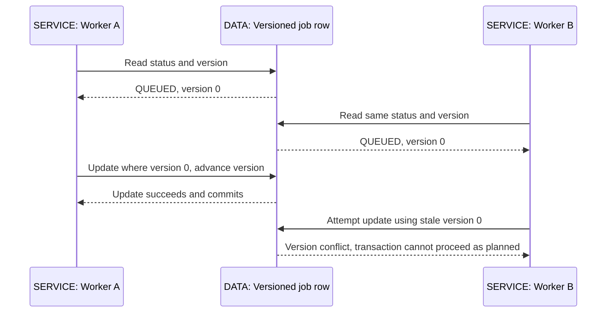
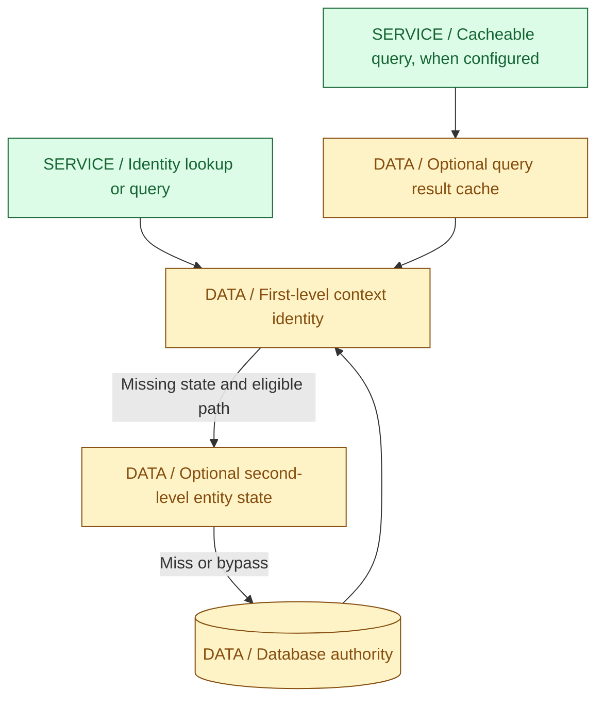
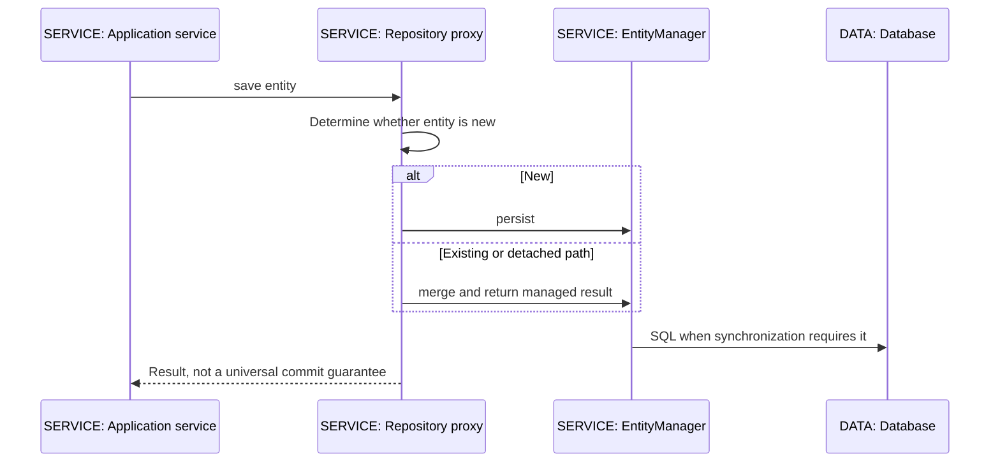

<a id="ch04-jpa"></a>
# 04 / Hibernate and JPA

**An object graph is not a database transaction.** IntegrationHub accepts jobs as durable facts, loads connector configuration to execute them, and updates progress under concurrent workers. JPA gives that Java code a persistence contract; Hibernate implements it with mapping, identity management, dirty checking and SQL generation. IntegrationHub is fictional, and this chapter makes no claim about a real employer's schema or performance.

**Version assumptions:** Java 21, Jakarta Persistence 3.2 and Hibernate ORM 7.2.x under the guide's Boot 4.0.8 parent. The Boot 4.0 managed-dependency table consulted on 2026-10-06 lists jakarta.persistence-api 3.2.0, hibernate-core 7.2.24.Final, Spring Data JPA 4.0.7 and H2 2.4.240. These are documentation observations, not resolved local artifacts. Spring Cloud 2025.1.x remains the compatibility family checked in [03](03-spring.md#ch03-spring); this standalone lab needs no Cloud library. PostgreSQL 17 is the reference operational database; Kafka 4.x and Kubernetes 1.34 remain surrounding illustrative baselines. H2 is only the lab database.

**[VERIFY: recheck the exact Boot-managed Hibernate/Jakarta Persistence/Spring Data versions, provider support and database driver/dialect against the selected artifacts before execution. The published Boot dependency table was consulted, but no Maven resolution or PostgreSQL compatibility test ran.]**

**Execution status:** NOT EXECUTED. Java/Maven and cached ORM dependencies remain unavailable; approval to download Mermaid was limited to diagram dependencies. The offline runner records this explicitly. Complete entity and probe sources are under `code/04-jpa/`; compilation, Hibernate/H2 assertions and SQL counts are unverified. Diagrams in this edition are rendered locally to embedded SVG, including earlier chapters; syntax highlighting remains unavailable.

## Big Picture



The persistence context coordinates Java identities and pending work. The database still owns relational constraints, transaction isolation and durability. A method named save is not necessarily an immediate INSERT, and flush is not commit. Those distinctions explain many bugs that appear mysterious when only repository interfaces are visible.

## What You Will Be Able to Explain

- Trace new, managed, detached and removed entity states and distinguish persist from merge.
- Explain first-level identity, dirty checking, flush triggers and transaction completion without claiming every query uses the cache.
- Diagnose lazy-loading failures and N+1 from the actual access pattern and SQL, not from annotation names alone.
- Choose fetch joins, entity graphs, projections or batched loading with pagination and cardinality in mind.
- Explain optimistic versions and pessimistic locks, including what neither protects across unrelated rows or external effects.
- Map associations with clear ownership, cascade and deletion semantics, and avoid mutable identity and tenant-boundary mistakes.
- Distinguish Spring Data convenience from the underlying JPA/provider/database contracts.

> [!PRODUCTION]
> **Where this lives in IntegrationHub.** [03's service transaction](03-spring.md#ch03-spring) persists a tenant-scoped job and outbox intent; it does not publish to Kafka atomically. [07](07-messaging.md#ch07-messaging) owns relay and consumer idempotency. A worker reads connector configuration and updates progress with a version check where appropriate. [06](06-databases.md#ch06-databases) owns isolation, indexes and SQL plans; [08](08-security.md#ch08-security) owns tenant authorization and secret protection. Returning a JPA entity directly to [09's UI](09-frontend.md#ch09-frontend) can leak both schema and unexpected lazy queries.

<a id="ch04-boundaries"></a>
## 1. JPA, Hibernate, Spring Data and the Database

**Why ORM exists:** applications often manipulate related domain objects, while relational databases store rows and constraints. An ORM maps between these models and tracks persistence work. It reduces repetitive mapping, but it cannot remove the need to understand joins, transactions, row counts and database cost.

JPA, now Jakarta Persistence, specifies APIs and semantics such as EntityManager, entity state, queries and locking. Hibernate is a provider implementing those contracts with extra behavior and features. Spring Data JPA creates repository implementations and integrates common operations; Spring transaction infrastructure supplies service-level boundaries. JDBC/driver/database layers ultimately execute statements. These are cooperating abstractions, not interchangeable names for the same thing.

EntityManagerFactory is a long-lived factory for a persistence unit. An EntityManager controls a persistence context and is not intended for concurrent application use by unrelated threads. A Spring-injected shared EntityManager reference is commonly a proxy that delegates to an appropriate contextual EntityManager; that proxy does not make one underlying context safe to share freely across tasks.

### The Minimal Teaching Model



This is a deliberately small mapping for the lab, not the whole IntegrationHub model. Every fixture job references one connector. Production also needs idempotency, outbox, progress and checkpoint structures from [00](00-master-map.md#ch00-master-map). A foreign key to connector_id alone does not prove that both rows have the same tenant. Application authorization and suitable schema-level tenant invariants must complement the relationship.

| Access approach | Use when | Avoid when |
|---|---|---|
| JPA entity model | Unit-of-work updates and domain relationships fit managed objects | Bulk/reporting operations are forced through enormous managed graphs |
| DTO/scalar query | A read endpoint needs a bounded, specific shape | You assume it establishes a managed updateable entity graph |
| JDBC or SQL-oriented access | SQL control, bulk operations or provider-independent query behavior is important | It silently bypasses version/callback/cache contracts expected by ORM writers |
| Spring Data repository | Standard lookup/query patterns benefit from generated infrastructure | Method names substitute for checking SQL, authorization and transaction scope |

**Production trap:** parallel tasks share an EntityManager and its managed entities because the service singleton already has a repository field. The repository proxy may be shareable, but the underlying mutable entity graph/context is not a concurrent data structure. Pass IDs or immutable commands, authorize each unit, and define transaction ownership per execution path. See [02](02-concurrency.md#ch02-concurrency).

**Interview checks:** basic: JPA is the contract and Hibernate is a provider. Internals: context identity is distinct from database state. Debug: inspect the actual provider, manager and transaction boundary. Scenario: use SQL directly when it better matches a bulk/read workload, while preserving the surrounding invariants explicitly.

<a id="ch04-states"></a>
## 2. Entity States: Track the Instance You Actually Hold

**Why state matters:** the provider needs to know which objects participate in change tracking and which rows they represent. A Java object with an ID is not necessarily managed, and an object that was managed earlier may no longer participate in any current unit of work.



The merge arrow describes copying into a managed instance, not magically changing the original detached object into that instance. Deletion timing depends on flush/transaction behavior; the final state in this sketch is an outcome, not a specification that the old Java object has vanished from memory. Rollback is not drawn as an inverse arrow because it does not reliably restore your entire Java object graph to its former field values.

- **New/transient:** created in application code, not associated with a persistence context. It may even have an assigned ID; that alone does not establish management.
- **Managed:** associated with a context under a persistent identity. The provider can track changes and synchronize them when the relevant conditions apply.
- **Detached:** previously persistent identity/state is now outside the context. Mutating it changes only that Java object until an explicit operation copies/applies state through a new managed boundary.
- **Removed:** managed removal has been requested. SQL deletion is coordinated with flush, constraints and transaction completion; remove is not a Java memory-free operation.

### persist Versus merge

persist makes a suitable new instance managed. It does not promise that the INSERT must wait until commit; identifier strategies and provider work can cause earlier SQL. merge takes the input's state and copies it to a managed instance for that identity, returning the managed result. The original detached input normally remains detached. If the argument is already managed, the result/behavior follows that state; do not promise a different Java reference for every possible merge call.

In JpaLab, a context loads a job and closes, producing a detached input. Another context merges it, then checks that the returned object is managed and the detached input is not. That assertion targets this specific detached-input scenario. Passing a removed entity or an invalid/stale graph has different error behavior; merge is not a universal "make anything valid" command.

| Operation | Use when | Avoid when |
|---|---|---|
| persist | A new entity should join this unit of work | Detached state is passed indiscriminately as if it were always new |
| merge | A deliberately accepted detached representation must be reconciled | Untrusted API fields overwrite managed state wholesale |
| find | Need managed state for a known identity, subject to authorization | ID possession is treated as permission to access another tenant's row |
| getReference | An association can be represented by identity without requiring state immediately | You assume it validates row existence immediately or eliminates later SQL |
| detach / clear | The unit of work intentionally releases managed state | Pending changes are discarded accidentally or detached mutation is expected to persist |
| refresh | Existing managed state should be reloaded from its authority | It overwrites intentional unflushed edits or is treated as a universal lock |

**Production failure:** an API deserializes an entity from a client and calls merge. Fields omitted by the client, including relationships or status, can overwrite state unexpectedly; the client may also supply an unauthorized version/tenant/association. Prefer a narrow command DTO, load the authorized entity, and apply only allowed changes inside the service boundary. [03](03-spring.md#ch03-spring) separates validation from authorization and durable constraints.

**Interview checks:** basic: contains tests management in a particular context. Internals: merge copies state and returns the managed instance. Debug: inspect where clear/close detached the object. Scenario: load-and-apply can be safer than blindly merging a web payload.

<a id="ch04-context"></a>
## 3. Persistence Context: Identity Map and Unit of Work

For a persistent identity within one context, there is a unique managed entity instance. Repeated find calls for the same identity can return that same Java reference without another entity load. This is the first-level cache/identity-map idea. It enables coherent in-memory updates and dirty tracking within that unit of work.

It does not mean every query is answered without SQL. A JPQL query may still execute to determine matching rows; hydration can then reuse already-managed instances. Query results can therefore reflect a mixture of query membership from the database and field state already held in the context unless the operation's refresh/locking semantics say otherwise. Do not use an old long-lived context as a universal live view of concurrent database changes.

### Dirty Checking Trace

- Load or persist an entity into the context, with identity and provider tracking metadata.
- Mutate its mapped state through the application's intended domain operation.
- At synchronization, the provider detects relevant changes. Snapshot comparisons and bytecode-enhanced tracking are implementation techniques, not the same thing as a manual save on every setter.
- Schedule/execute the required SQL, including version predicates where configured.
- On successful transaction completion, the database commits; on failure, the application must handle rollback and context/object-state consequences.

The big-picture diagram's identity/snapshot -> flush -> SQL path is this mechanism. A managed entity changed in a transaction ordinarily does not need a redundant Spring Data save call merely to activate dirty checking. Detached entities do not gain that behavior by calling a setter with the same method name.

**Memory cost:** the context retains managed objects and tracking state. Reading a huge data set and keeping every entity managed increases heap and flush/dirty-checking work. For batch processing, bound chunks, flush intentionally, then clear where it fits the algorithm. Clearing before needed synchronization can lose pending changes; clearing afterward means subsequent references are detached. [07](07-messaging.md#ch07-messaging) covers restartable batch contracts and [23](23-jvm-performance.md#ch23-jvm-performance) covers measurement.

**Transaction scope is not universally context scope.** Application-managed contexts can span multiple transactions; extended contexts and request-bound arrangements also exist. Spring's usual transaction-scoped usage is a common model, not the only valid JPA setup. A transaction ending and a context closing are different lifecycle events, so describe the actual arrangement before declaring all objects detached at every commit.

**Use when / avoid when:** use a short, explicit unit of work for coherent domain changes. Avoid a globally shared EntityManager, an unbounded context or entity sharing across threads. If a conflict/rollback occurs, re-evaluate from a clean transaction/context rather than assuming the mutated Java objects automatically reverted.

**[VERIFY: dirty-checking implementation, enhancement, read-only optimizations and persistence-context lifecycle vary by Hibernate/Framework configuration. Check the selected provider documentation and actual SQL/memory behavior; no dirty-checking or batch-memory experiment ran locally.]**

**Interview checks:** basic: first-level cache is context-local. Internals: a query can hit SQL yet reuse an existing managed instance. Debug: stale fields may come from a retained context rather than a failed database commit. Scenario: batch size must bound managed state as well as the number of submitted tasks.

<a id="ch04-flush"></a>
## 4. Flush Is SQL Synchronization, Not Durable Completion

**Why flushing exists:** the unit of work can accumulate related changes and schedule SQL coherently rather than requiring every field write to execute a statement immediately. A flush synchronizes relevant pending persistence changes with the database in the current transaction context. Commit is the separate durability boundary.



JpaLab updates status, explicitly flushes, reads that row through a native query in the same transaction, then rolls back. A fresh context checks that the committed state did not change. This checks flush versus commit, not cross-transaction visibility before commit. No output or SQL count from that probe has been observed here.

### Flush Triggers and Modes

Flush can occur explicitly, during transaction completion, or before a query where the mode/provider must ensure the required query semantics. AUTO does not mean "always flush before every query"; COMMIT does not promise that the provider never emits SQL earlier. Query-space analysis, native-query integration, resource strategy and Hibernate-specific flush modes add nuance.

An ID generated through an identity column may require an INSERT earlier than expected to obtain the identifier. Sequence-based allocation may obtain identifiers separately and leave more opportunity for batching. Neither means that the resulting row is committed. SQL ordering can also differ from the order of individual Java method calls, so inspect statement/constraint behavior rather than assuming setters are a transaction log.

| Synchronization choice | Use when | Avoid when |
|---|---|---|
| Normal transaction completion | Default unit-of-work synchronization fits the service | You assume method-body return already proves the later commit succeeded |
| Explicit flush | Detect a constraint conflict before later steps, or bound a deliberate batch | A flush is treated as commit or added after every operation without measuring batching cost |
| Clear after a controlled batch | Previously synchronized managed objects should be released | Callers keep using detached objects as though tracking continues |
| Bulk JPQL/SQL update | Many rows need a set-based change | Managed state, callbacks, version checks and caches are assumed to update automatically |

Bulk mutation can bypass normal per-entity dirty checking and leave managed instances stale. Flush relevant pending work before the bulk operation if needed, then clear/refresh under a deliberate policy. Automatic flush/clear options on repository modifying queries have trade-offs: blindly clearing can discard other pending work. Bulk updates also do not automatically apply the normal version increment/check to every affected entity; encode the required concurrency policy explicitly.

**[VERIFY: AUTO/COMMIT and Hibernate-specific flush behavior, native-query synchronization, SQL ordering, identifier timing and bulk-mutation semantics require the pinned provider/driver configuration. The lab is unexecuted; statement-shape explanations are not actual SQL traces or a guarantee that one annotation produces one statement.]**

**Production failure:** a service calls saveAndFlush, publishes an event directly, then its transaction rolls back. The event describes a job that is not durable. The fix is the [transactional outbox](07-messaging.md#ch07-messaging), not adding more flush calls. Likewise, a committed job followed by HTTP response failure needs [API idempotency](05-apis-realtime.md#ch05-apis-realtime), not an assumption that the exception undid the commit.

**Interview checks:** basic: flush sends work; commit settles the transaction. Internals: query semantics and identifier generation influence timing. Debug: find the first actual constraint/commit failure. Scenario: external publication must not be based on an uncommitted flush.

<a id="ch04-lazy"></a>
## 5. Lazy Loading: Deferred Access Has a Resource Lifetime

**Why it exists:** loading every reachable association for every use case can be expensive or unbounded. Lazy loading defers an association's state until needed, often through proxies or enhanced access interception. Fetch configuration is a requirement/hint contract with provider-specific realization; it is not a promise of a particular join layout.

The familiar JPA defaults generally make to-one associations eager and to-many associations lazy; always inspect the actual mapping. Eager does not mean "one joined SELECT," and lazy is not a portable guarantee that no earlier fetching ever occurs. Enhancement, one-to-one ownership and proxyable types can affect realization. Use a use-case-specific fetch plan rather than assuming defaults optimize the endpoint.



If the object is detached and a required association was not initialized, Hibernate can throw LazyInitializationException. The precise behavior depends on configuration, but creating hidden temporary loading contexts is not a substitute for a coherent service boundary. A reference proxy can also defer missing-row failure until access; getReference is not a cheap authorization/existence check.

### Open Session in View Is a Trade-Off

Keeping persistence access available during web rendering can make entity serialization trigger additional queries after the business transaction ended. It may hide lazy-loading errors while spreading data access into response generation and creating mixed-time observations. Turning it off can expose the missing fetch plan; turning it on is not inherently an N+1 solution. Inspect the actual Boot configuration rather than treating a default as an API guarantee.

For IntegrationHub, load the authorized data needed by an endpoint inside a defined service/query boundary, then return a DTO. SSE progress events should carry an intentional immutable view, not a managed entity whose fields trigger database access long after the originating operation. [05](05-apis-realtime.md#ch05-apis-realtime) and [09](09-frontend.md#ch09-frontend) define those HTTP/UI contracts.

| Choice | Use when | Avoid when |
|---|---|---|
| Lazy association plus explicit fetch plan | Use cases need different bounded parts of the model | Access is deferred until uncontrolled serialization/background work |
| Eager mapping | The relationship genuinely belongs in essentially every entity use | It is added globally to silence one lazy-loading failure |
| Service-created DTO | API shape and query cost should be explicit | Sensitive persistence fields are copied blindly |
| Open context during rendering | A consciously accepted architecture owns the query/lifetime costs | It hides accidental queries, resource retention or mixed snapshots |

**[VERIFY: lazy/eager realization, proxy/enhancement requirements, to-one defaults and Open Session in View behavior must be checked against Jakarta Persistence, the exact Hibernate mapping and Boot settings. No web serialization or lazy-detachment failure test ran in this environment.]**

**Interview checks:** basic: deferred loading still needs a usable context/resource path. Internals: eager is not equivalent to join fetch. Debug: locate the first association access, including debugger/toString/JSON paths. Scenario: fetch the response contract deliberately instead of making every relationship eager.

<a id="ch04-fetch-plans"></a>
## 6. N+1 and Fetch Plans: Count Work, Not Annotations

**The mechanism:** first query a set of jobs. Then iterate the result and read an unfetched connector for each job. With distinct missing connectors and no relevant batching/cache hits, this can produce a root query plus one query per connector. The actual count depends on shared identities, fetch strategy, provider optimization and cache state, so "one plus N" is a failure pattern, not a universal statement count.

JpaLab creates three jobs with three distinct connectors, disables L2/query caching and batch fetching, then measures prepared statements for lazy traversal and a to-one fetch join in separate fresh contexts. Its assertions require the fetch-join fixture to use one statement and the unfetched fixture to use more. Those are expected conditions in unexecuted source, not benchmark results. A warm context could conceal the problem if the test did not isolate it.



### Fetch Join, Entity Graph, Projection, Batch

A normal join can filter rows without instructing the ORM to initialize the association as a fetch join does. A fetch join changes the loading plan for that query. An entity graph describes attributes to fetch according to graph semantics; fetchgraph and loadgraph have different treatment of unspecified attributes, and neither promises exactly one SQL statement for every provider/mapping.

A projection selects only the data needed by the read contract; it avoids loading a large updateable graph when that is unnecessary. Be careful with nested/interface projections and provider behavior: a convenient projection interface is not proof of minimal SQL. Batch fetching groups deferred loads, often using multiple IDs, reducing round trips without necessarily reducing all transferred data.

| Fetch technique | Use when | Avoid when |
|---|---|---|
| To-one fetch join | A bounded query needs related to-one state immediately | You confuse authorization filtering with association initialization |
| Collection fetch join | A bounded root set needs a limited collection | Large fan-out, collection pagination or multiple independent collections multiply rows |
| Entity graph | A reusable attribute fetch plan clarifies a use case | Graph semantics are assumed to dictate one universal SQL join |
| DTO projection | The endpoint is a read model with a precise shape | Callers expect to mutate the result and have entity dirty checking persist it |
| Batch/subselect fetching | Deferred access groups fit the provider's measured strategy | It is treated as a fix for inherently unbounded graph traversal |
| Two-step root paging | Page membership must be stable while associations are fetched separately | Ordering, concurrent changes or memory bounds between steps are ignored |

### The Collection-Pagination Trap

A root with several children yields several joined rows. Limiting joined rows is not the same as limiting distinct root entities. Providers may reject, warn, or perform in-memory handling for problematic collection-fetch pagination. That can turn a small requested page into a huge database transfer. Inspect the actual SQL and configured warning/failure behavior, and prefer a bounded root-ID page followed by a deliberate association fetch when appropriate.

Fetching two to-many collections can create a Cartesian multiplication of child combinations. Hibernate can also reject certain multiple-bag fetch arrangements. Replacing a List with a Set merely to silence a fetch error can change domain semantics while leaving row explosion unresolved. Choose a query plan from cardinality and use-case needs, not from whichever annotation suppresses an exception.

**[VERIFY: Hibernate fetch joins, entity graph semantics, batch/subselect fetching, duplicate-root handling, multiple-bag restrictions and pagination warnings/failure settings are provider/version-specific. Verify actual SQL and row volume on the selected database; no fixture count, query plan or load result is measured here.]**

**Production diagnosis:** capture sanitized SQL or appropriate query instrumentation for one representative endpoint, identify repeated association loads, then check returned row volume and EXPLAIN, not just round-trip count. One giant join may be worse than a few bounded queries. Include both cold and warm cache cases and realistic relationship cardinality. [06](06-databases.md#ch06-databases) and [19](19-testing.md#ch19-testing) deepen those checks.

**Interview checks:** basic: N+1 follows access pattern. Internals: join versus fetch join matters. Debug: caches can mask a bad test fixture. Scenario: fix paged collection reads without loading every child for every tenant.

<a id="ch04-locking"></a>
## 7. Locking: Detect Stale Writes or Coordinate Access

**Why it exists:** separate workers can read the same job state and attempt conflicting transitions. Transactional does not by itself specify how the application detects lost updates or protects a multi-row invariant. Choose the invariant first, then use version checks, database locks, constraints or isolation as required.

### Optimistic Versioning

A Version attribute lets the provider compare the version originally read with the row version at the update/check boundary. Conceptually, an update includes identity plus the expected old version and advances the version on success. If the expected row/version no longer matches, the provider reports an optimistic conflict rather than silently applying a stale overwrite. The generated SQL, timing and exception wrapping depend on the provider and transaction boundary.



Version zero/one in the diagram is an illustrative starting state, not a claim that every provider/version type initializes identically. JpaLab arranges the conflict with two EntityManagers and two transactions on one thread, so both read before the first commits. It then checks for OptimisticLockException in the failure chain. This probes stale state without relying on a lucky concurrent schedule; it does not test high-contention throughput.

On conflict, abandon the failed transaction and retry only when the business operation is safe to recompute against fresh authorized state. Reusing the same stale object in a loop does not resolve a conflict. A retry that repeats a remote charge or publishes an event outside the durable protocol can duplicate effects. [07](07-messaging.md#ch07-messaging) and [27](27-payments.md#ch27-payments) distinguish local conflict recovery from external idempotency.

### Pessimistic Locking

A pessimistic lock mode asks the provider/database to acquire an appropriate lock for selected rows/resources. The database can make conflicting operations wait or fail under configured timeout/deadlock rules. The exact SQL, lock scope and behavior vary by database and query plan; the label PESSIMISTIC_READ does not mean an identical lock implementation everywhere.

Hold such locks briefly, inside a clearly owned transaction. Do not lock a row and then wait on a slow provider. Acquiring several locks in inconsistent order can deadlock, and a query that finds no row does not necessarily lock the absence as your uniqueness policy requires. Constraints and suitable isolation remain important.

| Concurrency technique | Use when | Avoid when |
|---|---|---|
| Version-based optimistic locking | Conflicts are acceptable to detect/recompute and every relevant writer honors the version contract | High contention causes destructive retries or writers bypass version handling |
| Pessimistic row locking | A short critical transaction benefits from database coordination before modifying state | Slow external calls, long user think time or uncontrolled lock ordering |
| Unique/check/foreign-key constraints | Relational invariants must survive all writer paths | Application validation is treated as a sufficient substitute |
| Stronger transaction isolation | The invariant spans observations not protected by one row version | It is assumed to remove all retry/deadlock handling or cost |

An entity version does not automatically protect a multi-row total, every related collection change, a bulk SQL writer or a second database. All relevant update paths must participate in the intended contract. Do not let clients assign the server's version field freely; a version supplied as a conditional update token still needs authorization and explicit conflict semantics.

**[VERIFY: optimistic-check timing, exception translation, relationship version increments, pessimistic lock scope/timeouts and deadlock behavior depend on provider, mapping and database. H2 is not evidence for PostgreSQL locks or isolation; no pessimistic-lock experiment or PostgreSQL conflict test was executed.]**

**Interview checks:** basic: optimistic detects conflict; pessimistic coordinates via database locks. Internals: expected version participates in the write/check. Debug: inspect every writer, especially bulk/native paths. Scenario: a wallet total or cross-row capacity constraint needs more reasoning than adding Version to one entity.

<a id="ch04-caching"></a>
## 8. First-Level, Second-Level and Query Caches

**Why cache layers exist:** repeated identity/state access can avoid repeated work, but each layer has a different lifetime and invalidation contract. Caching must preserve required correctness, not simply lower a query counter in one test.



This is a responsibility map, not a promise that every JPQL query checks every box in this order. First-level identity is tied to a context. A configured second-level cache can share eligible entity/collection state across contexts for a factory/provider setup; it does not share one mutable managed Java instance among every request.

Query caching is a separate feature from entity-state caching. Its representation and interaction with entity state depend on the Hibernate version and cache layout; avoid repeating the universal claim that it "always stores only IDs." Query eligibility, parameters, invalidation metadata, regions and cache provider matter. A cache hit also does not imply that every required association is initialized without SQL.

| Layer/policy | Use when | Avoid when |
|---|---|---|
| First-level identity/context | One unit of work needs consistent managed identity | Long-lived contexts become stale, large or shared across threads |
| L2 read-mostly entity caching | Repeated access and a suitable provider/concurrency policy justify it | Frequently changing progress state or external writers make invalidation too risky |
| Query cache | Measured repeatable query shapes and invalidation behavior show value | High-cardinality parameters/churning tables destroy hit rate or complicate correctness |
| Application DTO cache | The API tolerates explicit TTL/invalidation semantics | It silently becomes the authority for permissions or committed financial state |

Hibernate knows about updates performed through its own coordinated paths, but external SQL/jobs/services can bypass relevant cache invalidation. Multi-node deployment adds coherence and eviction/replication policy questions. A cache region key must respect the tenant model; a single shared schema with tenant_id is not automatically equivalent to provider-managed multi-tenancy.

In IntegrationHub, rapidly changing job progress is an awkward candidate for casual long-lived caching. Stable connector definitions may be better candidates, but secret rotation and authorization changes still require a defined freshness policy. The [Redis/search discussion in 06](06-databases.md#ch06-databases) applies the same authority-versus-projection distinction at another layer.

**[VERIFY: L2/query cache defaults, provider integration, concurrency strategies, cache layout and external-write invalidation are Hibernate-version/configuration specific. Both shared/query caches are explicitly disabled in the lab, so no cache-provider behavior or cluster coherence was tested.]**

**Production trap:** a test reads the same entity twice in the same EntityManager and calls it a successful L2-cache test. That may only demonstrate first-level identity. Isolate contexts, inspect cache statistics and database work, and specify warm/cold/eviction cases before making an L2 claim.

**Interview checks:** basic: context cache differs from shared state cache. Internals: query cache is not synonymous with entity cache. Debug: identify which cache supplied the observation. Scenario: define what happens when a maintenance job updates the database outside Hibernate.

<a id="ch04-mapping"></a>
## 9. Mapping Pitfalls: Ownership, Cascades and Identity

**Why ownership matters:** a Java relationship has navigation directions, while a relational foreign key has a concrete storage location. On a typical bidirectional one-to-many/many-to-one mapping, the many-to-one side owns the FK mapping and the collection uses mappedBy. Keeping only the inverse collection updated may leave the database relationship unchanged or inconsistent with the in-memory graph.

Use domain helper operations that maintain both directions when the model is bidirectional. Relationship ownership is not the same concept as aggregate/business ownership: it describes which mapping writes the relationship. Choose unidirectional navigation when the reverse collection is not useful; do not create a giant bidirectional graph merely because it looks symmetric.

### Complete Lab Entity

**NOT EXECUTED.** This complete SyncJob.java matches the Maven project's source. It compiles as part of that project with Connector and Jakarta dependencies, not as a standalone no-dependency program. The small entity intentionally uses assigned fixture IDs and a plain status string; it is not a production state machine or tenant-security implementation.

```java
package guide.jpa;

import jakarta.persistence.Column;
import jakarta.persistence.Entity;
import jakarta.persistence.FetchType;
import jakarta.persistence.Id;
import jakarta.persistence.JoinColumn;
import jakarta.persistence.ManyToOne;
import jakarta.persistence.Table;
import jakarta.persistence.Version;
import java.util.Objects;

@Entity
@Table(name = "guide_sync_job")
public class SyncJob {
    @Id
    private Long id;

    @Column(name = "tenant_id", nullable = false)
    private String tenantId;

    @Column(nullable = false)
    private String status;

    @Version
    private Long version;

    @ManyToOne(fetch = FetchType.LAZY, optional = false)
    @JoinColumn(name = "connector_id", nullable = false)
    private Connector connector;

    protected SyncJob() {}

    public SyncJob(Long id, String tenantId, Connector connector) {
        this.id = Objects.requireNonNull(id);
        this.tenantId = Objects.requireNonNull(tenantId);
        this.connector = Objects.requireNonNull(connector);
        if (!tenantId.equals(connector.getTenantId())) {
            throw new IllegalArgumentException("Tenant mismatch");
        }
        this.status = "QUEUED";
    }

    public Long getId() { return id; }
    public String getStatus() { return status; }
    public Long getVersion() { return version; }
    public Connector getConnector() { return connector; }
    public void setStatus(String status) { this.status = Objects.requireNonNull(status); }
}
```

The annotations are on fields, establishing field access for this mapping; casually mixing field/getter annotations without explicit access rules can create confusing persistence behavior. A no-argument constructor is available for persistence. The constructor's tenant check helps the intended application path, but the database FK only references connector_id; external SQL or other creation paths can still violate matching tenant IDs. Production requires authorization plus appropriate schema constraints, not confidence in one constructor.

### Cascade Is Not Fetch or SQL ON DELETE

Cascade propagates selected persistence operations through an association: persisting an aggregate can persist its owned children when configured accordingly. It does not mean the association is always fetched, and it is not identical to a database ON DELETE action. orphanRemoval expresses deletion of privately owned children removed from the relationship under its contract, not a license to delete shared reference data.

For IntegrationHub, many jobs can reference the same connector. Removing a job must not cascade deletion to that shared connector merely because CascadeType.ALL is convenient. Conversely, genuinely owned job-item children may have a different lifecycle. Name ownership and retention requirements before choosing cascade/remove rules.

| Mapping choice | Use when | Avoid when |
|---|---|---|
| Narrow cascades | Only specific operations should propagate to owned children | ALL includes REMOVE toward shared entities |
| Orphan removal | Removing a privately owned child from the relationship means deleting it | Children are shared/reparented without accounting for the deletion semantics |
| Stable natural/value equality | A genuinely immutable unique business identity fits the entity model | Mutable fields or lazy collections participate in hashCode/equals |
| Generated ID | Database/provider identity allocation fits persistence and batching needs | Hash identity changes after insertion into a Set and breaks lookup |
| Explicit join entity | A many-to-many relationship has attributes, ownership or audit needs | A bare association hides lifecycle, uniqueness or deletion rules |

**Equality traps:** managed identity within one context is not an instruction to use every field in equals/hashCode. Generated IDs can be absent before persistence; proxies can complicate naïve class comparisons; mutable or lazy associations can recurse, trigger SQL or change hash buckets. There is no single universal equals implementation for every entity. Select a documented identity contract and test transient, managed, detached and proxied cases. [01](01-java-jvm.md#ch01-java-jvm) explains the underlying Java key rules.

**Other common mistakes:** storing enums by ordinal can corrupt meaning after reordering values; use an explicit stable storage contract. Money needs explicit numeric scale/currency/rounding rather than an arbitrary floating-point field. Temporal types need an agreed instant/local-time/time-zone model. Unbounded large payloads should not be accidentally pulled into every small job read. Full entity toString/JSON can recurse across bidirectional relationships or expose PII/secrets.

**[VERIFY: mapping access rules, ID generation/batching, cascade/orphan-removal behavior, proxy equality, enum/temporal conversion and schema generation need validation against the selected provider and database. The lab is deliberately minimal and create-drop is restricted to its disposable H2 database; no production migration or tenant-constraint enforcement was executed.]**

**Interview checks:** basic: owning side writes the association. Internals: cascade, fetch and database deletion are different policies. Debug: check both sides of a bidirectional relationship and the emitted FK update. Scenario: never cascade job deletion into shared connector configuration by accident.

<a id="ch04-spring-data"></a>
## 10. Spring Data JPA: Repository Convenience without Hidden Guarantees

**Why it exists:** common repository operations and query patterns can be implemented consistently instead of writing repetitive adapter code. A repository proxy delegates to infrastructure such as SimpleJpaRepository and query execution machinery; the EntityManager/provider still decides persistence behavior under the active transaction.

save ordinarily chooses persist for an entity considered new and merge otherwise. Spring Data's new-entity detection can consider nullable version metadata and then identifier state, with Persistable/custom strategies as alternatives. Assigned IDs therefore need careful state detection; non-null ID alone should not be assumed to mean "already in the database" in every setup. Always use the returned entity when merge semantics might apply.



When an outer service transaction exists, repository methods normally participate according to their configuration. Calling several repository operations independently is not a substitute for one service-level unit of work. Do not assume every declared query method has identical transaction/read-only behavior; inspect interface annotations, implementation defaults and the caller. [03](03-spring.md#ch03-spring) owns proxy and propagation mechanics.

### Query Methods and Paging

Derived query names and Query declarations can simplify expression, but generated SQL must still be reviewed. EntityGraph annotations can attach a loading plan. Specifications/criteria compose predicates, not permission to ignore indexes or tenant filtering. A convenient method name does not guarantee efficient joins or a correct authorization boundary.

Page commonly includes total-count information and can require a count query; Slice can answer whether more results exist without an exact total, depending on execution strategy. Offset paging can get increasingly expensive and unstable under concurrent changes; keyset/scroll approaches fit some ordered access patterns. Always define a stable ordering and relevant tie-breaker. [05](05-apis-realtime.md#ch05-apis-realtime) covers API contracts and [06](06-databases.md#ch06-databases) covers SQL access paths.

| Repository feature | Use when | Avoid when |
|---|---|---|
| save with understood new-state detection | Repository contract intentionally persists/merges the passed state | It is assumed to always issue INSERT immediately or to commit an outer transaction |
| Derived query | A simple predicate is readable and bounded | Extremely long names hide joins, tenant semantics or performance |
| Explicit query/projection | The endpoint needs a deliberate data shape and access path | Query strings are untested or accept unsafe dynamic fragments |
| EntityGraph | The repository method needs an explicit association plan | It is assumed to fix collection pagination automatically |
| Modifying bulk query | Set-based mutation is intentional | Persistence-context staleness, callbacks and version handling are ignored |
| Page / Slice / scroll choice | The client needs the selected total/navigation contract | Exact totals and deep offsets are computed needlessly on every request |

Spring Data does not make a repository method tenant-safe by existing. Built-in ID lookup can return any matching globally identified row unless the access path enforces authorization/tenant constraints. Prefer narrowly designed service/query paths, and add negative cross-tenant tests rather than relying on untrusted tenant fields in an entity.

**[VERIFY: Spring Data JPA new-entity detection, repository transaction defaults, modifying-query flush/clear options, entity-graph execution and paging/scroll support must be checked against the selected version. The standalone JPA lab does not instantiate Spring Data repositories or execute any repository integration tests.]**

**Production failure:** a service ignores save's returned managed copy, mutates the old detached instance again, and expects another update at commit. The second mutation may never be tracked. Either operate on a managed entity loaded in the unit of work or use the returned managed instance intentionally; do not rely on a method name to hide state transitions.

**Interview checks:** basic: save can select persist or merge. Internals: new-state detection includes more than one simplistic ID rule. Debug: inspect the actual returned instance and outer transaction. Scenario: query shape, count cost and tenant isolation must be tested even behind a repository interface.

<a id="ch04-testing"></a>
## 11. Test What the Persistence Layer Actually Does

The supplied lab is deliberately single-process and standalone. Its persistence unit lists the two entity classes explicitly; it uses an in-memory H2 database and create-drop only for that disposable fixture. There is no PostgreSQL process, Spring Data proxy, L2 provider, web request or Kafka publisher. It imports managed ORM dependencies through Boot's parent, not a running Boot application.

| Probe | Intended assertion | Evidence limit |
|---|---|---|
| Managed identity | Two finds for one ID in one context return the same instance | Not proof that every query skips SQL |
| Dirty flush and rollback | Changed state reaches SQL inside a transaction, then disappears from committed state after rollback | Not a cross-session isolation or durability benchmark |
| Detached merge | Returned copy is managed, original detached input is not | Does not validate untrusted merge safety or all cascade graphs |
| Optimistic conflict | Two contexts read one version; later stale write fails | Not a pessimistic-lock, multi-row invariant or contention-throughput test |
| Fetch-plan comparison | Cold-context lazy traversal prepares more statements than the to-one fetch-join fixture | Expected source assertions only; no measured counts available |

**NOT EXECUTED:** the runner's preflight was executed and reported missing Java/Maven/cached dependencies. The POM and persistence XML were parsed for well-formedness, not validated through artifact resolution or a JPA provider. The complete inline SyncJob listing is checked against its saved source, which is not compilation. No success output, SQL trace, statement count or benchmark is fabricated.

For real tests, use the production database family where lock/isolation/dialect behavior matters. Reset state between cases, control transaction boundaries and cache warmth, and inspect outcomes from independent contexts where appropriate. A test transaction that automatically rolls back around the entire method can hide commit-time failures or make detached/serialization behavior unlike production. [19](19-testing.md#ch19-testing) discusses integration tests and Testcontainers once tools are available.

### A Repeatable Diagnosis

- State the failing contract: wrong data, missed write, stale update, extra queries, latency, memory or tenant exposure.
- Record the transaction and persistence-context lifetimes, including thread and web serialization boundaries.
- Inspect actual SQL, parameters only under a safe data policy, statement counts and row volume. Confirm which cache/fetch settings were active.
- Identify entity states, association ownership and every relevant writer, including bulk/native paths.
- Use database evidence for blocking, isolation and query plans, not only Java annotations.
- Fix the owning boundary and add a test that fails for the specific former mistake, without claiming broader guarantees than it exercises.

This keeps ORM reasoning connected to the full [IntegrationHub journey](00-master-map.md#ch00-master-map): Java identity helps one unit of work; the database settles local facts; messaging transports durable intent; retries and UI reconnects must respect those boundaries.

<a id="ch04-concept-index"></a>
## Explained-Here Index and Sources

| Concept | Explanation |
|---|---|
| JPA versus Hibernate versus Spring Data | [Ownership boundaries](#ch04-boundaries) |
| Entity states, persist, merge, detach and refresh | [Lifecycle](#ch04-states) |
| Persistence context, first-level identity and dirty checking | [Unit of work](#ch04-context) |
| Flush, commit, query synchronization and bulk updates | [SQL synchronization](#ch04-flush) |
| Lazy loading, proxies and response lifetime | [Deferred access](#ch04-lazy) |
| N+1, fetch joins, entity graphs and pagination | [Fetch plans](#ch04-fetch-plans) |
| Version checks and pessimistic locking | [Concurrency](#ch04-locking) |
| L1, L2 and query caching | [Cache boundaries](#ch04-caching) |
| Association ownership, cascade, orphan removal and identity | [Mapping](#ch04-mapping) |
| Spring Data save, queries, paging and transactions | [Repositories](#ch04-spring-data) |
| Lab scope and actual execution status | [Testing](#ch04-testing) |

The [Boot 4.0 dependency table](https://docs.spring.io/spring-boot/4.0/appendix/dependency-versions/coordinates.html) was consulted for the selected version family. Authoritative mechanism references: [Jakarta Persistence 3.2 specification](https://jakarta.ee/specifications/persistence/3.2/jakarta-persistence-spec-3.2), [Hibernate ORM 7.2 user guide](https://docs.hibernate.org/orm/7.2/userguide/html_single/Hibernate_User_Guide.html), and [Spring Data JPA persistence](https://docs.spring.io/spring-data/jpa/reference/jpa/entity-persistence.html). The latter are owning references for further checks, not claims that this environment resolved artifacts or ran their examples.

## Related Chapters

Use [01 Java identity/collections](01-java-jvm.md#ch01-java-jvm), [02 concurrency](02-concurrency.md#ch02-concurrency) and [03 service transactions](03-spring.md#ch03-spring) beneath the ORM model. Continue through [06 databases](06-databases.md#ch06-databases) and [05 API design](05-apis-realtime.md#ch05-apis-realtime) in the recommended reading order. [07 messaging](07-messaging.md#ch07-messaging), [08 security](08-security.md#ch08-security), [09 frontend contracts](09-frontend.md#ch09-frontend), [19 testing](19-testing.md#ch19-testing), [23 profiling](23-jvm-performance.md#ch23-jvm-performance) and [27 payments](27-payments.md#ch27-payments) deepen the touched boundaries. Return to [00](00-master-map.md#ch00-master-map) for the whole request. Generated Related chapters links are reciprocal.

<a id="ch04-cheat-sheet"></a>
## One-Page Cheat Sheet

**Layers:** JPA defines contracts; Hibernate implements them; Spring Data supplies repository infrastructure; Spring manages service transaction boundaries; the database owns constraints/isolation/durability.

**States:** new is not managed merely because it has an ID. persist registers a new instance; merge copies detached state into a managed result. Use the result deliberately. clear/close/detach release management, not Java references. Rollback does not rewind every object field.

**Context:** one managed instance per persistent identity per context. Queries may still execute SQL. Managed mutation can be dirty-checked without another save. Bound managed graphs in batch work; never share one EntityManager across unrelated concurrent tasks.

**Timing:** flush synchronizes SQL; commit settles the transaction. AUTO, native queries and ID generation affect SQL timing. Bulk mutation can bypass managed-state/version/callback expectations. External events need durable publication intent, not a flush assumption.

**Reads:** lazy state needs a valid loading boundary. Eager is not one join. N+1 follows access pattern. Choose bounded fetch plans or DTOs; beware collection pagination and Cartesian row explosion. Measure cold/warm SQL and row volume.

**Concurrency/cache:** Version detects covered stale writes, not every multi-row or external conflict. Pessimistic locks are database-specific and should be short-lived. L1, L2 and query caches have different lifetimes; external writers can invalidate assumptions.

**Mapping/repositories:** owner writes the FK; cascade is not fetch or ON DELETE. Avoid REMOVE toward shared connector data, mutable entity hashes and untrusted entity merge. Repository save can persist or merge and is not a commit guarantee. The Java/Hibernate lab remains NOT EXECUTED.

<a id="ch04-interview"></a>
## Interview Corner

### Basic: JPA, Hibernate and Spring Data Are What, Exactly?

JPA is the persistence API/specification, Hibernate a provider, and Spring Data JPA repository infrastructure over that persistence layer. None replaces database transaction/isolation rules. Identify which layer owns the observed behavior before changing settings.

### Internals: Why Can Two find Calls Return the Same Object?

The persistence context maintains managed identity for a persistent key. It can reuse the same instance, often without another identity load. That is not proof that arbitrary JPQL queries are served without SQL or that other contexts share the same Java object.

### Trace/Debug: A Setter Ran but No UPDATE Appeared. What Do You Check?

Check whether the instance is managed in the expected context, the property is mapped, a meaningful dirty change exists, the transaction/synchronization boundary was reached, and read-only/provider settings apply. Detached mutation alone is only an in-memory change.

### Scenario: Can You Send a Managed Entity to Several Executor Tasks?

Not as a default concurrency strategy. EntityManager and its mutable managed graph are not general shared concurrent structures. Pass identifiers or immutable data and give each authorized unit explicit context/transaction ownership.

### Basic: persist Versus merge?

Persist associates a suitable new instance with the context. Merge copies accepted input state into a managed instance and returns it; detached input normally remains detached. State, cascades and version checks affect behavior, so merge is not a universal repair command.

### Internals: Why Should save's Return Value Matter?

Spring Data can choose merge, whose returned managed instance may differ from detached input. Mutating the old object afterward may not be tracked. Prefer a managed load-and-apply operation or deliberately continue with the returned instance.

### Trace/Debug: saveAndFlush Succeeded but the Row Was Not Durable. How?

Flush synchronized work inside the transaction; a later rollback or failed commit can prevent durability. Trace the outer transaction rather than assuming repository method return commits it. A generated identifier is not proof of committed insertion either.

### Scenario: When Would You Explicitly Flush?

When an operation needs to surface a constraint failure at a controlled point or synchronize a bounded batch before clearing, with an understood transaction boundary. Do not flush after every setter or publish an external event solely because flush succeeded.

### Basic: What Causes LazyInitializationException?

An unfetched lazy value is accessed without a usable provider context/loading path under the configured model. Identify the access site and lifetime. Making the entire domain eager may hide the exception while causing much larger query costs.

### Internals: Does EAGER Mean JOIN FETCH?

No. Eager declares required fetching behavior, not one universal SQL strategy. A provider can satisfy it through additional selects. A query-specific fetch join/entity graph or DTO plan must be evaluated by actual SQL and cardinality.

### Trace/Debug: Why Did Your N+1 Test Pass but Production Still Had Extra Queries?

The test may have reused a warm persistence context/cache, used fewer distinct associations, or failed to access the same fields serialization touches. Use fresh contexts, representative cardinality and explicit traversal/response assertions, then inspect statements and rows.

### Scenario: How Would You Page Jobs with Many Items?

Define a stable root ordering/page, then fetch a bounded set of required associations or project the needed data. Avoid treating a collection join's limited rows as a correct root page. Check provider pagination behavior, count cost and concurrent-change semantics.

### Basic: What Does Version Protect?

Covered optimistic writes/checks compare expected version with current state so stale updates fail. It does not automatically protect every related row, external writer, bulk operation or remote effect. Every relevant path must respect the contract.

### Internals: Why Can an Optimistic Failure Appear at Commit?

Dirty SQL/version checks may be deferred until flush during transaction completion. The method body can finish before synchronization detects conflict. Observe the full transaction result and handle translated/wrapped exceptions at the appropriate boundary.

### Trace/Debug: Why Is Retrying the Same Detached Object Not Enough?

Its version/state may still be stale, and the failed transaction/context is not a clean retry scope. Reload authorized state in a new unit, recompute a safe operation and preserve idempotency for external effects. Do not retry indiscriminately.

### Scenario: Optimistic or Pessimistic Locking for a Contended Job Transition?

Start with the invariant and conflict rate. Optimistic checks fit recomputable conflicts; a short pessimistic lock can coordinate before modifying, but can block/deadlock. Database constraints/isolation may still be required, and neither justifies holding a lock across slow provider I/O.

### Basic: First-Level Versus Second-Level Cache?

First-level identity belongs to one persistence context. Optional L2 state can be shared across contexts under provider/cache policy; it does not hand every request the same managed object. Test with separate contexts when claiming an L2 benefit.

### Internals: Is Query Cache Just the Same as Entity Cache?

No. It caches eligible query-result information under its own representation/invalidation rules; entity state and association access can involve other layers. Hibernate versions/layouts differ, so do not promise that query caching always stores only IDs or eliminates every SQL access.

### Trace/Debug: A Maintenance SQL Job Changed a Row but the App Sees Old Data. Why?

Check the current context and any L2/query/application caches, not just database replication. External writers can bypass ORM invalidation. Determine the freshness contract, refresh/evict deliberately and fix the update/invalidation protocol where needed.

### Scenario: Should Every Job/Progress Entity Be L2-Cached?

No. High update churn and freshness requirements can make it costly or incorrect under a weak invalidation design. Measure a suitable read-mostly candidate instead and account for tenant isolation, secret rotation and external writes.

### Basic: What Does mappedBy Mean?

It identifies the other side that owns the relationship mapping; it does not create a second FK-writing authority. Maintain both in-memory directions when the domain is bidirectional, and verify the owning side is updated.

### Internals: Cascade REMOVE Versus orphanRemoval?

Cascade REMOVE propagates a removal operation through a configured relationship. Orphan removal handles the lifecycle of privately owned children removed from that relationship under its contract. Neither equals fetch strategy or automatically matches database ON DELETE behavior.

### Trace/Debug: Why Did Removing a Job Delete Shared Connector Data?

Inspect cascades and database FK deletion rules. An indiscriminate cascade toward shared reference data can propagate a delete that business ownership never intended. Narrow the policy, repair data carefully and add retention/deletion tests.

### Scenario: How Do You Make Entity Access Tenant-Safe?

Authorize the operation, scope queries and keys correctly, validate association ownership, and enforce suitable database invariants. A tenant field, constructor check or repository interface alone cannot secure every path. Test cross-tenant IDs, associations and direct/bulk write paths explicitly.