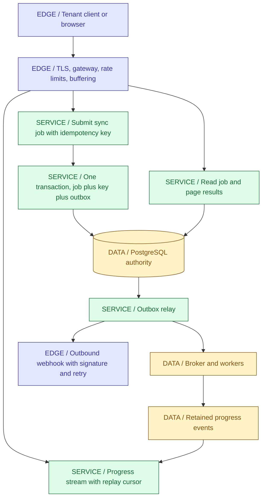
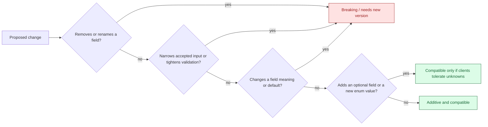
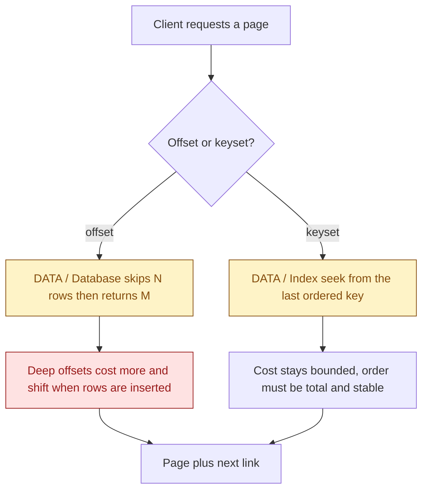
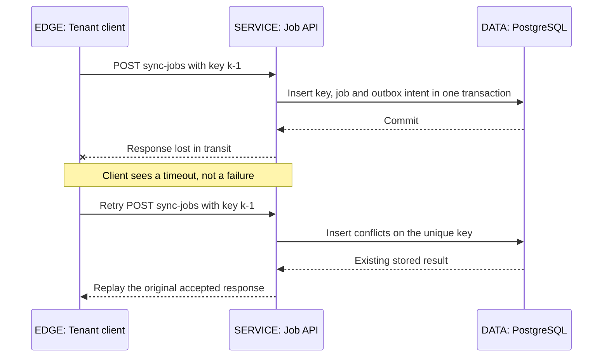
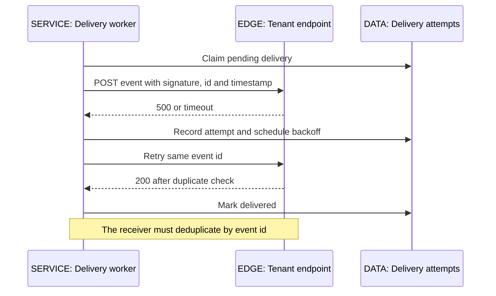
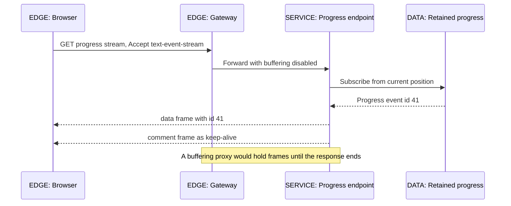
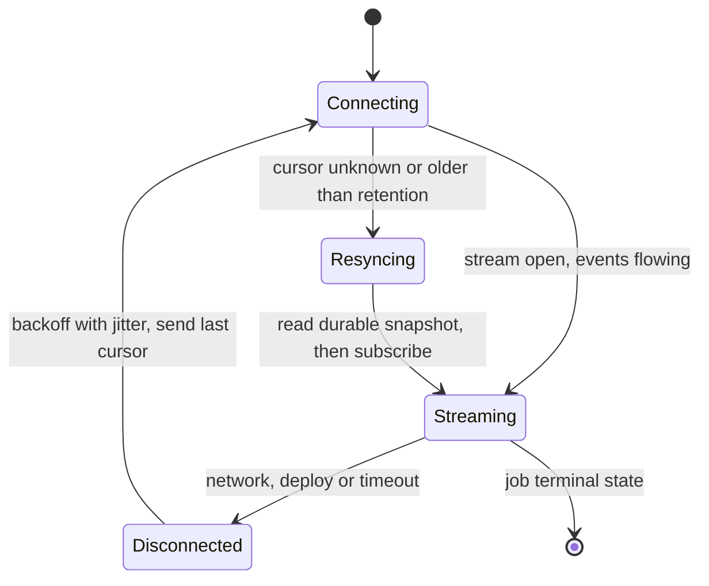
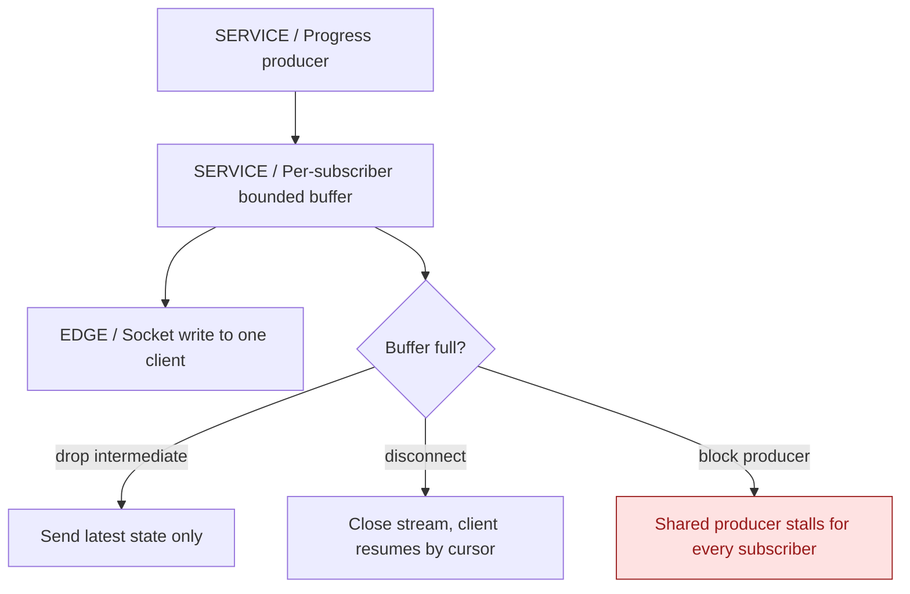

<a id="ch05-apis-realtime"></a>
# 05 / REST, API Design and Real-Time Communication

**A response is a promise about state, not a description of code.** IntegrationHub exposes an HTTP surface where tenants create sync jobs, poll or stream progress, and receive callbacks when work finishes. The network between those parties is unreliable in both directions, so an API design is mostly a set of decisions about retries, ordering, truncation and unknown outcomes. IntegrationHub is fictional; nothing here describes a real employer's endpoints, limits or SLAs.

**Version assumptions:** Java 21 with Spring Boot 4.0.8 and Spring Framework 7.0.x, as established in [03](03-spring.md#ch03-spring); Spring Cloud 2025.1.x remains the compatibility family. HTTP/1.1 and HTTP/2 are the reference transports, with HTTP/3 treated as an infrastructure option rather than an application API change. Reactor 3.8.x travels with that Boot family, gRPC and Protobuf are discussed at specification level, and Kafka 4.x, PostgreSQL 17 and Kubernetes 1.34 remain the surrounding illustrative baselines.

**[VERIFY: recheck the Boot-managed Reactor, Jackson, springdoc/OpenAPI and gRPC artifact versions, plus the HTTP semantics RFC numbers cited below, against the actual dependency table and the current IETF documents before publication. No artifact resolution, specification diff or protocol trace was performed in this environment.]**

**Execution status:** NOT EXECUTED. No JDK, Maven or cached dependency set is available, and the earlier download approval covered diagram dependencies only. The two labs under `code/05-apis-realtime/` are complete, self-contained sources with explicit assertions; they have not been compiled or run, and no HTTP trace, latency figure, throughput number or broker output in this chapter is an observation. Diagrams render locally to embedded SVG; syntax highlighting remains unavailable.

## Big Picture



Three request shapes dominate: a write that must survive retries, a read that must stay bounded, and a stream that must survive disconnection. Each one fails differently. The write risks duplicate work, the read risks unbounded cost and inconsistent paging, and the stream risks missed events and slow consumers. The remaining sections attach a specific contract to each risk rather than a framework feature.

## What You Will Be Able to Explain

- Describe a resource model, HTTP method semantics and status selection without reducing REST to "JSON over HTTP".
- Design a stable error model that is machine-readable, safe to expose, and useful to a client deciding whether to retry.
- Choose a versioning strategy and state precisely which changes are compatible under it.
- Explain offset and keyset pagination, their consistency properties and their cost at depth.
- Implement idempotency as a tenant-scoped, content-bound, retention-limited contract and say what it does not cover.
- Compare polling, long polling, SSE and WebSocket by failure mode, infrastructure requirement and recovery story, not by novelty.
- Explain reconnect, replay cursors, backpressure and slow-client handling, including the point where durable state must take over from a buffer.
- Decide between Reactor/WebFlux and blocking code on virtual threads using the actual constraint, not a benchmark slogan.

> [!PRODUCTION]
> **Where this lives in IntegrationHub.** [03](03-spring.md#ch03-spring) owns the controller, validation and transaction boundary; [04](04-jpa.md#ch04-jpa) persists the job and [06](06-databases.md#ch06-databases) owns the index supporting keyset paging and the uniqueness constraint behind idempotency keys. [07](07-messaging.md#ch07-messaging) owns the outbox relay, broker delivery and consumer-side duplicate handling. [08](08-security.md#ch08-security) owns authentication, tenant authorization, webhook signatures and the rule that stream credentials never travel in URLs. [09](09-frontend.md#ch09-frontend) owns the browser reconnect behavior; [21](21-network-os.md#ch21-network-os) explains the TCP, TLS and proxy behavior these streams depend on.

<a id="ch05-resources"></a>
## 1. Resources, Contracts and HTTP Semantics

**Why this matters:** HTTP already defines meanings for methods, status codes, conditional requests and caching. Reusing those meanings lets proxies, clients and operators reason about traffic they did not write. Inventing a private convention inside a POST body discards that shared vocabulary and moves every decision into application code.

A resource is a named thing with an identity and a representation, not a database table and not a service method. IntegrationHub exposes connectors, sync jobs, job results and progress streams. A sync job is created by posting a submission to the collection, read individually, listed with filters, and cancelled through a state-changing operation. The underlying implementation may touch several tables and a broker; that is not the client's contract.

### Method Semantics Worth Being Precise About

- **Safe** means the method is not expected to request a state change. GET and HEAD are safe; a GET that mutates data breaks caches, prefetchers and crawlers in ways that are hard to diagnose.
- **Idempotent** means that issuing the request multiple times has the same intended effect on server state as issuing it once. GET, HEAD, PUT and DELETE are defined as idempotent; POST is not. Idempotent is a specification property of the method, not a promise that your handler implemented it correctly.
- **Cacheable** depends on method, status and headers. A response is not cacheable merely because it is a GET, and it must never be cacheable when it is tenant-specific and the cache is shared.
- POST is the general-purpose method for operations that do not fit the others. Using POST is not a design failure; pretending a POST is idempotent without a key is.

PUT replaces a representation at a known identity, which is what makes it idempotent: the same body sent twice describes the same final state. PATCH applies a partial modification and is not idempotent in general, because the modification can be relative. DELETE is idempotent in the sense that the resource ends up absent; the second call may legitimately return a different status than the first.

| Status group | Use when | Avoid when |
|---|---|---|
| 200 with body | A completed read or operation has a representation to return | A long-running job is reported as finished because the request was accepted |
| 201 with Location | A new resource identity was created and can be addressed | Creation is only queued and no durable identity exists yet |
| 202 Accepted | Work was durably accepted for later completion, with a status resource to follow | It is used to hide an unknown outcome or an unvalidated request |
| 400 / 422 | The request is malformed or semantically invalid under a documented rule | An authorization failure is disguised as a validation problem |
| 401 / 403 | Credentials are missing or invalid, or the authenticated principal is not permitted | Tenant isolation leaks through a 404-versus-403 difference that reveals existence |
| 409 | A documented conflict, such as a reused idempotency key with different content | Every concurrency problem is flattened into one opaque conflict |
| 429 | A rate or concurrency limit was exceeded, with retry guidance | The server is actually failing and should report a server-side status |
| 5xx | The server failed and the client may retry a safe or idempotent request | A client's invalid input is reported as a server fault, hiding real error budgets |

**Representation discipline.** The response body is a published contract. Returning a JPA entity serializes schema decisions, may trigger lazy loading outside the transaction as [04](04-jpa.md#ch04-jpa) describes, and leaks fields that were never meant to be public. Build a response record deliberately, and keep secrets, internal identifiers and tenant-foreign data out of it by construction rather than by filter.

Richardson's maturity levels and hypermedia controls are worth knowing by name because interviewers ask. In practice, most production APIs stop at resource-plus-method discipline with documented link fields where navigation genuinely varies. Claiming full hypermedia maturity for an API whose clients hardcode URL templates is not an architecture, it is a slide.

> [!MECHANISM]
> **A status code is an instruction to a machine.** Clients, proxies and retry libraries branch on the status before any human reads the body. Choosing 200 for a failure because "the body explains it" disables every automated recovery path between the server and the caller.

**[VERIFY: method safety, idempotency and cacheability definitions, the exact semantics of 202 and 409, and conditional-request handling should be rechecked against RFC 9110 and RFC 9111 rather than quoted from memory. No specification text was retrieved in this environment.]**

**Interview checks:** basic: safe, idempotent and cacheable are three different properties. Internals: PUT's idempotency comes from full-state replacement. Debug: a mutating GET usually surfaces first as mysterious duplicate effects behind a cache or prefetcher. Scenario: a queued operation deserves 202 plus a status resource, not an optimistic 200.

<a id="ch05-errors"></a>
## 2. Error Model: Machine-Readable, Safe and Actionable

**Why a model is needed:** without one, each endpoint improvises. Clients then parse message strings, retry logic becomes guesswork, and a change in wording breaks an integration. A shared error shape lets a caller decide between fix-the-request, retry-later and escalate without reading prose.

RFC 9457 problem details, the successor to RFC 7807, gives a usable baseline: a stable `type` identifier, a short `title`, the `status`, a human-oriented `detail`, and an `instance` for this occurrence. Extension members carry structured specifics such as field-level violations or a retry hint. Spring's `ProblemDetail` support in the Framework 6 and later line makes this the path of least resistance; the important part is the stability of the `type` values, not the library.

```text
HTTP/1.1 409 Conflict
Content-Type: application/problem+json

{
  "type": "https://api.integrationhub.example/problems/idempotency-key-reuse",
  "title": "Idempotency key reused with different content",
  "status": 409,
  "detail": "Key k-1 was already used for a different request body in this tenant.",
  "instance": "/v1/sync-jobs",
  "correlationId": "01J9Z2F7Q9T2V8",
  "retryable": false
}
```

This listing is an illustrative contract sketch, not captured output. No server produced it here.

### What Belongs and What Must Not

- **Belongs:** a stable type URI, the status, a correlation identifier the client can quote in a support request, structured field violations, and an explicit retryability signal where the client cannot infer it from status alone.
- **Does not belong:** stack traces, SQL, internal hostnames, framework class names, upstream vendor error text, or any value from another tenant. [08](08-security.md#ch08-security) treats these as disclosure, not as debugging convenience.
- **Careful with:** validation messages that echo input. Echoing a submitted value back is usually fine; echoing a resolved internal value is not.

Separate the three failure families explicitly. A request-shape failure is the client's to fix and must not be retried unchanged. A conflict describes a state the client can inspect and possibly resolve. A transient failure invites a retry with backoff, and the server should say so through `Retry-After` or a documented extension member rather than leaving the client to guess.

| Error style | Use when | Avoid when |
|---|---|---|
| Problem details with stable type URIs | Multiple clients and versions must branch on failures programmatically | The type strings are regenerated from class names and change with refactors |
| Per-field violation list | A form or batch submission has several correctable problems | Each field message leaks a server-side lookup result |
| Single opaque code plus correlation id | Disclosure risk is high and support has access to correlated logs | Clients legitimately need to self-correct and are given nothing to act on |
| Mapping every failure to 500 | Nothing | Always; it destroys error budgets, alerting and client retry logic |

**Production failure:** a gateway timeout between the edge and the service returns 504 with an HTML body from the proxy. Clients parsing JSON throw a parse error and report "invalid response" rather than "upstream timeout", and the incident is diagnosed an hour late. Normalize error representations at the edge so that every failure a client can see has the documented content type. [18](18-operations.md#ch18-operations) covers correlation and alerting around this.

**[VERIFY: confirm RFC 9457's obsoletion of RFC 7807, the registered `application/problem+json` media type behavior and Spring's current ProblemDetail defaults, including whether a given Boot version emits problem details for framework-level errors without explicit configuration.]**

**Interview checks:** basic: errors are a contract, not log output. Internals: type URIs provide stability that message text cannot. Debug: a non-JSON error body usually means a layer in front of the application produced it. Scenario: retryability must be explicit when the status alone is ambiguous.

<a id="ch05-versioning"></a>
## 3. Versioning and Compatibility

**Why it exists:** once an external client depends on a representation, you no longer control deployment timing. Versioning is the mechanism that lets the server change while existing callers keep working, and its real content is a definition of which changes are safe.



The tolerant-reader branch matters. Adding a field is compatible only for clients that ignore unknown fields; a client with strict deserialization will fail. Adding an enum value is compatible only for clients that have a defined fallback. You cannot assert compatibility for clients you have not specified, so document the reader requirements as part of the contract and treat a strict-schema client as a known constraint.

| Strategy | Use when | Avoid when |
|---|---|---|
| URI path version, `/v1/sync-jobs` | External clients, cacheability and routability matter; human-visible version is an advantage | Dozens of resources force a lockstep version bump for one unrelated change |
| Media-type or header negotiation | The team genuinely operates content negotiation end to end, including caches and gateways | Intermediaries strip or ignore the header and silently serve the default |
| Query-parameter version | A pragmatic stopgap exists and routing cannot change quickly | It becomes the permanent design and collides with cache keys and logs |
| Additive-only, no version | A single internal consumer evolves with the producer in the same pipeline | Third parties or mobile clients are in play and cannot be upgraded on demand |

Deprecation needs a process, not a note. Announce the replacement, instrument usage per client so you know who still calls the old shape, set a sunset date you actually hold, and return advisory headers during the window. Removing an endpoint whose remaining callers you never measured is how a mobile application fleet breaks for months.

**Mobile and webhook consumers deserve special treatment.** You cannot force an upgrade on an installed application, and a receiving endpoint you do not own may be maintained by nobody. These consumers set the real minimum support window, which is a product decision with an engineering cost, not an API style preference. [13](13-integration.md#ch13-integration) covers partner-facing contract management in more depth.

> [!DECISION]
> **Pick the version axis from the consumer, not the aesthetic.** Public and partner-facing surfaces favor explicit, visible path versions with long support windows. Internal service-to-service calls in one deployment pipeline can often rely on strict additive evolution plus contract tests, because the producer and consumer ship together.

**[VERIFY: check the current Sunset and Deprecation header specifications and their adoption status before presenting them as standard practice, and confirm the chosen JSON binding's unknown-field defaults in the selected Boot version.]**

**Interview checks:** basic: additive change is not automatically compatible. Internals: tolerant readers are a precondition, not a given. Debug: per-client usage telemetry is what makes deprecation safe. Scenario: mobile and webhook receivers determine the real support window.

<a id="ch05-pagination"></a>
## 4. Pagination: Bound Cost and State Consistency

**Why it exists:** a collection endpoint without a bound is an availability risk. One tenant with a large job history can produce a response that exhausts memory, saturates a connection and times out behind the gateway. Pagination makes the cost of a single request predictable; it does not make the total cost of walking the collection small.



**Offset pagination** is simple and supports jumping to an arbitrary page. Its two costs are real. Deep offsets usually require the database to produce and discard the skipped rows, so page 5,000 is far more expensive than page 1. And because each page is a separate query, concurrent inserts and deletes shift the window: a row can be seen twice or skipped entirely while a client walks the collection.

**Keyset pagination** orders by a total, stable key and asks for rows after the last key seen. With a matching index, the cost of each page is similar regardless of depth, and the window does not shift under inserts that sort after the cursor. The price is that arbitrary page jumps are gone and the sort key must be genuinely total. Ordering by `created_at` alone is not total when timestamps collide; pair it with the primary key.

| Approach | Use when | Avoid when |
|---|---|---|
| Offset and limit | Small bounded collections, admin screens, arbitrary page access is required | Deep paging over large tenant histories, or exports that must not skip rows |
| Keyset cursor | Large collections, continuous scrolling, export or sync walks | A UI genuinely requires page numbers and total counts on huge data sets |
| Opaque cursor token | You want to change the internal key or add filters without breaking clients | The token is a signed-free plain encoding of internal state a client can forge |
| Unbounded list | Never for tenant data | Always; add a default and a maximum page size instead |

**Total counts are a separate decision.** An exact count over a large filtered set can cost as much as the page itself, and it is stale the moment it is computed. Offer it as an opt-in, an estimate, or a boolean has-more flag derived from fetching one extra row. [06](06-databases.md#ch06-databases) covers the index and plan behavior that determines which of these is affordable.

Make the cursor opaque to the client and validate it on arrival. A cursor that is a plain, readable encoding of a primary key invites a client to construct one, which becomes a tenant-isolation question rather than a paging question: the cursor must be interpreted only within the authorized tenant's query scope. [08](08-security.md#ch08-security) owns that boundary.

**[VERIFY: deep-offset cost, index-supported keyset behavior and count-query cost are engine- and plan-dependent. Measure on PostgreSQL 17 with representative data volume; no query, plan or timing was executed here.]**

**Interview checks:** basic: pagination bounds per-request cost. Internals: offset paging shifts under concurrent writes. Debug: duplicated or missing rows during an export usually indicate offset paging plus insert traffic. Scenario: keyset with a total ordering is the default for a sync walk.

<a id="ch05-idempotency"></a>
## 5. Idempotency and the Unknown Outcome

**Why it exists:** when a client's request times out, the client learns nothing about the server. The request may never have arrived, may have been fully processed, or may have been processed with the response lost on the way back. This is the **unknown outcome** defined in [00](00-master-map.md#ch00-master-map), and it is the single most important asymmetry in API design. A client that cannot retry will drop work; a client that retries blindly will duplicate it.



The retry arrives at a server that already committed the work. The unique constraint, not the application's read-then-write check, is what makes the second attempt safe. A handler that first selects by key and then inserts has a race window in which two concurrent retries both find nothing and both create a job.

### The Four Parts of the Contract

- **Scope.** The key is meaningful only within a tenant and an operation. A bare client string shared across tenants is a collision and a cross-tenant disclosure risk. The lab encodes this as a tuple of tenant, operation and client key.
- **Content binding.** Store a digest of the request content with the result. If the same key arrives with different content, that is a client bug and deserves 409, not a silent replay of an unrelated job.
- **Stored result.** What is replayed is the recorded outcome of the first accepted request, including its status and body. Recomputing a "similar" response is not a replay and can diverge.
- **Retention.** The guarantee has a lifetime. After the window, the key is unknown and the same request creates new work. Retention must be longer than the client's maximum retry horizon, and it must be stated in the documentation rather than implied.

**Accepted is not completed.** Committing the job row, the idempotency record and the publication intent in one local transaction establishes that the request was accepted. The connector sync has not run, the broker has not received anything, and the outbox relay in [07](07-messaging.md#ch07-messaging) still has to publish. The response should say 202 with a job resource, and the client's success handler must not treat it as finished work.

| Mechanism | Use when | Avoid when |
|---|---|---|
| Unique constraint on tenant plus operation plus key | The write is a single local transaction against the authority database | The check is implemented as a select followed by an insert in application code |
| Natural idempotency through PUT at a client-chosen identity | The client can safely choose the identity and the operation is a replacement | Server-side identity generation or side effects make replacement meaningless |
| Consumer-side deduplication in the worker | Broker delivery is at-least-once and the effect must happen once | It is used as a substitute for an API-level key, leaving the HTTP layer duplicating work |
| Client-side request hashing only | A best-effort local guard against double submission in a UI | It is presented as a correctness guarantee across devices, tabs or processes |

> [!TRAP]
> **Idempotency does not make the operation exactly once.** It bounds duplicate acceptance at one boundary for one retention window. Downstream publication, consumer processing and any external connector call each need their own duplicate-handling story, and a network timeout against a third-party system remains an unknown outcome for that call.

The `IdempotencyLab` source under `code/05-apis-realtime/` asserts exactly these boundaries: an identical retry replays one job identity, a reused key with different content is a conflict, two tenants using the same client string are two independent requests, expiry ends the guarantee, and eight concurrent duplicates collapse to one acceptance because the reservation is atomic rather than read-then-write. Those are source-level assertions. The lab has not been compiled or executed.

**[VERIFY: idempotency-key header conventions are still being standardized in the IETF; check the current draft status before describing a header name as a standard. Also confirm the chosen store's constraint behavior and expiry semantics for the production deployment.]**

**Interview checks:** basic: a timeout is not evidence of no effect. Internals: the unique constraint closes the concurrent-retry race. Debug: duplicate jobs with distinct ids usually mean the key was unscoped, expired or checked before insertion. Scenario: 202 with a status resource is the honest answer for queued work.

<a id="ch05-webhooks"></a>
## 6. Rate Limiting and Outbound Webhooks

**Why limits exist:** capacity is shared. Without a limit, one tenant's retry storm or export loop consumes the pool that every other tenant depends on. Rate limiting is an availability control first and a commercial control second, and it belongs where it can protect the resource, which is usually the gateway rather than the application.

Distinguish the counters. A **rate limit** bounds requests per unit of time; a **concurrency limit** bounds simultaneous in-flight work; a **quota** bounds consumption over a billing period. They fail differently: a rate limit smooths bursts, a concurrency limit protects a connection pool or thread budget, and a quota is an accounting decision. [02](02-concurrency.md#ch02-concurrency) distinguishes admission from concurrency control in the same way for in-process work.

- Return 429 with retry guidance, and make the guidance specific enough that a well-behaved client stops guessing.
- Communicate the limit through documented response headers so clients can self-pace before they are rejected.
- Expect retries to synchronize if every client backs off by the same fixed interval. Jitter is what prevents a coordinated second wave.
- Enforce per tenant and per credential, not only per source address. Shared network egress makes address-based limits both leaky and unfair.

### Webhooks Are Someone Else's API, Called by You



An outbound webhook inverts the trust relationship: your service becomes a client of an endpoint you do not operate, which may be slow, unavailable, or in an untrusted network location. The delivery contract therefore needs an event identifier the receiver can deduplicate on, a signature with a timestamp so the receiver can verify origin and reject replays, a bounded timeout, a backoff schedule with a terminal state, and a way for the tenant to replay missed events from retained history.

| Delivery concern | Correct handling | Common mistake |
|---|---|---|
| Duplicate deliveries | Stable event id plus receiver-side deduplication | Assuming one successful POST per event |
| Ordering | Per-subject sequence numbers; receivers tolerate reordering | Assuming the receiver observes global event order |
| Authentication | Signature over the raw body with a timestamp and rotation support | A shared secret in a query string, or no verification at all |
| Slow receiver | Bounded timeout, backoff, circuit breaking, dead-letter state | Unbounded retries that saturate the delivery pool |
| Destination safety | Validated and allow-listed destinations | Posting to any tenant-supplied URL, enabling server-side request forgery |

The last row is a security control, not a convenience check. A tenant-supplied callback URL pointing at an internal address or a cloud metadata endpoint turns your delivery worker into a proxy for internal network access. [08](08-security.md#ch08-security) and [17](17-cloud.md#ch17-cloud) own that validation; it must happen at delivery time rather than only at registration, because DNS can change between the two.

**Production failure:** a tenant endpoint starts responding in thirty seconds instead of two hundred milliseconds. Delivery workers block, the pool fills, and deliveries to every other tenant stall behind one slow receiver. The fix is isolation and bounded timeouts per destination, not more workers. [18](18-operations.md#ch18-operations) covers the bulkhead and circuit-breaker patterns that contain it.

**[VERIFY: webhook signature schemes, timestamp tolerance windows and standard rate-limit header names vary by vendor and draft specification. Confirm the chosen scheme and header set against current references before publishing them as the IntegrationHub contract.]**

**Interview checks:** basic: 429 is a client-visible limit signal, not a server failure. Internals: synchronized backoff without jitter creates retry waves. Debug: a stalled delivery queue often traces to one slow destination. Scenario: tenant-supplied URLs require destination validation at send time.

<a id="ch05-documentation"></a>
## 7. OpenAPI, Swagger and Contract Discipline

**Why a specification artifact matters:** a written contract that is generated from, or validated against, the running service is the only documentation that stays true. Prose descriptions drift within weeks. The specification is also machine input: client generation, mock servers, contract tests and gateway validation all consume it.

Be precise with the names, because interviewers use them as a quick filter. **OpenAPI** is the specification for describing HTTP APIs; 3.1 aligns with JSON Schema. **Swagger** is the older name of the specification plus the current tool family, most visibly Swagger UI. Saying "we use Swagger" usually means "we render an OpenAPI document with Swagger UI", and knowing the difference signals that you have read the specification rather than only the dependency name.

| Approach | Use when | Avoid when |
|---|---|---|
| Design-first, specification is the source | Multiple teams or external partners build against the contract before implementation | Nobody validates that the implementation still matches the committed document |
| Code-first with generated specification | A single team owns both sides and annotations stay close to handlers | The generated document is published without review and leaks internal shapes |
| Generated clients from the specification | Many consumers and frequent additive changes | Regeneration churn becomes the only reason a consumer redeploys |
| Gateway request validation from the specification | Rejecting malformed input early protects downstream services | It is treated as a replacement for server-side validation and authorization |

Documentation exposure is an access decision. An interactive explorer that reaches production data, pre-filled with a working token, is a security surface. Expose the specification where it belongs, and keep examples synthetic. [08](08-security.md#ch08-security) covers the authentication boundary; [03](03-spring.md#ch03-spring) covers the Actuator and management-endpoint equivalent of the same mistake.

Contract tests close the loop that a document alone cannot. A consumer-driven contract test asserts that the producer still satisfies the expectations a specific consumer relies on, which is narrower and more useful than asserting that a schema file parses. [19](19-testing.md#ch19-testing) covers how those tests run in the pipeline.

**Interview checks:** basic: OpenAPI is the specification, Swagger is the tool family and former name. Internals: 3.1 aligns with JSON Schema. Debug: drift appears first in examples and error shapes. Scenario: publish the document, restrict the interactive explorer, and back both with contract tests.

<a id="ch05-protocols"></a>
## 8. gRPC and GraphQL: Different Problems, Not Upgrades

**Why alternatives exist:** REST over JSON optimizes for ubiquity and cacheability. Some problems care more about payload efficiency and strict schemas, and others care about client-controlled response shapes. Choosing a protocol is choosing which constraint you accept, not climbing a ladder of sophistication.

**gRPC** uses HTTP/2 transport with Protobuf messages and a generated service contract in each language. It offers compact binary payloads, bidirectional streaming, deadlines that propagate, and schema evolution rules enforced by field numbers. The costs are real: browsers cannot speak native gRPC without a proxy layer, payloads are not human-readable in a log, and HTTP caches and generic gateways cannot reason about the messages.

**GraphQL** gives the client control over which fields a response contains, resolving over-fetching and under-fetching for UIs with varied needs. The cost moves to the server: query cost analysis, depth and complexity limits, the N+1 problem between resolvers, caching that no longer follows URL semantics, and an authorization check that must apply at the field level rather than the endpoint level.

| Protocol | Use when | Avoid when |
|---|---|---|
| REST over JSON | Public or partner-facing surfaces, cacheable reads, broad client diversity | Extremely chatty internal calls where payload size dominates cost |
| gRPC | Internal service-to-service calls where schema, deadlines and efficiency matter | Browsers are direct consumers, or no team owns the schema registry and proxy layer |
| GraphQL | A UI aggregates many sources and field needs vary strongly per screen | Field-level authorization, cost limits and resolver batching are not budgeted work |
| Messaging instead of a synchronous call | The work is asynchronous and the caller does not need the result inline | A request genuinely needs a bounded synchronous answer; see [07](07-messaging.md#ch07-messaging) |

For IntegrationHub, the tenant-facing API stays REST because it is public, cacheable and consumed by diverse clients including partner integrations. An internal connector-execution call between the job service and the worker fleet is a reasonable gRPC candidate because both ends are owned, the schema is stable, and deadline propagation helps. GraphQL would only be justified if the console in [09](09-frontend.md#ch09-frontend) needed highly varied field selections across many sources, which it does not.

**[VERIFY: gRPC-Web and browser support details, GraphQL cost-analysis tooling and the current Spring support for both should be rechecked against their project documentation. No gRPC or GraphQL runtime was exercised in this environment.]**

**Interview checks:** basic: gRPC is schema-first binary over HTTP/2, GraphQL is a client-shaped query layer. Internals: GraphQL moves cost control and authorization to the field level. Debug: resolver N+1 mirrors the ORM N+1 in [04](04-jpa.md#ch04-jpa). Scenario: protocol choice follows ownership and client diversity.

<a id="ch05-polling"></a>
## 9. Polling and Long Polling

**Why polling persists:** it is the only progress mechanism that requires nothing beyond a plain GET. It works through every proxy, survives every disconnection trivially, needs no server-side connection state, and scales horizontally without sticky routing. Dismissing it is a common and expensive mistake.

Simple polling asks for the status resource on an interval. Its two inefficiencies are the latency floor equal to the interval and the request volume when many clients poll frequently. Both are controllable: use conditional requests with `ETag` or `If-Modified-Since` so unchanged state returns 304 with no body, and let the server suggest an interval that widens as a job sits idle.

**Long polling** holds the request open until state changes or a timeout expires, then returns. It reduces latency without a new protocol, but it converts a stateless request into a held connection, which means timeouts at every intermediary, a connection consumed per waiting client, and a careful contract about what happens to events that occur between the response and the next request. That gap is why long polling still needs a cursor.

| Mechanism | Use when | Avoid when |
|---|---|---|
| Interval polling with conditional GET | Progress granularity of seconds is acceptable, infrastructure is unknown | Sub-second updates are a product requirement for many concurrent viewers |
| Adaptive interval | Jobs vary from seconds to hours and clients should not poll a stalled job hard | The interval is client-chosen only and ignored by misbehaving clients |
| Long polling | Lower latency is needed and streaming is blocked by intermediaries | Held connections exceed the server or proxy connection budget |
| Streaming push | Many updates per job and the latency requirement is genuinely sub-second | The gain is assumed rather than measured against a polling baseline |

For IntegrationHub, polling the job resource is the documented baseline that every API client can rely on, and the progress stream is the optimization. Keeping the polling path authoritative means a client behind a hostile proxy degrades to a slower experience rather than a broken one, and the status endpoint remains the recovery authority for any stream that falls behind retention.

**Interview checks:** basic: polling trades latency for simplicity and resilience. Internals: conditional requests remove the body cost, not the request cost. Debug: a polling storm usually traces to a fixed short interval with no backoff on idle jobs. Scenario: keep a polling fallback whenever intermediaries are outside your control.

<a id="ch05-sse"></a>
## 10. Server-Sent Events

**Why SSE fits progress:** job progress is one-directional, text-shaped and ordered. SSE is a long-lived HTTP response in which the server writes `text/event-stream` frames. It keeps HTTP semantics, works with ordinary authentication and gateways, defines automatic reconnection in the browser, and carries an event identifier that the client sends back on reconnect. For a server-to-client progress feed, it is usually the smallest adequate mechanism.



### The Infrastructure Requirements Are the Hard Part

- **Response buffering must be disabled** on every intermediary in the path. A proxy that buffers for efficiency will accumulate frames and deliver them when the response completes, which for a long-lived stream means never. The symptom is a stream that works locally and delivers nothing through the gateway.
- **Idle timeouts must be longer than the keep-alive interval**, and the server must emit a periodic comment frame so that idle connections are not reaped. Load balancers, service meshes and browsers each have their own timeout.
- **Compression and chunking behavior** must not defeat incremental flushing. A content encoder that waits for more input before emitting a block delays every frame.
- **Connection budget is per client and per tier.** Under HTTP/1.1 a browser's per-origin connection limit is small, and a long-lived stream consumes one of them; HTTP/2 multiplexing changes the arithmetic but not the server-side cost of holding state.

**Authentication must not move into the URL.** The browser's native `EventSource` cannot set arbitrary request headers, which tempts teams to put a token in the query string where it lands in proxy logs, browser history and referrer data. The guide's documented position, set in [00](00-master-map.md#ch00-master-map), is a same-origin secure HttpOnly session cookie through the gateway or BFF, with state-changing requests separately protected against cross-site request forgery. A fetch-based streaming client can send an `Authorization` header instead, at the cost of implementing reconnection yourself. [09](09-frontend.md#ch09-frontend) covers that client choice.

| SSE aspect | Reality | Frequent misconception |
|---|---|---|
| Direction | Server to client only | That it is a lightweight bidirectional channel |
| Transport | Ordinary HTTP response, works with HTTP authentication and gateways | That it needs a protocol upgrade like WebSocket |
| Reconnection | Built into `EventSource`, with `Last-Event-ID` resent automatically | That reconnection also restores events the server no longer retains |
| Payload | UTF-8 text frames; binary needs encoding | That arbitrary binary can be streamed directly |
| Scaling | Each stream holds server-side state and a connection | That it is free because it is "just HTTP" |

**[VERIFY: EventSource header limitations, default reconnection timing, per-origin connection limits under HTTP/1.1 versus HTTP/2, and proxy buffering defaults vary by browser, server and gateway. Confirm against current browser documentation and your gateway configuration; no browser or proxy behavior was measured here.]**

**Interview checks:** basic: SSE is one-directional text over a long-lived HTTP response. Internals: proxy buffering and idle timeouts decide whether it works in production. Debug: frames arriving only at stream end means something in the path buffered. Scenario: never carry a bearer token in a stream URL.

<a id="ch05-websocket"></a>
## 11. WebSocket and STOMP

**Why WebSocket exists:** some interactions are genuinely bidirectional and low-latency, such as collaborative editing, interactive terminals or trading interfaces. WebSocket starts as an HTTP request with an upgrade, then becomes a full-duplex frame-oriented connection that is no longer shaped like request and response.

That upgrade is the source of most of its operational cost. Intermediaries must support the upgrade and forward it, the connection is long-lived and often sticky, and the usual HTTP tooling stops helping: status codes, caching, conditional requests and ordinary request logging no longer describe what is happening on the socket. Authorization also changes shape, because it must apply per message or per subscription rather than once per request, and the connection may outlive the credential that established it.

**STOMP** is a simple text-based messaging protocol frequently layered over WebSocket, and Spring provides a messaging abstraction for it with destinations, subscriptions and a broker relay. It adds useful structure, but it also adds a second routing model inside your application, and a simple in-memory broker does not survive multiple instances without an external relay. Choosing STOMP means choosing to operate that topology.

| Choice | Use when | Avoid when |
|---|---|---|
| SSE | Server-to-client updates, HTTP semantics, straightforward reconnection | Clients must send frequent, low-latency messages upstream |
| WebSocket | Genuine bidirectional interaction with sub-second expectations | Only progress updates are needed and the infrastructure cost is not justified |
| WebSocket plus STOMP | Destination-based pub/sub with multiple topics per connection | A single stream per job would do, or no one owns the broker relay |
| Plain HTTP request for upstream messages | Client-to-server actions are occasional commands | Upstream volume is high and per-request overhead dominates |

For IntegrationHub, progress is server-to-client and the console's upstream actions are occasional commands such as cancel or retry. Those are ordinary authorized POST requests. Adding WebSocket would buy a bidirectional channel the product does not need while adding sticky routing, per-message authorization and a broker relay to operate. That is the decision the chapter recommends, and it would change if a genuinely interactive feature appeared.

> [!DECISION]
> **Choose the weakest mechanism that meets the requirement.** Polling, then SSE, then WebSocket is an increasing order of capability and of operational obligation. Moving up the list should be justified by a specific latency or directionality requirement, not by the expectation that a richer transport is more modern.

**[VERIFY: confirm the current Spring WebSocket and STOMP support, broker relay requirements and the status of the Framework's messaging abstractions in the selected Boot version before recommending a topology.]**

**Interview checks:** basic: WebSocket is bidirectional after an HTTP upgrade. Internals: per-message authorization and sticky routing are the hidden costs. Debug: upgrade failures usually sit in an intermediary that does not forward the upgrade. Scenario: one-directional progress rarely justifies a socket.

<a id="ch05-reconnect"></a>
## 12. Reconnect, Cursors and Replay

**Why this is the real work:** every long-lived connection ends. Deploys, idle timeouts, mobile network changes, laptop sleep and proxy restarts all drop streams routinely. A streaming feature is therefore mostly a resumption design, and the question that matters is what the client is guaranteed when it comes back.



SSE gives the client half of this for free. The server emits an `id` on each event, the browser remembers the last one, and on reconnect it sends `Last-Event-ID`. What the specification does not give you is the server side: the decision about how much history to retain, what to do when the cursor is older than retention, and how to reject a cursor that cannot be valid. Those are application contracts, and they are what the `ReplayCursorLab` makes explicit.

- **Cursor inside retention:** send exactly the events after the cursor, in order, with no gaps. This is the only case that is a pure replay.
- **Cursor equal to the current position:** a valid resume that replays nothing. Treating "no missed events" as an error is a common bug.
- **Cursor older than retention:** the buffer cannot satisfy it. The client must re-read the durable job state and resume from the position that snapshot reports. Silently starting from the oldest retained event would present a gap as continuity.
- **No cursor:** a first connection, which is a snapshot-then-subscribe, not a replay.
- **Cursor ahead of the stream:** impossible for this job. It indicates a different job, a restarted sequence or a forged value, and it must be rejected rather than treated as caught up.

```java
import java.util.ArrayDeque;
import java.util.ArrayList;
import java.util.Deque;
import java.util.List;
import java.util.OptionalLong;

/** Chapter 05 lab: what a Last-Event-ID cursor can and cannot recover after a dropped stream. */
public final class ReplayCursorLab {

    record ProgressEvent(long id, String status, int processed) { }

    sealed interface Resume permits Replay, SnapshotRequired { }

    /** The server could satisfy the cursor entirely from retained history. */
    record Replay(List<ProgressEvent> missed) implements Resume { }

    /** The cursor is unknown or older than retention, so the client must re-read durable state first. */
    record SnapshotRequired(String reason) implements Resume { }

    /** A bounded per-job retention buffer. Retention is a capacity decision, not an unlimited log. */
    static final class ProgressStream {
        private final Deque<ProgressEvent> retained = new ArrayDeque<>();
        private final int retentionSize;
        private long nextId;
        private int processedTotal;

        ProgressStream(int retentionSize) {
            this.retentionSize = retentionSize;
        }

        ProgressEvent publish(String status, int batchSize) {
            processedTotal += batchSize;
            ProgressEvent event = new ProgressEvent(++nextId, status, processedTotal);
            retained.addLast(event);
            while (retained.size() > retentionSize) {
                retained.removeFirst();
            }
            return event;
        }

        /** The durable projection the snapshot endpoint would read, independent of the event buffer. */
        ProgressEvent snapshot() {
            return new ProgressEvent(nextId, nextId == 0 ? "PENDING" : "RUNNING", processedTotal);
        }

        Resume resume(OptionalLong lastEventId) {
            if (lastEventId.isEmpty()) {
                return new SnapshotRequired("no cursor supplied");
            }
            long cursor = lastEventId.getAsLong();
            if (cursor > nextId) {
                return new SnapshotRequired("cursor ahead of the stream, likely a different job or restarted sequence");
            }
            long oldestRetained = retained.isEmpty() ? nextId + 1 : retained.getFirst().id();
            if (cursor + 1 < oldestRetained) {
                return new SnapshotRequired("cursor older than retention");
            }
            List<ProgressEvent> missed = new ArrayList<>();
            for (ProgressEvent event : retained) {
                if (event.id() > cursor) {
                    missed.add(event);
                }
            }
            return new Replay(missed);
        }
    }

    static void check(boolean condition, String description) {
        if (!condition) {
            throw new AssertionError(description);
        }
    }

    static ProgressStream streamWith(int retention, int events) {
        ProgressStream stream = new ProgressStream(retention);
        for (int index = 0; index < events; index++) {
            stream.publish("RUNNING", 10);
        }
        return stream;
    }

    static void cursorInsideRetentionReplaysOnlyMissedEvents() {
        ProgressStream stream = streamWith(5, 5);
        Resume resume = stream.resume(OptionalLong.of(3));
        check(resume instanceof Replay, "a cursor inside retention is replayable");
        List<ProgressEvent> missed = ((Replay) resume).missed();
        check(missed.size() == 2, "only events after the cursor are resent");
        check(missed.get(0).id() == 4 && missed.get(1).id() == 5, "replay is ordered and gapless");
        check(missed.get(1).processed() == 50, "the last replayed event carries the cumulative figure");
    }

    static void currentCursorReplaysNothing() {
        ProgressStream stream = streamWith(5, 5);
        Resume resume = stream.resume(OptionalLong.of(5));
        check(resume instanceof Replay, "an up-to-date cursor is still a valid resume");
        check(((Replay) resume).missed().isEmpty(), "nothing is missed, so nothing is resent");
    }

    static void cursorOlderThanRetentionFallsBackToSnapshot() {
        ProgressStream stream = streamWith(3, 10);
        Resume resume = stream.resume(OptionalLong.of(2));
        check(resume instanceof SnapshotRequired, "retention is bounded, so old cursors cannot be honoured");
        ProgressEvent snapshot = stream.snapshot();
        check(snapshot.id() == 10, "the snapshot carries the position the client should resume from");
        check(snapshot.processed() == 100, "durable state, not the event buffer, is the recovery authority");
    }

    static void missingCursorRequiresSnapshotFirst() {
        ProgressStream stream = streamWith(5, 4);
        check(stream.resume(OptionalLong.empty()) instanceof SnapshotRequired, "a first connection is not a replay");
    }

    static void cursorAheadOfStreamIsRejected() {
        ProgressStream stream = streamWith(5, 4);
        Resume resume = stream.resume(OptionalLong.of(99));
        check(resume instanceof SnapshotRequired, "an impossible cursor must not be treated as caught up");
    }

    public static void main(String[] args) {
        cursorInsideRetentionReplaysOnlyMissedEvents();
        currentCursorReplaysNothing();
        cursorOlderThanRetentionFallsBackToSnapshot();
        missingCursorRequiresSnapshotFirst();
        cursorAheadOfStreamIsRejected();
        System.out.println("ReplayCursorLab checks completed");
    }
}
```

This listing is the saved lab source, checked for exact synchronization by the publication test. That check is not compilation, and the file has not been executed. The in-memory deque stands in for whatever retains progress in production, which might be a broker topic, a database table or a cache with an eviction policy. The important property is that retention is bounded and that the durable job state, not the buffer, is the recovery authority.

**Reconnect politely.** Exponential backoff with jitter and a maximum interval prevents a deploy from being followed by a synchronized reconnection surge from every connected client. A client that reconnects instantly on every failure turns a brief restart into a sustained load event. [09](09-frontend.md#ch09-frontend) covers the browser-side implementation and [18](18-operations.md#ch18-operations) covers the deployment pattern that drops the connections in the first place.

**Interview checks:** basic: `Last-Event-ID` is a request for retained history, not a guarantee of it. Internals: retention bounds what any cursor can recover. Debug: a silent gap after reconnect usually means an out-of-retention cursor was served from the oldest buffered event. Scenario: fall back to a durable snapshot, then subscribe.

<a id="ch05-backpressure"></a>
## 13. Slow Clients and Backpressure

**Why a slow client is a server problem:** when the server produces events faster than one client consumes them, something must absorb the difference. If nothing is designed to, the buffer is wherever the default happens to be: socket buffers, framework queues or heap. The result is memory growth driven by the slowest consumer, which is the opposite of an isolation property.



Three strategies exist and each is a trade. **Coalescing** suits progress because intermediate percentages are disposable: send the latest state and skip the ones nobody saw, which keeps memory bounded and loses nothing the user needed. **Disconnecting** a hopeless subscriber is honest when every event matters, because the client resumes by cursor and the server stops paying for it. **Blocking the producer** is almost always wrong for a shared stream, since one slow client then throttles everyone.

- Make every per-subscriber buffer explicitly bounded. An unbounded queue is a deferred outage, as [02](02-concurrency.md#ch02-concurrency) argues for executors.
- Decide the overflow policy per stream type. Disposable progress coalesces; an audit or billing feed must not silently drop and should fall back to durable replay.
- Apply write timeouts. A client that has stopped reading but has not closed the connection can hold resources indefinitely.
- Measure subscriber count, buffer occupancy and drop or disconnect counts. Without these, slow-consumer problems appear as unexplained heap growth.

Reactive libraries give this a formal shape. Reactor's `Flux` with a request-based protocol lets a subscriber signal demand, and operators such as the buffering and sampling family make the overflow decision explicit at the point where it happens. That is a genuine strength: the policy is in the code rather than in whichever buffer happened to grow. It is not a magic absence of the problem, because the policy still has to be chosen.

**[VERIFY: per-subscriber buffering behavior, default overflow strategies and write-timeout settings differ across Spring MVC SSE emitters, WebFlux and the servlet container. Confirm the defaults for the selected stack; no load test or memory measurement was performed here.]**

**Interview checks:** basic: backpressure is the absence of an unbounded buffer. Internals: the overflow policy must be chosen per stream semantics. Debug: heap growth correlated with subscriber count points at per-subscriber queues. Scenario: coalesce progress, disconnect-and-replay for feeds where every event matters.

<a id="ch05-reactive"></a>
## 14. Reactor, WebFlux and Virtual Threads

**Why the comparison matters:** both approaches address the same constraint, which is that a thread blocked on I/O is an expensive way to wait. They differ in what they ask of your code. This is a frequent interview topic and an even more frequent source of unjustified rewrites.

**Reactor and WebFlux** express work as a pipeline of publishers with explicit demand signalling, executed by a small event-loop thread pool. The gains are a low thread count under high connection concurrency and first-class operators for streaming, composition, timeouts and backpressure. The costs are a programming model that is viral through the call stack, debugging where stack traces no longer describe causation, and the rule that one blocking call on an event-loop thread can stall many unrelated requests.

**Virtual threads**, as introduced in Java 21 and covered in [01](01-java-jvm.md#ch01-java-jvm) and [02](02-concurrency.md#ch02-concurrency), keep ordinary blocking code and sequential control flow while making a blocked thread cheap. Debuggers, profilers, thread dumps, try-with-resources and plain stack traces keep working. They do not provide backpressure, streaming operators or demand signalling, and they do not fix a saturated downstream dependency or a connection pool that is still the real limit.

| Constraint | Reactor and WebFlux | Blocking code on virtual threads |
|---|---|---|
| Very high concurrent connection count with little per-request CPU | Strong fit, small thread footprint | Workable, but each task still needs its stack and scheduling |
| Streaming with explicit demand and overflow policy | First-class, operators make the policy visible | Must be built by hand with bounded queues |
| Existing blocking drivers and libraries | Requires offloading to a bounded scheduler, easy to get wrong | Natural fit, no model change |
| Team familiarity and debuggability | Steep; traces and operator semantics need real expertise | Familiar; ordinary tooling applies |
| Bounded downstream resource such as a connection pool | Still the limiting factor | Still the limiting factor, and easier to exhaust by accident |

> [!TRAP]
> **One blocking call on an event-loop thread is not a local slowdown.** It occupies a thread that serves many connections, so a single synchronous lookup inside a reactive chain can degrade unrelated requests. Blocking-call detection in development and explicit offloading to a bounded scheduler are not optional extras in a reactive codebase.

The decision rule the guide applies: keep the blocking model unless a specific, measured constraint demands otherwise, because virtual threads removed the most common reason teams reached for reactive code. Reach for Reactor when you genuinely need streaming composition with demand signalling, or when the surrounding ecosystem is already reactive end to end. Do not mix the models casually in one request path; the boundary between them is where blocked event-loop threads and lost context appear. [23](23-jvm-performance.md#ch23-jvm-performance) covers how to measure before choosing, and [03](03-spring.md#ch03-spring) covers the MVC and WebFlux stack decision.

**[VERIFY: virtual-thread support in the selected Boot version, pinning behavior differences between Java 21 and JEP 491 in Java 24 and 25, and current WebFlux defaults all require confirmation against release documentation. No benchmark, thread dump or load comparison was produced in this environment.]**

**Interview checks:** basic: both target wasted waiting, with different programming models. Internals: event-loop threads are shared, so blocking them is not local. Debug: a reactive pipeline with a hidden blocking call shows latency on unrelated endpoints. Scenario: prefer the simpler model unless streaming or demand signalling is genuinely required.

<a id="ch05-labs"></a>
## 15. Labs and Execution Status

Two self-contained Java sources live under `code/05-apis-realtime/`, with `run.ps1`, `README.md` and `execution.json`. The workspace command is `& './docs/java-fs-guide/code/05-apis-realtime/run.ps1'`, and an already-installed JDK can be supplied through the optional `-JdkHome` parameter. No downloads are attempted.

| Lab | What its assertions cover | What it does not claim |
|---|---|---|
| IdempotencyLab | Scoped keys, content binding, replay of a stored result, conflict on key reuse, tenant isolation, retention expiry, and one acceptance among eight concurrent duplicates | Not an HTTP, database-constraint or exactly-once delivery test; the store is an in-memory stand-in |
| ReplayCursorLab | Cursor inside retention replays only missed events, an up-to-date cursor replays nothing, an out-of-retention cursor requires a snapshot, a missing cursor is not a replay, and an impossible cursor is rejected | Not an SSE, proxy, browser or network test; retention is a fixed-size deque, not a broker |

**NOT EXECUTED:** the runner's preflight ran and reported that no JDK compiler is reachable through PATH or JAVA_HOME, and downloads are not authorized. Nothing was compiled, no assertion was evaluated, and no output was produced. The inline `ReplayCursorLab` listing above is checked against its saved source, which verifies synchronization rather than correctness.

What a real test environment should add: contract tests against the published OpenAPI document, an integration test that submits the same idempotency key concurrently against a real unique constraint, a proxy-in-the-path test that would catch SSE buffering, and a slow-consumer test that asserts bounded memory. [19](19-testing.md#ch19-testing) covers those once the toolchain exists.

### A Repeatable Diagnosis

- State the failing contract precisely: duplicate work, wrong status, stale page, missed event, stalled stream, or unbounded memory.
- Identify which boundary owns it. Duplicates are an idempotency or consumer-deduplication question; missed events are a retention and cursor question; stalled streams are usually an intermediary.
- Reproduce with the real path included. A stream that works against localhost proves nothing about the gateway, and that is where buffering lives.
- Check the status and headers before the body. A non-JSON error body or an unexpected 504 identifies the layer that produced it.
- For duplicates, compare the scoping tuple and the retention window against the client's retry horizon before changing handler code.
- For memory, correlate heap growth with subscriber count and buffer occupancy, not with total request rate.
- Fix the owning contract and add a test that fails for that specific mistake, without claiming a broader guarantee than it exercises.

<a id="ch05-concept-index"></a>
## Explained-Here Index and Sources

| Concept | Explanation |
|---|---|
| Resources, methods, status selection and representations | [HTTP semantics](#ch05-resources) |
| Problem details and safe error contracts | [Error model](#ch05-errors) |
| Compatible change, version axes and deprecation | [Versioning](#ch05-versioning) |
| Offset, keyset cursors, counts and bounded cost | [Pagination](#ch05-pagination) |
| Scoped keys, content binding, retention and unknown outcomes | [Idempotency](#ch05-idempotency) |
| Rate limits, quotas, signatures and delivery retries | [Limits and webhooks](#ch05-webhooks) |
| OpenAPI, Swagger tooling and contract discipline | [Documentation](#ch05-documentation) |
| gRPC and GraphQL trade-offs | [Protocol alternatives](#ch05-protocols) |
| Interval polling, conditional requests and long polling | [Polling](#ch05-polling) |
| Event streams, buffering and keep-alive requirements | [SSE](#ch05-sse) |
| Full-duplex sockets, STOMP destinations and their costs | [WebSocket](#ch05-websocket) |
| Last-Event-ID, retention limits and snapshot fallback | [Reconnect and replay](#ch05-reconnect) |
| Bounded buffers, coalescing and overflow policy | [Backpressure](#ch05-backpressure) |
| Reactive pipelines versus blocking code on cheap threads | [Reactor and virtual threads](#ch05-reactive) |
| Lab scope and actual execution status | [Labs](#ch05-labs) |

Owning references for further checking: [RFC 9110 HTTP semantics](https://www.rfc-editor.org/rfc/rfc9110.html), [RFC 9457 problem details](https://www.rfc-editor.org/rfc/rfc9457.html), the [HTML living standard server-sent events section](https://html.spec.whatwg.org/multipage/server-sent-events.html), [OpenAPI 3.1](https://spec.openapis.org/oas/v3.1.0.html) and the [Spring Framework web documentation](https://docs.spring.io/spring-framework/reference/web.html). These are where to verify the mechanisms described above; citing them is not a claim that this environment retrieved or executed them.

## Related Chapters

Build on [03 web layer and transactions](03-spring.md#ch03-spring) and [04 persistence boundaries](04-jpa.md#ch04-jpa), with [01 Java](01-java-jvm.md#ch01-java-jvm) and [02 concurrency](02-concurrency.md#ch02-concurrency) underneath. [06 databases](06-databases.md#ch06-databases) owns the constraints and indexes this chapter relies on, and [07 messaging](07-messaging.md#ch07-messaging) owns everything after acceptance. [08 security](08-security.md#ch08-security), [09 frontend contracts](09-frontend.md#ch09-frontend), [13 partner integration](13-integration.md#ch13-integration), [18 operations](18-operations.md#ch18-operations), [19 testing](19-testing.md#ch19-testing), [21 network and OS](21-network-os.md#ch21-network-os), [22 distributed systems](22-distributed.md#ch22-distributed), [23 performance](23-jvm-performance.md#ch23-jvm-performance) and [17 cloud](17-cloud.md#ch17-cloud) extend the boundaries touched here. Return to [00](00-master-map.md#ch00-master-map) for the whole request journey. Generated Related chapters links are reciprocal.

<a id="ch05-cheat-sheet"></a>
## One-Page Cheat Sheet

**Semantics:** safe, idempotent and cacheable are three separate properties. PUT replaces, PATCH modifies, POST is the general case. 202 means durably accepted, not completed. Never flatten failures into 200 or 500.

**Errors:** publish a stable problem-details shape with type URIs, a correlation identifier and explicit retryability. Never expose stack traces, SQL, internal hosts or other tenants' data. Normalize edge-produced errors so clients always get the documented content type.

**Versioning:** additive change is compatible only for tolerant readers. Removals, renames, narrowed input and changed meanings are breaking. Measure per-client usage before deprecating. Mobile and webhook receivers set the real support window.

**Pagination:** always bound page size. Offset paging shifts under concurrent writes and costs more with depth. Keyset needs a total, stable ordering and an index. Exact counts are an opt-in cost. Cursors are opaque and validated within the tenant scope.

**Idempotency:** scope the key by tenant and operation, bind it to content, store the result, and state retention. Enforce with a unique constraint, not select-then-insert. A timeout is an unknown outcome. Acceptance is not completion, and this is not exactly-once.

**Limits and webhooks:** 429 with guidance, jittered backoff, per-tenant enforcement. Outbound deliveries need stable event ids, signatures with timestamps, bounded timeouts, backoff with a terminal state, replay, and destination validation against internal addresses.

**Transports:** polling is the resilient baseline and deserves conditional requests. SSE is one-directional text over HTTP and fails on proxy buffering and idle timeouts. WebSocket buys bidirectionality at the cost of upgrades, stickiness and per-message authorization. Choose the weakest mechanism that meets the requirement.

**Streams:** `Last-Event-ID` requests retained history and does not guarantee it. Handle cursor-in-retention, caught-up, out-of-retention, absent and impossible cursors distinctly. Bound every per-subscriber buffer, coalesce disposable progress, disconnect hopeless subscribers, and never let one slow client block a shared producer. Reactor offers explicit demand; virtual threads keep blocking code cheap; neither fixes a saturated downstream. The Java labs remain NOT EXECUTED.

<a id="ch05-interview"></a>
## Interview Corner

### Basic: What Makes an API RESTful Beyond Returning JSON?

Resource identity, uniform method semantics, stateless requests, and meaningful use of status codes, conditional requests and caching. JSON is a representation format, not an architectural style. Most production APIs stop short of full hypermedia and should say so honestly.

### Internals: Why Is PUT Idempotent but POST Is Not?

PUT describes the complete intended state at a known identity, so repeating it converges on the same result. POST is a general submission whose effect may be cumulative, such as appending a new job. Idempotency is a property of the defined method semantics, not of your handler.

### Trace/Debug: A GET Started Causing Duplicate Side Effects. Where Do You Look?

Look for a handler that mutates state on a safe method. Caches, prefetchers, link scanners and retry middleware all repeat GETs freely, so the duplicates often appear without any client change. Move the mutation to POST and audit for other safe-method writes.

### Scenario: The Job Takes Ten Minutes. What Does the Submission Return?

202 Accepted with a Location pointing at a job status resource, after the job and its idempotency record are durably committed. The body carries the job identity and current state. The client then polls the status resource or subscribes to the progress stream.

### Basic: What Should an Error Response Contain?

A stable machine-readable type, the status, a human-readable summary, a correlation identifier, structured field violations where relevant, and an explicit retryability signal when status alone is ambiguous. No stack traces, SQL, internal hostnames or cross-tenant values.

### Internals: Why Prefer a Type URI Over an Error Message?

Message text is written for humans and changes freely during refactors and translations. A type URI is a committed identifier that clients can branch on and that survives rewording. It also gives you a place to document the condition and its remedy.

### Trace/Debug: Clients Report "Invalid JSON" During an Incident. What Is Likely Happening?

An intermediary is producing the error rather than the application, typically an HTML gateway timeout or error page. Check the status and content type before parsing. Normalize edge errors into the documented problem format so this failure mode stops being ambiguous.

### Scenario: How Do You Signal That a Failure Is Worth Retrying?

Use the status correctly first, add `Retry-After` for limits and transient server conditions, and include an explicit retryability member when the distinction is not inferable. Document the backoff expectation, because a retry policy you did not specify will be invented by the client.

### Basic: Which API Changes Are Backward Compatible?

Adding an optional field or a new endpoint is usually compatible for tolerant readers. Removing or renaming fields, tightening validation, changing a field's meaning or default, and changing status semantics are breaking. Adding an enum value is breaking for clients without a fallback.

### Internals: Why Is a Tolerant Reader a Precondition Rather Than an Assumption?

Compatibility depends on the consumer's deserialization behavior, which you do not control. A strict-schema client fails on an unknown field. Document the reader requirement as part of the contract, and treat known strict consumers as a constraint on what counts as additive.

### Trace/Debug: How Do You Know It Is Safe to Remove Version One?

Instrument usage per client and credential, not just aggregate call counts. Announce the replacement, publish a sunset date, return advisory headers, and watch the per-client series fall to zero. Absence of complaints is not evidence of absence of callers.

### Scenario: Path Versions or Header Negotiation?

For a public or partner-facing API, path versions, because they are visible, routable, cacheable and easy to support. Header negotiation is defensible when the whole path, including caches and gateways, genuinely implements it. The failure mode is an intermediary that drops the header and serves the default.

### Basic: Why Is Deep Offset Pagination Expensive?

The engine generally has to produce and discard the skipped rows before returning the page, so cost grows with depth. Concurrent inserts and deletes also shift the window between pages, which can duplicate or skip rows during a walk.

### Internals: What Does Keyset Pagination Require to Be Correct?

A total, stable ordering, an index that supports the seek, and a cursor that encodes every column in that ordering. Ordering by a timestamp alone is not total when values collide, so pair it with a unique key. Filters must be part of the cursor contract or results shift.

### Trace/Debug: An Export Produced Duplicate and Missing Rows. What Happened?

Almost certainly offset pagination over a table receiving concurrent inserts or deletes. The page boundaries moved between requests. Switch to a keyset walk over a stable ordering, or snapshot the data set, and verify with a run under concurrent write load.

### Scenario: The UI Wants Total Pages for a Large Tenant History. What Do You Offer?

Explain that an exact count over a large filtered set is expensive and immediately stale. Offer a has-more indicator derived from fetching one extra row, an estimated count, or an opt-in exact count with a documented cost. Keep the default cheap.

### Basic: What Problem Does an Idempotency Key Solve?

It lets a client retry a non-idempotent operation after an unknown outcome without creating duplicate work. The server recognizes the repeated logical request and replays the recorded result instead of performing the operation again.

### Internals: Why Is a Unique Constraint Better Than Checking Before Inserting?

Select-then-insert has a race window: two concurrent retries can both find nothing and both proceed. A unique constraint makes the reservation atomic at the authority, so exactly one attempt wins and the other observes the stored result. The lab models this with an atomic compute rather than a read followed by a write.

### Trace/Debug: Duplicate Jobs Appeared Despite Idempotency Keys. What Do You Check?

Check the key's scope, whether the retry reused the same key at all, whether the retention window had expired before the retry, whether the check happened before the insert, and whether a second path such as a bulk import bypasses the key entirely.

### Scenario: Does Idempotency Give You Exactly-Once Processing?

No. It bounds duplicate acceptance at the API boundary for one retention window. Broker delivery is still at-least-once, the worker needs its own deduplication, and a timed-out call to an external connector remains an unknown outcome that only that system's idempotency contract can resolve.

### Basic: When Would You Choose Polling Over Streaming?

When updates are infrequent, the latency requirement is seconds rather than milliseconds, intermediaries are outside your control, or client diversity is high. Polling with conditional requests is cheap, stateless and recovers from disconnection with no design work.

### Internals: Why Does SSE Deliver Nothing Through Some Gateways?

Because an intermediary is buffering the response. Buffering is a reasonable default for ordinary responses and fatal for a stream that never ends. Disabling buffering on the stream path, plus idle timeouts longer than the keep-alive interval, is what makes it work.

### Trace/Debug: A Stream Works Locally and Fails in Production. What Is Your Sequence?

Reproduce through the real path, not localhost. Check for buffering, idle timeouts, compression that defers flushes, and per-origin connection limits. Confirm keep-alive frames are emitted and reaching the client, then check whether the gateway terminated the response at a fixed duration.

### Scenario: Progress Updates Only. SSE or WebSocket?

SSE. The data is one-directional text, reconnection and the event cursor are built in, and ordinary HTTP authentication and infrastructure apply. WebSocket adds an upgrade, sticky routing and per-message authorization for a bidirectionality the feature does not need.

### Basic: What Does Last-Event-ID Actually Guarantee?

That the client told the server which event it last saw. Whether the server can satisfy that cursor depends entirely on retention. Outside the retained window, the only correct response is to require a fresh snapshot of durable state.

### Internals: What Are the Distinct Cursor Cases a Resume Handler Must Cover?

Inside retention, replay exactly the missed events in order. Equal to the current position, replay nothing and keep streaming. Older than retention, require a snapshot. Absent, treat as a first connection. Ahead of the stream, reject as impossible rather than treating it as caught up.

### Trace/Debug: Heap Grows With Connected Users but Not With Request Rate. Why?

Per-subscriber buffers. Each slow or stalled consumer accumulates undelivered events, so memory tracks subscriber count and buffer occupancy rather than throughput. Bound the buffers, choose an overflow policy, add write timeouts, and emit metrics for drops and disconnections.

### Scenario: One Client Cannot Keep Up With a Shared Progress Stream. What Do You Do?

Coalesce to the latest state, since intermediate progress values are disposable, and bound the buffer. If every event matters, disconnect that subscriber and let it resume by cursor. Never block the shared producer, because that converts one slow client into a global stall.
