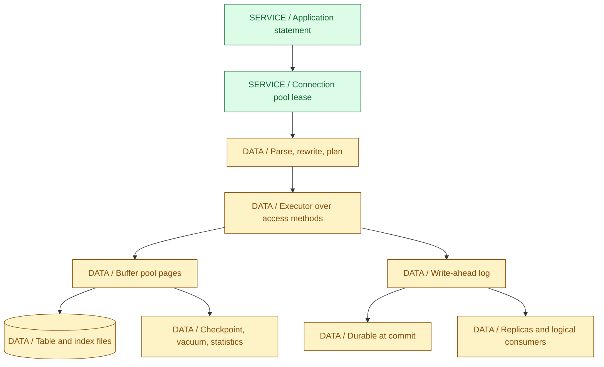
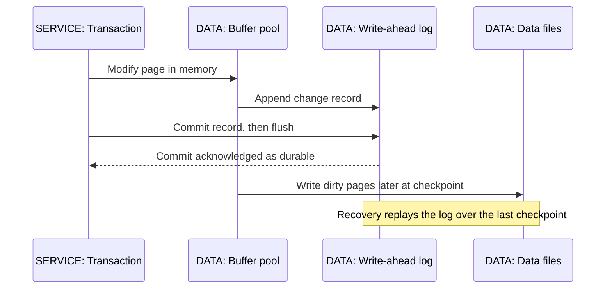
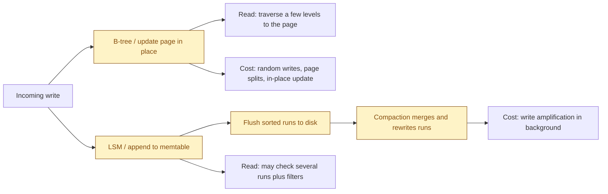
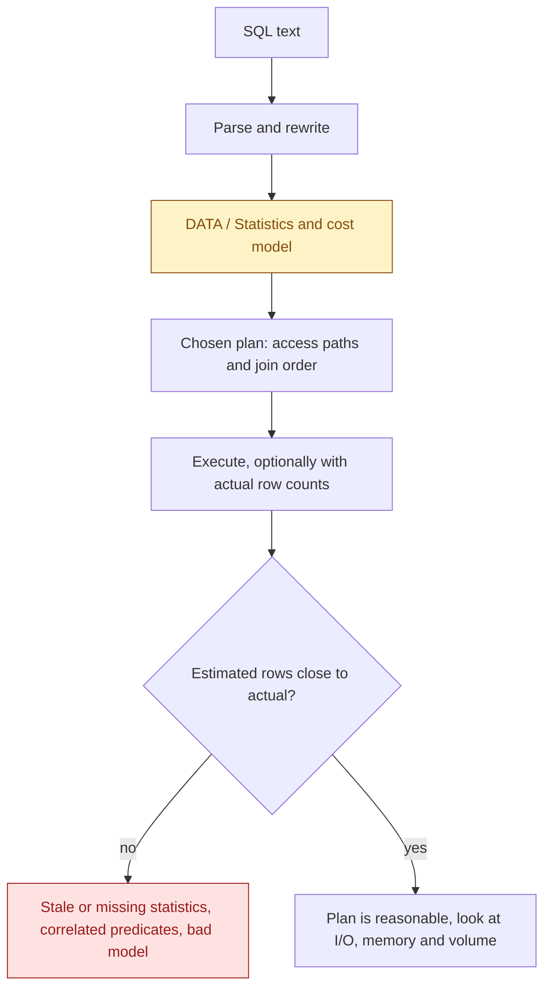
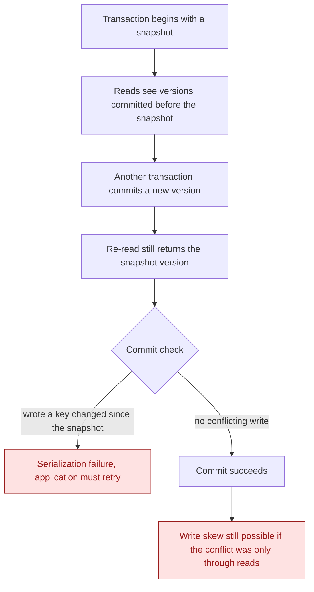
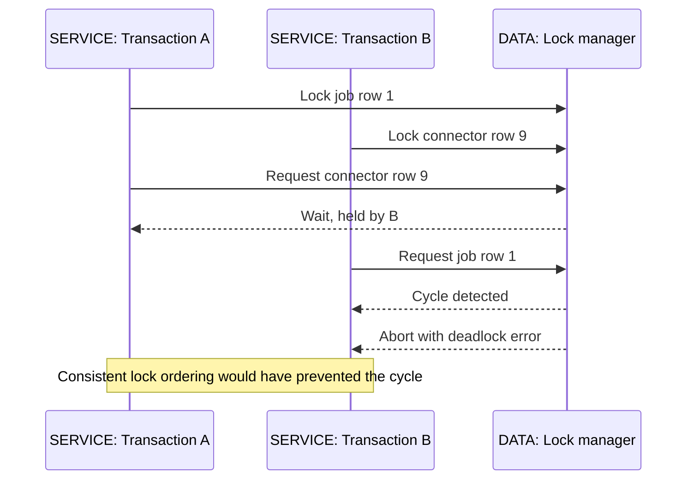
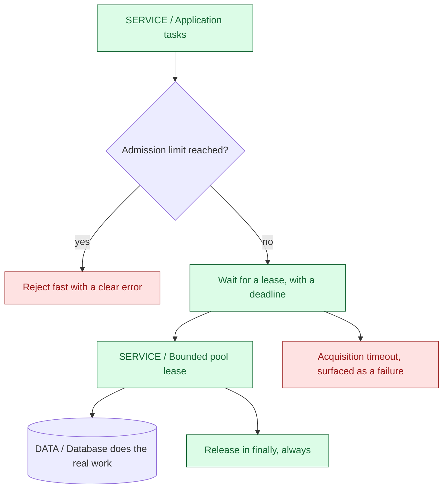
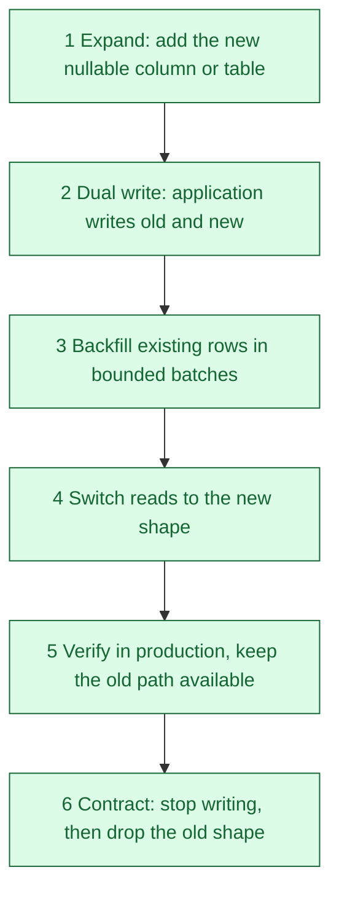

<a id="ch06-databases"></a>
# 06 / Databases and Durable State

**The database is where a claim becomes a fact.** Everything else in IntegrationHub is a cache, a retry or an opinion. A job exists because a row committed; a tenant's progress is real because the write-ahead log survived a restart. This chapter is about the machinery that turns an application's intent into durable, consistent, queryable state, and about the specific ways that machinery disappoints people who treat it as a black box behind a repository interface. IntegrationHub is fictional and no schema, volume or latency figure here describes a real employer's system.

**Version assumptions:** PostgreSQL 17 is the reference operational database, with MySQL 8.4 as the comparison point. Redis 7.x, MongoDB 8.x and Elasticsearch 9.x appear as complementary stores rather than primary authority. Flyway and Liquibase are discussed at mechanism level. The surrounding stack is unchanged from [03](03-spring.md#ch03-spring): Java 21, Spring Boot 4.0.8, Kafka 4.x and Kubernetes 1.34.

**[VERIFY: recheck PostgreSQL 17, MySQL 8.4, Redis, MongoDB and Elasticsearch version-specific behavior, along with the Boot-managed driver and pool versions, against current release documentation. No engine was installed, no driver resolved and no release note retrieved in this environment.]**

**Execution status:** NOT EXECUTED. No JDK, Maven, database engine or client is available, and download authorization covered diagram dependencies only. The two labs under `code/06-databases/` are complete Java 21 sources with explicit assertions, and they model isolation and pooling behavior in memory. They have not been compiled or run. No SQL statement, query plan, row count, timing, lock wait or replication lag in this chapter is an observation. Diagrams render locally to embedded SVG; syntax highlighting remains unavailable.

## Big Picture



Three facts in that diagram explain most database surprises. Commit durability comes from the log, not from writing table files, so a committed row may still live only in memory pages plus a flushed log record. The planner chooses the access path from statistics, so the same SQL can behave completely differently next month. And the connection pool sits in front of everything, which means application concurrency is bounded long before the database's own limits are reached.

## What You Will Be Able to Explain

- Describe how a statement travels from the pool through planning and execution to pages, the log and durability.
- Explain B-tree and LSM storage, buffer pool behavior and write-ahead logging well enough to predict their cost profiles.
- Design indexes from the predicates, ordering and selectivity of actual queries, and say why an index can be ignored.
- Read a plan critically, including the difference between estimated and actual rows, and know what that difference implies.
- Distinguish isolation levels by the anomalies they prevent, and explain MVCC, write skew and first-committer-wins.
- Diagnose lock waits and deadlocks from the access order rather than from the application's method names.
- Explain vacuum, bloat, statistics and checkpoints as operational requirements rather than background magic.
- Size and reason about a connection pool, including why increasing it often makes things worse.
- Compare streaming and logical replication, partitioning and sharding, and the consistency each one costs.
- Run a zero-downtime schema change with expand and contract, and state a real backup and recovery objective.

> [!PRODUCTION]
> **Where this lives in IntegrationHub.** PostgreSQL is the authority for jobs, idempotency records, outbox rows and progress. [04](04-jpa.md#ch04-jpa) generates most of the statements, [05](05-apis-realtime.md#ch05-apis-realtime) depends on the unique constraint behind idempotency keys and the index behind keyset pagination, and [07](07-messaging.md#ch07-messaging) relies on the outbox committing in the same local transaction as the business row. [08](08-security.md#ch08-security) owns tenant isolation and encryption at rest, [15](15-kubernetes.md#ch15-kubernetes) and [17](17-cloud.md#ch17-cloud) own where the instance runs, and [18](18-operations.md#ch18-operations) owns the backup verification that makes the word "durable" meaningful.

<a id="ch06-relational-model"></a>
## 1. SQL and the Relational Model

**Why it exists:** a relational database separates what you want from how it is obtained. You declare a result set; the engine chooses the access path, join order and algorithms. That indirection is what lets the same query survive a hundredfold growth in data by changing an index rather than application code, and it is also why performance reasoning requires understanding the planner rather than only the SQL text.

The model's useful discipline is that constraints live with the data. A unique constraint, a foreign key, a check constraint and a not-null column are enforced for every writer, including the maintenance script someone runs at midnight and the import path nobody remembered. Application-level validation as described in [03](03-spring.md#ch03-spring) improves error messages; it does not protect an invariant, because it only runs on the paths that call it.

### Declarative Queries and Set Thinking

- **A query describes a result, not a loop.** Filtering, joining, grouping and ordering are set operations the engine can reorder and optimize. Fetching rows and filtering them in Java moves work to the slowest place and discards the index.
- **NULL is not a value, it is the absence of one.** Comparisons with NULL yield unknown, which silently removes rows from predicates and changes the meaning of NOT IN. This is a frequent source of quietly wrong results rather than errors.
- **Joins are not loops over objects.** Cardinality is the thing to reason about: how many rows enter, how many survive each predicate, and how many come out. A join that multiplies rows will multiply everything downstream.
- **Aggregation and window functions** can replace whole layers of application code, and they execute next to the data rather than across a network.

| Modeling choice | Use when | Avoid when |
|---|---|---|
| Normalized tables with constraints | Correctness matters and the data has genuine relationships | A read path needs a wide denormalized shape and the cost is measured, not assumed |
| Deliberate denormalization | A specific hot read justifies duplicated data with a stated update rule | It is a default, so invariants now live in several places with no owner |
| JSON or document column | Genuinely variable connector configuration with no fixed shape | It becomes a schemaless dumping ground that constraints and indexes cannot see |
| Surrogate key plus natural unique constraint | Stable identity with a business uniqueness rule enforced by the database | The natural key is enforced only by application code |

For IntegrationHub, connector configuration is a reasonable JSON column because each connector type has a different shape, while tenant identity, job status, timestamps and the idempotency key are ordinary typed columns with constraints. The decision rule is whether the database needs to enforce or index the field; if it does, it is a column.

> [!MECHANISM]
> **Constraints are the only rules that apply to every writer.** Application checks, ORM callbacks and service validation run on the paths that invoke them. A unique index, a check constraint and a foreign key run for the bulk import, the console session and the three-year-old script nobody owns.

**Interview checks:** basic: SQL is declarative, so the planner chooses the access path. Internals: constraints are enforced below the application. Debug: unexpected row loss often traces to NULL semantics. Scenario: put a field in a column when the database must enforce or index it.

<a id="ch06-storage"></a>
## 2. Storage Engines: B-Trees, LSM Trees, Buffer Pools and the Log

**Why this matters:** every performance characteristic you care about comes from how the engine stores and durably records data. Knowing the two dominant structures and the write-ahead protocol turns surprising behavior into predictable behavior.



**Write-ahead logging** is the protocol that makes commit cheap and crash recovery possible. The change record reaches durable storage before the modified page does, so a crash can be repaired by replaying the log from the last checkpoint. The consequences are practical: commit latency is dominated by log flush, a long gap between checkpoints means a longer recovery, and the log is also the stream that replication consumes.

**The buffer pool** is the engine's page cache. Reads come from memory when the page is resident and from storage when it is not, and writes land in memory and are flushed later. Its hit ratio is the single most influential number in read performance, which is why working-set size relative to memory matters more than total database size. An engine-level cache is also not the same as an application cache: it is coherent with the data it serves, which an application cache in [10](10-system-design.md#ch10-system-design) is not.

### B-Tree Versus LSM Tree



A **B-tree** keeps sorted pages and updates them in place, giving predictable point lookups and efficient ordered range scans. Its costs are random write patterns, page splits under random key insertion and, in some engines, an extra write of the full page for crash safety. PostgreSQL, MySQL's InnoDB and most relational engines are B-tree based.

An **LSM tree** buffers writes in memory, flushes sorted runs, and merges them in the background. This converts random writes into sequential ones, which suits write-heavy workloads, at the cost of reads that may consult several runs and of compaction work that competes for I/O. Many key-value and wide-column stores use it. Neither structure is better in general; they trade read amplification against write amplification.

| Property | B-tree engines | LSM engines |
|---|---|---|
| Point read | Predictable, few levels | May consult multiple runs, mitigated by filters and caches |
| Range scan in key order | Natural strength | Requires merging runs |
| Write-heavy ingest | Random page updates and splits | Sequential flushes, strong fit |
| Background cost | Checkpoints, vacuum or purge, page splits | Compaction with write amplification and I/O spikes |
| Space behavior | Fragmentation and bloat from updates | Obsolete versions persist until compaction |

**[VERIFY: full-page-write behavior, checkpoint tuning, compaction strategies and buffer-pool defaults are engine- and version-specific. Confirm against PostgreSQL 17 and MySQL 8.4 documentation; no engine was installed or measured in this environment.]**

**Interview checks:** basic: the log makes commits durable, not the data files. Internals: buffer-pool residency governs read cost. Debug: a slow commit usually points at log flush or storage latency. Scenario: write-heavy ingest is where LSM designs earn their compaction cost.

<a id="ch06-indexes"></a>
## 3. Indexes: Access Paths, Not Decoration

**Why they exist:** without an index the engine must examine every candidate row. An index is an ordered structure that lets the engine find the relevant rows directly, and it is the main lever you control. It is also a cost: every index must be maintained on write, occupies space and must stay in memory to be fast.

Design from the query, not from the column. A composite index serves predicates in its leading-column order, so an index on tenant then status then created-at helps a query filtering on tenant and status and ordering by created-at, and does nothing for a query filtering on status alone. The ordering within the index can also satisfy an ORDER BY, removing a sort, which is often the larger win.

### What Makes an Index Usable

- **Leading-column match.** Predicates must line up with the index's leading columns for the engine to seek rather than scan.
- **Selectivity.** An index that matches most rows may be slower than a sequential scan, which is why a planner can rationally ignore it.
- **Sargable predicates.** Wrapping the column in a function or applying an implicit type conversion can prevent index use; an expression index exists precisely for the cases where you must transform the column.
- **Covering.** When the index contains every column the query needs, the engine can answer from the index alone, avoiding the lookup into the table.
- **Write cost.** Each additional index slows inserts, updates and deletes and consumes cache memory. Unused indexes are pure cost.

| Index kind | Use when | Avoid when |
|---|---|---|
| Composite B-tree | Multi-column predicates plus an ordering that matches | Columns are listed in a convenient rather than a selective order |
| Partial or filtered | A small hot subset such as jobs still running | The filter excludes the predicate the query actually uses |
| Unique | An invariant must hold for every writer, such as an idempotency key | It is added later without handling the duplicates already present |
| Expression | Queries legitimately filter on a transformation of the column | It hides a modeling problem better fixed by storing the value |
| Full-text or specialized | Search semantics the B-tree cannot express | A dedicated search system in [26](26-data-platform.md#ch26-data-platform) is the real requirement |

For IntegrationHub, the keyset pagination contract in [05](05-apis-realtime.md#ch05-apis-realtime) requires an index on tenant plus the total ordering key, because the cursor's seek is only cheap if the index supports it. The idempotency contract requires a unique index on tenant, operation and key. The outbox relay in [07](07-messaging.md#ch07-messaging) wants a partial index over unpublished rows, because that set stays small while the table grows.

**Production trap:** an index is added to fix one slow query, and nothing is ever removed. A year later the table carries a dozen indexes, write latency has doubled, and cache memory is consumed by structures no query uses. Review index usage statistics periodically and treat removal as a normal, reversible change.

**[VERIFY: index-only scan requirements, partial-index matching rules, implicit-conversion behavior and index maintenance costs differ between PostgreSQL and MySQL and across versions. Verify with real plans on representative data; no index was created or measured here.]**

**Interview checks:** basic: an index is an access path with a write cost. Internals: leading-column order and selectivity decide usability. Debug: a function around the column often explains an ignored index. Scenario: design the composite index from the predicate plus the ordering.

<a id="ch06-plans"></a>
## 4. Reading Plans: EXPLAIN and the Estimate Gap

**Why plans matter:** the planner picks the access path from statistics about your data. When the plan is wrong, the SQL is usually fine and the statistics or the model are not. Reading a plan is how you stop guessing.



Plain EXPLAIN shows the plan the engine would choose, including estimates. Running it with actual execution adds the rows each node really produced and the time it took, and that comparison is the most valuable signal available. A node estimating ten rows and producing a hundred thousand explains a nested-loop join that should have been a hash join, and the fix is upstream of the join choice.

- **Scan nodes** tell you whether an index was used and how. A sequential scan is not automatically wrong; on a small or unselective query it is the right choice.
- **Join nodes** reveal the algorithm. Nested loops are excellent for few outer rows and catastrophic for many; hash joins need memory; merge joins need sorted input.
- **Sort and aggregate nodes** show whether work spilled to disk, which usually means a memory setting or a volume you did not expect.
- **Row counts** are the diagnosis. Timing tells you where it hurts; the estimate gap tells you why.

The planner's choices change with data volume and distribution, so a plan verified on a small test database proves little about production. Test with representative volume and skew, including the tenant whose data is ten times larger than everyone else's, because that tenant is who will find the nested loop.

| Symptom in a plan | Likely cause | Reasonable response |
|---|---|---|
| Large estimate-versus-actual gap | Stale or missing statistics, correlated columns | Refresh statistics, consider extended statistics, reconsider the model |
| Sequential scan on a large filtered query | No usable index, or an unsargable predicate | Add or fix the index, remove the function around the column |
| Nested loop over many outer rows | Underestimated cardinality upstream | Fix the estimate rather than forcing a join method |
| Sort spilling to disk | Working memory smaller than the sort | Reduce the sorted set, or revisit the memory setting with care |
| Index used but still slow | Low selectivity, or expensive lookups back into the table | Make the index covering, or narrow the predicate |

**[VERIFY: plan node names, EXPLAIN option syntax, statistics collection behavior and planner cost parameters differ by engine and version. Confirm against PostgreSQL 17 and MySQL 8.4 before relying on specific option names; no plan was captured in this environment.]**

**Interview checks:** basic: EXPLAIN shows the chosen access path. Internals: the estimate-versus-actual gap diagnoses the plan. Debug: compare row counts before timings. Scenario: validate plans at representative volume and skew, not on a seeded test database.

<a id="ch06-transactions"></a>
## 5. Transactions and What Durability Actually Promises

**Why they exist:** a business operation usually spans several rows, and partially applied work is worse than no work. A transaction groups statements so they commit together or not at all, and the engine maintains that guarantee across concurrency and crashes.

The familiar acronym is worth stating precisely because each letter is often overclaimed. **Atomicity** means the group applies entirely or not at all. **Consistency** means declared constraints hold at transaction boundaries; it does not mean your business invariants are automatically correct. **Isolation** is a configurable spectrum, not a single guarantee, which the next section covers. **Durability** means a committed transaction survives a crash of that instance, assuming the storage honored its flush, and says nothing about surviving the loss of the machine or the data centre.

That last point is the one that costs companies money. Durability is a local promise about one instance's log. Surviving disk loss requires replication; surviving a bad deployment or a mistaken DELETE requires backups and point-in-time recovery; surviving a region failure requires a multi-region design with its own consistency costs. [17](17-cloud.md#ch17-cloud) and [22](22-distributed.md#ch22-distributed) own those layers.

- **Keep transactions short.** A transaction holds resources and, under MVCC, keeps old row versions alive. Long transactions are the most common cause of bloat and lock waits alike.
- **Never do remote I/O inside one.** An HTTP call to a connector inside an open transaction means a slow third party holds your database resources. [03](03-spring.md#ch03-spring) places that boundary in the service layer.
- **A transaction is not a distributed transaction.** Committing a row and publishing to Kafka are two systems; the outbox pattern in [07](07-messaging.md#ch07-messaging) exists because a single local transaction cannot cover both.
- **Commit is the boundary that matters.** As [04](04-jpa.md#ch04-jpa) stresses, a successful flush inside a transaction is not durability.

**Interview checks:** basic: atomic, consistent at boundaries, isolated by level, durable locally. Internals: durability is a log-flush promise about one instance. Debug: long-running transactions explain both lock waits and version retention. Scenario: cross-system atomicity requires an outbox, not a bigger transaction.

<a id="ch06-isolation"></a>
## 6. Isolation Levels, MVCC and the Anomalies That Remain

**Why levels exist:** perfect isolation means transactions behave as if they ran one at a time, which costs concurrency. Isolation levels are a negotiated trade: each one prevents a specific set of anomalies and permits the rest. Choosing a level is therefore choosing which anomalies your application must handle itself.

**Multiversion concurrency control** is how most modern engines deliver read isolation without blocking writers. A write creates a new version of a row rather than overwriting it, and each transaction reads the versions visible to its snapshot. Readers do not block writers and writers do not block readers, which is a large practical win. The price is that obsolete versions accumulate and must be cleaned up, which is the subject of the maintenance section.



### The Anomalies, Named Precisely

- **Dirty read:** seeing another transaction's uncommitted change. Prevented at read committed and above; MVCC engines commonly do not expose it at all.
- **Non-repeatable read:** re-reading one row and getting a different committed value. Permitted at read committed, prevented by snapshot-based repeatable read.
- **Phantom read:** re-running a range query and finding new rows that match. Classically permitted at repeatable read; engines differ substantially here, which is why the level name alone is not a specification.
- **Lost update:** two transactions read a value, each computes from it, and one result overwrites the other. This is the anomaly that unprotected read-modify-write produces, and the one application developers hit most often.
- **Write skew:** two transactions read an overlapping set, each writes a different row, both commit, and a cross-row invariant breaks. Snapshot isolation permits it, because first-committer-wins only examines written keys.

`MvccLab` models exactly this progression. A snapshot read stays stable while another transaction commits. An unprotected read-modify-write loses an update. First-committer-wins aborts the stale writer instead, so the application retries from a fresh snapshot. Write skew commits under snapshot isolation because the two transactions wrote different keys. Adding a read-set check turns that write skew into a serialization failure. The lab is a teaching model and has not been executed; it is not a reimplementation of any engine's visibility rules.

| Level | Prevents | Still possible | Use when |
|---|---|---|---|
| Read committed | Dirty reads | Non-repeatable reads, phantoms, lost updates from read-modify-write | Ordinary short statements where each statement's own view is enough |
| Repeatable read or snapshot | Dirty and non-repeatable reads, and under MVCC much phantom behavior | Write skew, and serialization failures you must retry | Multi-statement reads that need a consistent view |
| Serializable | Anomalies, by definition of the level | Nothing in theory; in practice more aborts and more retry code | Cross-row invariants that cannot be expressed as a constraint |
| Explicit locking or a constraint | Exactly the conflict you name | Everything you did not name | A specific invariant with a clear owner |

**The critical corollary:** any level above read committed can fail a transaction at commit time with a serialization error. That is not a bug, it is the contract. Code that uses these levels must have a retry path that re-reads from a fresh snapshot, must make that retry safe for external effects as [05](05-apis-realtime.md#ch05-apis-realtime) requires, and must bound its retries.

> [!INTERVIEW]
> **Answer isolation questions with anomalies, not level names.** Say which anomaly the scenario describes, which level or mechanism prevents it, and what the application must then handle, such as a retry path for serialization failures. Naming lost update and write skew precisely, and distinguishing them, is what separates a memorized answer from an operational one.

> [!TRAP]
> **Isolation level names are not portable specifications.** Two engines labelled repeatable read can permit different anomalies, and some engines implement a level more strictly than the standard requires. Verify the behavior of your engine and version rather than reasoning from the name.

**[VERIFY: the exact anomalies permitted at each level in PostgreSQL 17 and MySQL 8.4, PostgreSQL's serializable snapshot isolation behavior, and phantom handling under each engine's repeatable read must be checked against their documentation. No engine behavior was executed or observed here.]**

**Interview checks:** basic: levels are defined by the anomalies they prevent. Internals: MVCC gives non-blocking reads at the cost of version retention. Debug: a lost update means a read-modify-write without a conditional write or a strong enough level. Scenario: write skew needs serializable, a lock, or a constraint that makes the invariant explicit.

<a id="ch06-locks"></a>
## 7. Locks, Waits and Deadlocks

**Why locks remain:** MVCC removes read-write blocking, not write-write conflict. Two transactions changing the same row must be ordered, and the engine does that with row locks. Schema changes, maintenance and explicit statements take heavier locks, which is where a quick change becomes an outage.



A **deadlock** is a cycle of waiters, and the engine resolves it by aborting a victim. The application sees an error it must handle; the database has already protected itself. The durable fix is almost always ordering: acquire rows in a consistent order, keep transactions short, and avoid touching more rows than the operation needs. Retrying without changing the ordering simply reproduces the cycle under load.

- **Row lock waits** usually mean a hot row. A per-tenant counter updated by every job is a design problem, not a tuning problem; consider per-partition counters or an aggregate computed from an append-only table.
- **Lock queues cascade.** A blocked transaction can hold locks that block others, so one slow statement becomes a widening wait tree. Statement and lock timeouts turn that into a bounded failure.
- **Explicit row locking** such as a select-for-update is appropriate for short coordination, and dangerous when held across slow work or remote calls.
- **Schema locks are the ones that cause incidents.** An operation requiring an exclusive table lock queues behind running transactions and then blocks every new one, so a change that takes milliseconds can stall a table for the length of the longest open transaction.
- **Advisory locks** coordinate application-level work such as a singleton job, and need the same care about holder lifetime.

**Production failure:** a migration adds a constraint during business hours. The statement waits behind a long-running analytics query, and every subsequent query queues behind the waiting migration. The outage is caused by lock queueing, not by the migration's own duration. Use a lock timeout, apply changes when long transactions are absent, and prefer the online variants of operations where the engine offers them.

**[VERIFY: lock modes, deadlock detection behavior, lock-timeout settings and which DDL operations take blocking locks are strongly engine- and version-specific, including concurrent index creation and constraint validation. Confirm against your engine's documentation; no lock or deadlock was reproduced in this environment.]**

**Interview checks:** basic: deadlock is a wait cycle resolved by aborting a victim. Internals: consistent access ordering prevents it, retries alone do not. Debug: find the blocking statement and its transaction age before tuning anything. Scenario: DDL during peak traffic needs a lock timeout and an awareness of the queue behind it.

<a id="ch06-maintenance"></a>
## 8. Vacuum, Bloat, Statistics and Checkpoints

**Why maintenance exists:** MVCC's obsolete row versions, free space management, planner statistics and the checkpoint cadence all need periodic work. Treating that work as invisible is how a healthy database slowly becomes a slow one.

**Bloat** is space occupied by dead versions and partially used pages. It grows with update and delete churn, it inflates table and index size, and because the buffer pool caches pages rather than live rows, it reduces effective cache efficiency. In PostgreSQL, vacuum reclaims dead versions for reuse and updates visibility information; in InnoDB, purge threads perform the analogous cleanup against the undo log.

The thing that blocks cleanup is the oldest transaction still able to see those versions. A long-running read transaction, an abandoned session with an open transaction, or a stalled replication slot can hold the horizon back and let bloat grow regardless of how aggressively cleanup runs. That is why "vacuum is not keeping up" is usually a question about who is holding an old snapshot.

| Maintenance concern | Symptom | Direction of fix |
|---|---|---|
| Bloat from churn | Table and index size growing faster than live rows | Find the oldest open transaction or stalled slot; tune cleanup aggressiveness |
| Stale statistics | Plans degrade after bulk loads or large deletes | Analyze after bulk changes; review automatic thresholds for large tables |
| Checkpoint spikes | Periodic I/O stalls and latency bumps | Spread checkpoint writes; revisit the interval against recovery objectives |
| Index bloat | Index much larger than its data warrants | Rebuild with the concurrent variant where available; remove unused indexes |
| Transaction-id wraparound pressure | Engine warnings and eventually protective shutdown | Treat as an urgent operational issue, not a tuning preference |

**Statistics** deserve equal attention. After a bulk load, a mass delete or a sudden distribution change, the planner is working from a description of data that no longer exists, and the resulting plan can be orders of magnitude worse. A migration or import pipeline should refresh statistics as a step, not hope that automatic collection notices in time.

**[VERIFY: autovacuum thresholds and cost settings, freeze and wraparound behavior, InnoDB purge, checkpoint tuning and statistics collection defaults are version-specific and interact with workload. Confirm against PostgreSQL 17 and MySQL 8.4 documentation and with your own monitoring; nothing was measured here.]**

**Interview checks:** basic: MVCC creates versions that must be cleaned up. Internals: the oldest snapshot holds back cleanup. Debug: check the oldest transaction and replication slots before blaming the cleanup process. Scenario: refresh statistics as an explicit step in bulk pipelines.

<a id="ch06-pooling"></a>
## 9. Connection Pooling: A Limit, Not Extra Capacity

**Why pools exist:** establishing a connection is expensive, and every open connection costs the database memory and scheduling. A pool reuses a bounded set of connections, which is the correct design. The misunderstanding is that enlarging it produces more capacity; past the point where the database's CPUs and disks are busy, more concurrent work mostly adds contention and queueing.



`ConnectionPoolLab` models the properties that matter: pool size caps concurrent database work, acquisition fails on a deadline rather than blocking forever, a leaked lease is permanent capacity loss, releasing in a `finally` block preserves capacity when a statement fails, and callers past an admission limit are rejected rather than queued without bound. It is an in-memory model with no driver or database, and it has not been executed.

- **Separate the limits.** Pool size bounds concurrent users of the database; an admission limit bounds how many callers may wait. Without the second, an outage becomes an unbounded backlog, exactly as [02](02-concurrency.md#ch02-concurrency) argues for executors.
- **Always set an acquisition timeout.** A caller waiting indefinitely for a connection converts a database problem into a thread-exhaustion problem upstream.
- **Leaks are permanent.** A connection borrowed and never returned reduces capacity for the process lifetime. Leak detection exists because this failure is silent until saturation.
- **Count every pool.** Several application instances each with a pool, plus workers, plus migration tooling, sum to the database's connection limit. Size against the total, not per service.
- **Virtual threads do not change the arithmetic.** Cheap threads mean more tasks can wait for a connection, not that the database can serve more of them. See [01](01-java-jvm.md#ch01-java-jvm).

**Production failure:** latency rises, so the pool is enlarged from twenty to two hundred. The database now has far more concurrent sessions competing for the same CPUs and buffers, context switching and lock contention increase, and median latency gets worse while the symptom looks the same. The real fix was the missing index that made each query ten times more expensive than it needed to be.

**[VERIFY: pool defaults, leak-detection behavior, timeout semantics and recommended sizing formulas differ between pool implementations and engines, and sizing guidance should be derived from measurement rather than a formula. Confirm against the selected pool's documentation; no pool was run or measured here.]**

**Interview checks:** basic: a pool bounds concurrency and reuses connections. Internals: admission and concurrency are two separate limits. Debug: acquisition timeouts point at slow queries or leaks, not at pool size alone. Scenario: fix the query before enlarging the pool.

<a id="ch06-replication"></a>
## 10. Replication: Copies With a Delay

**Why it exists:** a single instance is a single point of failure and a single pool of read capacity. Replication maintains copies for failover, read scaling and feeding other systems. Every form of it introduces a delay, and most replication incidents are really incidents about that delay being assumed away.

**Streaming (physical) replication** ships the write-ahead log to replicas that apply it, producing a byte-level copy of the primary. It is the standard mechanism for high availability and read replicas. Replicas are read-only, follow the primary's exact structure, and lag by the time it takes to ship and apply records.

**Logical replication** decodes the log into row-level change events for selected tables and publishes them to consumers that need not be identical databases. It enables selective replication, cross-version movement and change data capture into Kafka or a search index, as [07](07-messaging.md#ch07-messaging) and [26](26-data-platform.md#ch26-data-platform) describe. Its cost is a replication slot whose backlog retains log on the primary if the consumer stalls, which is a common cause of a primary unexpectedly running out of disk.

| Mechanism | Use when | Avoid when |
|---|---|---|
| Synchronous replica | A committed transaction must exist on another instance before acknowledgement | Commit latency and availability coupling are not acceptable for that workload |
| Asynchronous replica | Failover capability and read scaling with tolerable lag | Reads require the user's own write to be visible immediately |
| Logical replication or CDC | Feeding search indexes, analytics or other services from durable changes | Nobody monitors slot lag and the retained log fills the primary's disk |
| Reading from a replica | Analytics, exports, reporting and other lag-tolerant reads | A read-after-write path such as showing the job a user just created |

**Read-after-write is the trap.** A user creates a job, the UI immediately reads from a replica, and the row is not there yet. The result is a support ticket about data loss that is actually replication lag. Route reads that must observe the caller's own write to the primary, or use the engine's mechanism for waiting until a replica has caught up to a known position. [09](09-frontend.md#ch09-frontend) and [22](22-distributed.md#ch22-distributed) cover the consistency vocabulary for this.

**Synchronous replication is not free availability.** Requiring an acknowledgement from another instance adds its latency to every commit and couples your availability to that instance's health. It is the right choice when losing a committed transaction is unacceptable, and it must be chosen deliberately with a failure plan for the replica being unavailable.

**[VERIFY: synchronous commit modes, replica consistency options, slot management, failover tooling and lag monitoring differ by engine, version and managed-service provider. Confirm against your deployment; no replication topology was configured or observed here.]**

**Interview checks:** basic: replicas lag, including by small but nonzero amounts. Internals: physical replication ships log records, logical replication decodes row changes. Debug: a missing just-created row is replication lag far more often than a lost write. Scenario: never serve read-after-write from an asynchronous replica.

<a id="ch06-scaling"></a>
## 11. Partitioning and Sharding

**Why they exist:** tables and workloads eventually outgrow convenient maintenance or a single machine. Partitioning splits one logical table into physical pieces within one database; sharding spreads data across independent databases. They solve different problems and have very different costs.

**Partitioning** helps when it matches the access pattern. Range partitioning by time lets old partitions be detached and dropped instantly instead of deleting millions of rows, and lets queries with a time predicate skip irrelevant partitions entirely. It does not help a query that must touch every partition, and it adds planning overhead and maintenance obligations such as creating future partitions before they are needed.

**Sharding** is a distributed-systems decision disguised as a database decision. Once data lives in independent databases, cross-shard queries, cross-shard transactions, global uniqueness and rebalancing all become application concerns. The shard key becomes the most consequential and least reversible choice in the system, and a poorly chosen one produces hot shards that defeat the entire exercise.

| Technique | Use when | Avoid when |
|---|---|---|
| Time-range partitioning | Retention and time-scoped queries dominate, as with job history | Queries rarely filter by time and every partition is scanned anyway |
| Partitioning by tenant | A few very large tenants need isolation of maintenance and plans | Thousands of small tenants create thousands of partitions to manage |
| Read replicas first | Read capacity is the constraint and lag is acceptable | Write throughput or data volume is the actual limit |
| Sharding | A single instance genuinely cannot hold the data or the write rate | Vertical scaling, archiving, indexing and caching have not been exhausted |

> [!DECISION]
> **Exhaust the reversible options before the irreversible one.** Indexing, archiving, vertical scaling, read replicas and time partitioning can all be undone in an afternoon. A shard key cannot. Reach for sharding only when a single instance genuinely cannot hold the data or absorb the write rate, and say which measurement established that.

The ordered path matters. Fix the queries and indexes, archive what retention does not require, scale the instance, add read replicas, partition by time, and only then consider sharding. For IntegrationHub, tenant identity is the natural shard key because it already scopes authorization and almost every query, but the honest assessment is that archiving and partitioning solve the problem long before sharding is justified. [10](10-system-design.md#ch10-system-design) and [12](12-hld.md#ch12-hld) treat the distributed design that follows.

**[VERIFY: partition pruning behavior, partition-wise joins, limits on partition counts, foreign-key and unique-constraint support across partitions, and online repartitioning differ substantially by engine and version. Confirm before designing a partitioning scheme; nothing was created or measured here.]**

**Interview checks:** basic: partitioning is within one database, sharding spans several. Internals: partitioning pays off through pruning and cheap retention. Debug: a hot shard usually traces to an uneven shard key. Scenario: exhaust the cheaper options in order before sharding.

<a id="ch06-migrations"></a>
## 12. Migrations and Zero-Downtime Schema Change

**Why migration tooling exists:** schema changes must be versioned, ordered, repeatable across environments and visible in review, exactly like application code. Running SQL by hand into production is how environments drift until nobody can reproduce an incident.

**Flyway** applies ordered, versioned SQL scripts and records what ran in a schema-history table; its model is simple, SQL-centric and easy to reason about. **Liquibase** describes changes as changesets in several formats, supports preconditions, contexts, labels and rollback definitions, and offers more abstraction at the cost of more concepts. Both solve the same core problem: a recorded, ordered, idempotent application of schema change. Choose one and apply it consistently, including for the production-like environments where you rehearse.

### Expand and Contract



The reason for the sequence is that the application and the schema deploy at different moments, and both the old and the new version of the code run at the same time during a rolling release. Every intermediate state must therefore be compatible with both versions. A rename executed as a single statement breaks that rule, which is why a rename becomes add, dual-write, backfill, switch, and drop, spread over multiple releases.

- **Add columns as nullable, or with a default the engine can apply cheaply.** Verify how your engine handles adding a column with a default on a large table before assuming it is instant.
- **Backfill in bounded batches with commits between them.** One enormous update holds locks, generates a huge amount of log and blocks cleanup.
- **Create indexes with the concurrent or online variant** where the engine offers one, and expect it to take longer and to be able to fail and leave an invalid index behind.
- **Validate constraints separately from adding them** where the engine supports a not-valid-then-validate sequence, so the blocking step is short.
- **Dropping is a separate, later release.** Keep the old shape until you are certain no running code reads it, because reverting a deploy must not require reverting a schema.

**Rollback deserves honesty.** Many schema changes cannot be rolled back without data loss, so the real safety mechanism is that every intermediate state is compatible with the previous application version. A rollback plan that says "revert the migration" for a dropped column is not a plan. [16](16-delivery.md#ch16-delivery) covers the release process this implies.

**[VERIFY: engine-specific behavior for adding columns with defaults, concurrent index creation, not-valid constraint validation, and the exact locking of each DDL statement must be confirmed per engine and version before planning an online change. No migration was executed in this environment.]**

**Interview checks:** basic: migrations are versioned, ordered and recorded. Internals: rolling deploys mean two code versions share one schema. Debug: a failed concurrent index can leave an invalid index requiring cleanup. Scenario: a rename is a multi-release expand-and-contract sequence.

<a id="ch06-backups"></a>
## 13. Backups, Point-in-Time Recovery and Restore Testing

**Why this is the most important section operationally:** replication protects against instance failure, not against a mistaken DELETE, a bad migration or a corrupted write, because replicas faithfully replicate the mistake. Backups are the only defence against logical damage, and an untested backup is a hypothesis.

State the objectives in numbers. The **recovery point objective** is how much data you accept losing, which determines backup frequency and log archiving. The **recovery time objective** is how long restoration may take, which determines the backup format, storage location and rehearsal. "We take nightly backups" is not an objective; it is a schedule that implies losing up to a day.

**Point-in-time recovery** combines a base backup with archived write-ahead log, so you can restore to a moment just before the damaging statement. It is the mechanism that turns "we deleted the wrong tenant's jobs at 14:32" into a recoverable event. It requires continuous log archiving, enough retention to cover your detection window, and a rehearsed procedure.

| Protection | Covers | Does not cover |
|---|---|---|
| Replica | Instance or disk failure, planned failover | Mistaken deletes, bad migrations, logical corruption, which replicate faithfully |
| Periodic full backup | Loss of the dataset, with loss up to the backup age | Anything written after the backup, unless logs are archived |
| Continuous log archive plus base backup | Point-in-time recovery to just before an incident | Damage detected after log retention has expired |
| Logical export | Selective restore, version migration, single-table recovery | Large-database recovery time objectives, usually far too slow |
| Snapshot of a cloud volume | Fast whole-instance restoration | Correctness, unless the snapshot is consistent and has been tested |

**Test the restore, on a schedule, into a separate environment.** Measure how long it takes, verify row counts and application startup against the restored data, and record the result. Restore rehearsal is also how you discover that the backup excluded a tablespace, that the encryption key is not available in the recovery environment, or that recovery takes nine hours against a four-hour objective. [18](18-operations.md#ch18-operations) owns that exercise and the runbook it produces.

Backups also carry every data-protection obligation the production database has. They contain personal data, they must be encrypted, their access must be audited, and retention has to satisfy both deletion requirements and recovery requirements, which can conflict. [08](08-security.md#ch08-security) owns that tension.

**[VERIFY: base-backup tooling, log-archiving configuration, retention mechanics and managed-service restore behavior vary by engine, version and provider, and restore duration is specific to your data volume and storage. Confirm and measure in your environment; no backup or restore was performed here.]**

**Interview checks:** basic: replication is not backup. Internals: point-in-time recovery needs a base backup plus archived log. Debug: an untested backup is an assumption, so rehearse restores. Scenario: state recovery point and time objectives in numbers and verify them.

<a id="ch06-engines"></a>
## 14. Choosing a Store: PostgreSQL, MySQL, MongoDB, Redis, Elasticsearch

**Why the comparison matters:** the useful question is never "which database is best" but "which store owns which fact". IntegrationHub's answer is that PostgreSQL owns authority and everything else is derived, which keeps the consistency reasoning simple and makes every other store disposable and rebuildable.

| Store | Genuine strength | Use when | Avoid when |
|---|---|---|---|
| PostgreSQL | Rich SQL, strong constraints, extensible types, serializable isolation available | Transactional authority for jobs, idempotency, outbox and progress | A workload is genuinely a cache, a full-text search engine or an analytics warehouse |
| MySQL with InnoDB | Mature, widely operated, strong replication ecosystem | The organization's operational expertise and tooling already live there | A specific PostgreSQL feature is central to the design |
| MongoDB | Flexible documents, horizontal scaling model | Genuinely variable documents with access patterns designed around them | It is chosen to avoid schema design, leaving invariants with no enforcement |
| Redis | In-memory data structures, very low latency | Caching, rate-limit counters, ephemeral coordination and short-lived state | It becomes the authority for data you cannot afford to lose |
| Elasticsearch | Inverted-index search, relevance, aggregation over text | Search over job and log data fed from a durable source | It is treated as a system of record rather than a derived index |

The rule that keeps this manageable is the authority-versus-derived distinction from [00](00-master-map.md#ch00-master-map). A derived store may lag, may be rebuilt from the authority, and must never be the only place a fact exists. If you cannot rebuild it, it is not derived, and it now carries the backup, consistency and durability obligations of an authority whether you planned for that or not.

Polyglot persistence has a real cost that is easy to underestimate: every store needs backups, monitoring, upgrades, security review, capacity planning and on-call expertise. Two stores is more than twice the operational surface of one. Add a store when a workload genuinely cannot be served by the existing one, and write down who rebuilds it when it is lost.

**[VERIFY: feature claims for MongoDB, Redis and Elasticsearch, including their durability and transaction options, change across versions and deployment modes. Confirm against current documentation before relying on any of them; no store was installed or exercised in this environment.]**

**Interview checks:** basic: choose a store per workload, not per fashion. Internals: authority versus derived decides consistency obligations. Debug: a derived store that cannot be rebuilt has quietly become an authority. Scenario: every added store multiplies operational work.

<a id="ch06-labs"></a>
## 15. Labs and Execution Status

Two self-contained Java sources live under `code/06-databases/`, with `run.ps1`, `README.md` and `execution.json`. The workspace command is `& './docs/java-fs-guide/code/06-databases/run.ps1'`, and an already-installed JDK can be supplied through the optional `-JdkHome` parameter. No downloads are attempted and no database is required, because neither lab touches one.

```java
import java.util.ArrayList;
import java.util.HashMap;
import java.util.HashSet;
import java.util.List;
import java.util.Map;
import java.util.Set;

/** Chapter 06 lab: what a snapshot shows, and which anomalies a snapshot alone does not prevent. */
public final class MvccLab {

    /**
     * How a transaction is checked at commit time.
     * LAST_WRITE_WINS models an application doing read-modify-write with no protection at all.
     * SNAPSHOT models first-committer-wins on written keys, which is what snapshot isolation gives you.
     * SNAPSHOT_WITH_READ_CHECK additionally rejects a commit whose read set moved, approximating
     * serializable snapshot isolation. It is a teaching model, not PostgreSQL's implementation.
     */
    enum Mode { LAST_WRITE_WINS, SNAPSHOT, SNAPSHOT_WITH_READ_CHECK }

    record Version(long value, long commitTime) { }

    static final class AbortedException extends RuntimeException {
        AbortedException(String reason) {
            super(reason);
        }
    }

    /** A tiny multi-version store. Each key keeps every committed version with its commit time. */
    static final class Store {
        private final Map<String, List<Version>> history = new HashMap<>();
        private long clock;

        Store seed(String key, long value) {
            history.computeIfAbsent(key, ignored -> new ArrayList<>()).add(new Version(value, ++clock));
            return this;
        }

        long now() {
            return clock;
        }

        /** The value a transaction started at snapshotTime is entitled to see. */
        long valueAt(String key, long snapshotTime) {
            List<Version> versions = history.get(key);
            if (versions == null) {
                throw new IllegalArgumentException("unknown key " + key);
            }
            long visible = Long.MIN_VALUE;
            for (Version version : versions) {
                if (version.commitTime() <= snapshotTime) {
                    visible = version.value();
                }
            }
            if (visible == Long.MIN_VALUE) {
                throw new IllegalStateException("no version visible to this snapshot");
            }
            return visible;
        }

        /** The commit time of the newest version of a key, used to detect concurrent change. */
        long lastChange(String key) {
            List<Version> versions = history.get(key);
            return versions.get(versions.size() - 1).commitTime();
        }

        Transaction begin(Mode mode) {
            return new Transaction(this, mode, clock);
        }

        private void append(Map<String, Long> writes) {
            long commitTime = ++clock;
            for (Map.Entry<String, Long> write : writes.entrySet()) {
                history.computeIfAbsent(write.getKey(), ignored -> new ArrayList<>())
                        .add(new Version(write.getValue(), commitTime));
            }
        }
    }

    static final class Transaction {
        private final Store store;
        private final Mode mode;
        private final long snapshotTime;
        private final Set<String> readSet = new HashSet<>();
        private final Map<String, Long> writes = new HashMap<>();
        private boolean finished;

        Transaction(Store store, Mode mode, long snapshotTime) {
            this.store = store;
            this.mode = mode;
            this.snapshotTime = snapshotTime;
        }

        long read(String key) {
            readSet.add(key);
            if (writes.containsKey(key)) {
                return writes.get(key);
            }
            return mode == Mode.LAST_WRITE_WINS ? store.valueAt(key, store.now()) : store.valueAt(key, snapshotTime);
        }

        void write(String key, long value) {
            writes.put(key, value);
        }

        void commit() {
            if (finished) {
                throw new IllegalStateException("transaction already finished");
            }
            finished = true;
            if (mode != Mode.LAST_WRITE_WINS) {
                for (String key : writes.keySet()) {
                    if (store.lastChange(key) > snapshotTime) {
                        throw new AbortedException("write-write conflict on " + key);
                    }
                }
            }
            if (mode == Mode.SNAPSHOT_WITH_READ_CHECK) {
                for (String key : readSet) {
                    if (store.lastChange(key) > snapshotTime) {
                        throw new AbortedException("read set changed under this snapshot: " + key);
                    }
                }
            }
            store.append(writes);
        }
    }

    static void check(boolean condition, String description) {
        if (!condition) {
            throw new AssertionError(description);
        }
    }

    static void snapshotReadIsStableWhileAnotherTransactionCommits() {
        Store store = new Store().seed("job-1.processed", 100);
        Transaction reader = store.begin(Mode.SNAPSHOT);
        check(reader.read("job-1.processed") == 100, "the reader starts from the committed value");

        Transaction writer = store.begin(Mode.SNAPSHOT);
        writer.write("job-1.processed", 150);
        writer.commit();

        check(reader.read("job-1.processed") == 100, "a snapshot does not move because someone else committed");
        check(store.valueAt("job-1.processed", store.now()) == 150, "a transaction starting now sees the new value");
    }

    static void readModifyWriteWithoutProtectionLosesAnUpdate() {
        Store store = new Store().seed("connector-7.quota", 100);
        Transaction first = store.begin(Mode.LAST_WRITE_WINS);
        Transaction second = store.begin(Mode.LAST_WRITE_WINS);

        long firstRead = first.read("connector-7.quota");
        long secondRead = second.read("connector-7.quota");
        check(firstRead == 100 && secondRead == 100, "both transactions read the same starting value");

        first.write("connector-7.quota", firstRead - 10);
        first.commit();
        second.write("connector-7.quota", secondRead - 10);
        second.commit();

        check(store.valueAt("connector-7.quota", store.now()) == 90, "two decrements of ten produced one decrement");
    }

    static void snapshotIsolationAbortsTheSecondWriterInstead() {
        Store store = new Store().seed("connector-7.quota", 100);
        Transaction first = store.begin(Mode.SNAPSHOT);
        Transaction second = store.begin(Mode.SNAPSHOT);

        first.write("connector-7.quota", first.read("connector-7.quota") - 10);
        first.commit();

        second.write("connector-7.quota", second.read("connector-7.quota") - 10);
        boolean aborted = false;
        try {
            second.commit();
        } catch (AbortedException expected) {
            aborted = true;
        }
        check(aborted, "first committer wins, so the stale writer must be told to retry");
        check(store.valueAt("connector-7.quota", store.now()) == 90, "the losing write was not applied");

        Transaction retry = store.begin(Mode.SNAPSHOT);
        retry.write("connector-7.quota", retry.read("connector-7.quota") - 10);
        retry.commit();
        check(store.valueAt("connector-7.quota", store.now()) == 80, "the retry recomputes from a fresh snapshot");
    }

    static void writeSkewCommitsUnderSnapshotIsolation() {
        // Invariant the application believes it has: at least one connector stays enabled.
        Store store = new Store().seed("connector-a.enabled", 1).seed("connector-b.enabled", 1);
        Transaction first = store.begin(Mode.SNAPSHOT);
        Transaction second = store.begin(Mode.SNAPSHOT);

        check(first.read("connector-a.enabled") + first.read("connector-b.enabled") >= 2, "first sees two enabled");
        check(second.read("connector-a.enabled") + second.read("connector-b.enabled") >= 2, "second sees two enabled");

        first.write("connector-a.enabled", 0);
        second.write("connector-b.enabled", 0);
        first.commit();
        second.commit();

        long remaining = store.valueAt("connector-a.enabled", store.now()) + store.valueAt("connector-b.enabled", store.now());
        check(remaining == 0, "both commits succeeded because they wrote different keys, and the invariant broke");
    }

    static void readSetCheckingRejectsTheSecondWriteSkewCommit() {
        Store store = new Store().seed("connector-a.enabled", 1).seed("connector-b.enabled", 1);
        Transaction first = store.begin(Mode.SNAPSHOT_WITH_READ_CHECK);
        Transaction second = store.begin(Mode.SNAPSHOT_WITH_READ_CHECK);

        first.read("connector-a.enabled");
        first.read("connector-b.enabled");
        second.read("connector-a.enabled");
        second.read("connector-b.enabled");

        first.write("connector-a.enabled", 0);
        first.commit();

        second.write("connector-b.enabled", 0);
        boolean aborted = false;
        try {
            second.commit();
        } catch (AbortedException expected) {
            aborted = true;
        }
        check(aborted, "checking the read set is what turns write skew into a serialization failure");
        long remaining = store.valueAt("connector-a.enabled", store.now()) + store.valueAt("connector-b.enabled", store.now());
        check(remaining == 1, "the invariant survived because the application must retry, not because writes are magic");
    }

    public static void main(String[] args) {
        snapshotReadIsStableWhileAnotherTransactionCommits();
        readModifyWriteWithoutProtectionLosesAnUpdate();
        snapshotIsolationAbortsTheSecondWriterInstead();
        writeSkewCommitsUnderSnapshotIsolation();
        readSetCheckingRejectsTheSecondWriteSkewCommit();
        System.out.println("MvccLab checks completed");
    }
}
```

| Lab | What its assertions cover | What it does not claim |
|---|---|---|
| MvccLab | Snapshot stability under a concurrent commit, lost update without protection, first-committer-wins abort and retry, write skew under snapshot isolation, and read-set checking turning write skew into a serialization failure | Not PostgreSQL, MySQL or any engine's visibility rules, predicate locking, phantom handling or performance |
| ConnectionPoolLab | Pool size caps concurrency, acquisition fails on a deadline, a leaked lease is permanent capacity loss, release in `finally` preserves capacity, and an admission limit rejects rather than queueing without bound | Not a JDBC, driver or database test; no throughput, latency or sizing guidance is measured |

**NOT EXECUTED:** the runner's preflight ran and reported that no JDK compiler is reachable through PATH or JAVA_HOME, and downloads are not authorized. Nothing was compiled, no assertion was evaluated and no output was produced. The inline `MvccLab` listing is checked against its saved source, which verifies synchronization rather than correctness.

What a real environment should add, once tools exist: the isolation scenarios run against an actual PostgreSQL with two sessions, so the engine's own behavior at each level is observed rather than modelled; plans captured with actual row counts on representative data; a lock and deadlock reproduction; a backfill rehearsal measuring lock duration and log volume; and a timed restore from backup. [19](19-testing.md#ch19-testing) covers how those become repeatable tests.

### A Repeatable Diagnosis

- State the failing property: wrong result, slow query, lock wait, growing table, saturated pool, stale replica read or lost data.
- Separate the layer. Query cost is a plan and index question; wrong concurrent results are an isolation question; waits are a locking question; growth is a cleanup question; saturation is usually an upstream query cost question.
- For slow queries, capture the plan with actual rows at representative volume and compare estimates against actuals before changing anything.
- For concurrency bugs, write down the exact interleaving and name the anomaly. Lost update and write skew need different fixes.
- For waits, identify the blocking transaction and its age, then look at access ordering rather than at the victim statement.
- For growth, find the oldest open transaction or stalled replication slot before tuning cleanup settings.
- For pool saturation, measure query duration first. A pool is almost never the cause; it is where the cost becomes visible.
- For missing rows after a write, check which instance served the read before suspecting data loss.
- Fix the owning layer, add the constraint or index that makes the mistake impossible, and write a test that fails for that specific case.

<a id="ch06-concept-index"></a>
## Explained-Here Index and Sources

| Concept | Explanation |
|---|---|
| Declarative queries, constraints and modeling | [Relational model](#ch06-relational-model) |
| B-trees, LSM trees, buffer pool and write-ahead logging | [Storage engines](#ch06-storage) |
| Access paths, composite and partial indexes, covering reads | [Indexes](#ch06-indexes) |
| Plans, estimates versus actual rows, join choices | [Reading plans](#ch06-plans) |
| Atomicity, durability scope and transaction discipline | [Transactions](#ch06-transactions) |
| Isolation levels, MVCC, lost update and write skew | [Isolation](#ch06-isolation) |
| Row locks, lock queues, deadlocks and DDL locking | [Locks](#ch06-locks) |
| Vacuum, bloat, statistics and checkpoints | [Maintenance](#ch06-maintenance) |
| Pool sizing, admission limits, timeouts and leaks | [Connection pooling](#ch06-pooling) |
| Streaming and logical replication, lag and read-after-write | [Replication](#ch06-replication) |
| Partition pruning, retention and the shard-key decision | [Partitioning and sharding](#ch06-scaling) |
| Flyway, Liquibase and expand-and-contract releases | [Migrations](#ch06-migrations) |
| Recovery objectives, point-in-time recovery and restore testing | [Backups](#ch06-backups) |
| PostgreSQL, MySQL, MongoDB, Redis and Elasticsearch roles | [Choosing a store](#ch06-engines) |
| Lab scope and actual execution status | [Labs](#ch06-labs) |

Owning references for further checking: the [PostgreSQL 17 documentation](https://www.postgresql.org/docs/17/index.html), particularly its transaction isolation and routine maintenance chapters; the [MySQL 8.4 reference manual](https://dev.mysql.com/doc/refman/8.4/en/); the [Flyway documentation](https://documentation.red-gate.com/flyway) and [Liquibase documentation](https://docs.liquibase.com/). These are where to verify the mechanisms described above; citing them is not a claim that this environment retrieved or executed them.

## Related Chapters

This chapter sits under [04 persistence](04-jpa.md#ch04-jpa) and behind [05 API contracts](05-apis-realtime.md#ch05-apis-realtime) and [03 service transactions](03-spring.md#ch03-spring), with [01 Java](01-java-jvm.md#ch01-java-jvm) and [02 concurrency](02-concurrency.md#ch02-concurrency) underneath. [07 messaging](07-messaging.md#ch07-messaging) depends on the outbox committing here, [26 data platform](26-data-platform.md#ch26-data-platform) consumes changes from the log, and [08 security](08-security.md#ch08-security) owns tenant isolation and encryption. [10 system design](10-system-design.md#ch10-system-design), [12 case studies](12-hld.md#ch12-hld), [15 Kubernetes](15-kubernetes.md#ch15-kubernetes), [16 delivery](16-delivery.md#ch16-delivery), [17 cloud](17-cloud.md#ch17-cloud), [18 operations](18-operations.md#ch18-operations), [19 testing](19-testing.md#ch19-testing), [22 distributed systems](22-distributed.md#ch22-distributed) and [09 frontend consistency](09-frontend.md#ch09-frontend) extend the boundaries touched here. Return to [00](00-master-map.md#ch00-master-map) for the whole request journey. Generated Related chapters links are reciprocal.

<a id="ch06-cheat-sheet"></a>
## One-Page Cheat Sheet

**Model:** SQL is declarative and the planner picks the path. Constraints are the only rules every writer obeys. NULL is unknown, not a value. Use a column when the database must enforce or index the field.

**Storage:** the write-ahead log makes commit durable; data files are written later at checkpoints. Buffer-pool residency governs read cost. B-trees update in place and favor ordered reads; LSM trees append and compact, favoring write-heavy ingest.

**Indexes:** design from predicates plus ordering. Leading columns and selectivity decide usability; functions and implicit conversions defeat it; covering indexes avoid table lookups. Every index costs writes, memory and space, so remove unused ones.

**Plans:** read EXPLAIN with actual rows. The estimate-versus-actual gap is the diagnosis; timing only says where. Nested loops over many rows mean a bad estimate upstream. Verify at representative volume and skew.

**Transactions:** atomic, constraint-consistent at boundaries, isolated by level, durable on one instance. Keep them short, never wrap remote I/O, and use an outbox for cross-system atomicity.

**Isolation:** read committed permits lost update through read-modify-write. Snapshot isolation permits write skew. Serializable aborts instead, so you need a retry path. Level names are not portable; verify your engine. MVCC gives non-blocking reads and creates versions to clean up.

**Locks:** writers still conflict. Deadlocks are wait cycles resolved by aborting a victim, prevented by consistent access ordering. Lock timeouts bound the damage. DDL queueing behind a long transaction blocks everything after it.

**Maintenance:** bloat follows churn, and the oldest open transaction or stalled slot holds cleanup back. Refresh statistics after bulk changes. Checkpoint cadence trades steady I/O against recovery time.

**Pooling:** the pool is a limit, not capacity. Separate admission from concurrency, always set an acquisition timeout, release in `finally`, count every pool against the server limit, and fix the slow query before enlarging anything.

**Scale and safety:** replicas lag, so never serve read-after-write from an async replica. Logical slots retain log and can fill the primary's disk. Partition before sharding, and pick the shard key last and carefully. Migrations are expand, dual-write, backfill, switch, contract. Replication is not backup; point-in-time recovery needs archived log; an untested restore is a hypothesis. The Java labs remain NOT EXECUTED.

<a id="ch06-interview"></a>
## Interview Corner

### Basic: What Does a Write-Ahead Log Give You?

Durability and crash recovery. The change record is flushed before the modified data page, so a crash is repaired by replaying the log from the last checkpoint. It also makes commit cheap, because only the log must be flushed, and it is the stream replication consumes.

### Internals: Why Is the Buffer Pool Hit Ratio So Influential?

Because it decides whether a read is a memory access or a storage access, which differ by orders of magnitude. What matters is the working set relative to memory, not total database size, which is also why bloat hurts twice: it wastes space and it wastes cache.

### Trace/Debug: Commits Suddenly Became Slow. Where Do You Look First?

At log flush and storage latency, then at whether synchronous replication is waiting on a replica, then at checkpoint activity. Commit cost is dominated by making the log durable, so the investigation starts there rather than at the query.

### Scenario: When Is an LSM-Based Store a Better Fit Than a B-Tree?

When ingest is write-heavy and random, because appending and compacting converts random writes into sequential ones. You accept background compaction cost and potentially higher read amplification, so it is a poor trade for read-heavy ordered access.

### Basic: Why Might the Database Ignore Your Index?

Because the planner estimates a scan is cheaper, usually because the predicate is unselective, or because the index is unusable: wrong leading column, a function or implicit conversion around the column, or statistics that misdescribe the data.

### Internals: What Makes a Composite Index Usable for a Query?

The query's predicates must match the index's leading columns in order, and the index ordering can additionally satisfy an ORDER BY. An index on tenant, status, created-at serves a tenant-and-status query ordered by creation time, and does nothing for a status-only query.

### Trace/Debug: A Query Is Slow Only in Production. What Is Your Sequence?

Capture the plan with actual rows there, compare estimates against actuals, check statistics freshness and data skew, confirm the index exists and is usable, and check whether the working set fits in memory. Volume and distribution, not the SQL text, are usually the difference.

### Scenario: Which Indexes Does a Keyset-Paginated Job List Need?

One supporting the tenant filter plus the total ordering key used by the cursor, so the seek is an index operation rather than a scan and sort. If the response needs only indexed columns, making it covering avoids the table lookups entirely.

### Basic: What Does Each Letter of ACID Actually Promise?

Atomicity: all or nothing. Consistency: declared constraints hold at boundaries, not that your business logic is correct. Isolation: a configurable level, not one guarantee. Durability: a committed transaction survives a crash of that instance, not loss of the machine or a mistaken delete.

### Internals: What Is MVCC and What Does It Cost?

Writers create new row versions instead of overwriting, and each transaction reads versions visible to its snapshot, so readers and writers do not block each other. The cost is that obsolete versions accumulate and must be cleaned up, and the oldest live snapshot delays that cleanup.

### Trace/Debug: Two Users Updated a Counter and One Change Vanished. Name and Fix It.

That is a lost update from read-modify-write. Fix it with a conditional update that includes the expected value or version, an atomic in-database update, an appropriate isolation level with a retry path, or an explicit row lock for the duration of the read and write.

### Scenario: An Invariant Spans Two Rows and Keeps Breaking. What Do You Do?

That is write skew, which snapshot isolation permits because the transactions write different rows. Options are serializable isolation with a retry path, explicit locking of the rows that carry the invariant, or restructuring so a single constraint or single row expresses the rule.

### Basic: What Causes a Deadlock and How Does the Database Respond?

Two or more transactions wait on each other in a cycle. The engine detects the cycle and aborts a victim, which surfaces to the application as an error to handle. The durable fix is consistent access ordering plus shorter transactions.

### Internals: Why Can a Quick DDL Statement Stall an Entire Table?

Because it needs a lock that conflicts with running transactions, so it waits, and new queries queue behind the waiting lock request. The duration of the outage is set by the longest open transaction, not by the DDL's own execution time.

### Trace/Debug: A Table Is Growing Far Faster Than Its Live Rows. Why?

Bloat from update and delete churn whose dead versions cannot be reclaimed. Look for the oldest open transaction, an idle-in-transaction session, or a stalled replication slot holding the visibility horizon back, before changing cleanup settings.

### Scenario: How Would You Add a Unique Constraint to a Large Live Table?

Check for and resolve existing duplicates, build the index with the engine's concurrent or online variant, validate separately from adding where that is supported, and use a lock timeout so the change fails fast instead of queueing. Expect it to take time and to be retryable.

### Basic: Why Not Simply Make the Connection Pool Much Larger?

Because the pool does not add database capacity. Past the point where the server's CPUs and storage are saturated, more concurrent sessions add contention, context switching and lock conflicts, so latency usually gets worse while the symptom looks unchanged.

### Internals: What Two Limits Should a Pool Express?

Concurrency, which bounds simultaneous users of the database, and admission, which bounds how many callers may queue for one. Without the second, a slow database turns into an unbounded backlog of waiting work upstream.

### Trace/Debug: Connection Acquisition Timeouts Appeared Overnight. What Changed?

Usually query duration, because connections are held longer. Look for a plan change after a data-volume shift or statistics refresh, a new long transaction, a leak that has reduced effective capacity, or more application instances sharing the same server limit.

### Scenario: Do Virtual Threads Let You Shrink or Remove the Pool?

No. Cheap threads mean more tasks can wait for a connection; they do not make the database serve more work. The pool remains the limiting resource, and removing the bound simply moves saturation into the database itself.

### Basic: Is a Read Replica a Backup?

No. A replica faithfully reproduces mistaken deletes, bad migrations and corruption. It protects against instance and disk failure. Protection against logical damage requires backups and point-in-time recovery, tested by actually restoring.

### Internals: Streaming Versus Logical Replication?

Streaming replication ships write-ahead log records to produce a byte-identical replica, used for failover and read scaling. Logical replication decodes the log into row-level changes for selected tables, enabling selective and cross-system consumption at the cost of a slot whose backlog retains log on the primary.

### Trace/Debug: A User Says the Job They Just Created Is Missing. What Do You Check?

Which instance served the read. An asynchronous replica may not have applied the change yet, so the row genuinely is not there on that instance. Route read-after-write to the primary or wait for the replica to reach the known position before suspecting data loss.

### Scenario: Describe a Zero-Downtime Column Rename.

Add the new column, write to both from the application, backfill existing rows in bounded batches, switch reads to the new column, verify in production, then stop writing the old column and drop it in a later release. Every intermediate state must work with both deployed application versions.

### Basic: What Are RPO and RTO?

The recovery point objective is how much data you accept losing, which sets backup frequency and log archiving. The recovery time objective is how long restoration may take, which sets backup format, storage and rehearsal. Both are numbers you commit to, not schedules.

### Internals: How Does Point-in-Time Recovery Work?

Restore a base backup, then replay archived write-ahead log up to a chosen moment just before the damaging change. It requires continuous log archiving and enough retention to cover the time between the damage and its detection.

### Trace/Debug: You Need to Restore and Discover It Takes Nine Hours Against a Four-Hour Objective. What Went Wrong?

The restore was never rehearsed, so the objective was an assumption. Measure restore duration regularly in a separate environment, then change the backup format, storage location or instance strategy until the measured time meets the stated objective.

### Scenario: When Do You Add a Second Kind of Store?

When a workload genuinely cannot be served by the existing one, for instance text relevance or very low-latency counters. Keep the relational database as authority, treat the new store as derived and rebuildable, and write down who rebuilds it and how, because every store adds backups, monitoring, upgrades and on-call surface.
