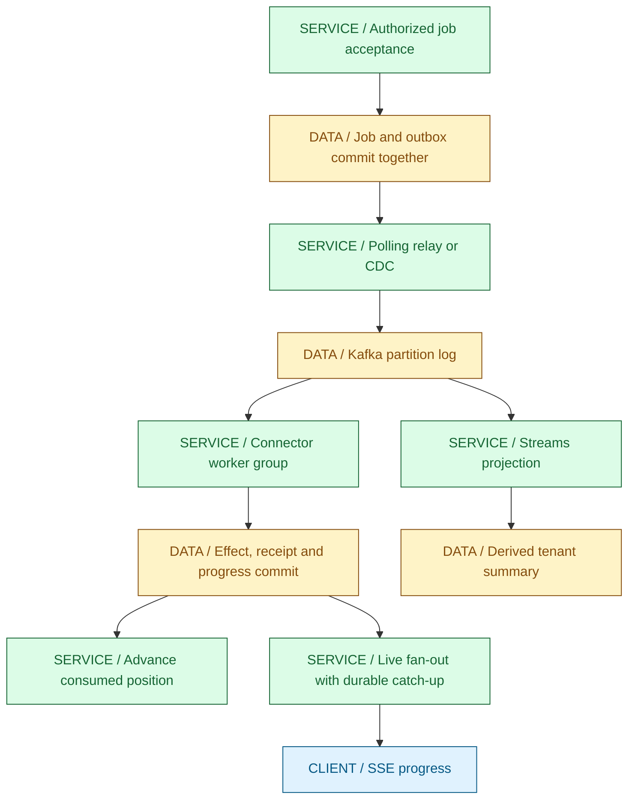
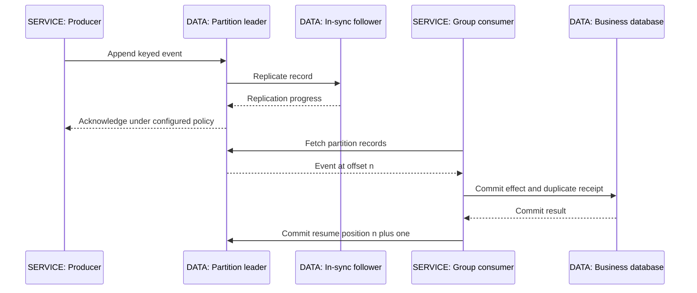
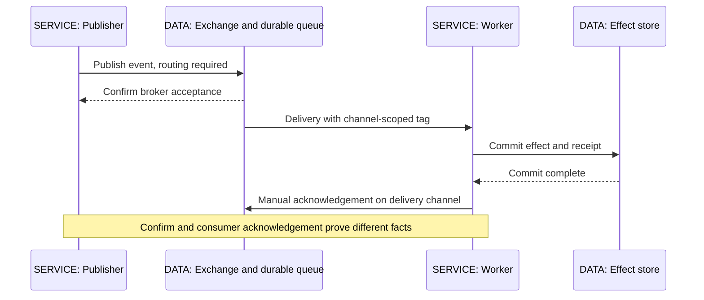
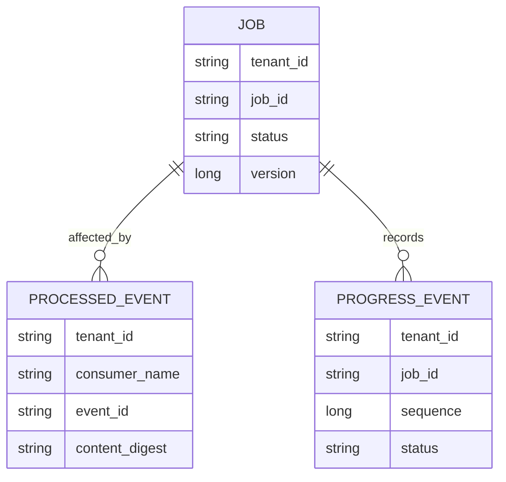
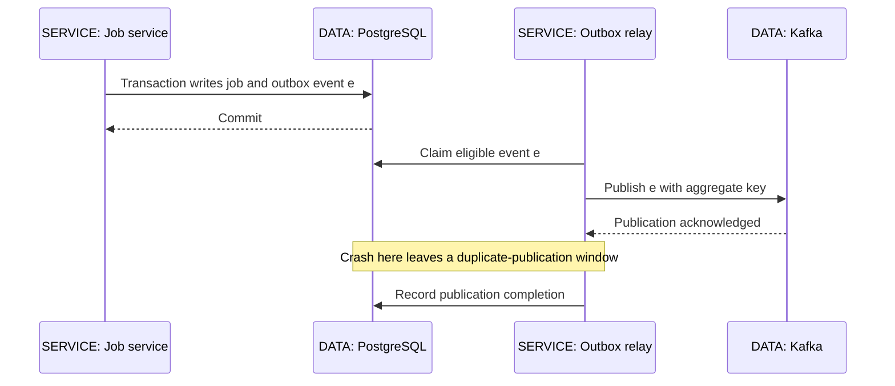
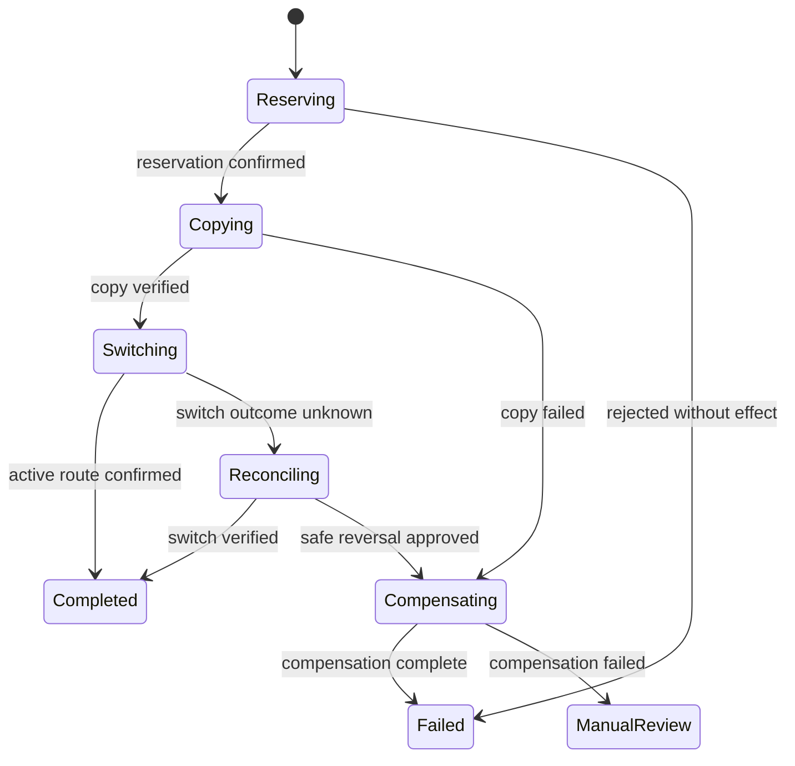
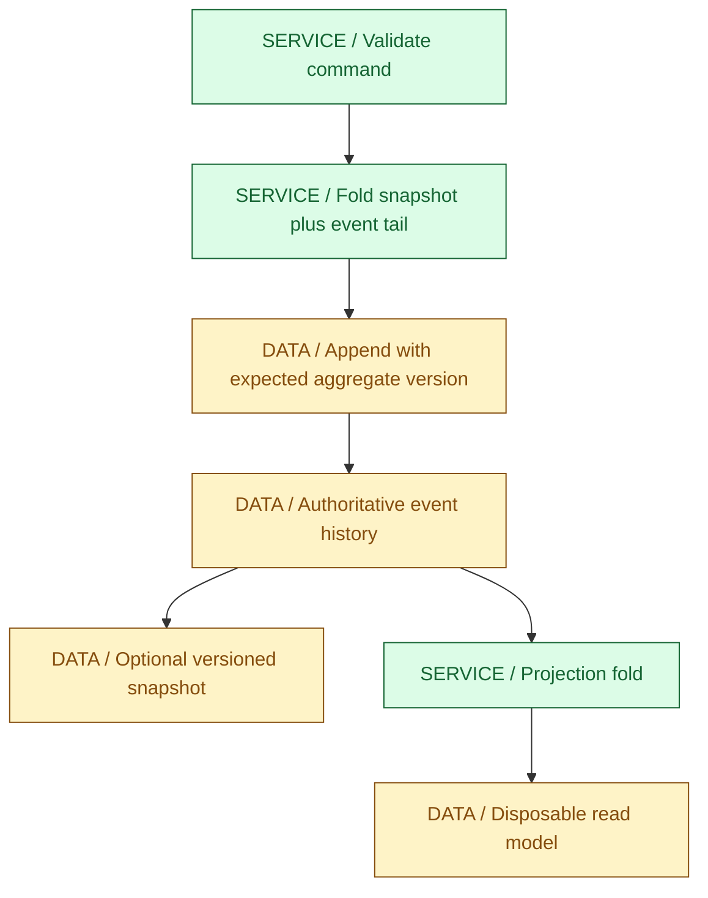
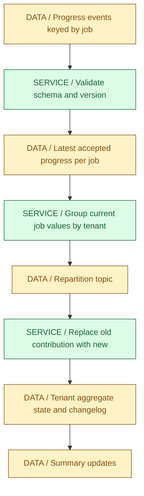
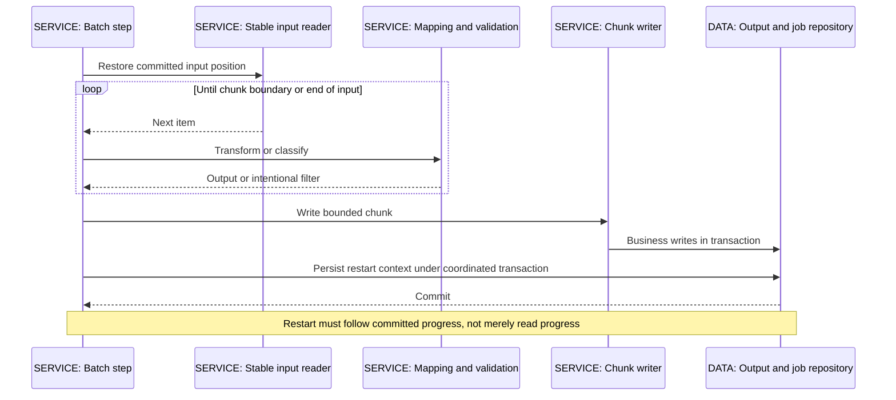

# 07 / Messaging, Batch and Streams

**Moving a message is not the same as completing its effect.** IntegrationHub has already committed a sync job when the API returns 202. Publication may still be pending, a worker may repeat an attempt, and the browser may miss a progress notification. This chapter connects those gaps with durable intent, explicit ownership and restartable work. IntegrationHub is fictional; its design is an instructional example, not a description of a real company's deployment.

**Version assumptions:** Java 21, the previously checked Spring Boot 4.0.x / Spring Cloud 2025.1.x family, PostgreSQL 17, Kafka 4.x and Kubernetes 1.34. Kafka 4.0 documentation is the versioned mechanism reference here, not a recommendation to install an old patch. Spring Batch's current reference describes the 6.x generation; its builder and repository APIs must not be mixed indiscriminately with older tutorials. RabbitMQ acknowledgements are discussed for AMQP 0-9-1; RabbitMQ Streams is a distinct option, not the queue model described below. Debezium's stable documentation is a moving reference.

**[VERIFY: check the actual Boot-managed Spring Kafka, Kafka client and Spring Batch versions, broker compatibility, RabbitMQ queue policies and Debezium connector compatibility before choosing artifacts. Kafka 4.0 Streams, current Batch domain, RabbitMQ confirms and Debezium outbox-router documentation were consulted, but dependencies were not resolved and no broker or framework ran.]**

**Execution status:** NOT EXECUTED. The local runner checked for an existing JDK and found no compiler. Java and dependency downloads remain unauthorized. The complete Java 21 DeliveryLab under `code/07-messaging/` models four failure scenarios without a broker or database. Its assertions have not run. There are no fabricated broker logs, throughput results, SQL traces or framework outputs in this chapter.

## Big Picture

The first transaction establishes accepted work, the consumer transaction establishes a local business effect, and the offset records how far the consumer can safely resume. They are separate facts. Streaming projections and browser notifications are downstream views; their delivery does not define whether the underlying job committed.

## What You Will Be Able to Explain

- Trace a Kafka record through partition selection, broker acknowledgement, consumer ownership, business commit and offset advancement.
- Contrast Kafka's retained log with RabbitMQ queues without pretending either product has only one messaging model.
- State what at-most-once, at-least-once and exactly-once mean at a named boundary.
- Implement the transaction boundary behind an idempotent database consumer and explain why external API effects need a different contract.
- Compare polling outboxes with log-based CDC, including duplicates, ordering, cleanup and replication-slot failures.
- Design a saga with compensations and unresolved outcomes rather than imaginary distributed rollback.
- Separate event sourcing from CQRS, and justify when neither is worth its operational cost.
- Explain KStream, KTable, windows, local state, repartitioning and the scope of Kafka Streams transactions.
- Design a restartable Spring Batch job with stable input identity, checkpoints, bounded skip/retry policies and disjoint partitions.

> [!PRODUCTION]
> **Where this lives in IntegrationHub.** [03's service transaction](03-spring.md#ch03-spring), [04's persistence layer](04-jpa.md#ch04-jpa) and [06's database](06-databases.md#ch06-databases) commit the job with publication intent. [05](05-apis-realtime.md#ch05-apis-realtime) owns HTTP retry identity and SSE recovery; this chapter owns the next delivery boundaries. [13](13-integration.md#ch13-integration) supplies connector input contracts, [26](26-data-platform.md#ch26-data-platform) consumes analytical changes, and [18](18-operations.md#ch18-operations) watches event age, failed work and recovery. Tenant authorization and payload protection remain [08's responsibility](08-security.md#ch08-security) even on internal topics.

## 1. Commands, Events, Batch and Streams

Messaging decouples when one participant can produce work from when another can execute it. That is useful for burst absorption, independent deployments and replay. It also replaces an immediate answer with another operational obligation: someone must track unfinished work and tell the caller what eventually happened.

A **command** asks an owner to do something and can be rejected: StartSync is a request. An **event** reports an accepted fact: SyncRequested or SyncCompleted. A fact may lead several independent consumers to act, but those actions are not part of the original fact's transaction. Do not call an event Completed if the only thing known is that a command was placed in a queue.

**Event-driven** describes what triggers work. **Batch** describes bounded input and a completion boundary. **Stream processing** describes incremental computation over continuing input, often with state and time. A file-arrival event can launch a batch job; a stream can continuously aggregate events emitted by batches. These are compatible dimensions, not three competing brands of middleware.

| Approach | Use when | Avoid when |
|---|---|---|
| Synchronous call | A caller needs a bounded answer now and can handle dependency failure | Long work keeps an HTTP connection and database transaction open |
| Event-driven worker | Durable accepted work can finish asynchronously | Nobody owns completion status, retries or unresolved work |
| Batch | A named input set has a finite reconciliation or import result | The product needs continuous low-latency updates from unbounded input |
| Stateful stream | Updates must continuously maintain aggregates, joins or alerts | A periodic SQL query already meets freshness and cost requirements |

For IntegrationHub, a tenant submits a command over HTTP, the database records acceptance, an outbox event dispatches it, and a worker may execute a bounded import as a batch. A separate stream maintains operational summaries. The same business journey uses all four mechanisms without giving them the same guarantee.

**Interview checks:** basic: command requests, event records. Internals: publication and reaction are different transactions. Debug: a job stuck at accepted needs an owner at each downstream boundary. Scenario: a nightly reconciliation is still batch even if a message launches it.

## 2. Kafka: Partitions, Replication and Consumer Ownership

Kafka retains records in ordered partition logs. A record has a topic, partition and offset; the offset is a position within that partition, not a global sequence or business event identity. Consuming a record does not delete it. Retention or compaction governs how long it remains available, so different consumer groups can process the same history independently.

The producer serializes a key and value, selects a partition, batches records and sends them to the partition leader. Followers replicate the leader's log. The producer receives an acknowledgement according to its configuration; failure to receive one leaves the producer uncertain whether an append occurred. Producer retries and idempotence address this protocol-level uncertainty, not every possible duplicate application submission.

`acks=all` works with the in-sync replica set and the configured minimum in-sync replicas. It does not mean every replica ever assigned to the partition is online and has acknowledged. A replication factor names intended copies; a minimum ISR requirement determines when the broker should refuse a write rather than accept it with too little replication. Availability and durability are a deliberate trade during a failure.

For ordinary partition-assigned consumer groups, one consumer owns a partition at a time within a group. Extra consumers beyond the available partitions cannot increase this group's partition parallelism. Another group receives its own assignments and offsets, which is how a search projector and a job worker can both read the same event without stealing it from each other. This explanation is not the newer share-group consumption model.

A rebalance transfers ownership after membership or assignment changes. The old owner may still have application work in progress, so merely changing the broker assignment does not undo that work. Stop handing revoked work to new tasks, coordinate in-flight completion and use idempotent effects or fencing for stale work. Never share a KafkaConsumer across arbitrary worker threads as if it were a concurrent queue.

**Offset commitment follows the completed prefix.** If offsets 10 and 12 finished but 11 is still running, committing position 13 can skip 11 after a crash. A parallel consumer must track per-partition completion and advance only across a contiguous completed prefix. Committing an offset says nothing about an unrelated transaction unless the application arranged that relationship.

| Choice | Use when | Avoid when |
|---|---|---|
| Key by tenant and job | Per-job partition order matches the invariant | A single hot job's throughput requirement exceeds one ordered lane |
| Separate consumer group per function | Workers, projections and auditing independently need the event | A new group is created accidentally on every restart and reprocesses history |
| More partitions | Measured partition parallelism is the limit | A downstream database or provider quota is already saturated |
| Log compaction | A keyed latest-state changelog can rebuild a table | Every historical transition must remain recoverable forever |

Compaction is asynchronous. Multiple values for a key can coexist until cleaning, and tombstone retention matters to consumers that have been offline. It is not immediate deduplication or a substitute for an audit retention policy. Time/size retention can remove records before a lagging consumer reaches them; replay is conditional on retained data.

**[VERIFY: verify producer idempotence constraints, acks/min.insync.replicas interactions, unclean leader election, compaction/tombstone retention, group protocol and rebalance configuration against the selected Kafka 4.x broker and client. This section describes ordinary partition-assigned groups, not share groups; no failover or rebalance test ran.]**

**Interview checks:** basic: order belongs to a partition. Internals: producer acknowledgement is not consumer completion. Debug: adding consumers cannot fix a hot partition. Scenario: parallel processing must commit the completed prefix, not the largest offset observed.

## 3. RabbitMQ: Routing, Confirms and Acknowledgements

RabbitMQ's AMQP queue model separates routing from consumption. Producers publish to an exchange; bindings route messages to queues; consumers compete for deliveries from a queue. A direct exchange routes by exact binding keys, a topic exchange uses patterns, and a fanout exchange routes to its bound queues. Independent subscribers normally need independent queues. Several consumers on one queue divide work rather than each receiving every message.

The publisher's confirm answers whether the broker accepted the publication under the queue's durability rules. A consumer acknowledgement says the consumer considers a delivery handled. The official confirms guide explicitly treats them as independent. A publisher confirm cannot establish that a worker wrote PostgreSQL successfully, and an application writing bytes to a socket has not yet received a publisher confirm.

An unroutable publication can be confirmed even though no queue received it. When routing is required, handle returned mandatory publications or a deliberate alternative-routing policy as well as confirms. Queue durability, message persistence, replication and confirms must be designed together; a durable queue name alone does not prove that a particular message survived a crash.

Manual acknowledgement allows redelivery when a consumer disconnects with unfinished work. Automatic acknowledgement trades away that recovery point. Delivery tags are scoped to a channel and must be acknowledged on the channel that supplied them; they are not stable deduplication IDs. Use an application event ID that survives reconnection.

Prefetch bounds outstanding unacknowledged deliveries under the configured consumer/channel scope. It prevents one fast network reader from building an unlimited local backlog, but does not bound every queue in the application. An executor added after delivery still needs its own admission policy. A high prefetch can also concentrate work on a slow consumer; tune from payload size, service time and capacity rather than copying a universal number.

| Model | Use when | Avoid when |
|---|---|---|
| RabbitMQ queues | Routing and competing task consumers fit the work | You assume acknowledged queue deliveries remain an indefinitely replayable log |
| Kafka partition log | Independent groups need retained replay and partitioned processing | Topic partitioning and retention cost buy no value for the task |
| RabbitMQ stream model | Retained-log semantics fit an existing RabbitMQ platform | Queue assumptions are copied without checking the stream protocol |
| Manual ack plus bounded prefetch | Consumer effects must survive redelivery safely | Acknowledgement happens when work is merely submitted to an executor |

**[VERIFY: confirm RabbitMQ queue type, persistence/confirm behavior, mandatory returns, prefetch scope, delivery limits and dead-letter guarantees against the deployed version. The current 4.3 confirms page was consulted; no RabbitMQ deployment or channel test was executed.]**

**Interview checks:** basic: exchanges route and queues hold deliveries. Internals: confirms and consumer acknowledgements are orthogonal. Debug: a confirmed but missing message can be unroutable. Scenario: stable event identity belongs in the message, not the delivery tag.

## 4. Delivery Semantics and the Crash Matrix

The labels at-most-once and at-least-once describe a boundary and a failure model. A system can be at-least-once from broker to consumer but at-most-once for an external effect if it acknowledges before the provider call. Always say what is being counted: broker records, handler invocations, database updates or customer-visible actions.

At-most-once accepts loss to avoid repeated delivery. At-least-once retries unfinished or uncertain work and therefore permits duplicates, subject to retained data and eventual recovery. Exactly-once effects require atomic state transitions or idempotency at the effect's authority. They do not require that every instruction physically execute only once.

| Crash boundary | Durable fact left behind | Recovery obligation |
|---|---|---|
| Before acceptance transaction commits | No accepted job or outbox event | Retry the request under its API key |
| After acceptance commit, before relay runs | Job plus publication intent | Relay must resume unpublished intent |
| After publish, before relay records success | Broker may already hold the event | Republish same event ID; consumer handles duplicates |
| Before consumer database commit | No effect or durable receipt | Redeliver and retry the whole local unit |
| After consumer commit, before offset or ack | Effect and receipt already exist | Redelivery observes receipt and does not repeat effect |
| After ack, before business effect | Broker considers work handled, effect missing | Lost work; change the acknowledgement order |
| After provider effect, before response arrives | External outcome unknown | Query, reconcile or retry with the same provider key |

The forbidden shortcut is to solve the duplicate window by moving the acknowledgement earlier. That exchanges visible duplicates for silent loss. IntegrationHub commits local effects first, acknowledges afterward and makes redelivery safe. It cannot atomically commit an HTTP provider's internal state with its own PostgreSQL transaction, so provider-side keys and reconciliation remain necessary.

> [!MECHANISM]
> **The safe gap is after the effect and before the acknowledgement.** A crash there repeats delivery but can be neutralized by an atomic receipt. Reversing the order creates a gap where the broker has forgotten work that never happened.

| Guarantee | Use when | Avoid when |
|---|---|---|
| At-most-once | Loss is explicitly acceptable for disposable samples | Accepted jobs or money movement can disappear |
| At-least-once plus idempotent effect | A local authority can atomically recognize repeated intent | Duplicate detection is an in-memory cache that vanishes on restart |
| Kafka transactional processing | Input offsets and Kafka outputs form the unit | An unrelated database write is assumed to join the Kafka transaction |

**Interview checks:** basic: repeated delivery does not have to mean repeated effect. Internals: enumerate the commit/ack crash gap. Debug: missing work often comes from early acknowledgement. Scenario: name the external authority before claiming exactly-once.

## 5. Idempotent Consumers and Ordering

A durable idempotent consumer keys a receipt by tenant, consumer function and event identity. Consumer function matters: the search projection must still process an event already handled by the progress worker. The receipt and local business effect must commit together, under a unique constraint that arbitrates concurrent duplicates.

The application opens a transaction, tries to reserve the scoped event ID, applies the valid state change, writes progress or next publication intent and commits. A duplicate key means inspect the prior receipt, including a content binding when required, rather than apply the effect again. If anything fails before commit, the reservation must roll back too. Marking a receipt in a separate first transaction can suppress work that never completed.

The drawing omits physical keys for readability; the schema needs explicit tenant-scoped constraints. An event receipt is not an authorization decision. Validate topic access, event provenance, tenant ownership, schema and allowed state transition before mutating state. Never trust a tenant header merely because the message came from an internal broker.

Retention is part of duplicate safety. If receipts expire before retained messages, a replay of old history can repeat previously committed effects. Either retain identities for the replay horizon, make the operation naturally idempotent, or rebuild a separate projection with a new consumer identity. A replay into a fresh search index is different from replaying customer notifications or external mutations.

**Ordering requires more than a key.** A consistent tenant/job key routes related events to one partition while the partitioner and partition count remain compatible. Multiple producers can still append logically later events before earlier ones. Increasing partition count can change where a key maps. Concurrent handlers and retry topics can reorder completion even when the log order is correct.

Give events an aggregate version where order affects validity. A receiver can reject or park a gap, ignore an obsolete version when the operation is a monotonic state replacement, or reconcile from authority. Do not discard a gap blindly for noncommutative deltas. Adding 5 and then subtracting 5 may commute numerically, but validating a quota or sending a terminal notification usually does not.

| Strategy | Use when | Avoid when |
|---|---|---|
| Atomic receipt plus effect | Local transactional writes face duplicates | Receipt is committed separately or deleted before possible replay |
| Versioned state replacement | Newer authoritative state supersedes older notifications | Intermediate deltas or transitions must all be applied |
| Serial processing per key | Ordered noncommutative changes are essential | Unrelated tenants are forced through one global bottleneck |
| Park gaps and reconcile | Missing earlier state makes current application unsafe | Parking has no timeout, owner or repair process |

**Interview checks:** basic: receipt scope includes the consumer. Internals: uniqueness and effect share one transaction. Debug: receipts without effects expose a split commit. Scenario: event ordering, handler ordering and effect ordering are separate questions.

## 6. Transactional Outbox and Log-Based CDC

The dual-write problem is simple: a service updates PostgreSQL and publishes Kafka, but neither ordinary local transaction covers both. Publish first and a rollback can create a nonexistent fact. Commit first and a crash can leave a real fact without notification. The outbox replaces the second write with publication intent in the same database transaction as the business update.

A polling relay repeatedly discovers eligible rows, claims a bounded set, publishes with stable event IDs, waits for the relevant broker result and marks progress. Claiming prevents uncontrolled duplicate simultaneous work but cannot remove the publish/mark crash gap. Use short claims or leases with a recovery rule; do not hold a database transaction across arbitrary broker delays by accident.

Auto-increment IDs are not universal commit-order cursors. One transaction can allocate a lower ID, stall and commit after a transaction with a higher ID. A relay that permanently advances a high-water mark past the uncommitted lower ID can miss it. Poll an explicit unpublished state with a correct claim protocol, or use a committed-log position rather than assuming identity allocation establishes commit order.

**CDC changes the relay, not the need for intent.** Debezium can read committed database log changes and apply an outbox event router to explicit outbox inserts. The consulted router documentation uses event ID for identity and aggregate ID as the message key. This reduces polling and preserves a domain publication contract without broadcasting every internal table change as a public event.

Raw table CDC is useful for replication and projections, but a row update is not automatically a domain event. Renaming a column should not accidentally change a partner's business contract. The outbox allows the service to choose event type, schema version and safe payload while CDC handles extraction. Do not simultaneously run an uncoordinated polling publisher and CDC publisher over the same records during migration.

CDC introduces a real operational system: source permissions, replication slots, connector offsets, snapshots, schema history, serialization, routing and recovery. A stopped consumer can retain WAL until the primary runs out of disk. Deleting a slot to free space can destroy the resume position and require a resnapshot. The database may recover while the downstream projection remains behind; monitor both.

| Relay choice | Use when | Avoid when |
|---|---|---|
| Polling outbox | Volume is modest and an application-owned relay is easier to operate | Poll scans, latency or claim contention dominate |
| CDC over explicit outbox | Reliable log extraction and domain events justify connector operations | No team owns slots, offsets, snapshots or schema compatibility |
| Raw-table CDC | A derived view intentionally follows storage changes | External business contracts become coupled to private tables |
| Direct database-plus-broker dual write | Only if loss/inconsistency is explicitly acceptable | Both writes are presented as one atomic accepted fact |

**[VERIFY: check Debezium outbox-router insert/update/delete handling, snapshot behavior, connector offset recovery, publication ordering and PostgreSQL slot retention against pinned connector versions. The stable router reference was consulted; no CDC connector, cleanup policy or migration was executed.]**

**Interview checks:** basic: the outbox persists intent with the fact. Internals: CDC can publish the outbox without replacing it. Debug: a growing slot can endanger the primary. Scenario: a monotonically allocated ID is not proof of commit order.

## 7. Retries, Dead Letters and Replay

Retries recover transient failures, but repeated work consumes capacity and can prolong an outage. Classify failures before choosing a policy. A temporary connection loss may be retryable; an unsupported schema version may require deployment; a permission failure may need operator action; an invalid business transition may be terminal. Retrying them all indefinitely destroys the distinction.

A bounded retry policy specifies attempts, elapsed-time budget, backoff with jitter, destination isolation and what happens at exhaustion. The retry must preserve event identity. Creating a new business event ID for every delivery attempt defeats duplicate detection and makes one logical operation appear to be many independent ones.

A DLQ or quarantine is a durable record of unresolved processing, not proof of success. Store original identity and source position, sanitized failure class, attempt metadata and a repair/replay decision. Keep payload access controlled; dead-letter topics often contain the most malformed and sensitive input in the system. Replay needs authorization and an audit trail, with a preview of which side effects will repeat.

Moving a poison record aside and advancing the main offset changes ordering semantics. If later events require that record's effect, they cannot safely continue just because the queue has somewhere to put it. For independent events a retry topic can preserve overall throughput; for ordered aggregates, park that key or partition and provide a recovery path.

| Policy | Use when | Avoid when |
|---|---|---|
| Short in-place retry | A transient issue fits the poll/deadline budget | Long blocking causes consumer reassignment or stalls unrelated work |
| Delayed retry destination | Independent events can overtake the failed event | Strict aggregate ordering is assumed unchanged |
| Quarantine with repair | Bad input or missing support needs a human or deployment | It becomes a silent sink with no owner or age alert |
| Stop the affected ordered lane | Proceeding could corrupt an invariant | A global halt is used for isolated tenant failures |

**[VERIFY: validate Spring Kafka retry and dead-letter publication acknowledgement behavior, offset handling on failed recovery, and RabbitMQ dead-letter delivery safety for the chosen queue policies. A configured DLQ is not automatically an atomic transfer; no fault-injection test of either framework ran.]**

**Interview checks:** basic: DLQ means unresolved, not completed. Internals: the transfer to a recovery destination has a failure boundary. Debug: rapid requeue loops are often misclassified permanent failures. Scenario: replay only after defining ordering and duplicate effects.

## 8. Sagas: Local Transactions With Business Compensation

A saga coordinates a business operation across owners without pretending there is one database transaction. Each participant commits a local step and emits the result; the workflow continues or requests a compensating business action. Compensation is not time travel. Revoking a temporary reservation may undo its business meaning, but it does not unsend a notification or erase an audit record.

For a connector migration, IntegrationHub might reserve capacity, prepare a destination, copy data and switch active routing. Failure before switching may allow temporary capacity release and destination cleanup. Failure after switching may require a controlled reverse migration or manual intervention, not a blind delete. The workflow must define which steps are reversible and which are points of no simple return.

An orchestrator owns durable workflow state, correlates replies, issues commands and schedules timeout/recovery. Choreography lets participants react to events without one central workflow component. Neither removes coordination complexity. Choreography distributes it across handlers; orchestration concentrates it in an explicit state machine with an operational owner.

Messages need saga ID, step identity and attempt correlation. A stale reply to an earlier attempt must not advance the current state. Step execution and compensation are themselves idempotent, and a timeout creates an unknown outcome until the participant can be queried or reconciled. Saga state changes and next commands should use local transactions and outbox publication just like ordinary domain changes.

| Approach | Use when | Avoid when |
|---|---|---|
| Orchestration | Many steps, deadlines and compensation paths need visible ownership | The orchestrator takes over participants' internal domain rules |
| Choreography | Few reactions remain understandable and independently useful | Event chains hide cycles, deadlines and responsibility for completion |
| One local transaction | The invariant belongs to one owner and store | Services are split solely to demonstrate a saga |

Sagas do not provide isolation across their whole lifetime. Other work can see intermediate states. Model reservations, pending status, escrow or semantic locks where needed; a compensation later does not prevent another transaction from acting on an intermediate fact now. [22](22-distributed.md#ch22-distributed) compares this with two-phase commit, while [27](27-payments.md#ch27-payments) gives money-specific examples.

**Interview checks:** basic: compensation is a business operation. Internals: intermediate states are visible. Debug: a timed-out participant may still have succeeded. Scenario: durable reconciliation belongs in the state machine, not in an exception log.

## 9. Event Sourcing: History Becomes Authority

Ordinary event-driven services store current business state and publish selected changes. Event sourcing makes the accepted event history the authoritative representation. Current aggregate state is obtained by folding those events; a snapshot accelerates the fold but is not a replacement for history unless the retention contract deliberately changes.

For a connector configuration, a command handler loads the aggregate's events or a snapshot plus tail, checks the command against current state, derives new events and appends them with an expected aggregate version. The expected-version check prevents two commands that both read version 8 from both appending incompatible version-9 transitions. After one succeeds, the other must reload and re-evaluate; blindly retrying the append preserves the wrong decision.

Events record accepted facts, not current implementation objects. Include aggregate identity, event identity, version and enough information to interpret the fact later. A historical amount or decision cannot depend on looking up today's exchange rate or today's mutable connector rules during replay. Persist relevant inputs or accepted results, and make the reconstruction rules explicit.

Schema evolution lasts as long as history. Removing an old event class does not remove the old bytes. Version readers, upcasters or explicit migration strategies must reconstruct old histories under new code. Test representative historical streams and snapshots; a test that creates all events with today's classes never exercises compatibility.

Reconstruction must not repeat external side effects. Folding EmailRequested should reconstruct the fact that a request existed, not send another email whenever an aggregate loads. Keep side-effect dispatch separate, with its own durable identity. Replaying a projection into a fresh table is different from executing a workflow against live providers.

An append-only log complicates data deletion and secret rotation. Avoid storing secrets and unnecessary personal data in long-lived immutable events; use controlled references and retention strategies. Whether deletion, anonymization or cryptographic erasure satisfies an obligation is a security/legal decision, not a guarantee supplied by event sourcing. [08](08-security.md#ch08-security) owns that review.

| Choice | Use when | Avoid when |
|---|---|---|
| Event sourcing | Historical decisions, temporal reconstruction and auditability justify permanent event governance | Ordinary CRUD and audit records meet the requirement |
| Current state plus outbox | Transactional writes and integration events are enough | Complete history reconstruction is promised but transitions were never retained |
| Snapshots | Replaying long aggregate histories costs too much | Snapshot state/version is assumed compatible after arbitrary code changes |

IntegrationHub does not event-source every job by default. A job table, progress events and audit trail are easier to query, repair and retain for the baseline. A later domain that truly needs reconstruction may make a different decision; event sourcing is a persistence choice, not a prerequisite for using Kafka.

**Interview checks:** basic: authoritative events distinguish event sourcing from event publication. Internals: expected-version append protects aggregate decisions. Debug: replay invoking provider calls reveals a mixed responsibility. Scenario: retain the simpler current-state model unless history is a first-class requirement.

## 10. CQRS and Projection Recovery

CQRS separates the write model from read models. It can be as small as different command and query objects over one database, or as large as independent materialized stores. It does not require separate services, asynchronous delivery, event sourcing or Kafka. Those are optional implementation choices with additional failure modes.

IntegrationHub writes jobs under transactional invariants but serves a search screen from a denormalized projection. A projector reads events, applies an idempotent update and checkpoints its progress. The projection is eventually consistent, so a just-created job may not appear immediately. The UI can use the write-side status resource until the projection reaches a known version, rather than claiming that missing search results mean failed acceptance.

Projection rebuild is a controlled migration. Choose the input history or a consistent snapshot plus change position, create a new destination, replay with bounded resources, catch up, compare invariants and switch read traffic. Keeping the old destination briefly makes rollback possible. Clearing the live index and hoping replay finishes before users notice is not an availability plan.

The input must be sufficient. A compacted topic containing only latest values cannot reconstruct every historical analytical result. An expired retention window cannot rebuild a projection that depends on lost deltas. A database snapshot taken at one position and a change stream resumed after a later position has a gap; resumed too early, it has overlap that needs idempotent application.

| Read/write separation | Use when | Avoid when |
|---|---|---|
| Separate query DTOs over one store | Read shape differs but strong freshness and simple operation matter | Extra services are added with no distinct scale or ownership need |
| Asynchronous materialized view | Expensive reads and search can tolerate defined lag | The read decides a write invariant using stale projected state |
| Event-sourced aggregate plus projections | Full reconstruction is genuinely required | CQRS is used as an excuse to mandate event sourcing everywhere |

**Interview checks:** basic: CQRS and event sourcing are independent. Internals: projection recovery needs a complete input and checkpoint contract. Debug: projection lag is not source data loss. Scenario: enforce command invariants at the write authority, not a stale search view.

## 11. Kafka Streams: Records, Tables and Topology

Kafka Streams is a library embedded in an application, not a separate broker-side computation engine. Instances sharing an application identity cooperate over partition-based tasks. The topology describes sources, transformations, stateful operations and sinks; deployment still needs CPU, memory, disk, monitoring and a shutdown/rebalance policy.

A **KStream** treats each record as an occurrence. If two records for a job report processed totals 10 and 20, summing those records yields 30, which is wrong when they were cumulative values. A **KTable** treats keyed updates as replacement state. The latest total becomes 20; downstream table aggregates must account for replacement rather than counting every update as an independent fact.

Stateless operations such as filter and a value-only mapping need no remembered history for their result. Aggregates, deduplication, joins and windows need state. Changing a key is not itself sufficient to colocate records for later keyed computation: records must be redistributed so all values for the new key reach the correct task.

The topology deliberately models cumulative progress as current keyed state. Updates that arrive with older application versions need an explicit policy before becoming the latest table value. A conventional unversioned KTable does not automatically know which business version is authoritative merely because a payload contains a version field.

Stream-table enrichment normally uses table state available under the selected join/store semantics when the stream event is processed. That is not automatically a historical as-of join against the configuration valid when the event occurred. Versioned stores and timestamp-aware joins can address particular cases, but need retained versions and tested late-update semantics. Never casually attach today's tenant classification to yesterday's billing events and call it historical truth.

| Abstraction | Use when | Avoid when |
|---|---|---|
| KStream | Every record is an occurrence such as a completed item | Cumulative snapshots are summed as independent deltas |
| KTable | Each key represents replaceable current state | Every historical transition must be kept by the table alone |
| GlobalKTable | A reasonably small reference table should be available on every instance | Replicating a large dataset to every process is unaffordable |
| Stateless pipeline | Each record can be transformed independently | Hidden local mutable maps quietly create nonrecoverable state |

**Interview checks:** basic: record occurrence and table replacement differ. Internals: grouping by a changed key requires repartitioning where locality is needed. Debug: totals doubling after progress updates often reflect the wrong stream/table interpretation. Scenario: define as-of enrichment before choosing a join.

## 12. Windows, Event Time and Late Data

Unbounded input needs a rule for when records belong together. Event time describes when something occurred at the source; processing time describes when this application handles it. Ingestion time records arrival at the broker. A delayed upload can have all three far apart. A dashboard about yesterday's failures should not silently move them into today's total merely because replay happened today.

Tumbling windows divide time into nonoverlapping intervals. Hopping windows overlap and can count one event in several intervals intentionally. Session windows group activity separated by an inactivity gap and may merge when a late event connects sessions. Sliding-window semantics depend on the operation and library; do not substitute a hand-waved timer for the documented boundary rules.

Kafka Streams uses record timestamps and data-driven stream time for window processing. A grace period allows bounded out-of-order arrival relative to window closure. It is not simply a wall-clock sleep after each record, and an idle input may not advance stream time. A far-future timestamp can prematurely make legitimate records appear late, so timestamp validation and monitoring are part of correctness.

| Window policy | Use when | Avoid when |
|---|---|---|
| Tumbling | Disjoint reporting periods match the business question | A rolling interval is required instead |
| Hopping | Overlapping rolling summaries are deliberate | Summing all windows is assumed to count each event once |
| Session | Activity bursts define sessions better than fixed boundaries | Late merges cannot be represented in downstream updates |
| Larger grace | Delayed arrivals are expected and state cost is acceptable | Lower latency and bounded storage requirements are ignored |

Outputs may be provisional updates, not final immutable facts. Downstream consumers need replacement semantics or versioned results. Suppressing intermediate results can wait for closure, but costs buffer capacity and depends on time advancing. If a record arrives after grace, choose whether it is discarded with metrics, quarantined for reconciliation or included by an offline correction process. A dropped late record cannot be recovered by declaring the processor exactly-once.

**[VERIFY: confirm Kafka Streams window boundary, grace, suppression, stream-time advancement and versioned-store join behavior against the exact 4.x API and topology. The 4.0 core-concepts reference was consulted; no late-event or timestamp-skew experiment ran.]**

**Interview checks:** basic: event time and processing time answer different questions. Internals: grace uses stream-time semantics, not an ordinary timer. Debug: future timestamps can make good records late. Scenario: communicate whether a window result is provisional or final.

## 13. State Stores, Repartitioning and Exactly-Once

A state store belongs to stream tasks and may use local persistent storage or memory. Changelog topics enable recovery when configured appropriately. Losing a pod can mean rebuilding local state from its changelog before useful processing resumes; that restoration time belongs in the recovery objective. A standby copy reduces some recovery work but consumes resources and is not a replacement for retained changelog data.

Repartition topics shuffle records after a key change so keyed operations execute with the required locality. They add network traffic, serialization, storage and another recovery boundary. Joining partitioned sources often needs compatible partitioning. A topology that appears to be a few map/group/join calls can create substantial internal traffic, so inspect its described topology and internal topics rather than counting lines of DSL.

The consulted Kafka Streams reference describes exactly-once processing as atomic progress across input offsets, Kafka outputs and recoverable state-store updates. Configure the supported transaction mode, such as `exactly_once_v2` in the referenced generation, and ensure downstream readers honor committed records. Aborted processing can physically run again while only one committed result remains visible under the defined model.

An HTTP request performed inside a processing callback is not rolled back by aborting a Kafka transaction. Neither is an unrelated JDBC commit. Integrate such effects through a separate idempotent consumer/outbox boundary or a sink-specific coordination contract. The transactional guarantee is valuable precisely because its scope is concrete; extending it rhetorically to every side effect makes the design wrong.

> [!TRAP]
> **Exactly-once is not a repair for duplicate business input.** Two separately committed source records with different identities can both legitimately be processed once. If they represent the same business intent, deduplication must use that intent's identity; broker transactions cannot infer it.

| State/guarantee choice | Use when | Avoid when |
|---|---|---|
| Recoverable local store | Low-latency keyed state belongs to partitioned tasks | The local disk is treated as the only durable copy |
| Kafka transaction mode | Kafka input/state/output atomicity matters | HTTP or database effects are assumed included |
| Stateless recomputation | Transformation is cheap and history retained | Aggregation state is discarded without a rebuild budget |
| Separate external-effect consumer | External systems need their own retry/deduplication contract | A callback performs non-idempotent side effects during replay |

Changing application identity, processor names or state schemas can change internal-topic ownership and restore behavior. Deploy topology migrations as data migrations with a compatibility and rollback plan. A reset utility run against a live application can trigger broad reprocessing; it is not a harmless way to clear an error.

**[VERIFY: validate processing.guarantee, transactional IDs/fencing, read_committed consumers, state changelog configuration, standby recovery and topology migration compatibility against the selected Kafka Streams release. Documentation supports the Kafka-scoped guarantee; broker transactions and restore behavior were not tested locally.]**

**Interview checks:** basic: state stores need restoration, not just disk. Internals: repartitioning changes record locality. Debug: a pod that is healthy but restoring state may contribute no processing capacity yet. Scenario: external effects require a separate correctness boundary.

## 14. Spring Batch: Job Identity and Chunk Transactions

Spring Batch makes finite processing operationally explicit. A Job defines a workflow, Steps define its phases, and execution records describe attempts. A JobInstance identifies a logical run through job name and identifying parameters; a JobExecution is one attempt at that instance. Restarting a failed instance creates another execution, not a new business input set.

A timestamp added as an identifying parameter on every launch creates a new instance. That can be useful for intentionally distinct runs, but it is not a way to restart the failed file import from yesterday. Use stable identity such as tenant, immutable object version and mapping version when those define the input contract. Job identity does not select the rows by itself; the reader must actually enforce that selection.

In chunk processing, an ItemReader supplies items, an optional ItemProcessor transforms or filters them, and an ItemWriter writes a chunk. At a commit boundary, business output and restart metadata must be coordinated under the chosen transaction arrangement. A Tasklet step can perform other work without fitting this item-oriented pattern; not every Step necessarily has a reader/processor/writer trio.

The JobRepository persists execution identity, statuses and checkpoint metadata. An ExecutionContext stores restartable state for a job or step. Store compact, serializable positions and input fingerprints, not a whole transient object graph or a live database connection. A reader that claims restart support must reopen the same input and interpret its saved position consistently.

Larger chunks can amortize commit overhead but increase memory, lock duration and rollback/replay cost. Smaller chunks reduce rework but add transaction overhead. Filtering an item intentionally is not the same as skipping an exception; record those counts separately because they answer different reconciliation questions.

| Batch decision | Use when | Avoid when |
|---|---|---|
| Stable identifying parameters | A failed attempt must restart the same logical input | Every retry changes identity and begins again |
| Chunk-oriented step | Bounded item transformations fit repeated commits | One indivisible operation is artificially split into misleading items |
| Tasklet step | A phase is a controlled operation such as preparing a manifest | Unbounded work hides inside one enormous transaction |
| Persistent JobRepository | Restart and operational history must survive processes | In-memory metadata is presented as durable recovery |

**[VERIFY: check Spring Batch 6.x job/repository configuration, builders, transaction managers, execution-context serialization and restart APIs against the Boot-managed version. The current domain reference was consulted; DeliveryLab is not a Spring Batch execution and no Batch schema was created.]**

**Interview checks:** basic: instance is logical identity, execution is an attempt. Internals: a chunk checkpoint describes committed progress. Debug: changing identifying parameters can defeat restart. Scenario: verify input identity along with the saved cursor.

## 15. Restartability, Skip/Retry and Partitioning

Restart is a protocol between input, output and metadata, not a boolean on a job definition. Suppose a writer commits output in one database and the JobRepository records position in another. A crash between those commits can repeat output or skip it depending on ordering. Use a coordinated transaction where supported, or idempotent output and a recovery design that explicitly tolerates overlap. Framework metadata alone cannot make two resources atomic.

A stable file reader needs the immutable file identity and position. A database reader needs a stable selection, ordering and cursor, not offset pagination over a table changing during the run. An API reader needs a provider-supported cursor or snapshot contract and an answer for expired tokens. A job that restarts at line 20,000 in a changed file has not restarted the same job.

Retry transient failures with bounded attempts and elapsed time. Re-run the whole affected transaction after rollback when required; retrying one statement inside an already failed transaction is not generally sufficient. External writes may already have occurred, so a retryable writer must use their idempotency protocol. Business validation failures ordinarily belong in quarantine or explicit rejection, not transient retry.

Skip is a business decision: which records may be omitted, who approves the threshold, and how are missing effects reconciled? A pipeline that completes after skipping half a tenant's data should not show an unqualified successful sync. Preserve sanitized error records with source identity, make skip thresholds explicit, and surface a completed-with-errors result if the contract permits partial completion.

Partitioning splits finite input into disjoint ranges or manifests, each with its own checkpoint. A coordinator tracks completion of those partitions. Parallelism is bounded by the database, provider quota, connection pool and repository contention. Do not share a stateful non-thread-safe reader across workers merely because it is a Spring bean. Distinguish partitioning input from remote chunking, where a manager distributes chunks to remote writers and must handle delivery and completion coordination.

| Recovery choice | Use when | Avoid when |
|---|---|---|
| Retry | Failure is transient and repeated effects are safe | Validation defects or unknown external outcomes are blindly repeated |
| Skip plus quarantine | Product rules permit partial completion with reconciliation | A green status conceals missing data |
| Fail and resume | Further work is unsafe or a threshold was exceeded | Operators must infer the failed input from logs alone |
| Disjoint partitions | Work is independently addressable with durable per-partition progress | Ranges overlap or a shared cursor races across threads |

**[VERIFY: verify Spring Batch retry/skip defaults, rollback classification, reader thread safety, partition restart behavior and JobRepository/business transaction coordination for the selected release and resources. No framework fault-injection, remote partitioning or API-cursor restart ran.]**

**Interview checks:** basic: restart needs stable input. Internals: output and checkpoint must agree across crashes. Debug: missing rows can be a moving input set, not a bad counter. Scenario: partial success requires an explicit data-quality contract.

## 16. IntegrationHub Operations and Lab Review

A useful messaging dashboard follows work age through the whole pipeline. Monitor the oldest unpublished outbox item, relay errors, consumer lag by partition, age of oldest unfinished business work, retry/quarantine age, state-store restoration, and batch checkpoint advancement. Low broker lag with a full application executor means work moved into memory, not that it completed. Count accepted, completed, rejected and unresolved work under a reconcilable identity model.

One Kafka consumer group is not a broadcast mechanism to every SSE node. In the baseline, worker events update durable progress, then a live backplane routes notifications to nodes with interested subscribers. Redis Pub/Sub can serve ephemeral live fan-out but supplies no durable replay. A dropped notification is recovered from the durable progress cursor as [05](05-apis-realtime.md#ch05-apis-realtime) specifies. Sticky routing may reduce routing complexity but does not survive a node loss or provide missing history.

> [!DECISION]
> **Separate work distribution from notification fan-out.** A worker group divides durable processing. Browser nodes need notifications for their local subscribers, possibly on several nodes for one job. Use routing or broadcast deliberately, and keep recovery in the durable store.

Trace context crosses publication and consumption as explicit metadata; request-thread context does not automatically follow a record through a broker. Use safe correlation IDs, bounded metric labels and sanitized failures. Event IDs and tenant IDs are useful for restricted diagnostics but can create unbounded time series if used as every metric's label. [18](18-operations.md#ch18-operations) owns the full telemetry design.

### DeliveryLab: Four Arranged Failures

The complete saved source is `code/07-messaging/DeliveryLab.java`. The Windows PowerShell runner is `& './docs/java-fs-guide/code/07-messaging/run.ps1'`, from the workspace root; it requires no administrator rights and performs no download. It accepts `-JdkHome` for an existing Java 21-or-later installation. The actual compiler preflight reported NOT EXECUTED.

The model copies candidate receipts and totals, then replaces one immutable State under synchronization. Throwing before that replacement leaves receipts, totals and checkpoint unchanged; throwing after it models a committed effect with a lost acknowledgement. This is a local teaching commit point, not disk persistence, SQL isolation or a broker transaction. The process does not actually crash, and none of its assertions has been evaluated here.

| Probe | Intended assertion | Not demonstrated |
|---|---|---|
| Failure before local commit | Receipt, effect and checkpoint all remain absent; retry applies once | PostgreSQL rollback or JDBC transaction wiring |
| Failure after commit, before ack | Broker position is unchanged; redelivery does not repeat the effect | Kafka offset commit, RabbitMQ redelivery or process recovery |
| Scope and content binding | Tenant and consumer identities differ; changed content is rejected without advancing | Authorization, cryptographic digests or distributed uniqueness |
| Chunk restart | Failed chunk leaves old position; committed prefix selects remaining input | Spring Batch metadata, reader reopening or two-database coordination |

The single checkpoint models one ordered lane. It is not a vector of offsets for multiple partitions, and its callers intentionally supply monotonic positions. Do not generalize the toy API into production code without lifecycle, retention, validation, storage and concurrency tests. The complete state copies also make it unsuitable as a large in-memory store; their purpose is to expose the commit boundary clearly.

Real validation should kill processes before and after database commits, disconnect broker acknowledgements, force a rebalance during slow processing, replay duplicate identities concurrently against a unique constraint, fail dead-letter publication, restore stream state, and restart a batch against immutable input. Assert durable effects, not merely handler invocation counts. [19](19-testing.md#ch19-testing) owns that environment once dependencies are available.

> [!INTERVIEW]
> **A precise answer names five things:** event identity, ordering scope, commit point, acknowledgement point and recovery owner. If any one is missing, a claim about reliable messaging is probably hiding its hardest failure case.

## Explained-Here Index and Sources

| Concept | Explanation |
|---|---|
| Commands, events, batch and streaming | [Processing models](#ch07-models) |
| Kafka partitions, groups, offsets and replication | [Kafka mechanics](#ch07-kafka) |
| RabbitMQ routing, confirms, ack and prefetch | [Queue mechanics](#ch07-rabbitmq) |
| At-most-once, at-least-once and effect guarantees | [Crash boundaries](#ch07-delivery) |
| Idempotent consumer and business ordering | [Receipts and versions](#ch07-idempotent) |
| Outbox, CDC and Debezium | [Durable publication](#ch07-outbox) |
| DLQ, retry and replay | [Recovery policies](#ch07-retries) |
| Saga and compensation | [Workflow state](#ch07-sagas) |
| Event sourcing | [Authoritative history](#ch07-event-sourcing) |
| CQRS | [Read models and rebuilding](#ch07-cqrs) |
| Kafka Streams, KStream and KTable | [Topology semantics](#ch07-streams) |
| Windowing and late data | [Time semantics](#ch07-windows) |
| State store, repartitioning and exactly-once | [State and transactions](#ch07-state-stores) |
| Spring Batch, chunk and job repository | [Batch identity](#ch07-batch) |
| Restartability, skip/retry and partitioning | [Batch recovery](#ch07-restart) |

Consulted on 2026-10-06: [Kafka 4.0 Streams core concepts and processing guarantees](https://kafka.apache.org/40/streams/core-concepts/), [RabbitMQ consumer acknowledgements and publisher confirms](https://www.rabbitmq.com/docs/confirms), [Debezium outbox event router](https://debezium.io/documentation/reference/stable/transformations/outbox-event-router.html), and [Spring Batch domain language](https://docs.spring.io/spring-batch/reference/domain.html). The old Kafka documentation fragment returned a redirect script, not substantive semantics text; the versioned Streams page supplied the transaction-scope evidence. Documentation observations are distinct from unexecuted integration tests, and moving references must be pinned before implementation.

## Related Chapters

Return to [00's request journey](00-master-map.md#ch00-master-map). Use [02 concurrency](02-concurrency.md#ch02-concurrency), [03 transactions](03-spring.md#ch03-spring), [04 persistence](04-jpa.md#ch04-jpa), [05 APIs and SSE](05-apis-realtime.md#ch05-apis-realtime) and [06 durable state](06-databases.md#ch06-databases) for the underlying boundaries. Continue with [08 security](08-security.md#ch08-security), [13 integration](13-integration.md#ch13-integration), [18 operations](18-operations.md#ch18-operations), [19 tests](19-testing.md#ch19-testing), [22 distributed systems](22-distributed.md#ch22-distributed), [26 analytics](26-data-platform.md#ch26-data-platform) and [27 payments](27-payments.md#ch27-payments). Generated Related chapters navigation supplies reciprocal links.

## One-Page Cheat Sheet

**Identity and order:** event ID is business identity; Kafka offset is a partition position; RabbitMQ delivery tag is channel-scoped. A partition key alone does not guarantee application-version order or ordered effects after concurrent handling.

**Commit before ack:** atomically commit local effect, scoped receipt and progress; acknowledge afterward. A crash in the gap permits redelivery, so keep it idempotent. Never advance offsets beyond unfinished earlier work.

**Publication:** job plus outbox is one local transaction. Polling or CDC publishes it later, with possible duplicates. CDC over an outbox preserves domain intent; raw table CDC exposes storage changes. Monitor connector/slot retention and oldest unpublished work.

**Recovery:** retries preserve identity and have budgets. A DLQ is unresolved work with an owner. Moving a record aside can violate ordering. External uncertain effects need provider idempotency or reconciliation.

**Architecture:** sagas compensate local commits but do not roll back time or isolate intermediate state. Event sourcing makes events authoritative; CQRS separates write and read models. Neither is mandatory for ordinary messaging.

**Streams:** KStream records occurrences; KTable replaces keyed state. Repartitioning establishes locality. Windows require event-time, grace and late-data policy. State restoration needs retained changelogs. Kafka exactly-once covers its defined input/state/output boundary, not arbitrary HTTP/JDBC effects.

**Batch:** job plus identifying parameters defines an instance; executions are attempts. Commit output with checkpoints or provide safe overlap recovery. Stable input, explicit skip/retry policy and disjoint partitions make restart meaningful. The Java lab remains NOT EXECUTED.

## Interview Corner

### Basic: Is Kafka a Queue?

It can distribute work, but its central model is a retained partition log. Consumer groups own independent positions and consumption does not delete records. Compare that with acknowledged queue deliveries, then discuss the actual product features required rather than relying on the word queue.

### Internals: What Does a Producer Acknowledgement Prove?

Broker acceptance under the configured durability policy, not that a consumer completed a business action. For Kafka, explain the leader, ISR and minimum-ISR settings. For RabbitMQ, distinguish confirms, routing returns and consumer acknowledgements.

### Trace/Debug: Why Did Adding Consumers Not Reduce Lag?

Check partition count, skew, ownership, restore/rebalance time and downstream capacity. Extra consumers may be idle, or one hot partition may dominate. More workers cannot increase a provider's quota or database capacity.

### Scenario: How Do Three Independent Services Read Every Event?

Use distinct Kafka consumer groups for the three functions, with stable identities and their own offsets. In a queue model, route to separate queues. Multiple consumers in one competing group or queue divide work rather than broadcast it.

### Basic: Why Can At-Least-Once Delivery Still Be Correct?

Because delivery and effect are different counts. Persisting a receipt with the business effect lets repeated deliveries observe the same accepted result. Name the retention horizon and local authority; an in-memory set is insufficient after restart.

### Internals: Why Must the Receipt Share the Business Transaction?

A separately committed receipt can suppress a retry after the effect rolled back. A receipt committed after a separate effect leaves a duplicate-effect window. One transaction with a uniqueness constraint closes both local failure cases.

### Trace/Debug: Offset 12 Finished Before 11. What Can Be Committed?

Only the resume position after the contiguous completed prefix. Committing 13 while 11 remains unfinished can lose 11 after a restart. Track completion per partition or retain ordered processing.

### Scenario: Can a Kafka Transaction Cover a Provider HTTP Call?

No. The provider owns that effect and does not join the Kafka transaction. Use a stable provider request identity, durable attempt state and reconciliation for unknown outcomes. Reprocessing the Kafka callback may repeat the call.

### Basic: What Does the Outbox Fix?

It atomically stores publication intent with business state in one database. A later relay can recover that intent after a crash. It does not make publication single-attempt or remove consumer duplicates.

### Internals: Why Use CDC Over an Outbox Instead of Every Business Table?

The explicit outbox preserves domain event types and safe payloads while CDC supplies committed-log extraction. Raw table CDC couples consumers to storage changes and may omit business meaning. Both are useful for different contracts.

### Trace/Debug: Why Is a Stopped Connector Filling Primary Disk?

A replication slot or equivalent retained position can prevent old log removal. Inspect connector offsets and retained log age before deleting anything. Resetting the position may require resnapshot and downstream reconciliation.

### Scenario: How Do You Replay a Dead-Lettered Event?

Fix or classify the cause, authorize the replay, preserve logical identity, check ordering dependencies and verify duplicate safety. Record who replayed it and the outcome. A blind replay-all button can repeat side effects or reintroduce the same failure storm.

### Basic: Is Saga Compensation a Rollback?

No. It is a new business action after earlier local commits became visible. Some actions are reversible, others need remediation or manual review. Compensation can fail and must have durable recovery state too.

### Internals: Are Event Sourcing and CQRS the Same?

No. Event sourcing chooses authoritative event history for writes; CQRS separates command and query models. Either can exist without the other, and CQRS can remain within one database and process.

### Trace/Debug: Why Did Rebuilding a Projection Send Emails Again?

Replay mixed deterministic state reconstruction with external side effects. Keep projection folds free of such actions and dispatch effects through an independently idempotent protocol. Rebuilding a read model must not impersonate new business intent.

### Scenario: When Would You Reject Event Sourcing?

When current state plus an audit trail satisfies requirements and the team cannot justify permanent event-version governance, reconstruction testing and data-retention complexity. Kafka adoption alone is not a reason to event-source a domain.

### Basic: KStream Versus KTable?

A KStream treats records as occurrences; a KTable treats updates as replacements for a key. Cumulative progress of 10 then 20 is 20 in the current-state interpretation, not a sum of 30. Decide the meaning before selecting operators.

### Internals: Why Does a Grouping Operation Need a Repartition Topic?

After changing keys, related records may still live on different original partitions. Stateful keyed computation requires colocating them. Repartitioning performs that shuffle and adds storage, network and recovery cost.

### Trace/Debug: Why Are Valid Events Suddenly Too Late?

Inspect timestamp extraction, malformed future timestamps, stream-time advancement and grace. A replay or skewed timestamp can change when windows close. Increasing wall-clock wait does not necessarily repair event-time semantics.

### Scenario: What Does Kafka Streams Exactly-Once Exclude?

It excludes arbitrary external database and HTTP effects, invalid business input, and records deliberately dropped by a lateness policy. Its value is atomic committed Kafka input progress, state recovery and outputs under the configured transaction model.

### Basic: JobInstance Versus JobExecution?

The instance identifies one logical job through its name and identifying parameters. Each execution is an attempt, possibly failed and restarted. Changing identifying parameters can create a new instance rather than resume an old one.

### Internals: What Makes a Chunk Restartable?

Stable input identity and position, repeatable reader behavior, safe output and a checkpoint that agrees with committed effects. Framework metadata does not automatically coordinate two independent databases or a remote API.

### Trace/Debug: Why Did a Restart Miss Source Rows?

Check whether the file changed, the query's offset window moved, the cursor expired, partitions overlapped, or checkpoint advanced before output committed. A saved numeric position is meaningful only against the same input contract.

### Scenario: Should One Invalid Row Fail the Entire Import?

That is a business policy, not a universal framework setting. If partial completion is permitted, quarantine with source identity, bounded skip thresholds and visible partial status. Otherwise fail and resume after repair; never hide omissions behind an unqualified success.