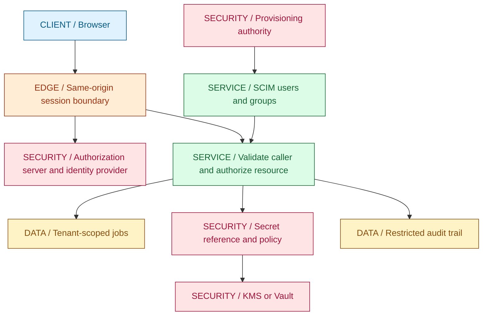
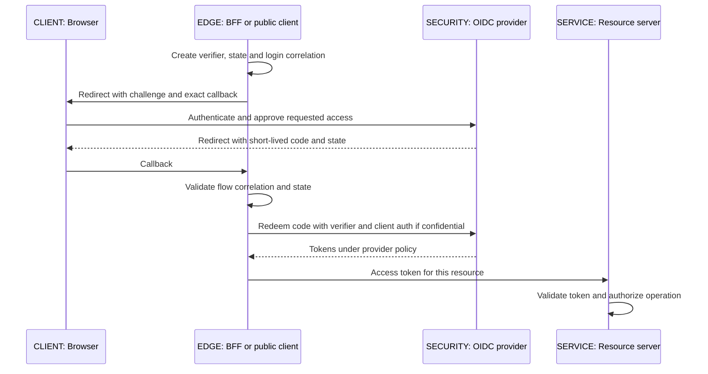
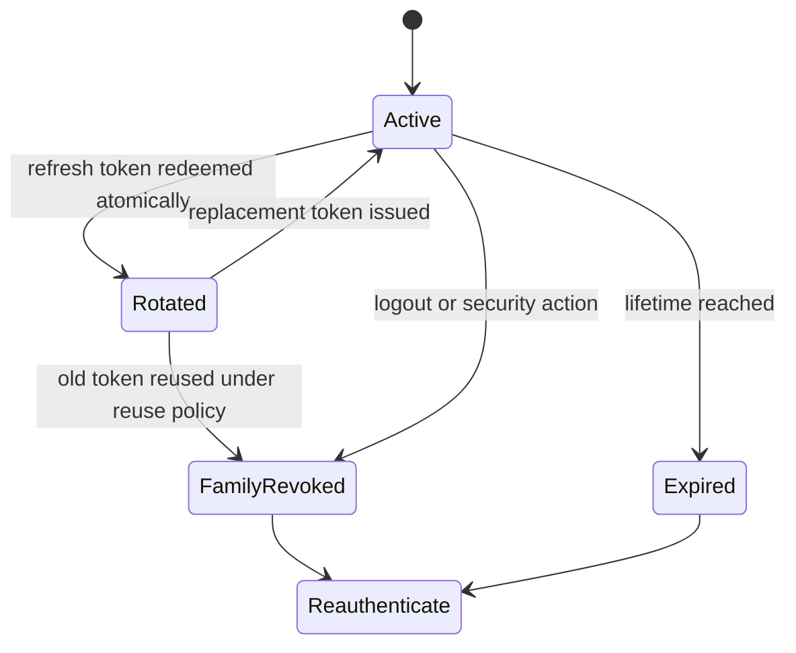
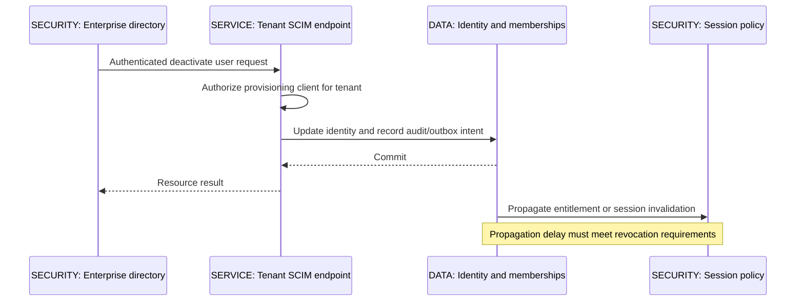
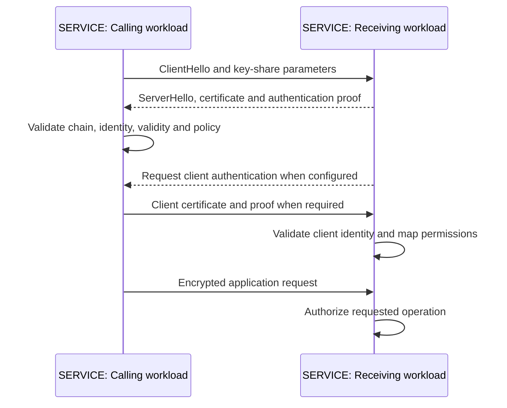
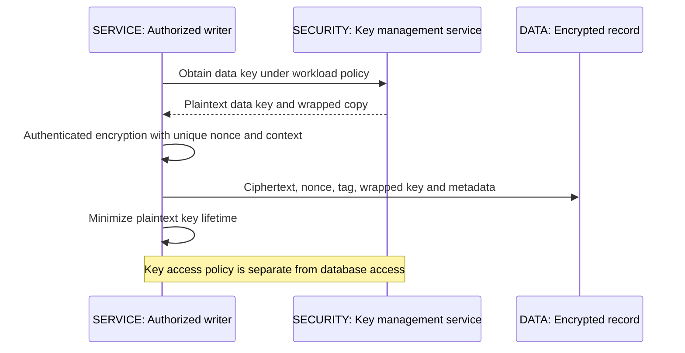

# 08 / Security, Identity and Data Protection

**Identity tells you who is asking; authorization decides what that identity may do now.** A correctly signed token is not permission to read every tenant's job. A private network is not an authorization boundary. Encryption does not make a badly authorized query safe. IntegrationHub is fictional, and this chapter follows its boundaries without claiming certification or describing a real organization's controls.

**Version assumptions:** Java 21, Spring Boot 4.0.x with the Spring Cloud 2025.1.x family previously checked in [03](03-spring.md#ch03-spring), PostgreSQL 17, Kafka 4.x and Kubernetes 1.34. OAuth 2.0 with the security guidance in RFC 9700, OIDC Core and TLS 1.3 are mechanism references, not an installed compatibility matrix. Product-specific identity-provider, Spring Security, Vault and KMS settings require deployment verification. No dependencies are downloaded in this chapter.

**[VERIFY: check the selected Spring Security/resource-server version, OAuth provider discovery metadata, supported flows and RFC 9700 security guidance before implementation. Boot/Cloud family compatibility was checked previously; no identity provider, resource server or federation test ran here.]**

## Big Picture

## What You Will Be Able to Explain

- Separate authentication, authorization, provisioning, federation and transport identity.
- Trace authorization code with PKCE and distinguish access, ID and refresh tokens.
- Specify JWT validation without treating decoding or signature checking as sufficient.
- Explain SAML enterprise login and SCIM lifecycle management as different protocols.
- Trace certificate validation, keystore/truststore responsibilities, TLS termination and mTLS authorization.
- Apply tenant authorization, CORS/CSRF, secret rotation and OWASP API controls at the owning boundary.
- Explain envelope encryption, Vault leases, tokenization, safe audit records and engineering obligations around personal and payment data.

> [!PRODUCTION]
> **Where this lives in IntegrationHub.** The [03 service layer](03-spring.md#ch03-spring) authorizes each job and connector operation; [06](06-databases.md#ch06-databases) enforces tenant-scoped constraints; [07](07-messaging.md#ch07-messaging) carries authenticated, authorized work without assuming a topic is trusted. [09](09-frontend.md#ch09-frontend) owns browser state and logout handling. [17](17-cloud.md#ch17-cloud) owns workload identity and network boundaries, and [27](27-payments.md#ch27-payments) expands payment-specific obligations. Every external secret is referenced, not embedded in an event or browser response.

## 1. Authentication, Authorization and Tenant Isolation

Authentication establishes a principal from evidence under a trust policy. Authorization evaluates principal, action, resource and context. Provisioning creates and updates identity records and memberships. Auditing records security-relevant decisions. Treating these as one login feature hides failures such as a terminated user retaining a long-lived session or a valid tenant member accessing a different tenant's connector.

Trace a job read: validate the credential, obtain a trusted principal, resolve the requested tenant against that principal's current permissions, query the job within the authorized tenant, and apply operation-specific policy. Do not load by globally unique job ID and assume uniqueness implies access. Do not accept a browser's tenant selector as authority. For cross-tenant support operations, use a separate explicit capability with stronger auditing, not a hidden bypass in the normal query.

RBAC groups permissions into roles; ABAC evaluates attributes such as resource owner, environment or account status. Both need a policy owner and a revocation strategy. A role embedded in a token is a snapshot: removing membership does not rewrite already issued tokens. Choose a bounded token lifetime, live policy checks for sensitive actions, introspection or session invalidation according to the required revocation latency.

| Control | Use when | Avoid when |
|---|---|---|
| Service resource authorization | Every protected resource access needs a decision | Gateway token validation is treated as sufficient |
| Database row-level policy | Defense in depth can be consistently configured and tested | Pooled session context leaks the previous tenant |
| RBAC | Stable job functions map well to permission bundles | Broad roles become an excuse to skip object checks |
| Attribute policy | Context and resource relationships matter | Rules are duplicated inconsistently across handlers |

**Production failure:** a query scopes reads correctly, but a bulk update or export endpoint omits tenant scope. Test every access path, including background workers and administrator tools, using two tenants whose records have similar identifiers. Authorization is a property of the operation, not of the controller annotation alone.

**Interview checks:** basic: authentication is not authorization. Internals: permissions have freshness. Debug: inspect resource selection and tenant binding. Scenario: a signed tenant claim must still be checked against the requested operation and resource.

## 2. OAuth 2.0, PKCE and OIDC

OAuth delegates API access. Its roles are resource owner, client, authorization server and resource server. OIDC adds an authentication layer with an ID token and identity claims. The same product can perform several roles, but the contracts differ: an ID token tells the client about an authentication event; an access token is for a resource server. An API should not accept an ID token merely because its signature is valid.

For interactive browser login, authorization code with PKCE keeps the access token out of the front-channel response and binds code redemption to the initiating client flow. The client creates an unpredictable verifier, derives an S256 challenge, and sends the challenge with the authorization request. The server binds the returned code to that challenge. Redemption supplies the original verifier; an intercepted code without it should not be sufficient. PKCE does not authenticate a public SPA as a confidential client, replace redirect-URI validation, or prevent malicious script already running in the page from acting as the user.

`state` correlates a callback to a browser flow and helps prevent login CSRF; OIDC `nonce` binds an ID token to the authentication request where used. Both need unpredictable values, correct storage, one-time processing and checks, not mere presence in a URL. Exact redirect-URI registration limits where authorization responses may go. Issuer validation prevents a response from a different authority being accepted under the wrong configuration.

The IntegrationHub baseline puts a secure HttpOnly session cookie at a same-origin BFF, with tokens held server-side. A pure SPA is a public client: it cannot protect a client secret embedded in JavaScript. It can use code plus PKCE, but token storage, refresh and cross-origin access need an explicit threat model. SameSite and HttpOnly reduce specific risks; they do not make a browser session immune to XSS or CSRF.

| Flow | Use when | Avoid when |
|---|---|---|
| Authorization code plus PKCE | Interactive user login for modern clients | An embedded secret is used to pretend a SPA is confidential |
| Client credentials | A workload acts on its own granted authority | It is used to impersonate an interactive user |
| Device authorization | A constrained device cannot conveniently run normal login | The product has an ordinary secure browser redirect flow already |
| Legacy implicit/password flows | Understand existing migrations and restrictions | Designing a new application around exposing tokens in redirects or collecting user passwords |

Scopes describe delegated permissions but do not necessarily encode all business policy. A token with jobs:read must still be restricted to allowed resources and tenants. Audience identifies the intended resource; a token minted for a different API should not become valid just because both APIs trust the same issuer.

**Interview checks:** basic: OAuth delegates; OIDC authenticates. Internals: PKCE binds code redemption. Debug: compare issuer, callback, state, nonce and verifier across one flow. Scenario: use workload identity/client credentials for service authority, not a fabricated end-user login.

## 3. JWT Validation and Refresh Lifecycle

A JWT is a representation, not a security policy. Signed tokens commonly expose their header and payload to anyone holding them; signing is not encryption. Parsing three segments and reading claims establishes no authenticity. Use a maintained JOSE/OIDC library integrated with Spring Security rather than writing a parser, signature verifier or key-discovery client for production.

Validation selects an explicitly trusted issuer and permitted algorithms, obtains keys from trusted configured metadata, verifies the signature, enforces audience and token purpose, and checks temporal claims with bounded clock skew. Application policy may require expiration, subject, authorized party, tenant bindings or other claims beyond what generic parsing requires. Do not let untrusted token fields choose arbitrary remote key URLs or relax algorithm requirements. Treat `kid` as a lookup hint inside trusted key material, not proof of identity.

Key caches need bounded refresh. Rotation introduces a new signing key, publishes its verification key, starts issuing with it, and retains old verification keys while accepted old tokens can still be valid. An unknown key ID may justify a rate-limited refresh, not an unbounded network request for every hostile token. Removing all old keys instantly can log out legitimate callers; retaining a compromised key indefinitely can preserve unauthorized access.

Opaque access tokens move validation toward server-side lookup/introspection. JWT validation can avoid a network call for every request but has revocation/freshness trade-offs. A denylist or live policy check can narrow those trade-offs, at the cost of state and availability coupling. Neither token format automatically supplies revocation, tenant authorization or correct logout.

Refresh rotation must be atomic: consume the old token and establish its replacement under a single family policy. Concurrent tabs can race and make a legitimate retry resemble theft. Coordinate refresh at the client/BFF and define provider-supported retry behavior; do not silently allow arbitrary reuse. Reuse detection is a signal to revoke the affected family and investigate, not permission to log raw token values. Hash stored refresh handles where the chosen implementation supports it, protect session stores, and bound idle and absolute lifetimes.

> [!TRAP]
> **Valid signature does not mean valid request.** Wrong issuer, audience, token purpose, expiration, tenant or resource permission can make an otherwise authentic token unacceptable. Authentication succeeds only under the complete validation policy; authorization is still a separate decision.

**[VERIFY: confirm JWT validation defaults, required claims, clock-skew tolerance, JWK cache/rotation behavior, introspection and refresh-family reuse handling against the selected Spring Security and identity-provider versions. No token, concurrent refresh or logout experiment was executed.]**

**Interview checks:** basic: JWT is not encrypted by default. Internals: trusted metadata constrains key selection. Debug: valid signatures with wrong audiences must fail. Scenario: revocation latency is a requirement to choose, not a property inferred from JWT.

## 4. SAML, SCIM and Enterprise Identity Providers

SAML commonly connects enterprise identity providers to service providers through signed XML assertions about authentication. The service provider must validate issuer, signature under trusted metadata, audience, recipient/destination, time conditions and request correlation as required by the flow. A signature on one element is not permission to consume an unrelated unsigned element. Use mature SAML/XML security libraries with hardened parsing and documented message validation.

Federation introduces identifier mapping. An email address can change and may be recycled; it is usually a poor durable account key by itself. Bind accounts using a stable provider-specific subject within an issuer/tenant namespace, and make account linking an authenticated operation. Do not automatically join unrelated identities merely because two providers supplied the same display name or unverified email.

SCIM manages identities and memberships: users, groups, updates, deactivation and provisioning synchronization. It does not perform interactive login and does not replace OAuth or SAML. A SCIM request is a privileged API call with its own authentication, tenant boundary, idempotency and audit requirements. Deprovisioning must reach session/token policy and application entitlements; setting active=false in one directory does not magically terminate every resource-server session.

Okta is an example of an identity-provider platform, not a synonym for any protocol. A provider may support OIDC, SAML, provisioning and lifecycle automation with different configuration surfaces. Keep issuer registration, protocol metadata, stable subject mapping, provisioning credentials and tenant onboarding as separate concerns. A discovery document can describe endpoints; it does not authorize trusting every issuer a user types into a form.

| Mechanism | Use when | Avoid when |
|---|---|---|
| OIDC federation | Modern clients need standard authentication over OAuth flows | An ID token is forwarded as an arbitrary API bearer credential |
| SAML federation | An enterprise integration requires established SAML SSO | XML assertions are parsed with hand-written signature selection |
| SCIM provisioning | Directory lifecycle should manage users/groups | Provisioning is mistaken for session authentication |
| Provider SDK | Maintained integration reduces protocol mistakes | Application policy becomes an unexplained default in a vendor console |

**[VERIFY: check SAML profile validation, SCIM RFC 7643/7644 behavior, PATCH/filter support, stable identifier mappings and Okta tenant-specific provisioning/deactivation semantics against configured products. No federation or provisioning environment was exercised.]**

**Interview checks:** basic: SAML signs identity assertions; SCIM provisions resources. Internals: issuer plus stable subject defines identity. Debug: a deactivated account may retain existing sessions. Scenario: tenant federation onboarding needs a controlled trust-registration process.

## 5. PKI, X.509, Keystores, TLS and mTLS

PKI binds public keys to identities through certificates and trust policy. An X.509 certificate contains identity information, a public key, validity and extensions, and is signed by an issuer. A certificate chain is evaluated toward a configured trust anchor. Successful chain validation is not sufficient without checking the intended identity, such as the hostname in the subject alternative name, and permitted key usage.

TLS negotiates algorithms and establishes encrypted, integrity-protected transport with peer authentication under its configuration. The certificate's key participates in authentication; modern ephemeral key exchange derives session keys rather than simply encrypting all application data with the certificate's private key. Forward secrecy limits exposure of old traffic if a long-term authentication key is later compromised, subject to the negotiated protocol and secret retention.

The sequence is a conceptual TLS 1.3 flow, not a packet transcript. Detailed ordering, resumption and certificate requests are covered by the negotiated protocol. [21](21-network-os.md#ch21-network-os) owns transport mechanics. A load balancer terminating TLS ends that protected channel; re-encrypt internal hops when the threat model requires it. An external HTTPS URL does not prove the database or service-mesh hop is encrypted.

In Java, a keystore can hold private-key entries and certificate chains; a truststore holds certificates used as trust anchors. The words describe roles, not necessarily distinct file formats. Protect private material, store passwords outside source control, and scope trust. Importing every certificate into a global truststore to fix a handshake failure silently enlarges the set of trusted peers. Disabling hostname verification removes an important identity check.

mTLS authenticates both transport peers. It does not decide whether workload A may export tenant B's data. Bind a validated workload identity to policy and still authorize application resources. Certificate rotation requires overlapping trust and usable private-key loading: replacing a file may not recreate an existing SSL context or connection pool. Measure remaining certificate lifetime and test reload/reconnect behavior before expiry.

| Transport choice | Use when | Avoid when |
|---|---|---|
| Server-authenticated TLS | Clients need server identity and protected transport | Internal hops are assumed protected without checking termination |
| mTLS | Workloads require strong peer identity and managed certificate lifecycle | Client certificate possession grants unrestricted application access |
| Narrow truststore | A workload should trust a defined authority set | Troubleshooting imports unrelated roots without review |

**[VERIFY: confirm TLS version/cipher policy, certificate path and revocation behavior, hostname checks, keystore provider support and live rotation behavior for the deployed JVM, proxy and mesh. The sequence is conceptual; no handshake, certificate or reload test ran.]**

**Interview checks:** basic: keystore identity differs from truststore trust. Internals: encryption and identity validation are distinct. Debug: inspect chain, SAN, time, trust and termination. Scenario: a certificate rotation is complete only when new connections actually use it.

## 6. CORS, CSRF and Browser Credentials

The same-origin policy limits how browser scripts read across origins. CORS lets a server selectively relax those browser read restrictions. It is not API authentication: nonbrowser clients do not enforce it, and some cross-origin requests can be sent without a preflight even when their responses cannot be read. Never protect a state change solely by omitting CORS headers.

CSRF exploits automatically attached credentials, commonly cookies, to cause unwanted requests. Protect state-changing endpoints with the framework's CSRF mechanism and suitable origin checks, use safe HTTP methods correctly, and scope cookies with Secure, HttpOnly and an appropriate SameSite policy. SameSite is a valuable layer, not a universal replacement for explicit CSRF defenses. Cross-site and cross-origin are related but different concepts.

For credentialed CORS, allow explicit trusted origins rather than reflecting arbitrary input, and vary/cache responses correctly. A wildcard policy is not suitable for credentialed browser reads. Preflight approval is not a resource authorization decision; the subsequent actual request still needs authentication and policy checks.

XSS can execute requests in the user's browser context even when HttpOnly prevents direct cookie reading. Render untrusted content as text, use framework escaping, avoid unsanitized HTML insertion, deploy an appropriate Content Security Policy, and review third-party scripts. A bearer token in localStorage is readable by injected script; putting it in memory reduces persistence but does not remove active-script compromise.

Long-lived SSE and WebSocket connections need origin validation and credential-expiry/revocation policies. A handshake authenticated yesterday does not authorize a subscription forever. Check each subscription's resource scope; terminate or reauthorize connections under the session contract. The native EventSource limitation on arbitrary authorization headers makes the baseline same-origin cookie/BFF arrangement useful, as [05](05-apis-realtime.md#ch05-apis-realtime) explains.

| Defense | Use when | Avoid when |
|---|---|---|
| Explicit CORS allowlist | Trusted browser origins need cross-origin response access | It is treated as protection against scripts or servers outside browsers |
| CSRF token and origin checks | Cookies authenticate state-changing requests | GET changes state or SameSite alone is assumed universally sufficient |
| Output encoding and CSP | Untrusted values reach UI rendering | HttpOnly is assumed to eliminate XSS impact |

**Interview checks:** basic: CORS controls browser access, not caller identity. Internals: cookies can be sent without script reading them. Debug: a blocked response does not prove the request had no effect. Scenario: use separate XSS and CSRF controls for a BFF session.

## 7. OWASP API Risks and Secure Input Boundaries

Broken object-level authorization is especially relevant to tenant systems: valid authentication plus a guessed resource ID can become data exposure if the service does not authorize that object. Broken property-level authorization appears when input binding permits fields such as tenant, owner or approval status to be changed. Narrow command DTOs and allowlisted transitions are safer than deserializing a persistence entity and merging it.

Resource consumption is also security. Bound page sizes, upload size, decompression, JSON nesting, query complexity, concurrent jobs and expensive provider calls. A small request can trigger large downstream work. Rate limits by IP alone are insufficient for shared networks and authenticated tenants; quotas and concurrency controls belong near the expensive resource as well as the edge.

SSRF is relevant to connector and webhook URLs. Resolve and validate allowed destinations under a controlled egress policy, reject unwanted address ranges and schemes, re-evaluate redirects, and prevent DNS changes from bypassing the connection-time policy. Registration-time string checks are not enough. Do not fetch arbitrary URLs with privileged cloud-network access.

Use parameterized SQL and safe library APIs rather than concatenating input into commands or queries. Validate business meaning as well as type, canonicalize under a defined policy, and do not expose stack traces, secrets or raw vendor responses. Inventory old endpoints and schemas: an unmaintained version can bypass controls added to the current one.

> [!MECHANISM]
> **A secure boundary narrows authority.** The browser supplies a request, not a trusted identity; the service derives a principal, scopes the resource and sends the smallest permitted command downstream. Validation and authorization should reduce what the next component can do.

**[VERIFY: compare controls with the current OWASP API Security Top 10 and ASVS requirements appropriate to the product. The categories here are an engineering review checklist, not a security assessment, penetration test or certification.]**

**Interview checks:** basic: an authenticated endpoint can still expose other users' objects. Internals: mass assignment bypasses field ownership. Debug: trace outbound requests through redirect and DNS policy. Scenario: threat-model amplification and egress, not only request syntax.

## 8. Secrets, Vault and Rotation

A secret has an owner, authorized consumers, an issuance mechanism, an expiry/rotation policy and a revocation path. Environment variables are a delivery mechanism, not a complete secret-management system. They can appear in process inspection, diagnostic dumps or accidental logs. Kubernetes Secret objects are not automatically a claim that every storage and access path is encrypted and least-privileged.

Vault separates authentication from policies and secret engines. Workloads authenticate through a supported identity mechanism and receive permissions; a secrets engine may supply static versioned values or dynamic credentials with leases. Dynamic database credentials can narrow lifetime and attribution, but renewal, lease expiry, database connection lifetime and revocation must be coordinated. A pool holding old authenticated connections may outlive the file that delivered its password.

Prefer platform/workload identity to a long-lived bootstrap token embedded in an image. Scope access by application and environment. A connector worker should request a permitted secret reference for its assigned tenant/job, not list every tenant's credentials. Audit secret access without recording the secret itself, and consider the availability policy when the secret store is temporarily unavailable.

Rotation is a rollout, not a file write. Support overlap where possible, publish the new version, make consumers reload or rebuild clients, verify use, then revoke old credentials and remove copies. For a suspected compromise, shorten or eliminate overlap according to risk and accept the availability consequences deliberately. A rollback must not restore a known-compromised credential.

| Secret strategy | Use when | Avoid when |
|---|---|---|
| Dynamic leased credentials | The backend supports bounded, attributable access | Consumers cannot renew/reconnect before expiry |
| Versioned static secret | An external provider only supports static credentials | Rotation has no overlap or application reload plan |
| Workload identity | Platform identity can authorize secret/KMS access | A universal bootstrap token is copied into every image |

**[VERIFY: confirm Vault authentication, policy, lease, renewal and revocation semantics, Kubernetes delivery/reload behavior and provider-specific credential overlap in the actual deployment. No secret store, rotation or revoked-connection test ran.]**

**Interview checks:** basic: delivery does not define lifecycle. Internals: leased credentials and authenticated connections can have different lifetimes. Debug: check whether clients reloaded, not only whether the secret changed. Scenario: test rotation with old and new workers running together.

## 9. KMS and Envelope Encryption

Encryption at rest protects particular storage exposures; transport encryption protects particular hops. Neither prevents an authorized but overly privileged application from reading data. Start by naming the threat: stolen disks, backup exposure, tenant isolation, cloud operator access, or application compromise. Different controls cover different threats.

Envelope encryption uses a data-encryption key to encrypt application data and a key-encryption key, often controlled by KMS, to wrap that data key. Store ciphertext, wrapped key and required authenticated metadata together. On read, an authorized workload asks KMS to unwrap the data key and then decrypts locally. KMS does not need to receive every large payload; it controls key use and policy.

Use maintained cryptographic libraries and an authenticated-encryption scheme appropriate to the platform. Nonce uniqueness and authenticated context matter; do not invent an encryption format. Bind context such as tenant and record identity where appropriate so ciphertext cannot silently be moved into another logical context. Java's managed memory complicates guaranteed secret erasure; minimizing lifetime and exposure is more honest than claiming a garbage-collected string was securely wiped.

Key rotation can mean rotating the KMS key, rewrapping data keys, or decrypting and re-encrypting payloads. These are different operations with different costs and implications. Disabling an old key before backups and retained data have a recovery plan can make legitimate restoration impossible. Back up key metadata and recovery procedures under a secure ownership model, not the plaintext keys in the same storage bucket as the data.

| Encryption layer | Use when | Avoid when |
|---|---|---|
| Storage encryption | Disks/snapshots need protected storage | It is presented as object-level authorization |
| Application envelope encryption | Selected fields need separate key-access control | Query/search requirements and key lifecycle are ignored |
| TLS/mTLS | Data needs protected authenticated hops | One encrypted public hop is taken to cover the whole path |

**[VERIFY: verify provider KMS envelope-encryption APIs, authenticated context, key versioning, quotas, availability and recovery behavior; confirm algorithm/nonce requirements with the chosen library. No cryptographic code or key-rotation experiment is supplied or executed here.]**

**Interview checks:** basic: data key encrypts data, wrapping key protects data key. Internals: authenticated context prevents unnoticed reassociation. Debug: inaccessible old ciphertext can be key-lifecycle failure. Scenario: recovery objectives must include key availability.

## 10. PII, Tokenization, Audit and Regulatory Engineering

Inventory personal data before choosing controls. Track where it enters, which purposes require it, where it is copied, who accesses it, retention and deletion paths. Logs, DLQs, browser analytics, search indexes and backups are data stores too. A redacted API response does not help if an exception logger captured the original payload.

Tokenization substitutes a reference for a sensitive value and keeps the mapping under controlled access. Encryption transforms data under a key and is generally reversible by an authorized decryptor. Hashing supports selected equality/verification use cases but does not automatically anonymize predictable values. Pseudonymized or tokenized data can remain personal data when reidentification is possible.

Audit records should capture actor, action, authorized tenant/resource, decision, timestamp, correlation and relevant version without raw credentials or unnecessary payloads. Restrict both writes and reads, protect integrity, synchronize clocks under a defined policy and make records searchable for investigations. Audit logs differ from diagnostic logs: silently sampling them may break accountability, while dumping every request body into them creates another exposure.

Deletion must propagate through source records, projections, caches and retained copies under a documented policy. A backup may need controlled expiry rather than arbitrary mutation, plus procedures preventing restoration from reintroducing deleted records into service. Immutable event history and privacy obligations require an explicit design review, not the assertion that append-only storage is exempt.

**[VERIFY: GDPR applicability, lawful bases, rights handling, retention, breach notification and cross-border transfer obligations require current official guidance and qualified legal/privacy review. Tokenization or pseudonymization is not by itself anonymization. This chapter provides engineering considerations, not legal advice or a compliance determination.]**

For payment data, prefer provider-hosted collection and tokens so the application need not receive primary account numbers or sensitive authentication data. Scope reduction is a design objective, not proof of being out of scope. Segmentation, access control, logging, vulnerability management and evidence collection depend on the actual payment flow and responsibility split.

**[VERIFY: check the currently applicable PCI DSS version, card-data retention restrictions, sensitive-authentication-data rules and eligibility for any reduced-scope assessment with PCI SSC guidance, the payment provider and a qualified assessor. No PCI compliance or scope determination is claimed; Chapter 27 expands the payment architecture.]**

| Data control | Use when | Avoid when |
|---|---|---|
| Minimize and delete | Data is unnecessary or past its justified lifetime | Retain everything because storage is cheap |
| Tokenize | Most components need a reference, not the sensitive value | Tokens are assumed non-sensitive without evaluating mapping access |
| Restricted audit trail | Security decisions need accountable reconstruction | Raw secrets or entire customer payloads are recorded |
| Hosted payment collection | Provider can keep card entry away from the application | Integration is assumed automatically outside all obligations |

> [!DECISION]
> **Reduce the number of places that can see a secret before adding more encryption layers.** A component that never receives the credential or sensitive field cannot leak that value through its ordinary logs, cache or error response. Encryption and access policy still protect the remaining necessary copies.

## 11. Security Review and Evidence

Review the request journey as a sequence of authority changes. For each hop, state the authenticated identity, permitted action, resource boundary, credential lifetime, replay protection, sensitive fields and audit evidence. Include degraded modes: identity-provider outage, unavailable key store, delayed deprovisioning, clock skew, stale JWK cache and old long-lived connections.

Executable security acceptance tests should include wrong issuer/audience, expired and not-yet-valid credentials, missing required claims, unsupported algorithms, cross-tenant IDs, unauthorized fields, CSRF failure, untrusted origins, stale sessions after deprovisioning, certificate identity mismatch and interrupted key rotation. Assert rejection without disclosure; do not only test successful login. Use maintained protocol libraries and a disposable controlled environment, never real credentials in a guide.

**Execution evidence:** this chapter contains no hand-written authentication or cryptographic implementation. All IdP, JWT, SAML, SCIM, TLS, KMS, Vault and browser security integration tests are NOT EXECUTED. Protocol and regulatory references are pointers for verification, not claims that this environment retrieved every specification or established compliance. Publication validation checks the document, not the controls.

> [!INTERVIEW]
> **Answer security questions in layers:** trusted identity, token/protocol validation, resource authorization, data protection, revocation and evidence. Naming OAuth or TLS without explaining the remaining boundaries is incomplete.

## Explained-Here Index and Sources

| Concepts | Explanation |
|---|---|
| Authentication, authorization, RBAC, tenant scope | [Boundaries](#ch08-boundaries) |
| OAuth 2.0, PKCE, OIDC | [Login flow](#ch08-oauth) |
| JWT, refresh token and signing-key rotation | [Token lifecycle](#ch08-jwt) |
| SAML, SCIM and Okta | [Enterprise identity](#ch08-federation) |
| PKI, X.509, keystore, TLS and mTLS | [Transport identity](#ch08-certificates) |
| CORS, CSRF and XSS | [Browser credentials](#ch08-browser) |
| OWASP API controls | [Input and authority boundaries](#ch08-owasp) |
| Secrets, Vault and rotation | [Secret lifecycle](#ch08-secrets) |
| KMS and envelope encryption | [Key hierarchy](#ch08-encryption) |
| PII, tokenization, audit logging, GDPR and PCI DSS | [Data protection](#ch08-protection) |

Owning references: [OAuth security best current practice](https://www.rfc-editor.org/rfc/rfc9700.html), [OIDC Core](https://openid.net/specs/openid-connect-core-1_0.html), [JWT best practices](https://www.rfc-editor.org/rfc/rfc8725.html), [SCIM protocol](https://www.rfc-editor.org/rfc/rfc7644.html), [OWASP API Security](https://owasp.org/www-project-api-security/), [Spring Security](https://docs.spring.io/spring-security/reference/), [Vault documentation](https://developer.hashicorp.com/vault/docs), [GDPR official text](https://eur-lex.europa.eu/eli/reg/2016/679/oj) and [PCI SSC](https://www.pcisecuritystandards.org/). These are verification destinations, not locally executed evidence.

## Related Chapters

Return to [00](00-master-map.md#ch00-master-map). Connect [03 Spring](03-spring.md#ch03-spring), [05 APIs](05-apis-realtime.md#ch05-apis-realtime), [06 databases](06-databases.md#ch06-databases), [07 messaging](07-messaging.md#ch07-messaging), [09 browser](09-frontend.md#ch09-frontend), [17 cloud](17-cloud.md#ch17-cloud), [18 operations](18-operations.md#ch18-operations), [19 tests](19-testing.md#ch19-testing), [21 networking](21-network-os.md#ch21-network-os) and [27 payments](27-payments.md#ch27-payments). Generated links are reciprocal.

## One-Page Cheat Sheet

**Authority:** authenticate the caller, then authorize action and tenant-scoped resource. Gateway checks, valid signatures and private networks do not replace service policy. Provisioning and session revocation are separate lifecycles.

**Login:** OAuth delegates access; OIDC adds authentication. Code plus PKCE binds redemption to the initiating flow. Validate callback correlation, issuer and token purpose. Public clients cannot protect embedded secrets. ID tokens are not arbitrary API access tokens.

**Tokens:** validate algorithm, trusted key, issuer, audience, time and required claims with a maintained library. JWT signing does not encrypt claims. Coordinate refresh rotation and family reuse policy. Key rotation needs overlap and bounded refresh, while compromise response may deliberately favor containment.

**Enterprise and transport:** SAML federates login; SCIM manages lifecycle. X.509 chain and hostname checks establish peer identity under policy. Keystore holds identity; truststore supplies trust. mTLS still needs operation authorization. Inspect every TLS termination hop.

**Browser:** CORS is not authentication. Cookies need CSRF defenses. HttpOnly reduces credential reading but does not prevent XSS from making requests. Reauthorize long-lived subscriptions under the session policy.

**Data:** minimize copies, scope secret access, test rotation, and distinguish data-key wrapping from payload encryption. Tokenization is not automatically anonymization or exemption from obligations. Audit decisions without secrets. GDPR and PCI conclusions require current qualified review, not a checklist assertion.

## Interview Corner

### Basic: OAuth Versus OIDC?

OAuth delegates API access; OIDC adds authentication and an ID token for the client. A resource server validates access credentials intended for it, not any signed identity assertion.

### Internals: What Does PKCE Prove?

Code redemption possesses the verifier matching the challenge bound to the authorization request. It does not turn a public client into a confidential one or make compromised browser code trustworthy.

### Trace/Debug: Login Works but the API Rejects the Token. Why?

Check token purpose, issuer, audience, expiration, allowed algorithms and required scopes before changing signature settings. An ID token or token for another resource should be rejected even after a valid login.

### Scenario: A Tenant Member Guesses Another Tenant's Job ID.

Resolve authorized tenant scope and query/authorize the resource within it. Return a safe denial without leaking existence where the policy requires that. Test bulk, export and background paths as well as individual reads.

### Basic: SAML Versus SCIM?

SAML carries federation assertions for login; SCIM manages users and groups. Deprovisioning through SCIM must connect to application entitlement and session policies rather than assuming a directory update ends all access.

### Internals: Why Is a Valid JWT Signature Insufficient?

It establishes integrity under a key, not the right issuer/audience/purpose, current validity or resource authorization. Apply all protocol and application checks using constrained trusted configuration.

### Trace/Debug: Rotation Broke Half the Fleet.

Inspect which workers loaded the new credential, which connections still use the old one, overlap timing and JWK/trust cache refresh. Updating the secret store alone does not rebuild clients or connection pools.

### Scenario: Refresh Token Reuse Is Detected.

Apply the provider's family revocation and investigation policy, terminate affected sessions as required and require reauthentication. Account for legitimate concurrent refresh races through deliberate client coordination; never log raw tokens.

### Basic: CORS Versus CSRF?

CORS controls browser cross-origin response access; CSRF defense prevents unwanted actions using automatically attached credentials. A response blocked by CORS can still follow a request that changed state.

### Internals: Does mTLS Replace OAuth or Authorization?

No. It authenticates transport peers. The application still needs permissions and tenant/resource checks; user delegation and workload identity can coexist with different scopes.

### Trace/Debug: A Secret Changed but Old Connections Still Work.

The connection authenticated earlier and may remain usable under backend policy. Check pool lifecycle and revocation semantics, force appropriate reconnection and verify new use before concluding rotation completed.

### Scenario: How Would You Reduce Sensitive Data Exposure?

Remove unnecessary collection and copies first, then tokenize/restrict remaining fields, encrypt appropriate layers, scope key access and audit decisions. Include logs, queues, projections and backups in retention and deletion design.

### Basic: What Is Envelope Encryption?

A data key encrypts the payload, and a KMS-controlled key wraps the data key. Store the wrapped key with ciphertext and authenticated metadata; key policy and recovery remain separate responsibilities.

### Internals: Is a Hash of an Email Anonymous?

Not necessarily. Predictable input can be guessed and linked, and context may allow reidentification. Privacy classification requires the actual threat and legal context, not the name of a transformation.

### Trace/Debug: Deleted Data Reappeared After Restore.

The restore procedure reintroduced retained backup state without replaying deletion policy before serving traffic. Design restoration controls and retention jointly, and validate projections and caches too.

### Scenario: Does Hosted Card Collection Guarantee PCI Compliance?

No. It can reduce exposure and scope, but actual obligations depend on the integration and responsibility model. Verify against current PCI SSC/provider guidance and qualified assessment; do not infer a compliance result from architecture alone.