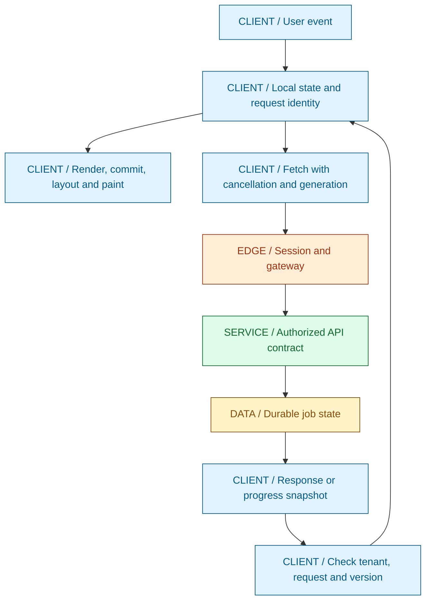
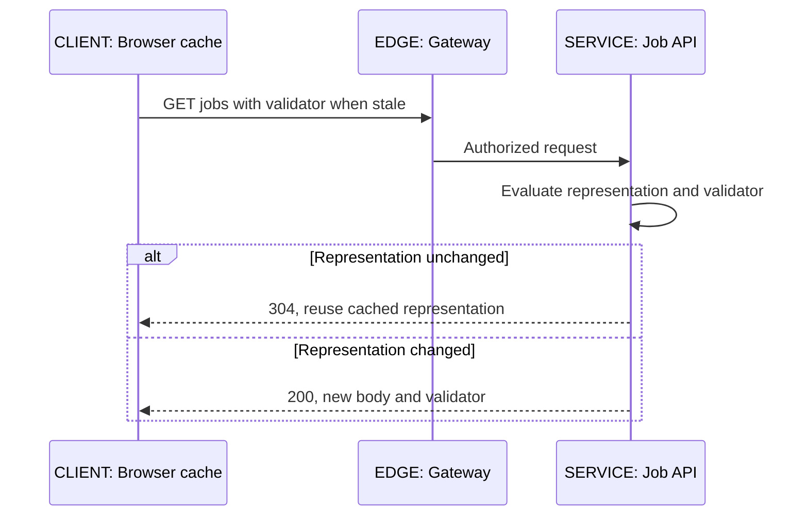
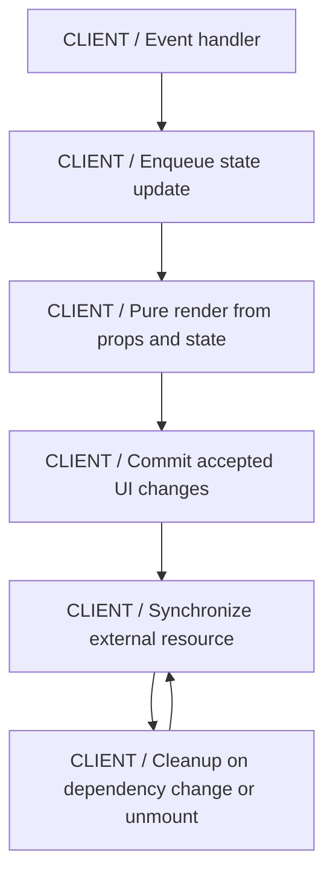
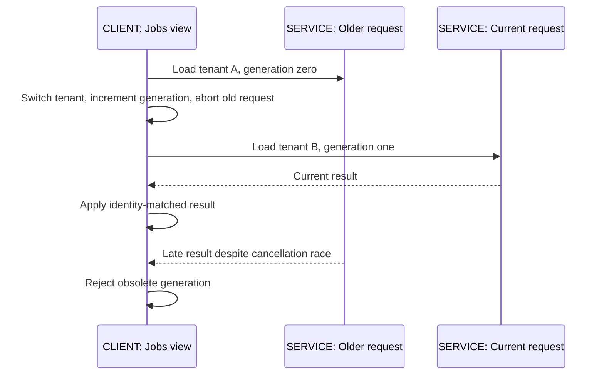
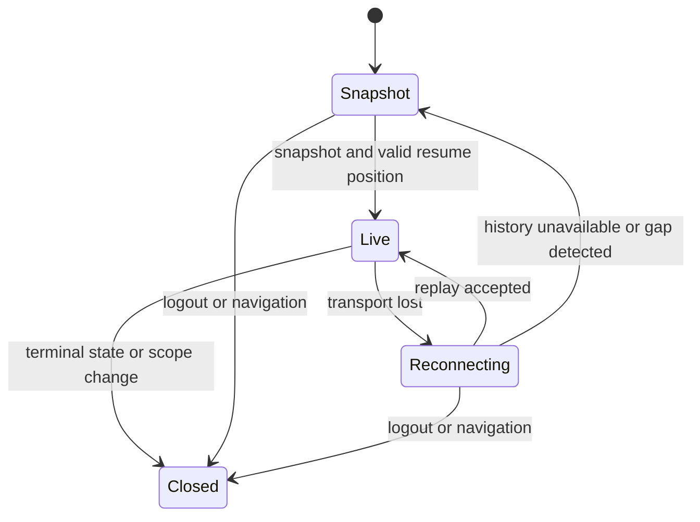
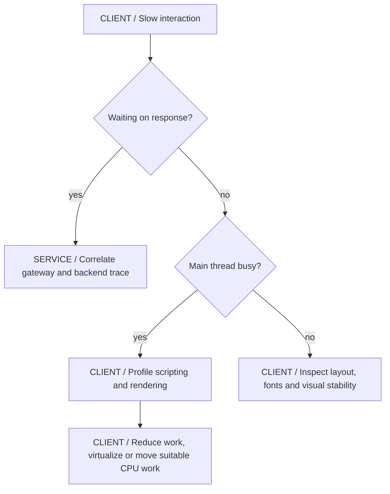

# 09 / The Browser and the Java Backend

**The UI is a replica of selected server facts, not their authority.** It holds form edits, cached responses and optimistic predictions while requests complete out of order. A tenant switch or network reconnect changes which results may still be applied. IntegrationHub is fictional; its React console illustrates these boundaries rather than a real company's frontend.

**Version assumptions:** modern evergreen browsers, ECMAScript modules, TypeScript 5.x, React 19.x and a contemporary Angular release for comparison. The backend remains Java 21, Spring Boot 4.0.x / Cloud 2025.1.x, PostgreSQL 17, Kafka 4.x and Kubernetes 1.34. Framework patch versions are not resolved locally. This is an explanatory chapter and a pure JavaScript lab, not a newly deployed frontend application.

**Execution status:** the dependency-free ViewStateLab.mjs ran on the existing Node-compatible runtime v24.20.0 and passed five deterministic contract checks. React rendering, Angular, TypeScript compilation, real HTTP and browser SSE behavior are NOT EXECUTED. No package downloads were attempted.

**[VERIFY: confirm React/TypeScript/Angular versions, React Compiler adoption, framework scheduling/effect behavior and target-browser APIs before applying examples to a product. The local lab validates a pure state model, not installed framework integration.]**

## Big Picture

## What You Will Be Able to Explain

- Trace document loading, HTTP caching, JavaScript execution, rendering and user interaction.
- Explain values, references, closures, promises and runtime validation at a Java backend boundary.
- Distinguish TypeScript's compile-time checks from runtime schemas and Java's server-side validation.
- Explain React render/commit, state identity, hooks, effect cleanup and server-state fetching without assuming render equals DOM mutation.
- Compare React composition with Angular templates, DI, signals and RxJS at an architectural level.
- Design login, tenant switches, optimistic writes and SSE reconnect without stale data crossing identities.
- Investigate user-visible performance using network, main-thread and rendering evidence rather than bundle size alone.

> [!PRODUCTION]
> **Where this lives in IntegrationHub.** The React console submits jobs to [05's API](05-apis-realtime.md#ch05-apis-realtime), authenticates through [08's same-origin BFF](08-security.md#ch08-security), and displays [07's durable progress](07-messaging.md#ch07-messaging). [06](06-databases.md#ch06-databases) remains authoritative. [21](21-network-os.md#ch21-network-os) explains connection behavior; [18](18-operations.md#ch18-operations) correlates browser latency with backend traces and [19](19-testing.md#ch19-testing) owns end-to-end tests.

## 1. Browser and HTTP Fundamentals

A navigation obtains a document through DNS, transport and TLS, then parses HTML into a DOM and styles into CSS rules. Scripts, styles, fonts and images create more work and network dependencies. Layout determines geometry; paint and compositing produce pixels. Not every change repeats every stage, but a large synchronous script can prevent the main thread from responding even when all backend requests are fast.

The browser's event loop runs tasks and performs microtask checkpoints. Promise callbacks are scheduled as microtasks; they do not run on a new application thread simply because the function is async. Long synchronous work before or between awaits still blocks the main thread. Workers can move suitable CPU work off-thread, but cannot freely manipulate the document DOM and have data-transfer costs.

HTTP caches may reuse fresh responses or revalidate stale ones with validators such as ETags. A 304 allows reuse of the cached representation; it is not a new JSON response body. Cache-Control private and shared-cache policy matter for personalized data. Include the correct identity and vary dimensions in cache keys, and do not let a CDN reuse one tenant's authenticated response for another.

Browser HTTP failure has several forms: transport rejection, abort, HTTP error status and invalid response body. Fetch normally resolves for an HTTP 404 or 500; the caller must inspect status. A proxy can return HTML for an error, so parsing every response as JSON can obscure the real failure. Network cancellation does not establish that the server rolled back a submitted job.

| Mechanism | Use when | Avoid when |
|---|---|---|
| Conditional HTTP read | Server state changes less often than clients inspect it | Every refresh downloads the same large payload |
| Web Worker | Measured CPU processing blocks interaction and is transferable | Network I/O is blamed for main-thread CPU work |
| Shared cache | Public representations have explicit cache identity and policy | Authenticated tenant responses are reused across callers |

**Interview checks:** basic: async is not automatically parallel CPU execution. Internals: promise continuation and rendering share scheduling constraints. Debug: inspect status before parsing. Scenario: cache identity includes the security context, not only the URL path.

## 2. JavaScript: Values, Closures and Asynchronous Work

JavaScript objects and arrays are mutable references. Copying an object with spread copies its immediate properties, not every nested object. A state update that mutates a nested object shared by previous state can make comparisons and historical snapshots misleading. Primitive values behave differently; strict equality avoids coercion surprises but does not make object identity equivalent to structural equality.

Closures retain lexical bindings. In React, each render creates values and callbacks associated with that render. A delayed callback can use an old prop or state value if the design does not account for it. This is not Java-style shared volatile state; it is a question of which render's values the callback captured and how current work should be identified.

Promises represent eventual completion. Await sequences dependency, while Promise.all starts no work itself: it observes the promises supplied to it. Creating all requests for a million items and passing them to Promise.all is unbounded admission, even if the network eventually limits connections. Bound concurrency and batch work according to the [02 concurrency principles](02-concurrency.md#ch02-concurrency).

Cancellation is cooperative. AbortController can signal fetch and other supporting APIs; a promise that ignores the signal can still resolve. Even a cancelled fetch may have caused a server-side effect before cancellation. Correct UI state uses request identity/generation checks in addition to aborting obsolete work. Do not rely on timing alone to decide which response is current.

Errors should preserve meaning across layers. A rejected promise is not always retryable; malformed data, forbidden access and validation conflicts need different states. Avoid an empty catch that turns failure into an empty successful list. Empty, loading, error and ready-with-data are different states that help a user reason about what is known.

| JavaScript choice | Use when | Avoid when |
|---|---|---|
| Immutable state replacement | Render logic depends on explicit state changes | Mutated shared objects make old and new state indistinguishable |
| Promise.all | A bounded set of independent tasks must complete together | It creates unbounded requests or masks partial-result policy |
| Abort plus identity guard | Navigation or filters make older requests obsolete | Abort alone is treated as proof no late completion can arrive |

**Interview checks:** basic: spread is shallow. Internals: callbacks capture a render's values. Debug: a late response can be valid data for the wrong current screen. Scenario: bound admission before composing asynchronous results.

## 3. TypeScript and the Java Contract Boundary

TypeScript adds compile-time structure to JavaScript. Types are erased from the emitted program, so declaring that a response is Job does not validate the JSON. The network boundary still needs parsing, runtime schema checks where appropriate, allowed enum handling and safe failure behavior. Generated clients help maintain shapes; they do not prove that every deployed server matches the document or that authorization succeeded.

Use discriminated unions to represent meaningful states such as idle, loading, ready and failed, with fields available only in the relevant case. Avoid an object full of independent booleans that permits impossible combinations like loading=false, success=true and error present. Prefer unknown at untrusted boundaries over any, then narrow through validation. A type assertion silences a compiler check; it does not create evidence.

Java and JavaScript numbers differ. JavaScript Number exactly represents integers only within its safe integer range, while Java long can exceed it. Serialize identifiers as strings when range or semantics demand it; do not let a large job ID round into a different identity. For money use an explicit minor-unit/decimal contract with currency and rounding rules, not casual floating-point arithmetic. Date-time contracts need timezone/offset and unit definitions, not a number called time that one side interprets as seconds and another as milliseconds.

Optional, absent and null fields should have documented meanings. A PATCH may distinguish leave unchanged from clear value. A client that blindly converts absent values to null can erase data. Unknown enum values need a safe fallback rather than a crash, especially when the backend deploys before cached frontend assets are refreshed.

| Type technique | Use when | Avoid when |
|---|---|---|
| Discriminated state union | UI states have different valid fields | Many independent booleans encode impossible combinations |
| Runtime schema validation | External data needs trustworthy shape before use | A TypeScript assertion is mistaken for input validation |
| Generated API types | A reviewed OpenAPI contract should reduce drift | Generation is assumed to test behavior or authorization |

**[VERIFY: check TypeScript strictness flags, JSON-schema/OpenAPI tooling, unknown-field handling and the Java serializer's numeric/date conventions in the selected versions. The chapter describes contracts; no TypeScript compilation or generated-client integration ran.]**

**Interview checks:** basic: types are erased. Internals: narrowing requires evidence from runtime values. Debug: investigate precision and timestamp units across Java/JavaScript. Scenario: contract evolution includes nullability and enum fallback, not just field names.

## 4. React Rendering, State and Identity

React components describe UI for given props and state. Rendering computes that description; committing applies the accepted changes to the host environment. A render can be repeated, interrupted or discarded under the framework's scheduling model, so rendering must stay pure: do not submit a job, mutate a global registry or open a socket merely because a component function ran.

State belongs to a component's position and identity in the tree. Keys tell React which sibling represents which logical item. A stable job ID makes sense for a job row; an array index can attach edit state to the wrong row after sorting or insertion. Changing a key deliberately resets state, which is useful for a new editing identity but destructive if used accidentally on every render.

State updates are scheduled and may be batched. Reading a state variable immediately after requesting an update does not make it the next render's value. Functional updates derive the next state from the previous queued state and avoid lost increments when several updates depend on prior state. A reducer is useful when transitions must preserve invariants across related fields; it is not mandatory for every input field.

Separate local interaction state from server state. A modal's visibility, draft filter text and unsaved form belong locally. A job's accepted status and version come from the server and need freshness, invalidation and error policy. Duplicating the same server field into several independent local states creates reconciliation work and stale views. Derive inexpensive display values from existing state rather than storing redundant copies.

| State arrangement | Use when | Avoid when |
|---|---|---|
| Local component state | One component owns an interaction | It duplicates shared authoritative server data |
| Lift state to common owner | Siblings coordinate one value | Everything becomes global regardless of lifetime |
| Reducer | Related transitions need explicit invariants | A trivial boolean needs a framework within the framework |
| Server-state cache | Requests need deduplication, freshness and invalidation | The cache key omits tenant or filters |

**Interview checks:** basic: render is not commit. Internals: keys preserve logical state identity. Debug: a reordered list with wrong edit state suggests index keys. Scenario: a reducer makes valid transitions explicit while the server stays authoritative.

## 5. Hooks, Effects and Resource Lifetimes

Hooks must follow the framework's ordering rules. Do not call ordinary state/effect hooks conditionally inside branches whose order changes across renders. Custom hooks share logic, not automatically one shared state instance. A hook named useJobs invoked twice can establish two subscriptions unless its implementation or a shared cache deliberately deduplicates them.

An effect synchronizes with an external system such as a subscription, timer or imperative widget. Dependencies describe values used by that synchronization. Omitting a dependency to silence a linter can leave old tenant identity or callbacks active. The cleanup must undo the established resource: close the old EventSource, remove listeners, clear timers and abort obsolete requests before a new scope becomes authoritative.

Effects are not the default place for everything. User commands such as submit should normally originate from the corresponding event handler. Values computable during rendering should be derived there when cheap. An effect that copies props into state can create a delayed extra render and two sources of truth. Measure before introducing memoization; useMemo and useCallback are optimization tools, not correctness mechanisms or a requirement on every function.

Development Strict Mode can intentionally exercise setup/cleanup and rendering to expose unsafe assumptions. Code must tolerate cleanup and re-setup without leaking a subscription or repeating an irreversible action. This does not mean every production effect always runs twice. An effect that submits a payment is unsafe because resource synchronization is the wrong owner for that command, not because the development check is inconvenient.

Transitions can mark eligible updates as nonurgent, and deferred values can let expensive derived views lag urgent input. They do not cancel HTTP requests, move CPU work to a worker or make an unbounded list cheap. APIs such as useEffectEvent have specific semantics and linting constraints; follow the team's adopted React version and compiler guidance rather than adding them by name.

> [!TRAP]
> **Cleanup is part of the contract, not housekeeping.** A tenant switch that leaves the old subscription active can display data from the previous scope. Closing the resource and checking incoming identity/version together protect the UI state; neither substitutes for backend authorization.

**Interview checks:** basic: effects synchronize external resources. Internals: dependencies and cleanup define lifetime. Debug: duplicated subscriptions often indicate setup without matching teardown. Scenario: commands belong to intentional user/workflow events, not arbitrary renders.

## 6. Data Fetching, Errors and Optimistic Writes

A query cache key should include every dimension that changes the result: tenant, resource, filters, ordering and pagination cursor. Authorization context may require cache reset or partitioning even if a URL is unchanged. Distinguish stale data from absent data; a background refresh can retain useful prior results while showing an update state, but must not retain another tenant's data during a switch.

The lab assigns a monotonically increasing request ID and a generation that changes whenever the tenant context changes. A response applies only when both still match. The generation matters when a user switches A to B and back to A: tenant name alone would accept an old A response from the earlier session. Request ID handles repeated queries inside one generation.

> [!MECHANISM]
> **Response acceptance is a state transition with a guard.** Compare the captured tenant, generation and request identity with the current state before applying a completion. Abort reduces obsolete work, while the guard makes an obsolete result unable to replace current data even if cancellation was ignored.

Server-state libraries can handle much of caching, deduplication, cancellation and invalidation. Adopt one consistent query policy rather than hand-writing separate caches in every component. Still understand mutation races: invalidating a list after submit may refetch from an asynchronous replica that has not seen the write. Use the accepted job response and authoritative status endpoint under [05's contract](05-apis-realtime.md#ch05-apis-realtime), then reconcile the list.

Optimistic updates predict a server outcome before confirmation. They fit reversible interactions when rollback and conflict behavior are understandable. A submitted long-running job can appear as submitting, then accepted with its durable identity; it should not appear completed merely because POST resolved. Preserve the idempotency key across retries of the same logical submission. A user editing the command into a different request should establish a different logical identity or receive a content-binding conflict.

| Fetch/mutation choice | Use when | Avoid when |
|---|---|---|
| Keep previous results during refresh | Same authorized scope and stale data is useful | Tenant/user changes leave old private rows visible |
| Optimistic update | Reversible actions have a clear reconciliation policy | Irreversible effects are shown as confirmed before the server accepts them |
| Query cache invalidation | A mutation changes known cached resources | Every query is globally reset without regard to cost or scope |
| Retry with stable key | The same logical command has an unknown outcome | Every network attempt gets a new idempotency key |

**Interview checks:** basic: HTTP errors need explicit status handling. Internals: request and generation identities solve different races. Debug: compare response context with the current view context. Scenario: keep unknown outcome separate from definite rejection.

## 7. SPA Authentication and Session Changes

The baseline browser uses a same-origin secure HttpOnly session through a BFF. The BFF performs OIDC code/PKCE handling and stores tokens server-side. State-changing cookie requests need CSRF protection. A pure SPA can use code plus PKCE as a public client, but must deliberately handle token lifetime, storage, refresh and cross-origin policy. [08](08-security.md#ch08-security) owns the protocol details.

Do not hide unauthorized buttons and call that authorization. The backend must reject forbidden operations regardless of UI state. The UI can present permitted actions for usability, but entitlements may change between render and submit. Handle 401 as an authentication/session concern and 403 as a permission decision without endlessly refreshing credentials for a policy denial.

Logout and tenant changes must close subscriptions, invalidate in-flight generations, clear or partition caches and remove stale optimistic records. Server logout/session revocation and provider single sign-out are distinct operations; document what actually ends. Multiple tabs need coordination for session changes and refresh to avoid inconsistent displays and refresh races. Communication between tabs should carry state-change notifications, not raw credentials.

| Session approach | Use when | Avoid when |
|---|---|---|
| Same-origin BFF session | Server-managed credentials and browser simplicity fit the deployment | CSRF and BFF session-store security are ignored |
| Public SPA with PKCE | Direct API access and identity-provider support justify browser token handling | A client secret is embedded in the JavaScript bundle |
| Entitlement-driven controls | UI should avoid offering invalid actions | Hidden controls replace server authorization |

**Interview checks:** basic: frontend permission checks are usability, not enforcement. Internals: logout includes cache/subscription lifecycle. Debug: repeated refresh on 403 is a category error. Scenario: a tenant switch is an identity-generation change, not just a filter update.

## 8. SSE, Snapshot Recovery and Slow Rendering

Live progress is a view of committed server state. The client needs an initial snapshot with a position, ordered updates within the stream's scope, duplicate/stale-version handling and a recovery path when retained history cannot satisfy its cursor. The server must arrange a gap-free snapshot/subscription boundary or detect a gap and require resynchronization; reading a snapshot and then subscribing later can otherwise miss changes in between.

Progress snapshots with increasing versions can replace older snapshots. Replayed version 8 after version 9 must not regress displayed progress. That policy is not valid for arbitrary deltas: dropping a missing intermediate delta could lose work. The lab only checks versioned cumulative snapshots and says so explicitly. Server-side validation must also prevent invalid terminal-state transitions; frontend version guards are not business correctness.

EventSource provides browser reconnection and Last-Event-ID handling within its contract, but the application owns retention fallback and authorization. Do not put long-lived bearer tokens in URLs. A fetch-based streaming client permits headers but requires correct incremental frame parsing, cancellation and reconnect handling. TCP chunks are not event frames; use a tested SSE parser rather than splitting arbitrary received chunks on assumptions about boundaries.

High-frequency events can overwhelm rendering even when the network and server are fine. Coalesce disposable progress snapshots to an appropriate display cadence, bound queued work and avoid rebuilding an entire table for every percentage update. Do not silently coalesce audit records that each represent a distinct business fact. Close a terminal job's stream under a documented policy rather than leaving it reconnecting forever.

**[VERIFY: confirm EventSource/browser reconnect behavior, fetch-stream parsing support, credentials/origin policy and the backend snapshot/replay protocol against target browsers and gateways. ViewStateLab checks snapshot versions only; it does not exercise SSE transport or React rendering.]**

**Interview checks:** basic: cursor requests history, not infinite replay. Internals: snapshot-to-stream handoff can have a gap. Debug: growing client queues can be rendering backpressure. Scenario: distinguish cumulative snapshots from deltas before discarding older events.

## 9. Angular Overview for a Java Engineer

Angular combines templates, components, dependency injection, routing, forms and HTTP facilities in a more integrated framework. Services injected into components should have deliberate scopes; a root-provided service can share state across screens, while a narrower provider can create isolated instances. This resembles familiar Java DI concepts but follows Angular's own injector hierarchy, not Spring bean semantics.

Signals model reactive values and derived computations; RxJS Observables model streams of values with completion, cancellation/unsubscription and operators. They are different abstractions that can interoperate. An HTTP observable can be cold, meaning subscription triggers work; multiple subscriptions can duplicate a request unless the design shares it intentionally. Unsubscribing from client work still does not prove a server mutation never happened.

Change detection determines which bindings must be checked and rendered. Immutable state, stable identities and suitable change-detection strategy can reduce unnecessary work, but exact behavior depends on the Angular version and whether zone-based or newer scheduling modes are adopted. Do not assume every event forces a full repaint, or that a performance flag fixes unstable input identities.

| Framework direction | Use when | Avoid when |
|---|---|---|
| React with selected libraries | The team values composition and owns conventions explicitly | Every feature invents a different fetching/form/state stack |
| Angular integrated tooling | Standardized DI, routing/forms and framework conventions fit the team | Familiar Java syntax is the only justification |
| RxJS stream composition | Cancellation, combination and time-based events need operators | A simple value is wrapped in an elaborate subscription graph |

**[VERIFY: verify Angular signals, change-detection mode, HTTP observable cancellation and lifecycle cleanup APIs against the selected major release. Angular is an architectural comparison here; no Angular application or dependency set was installed.]**

**Interview checks:** basic: Angular DI scopes affect shared state. Internals: subscribing can start new work. Debug: duplicate requests may be multiple subscriptions. Scenario: choose team conventions and workload fit, not a claim that one framework eliminates state problems.

## 10. Performance, Accessibility and Testing

Start with the user's operation: initial load, typing a filter, opening a job, scrolling a table or receiving progress. Break elapsed time into network, server, JavaScript, layout/paint and waiting on other resources. A small bundle can still render an expensive table; a fast API can still deliver too much JSON to parse and render on a slow device.

Measure field experience and controlled traces. LCP concerns when substantial content becomes visible; INP concerns interaction responsiveness; CLS concerns unexpected layout shift. Percentiles and device/network segmentation matter. A lab trace helps explain a problem but does not replace real-user observations, and telemetry must avoid leaking URLs or identifiers containing sensitive data.

Code splitting can defer rarely used routes; uncontrolled splitting can add request waterfalls. Virtualization renders only visible rows but needs stable keys, focus and screen-reader considerations. Pagination bounds data transfer; virtualization alone does not stop downloading a million rows. Images and media need dimensions to avoid layout shifts, and render-blocking font/style decisions can dominate first display.

Accessibility is part of functional correctness: semantic controls, labels, keyboard navigation, visible focus, meaningful error association and non-color-only status. Loading/error announcements should be useful without reading every progress update aloud. Preserve focus through updates and test zoom/reflow, not only a screenshot at one desktop size.

Testing layers should match risks. Pure reducer tests validate transition logic and races with deterministic fake completions. Component tests validate interaction, accessible names and cleanup. Contract tests validate DTO/status behavior. Browser tests validate real routing, cookies, CORS, keyboard behavior, reconnect and server effects. Do not mock away the gateway when the failure is proxy buffering.

**[VERIFY: confirm current Core Web Vitals definitions, measurement tools, browser support and accessibility requirements appropriate to the product. No field performance measurements, accessibility conformance audit or framework/browser end-to-end test is claimed by the pure-model lab.]**

> [!DECISION]
> **Optimize the measured stage.** Network caching does not repair synchronous rendering work, and memoization does not repair an authorization or stale-response race. Change the layer that consumes the budget or violates the contract.

## 11. Executed View-State Lab

The complete dependency-free source is `code/09-frontend/ViewStateLab.mjs`; its Windows PowerShell entry point is `& './docs/java-fs-guide/code/09-frontend/run.ps1'` from the workspace root. It uses an existing Node runtime or the same VS Code runtime fallback as the publisher and restores its environment afterward. No administrator rights, server or downloads are needed.

The reducer carries tenant, generation, request and progress version explicitly. Its loader aborts old work and still rejects obsolete completions. The fake transport exposes promises whose resolution order the test controls; it intentionally ignores abort so correctness cannot rely on convenient cancellation timing. There are no sleeps or fabricated latency figures.

| Executed check | What passed | Scope limit |
|---|---|---|
| Older request response | Cannot overwrite the current request | No network stack involved |
| Tenant switch and switch-back | Earlier generation is rejected even for the same tenant name | Not backend authorization |
| Progress duplicates and invalid versions | Current snapshot does not regress | Not ordered application of deltas |
| Reverse completion order | Current tenant data survives old completion despite ignored abort | Not fetch/browser cancellation behavior |
| Disposal | Late completion is ignored | Not a React effect/unmount test |

The generated execution.json records PASS for these five checks on v24.20.0. This result does not establish React behavior, DOM accessibility, TypeScript compilation or security. Those remain NOT EXECUTED. The model is deliberately small: production code needs schema validation, cache lifetime, pagination, user-visible errors and the complete session policy.

> [!INTERVIEW]
> **Explain stale UI with identities, not timing guesses.** Ask which user/tenant generation, resource, request and server version a result belongs to. Then show which comparison makes the obsolete result unable to mutate the current view.

## Explained-Here Index and Sources

| Concepts | Explanation |
|---|---|
| Browser and HTTP | [Loading, caches and event loop](#ch09-browser) |
| JavaScript | [References, closures and promises](#ch09-javascript) |
| TypeScript | [Compile-time versus runtime contracts](#ch09-typescript) |
| React, state and rendering | [Identity and render/commit](#ch09-react) |
| Hooks | [Synchronization and cleanup](#ch09-hooks) |
| Data fetching | [Request identity and optimistic writes](#ch09-fetching) |
| SPA authentication | [Sessions and tenant transitions](#ch09-auth) |
| Real-time UI | [Snapshot and reconnect](#ch09-realtime) |
| Angular | [Framework comparison](#ch09-angular) |
| Frontend performance | [Measured user experience](#ch09-performance) |

Verification references: [React learn](https://react.dev/learn), [TypeScript handbook](https://www.typescriptlang.org/docs/handbook/intro.html), [MDN Fetch](https://developer.mozilla.org/en-US/docs/Web/API/Fetch_API), [Angular documentation](https://angular.dev/overview), [Web Vitals](https://web.dev/articles/vitals) and [WCAG](https://www.w3.org/WAI/standards-guidelines/wcag/). These are owning references rather than claims of local framework execution.

## Related Chapters

Return to [00](00-master-map.md#ch00-master-map). Read [02 concurrency](02-concurrency.md#ch02-concurrency), [05 APIs](05-apis-realtime.md#ch05-apis-realtime), [06 database authority](06-databases.md#ch06-databases), [07 progress delivery](07-messaging.md#ch07-messaging), [08 security](08-security.md#ch08-security), [10 caching and capacity](10-system-design.md#ch10-system-design), [18 telemetry](18-operations.md#ch18-operations), [19 testing](19-testing.md#ch19-testing) and [21 network](21-network-os.md#ch21-network-os). Related navigation is reciprocal.

## One-Page Cheat Sheet

**Browser:** async does not make CPU work parallel. Inspect transport, HTTP status and body parsing separately. Cache policy and keys include identity. Main-thread work can make a fast backend feel slow.

**Types and values:** object spread is shallow; callbacks can retain old render values. TypeScript types are erased. Validate network data, preserve large IDs as appropriate strings, and specify time units/null semantics.

**React:** render is pure computation, commit applies accepted changes. Stable keys preserve identity. Separate local interaction from server state. Effects synchronize external resources and must clean up; commands belong to deliberate events. Measure before memoizing.

**Requests:** abort obsolete work and guard results by tenant, generation and request ID. A switch-back is a new generation. Optimistic state is a prediction until the server confirms it. Retry the same command with the same idempotency key.

**Sessions and streams:** BFF cookies still need CSRF defenses. Clear caches and subscriptions on identity changes. Snapshot/replay needs a gap-free boundary, version guards and retention fallback. Coalesce snapshots only when semantics permit it.

**Evidence:** pure state tests passed; React, Angular, TypeScript and browser integration did not run. Profile the actual slow stage and test keyboard/focus/error states, not just the happy screenshot.

## Interview Corner

### Basic: Does TypeScript Validate JSON?

No. Types disappear at runtime. Validate untrusted responses with runtime checks or an appropriate schema library before relying on a declared shape; a type assertion is not validation.

### Internals: Why Can a Callback See Old State?

It may close over values from the render that created it. Model the intended lifetime, use correct effect dependencies or appropriate update patterns, and avoid pretending every callback reads one mutable global state cell.

### Trace/Debug: A New Filter Shows Old Results.

An older request may complete last and overwrite the new one. Inspect query keys and request/generation guards. Abort helps resource use, but identity checks protect correctness when cancellation races or is ignored.

### Scenario: Switching Tenant A to B and Back to A.

Increment a context generation on every switch, abort/close old work and clear scoped data. Tenant equality alone cannot distinguish an old A response from the new A session. The executed lab tests exactly that distinction.

### Basic: Render Versus Commit?

Render computes UI from props and state; commit applies accepted host changes. Render must be pure because it can repeat or be discarded. External resource management belongs in appropriate lifecycle synchronization.

### Internals: Why Not Use Array Index Keys?

They identify positions rather than logical records. Inserting or sorting can attach existing component state to a different job. Use stable record identity unless position truly is the intended identity.

### Trace/Debug: Why Did an Effect Open Two Streams?

Check dependencies, cleanup, multiple hook instances and development lifecycle checks. Each setup needs a matching teardown. Do not suppress lifecycle checks to hide a resource leak.

### Scenario: Should Every Derived Value Use useMemo?

No. Compute cheap values normally; memoize when measurement and the team's compiler/version conventions justify it. Memoization is not a substitute for correct dependencies or immutable state.

### Basic: Why Can fetch Resolve for a 500?

HTTP error statuses are still HTTP responses. Check response status and content type before parsing and classify the failure; transport rejection is a different path.

### Internals: Does Abort Undo a Submitted Job?

No. It can stop supported client work, but the server may already have committed. Preserve request identity and use the API's idempotency/status contract to resolve unknown outcomes.

### Trace/Debug: Progress Goes Backward After Reconnect.

Inspect snapshot versions and duplicate replay. Apply only newer snapshots within the correct tenant/job generation. Do not reuse that discard rule for deltas whose every intermediate effect matters.

### Scenario: A Million-Row Table Is Slow.

Bound server results with pagination, then consider virtualization and rendering cost. Virtualization alone does not prevent downloading/parsing the whole dataset. Measure network, scripting and layout separately.

### Basic: React Versus Angular?

React emphasizes component composition with chosen ecosystem conventions; Angular integrates more routing/forms/DI conventions. Both still need explicit state ownership, request identity and resource cleanup.

### Internals: Why Might Two Observable Subscriptions Send Two Requests?

A cold observable can execute its producer separately per subscription. Share deliberately where appropriate and understand teardown; do not assume a service field automatically caches a result.

### Trace/Debug: Fast API, Slow Interaction.

Profile the main thread, expensive rendering, parsing, layout and third-party scripts. Correlate browser timing with backend traces before assuming the server is responsible.

### Scenario: What Must Logout Clear?

Relevant server sessions plus local caches, in-flight generations, subscriptions and optimistic data under the actual session policy. Coordinate tabs and avoid showing stale private data while reauthentication occurs.