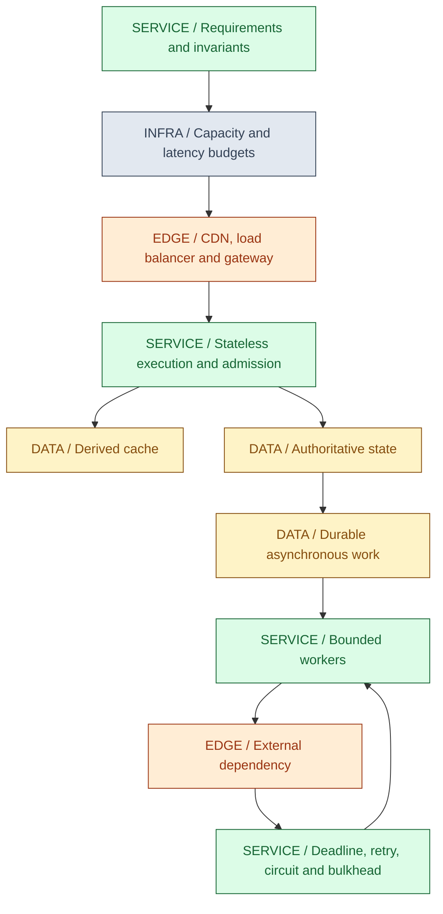
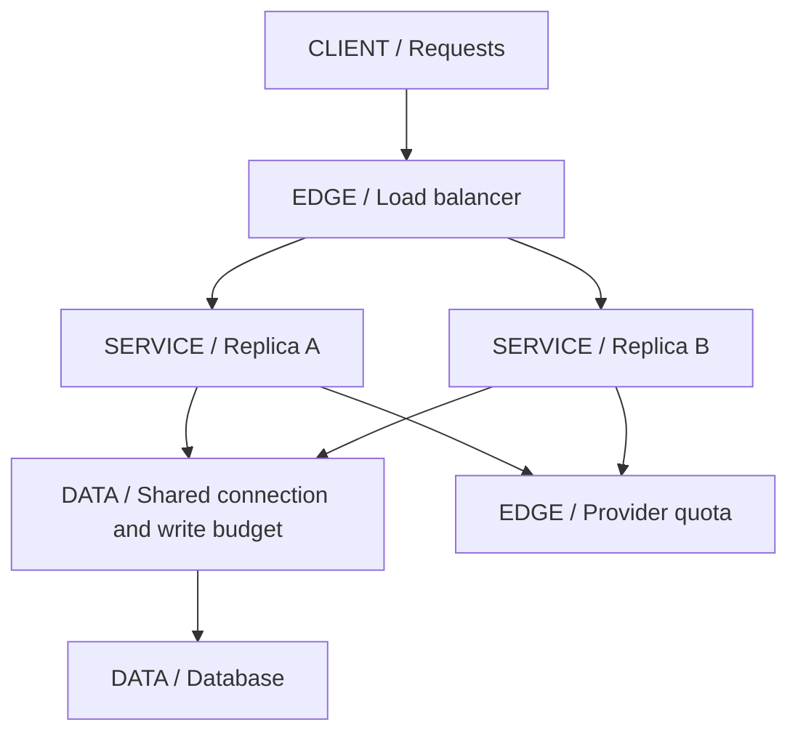
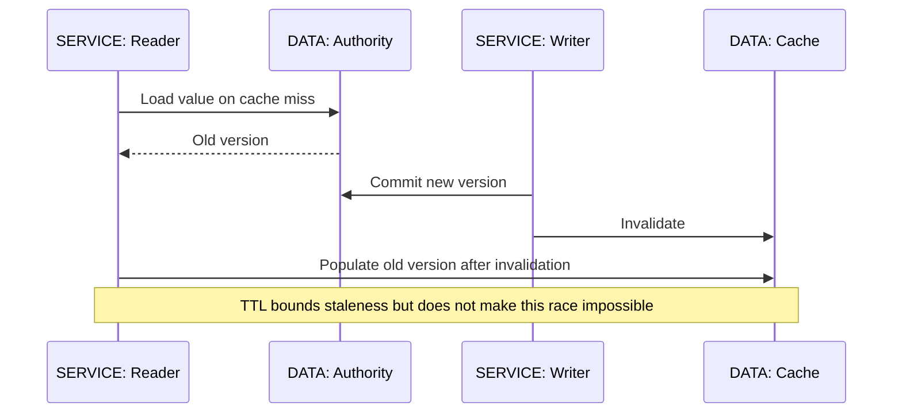
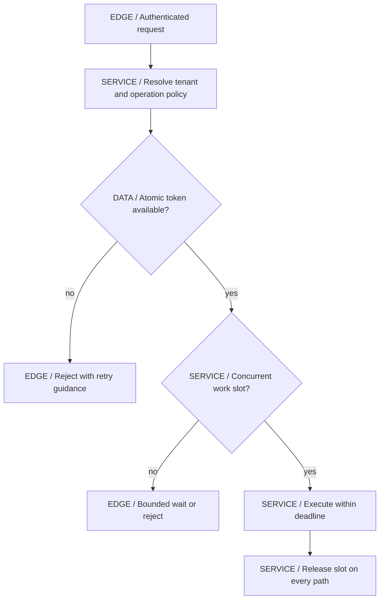
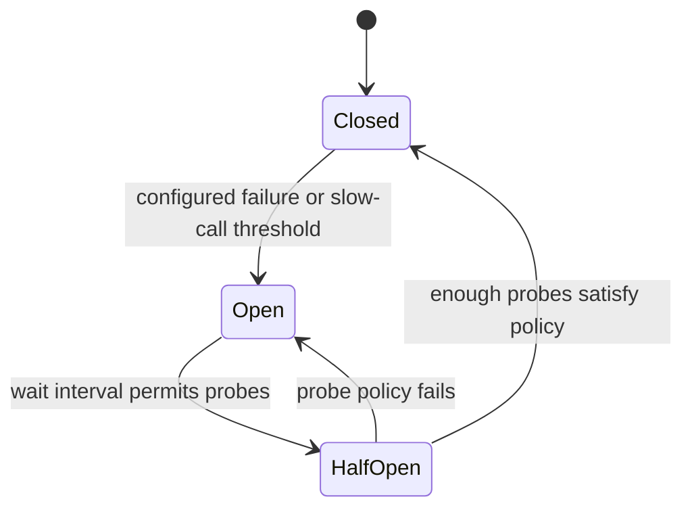
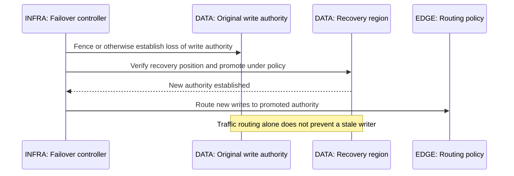

# 10 / System Design Foundations

**A system design is an argument that a set of constraints can be met under stated failures.** Boxes are the consequence of that argument, not its starting point. IntegrationHub is fictional; every capacity number below is an explicit exercise assumption, never measured production traffic.

**Version assumptions:** Java 21, Spring Boot 4.0.x / Cloud 2025.1.x, PostgreSQL 17, Kafka 4.x and Kubernetes 1.34 remain the guide baselines. Resilience4j is discussed by policy mechanism, without an installed artifact version. CDN, gateway and managed-database behavior require provider-specific confirmation.

**Execution status:** CapacityLab.mjs passed four arithmetic/validation checks using the existing Node-compatible runtime. These tests calculate hypothetical capacity, backlog drain time and retry budgets; they are not load tests. Resilience4j, distributed rate limits, replication and multi-region failover are NOT EXECUTED.

## Big Picture

## What You Will Be Able to Explain

- Translate a product requirement into invariants, freshness, latency, throughput and recovery requirements.
- Estimate order-of-magnitude storage, concurrency and backlog without confusing averages, peaks and percentiles.
- Choose scaling, balancing, caching, queues and partitioning based on the actual constrained resource.
- Explain consistency, CAP and PACELC without the misleading choose-any-two slogan.
- Compose timeouts, retries, jitter, circuit breakers and bulkheads without amplifying an outage.
- Design tenant fairness and multi-region recovery, including which writes must stop rather than split authority.
- Present a repeatable interview answer with assumptions, failure traces and a simpler rejected alternative.

> [!PRODUCTION]
> **Where this lives in IntegrationHub.** [05](05-apis-realtime.md#ch05-apis-realtime) defines accepted work and caller retry identity; [06](06-databases.md#ch06-databases) owns local transactions and replicas; [07](07-messaging.md#ch07-messaging) owns asynchronous recovery. [08](08-security.md#ch08-security) supplies isolation, [09](09-frontend.md#ch09-frontend) supplies user-visible freshness and [12](12-hld.md#ch12-hld) applies these foundations to twelve designs. Deep distributed theory remains in [22](22-distributed.md#ch22-distributed), not hidden behind product names here.

## 1. Requirements Before Components

Start with actors, commands, reads and the business invariant. For job submission: an authorized tenant can accept one logical submission under a key, observe status and cancel when allowed. The job must not be silently lost after acceptance. A progress screen may lag briefly; tenant authorization must not. Those different requirements imply different consistency and recovery choices.

Clarify scope: one region or many, one tenant size or a skewed distribution, which integrations are external, what is the largest request, and how long must history remain? State availability and recovery objectives with their operation boundaries. An uptime target for the API is different from the fraction of jobs completed within a deadline. A service can return 202 reliably while its worker backlog is growing without limit.

Choose a simple baseline first: one write authority, indexed storage, stateless application replicas and a durable queue only where asynchronous completion is useful. Introduce a component only when a requirement or measured limit needs it. Each additional store adds ownership, backup, schema, security, monitoring and recovery work. A design that names more products without explaining those obligations is less complete, not more scalable.

| Question | Use when | Avoid when |
|---|---|---|
| What must never happen? | Identify duplicate money movement, tenant exposure or lost accepted work | Availability targets replace correctness invariants |
| What can lag? | Choose caches, replicas and projections deliberately | Every read is labelled eventually consistent without a user contract |
| What must recover, and by when? | Set replay, backup and spare-capacity budgets | A backup schedule is mistaken for a recovery objective |
| What is outside scope? | Bound the interview or implementation | Scope expands silently until no design can be evaluated |

**Interview checks:** basic: functional requirements differ from quality attributes. Internals: SLO boundaries must match user operations. Debug: green API health can hide stalled work. Scenario: identify the simplest viable authority before introducing sharding.

## 2. Estimation, Units and Capacity

Use units in every calculation. Requests/second multiplied by seconds yields requests in flight; records/day multiplied by bytes/record yields bytes/day. Keep average, peak, burst and tenant skew separate. A daily average says little about a synchronized nightly import. Percentile latency is not interchangeable with mean residence time in Little's law.

For a stable system and consistent boundaries, Little's law relates mean concurrency to throughput times mean residence time. If we **assume** 2,000 requests/second and 0.125 seconds mean residence, mean in-flight work is 250. This is neither a recommended thread count nor a guarantee about the 99th percentile. Queue time, service time and external waiting must be included consistently with the chosen boundary.

Assume every request produces one 1,000-byte retained record, traffic continues at that rate all day, retention is seven days and there are three copies. That gives 172,800,000 records/day and 3,628,800,000,000 retained bytes, about 3.63 decimal TB. This deliberately excludes indexes, metadata, compression, WAL, temporary rebuild space and backups. The omitted costs need separate estimates; multiplying by replication is not a complete disk forecast.

Backlog drain needs surplus throughput. With **assumed** backlog 120,000 items, arrivals 1,800/s and completions 2,000/s, the net drain is 200/s and recovery takes 600 seconds under constant rates. If arrivals equal completions, the backlog does not drain. Adding replicas helps only if workers, partitions, provider quotas and the database permit extra completion capacity.

| Estimate | Use when | Avoid when |
|---|---|---|
| Mean concurrency | A stable boundary needs occupancy reasoning | It is used as a tail-latency guarantee or universal pool size |
| Storage by retention and copies | Establish order of magnitude | Indexes, backups and rebuild headroom are silently excluded |
| Burst/backlog model | Capacity must recover after downtime | Steady-state throughput is assumed sufficient for catch-up |
| Per-tenant distribution | Heavy tenants affect fairness and hot keys | Average tenant size hides a dominant customer |

> [!MECHANISM]
> **Recovery consumes capacity too.** A system provisioned to barely match live arrivals has no spare throughput to replay yesterday's backlog, rebuild an index or restore stream state. Recovery time is constrained by surplus work capacity, not only by how fast a pod starts.

The source `code/10-system-design/CapacityLab.mjs` asserts these numbers and rejects invalid inputs. Its report is observed arithmetic execution, not an observation of traffic. [23](23-jvm-performance.md#ch23-jvm-performance) expands sizing and profiling once real measurements exist.

**Interview checks:** basic: attach units and assumptions. Internals: Little's law uses means under appropriate stability. Debug: lag that never decreases means no net drain. Scenario: reserve capacity for catch-up and failover, not just ordinary demand.

## 3. Scalability and Load Balancing

Vertical scaling adds resources to one node; horizontal scaling distributes work among nodes. Horizontal scaling is effective when work can be partitioned and shared bottlenecks do not dominate. Stateless HTTP replicas may scale easily while one hot database row or external provider quota fixes the system's maximum throughput. Measure the constrained resource before changing replica count.

L4 balancing routes transport connections without understanding application URLs. L7 balancing can inspect HTTP attributes, terminate TLS and route by host/path. Both require health and connection policies. Round-robin distributes assignments, not equal work cost; least-connections can help with varied connection durations but is not a direct measure of CPU or tenant fairness.

Health checks should answer whether a node can accept the relevant work, not recursively require every optional dependency to be healthy. An overstrict check can remove every node during a downstream incident and turn graceful degradation into total unavailability. Readiness, liveness and business correctness are separate. Connection draining lets existing work finish during rollout, within a bounded shutdown policy; it does not make long-running requests immortal.

Sticky sessions can reduce the need to share ephemeral local state but create imbalance and failover questions. Prefer explicit durable session/state ownership when a node loss must not lose progress. A persistent connection naturally stays on its chosen node; that does not guarantee reconnect returns to the same node or restores missed history.

| Scaling choice | Use when | Avoid when |
|---|---|---|
| Larger node | Simpler headroom meets requirements | One node exceeds practical capacity or failure tolerance |
| More stateless replicas | Work is independently routable | Shared DB/provider limits are unchanged |
| L7 routing | HTTP-aware policies justify termination/inspection | Connection-level traffic needs unnecessary application complexity |
| Sticky routing | A deliberate local-state optimization has recovery | Stickiness is the only state durability plan |

**[VERIFY: validate load-balancer health checks, retries, connection draining, idle timeouts and protocol handling against the actual gateway/cloud deployment. No balancing, failover or autoscaling load test ran.]**

**Interview checks:** basic: replicas do not multiply every dependency's capacity. Internals: routing policy balances a chosen proxy for load. Debug: inspect shared bottlenecks. Scenario: define what happens to in-flight work when an instance is removed.

## 4. Caching Layers, CDN and Invalidation

A cache stores a derived value to avoid repeated expensive work. State its key, authority, population strategy, eviction policy, freshness bound and invalidation behavior. A cache without a staleness contract is an undocumented replica. Authorization-sensitive responses also need identity dimensions; leaking another tenant's cached response is not a performance bug.

Cache-aside reads the cache, loads from authority on miss and populates the entry. It is simple but has race windows. A reader can fetch old database state, a writer can commit and invalidate, and then the reader can repopulate the stale value. TTL limits duration but does not remove the race. Versioned entries, conditional writes, generation keys or a deliberately accepted freshness window are possible responses.

Write-through synchronously updates through a cache layer, but atomicity with an external database still needs a specific contract. Write-behind acknowledges before authority persistence and risks loss if the buffer is not durable; do not use it casually for accepted jobs. Read-through encapsulates loading behind the cache API. These names describe responsibilities, not universal consistency guarantees.

A stampede happens when many callers miss an expensive key together. Single-flight loading can collapse concurrent misses within its coordination scope, TTL jitter can avoid synchronized expiry, and stale-while-revalidate can serve bounded stale data while one refresh proceeds. Cache penetration by many nonexistent IDs may justify short negative caching, but negative results need invalidation when records are created and must not leak authorization distinctions.

CDNs cache near clients and can terminate TLS, compress and protect origin capacity. Use immutable versioned asset names with long cache lifetimes for frontend bundles; serve the entry document under a policy that can point clients to new assets. Purge is an operational tool, not a magic atomic global update. Personalized API caching requires explicit keys and credential policy, not only an Edge product checkbox.

| Cache policy | Use when | Avoid when |
|---|---|---|
| Cache-aside plus TTL | Bounded stale reads are acceptable | Cached values enforce a strict write invariant |
| Versioned entries | Older loads must not overwrite newer values | Version semantics differ across writers |
| Stale-while-revalidate | Availability benefits outweigh bounded freshness loss | Stale permission or balance data authorizes an unsafe action |
| CDN immutable assets | Build artifacts have content-versioned identity | Same URL is overwritten while clients retain it for months |

**Interview checks:** basic: cache policy includes freshness. Internals: invalidation and repopulation race. Debug: high hit rate can still hide hot-key or stale-data problems. Scenario: keep balance/authorization decisions at their authority unless a stronger protocol proves safety.

## 5. Replication, Partitioning, CAP and PACELC

Replication copies state for availability, recovery or reads; partitioning divides ownership or placement. Replicas can lag, so a read-after-write may need the leader or a known-position wait. Partitioning can distribute load but makes cross-partition operations and rebalancing harder. The natural tenant key improves locality but can create a hot shard for one unusually large tenant.

Linearizability means each operation appears to take effect at one point between invocation and response while respecting real-time ordering. Eventual consistency means replicas converge under the stated conditions when updates stop and communication/repair succeeds; it says little by itself about what a user may read during convergence. Read-your-writes, monotonic reads and causal guarantees describe useful intermediate application needs. [22](22-distributed.md#ch22-distributed) gives the deeper formal treatment.

CAP concerns behavior during a network partition: a system cannot guarantee both linearizable consistency and the formal availability property for every request under that failure. It is not an ordinary choose-two product classification, and partition tolerance is not a switch that removes network failure from reality. Practical designs choose which operations reject, queue or serve stale data when communication is lost.

PACELC adds the ordinary-operation trade-off: even without a partition, stronger cross-node coordination can cost latency, while weaker coordination can change consistency. Neither acronym selects your database or tells you whether a stale job list is acceptable. Tie the trade-off to a user-visible operation and invariant.

| Operation | Use when | Avoid when |
|---|---|---|
| Serve stale job history | Read-only browsing tolerates a labeled delay | It determines whether an irreversible action is allowed |
| Reject conflicting writes during partition | One authoritative decision must be preserved | Rejection is hidden as a successful acceptance |
| Queue explicit pending work | Durable pending semantics are part of the contract | Enqueue is claimed as completed execution |
| Per-tenant partitioning | Most operations stay within tenant ownership | A hot tenant or global transaction is ignored |

**[VERIFY: verify consistency guarantees, read-after-write mechanisms, replica promotion/data-loss policies and partitioning constraints against the chosen database/service configuration. CAP/PACELC are reasoning tools, not evidence of an untested product guarantee.]**

**Interview checks:** basic: replication and partitioning solve different problems. Internals: CAP's availability differs from an uptime percentage. Debug: stale replica reads do not imply lost leader writes. Scenario: decide per operation what must stop and what may degrade.

## 6. Queues, Backpressure and Admission

A queue absorbs a mismatch in arrival and service rates over time; it does not eliminate that mismatch. If arrivals exceed sustainable completions, the backlog grows until storage, retention or the user's patience is exhausted. A bounded queue turns unlimited delay into an explicit admission decision. Accepted durable work still needs a recovery owner if the consumer is unavailable.

Backpressure communicates limited downstream capacity upstream. It can be broker flow control, bounded prefetch, semaphore admission, HTTP rejection or a demand protocol. Simply adding a queue shifts where work waits. An unbounded executor behind a bounded broker prefetch can recreate the same memory problem inside the application if acknowledgements occur too early.

Partition workers by meaningful isolation boundaries. Per-provider concurrency limits protect downstream APIs; per-tenant budgets prevent one customer from occupying every slot. Global capacity still matters: multiplying tenant limits by thousands of tenants can exceed the shared pool. Use a hierarchy of limits and decide fairness among accepted jobs, retries and new work.

| Queue design | Use when | Avoid when |
|---|---|---|
| Durable asynchronous queue | Accepted work can finish later | Clients require an immediate completed result |
| Bounded local queue | Short waiting is useful and loss on restart is acceptable | It is the only durable record of accepted work |
| Per-tenant/provider lanes | Slow dependencies need isolation | One queue lets a single outage block all customers |
| Load shedding | Capacity is exhausted and rejection is safer than collapse | A rejected request is reported as accepted work |

**Interview checks:** basic: queues trade capacity mismatch for waiting. Internals: arrival/completion rates determine backlog growth. Debug: inspect oldest work age, not just queue depth. Scenario: retries and replay must share capacity with new traffic under a deliberate policy.

## 7. Rate Limits and API Gateway Responsibilities

A rate limit bounds activity over time; a concurrency limit bounds active work; a quota accounts for consumption over a longer interval. All three can coexist. A gateway can enforce coarse client/tenant limits before expensive application work, while the service enforces the actual resource budget. A gateway cannot know every domain permission or transaction invariant.

Token buckets refill capacity at a rate up to a maximum burst. They allow short bursts while bounding long-run admitted rate. Fixed windows are simple but can allow bursts across adjacent boundaries. Sliding logs track exact recent requests at memory cost; sliding counters approximate with lower storage. Choose precision, burst behavior and coordination cost from the contract.

Distributed limits require atomic update under a shared authority or a designed allocation scheme. One independent bucket per pod multiplies permitted global rate by pod count. Central counters introduce latency and availability dependence; regional allocations reduce coordination but can strand unused capacity. State explicitly whether limiter failure should fail open, fail closed or use a bounded local fallback, especially for cost-sensitive provider calls.

The gateway's other useful responsibilities include routing, coarse authentication, request size limits, protocol adaptation and correlation. Keep it from becoming an unversioned second business service that performs multi-step writes with no domain ownership. Internal services must still validate the trusted identity and authorize resource access.

**Interview checks:** basic: token bucket permits a defined burst. Internals: limit atomicity matters across replicas. Debug: doubling pods and doubling allowed rate exposes local-only enforcement. Scenario: document fail-open/closed behavior instead of discovering it during an outage.

## 8. Timeouts, Backoff, Jitter and Resilience4j

A timeout bounds how long one layer waits, but may not cancel underlying work. Distinguish connection acquisition, connection establishment, response/read inactivity, total call deadline and the parent request deadline. Independent timeouts can add up beyond the caller's patience. Propagate remaining budget and reserve time for response serialization, cleanup and meaningful errors.

Assume a parent budget of 500 ms, an attempt budget of 150 ms including connection work, 25 ms between attempts and a 25 ms final reserve. Two attempts fit: 2 times 150 plus 25 plus 25 equals 350 ms. Three need 3 times 150 plus 2 times 25 plus 25 equals 525 ms, so they do not fit. The lab verifies this arithmetic. These are assumed budgets, not measured latencies or recommended defaults.

Retry only when the failure is eligible, the operation is safe to repeat and budget remains. Exponential backoff increases delay between attempts; jitter distributes clients so they do not retry simultaneously. A retry budget limits extra load at the service or fleet level as well as per request. Three attempts at three nested layers can create up to 27 leaf attempts in a worst-case retry tree; centralize ownership of retries where the full context is known.

A circuit breaker stops some calls to an unhealthy dependency to avoid repeated expensive failures. Closed records outcomes; open rejects according to policy; half-open allows limited probes. It is not a mutex, a rate limiter or a concurrency cap. A breaker can be closed while thousands of slow calls are already in flight. A bulkhead limits concurrent or queued work so that one dependency does not occupy all resources.

Resilience4j provides policy implementations such as retry, circuit breaker, rate limiter, bulkhead and time limiter. Decorator order changes behavior: a breaker outside a retry can observe one final outcome, while a breaker inside can observe each attempt. Timeout placement changes whether it covers one attempt or the whole retry sequence. Explain the desired budget and measurement semantics before choosing annotation order.

Fallback must be honest. Cached stale data may be acceptable for a dashboard; returning an empty successful list can conceal an outage, and inventing a successful payment result is unacceptable. A fallback is another operation with its own cost and correctness limits, not a default success path. Protect it from becoming the next overloaded dependency.

| Policy | Use when | Avoid when |
|---|---|---|
| Deadline/timeout | Waiting must be bounded | It is assumed to roll back remote effects |
| Retry with jitter | Transient failures and safe repetition fit remaining budget | Permanent errors or unknown non-idempotent effects are repeated blindly |
| Circuit breaker | Failing dependencies should receive limited probe traffic | It is expected to cap all active calls |
| Bulkhead | One dependency must not exhaust shared execution capacity | An unbounded queue hides behind the limit |
| Stale fallback | Product explicitly tolerates bounded stale reads | A failed write is reported as successful |

**[VERIFY: check Resilience4j version compatibility, exception/slow-call classification, decorator/aspect order, scheduler behavior and cancellation semantics against the selected Spring stack. No Resilience4j application, timer or circuit transition test ran; the lab tests budget arithmetic only.]**

> [!TRAP]
> **More retries can reduce availability.** During overload, each retry competes with useful work and can keep a dependency saturated after the original spike. Bound attempts, elapsed time and aggregate retry load; do not interpret eventual success of one request as evidence that the fleet policy is healthy.

**Interview checks:** basic: breaker, limiter and bulkhead are different. Internals: composition order changes observations. Debug: inspect retry amplification and underlying work after timeouts. Scenario: allocate one parent budget across all attempts and cleanup.

## 9. Multi-Tenancy and Fairness

Tenancy has at least three independent dimensions: authorization, data placement and resource fairness. A perfectly authorized tenant can still monopolize CPU, queues or provider connections. A tenant-specific schema can improve maintenance isolation but does not automatically isolate the shared database process. A separate database improves some boundaries while increasing cost and operational overhead.

The baseline uses tenant-scoped tables and permissions, explicit per-tenant/provider budgets, and one write region. Large tenants may later move to dedicated placement. Routing metadata must be versioned and consistent enough that a migration does not write to both old and new authorities. Background jobs and cache keys must carry the same tenant scope as HTTP requests.

Fair scheduling can rotate between active tenants, allocate weighted shares or maintain separate classes of work. Bound per-tenant queues and total queued work. Account for variable job cost: one request can synchronize ten records while another synchronizes millions. Rate limits measured only in requests can be fair numerically and unfair operationally.

| Isolation option | Use when | Avoid when |
|---|---|---|
| Shared tables with tenant keys | Operational simplicity and tested logical isolation fit | Every query path is not reliably scoped |
| Separate schema/database | Compliance, scale or maintenance justifies stronger placement isolation | Operational multiplication is ignored |
| Weighted work budgets | Tenants have different cost and service commitments | Request count is assumed equal to consumed capacity |

**Interview checks:** basic: security isolation is not resource isolation. Internals: shared bottlenecks remain under separate schemas. Debug: inspect tenant skew and job cost. Scenario: dedicated placement requires an explicit migration/authority protocol.

## 10. Multi-Region and Recovery

Multi-region can improve latency, disaster recovery or geographic requirements, but each objective suggests a different topology. One write region plus remote replicas is simpler than active-active writes. Active-active requires conflict handling or coordination for overlapping ownership; calling a database global does not explain what happens to two concurrent updates during partition.

Define RPO, RTO and the accepted consistency loss for each operation. Promotion of an asynchronous replica can lose acknowledged writes that never reached it. Synchronous cross-region coordination can reduce that risk but adds latency and availability coupling. A failover runbook must handle fencing the old authority, selecting a recovery point, routing, secrets/keys, idempotency records and replaying queued work.

DNS changes do not instantly move all clients: caching and existing connections persist. Nor do they fence an old writer that is still connected to storage or downstream providers. A routing change and an authority change are different. On failback, reconcile divergent state before reopening both paths; do not simply reverse DNS and hope replicas match.

| Regional model | Use when | Avoid when |
|---|---|---|
| Single write region with tested DR | Simpler authority and bounded recovery meet requirements | Recovery has never been rehearsed |
| Regional read replicas | Local read latency matters and lag is acceptable | Reads authorize actions requiring current global truth |
| Partitioned regional ownership | Tenants can have one clear home authority | Migration and cross-region operations have no owner |
| Active-active overlapping writes | Conflict/coordination semantics are designed and tested | Product requirements do not justify the complexity |

**[VERIFY: verify managed-service RPO/RTO behavior, replication durability, fencing, DNS/load-balancer propagation and regional key/secret availability in the actual deployment. No failover rehearsal or regional data-loss experiment ran.]**

**Interview checks:** basic: multi-region is not automatically active-active. Internals: routing and authority are separate. Debug: stale writers survive DNS changes. Scenario: specify what can be lost and how the old region is prevented from writing.

## 11. Repeatable Interview Framework and Lab

Use a consistent sequence: clarify actors and scope; name invariants and freshness; estimate load/storage with units; define the API and authoritative data model; draw the simplest request path; trace writes and failures; identify the likely bottleneck; propose the smallest justified scale change; finish with operations, security and trade-offs. Revisit assumptions when an estimate changes the architecture.

For IntegrationHub, start with the invariant that an accepted job has durable identity and publication intent. Draw the transaction before adding workers. Explain a timeout after commit, a duplicate event, a slow provider and a disconnected browser. Only then discuss partitions, caches and extra regions. This connects the design to [00's request journey](00-master-map.md#ch00-master-map) and gives [12's cases](12-hld.md#ch12-hld) a repeatable form.

The runnable source is `code/10-system-design/CapacityLab.mjs`; Windows PowerShell entry point: `& './docs/java-fs-guide/code/10-system-design/run.ps1'` from the workspace root. It uses the existing Node-compatible runtime, does not start a server and downloads nothing. execution.json records four PASS checks: capacity arithmetic, surplus-capacity drain time, attempt budgeting and invalid-input rejection.

The stored calculations are derived from explicitly supplied hypothetical values. They do not establish actual system throughput, payload size, latency, fault tolerance or a recommended configuration. Verify real assumptions with representative load, production telemetry and failure tests before sizing infrastructure.

> [!DECISION]
> **Keep a rejected simpler alternative.** If a single database and worker pool fail a concrete requirement, state which one and why. That explanation is stronger than adding a cache, broker and second region merely because they are familiar interview boxes.

> [!INTERVIEW]
> **An estimate should change a decision.** If your calculation never affects storage, concurrency, partitioning, cost or recovery headroom, it may be arithmetic decoration. Show the assumption, units, result and the choice it informs.

## Explained-Here Index and Sources

| Concepts | Explanation |
|---|---|
| Requirements and design framework | [Invariants first](#ch10-framework) |
| Estimation and capacity | [Units and recovery headroom](#ch10-estimation) |
| Scalability and load balancing | [Execution and shared constraints](#ch10-scaling) |
| Caching and CDN | [Freshness and invalidation](#ch10-caching) |
| Replication and consistency | [CAP/PACELC boundaries](#ch10-consistency) |
| Queues | [Admission and backlog](#ch10-queues) |
| Rate limiting and API gateway | [Atomic limits](#ch10-rate-limits) |
| Resilience4j, circuit breaker, backoff, jitter, bulkhead, timeouts | [Resilience composition](#ch10-resilience) |
| Multi-tenancy | [Isolation and fairness](#ch10-tenancy) |
| Multi-region | [Authority and recovery](#ch10-regions) |

Owning references for verification: [Resilience4j documentation](https://resilience4j.readme.io/docs/getting-started), [HTTP caching RFC 9111](https://www.rfc-editor.org/rfc/rfc9111.html), [PostgreSQL replication](https://www.postgresql.org/docs/17/high-availability.html) and [AWS reliability guidance](https://docs.aws.amazon.com/wellarchitected/latest/reliability-pillar/welcome.html). These are reference destinations, not local deployment evidence.

## Related Chapters

Connect [00](00-master-map.md#ch00-master-map), [02 concurrency](02-concurrency.md#ch02-concurrency), [05 APIs](05-apis-realtime.md#ch05-apis-realtime), [06 storage](06-databases.md#ch06-databases), [07 messaging](07-messaging.md#ch07-messaging), [08 security](08-security.md#ch08-security), [09 browser](09-frontend.md#ch09-frontend), [11 LLD](11-lld.md#ch11-lld), [12 HLD](12-hld.md#ch12-hld), [18 operations](18-operations.md#ch18-operations), [22 distributed theory](22-distributed.md#ch22-distributed), [23 performance](23-jvm-performance.md#ch23-jvm-performance) and [25 architecture](25-architecture.md#ch25-architecture). Generated navigation provides reciprocal links.

## One-Page Cheat Sheet

**Requirements:** name actors, invariants, freshness, load, latency and recovery before components. Accepted asynchronous work and completed work need separate SLOs.

**Capacity:** keep units and assumptions explicit. Mean concurrency is throughput times mean residence under a stable boundary. Backlog drains only with surplus throughput. Storage includes retention, copies and additional overhead; averages hide bursts and tenant skew.

**Scale:** replicate stateless work only when shared dependencies permit more throughput. Balance according to actual workload and drain old connections during deploys. Partitioning changes ownership; replication copies it.

**Caches:** define identity, authority, freshness, miss handling and invalidation. TTL bounds stale duration but does not eliminate races. Use single-flight/jitter where justified and keep strict write decisions at authority.

**Resilience:** one parent deadline covers attempts and cleanup. Retry eligible, repeatable work within per-request and aggregate budgets. Breakers reject unhealthy dependencies; bulkheads cap occupied resources; rate limits cap activity over time. Fallbacks must not invent success.

**Regions and tenants:** fairness is separate from access control. Multi-region needs an authority/fencing protocol and tested recovery; DNS is only routing. CAP/PACELC explain trade-offs, not product guarantees. The lab passed arithmetic checks, not a load or failover test.

## Interview Corner

### Basic: What Do You Ask Before Drawing a System?

Actors, commands/reads, invariants, scale/skew, freshness, latency, availability and recovery objectives. State what is out of scope and start with a simple authority model.

### Internals: Why Does Little's Law Not Give a Thread-Pool Size Directly?

It relates mean occupancy, throughput and residence for a defined stable boundary. Threads, queues, virtual-thread waiting and downstream pool capacity may occupy different boundaries, and tail latency needs more evidence.

### Trace/Debug: Consumers Match Incoming Rate but Lag Never Falls.

There is no surplus capacity to drain the existing backlog. Net drain is completion rate minus arrival rate. Increase sustainable completion capacity or reduce arrivals, then include restore/replay overhead.

### Scenario: Which Component Do You Scale First?

The measured constraint: CPU, database work, provider quota, partition or network. More replicas behind the same saturated authority can make latency worse rather than improve throughput.

### Basic: Does a TTL Make a Cache Consistent?

No. It bounds how long an entry may remain without refresh. Stale repopulation and concurrent writes still need a freshness contract or a stronger version/coordination scheme.

### Internals: Why Can Invalidation Race With a Read?

A reader loads old state, a writer commits and invalidates, then the reader repopulates the old state. Versioned conditional population or an accepted bounded-stale policy is needed; ordering one delete is insufficient.

### Trace/Debug: Pods Doubled and the Global Rate Limit Doubled.

The bucket was local to each pod. A global contract needs shared atomic authority or a deliberate allocation scheme. Autoscaling changes the aggregate if independent local limits are simply multiplied.

### Scenario: Should the Limiter Fail Open?

Choose per risk: availability-sensitive public reads may permit a bounded fallback, while expensive provider mutations may need fail-closed or reserved local allowance. Specify and test the degraded policy.

### Basic: Circuit Breaker Versus Bulkhead?

A breaker limits calls based on dependency health; a bulkhead limits occupied resources. A healthy/closed breaker can still admit enough slow calls to exhaust the application without a bulkhead.

### Internals: Why Does Decorator Order Matter?

It changes whether policies observe each attempt or the whole logical call and whether deadlines cover attempts or retry sequences. Explain desired measurements and budgets before selecting annotations.

### Trace/Debug: Retries Kept an Outage Going.

Inspect nested retry amplification, synchronization without jitter and work continuing after caller timeout. Bound aggregate retry load, classify failures and give recovery probes room to succeed.

### Scenario: What Is a Safe Fallback for a Failed Write?

Usually an explicit failure or durable pending/unknown state, not fabricated success. A read may serve bounded stale data if the product permits it; a write needs its authority's outcome.

### Basic: Is CAP Choose Any Two?

No. It concerns consistency versus formal availability during a partition. Networks can partition regardless of preference; decide which operations reject or degrade under that failure.

### Internals: What Does PACELC Add?

It highlights that even without partitions, cross-node coordination can trade latency against consistency. Apply it to a specific operation rather than assigning simplistic labels to products.

### Trace/Debug: DNS Failover Did Not Stop Old Writes.

DNS routing does not fence existing clients or a stale authority. Establish a storage/application authority protocol, then route traffic. Reconcile before failback.

### Scenario: One Tenant Dominates the Queue.

Introduce per-tenant and global admission, cost-aware fairness, provider isolation and possibly dedicated placement. Keep security scope, resource budget and data ownership explicit and separate.