
# 11 / Object Design, Patterns and Twelve LLDs

**A useful object boundary protects an invariant and makes change local.** A diagram with many interfaces is not automatically flexible, and a class named Manager is not automatically an owner. This chapter turns the fictional IntegrationHub's local contracts into twelve small, complete in-process models. They are teaching implementations, not production services or hardware controllers.

**Version assumptions:** Java 21 without preview features; Spring Boot 4.0.x / Cloud 2025.1.x, PostgreSQL 17, Kafka 4.x and Kubernetes 1.34 remain the surrounding guide baselines. These plain-Java examples require none of those frameworks. Their clocks, senders and tasks are injected so tests need no network, sleeps or external accounts.

**Execution status:** NOT EXECUTED. The compiler preflight found no existing JDK and downloads remain unauthorized. `code/11-lld/LldLab.java` contains all twelve implementations and twelve test methods, including an arranged concurrent idempotency check. The offline runner is supplied; compilation and assertion outcomes are unverified, not passes.

## Big Picture

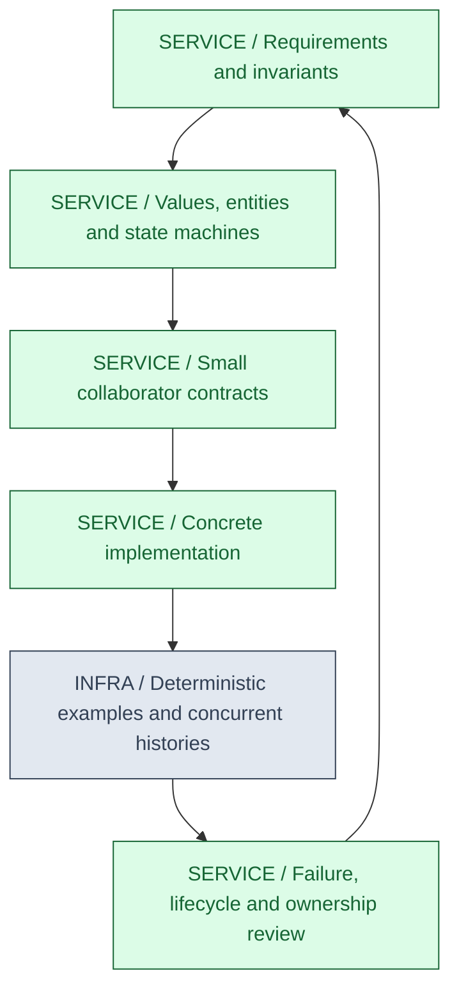

## What You Will Be Able to Explain

- Apply encapsulation, substitution, composition and SOLID to real contracts rather than slogans.
- Choose Strategy, Factory, Builder, Singleton, Observer, Decorator, Adapter, Template Method, Proxy, Chain of Responsibility, Command and State deliberately.
- Design twelve requested problems with explicit APIs, bounded assumptions, ownership and tests.
- Identify linearization points, callback hazards, expiry races, duplicate ownership and unknown external outcomes.
- Distinguish a complete local teaching model from the additional persistence, recovery, scale and security needed in production.

> [!PRODUCTION]
> **Where this lives in IntegrationHub.** Connector selection uses strategies and factories; job admission uses rate/concurrency policies; local caches and progress subscriptions have lifecycle contracts. [02](02-concurrency.md#ch02-concurrency) owns the memory model, [05](05-apis-realtime.md#ch05-apis-realtime) owns HTTP identity, [07](07-messaging.md#ch07-messaging) owns durable delivery, [08](08-security.md#ch08-security) owns trust and [10](10-system-design.md#ch10-system-design) owns distributed capacity. [25](25-architecture.md#ch25-architecture) extends local boundaries into domain architecture.

## 1. OOP, SOLID and Contracts

Encapsulation hides representation behind operations that preserve invariants. Making every field private but exposing unrestricted setters does not achieve that. An immutable value represents a fact by content; an entity represents continuity of identity through state changes. Equality, ownership and lifecycle should follow that distinction. Inheritance can express substitutability, but composition often keeps independent reasons for change separate.

Single responsibility means a coherent reason to change, not one method per class. A parking allocator should not also format invoices and send emails. Open/closed design makes a useful extension axis replaceable without changing unrelated code; it does not require an interface for every private helper. Liskov substitution means clients relying on the base contract remain correct for each implementation, including error, mutability and timing expectations.

Interface segregation keeps clients dependent on capabilities they actually use. A read-only cache consumer should not need an administrative eviction API. Dependency inversion places stable domain needs above concrete adapters: a notifier depends on a sender contract, not a vendor SDK everywhere. DI is one way to supply collaborators, not proof that the chosen abstractions are good.

Write the contract before the classes: valid input, results, errors, state transition, concurrency scope, lifetime, resource bounds and recovery behavior. For a cache, decide whether get changes recency and whether null values exist. For a scheduler, decide whether cancel can stop an already claimed task. Those decisions determine locks and APIs more directly than a pattern name.

| Principle | Use when | Avoid when |
|---|---|---|
| Encapsulated transition | Several fields must change coherently | Setters allow impossible intermediate state |
| Composition | Behavior varies independently across collaborators | Inheritance multiplies combinations of unrelated choices |
| Small interface | Multiple useful implementations or a clear boundary exist | Every class gets a matching interface without a reason |
| Immutable value | Shared observations should be stable | A mutable external object remains reachable through the value |

**Interview checks:** basic: private fields are not enough. Internals: substitution includes failure semantics. Debug: look for multiple owners of one state transition. Scenario: choose the actual extension axis before adding an interface.

## 2. Pattern Vocabulary With Consequences

Patterns name recurring design choices. They are useful when the name communicates intent and trade-offs, not when it substitutes for a contract. Several can coexist: a factory selects a strategy, an adapter translates a vendor client, and a decorator applies a bounded retry policy around it.

| Pattern and mechanism | Use when | Avoid when |
|---|---|---|
| Strategy selects an interchangeable algorithm | Connector mapping or allocation policy varies | Tiny fixed branching becomes an unnecessary hierarchy |
| Factory centralizes construction/selection | Type names/configuration choose valid implementations | Unknown types silently fall back to the wrong connector |
| Builder accumulates configuration then validates once | Many optional parameters have cross-field constraints | A two-field value gets a verbose mutable construction API |
| Singleton constrains one instance per scope | A process-scoped stateless registry has explicit ownership | It is claimed to be one instance across a cluster or used as global mutable state |
| Observer notifies registered listeners | Local change fan-out is useful | Durable messaging is implied by an in-memory callback list |
| Decorator wraps the same interface | Retry, metrics or validation should compose | Ordering and repeated effects are undocumented |
| Adapter translates between contracts | A vendor API differs from the domain port | Vendor errors/leaky types spread into the domain |
| Template Method fixes an algorithm skeleton with hooks | Subclasses truly share lifecycle and invariants | Hooks expose fragile superclass state or substitution fails |
| Proxy controls access to another object | Lazy access, remoting or authorization needs mediation | Calls bypass the proxy while advice is assumed to run |
| Chain of Responsibility passes through ordered handlers | Validation/routing stages may handle or delegate | Order-dependent behavior is hidden and no handler owns failure |
| Command packages an operation | Queuing, scheduling or auditing an action is useful | A lambda is mistaken for a serializable durable job |
| State delegates behavior by lifecycle state | Allowed transitions differ materially by state | Classes obscure a small, clearer enum transition table |

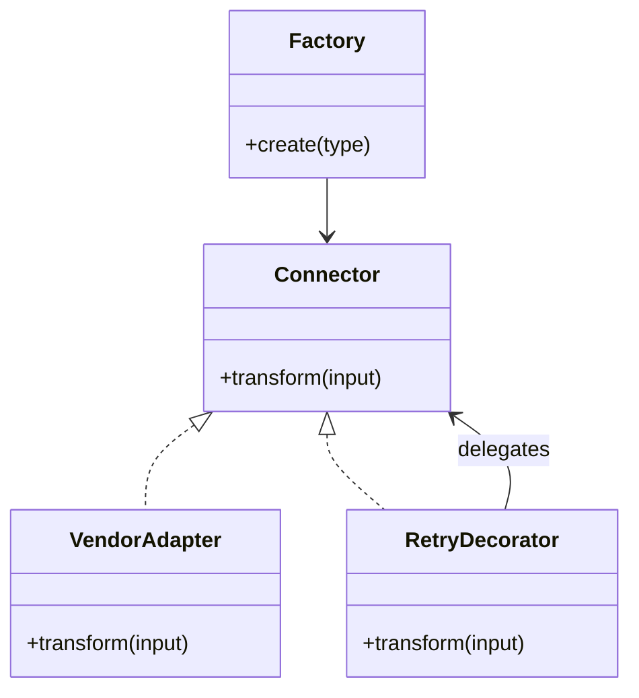

The lab implements Strategy/Factory/Decorator in the connector example, Observer in pub/sub, Command in scheduling and explicit State enums in dispatch. Builder, Singleton, Adapter, Template Method, Proxy and Chain are explained alternatives, not artificially inserted into every exercise. [03](03-spring.md#ch03-spring) explains real Spring proxy boundaries, including self-invocation.

> [!DECISION]
> **Use the smallest structure that explains the behavior.** An enum and transition function can be a better State implementation than five classes. A constructor can be a better Builder. Show the growing requirement that would justify the more elaborate form.

## 3. LLD 1: LRU Cache

**Requirements/API:** fixed positive entry capacity; put inserts or replaces; get returns an optional value and makes a hit most recently used; null keys/values are rejected. Capacity bounds entry count, not bytes. The cache is process-local and does not load missing values or expire entries.

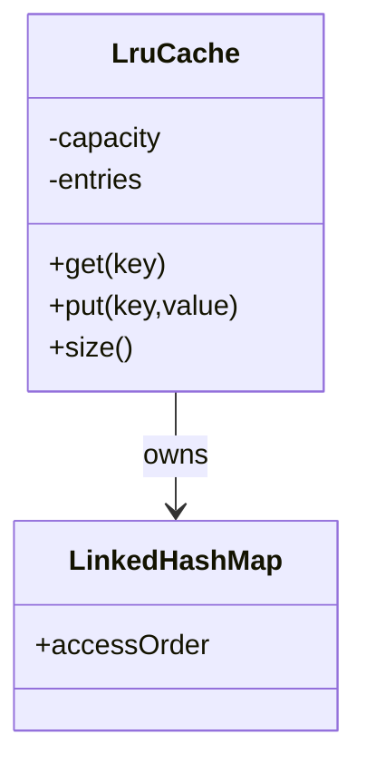

**Mechanism:** an access-ordered LinkedHashMap maintains the least-recent entry at the iteration head. A hit moves the entry, insertion appends, replacement updates recency, and overflow removes the first key. This reuses the standard library rather than inventing a linked list. The LruCache implementation in LldLab.java synchronizes get, put and size on one monitor because a successful get mutates recency.

**Concurrency/failure:** insertion and eviction happen within the same critical section, so a completed operation leaves size within capacity. Returned values are not deep copies; callers must use immutable values or provide their own ownership rule. A slow loader should not be added inside this monitor. A production weighted cache, expiry and single-flight loader are separate requirements and may justify an established cache library.

**Tests:** testLru covers hit recency, eviction of the untouched key, replacement without growth and invalid capacity. Add concurrent history testing when a JDK exists; the current tests do not prove contention performance. IntegrationHub uses this shape for bounded local metadata, not authoritative job state.

| Choice | Use when | Avoid when |
|---|---|---|
| Access-ordered map plus one lock | Small local cache needs a clear invariant | High contention, weight-based eviction or advanced expiry require a mature cache |

**Interview checks:** basic: get changes order. Internals: eviction must be atomic with insertion. Debug: unsynchronized reads can corrupt recency assumptions. Scenario: add a loader outside the lock with separate duplicate-load coordination.

## 4. LLD 2: Token-Bucket Rate Limiter

**Requirements/API:** positive capacity and finite refill rate; allow(cost) admits atomically if enough tokens exist; refill never exceeds capacity. The injected clock returns monotonically increasing abstract ticks. This is one local bucket, not a globally distributed per-tenant limit or a concurrency semaphore.

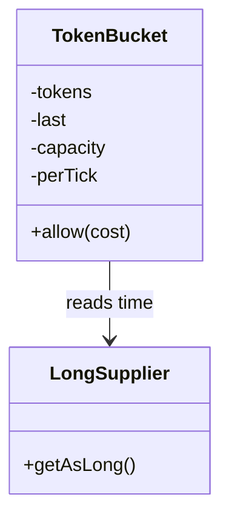

**Mechanism:** read time, reject backwards movement, compute elapsed refill, clamp tokens to capacity, then deduct cost only if sufficient. All steps share one synchronized operation. The double token representation is adequate for this model's simple test values; precision and time-unit choices need explicit consideration for long-running fractional production budgets.

**Concurrency/failure:** separate check and decrement would let two callers spend the same token. A monotonic time source prevents wall-clock adjustment from minting arbitrary capacity. Per-key buckets additionally need bounded registry size and idle eviction. IntegrationHub must combine provider and tenant limits with the global capacity policy in [10](10-system-design.md#ch10-system-design); a bucket per pod cannot enforce a fleet-wide limit by itself.

**Tests:** testRateLimiter exhausts the initial burst, verifies exact test-clock refill, verifies the capacity clamp after a long advance and rejects costs larger than capacity. No sleeps or throughput measurements occur.

| Choice | Use when | Avoid when |
|---|---|---|
| Local synchronized bucket | One process owns the quota or receives an allocated share | Autoscaling independently multiplies a claimed global limit |

**Interview checks:** basic: burst and sustained rate differ. Internals: refill/check/spend form one operation. Debug: inspect clock units and replica scope. Scenario: use shared atomic authority or explicit regional allocations for a global contract.

## 5. LLD 3: Parking Lot

**Requirements/API:** fixed spots have SMALL or LARGE capacity; park(vehicle,size) returns a ticket or no space; one vehicle may occupy one spot; leave(ticket) releases only the matching current ticket. Pricing, reservations and multiple entry gates over a database are excluded from this local allocator.

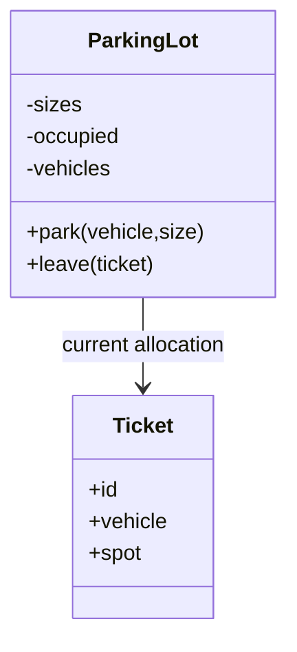

**Mechanism:** scan for the first free compatible spot, allocate a monotonically numbered ticket and update both spot and vehicle indexes atomically. Large vehicles cannot use small spots. Leave compares the full current ticket before removing both indexes, preventing an old ticket from freeing a spot now owned by someone else. The first-fit policy is deliberately simple and can waste large spaces if small vehicles reach them first; an allocation Strategy could improve that policy.

**Concurrency/failure:** one monitor covers duplicate-vehicle detection, selection and assignment. In production, concurrent gates require a shared transactional uniqueness/reservation rule and ticket identity durable across restarts. The local sequence is not globally unique and physical occupancy may disagree with software after sensor failures.

**Tests:** testParking checks size compatibility, capacity exhaustion, duplicate vehicle rejection, idempotent failure of repeated release and reuse of released space. IntegrationHub's analogous invariant is allocating scarce worker slots without two jobs owning the same lease.

| Choice | Use when | Avoid when |
|---|---|---|
| First compatible spot | Small bounded allocator favors clarity | Fragmentation or preferences justify a smarter allocation policy |

**Interview checks:** basic: ticket is allocation identity. Internals: two indexes change together. Debug: stale release must compare current ownership. Scenario: moving from one gate to many requires shared authority, not more local locks.

## 6. LLD 4: Elevator Simulation

**Requirements/API:** one simulated car, integer floors from ground to a configured top, internal destination requests and one deterministic step at a time. Doors must close before movement. Pending floors are unique. This is not a physical controller, safety system, real-time design or multi-car dispatch algorithm.

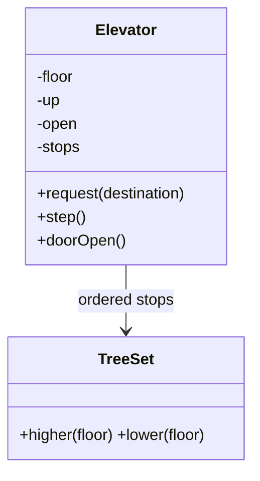

**Mechanism:** a step first closes an open door without moving. If the current floor is requested, it opens there. Otherwise choose the next stop in the current direction, reverse when none remains in that direction and move one floor. Arrival at a requested floor opens the door. The ordered set supports nearest-stop selection without scanning all possible floors.

**Concurrency/failure:** request and step are serialized under one monitor. The model does not guarantee fairness under an infinite stream of new requests in one direction; an age/deadline policy would be an extension. A multi-car version separates assignment strategy from each car's state machine. Hardware interlocks, emergency behavior and sensors are out of scope and must never be inferred from this simulation.

**Tests:** testElevator checks stops in ascending order, no movement while closing a door, reversal toward a lower pending stop and invalid floor rejection. IntegrationHub uses the same separation between job scheduling policy and worker lifecycle, not the physical-domain details.

| Choice | Use when | Avoid when |
|---|---|---|
| Ordered-stop simulation | Explain policy versus state transitions | Real elevators or hard-real-time safety require certified domain engineering |

**Interview checks:** basic: door state constrains movement. Internals: ordering policy and transition validity differ. Debug: a movement tick must not skip closing. Scenario: add a scheduler above several cars rather than entangling their state.

## 7. LLD 5: Notification Service

**Requirements/API:** submit(id,payload) coalesces identical submissions and rejects conflicting content; deliver(id,sender) claims one queued notice, sends it and records local success. States are QUEUED, SENDING and SENT. This local example has no durable outbox or actual email/SMS integration.

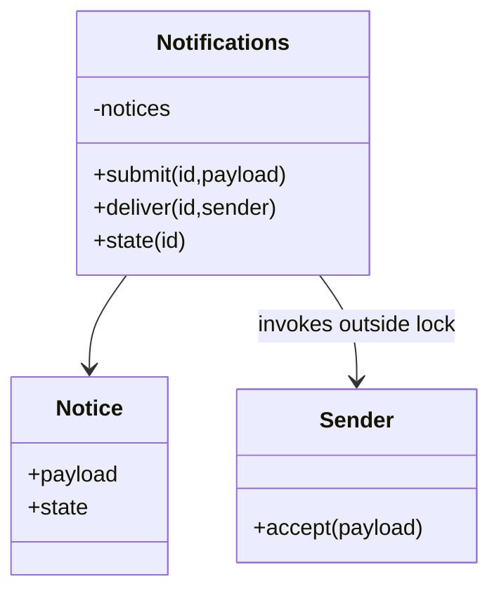

**Mechanism:** submission uses put-if-absent under a monitor. Delivery marks SENDING while holding the lock, releases the lock for the injected callback, then records SENT or QUEUED in finally. A second delivery cannot claim a SENDING or SENT notice. The payload is immutable text, so callbacks do not mutate internal state.

**Concurrency/failure:** callback isolation prevents a slow provider from holding the global monitor, but a process crash loses this in-memory state. A thrown sender can have an unknown remote outcome: resetting to QUEUED is safe only under the lab's side-effect-free/failure-before-effect assumption or a provider idempotency contract. The webhook model below makes UNKNOWN explicit. Production notification delivery needs [07's outbox and receipt design](07-messaging.md#ch07-messaging), retention and provider-specific reconciliation.

**Tests:** testNotifications checks identical submission, content conflict, failure returning to queued, successful retry and no resend after local completion. IntegrationHub uses this for the conceptual completion-notification workflow, not a claim of exactly-once email.

| Choice | Use when | Avoid when |
|---|---|---|
| In-process sender port | Test ownership and failure transitions | A callback exception is assumed to prove no remote effect |

**Interview checks:** basic: submission identity differs from attempt identity. Internals: claim before releasing the lock. Debug: callback failure can be uncertain. Scenario: store durable intent and use stable provider keys before real delivery.

## 8. LLD 6: Logger Framework

**Requirements/API:** immutable minimum level and sink list; log(level,message) filters lower levels, sends a LogEvent to each sink and reports the number of runtime sink failures. A failing sink must not prevent later sinks from receiving the event. The example is synchronous and intentionally contains no background queue or file rotation.

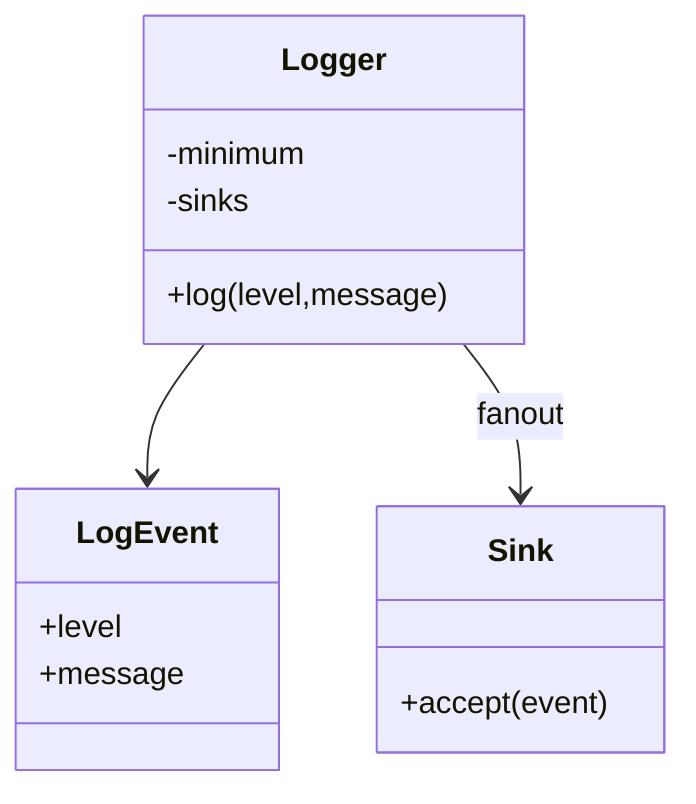

**Mechanism:** compare severity, create one immutable event, iterate an immutable snapshot of sinks and count RuntimeExceptions. Do not log a sink failure through the same failing logger recursively. Production systems normally use mature logging facades/backends; this exercise exists to expose filtering, fan-out and failure ownership.

**Concurrency/failure:** the logger's configuration is immutable, but sink thread safety is a separate contract. Concurrent callers may invoke the same sink at once; the test's ArrayList sink is used only sequentially. An asynchronous logger would need a bounded queue, overflow policy, shutdown/drain rules and a decision about audit events that must not be dropped. Avoid credentials and PII in message construction before formatting or sink selection.

**Tests:** testLogger checks level suppression and isolation of one failed sink from a succeeding sink. IntegrationHub's diagnostic logging can fail without blocking every job, while its restricted audit trail has a stronger persistence contract from [08](08-security.md#ch08-security).

| Choice | Use when | Avoid when |
|---|---|---|
| Synchronous immutable fan-out | Low-volume deterministic behavior is sufficient | Slow sinks must be decoupled without a defined bounded queue policy |

**Interview checks:** basic: level filtering occurs before sink work. Internals: immutable configuration does not make sinks thread-safe. Debug: recursive error logging can amplify failure. Scenario: separate best-effort diagnostics from mandatory audit evidence.

## 9. LLD 7: Task Scheduler

**Requirements/API:** one-shot tasks with unique currently pending IDs, nonnegative delay and deterministic equal-deadline order. schedule registers, cancel removes pending tasks, runDue claims all currently due tasks and executes each once locally. No background thread, cron, durable recovery or preemption is implied.

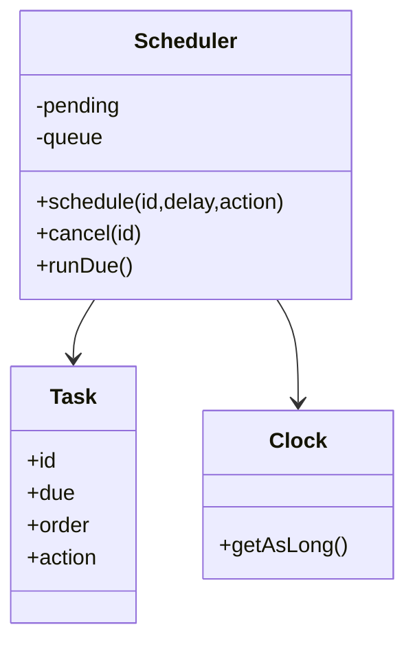

**Mechanism:** a priority queue orders by deadline then insertion sequence; a map tracks IDs for cancellation. Claiming removes due tasks from both indexes under one lock. Execution happens outside it, so task callbacks can schedule other tasks without blocking unrelated registration. Newly scheduled due tasks run on the next runDue call, not recursively inside the current claimed batch.

**Concurrency/failure:** cancel succeeds only before claim; after claim it returns false and does not interrupt work. Concurrent runDue callers claim disjoint tasks, but callbacks from separate batches may overlap. This model forgets completed IDs, so reusing an ID later is a new local task. A process crash after claim loses work; a durable scheduler needs leases, fencing and idempotent execution, as [12](12-hld.md#ch12-hld) explains.

**Tests:** testScheduler covers no early execution, deadline order, pending cancellation, one-shot behavior and reported callback failure. IntegrationHub uses the concept for retry timing; production retries need durable scheduling rather than an in-memory Runnable.

| Choice | Use when | Avoid when |
|---|---|---|
| Local priority queue | Process-lifetime scheduling is sufficient | Accepted jobs must survive process failure |

**Interview checks:** basic: cancellation has a boundary. Internals: claim and execute are distinct. Debug: inspect both indexes after cancel. Scenario: Runnable is not a durable command description across versions and restarts.

## 10. LLD 8: TTL Key-Value Store

**Requirements/API:** fixed positive capacity, positive TTL, injected monotonic clock and optional get. A value is absent at or after its deadline. put replaces an existing key with a new deadline and removes expired entries before checking capacity. No persistence, background expiry thread or LRU eviction is included.

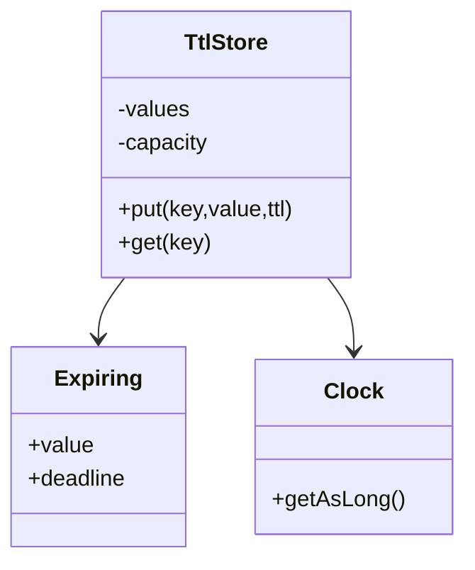

**Mechanism:** store absolute deadline computed from the injected clock using checked addition. get evaluates the current entry and lazily removes it if expired. put sweeps expired entries under the same monitor, then either replaces or adds within capacity. This simple sweep is linear in entry count; the bounded teaching store chooses clarity over an expiry heap.

**Concurrency/failure:** check and removal occur under one lock, so an old expiry observation cannot remove a replacement inserted in between. A scalable timer-based implementation needs entry generations or compare-and-remove: an expiry task created for version 1 must not delete version 2. Clock arithmetic overflow fails explicitly. Values may still be mutable references; the caller owns that contract.

**Tests:** testTtl checks visibility before expiry, equality-boundary expiry, capacity rejection, replacement lifetime and final expiration. IntegrationHub might cache short-lived metadata this way, but token revocation and security-sensitive expiry require the correct authoritative policy.

| Choice | Use when | Avoid when |
|---|---|---|
| Lazy expiry plus bounded sweep | Small store benefits from simple deterministic semantics | Large cardinality requires indexed expiry and predictable write latency |

**Interview checks:** basic: expiry boundary is explicit. Internals: old timers must not delete replacements. Debug: distinguish wall-clock time from elapsed lifetime. Scenario: select a mature cache when expiry/weight/concurrency requirements expand.

## 11. LLD 9: In-Memory Pub/Sub

**Requirements/API:** subscribe(topic,callback) returns a subscription ID; unsubscribe removes it; publish takes a snapshot and delivers to each callback in registration order for that publication. Runtime failure of one callback is counted without preventing later callbacks. No persistence, replay or global ordering across concurrent publishers is promised.

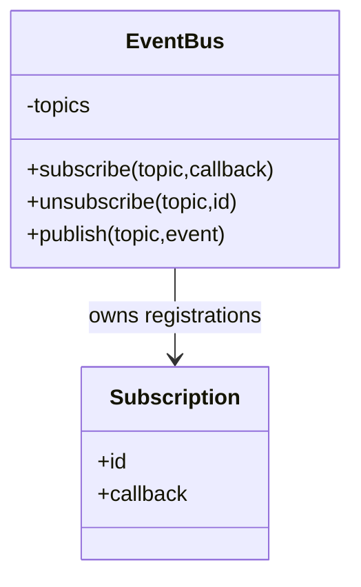

**Mechanism:** a topic owns an insertion-ordered map of callbacks. Publication copies that topic's callbacks under a lock, then invokes them outside the lock. Subscription changes do not mutate the in-progress snapshot. Empty topic maps are removed on unsubscribe to release references.

**Concurrency/failure:** unsubscribe prevents inclusion in future snapshots but cannot recall a callback already captured by a publication. Concurrent publishers can invoke the same subscriber concurrently; callbacks must be thread-safe or delivery must be serialized by a separate policy. Slow subscribers block the current synchronous publisher, so an asynchronous extension needs per-subscriber bounds, overflow and cleanup rather than an unbounded executor.

**Tests:** testPubSub covers topic isolation, fan-out with a failed callback and unsubscribe effects. IntegrationHub can use local notifications for UI-node internals, but durable job delivery belongs to [07](07-messaging.md#ch07-messaging). An Observer list is not a broker.

| Choice | Use when | Avoid when |
|---|---|---|
| Snapshot-based local bus | Transient process-local notification fits | Delivery must survive restarts or disconnected subscribers |

**Interview checks:** basic: publication snapshots define unsubscribe semantics. Internals: callbacks run outside the registry lock. Debug: retention of callbacks can retain whole object graphs. Scenario: add bounded asynchronous delivery only with a clear overflow contract.

## 12. LLD 10: Pluggable Connector Framework

**Requirements/API:** Connector exposes transform(input); Connectors selects a factory by registered type and rejects unknown types; RetryingConnector retries only a classified TransientFailure up to a fixed attempt count. The operation is a local idempotent transformation, not a network write. Real backoff, deadlines and circuit policies belong to a maintained resilience library.

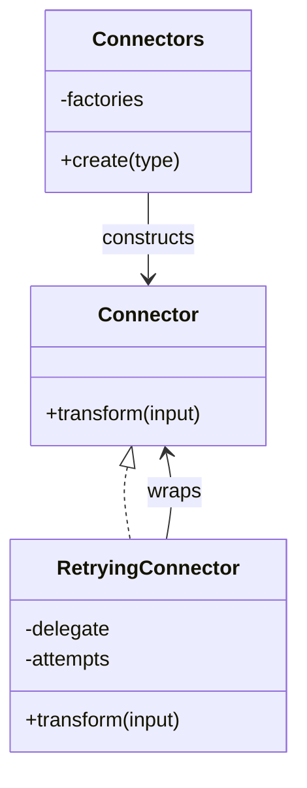

**Mechanism:** an immutable type-to-supplier registry owns construction. Each call can create a fresh strategy. The decorator loops attempts, delegates, returns immediately on success and retries only the explicit transient category. Permanent input errors pass through immediately. An Adapter would translate a real provider's API/errors into this domain contract without leaking vendor types into callers.

**Concurrency/failure:** registry configuration is immutable; constructed connectors decide their own thread safety. A decorator does not make a mutable delegate safe. Bounded attempts are necessary but not sufficient for network resilience: add elapsed budget, jitter, bulkheads and safe external idempotency through [10](10-system-design.md#ch10-system-design). Do not retry arbitrary provider mutations just because an exception says timeout.

**Tests:** testConnectors selects the upper-case strategy, arranges one transient failure then success, rejects unknown types and asserts a permanent error is attempted once. IntegrationHub's connector layer gains a replaceable algorithm and explicit policy composition, not an excuse for untrusted dynamic class loading.

| Choice | Use when | Avoid when |
|---|---|---|
| Factory plus strategy and decorator | Construction, algorithm and policy vary separately | All concerns collapse into a large type switch in every caller |

**Interview checks:** basic: factory creates, strategy executes. Internals: decorator ordering changes policy. Debug: permanent exceptions should not consume a retry storm. Scenario: adapt provider details at the edge and keep domain commands narrow.

## 13. LLD 11: Idempotency-Key Registry

**Requirements/API:** execute(tenant/operation/key,content,action) shares one result among identical concurrent calls and rejects content conflicts. A positive capacity bounds stored requests. Successful results are retained for the process lifetime; there is no TTL or eviction. Failed local computations release the entry so an eligible future attempt can retry.

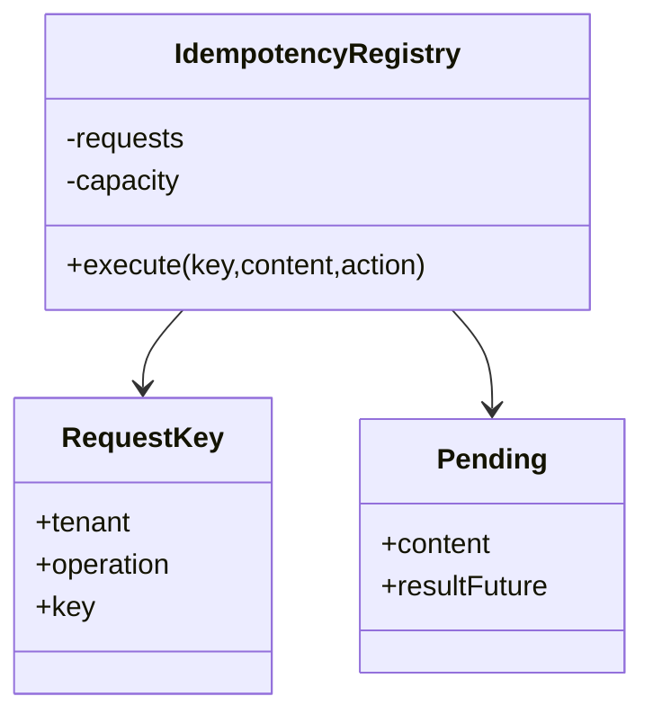

**Mechanism:** under a monitor, find or reserve a Pending result. The winner owns execution; duplicates validate content and wait on the same CompletableFuture. The owner computes outside the monitor and completes the future. On runtime failure, it completes exceptionally and removes only its own entry. This avoids running a slow callback while holding the registry lock and prevents two simultaneous owners for a successful retained key.

**Concurrency/failure:** a future can wait forever if the owner never returns, so production needs bounded execution and waiter deadlines without prematurely creating a second owner. Recursive execution for the same key from its own action can self-wait and is outside this contract. Removing a failed entry is safe only for local computations or externally idempotent actions; a remote unknown outcome cannot simply be forgotten. A durable registry must atomically couple accepted business state and identity under [05](05-apis-realtime.md#ch05-apis-realtime).

**Tests:** testIdempotency releases two caller tasks through one latch, verifies identical results and one supplier effect, rejects conflicting content, distinguishes tenant scope and rejects new work beyond capacity. Bounded Future waits and executor termination are guards, not performance measurements. No concurrent assertion has run without the JDK.

**IntegrationHub mapping:** the reservation/result contract explains duplicate job submissions; the real acceptance path moves this identity and the job/outbox effect into PostgreSQL together rather than relying on this process-local registry.

| Choice | Use when | Avoid when |
|---|---|---|
| In-memory shared future | Process-local duplicate computation needs one owner | Restart-safe HTTP acceptance or unknown external effects require durable authority |

**Interview checks:** basic: key scope is composite. Internals: reservation is the local ownership point. Debug: expired/removed pending entries can create concurrent effects. Scenario: define retention and unknown-outcome recovery before converting it into an API registry.

## 14. LLD 12: Webhook Dispatcher

**Requirements/API:** enqueue(id,payload) preserves logical identity; attempt claims due PENDING work, calls an injected WebhookSender outside the lock and classifies SUCCESS, RETRYABLE, PERMANENT or UNKNOWN. States are PENDING, IN_FLIGHT, SENT, DEAD and REVIEW. Retry attempts are bounded and scheduled using the injected clock.

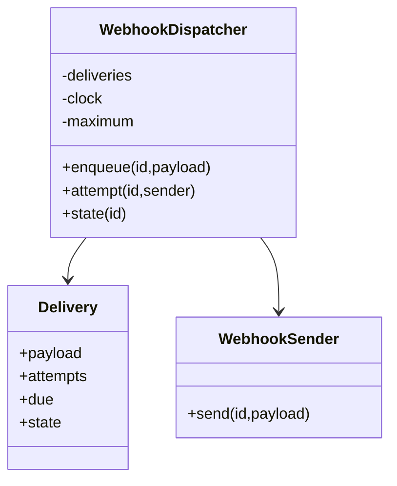

**Mechanism:** claim eligible work and increment the attempt, invoke the sender with stable identity, then transition under the lock. Success becomes SENT; a permanent error becomes DEAD; unknown outcome becomes REVIEW; a retryable result returns to PENDING only while budget remains. Due time advances by the attempt number in abstract ticks to keep the model deterministic; production requires its actual bounded backoff/jitter policy, not this toy timing rule.

**Concurrency/failure:** IN_FLIGHT prevents another local caller claiming the same delivery. A process crash loses all state; production needs durable claims/leases, attempt records and recovery. Signature creation, secret rotation, URL/redirect/DNS validation and HTTP classification belong to a maintained transport adapter and [08's policy](08-security.md#ch08-security). The model intentionally sends no network requests and contains no credentials.

**Tests:** testWebhooks covers retry not running before due time, later success, no local resend after success, UNKNOWN to REVIEW and attempt exhaustion to DEAD. A real webhook retry often remains safe only because receivers deduplicate the stable event ID; a delivery attempt ID alone cannot provide that contract.

**IntegrationHub mapping:** job completion callbacks use this classification with durable delivery records, tenant-scoped destination/secret policy and the receiver's duplicate-handling contract. The local model demonstrates transitions, not an operational callback service.

| Choice | Use when | Avoid when |
|---|---|---|
| Explicit result/state classification | Unknown and permanent failures need different recovery | Every exception is retried indefinitely with a fresh event ID |

**Interview checks:** basic: event identity survives attempts. Internals: claim and callback are separate boundaries. Debug: unknown outcome is not ordinary rejection. Scenario: transport security and durable recovery are required before this becomes a real dispatcher.

## 15. Concurrency Review and Running the Suite

Across these designs, choose a linearization point for each local atomic operation. Cache mutation/eviction, bucket refill/spend and parking allocation happen within one critical section. Notification, scheduler, pub/sub and webhook callbacks run outside registry locks after claim or snapshot. Immutable configuration does not automatically make injected collaborators thread-safe.

The common failure pattern is check-then-act across an unprotected gap. Another is holding a global lock during unbounded user/provider work. The alternative is not always a lock-free structure: an explicit claim, snapshot or shared future often gives a simpler correct protocol. Revisit interruption, timeouts, overload and shutdown when moving beyond process-local models.

**[VERIFY: compile LldLab.java with an existing JDK 21 or later using --release 21 and run all twelve test methods. Source review and publication checks do not establish Java compilation, concurrent runtime behavior or performance; the runner preflight reported NOT EXECUTED.]**

The Windows PowerShell command from workspace root is `& './docs/java-fs-guide/code/11-lld/run.ps1'`; optional -JdkHome selects an existing installation. It downloads nothing. The runner compiles LldLab.java into out/, runs the main method and records compiler and process outcomes in execution.json when a JDK exists. The current report records NOT EXECUTED.

| Model | Saved implementation | Test method |
|---|---|---|
| LRU | LruCache | testLru |
| Rate limiter | TokenBucket | testRateLimiter |
| Parking lot | ParkingLot | testParking |
| Elevator | Elevator | testElevator |
| Notification service | Notifications | testNotifications |
| Logger framework | Logger | testLogger |
| Task scheduler | Scheduler | testScheduler |
| TTL store | TtlStore | testTtl |
| Pub/sub | EventBus | testPubSub |
| Connector framework | Connectors, Connector, RetryingConnector | testConnectors |
| Idempotency registry | IdempotencyRegistry | testIdempotency |
| Webhook dispatcher | WebhookDispatcher | testWebhooks |

**[VERIFY: before adapting any model, validate actual capacity bounds, clock units/precision, collaborator thread safety, persistence, shutdown and external side-effect contracts. These are intentionally bounded interview models, not tested production cache, scheduler, identity or delivery libraries.]**

> [!MECHANISM]
> **A monitor protects only code participating in its protocol.** Returning a mutable object or calling an unsynchronized collaborator can move the race outside the protected section. State the ownership of everything that escapes.

> [!TRAP]
> **A local exactly-once supplier invocation is not a durable exactly-once external effect.** Process failure, provider uncertainty, retention expiry and distributed writers change the proof. Reuse the identity/transaction principles from earlier chapters instead of promoting a local test into a distributed guarantee.

> [!INTERVIEW]
> **Make the interviewer choose a boundary with you.** Ask whether the scheduler is durable, whether the cache has TTL, whether parking gates share a database and whether webhook timeouts are retryable. A precise small implementation beats a broad interface sketch with undefined behavior.

## Explained-Here Index and Sources

| Concepts | Explanation |
|---|---|
| OOP and SOLID | [Contracts and ownership](#ch11-principles) |
| Strategy, Factory, Builder, Singleton, Observer, Decorator, Adapter, Template Method, Proxy, Chain of Responsibility, Command, State | [Pattern decisions](#ch11-patterns) |
| LRU cache and rate limiter | [LRU](#ch11-lru) and [bucket](#ch11-rate) |
| Parking lot and elevator | [Allocation](#ch11-parking) and [simulation](#ch11-elevator) |
| Notification service and logger | [Notification](#ch11-notifications) and [logging](#ch11-logger) |
| Task scheduler and TTL store | [Scheduling](#ch11-scheduler) and [expiry](#ch11-ttl) |
| Pub/sub and connector framework | [Subscriptions](#ch11-pubsub) and [strategies](#ch11-connectors) |
| Idempotency registry and webhook dispatcher | [Ownership](#ch11-idempotency) and [delivery](#ch11-webhooks) |

Library references for verification: [LinkedHashMap Java 21](https://docs.oracle.com/en/java/javase/21/docs/api/java.base/java/util/LinkedHashMap.html), [PriorityQueue Java 21](https://docs.oracle.com/en/java/javase/21/docs/api/java.base/java/util/PriorityQueue.html) and [CompletableFuture Java 21](https://docs.oracle.com/en/java/javase/21/docs/api/java.base/java/util/concurrent/CompletableFuture.html). Saved code is original teaching code and contains no copied library implementation.

## Related Chapters

Return to [00](00-master-map.md#ch00-master-map). Link [01 Java](01-java-jvm.md#ch01-java-jvm), [02 concurrency](02-concurrency.md#ch02-concurrency), [03 proxies](03-spring.md#ch03-spring), [05 API contracts](05-apis-realtime.md#ch05-apis-realtime), [07 durable messaging](07-messaging.md#ch07-messaging), [08 security](08-security.md#ch08-security), [10 system design](10-system-design.md#ch10-system-design), [12 distributed cases](12-hld.md#ch12-hld), [19 tests](19-testing.md#ch19-testing) and [25 architecture](25-architecture.md#ch25-architecture). Generated links are reciprocal.

## One-Page Cheat Sheet

**Contracts:** name valid inputs, state, results, errors, lifetime, bounds and concurrency. Encapsulation protects invariants; substitution includes failures and mutability. Use composition for independently varying behavior.

**Patterns:** Strategy executes, Factory creates, Builder validates complex construction, Adapter translates, Decorator wraps, Proxy mediates, Observer fans out, Command packages action, State constrains lifecycle. Singleton is scoped, not cluster-wide. Template Method and Chain need explicit ordering/substitution rules.

**Atomic local work:** LRU get mutates recency; bucket refill and spend belong together; allocation updates all indexes atomically; TTL removal must not delete a replacement. A bounded map counts entries, not memory bytes.

**Callbacks:** claim or snapshot under lock, execute outside. Cancel/unsubscribe has a boundary after which work may still run. Immutable registries do not make callbacks thread-safe. Bound queues before adding asynchronous delivery.

**Identity:** local idempotency reserves one owner and shares a result; webhook IDs survive attempts. Unknown external outcomes need explicit review or provider idempotency. Local state disappears on process failure.

**Evidence:** all twelve implementations and test methods are saved, but Java compilation/execution remains NOT EXECUTED. They are complete for the stated local contracts, not production systems or a physical elevator controller.

## Interview Corner

### Basic: When Is an Interface Useful?

When it expresses a stable capability across useful implementations or an ownership boundary. It is not automatically useful merely because a class exists; explain the extension or testing need.

### Internals: What Is a Linearization Point?

A point at which a concurrent operation can be treated as taking effect atomically in its specified history. In the local models, lock-protected mutation or reservation supplies that point; it does not establish disk durability.

### Trace/Debug: Why Does a Synchronized Class Still Race?

Some mutable state may escape, a collaborator may be unsynchronized, or a check and later action may use separate critical sections. Inspect the whole protocol, not the keyword on one method.

### Scenario: How Would You Make the Scheduler Durable?

Persist a command description and due time, claim with a recoverable lease/fencing policy, and make effects idempotent. A serialized Runnable or an in-memory queue is not a sufficient recovery contract.

### Basic: Strategy Versus State?

Strategy selects an algorithm under a stable interface; State varies behavior with lifecycle and allowed transitions. Either can use classes or simpler representations depending on complexity.

### Internals: Why Invoke Callbacks Outside a Registry Lock?

Callbacks can block, reenter or fail. Claiming/snapshotting first preserves ownership while keeping registry operations available. The resulting cancellation and concurrent-callback semantics must be documented.

### Trace/Debug: An Expiry Task Deleted a Fresh Value.

The task probably identified only the key, not the version it was created for. Compare current entry identity/generation before removal, or evaluate expiry under the same lock as replacement.

### Scenario: Where Does Local Idempotency Stop Helping?

At process loss, multiple independent registries, retention expiry or uncertain external effects. Move identity and business state to the appropriate durable authority and define provider reconciliation rather than claiming a shared future solves distribution.