
# 12 / Twelve System Design Case Studies

**The same technology can solve different problems under different guarantees.** A cache used to speed a job list is not an authority for spending money. A queue that distributes jobs is not a broadcast to every browser node. These twelve case studies apply [10's framework](10-system-design.md#ch10-system-design) and [11's local contracts](11-lld.md#ch11-lld) to distributed boundaries. IntegrationHub is fictional throughout.

**Version assumptions:** Java 21, Spring Boot 4.0.x / Cloud 2025.1.x, PostgreSQL 17, Kafka 4.x and Kubernetes 1.34 remain the illustrative baseline. Redis, Elasticsearch, identity providers, payment providers and managed infrastructure are options whose exact versions/configuration must be selected separately. These are designs, not deployed implementations.

**Execution evidence:** no HLD service, broker, database, provider or load test was executed. Every number below is an explicit hypothetical assumption or arithmetic consequence, not a benchmark. Diagrams and links are publication-tested; that does not validate capacity or availability. Each case has requirements, an estimate, APIs, a data model, architecture, flow/deep dive, trade-offs, failures and an IntegrationHub mapping.

**[VERIFY: validate all service/version capabilities, topology limits, data-retention policies, security controls and operational capacity against the selected implementations before building these designs. No HLD deployment, load test, failover rehearsal or provider integration ran.]**

## Big Picture

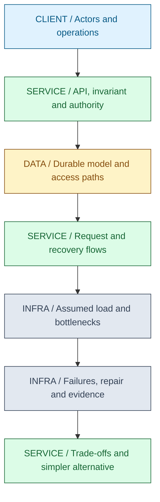

## What You Will Be Able to Explain

- Design URL shortening, global rate limiting, notifications and token/session services with explicit authority.
- Design bulk sync and webhook pipelines that survive duplicates, cursor failures and unknown provider outcomes.
- Design wallet/ledger operations without confusing a cached balance with authorized spendable state.
- Design distributed caching, gateways, durable scheduling, search and live status with correct recovery boundaries.
- Use estimates to choose bottlenecks and trade-offs while keeping unmeasured capacity claims conditional.
- Trace each design back to one coherent IntegrationHub rather than twelve unrelated technology lists.

> [!PRODUCTION]
> **Where this lives in IntegrationHub.** The cases are views of the same system: links point to shared reports, rate limits protect providers, notifications and webhooks report work, identity gates every operation, bulk sync performs it, optional billing motivates wallets, and cache/gateway/scheduler/search/live-status services support the workflow. Start with the simplest subset needed; the teaching catalog is not a mandate to deploy twelve microservices.

## 1. URL Shortener

### Requirements and Estimate

Create tenant-owned short links, resolve a code to a permitted destination, expire or disable links, and optionally record aggregate usage. Public link access and authenticated private report links are different products; choose which is required. A random-looking code is not authorization for private data. The invariant is that one active code resolves to one authoritative link record and disabled/expired links stop being served within the stated cache bound.

Assume 20 creates/s and 20,000 redirects/s, continuously, with 300 bytes of raw link metadata. Creates are 1,728,000/day and raw new metadata is 518,400,000 bytes/day before indexes, replication or analytics. The 1,000:1 read/write ratio suggests caching popular redirects. It says nothing yet about hot-key distribution or abuse volume.

### API and Data Model

POST /v1/links accepts destination and optional expiry under a tenant-scoped idempotency key; GET /r/{code} resolves; DELETE /v1/links/{id} disables an authorized link. Return an explicit creation resource. Redirect status/cache policy must match whether destinations can change; do not permanently cache a mutable redirect accidentally.

Link stores code, tenant_id, destination, visibility, expires_at, disabled_at and version, with a unique code constraint. Creation identity is separate from code uniqueness. Usage events are asynchronous records keyed by link and event identity, with privacy-aware retention; do not update one hot counter synchronously on every redirect.

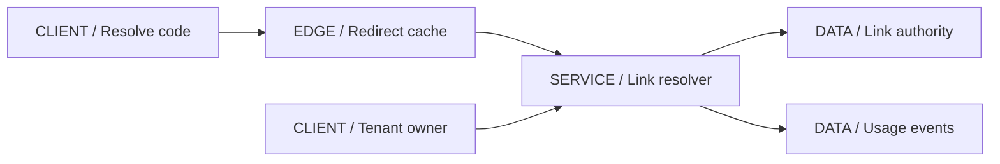

### Flow, Deep Dive and Failures

Creation validates allowed URL schemes and destination policy, generates a code, inserts under uniqueness and retries a collision without creating duplicate business requests. Random code size determines collision probability and guessability but must be chosen from expected population/security requirements, not folklore. Resolution checks cache or authority, enforces visibility/expiry and returns the destination. Private links still pass through authentication/authorization.

The main deep dive is revocation versus cache lifetime. A moderation action must invalidate or version cached entries and account for CDN/browser behavior. Short negative caching can protect nonexistent-code traffic, but creation must not remain hidden behind a long negative TTL. Rate-limit creation and abusive resolution, keep analytics off the critical path, and decide what happens when the authority is unavailable: bounded stale public redirects may be acceptable, private/disabled-sensitive decisions may need denial.

| Design choice | Use when | Avoid when |
|---|---|---|
| Cached public redirect | Read ratio and bounded staleness justify it | Strict immediate revocation is promised without a coherent invalidation path |
| Authenticated resolution | Link exposes private reports | Code entropy is treated as the only access control |

**IntegrationHub mapping:** links can reference exported report resources; report access stays in [08](08-security.md#ch08-security), not in possession of a short code. **Acceptance check:** disable a hot cached link, exercise expiry and collision retries, and verify analytics failure does not block authorized redirects.

## 2. Rate-Limiter Service

### Requirements and Estimate

Enforce per-tenant, per-operation and provider budgets across gateway/worker replicas, with explicit burst semantics and degraded behavior. Separate rate from active concurrency and long-term quota. The invariant is that concurrent decisions cannot spend the same shared allowance beyond the chosen approximation/allocation contract.

Assume 50,000 checks/s and 100,000 active bucket keys. At an assumed 128 bytes of raw state per bucket, payload state is 12.8 MB before allocator, key, replication and protocol overhead. Network round trips at 50,000/s can matter more than raw bucket memory. A hot global provider bucket may serialize a large share of traffic even when tenant keys shard well.

### API and Data Model

An authenticated internal POST /decisions takes a trusted subject, dimension, cost and policy version and returns allow/deny plus retry guidance. The public caller does not get to choose a cheaper policy or forge cost. If decision retries are deduplicated, the gateway-owned decision identity must be bound to one request so clients cannot reuse an allowed identity for unlimited new work.

Bucket state includes scope key, tokens, last_refill, capacity/rate policy version and expiry. Policy configuration has owner, revision and effective time. A separate concurrency lease can hold active capacity with bounded expiry/release; a token bucket alone cannot count in-flight work accurately.

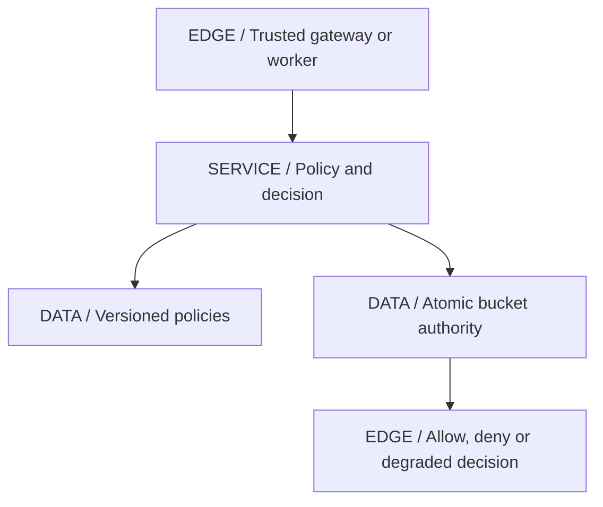

### Flow, Deep Dive and Failures

Resolve policy, atomically refill/check/spend at the authoritative bucket and return the decision. Avoid separate GET and SET across a network race. For very high scale, allocate bounded shares to nodes/regions, accepting unused capacity and bounded overshoot according to the allocation design. Policy changes must define how existing tokens are clamped or migrated; a lower limit should not leave an old larger burst indefinitely available.

Limiter outage policy depends on the protected resource. Fail-open might preserve low-risk read availability but can expose expensive provider calls; fail-closed protects budget but couples API availability to the limiter. A bounded local fallback can soften either extreme only if its aggregate allowance is understood. Monitor denied requests, decision latency, authority errors and actual downstream consumption so a broken limiter is distinguishable from legitimate demand.

| Design choice | Use when | Avoid when |
|---|---|---|
| Shared atomic bucket | Strict global accounting fits coordination cost | Latency or one hot key dominates without a plan |
| Allocated local shares | Low latency and bounded approximation are acceptable | Independent local buckets claim to enforce one exact global limit |

**IntegrationHub mapping:** tenant API admission and external connector quotas use separate dimensions from [10](10-system-design.md#ch10-system-design). **Acceptance check:** concurrent requests at a boundary, policy reduction, node scaling and authority outage must obey the documented allowance/degraded policy.

## 3. Notification System

### Requirements and Estimate

Deliver completion/failure messages through selected channels while respecting tenant preferences, opt-outs and template versions. Accept durable intent before reporting accepted. Do not promise exactly-once email/SMS receipt: provider timeouts and recipient systems are outside the local transaction. Preserve one logical notification identity across attempts.

Assume 100,000 triggering events/day and three channel deliveries per event: 300,000 delivery intents/day, about 3.47/s average. A hypothetical 100-times burst is roughly 347/s, so average rate alone is an inadequate worker target. Provider quotas and retry distribution must be measured; this burst multiplier is an assumption, not an observed pattern.

### API and Data Model

POST /notifications accepts event/template/recipient references and a logical key; GET /notifications/{id} reports per-channel state. Preference updates are authenticated and versioned. Internal consumption of a JobCompleted event uses a receipt to avoid creating duplicate notification intents.

Notification stores tenant, event ID, template version, recipient reference and content inputs; Delivery stores channel, stable delivery ID, status, attempts and next_due; Attempt records sanitized provider outcome and correlation. Preferences have version and applicability rules. Decide whether preference evaluation happens at creation, send time or both, especially for opt-out changes.

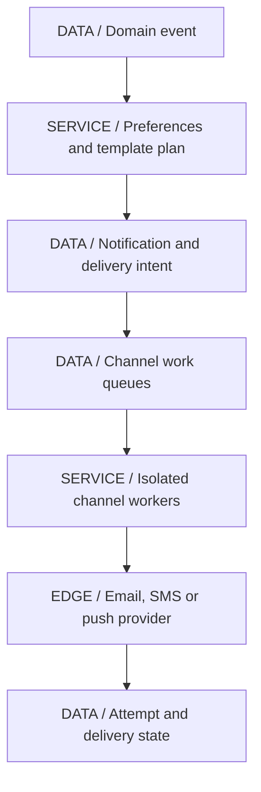

### Flow, Deep Dive and Failures

Atomically record the consumed event receipt and notification/channel intents, then dispatch through durable publication. Workers claim due work, resolve permitted recipient/secret data, render the selected template and call the provider with bounded deadlines. Persist outcomes and retry only under policy. A provider receipt may establish accepted delivery, not that a human read it.

The deep dive is duplicate and preference semantics. Stable delivery IDs enable provider deduplication where supported; otherwise reconcile or tolerate bounded duplicate notifications rather than claim impossible certainty. Templates must be versioned so retries do not send different content unexpectedly. Channel bulkheads keep SMS outages from blocking email, and secret/personal-data controls apply to templates, logs and DLQs. Track oldest delivery age and permanent failures, not only successful HTTP calls.

| Design choice | Use when | Avoid when |
|---|---|---|
| Channel-specific workers | Providers have independent latency/quotas | One shared pool lets a slow channel starve all messages |
| Versioned templates and inputs | Retries should preserve content meaning | A retry silently changes after an unrelated template deployment |

**IntegrationHub mapping:** this extends [11's notification model](11-lld.md#ch11-lld) with [07's durable intent](07-messaging.md#ch07-messaging). **Acceptance check:** duplicate domain events, provider success with lost response, opt-out change and template rollout produce the documented per-channel outcomes.

## 4. OAuth/Token and Session Service

### Requirements and Estimate

Provide standard user login/delegation and workload access using a maintained identity platform, not a custom OAuth protocol. Resource servers validate access credentials and independently authorize tenant resources. Session/refresh revocation latency, key rotation and identity-provider outage behavior are explicit requirements.

Assume 100,000 continuously active sessions with a 900-second access-token lifetime and uniformly distributed renewal: about 111 renewals/s. This excludes initial logins, retries and synchronized expiry. JWT validation can occur locally at APIs, while refresh remains an authoritative state-changing flow. It is incorrect to size issuance as one token per API request by default.

### API and Data Model

Use provider-standard authorization, token, revocation/introspection and discovery/JWKS endpoints as applicable. The BFF exposes login callback, session status and logout under its browser security policy. Do not invent a generic GET token endpoint or accept arbitrary issuer metadata supplied by a caller.

Client registrations bind redirect URIs, client type and allowed flows. Session records bind issuer/subject, tenant context, authentication time and revocation state. Refresh families track hashed/otherwise securely protected handles, replacement/reuse state, expiry and device/session association. Signing keys have active and verification-overlap lifecycle metadata; private keys remain under controlled key management.

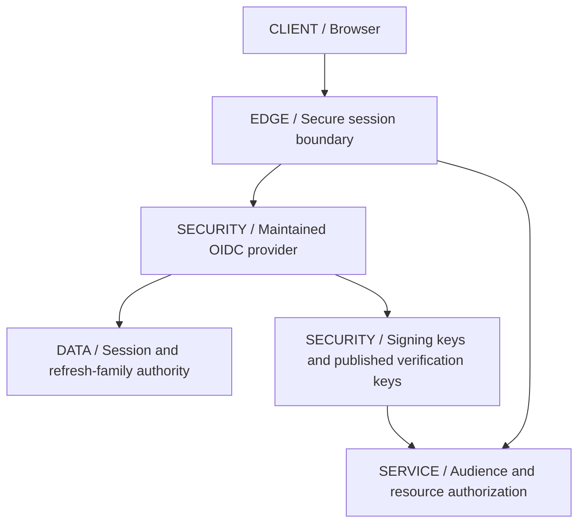

### Flow, Deep Dive and Failures

Follow [08's code/PKCE sequence](08-security.md#ch08-security): correlate browser flow, redeem code, validate identity response and establish a bounded session. APIs accept the intended access token or trusted session-derived context, not an ID token meant for the client. Refresh rotation consumes an old handle and establishes the replacement atomically under family policy.

Key rotation is the deep dive: publish new verification material before relying on it, issue under the new key, retain old keys only as needed for accepted tokens and handle compromised-key revocation differently from routine rotation. Bound JWKS refresh to avoid a bad key ID causing a request storm. During provider outage, already valid locally verifiable access tokens may continue under policy while new login/refresh fails; do not silently extend expired credentials. A regional failover must preserve refresh ownership or intentionally revoke/re-authenticate, not issue from divergent families.

| Design choice | Use when | Avoid when |
|---|---|---|
| Managed/maintained IdP | Standard flows and operational controls are required | A hand-rolled token endpoint replaces mature protocol validation |
| Local JWT validation | Bounded token lifetime and revocation trade-off fit | Immediate revocation is required but no live policy mechanism exists |

**[VERIFY: confirm identity-provider protocol conformance, refresh rotation/reuse behavior, client registration, key storage and regional recovery semantics for the actual provider. No authorization-server, OIDC or session failover test was executed.]**

**IntegrationHub mapping:** Auth/Token and BFF responsibilities stay separate from connector authorization. **Acceptance check:** wrong audience, simultaneous refresh, rotated/unknown keys, deprovisioning and provider outage must fail or degrade exactly as documented.

## 5. Bulk Data Sync Pipeline

### Requirements and Estimate

Accept a tenant's finite sync request, preserve source identity, map/validate records, write safe target effects, report progress and restart without silently skipping input. Partial success, quarantine, cancellation and source mutation policies must be explicit. An API 202 means durable acceptance, not completed sync.

Assume ten million input records averaging 2,000 bytes: 20 GB raw input. At an assumed sustainable 5,000 records/s, the processing-only lower bound is 2,000 seconds, about 33.3 minutes. Network, provider limits, retries, validation and checkpoints can increase it. This arithmetic does not establish that any connector can sustain that rate.

### API and Data Model

POST /sync-jobs uses tenant/operation/key plus content binding; GET /sync-jobs/{id} reports accepted/running/partial/completed/failed; cancellation is an authorized state transition with a documented point after which effects may already exist. The progress stream is a separate optional read path.

Job contains tenant, source snapshot/reference, mapping version, status and version. InputManifest/Partition contains immutable selection and cursor range. ItemResult or a suitable aggregate/checkpoint representation records idempotent effect identity. Checkpoint, processed-event receipts, progress and next outbox intent commit together where they share an authority. Quarantine stores source identity and sanitized failure detail under retention policy.

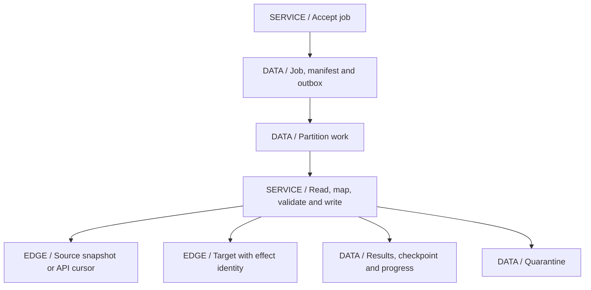

### Flow, Deep Dive and Failures

Resolve immutable input selection, partition it into disjoint work ranges and dispatch through an outbox. Workers obtain permitted secret references, obey tenant/provider budgets, read bounded pages/chunks, apply mapping and write under target idempotency. Commit progress only after the defined output boundary. A resumed reader must interpret the saved cursor against the same input; offset pagination over a changing source is not a reliable restart protocol.

The deep dive is output/checkpoint atomicity. A local transactional sink can commit effect and checkpoint together. An external target needs stable effect keys, result reconciliation or an explicitly accepted duplicate policy. A timeout may leave the target changed even when the checkpoint remains old. Cancellation stops future work cooperatively; it cannot erase already committed target changes. Expose partial outcomes instead of pretending rollback crossed every provider.

| Design choice | Use when | Avoid when |
|---|---|---|
| Chunked finite batch | Input identity and restart positions are stable | A changing source is traversed with untracked shifting offsets |
| Per-provider bulkheads | One target's quota/latency should not block others | Worker count grows without respecting target capacity |

**IntegrationHub mapping:** this is the golden-thread connector workflow across [05](05-apis-realtime.md#ch05-apis-realtime), [07](07-messaging.md#ch07-messaging) and [13](13-integration.md#ch13-integration). **Acceptance check:** restart before/after target effect, expire a source cursor, duplicate a work message and cancel during an in-flight provider call.

## 6. Webhook Delivery Platform

### Requirements and Estimate

Deliver committed events to tenant-registered destinations with authentication, bounded retries, per-destination isolation and replay. Define whether ordering is required per resource, whether receivers deduplicate and how retention limits manual replay. A successful HTTP response means receiver acceptance under its contract, not proof of every downstream effect.

Assume 500,000 source events/day and two destinations per event: one million initial deliveries/day, about 11.57/s average. If every delivery needed three attempts, the upper scenario is three million attempts/day, about 34.72/s before bursts. This is a scenario bound, not an observed retry distribution. Payload and signature overhead determine egress separately.

### API and Data Model

Tenant APIs register/rotate/disable endpoints, inspect delivery state and request authorized replay. Internal delivery workers consume event/destination identities. Endpoint changes are versioned; decide whether existing queued work follows the original endpoint version or the new one.

Endpoint stores authorized tenant, destination policy, secret reference and version. Event stores immutable logical ID, aggregate ID/version and safe payload. Delivery is unique by event and subscription identity; Attempt tracks due time, lease owner, status, deadline and provider result. Preserve logical event identity across attempts while assigning attempt IDs for diagnostics.

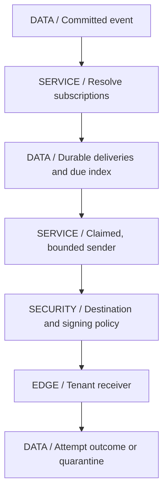

### Flow, Deep Dive and Failures

Plan durable deliveries, claim due items with bounded leases, validate destination at connection time, sign the agreed raw payload/timestamp/identity under the endpoint's key version, send with a deadline and record outcome. Validate redirects and DNS resolution according to egress policy. Registration-time URL checks alone do not prevent a later destination from reaching internal infrastructure.

Unknown outcome is the central trade-off. The receiver may commit then lose the response. Retrying with the same logical event ID allows receiver deduplication; without that contract duplicates remain possible. Ordering can be preserved by serializing a subject's deliveries, but a poison event then blocks later ones. Moving it aside changes the guarantee and needs explicit receiver behavior. Retries use jitter and budgets; hot/slow endpoints get separate limits so they cannot occupy every sender.

| Design choice | Use when | Avoid when |
|---|---|---|
| Per-destination isolation | Third-party receivers vary in health | One slow tenant stalls all delivery |
| Signed at-least-once delivery | Receiver can verify origin and deduplicate | A signature is mistaken for exactly-once processing |

**IntegrationHub mapping:** this production design extends [11's dispatcher](11-lld.md#ch11-lld), [08's SSRF/secret controls](08-security.md#ch08-security) and [07's replay policy](07-messaging.md#ch07-messaging). **Acceptance check:** receiver commits then times out, DNS changes, keys rotate, replay is duplicated, and one endpoint remains slow for hours.

## 7. Payment/Wallet With Idempotency

### Requirements and Estimate

Represent money movement as explicit state and balanced ledger entries, reject unauthorized/invalid currency operations and prevent duplicate accepted transfers. Available balance, booked balance and held funds are different values. Never infer spendable funds solely from a cache or asynchronously updated search view. External gateway status can remain unknown and needs reconciliation.

Assume 500 posted transfers/s and exactly two ledger entries per simple internal transfer: 1,000 entries/s or 86,400,000/day. At an assumed 500 raw bytes/entry this is 43.2 GB/day before indexes, replication and audit data. Fees, foreign exchange and multi-leg transactions increase entry count; the two-entry assumption is deliberately limited to one-currency transfers between two accounts.

### API and Data Model

POST /transfers accepts source, destination, currency, amount and an idempotency key bound to the authorized request; GET /transfers/{id} exposes lifecycle; holds/releases/refunds are separate authorized operations. Validate positive exact amounts, permitted currency scale and account ownership. A refund is a new recorded movement, not deletion of history.

Account identifies tenant/legal ownership and currency. Transfer carries request digest, state and external reference. JournalTransaction groups immutable Entry rows whose signed amounts balance per currency; posting rules and account constraints enforce the invariant. A materialized balance can be updated in the same transaction or derived with a controlled freshness contract. Unique provider references and processed-event receipts prevent repeated webhook effects.

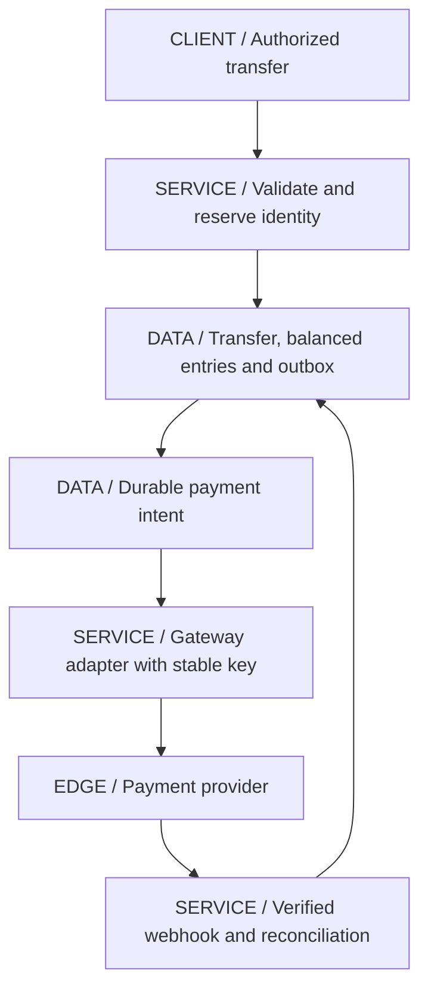

### Flow, Deep Dive and Failures

For an internal transfer, acquire the relevant concurrency protection in a stable account order, check authoritative available funds, create balanced entries and commit transfer/idempotency result/outbox together. A stale detached balance check is insufficient. Database uniqueness protects duplicate logical submission; version checks, locks or a serializable transaction protect competing spend under the chosen model.

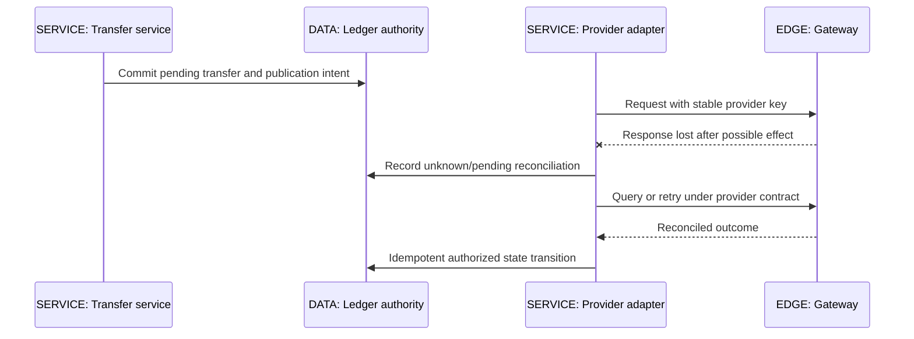

For external movement, local commit cannot atomically include the provider. Persist intent, call with a stable provider identity and reconcile unknown outcomes through query/webhooks/settlement evidence. Do not release a hold or initiate a second charge merely because the first call timed out. Separate authorization, capture, settlement, refund and dispute states; the detailed lifecycle belongs to [27](27-payments.md#ch27-payments).

| Design choice | Use when | Avoid when |
|---|---|---|
| Transactional ledger authority | Money invariants require auditable balanced postings | A mutable balance field alone is the only record |
| Provider idempotency plus reconciliation | External effects cross an unreliable boundary | Local retries are claimed to guarantee provider exactly-once behavior |

**[VERIFY: monetary posting rules, payment-provider idempotency/retention, authorization/capture/refund behavior, PCI DSS scope and regulatory obligations require current provider documentation and qualified financial/compliance review. This is a design exercise, not a tested or compliant payment system.]**

**IntegrationHub mapping:** an optional billing bounded context uses the same identity/outbox mechanisms but stricter monetary invariants. **Acceptance check:** concurrent spends, duplicate keys with changed amounts, response loss, duplicate/out-of-order provider events and reconciliation mismatch must preserve the ledger and expose unresolved states.

## 8. Distributed Cache

### Requirements and Estimate

Reduce latency/load for derivable data with explicit namespace, tenant, version, TTL and eviction policies. Decide whether cache loss is acceptable and how authority handles a cold-start stampede. The cache is not the source of truth in this case; anything stored only there would change the durability requirement.

Assume two million active keys with 1,000-byte values: 2 GB raw values, or 4 GB with two copies, before key/object/allocator/replication overhead. This is not a Redis memory estimate. Value distribution, hot-key concentration and miss cost can dominate capacity. A 99% hit ratio at high traffic can still produce an origin overload if all misses target one expensive query.

### API and Data Model

Internal GET(namespace,tenant,key), PUT(value,version,ttl), conditional replace and invalidate operations need authenticated namespace access and size limits. Do not expose arbitrary cross-tenant cache administration to application callers. Administrative flushes require separate authorization and an origin-load plan.

Entry includes namespace, tenant, key, value, version, expiry and optional loading lease. Placement metadata maps key hash ranges to nodes; replication policy states whether acknowledgement waits for copies. Eviction weight should approximate actual cost when entry sizes vary. Tombstones/generations may be needed to prevent late loads resurrecting invalidated content.

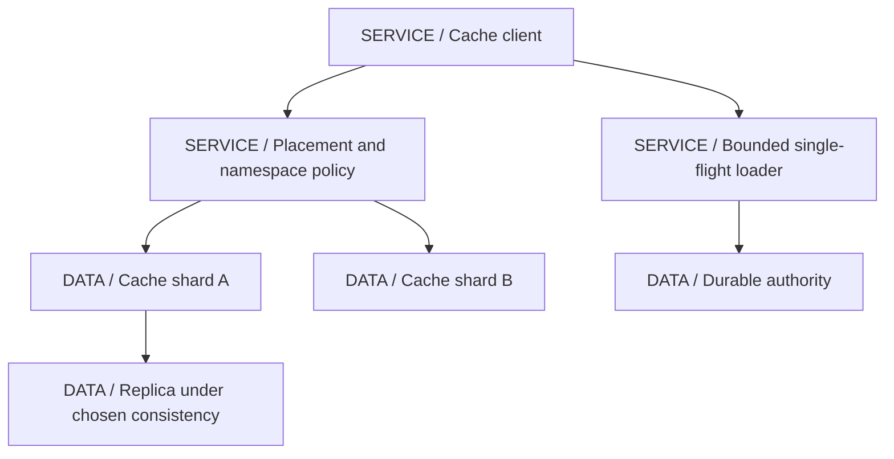

### Flow, Deep Dive and Failures

Read the cache; on miss acquire appropriate single-flight/loading coordination, fetch from authority and conditionally populate a versioned entry. A writer commits at authority and invalidates/updates according to its contract. The stale-load-after-invalidation race from [10](10-system-design.md#ch10-system-design) remains unless version/generation policy prevents it or bounded staleness is accepted.

Rebalancing can remap keys and create misses. Consistent hashing reduces expected movement under membership change, but does not solve hot keys, uneven weights or split membership views. Replication can improve cache availability while still serving stale data. On cache outage, shed or bound origin traffic; sending every client directly to the database can turn an optional cache failure into an authoritative database outage. Rebuild incrementally and monitor eviction, misses, load collapse and object sizes.

| Design choice | Use when | Avoid when |
|---|---|---|
| Disposable replicated cache | Bounded staleness and rebuild fit the workload | It authorizes spend or access without required freshness |
| Single-flight and load budgets | Miss storms threaten the authority | The loading lock can block forever or one global lock serializes unrelated keys |

**IntegrationHub mapping:** connector metadata and read models can be cached; job acceptance and ledger state stay in durable authorities. **Acceptance check:** node loss, mass expiry, hot key, stale loader and cache flush must not overload or corrupt the source of truth.

## 9. API Gateway

### Requirements and Estimate

Route external traffic to owned services, enforce coarse authentication/limits, protect request size and propagate correlation. Support normal HTTP and long-lived progress paths with explicit buffering and timeout policy. The gateway must not become the sole owner of business authorization or a hidden distributed transaction coordinator.

Assume 50,000 requests/s and 0.020 seconds mean total residence at the proxy boundary: 1,000 mean in-flight requests under a stable workload. If upstream residence rises, occupancy rises proportionally. Long-lived SSE connections need a separate connection/memory estimate; they cannot be sized using the short-request average.

### API and Data Model

Public routes forward versioned service APIs. Administrative configuration APIs are isolated from public traffic and protected by stronger identity. Route metadata includes host/path predicate, upstream pool, timeout/buffering policy, auth audience, size limits and revision. Policy metadata has rollout/version state so nodes do not silently run incompatible routing rules forever.

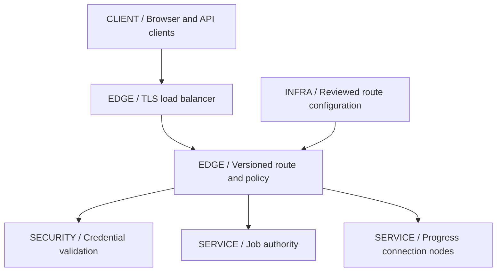

### Flow, Deep Dive and Failures

Validate request limits and trusted forwarding metadata, authenticate under configured issuer/audience, apply coarse quota, choose route and forward within the remaining deadline. Services receive authenticated context through a protected mechanism and still authorize resource operations. Strip or replace spoofable client headers rather than accepting caller-supplied internal identity headers.

Retries are the deep dive. A proxy retry of a mutation can duplicate work after the upstream committed but the response was lost. Retry only under method/operation-specific safety and the service's idempotency contract, within one parent budget. Error normalization should preserve status and safe correlation without exposing upstream internals. SSE needs buffering disabled on the relevant path and compatible idle/keep-alive settings. Health checks should not remove every gateway merely because an optional upstream is failing.

| Design choice | Use when | Avoid when |
|---|---|---|
| Central coarse policy | Shared edge protections and routing reduce duplication | Domain resource policy is implemented only at the gateway |
| Immutable reviewed route revisions | Consistent rollout and rollback matter | Ad hoc production edits create untraceable policy drift |

**IntegrationHub mapping:** Spring Cloud Gateway or an infrastructure gateway implements selected edge responsibilities, while [03](03-spring.md#ch03-spring) and [08](08-security.md#ch08-security) retain service/security ownership. **Acceptance check:** a route rollout, upstream timeout after commit, forged forwarding headers, blocked stream buffering and dependency outage follow documented policy.

## 10. Durable Job Scheduler

### Requirements and Estimate

Schedule one-shot or recurring work durably, prevent conflicting ownership of a fire instance, recover abandoned work and expose missed/late execution policy. Exactly-once physical execution is not promised. A stale worker may run after its lease expires, so effects need fencing or idempotency at their authority.

Assume one million scheduled fires/day: about 11.57/s average. A hypothetical 100-times burst is about 1,157/s. If a batch of overdue work accumulates during downtime, live capacity must exceed new arrivals to catch up. Due-time index selectivity and worker/provider budgets matter more than the daily average alone.

### API and Data Model

POST /schedules stores command reference, timing rule, tenant and idempotency key; PATCH changes future behavior through a version; DELETE disables future fires; GET /executions/{id} reports one fire attempt/result. Cancellation is cooperative for already running work. Define timezone, daylight-saving, missed-fire and overlapping-run behavior for recurrence.

Schedule stores owner, rule, timezone and version. FireInstance is uniquely identified by schedule/version/logical fire time and stores due time, status, lease owner/deadline and fencing epoch. Attempt stores execution history. Outbox/receipt records coordinate durable dispatch and effect identity. Index status/due/partition so claiming does not scan all history.

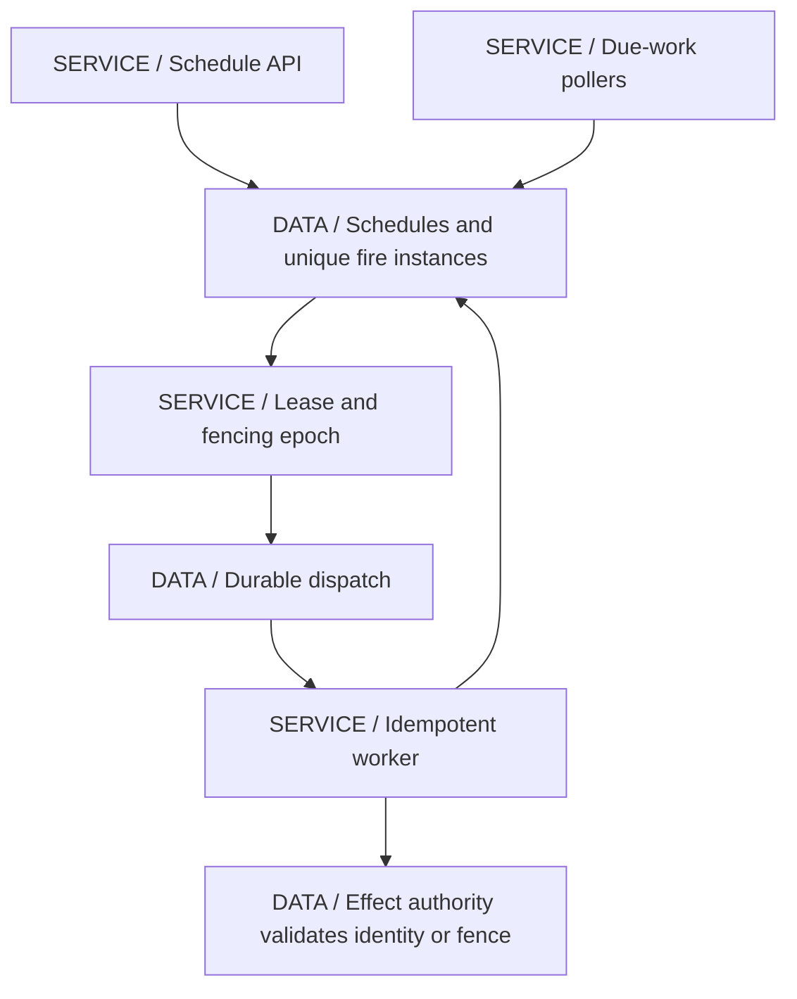

### Flow, Deep Dive and Failures

Materialize or claim due fire instances transactionally, publish durable dispatch and let workers act with the fire identity. Renew ownership only within a bounded policy and record completion. Recovery reclaims expired leases, but a lease's expiry does not physically stop a paused old worker. The effect authority must reject a stale fencing epoch where applicable, or deduplicate the same fire identity. External providers that support neither require a different reconciliation/duplicate policy.

Leader election can reduce duplicate scheduling scans but is not itself exactly-once execution. Multiple pollers using correct transactional claims may be simpler. A recurring schedule edit must not reinterpret an already accepted fire as a new identity unexpectedly. During clock skew or long downtime, choose whether to skip, coalesce or execute every missed fire and expose that result to the tenant.

| Design choice | Use when | Avoid when |
|---|---|---|
| Transactional due claims | One database authority can coordinate scheduling | Workers assume expired leases stop old processes |
| Leader plus idempotent fires | Coordination reduces duplicate planning | Leadership alone is claimed to make external effects exactly once |

**IntegrationHub mapping:** periodic connector syncs extend [11's local scheduler](11-lld.md#ch11-lld) with [22's fencing](22-distributed.md#ch22-distributed). **Acceptance check:** pause an owner beyond its lease, reclaim work, resume the old owner and verify the effect boundary rejects or deduplicates it.

## 11. Search Service

### Requirements and Estimate

Search tenant-owned jobs/connectors with bounded queries, filters, paging and an explicit indexing-lag contract. The search index is derived and must be rebuildable. It must not leak another tenant's documents or become authority for write permissions and job state transitions.

Assume 100 source updates/s: 8,640,000 updates/day. At 2,000 bytes/update, raw update traffic is 17.28 GB/day before transport overhead. Separately assume ten million currently indexed documents at 2,000 raw bytes: 20 GB raw document content. Update traffic and retained index size are different quantities; inverted-index structures, replicas and rebuild overlap require additional measured capacity.

### API and Data Model

GET /search accepts bounded text, allowed filters, ordering and cursor. The server injects mandatory authorized tenant/resource filters rather than trusting a client filter expression. GET /jobs/{id} remains the authoritative detail route. Administrative reindex requests use a separate restricted workflow.

SearchDocument includes tenant, resource ID, source version, selected searchable fields and projection schema version. ProjectionCheckpoint records input position per partition. IndexGeneration records build state, source snapshot position and active alias. Deletions require tombstones/version-aware handling so a late update does not resurrect a removed document.

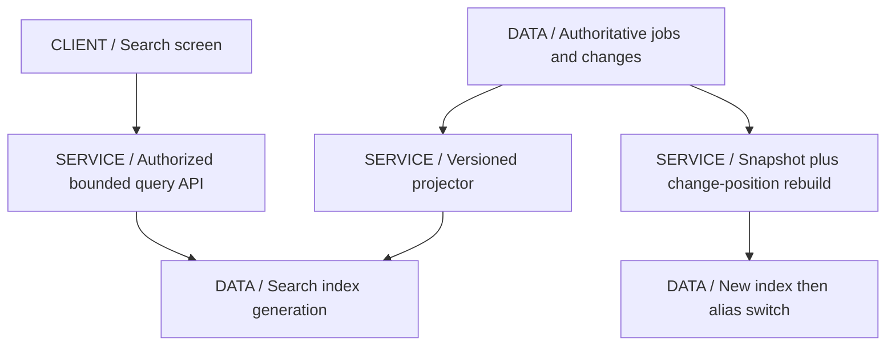

### Flow, Deep Dive and Failures

Consume committed events/CDC, transform only permitted fields and apply version-aware updates/deletes. Commit projection progress according to the sink's retry contract. A repeated event should not duplicate documents; an older version should not overwrite a newer document. Query service validates complexity and always applies tenant access scope, returning freshness where useful.

Reindexing is the deep dive. Build a new generation from a consistent snapshot plus a compatible change-stream position, replay/catch up, validate counts and sampled content, then switch a controlled alias. Retain the prior generation briefly for rollback. Insufficient source retention can make catch-up impossible, so rebuild rate and history availability belong in the plan. A green search cluster with a stuck projector can serve very stale results; monitor lag and deletion propagation, not only query latency.

| Design choice | Use when | Avoid when |
|---|---|---|
| Derived search index | Relevance and query shapes justify another store | Index is the only copy of business data |
| Versioned rebuild plus alias | Availability requires online index evolution | Clearing the live index is treated as a safe migration |

**IntegrationHub mapping:** Elasticsearch holds a selected searchable projection while PostgreSQL authorizes writes; [26](26-data-platform.md#ch26-data-platform) expands downstream lineage. **Acceptance check:** replay old updates after delete, pause projection, rebuild during writes and attempt cross-tenant queries.

## 12. Live-Status Service

### Requirements and Estimate

Show committed job progress with low perceived latency, support reconnect and tenant authorization, and bound resources for slow clients. Polling remains an authoritative fallback. SSE fits one-way progress; WebSocket is justified only when real bidirectional interaction requires it. State a finite replay window and snapshot fallback when history is missing.

Assume 100,000 concurrent connections, each receiving one 300-byte update every five seconds. That is 20,000 delivered updates/s and 6 MB/s payload egress before framing/TLS/heartbeats. At an assumed 8 KiB of application state per connection, total application connection state is about 819.2 MB before runtime/socket buffers. Actual per-connection memory must be measured; this assumption is not a framework claim.

### API and Data Model

GET /jobs/{id} returns a snapshot with version/cursor; GET /jobs/{id}/events opens an authorized stream and resumes from a supported cursor. Native EventSource uses the baseline same-origin session; a fetch-stream alternative can carry headers with its own reconnect/parser implementation. State-changing actions remain normal authorized HTTP commands.

ProgressEvent stores tenant, job, monotonic per-job sequence/version, cumulative state and retention timestamp. Job is current durable authority. ConnectionRegistry is ephemeral per node and maps authorized subscriptions to bounded buffers. Subscription generation prevents old-session updates entering a new browser context. Live fan-out routing metadata is not a substitute for retained progress.

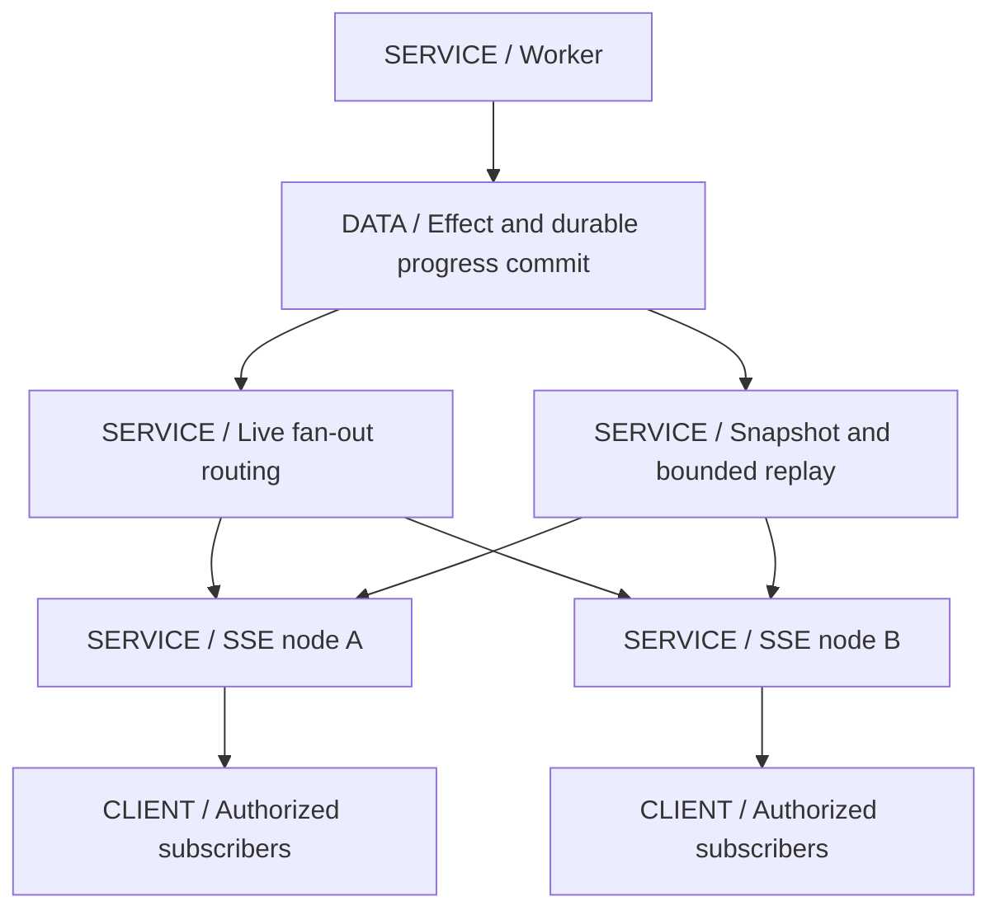

### Flow, Deep Dive and Failures

Workers commit effect and progress, then publish live notification through the established durable intent path. Nodes route events to authorized local subscribers. One Kafka group divides partitions among nodes and is not automatically broadcast to every node with interested browsers. Use deliberate routing, separate fan-out semantics or a backplane; Redis Pub/Sub can carry transient notifications only because durable replay recovers losses.

The deep dive is snapshot-to-live continuity. Establish a consistent snapshot/cursor and replay after it, while buffering or otherwise coordinating concurrent live events, deduplicating by version. If a gap or expired cursor cannot be repaired, require a fresh snapshot rather than silently pretending continuity. On a slow subscriber, coalesce disposable cumulative progress or disconnect and resume; do not let one socket block the producer for everyone. Disable intermediary buffering and align keep-alives with idle timeouts. Reauthorize/close on session changes and terminal completion under policy.

| Design choice | Use when | Avoid when |
|---|---|---|
| SSE plus polling fallback | Server-to-client progress and recoverable state are enough | Bidirectional interaction is genuinely required |
| Durable replay plus ephemeral fan-out | Live loss is recoverable from retained authority | Pub/Sub alone is presented as a replayable history |

**IntegrationHub mapping:** this joins [05's transport](05-apis-realtime.md#ch05-apis-realtime), [07's progress commits](07-messaging.md#ch07-messaging) and [09's generation/version guards](09-frontend.md#ch09-frontend). **Acceptance check:** node loss, lost notification, stale cursor, snapshot handoff race, slow reader and tenant switch cannot cross authorization or silently regress state.

## Cross-Case Review

The repeated structure is intentional: a trusted command reaches an owner; that owner commits an invariant and durable intent; asynchronous effects cross another failure boundary; derived views lag and rebuild; the user gets explicit accepted, completed, rejected or unresolved state. Reuse these mechanisms instead of inventing a new reliability story for every box.

> [!MECHANISM]
> **The crash after commit but before acknowledgement appears everywhere.** Link creation, notification planning, transfer posting and scheduled work can all have a real effect with a lost response. Stable identity and the owning authority determine whether retry can replay the result safely.

> [!TRAP]
> **Do not move an invariant into a derived view.** A cached balance, search document, browser state or live notification can be stale. If a decision must prevent overspend, tenant exposure or duplicate acceptance, evaluate it at the authority or use a protocol that explicitly proves the required freshness.

> [!DECISION]
> **Deploy the smallest subset that meets the case.** A modular service with PostgreSQL and a worker can implement several of these capabilities. Split ownership or stores when isolation, scale, team boundaries or specialized queries justify their recovery and operational cost.

Each case's acceptance checks are proposed tests, not executed results. To build one, select artifacts, write concrete migrations and API contracts, implement the failure paths, execute controlled load/fault tests and update the estimates with measured distributions. A diagram cannot establish a provider guarantee or recovery objective by itself.

> [!INTERVIEW]
> **Deep dive one invariant, not every product.** Show the exact transaction, uniqueness/ordering rule, post-commit failure and recovery owner. Then use the estimate to explain which bottleneck changes the design first.

## Explained-Here Index

| Case | Owning explanation |
|---|---|
| URL shortener | [Identity, redirect cache and revocation](#ch12-url) |
| Rate-limiter service | [Atomic allowance and degraded policy](#ch12-limiter) |
| Notification system | [Per-channel durable intent](#ch12-notifications) |
| Token service | [Session, refresh and key ownership](#ch12-token) |
| Bulk sync pipeline | [Stable input and effect/checkpoint boundary](#ch12-bulk) |
| Webhook delivery | [Destination isolation and replay](#ch12-webhooks) |
| Payment/wallet | [Ledger and unknown provider effects](#ch12-wallet) |
| Distributed cache | [Placement, staleness and cold-start protection](#ch12-cache) |
| Gateway design | [Routing and policy boundaries](#ch12-gateway) |
| Job scheduler | [Fire identity, lease and fencing](#ch12-scheduler) |
| Search service | [Projection and online rebuild](#ch12-search) |
| Live-status service | [Fan-out, replay and slow readers](#ch12-live) |

## Related Chapters

Return to [00](00-master-map.md#ch00-master-map); use [03 Spring](03-spring.md#ch03-spring), [05 APIs](05-apis-realtime.md#ch05-apis-realtime), [06 database](06-databases.md#ch06-databases), [07 messaging](07-messaging.md#ch07-messaging), [08 security](08-security.md#ch08-security), [09 frontend](09-frontend.md#ch09-frontend), [10 foundations](10-system-design.md#ch10-system-design), [11 local design](11-lld.md#ch11-lld), [13 integration](13-integration.md#ch13-integration), [18 operations](18-operations.md#ch18-operations), [19 tests](19-testing.md#ch19-testing), [22 distributed theory](22-distributed.md#ch22-distributed), [25 domain boundaries](25-architecture.md#ch25-architecture), [26 analytics](26-data-platform.md#ch26-data-platform) and [27 payments](27-payments.md#ch27-payments). Generated navigation provides backlinks.

## One-Page Cheat Sheet

**Links and limits:** unique link identity plus cache revocation; token buckets with atomic global or explicitly allocated scope. Public cacheability is not private authorization.

**Notifications and tokens:** notification event identity survives per-channel attempts; preference/template versions need a policy. Standard identity protocols use the correct token purpose, refresh authority and key lifecycle.

**Sync and webhooks:** stable input selection, idempotent target effects and checkpoints make restart possible. Validate destinations at send time, isolate slow receivers, preserve event IDs and reconcile unknown outcomes.

**Wallet and cache:** balanced immutable ledger postings and authoritative spend checks own money. Cache is derived; protect the origin during cold starts and prevent stale loaders overwriting newer state.

**Gateway and scheduler:** edge policy is coarse; services authorize resources. Durable fire identities, claims and fencing protect schedules; leadership or DNS routing alone does not prevent stale effects.

**Search and live status:** versioned projections rebuild from sufficient retained history. SSE nodes need deliberate fan-out and bounded durable replay. A consumer group is not automatic broadcast, and a cursor is not unlimited history.

**Evidence:** all numbers are assumptions, all deployment/fault checks are unexecuted. Use estimates to choose a bottleneck and failure traces to prove a boundary before selecting products.

## Interview Corner

### Basic: What Is Common to All Twelve Designs?

An explicit authority, stable identity, bounded resources and a recovery contract. Components vary, but those questions determine whether the system can preserve its invariant after failures.

### Internals: Why Are Cache and Search Not Good Write Authorities?

They are usually derived under a lag/rebuild contract. A stale representation cannot safely authorize a stricter current-state invariant unless a separate protocol supplies the necessary consistency.

### Trace/Debug: A Request Timed Out but Work Happened.

That is an unknown outcome, not proof of failure. Find the durable identity and authoritative result, then replay/query/reconcile under its contract. Creating a new logical key can duplicate the effect.

### Scenario: Which Case Would You Build First for IntegrationHub?

The job acceptance and bulk-sync path with tenant authorization, durable state, bounded workers and status reads. Add specialized search, cache or fan-out only when requirements justify their operational cost.

### Basic: Why Include Estimates If They Are Assumptions?

They expose units, dominant costs and decisions to validate. They are useful precisely when labeled: a measured distribution can replace the assumption later without hiding how the architecture depended on it.

### Internals: Why Does a Lease Need Fencing or Idempotency?

Expiry transfers permission but cannot stop a paused old process. The effect authority must reject stale ownership or recognize repeated intent; otherwise both old and new workers can act.

### Trace/Debug: Broker Lag Is Low but Users See Old Progress.

Work may have moved into an application queue, a projection may be stalled, notifications may be lost, or browsers may be slow. Trace committed progress and age through every stage rather than equating fetch progress with completion.

### Scenario: How Do You Make a Rebuild Safe?

Use a new destination, a consistent snapshot/change position, bounded catch-up, validation and a controlled routing/alias switch. Retain a rollback path and verify source history lasts long enough to finish.

### Basic: Can a Gateway Enforce All Authorization?

It can validate coarse identity and route policy, but each service owns resource and domain permissions. Internal access paths and changing state still need service-side authorization.

### Internals: Why Can One Kafka Group Miss Browser Subscribers?

It distributes partition processing among consumers. Subscribers can be attached to other nodes, so notifications need routing or appropriate fan-out semantics plus durable recovery.

### Trace/Debug: Provider Success Was Followed by Duplicate Delivery.

The response or local completion record may have been lost. Use stable logical identity and provider/receiver deduplication where available; otherwise expose and reconcile the uncertainty rather than promising exactly once.

### Scenario: How Do You Close an HLD Answer?

State the invariant, bottleneck, most important failure and recovery owner, rejected simpler alternative and what must be measured or verified. A clear unresolved assumption is better than an invented guarantee.