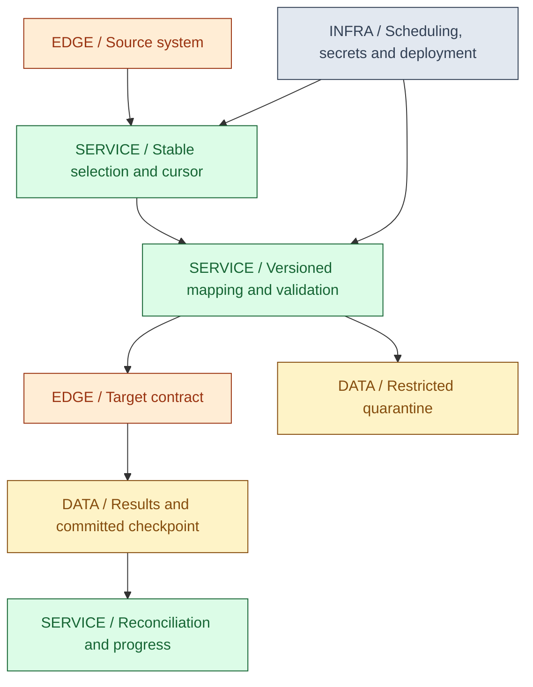
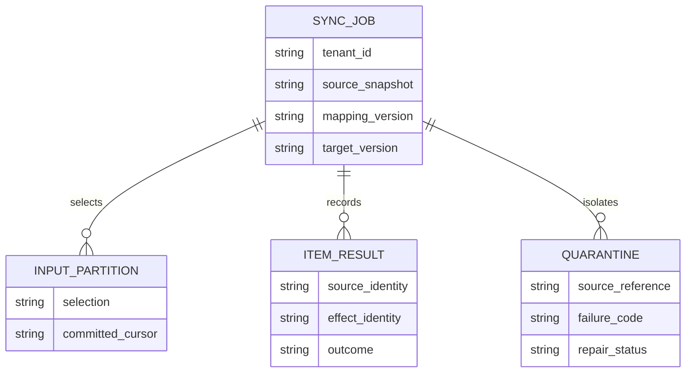
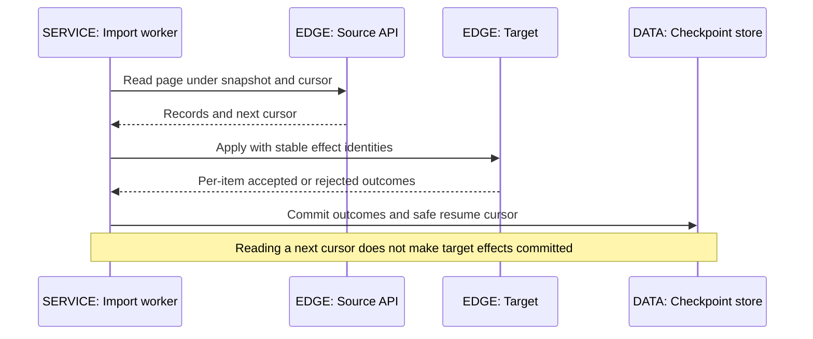
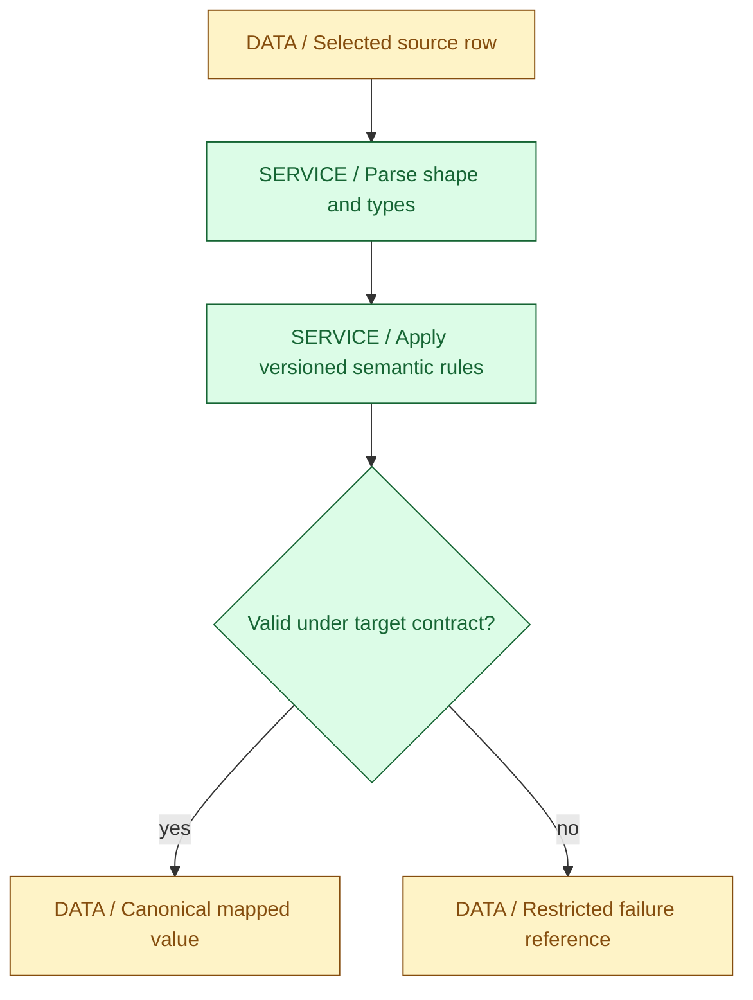
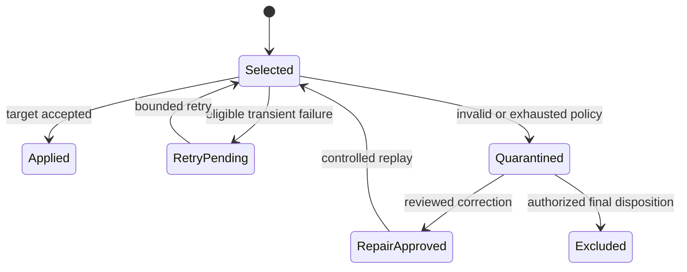
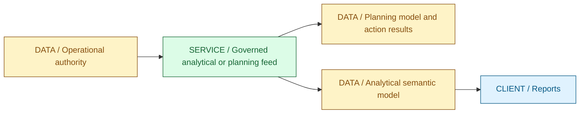

# 13 / Data Integration and iPaaS

**Moving bytes is easy; preserving their meaning through retries and change is the integration problem.** IntegrationHub is fictional. Its connector service must know which source records were selected, which mapping interpreted them, which target effects committed, and which failures remain unresolved. A green scheduler status does not prove that all business records arrived correctly.

**Version assumptions:** Java 21, Spring Boot 4.0.x / Cloud 2025.1.x, PostgreSQL 17, Kafka 4.x and Kubernetes 1.34 remain the guide baseline. The optional Python model uses standard-library facilities available in Python 3.11+. IICS/IDMC, MuleSoft, Anaplan Connect and Power BI are discussed at architectural level; connector capabilities, authentication, licensing and quotas are product/version-specific.

**Execution status:** NOT EXECUTED. The Python runner found no non-store interpreter on PATH. Its four tests have not run. No Java toolchain, vendor runtime, credentials, source endpoint or target endpoint was installed or contacted. Downloads remain authorized for diagram dependencies only.

## Big Picture

## What You Will Be Able to Explain

- Choose ETL, ELT, finite batch, incremental polling and CDC from the authority and freshness requirements.
- Define stable input, pagination, mapping versions, target identities and restart checkpoints.
- Distinguish filtering, quarantine, retry, partial completion and reconciliation.
- Explain iPaaS control-plane/runtime separation without assuming a connector name supplies delivery guarantees.
- Compare IICS, MuleSoft, Anaplan Connect and Power BI by the problem they solve.
- Design a connector port and a small Python transformation with explicit numeric and input contracts.

> [!PRODUCTION]
> **Where this lives in IntegrationHub.** [05](05-apis-realtime.md#ch05-apis-realtime) accepts a tenant-scoped sync job; [07](07-messaging.md#ch07-messaging) dispatches and checkpoints work; [06](06-databases.md#ch06-databases) owns durable local state. [08](08-security.md#ch08-security) authorizes secrets and destinations. [11](11-lld.md#ch11-lld) supplies connector Strategy/Factory concepts, [12](12-hld.md#ch12-hld) supplies the bulk-sync HLD, and [26](26-data-platform.md#ch26-data-platform) extends the analytical destination.

## 1. ETL, ELT and Execution Placement

ETL extracts from a source, transforms before loading the intended destination representation, and then loads. ELT loads selected raw or lightly normalized data into an analytical platform and transforms there. Both still require validation, security and lineage; ELT does not mean indiscriminately retaining every sensitive source field forever.

Placement changes the resource and governance boundary. Transforming in a Java worker consumes its CPU/memory and exposes data to that runtime. Pushing work into a database can exploit set-oriented execution but consume shared database capacity. Warehouse transformations can reuse retained input for new analyses, but raw data access and retention become a significant responsibility. Transformation location should follow data volume, trust, available compute and operational ownership.

Batch versus stream is a separate axis. A nightly file can be ETL or ELT; an event stream can be transformed before or after landing. Incremental polling asks for changes since a position; CDC follows database changes under its log/snapshot contract. A daily export is not automatically a complete snapshot if the source changes during extraction.

| Approach | Use when | Avoid when |
|---|---|---|
| ETL | Only approved transformed data should reach the destination | Worker-side row loops replace a much cheaper set operation without evidence |
| ELT | Governed retained input and destination compute support multiple analyses | Raw sensitive data has no access or retention owner |
| Batch | A finite named input set and completion result matter | The freshness requirement genuinely demands continuing updates |
| CDC | Source changes should be captured from committed history | Log retention, snapshots and connector operations are unowned |

**Interview checks:** basic: transformation location distinguishes ETL/ELT. Internals: placement moves compute and trust. Debug: verify whether an export is actually consistent. Scenario: choose freshness and input identity before choosing a product.

## 2. Source, Mapping and Target Contracts

A connector contract needs more than connect/read/write. Describe authentication and authorization scope, source identity, schema, selection rules, ordering, pagination, deletion semantics, target conflict policy and rate limits. A source can expose repeated IDs, changing rows, eventual consistency or an expiring cursor. A target can accept a batch partially even when the overall HTTP request fails.

The job manifest should bind tenant, source reference, immutable snapshot or selection boundary, schema/mapping version and destination configuration version. A restart must either reuse this contract or be explicitly treated as a new interpretation. Replaying yesterday's input through today's changed mapping without recording the change makes reconciliation and audit ambiguous.

Business keys and delivery identities differ. A customer ID identifies an entity; a source change ID or source version identifies an update; a job item identity identifies an attempt to apply a specific selected fact. Repeating a delivery should not repeat a non-idempotent target effect, while two real updates to the same customer must not be collapsed as duplicates.

The diagram is conceptual, not a migration. Tenant scope belongs in actual keys, queries and authorization. Store only what is needed to diagnose/replay under a retention policy. A quarantine payload can contain more sensitive data than the normal mapped result, so treating it as a harmless log is a security mistake.

| Contract decision | Use when | Avoid when |
|---|---|---|
| Immutable input manifest | Repeatable restart/reconciliation matters | A mutable file path is treated as immutable identity |
| Versioned mapping and target configuration | Replayed data must have explainable meaning | Deploying new code silently changes an existing job |
| Explicit per-item result | Target can partially accept a batch | One transport status is treated as every record's outcome |

**Interview checks:** basic: entity identity is not update identity. Internals: restart binds input and interpretation. Debug: compare manifest versions before blaming retries. Scenario: model partial acceptance before implementing batch writes.

## 3. Pagination, Incremental Watermarks and Deletions

Offset pagination over mutable input can skip or duplicate rows as insertions and deletions shift positions. Keyset pagination uses a total order, such as timestamp plus stable ID, and a matching source capability. It improves traversal but does not freeze row contents. If consistent extraction matters, use a source snapshot, a stable change log or a documented overlap/reconciliation strategy.

A timestamp watermark needs tie handling, clock semantics and an upper boundary. Selecting updated_at greater than the last timestamp can miss another row with the same timestamp. A compound cursor or deliberate overlap plus deduplication is safer. Source timestamps may be assigned before commit, may have limited precision or may change late; a watermark is not automatically commit order.

Deletion capture is often forgotten. An updated-row endpoint may never show removed rows. Options include tombstones/change feeds, soft-delete markers, periodic authoritative snapshots with set comparison, or source-supported deletion exports. Do not infer deletion merely from absence in an incomplete page or failed extraction.

When a cursor expires, do not invent a new one from the number of rows processed. Re-establish a supported snapshot/change position and reconcile overlap. For large extracts, bound how long source resources such as snapshots remain open; a long database snapshot can affect cleanup and storage, as [06](06-databases.md#ch06-databases) explains.

**[VERIFY: confirm each source's cursor lifetime, snapshot consistency, timestamp/commit ordering, deletion feed and rate-limit contract against the selected connector/API version. No real pagination, CDC or cursor-expiry experiment ran.]**

**Interview checks:** basic: stable order is not a frozen snapshot. Internals: equal timestamps require tie handling. Debug: investigate missing deletion events. Scenario: expired cursors require a source-supported recovery plan.

## 4. Batching, Idempotency and Checkpoints

Batch size balances overhead against memory, lock duration, target limits and replay cost. Bound by bytes as well as row count: a batch of one hundred large documents can be far larger than one thousand small rows. Chunk boundaries need not match source page boundaries; a page can be read once and processed in smaller target units if the checkpoint captures the exact safe position.

A local transactional target can commit output, duplicate receipt, progress and checkpoint together. An external target is a separate authority. If its effect succeeds and the response is lost, the worker must query, retry under a stable target key or reconcile. Advancing the checkpoint before target acceptance can lose data; recording it later without duplicate-safe effects can repeat changes.

Retry the smallest unit whose outcome and repeatability are known. Some batch APIs return accepted item IDs while others report an all-or-nothing contract. Retrying the entire batch after partial success is safe only when target identities or operations make it so. A job's HTTP idempotency key does not automatically deduplicate every target record.

> [!MECHANISM]
> **A checkpoint is a claim about completed effects, not reading progress.** Store it only when every earlier selected item has a committed accepted result or an explicitly permitted durable quarantine result. Otherwise restart skips unresolved input.

| Batch policy | Use when | Avoid when |
|---|---|---|
| Small bounded chunks | Failures should replay little work | Per-request overhead dominates without measuring alternatives |
| Larger batch | Target supports efficient bulk semantics | Partial results, byte limits or long transactions are ignored |
| Idempotent target upsert | Repeated selected state should converge | A new source update is incorrectly suppressed as an old duplicate |
| Reconciliation | External outcome cannot be decided locally | A timeout is assumed to mean no effect |

**Interview checks:** basic: page and commit chunk differ. Internals: target and checkpoint authority must agree. Debug: partial batch success needs per-item evidence. Scenario: preserve target effect identity across retries.

## 5. Schema Mapping and Data Quality

Mapping is a versioned interpretation of data: field names, types, units, nullability, enumerations, timezones and key relationships. A syntactically valid JSON object can still have the wrong currency scale or date semantics. Distinguish malformed input, unsupported schema and valid records rejected by business rules.

Use exact decimal handling for decimal quantities; distinguish a monetary minor-unit contract from arbitrary rounded floats. Define whether excess fractional precision is rejected or rounded and by which rule. Identifiers are often strings even when they contain digits. Preserve leading zeros where meaningful. A timestamp must specify instant versus local date/time, timezone and units; guessing from locale makes identical input map differently on different workers.

Schema evolution needs compatibility tests on historical fixtures. Adding a required field breaks old data; renaming or changing units changes meaning even if types still parse. Unknown enumeration values need deliberate handling. Mapping code should not silently substitute a default that turns a missing value into a legitimate business fact.

Record counts are necessary but insufficient for reconciliation. Compare source selection counts, accepted/rejected counts, business-key uniqueness and relevant control totals or hashes under a defined canonicalization. Equal counts can still hide wrong values or duplicated identities. A control total can also hide compensating errors, so combine checks according to risk.

**Interview checks:** basic: mapping includes meaning, not only names. Internals: exact units and canonicalization affect reconciliation. Debug: compare timezone/decimal rules across versions. Scenario: test old fixtures before changing a mapping.

## 6. Quarantine, Repair and Partial Completion

Filtering is intentional exclusion under a rule. Quarantine records a selected item that could not be safely applied. A transient retry keeps work pending. These are different outcomes, and combining them into a skipped count prevents the operator from understanding data loss.

Quarantine needs source identity/reference, mapping version, sanitized failure class, correlation, attempt history, owner and repair state. Retain raw payload only when necessary, with restricted access and expiry. A repair can correct source data, update mapping or acknowledge an intended exclusion. Reprocessing must preserve the relationship to the original failure and target effect identity; it must not create an unaudited duplicate import.

Partial completion is a product contract. If one invalid record can be quarantined while valid rows continue, the job should expose accepted, quarantined and unresolved counts and a completed-with-errors state. If any missing record invalidates the dataset, stop and reconcile instead. A success email must not conceal a job that dropped important records.

> [!TRAP]
> **Quarantine is not successful delivery.** It is a durable unresolved or explicitly excluded result. A job may advance past it only under a documented partial-completion policy with an owner and a reconciliation path.

| Failure policy | Use when | Avoid when |
|---|---|---|
| Retry with budget | Failure is transient and repeated effect is safe | Permanent mapping errors repeat forever |
| Quarantine and continue | Partial completion is allowed and repair is owned | Missing critical records are hidden behind success |
| Fail the partition/job | Further progress would violate dataset integrity | One isolated optional field unnecessarily stops unrelated tenants |

**Interview checks:** basic: filter, retry and quarantine differ. Internals: checkpoint policy must include quarantine durability. Debug: a green run with fewer records is not enough evidence. Scenario: make repair replay authorized and traceable.

## 7. iPaaS and Informatica IICS

An integration platform typically separates a design/control plane from execution runtimes. The control plane manages connections, mappings, schedules, deployment metadata and monitoring; runtimes execute data movement near accessible sources and targets. Hosting choices affect network reachability, secrets, upgrade responsibilities and where sensitive records travel.

Informatica IICS is a familiar name for cloud integration capabilities; current product naming and packaging may appear under IDMC. At architectural level, distinguish connection metadata, reusable mappings, executable tasks/taskflows and the runtime used for supported data integration. A Secure Agent-style runtime can provide connectivity to protected networks, but installation alone does not authorize every source or guarantee every task is executed in the same location.

Map the platform back to the earlier contracts: what identifies a run, where are parameters/versioned mappings stored, how does the runtime authenticate, which transformations are pushed down, what is the restart behavior, and how are partial target results surfaced? A connector's existence is not evidence that all API features or transactional guarantees are available. Inspect the specific connector operation and license/runtime mode.

| Platform responsibility | Use when | Avoid when |
|---|---|---|
| Managed design/orchestration | Standardized connectors and operations reduce custom work | Generated mappings are accepted without understanding target semantics |
| Private-network runtime | Sources cannot be reached by a public control-plane execution path | Agent reachability is confused with least-privilege authorization |
| Pushdown transformation | Supported database execution is more efficient | Shared source/database capacity is overloaded by an opaque generated query |

**[VERIFY: confirm current Informatica IICS/IDMC naming, Secure Agent/runtime choices, connector operation support, pushdown, taskflow/restart semantics, licensing and network requirements in the vendor documentation for the selected service. No Informatica environment was accessed.]**

**Interview checks:** basic: control plane and execution plane differ. Internals: inspect actual runtime/data placement. Debug: connection success is not task permission or correct mapping. Scenario: compare platform guarantees with the required source/target contract.

## 8. MuleSoft and API-Led Integration

MuleSoft commonly organizes integrations as flows in a Mule runtime, using connectors and transformations such as DataWeave. A flow receives an event, routes/transforms it and invokes other systems under error-handling policies. Understand the event/message context, streaming versus materialized payloads and where retry/error scopes begin and end; a graphical flow does not remove those decisions.

API-led connectivity often distinguishes system APIs exposing controlled access to systems of record, process APIs composing business behavior and experience APIs shaping responses for consumers. These are responsibility categories, not a rule that every operation must cross three separately deployed network services. Extra synchronous hops add latency, failures and duplicated transformation work.

A retry scope around a multi-step flow can repeat an earlier successful external call when a later step fails. Define stable identities and compensation/reconciliation instead of assuming flow-level retry is transactional. Streaming support can bound memory, but transformations that sort, join or repeatedly traverse a payload may require materialization. Inspect payload size and actual connector behavior.

| Approach | Use when | Avoid when |
|---|---|---|
| Reusable system API | Multiple consumers need a governed source boundary | It exposes raw internal schema without a stable contract |
| Process orchestration | A visible workflow owns multiple interactions | Hidden retries repeat non-idempotent steps |
| Experience-specific API | Consumer needs justify a tailored representation | Three layers are deployed solely to match a slogan |

**[VERIFY: check Mule runtime/DataWeave versions, streaming/repeatability, transaction boundaries, connector retry/error semantics and deployment options against the chosen MuleSoft release. No Mule flow, transformation or connector was executed.]**

**Interview checks:** basic: layers name responsibilities. Internals: retry scope determines repeated side effects. Debug: look for accidental payload materialization. Scenario: preserve business identity across multi-step integrations.

## 9. Anaplan Connect and Power BI

Anaplan integration connects operational data with planning models. Think in terms of workspace/model identity, supported import/export actions, mapping to model dimensions, job submission and result polling. Anaplan Connect provides a command-line integration route for supported operations; it is not a general-purpose database replication engine. Authentication, file formats, action configuration and result interpretation must match the selected environment.

An accepted import action can still produce rejected records or model-level failures. Preserve the action/result identity and inspect detailed outcomes, not only the command process exit status. A rerun against a mutable file or changed model mapping may produce different planning state; version input and configuration where the workflow requires repeatability.

Power BI is an analytical consumption/modeling platform, not the operational authority for job acceptance. Import-mode models retain data for refresh; DirectQuery-style access delegates queries to supported sources; newer storage modes have their own service/capacity constraints. On-premises data access can require a gateway. Dataset/semantic-model credentials, refresh ownership and row-level security are distinct from backend API authorization.

| Destination | Use when | Avoid when |
|---|---|---|
| Planning-model import | Business planning needs governed dimensions and actions | CLI completion is assumed to mean every record loaded |
| Imported analytical model | Refresh cadence and analytical performance fit | Users are promised real-time operational truth |
| Source-query mode | Supported source access and capacity meet the query workload | Report traffic overloads the transactional database |

**[VERIFY: verify Anaplan Connect authentication/actions/file limits/result semantics and Power BI semantic-model storage modes, gateway/refresh/RLS behavior, quotas and licensing in current product documentation. No tenant, workspace, report or import operation was accessed.]**

**Interview checks:** basic: planning/BI is not the transactional source of truth. Internals: job acceptance and item outcomes differ. Debug: inspect model/action/refresh identities. Scenario: choose freshness and source-load policy explicitly.

## 10. Connector Design and the Python Lab

Separate source acquisition, mapping, target application and checkpoint coordination. A source adapter exposes a supported selection/cursor contract; a mapper produces a canonical value or classified rejection; a target adapter returns explicit item outcomes; the coordinator decides which results permit progress. Keep provider exceptions and credential details at the adapter boundary rather than spreading them through domain logic.

Python is useful for small transformation and reconciliation tasks when its operational footprint is understood. Iterators and csv.DictReader can avoid materializing a whole file; Decimal expresses decimal policy more clearly than binary floating point. Context managers close files. Explicit encodings, deterministic sorting/canonicalization and parameterized external access matter as much as language syntax. A short script still needs input identity, errors, tests and deployment ownership.

The complete source is `code/13-integration/IntegrationLab.py`, with Windows PowerShell runner `& './docs/java-fs-guide/code/13-integration/run.ps1'` from workspace root. It maps source identity/decimal amounts into minor units, rejects nonfinite/negative/overprecise values, and atomically replaces an in-memory state containing accepted rows, quarantine and checkpoint. It binds restart to an input fingerprint and mapping version.

| Test method | Intended check | Evidence limit |
|---|---|---|
| test_decimal_contract | Exact conversion and rejection of invalid numeric values | Not executed; no target schema involved |
| test_chunk_rollback_and_resume | Failure before state replacement leaves no checkpoint/effects | Not database durability or process-crash recovery |
| test_quarantine_and_checkpoint_agree | Accepted plus quarantined rows account for committed progress | Not a real partial-success API |
| test_restart_contract_and_tenant_scope | Changed input/mapping rejected; tenant receipt scopes differ | Not backend authorization |

Receipt identity uses selected source position within a fingerprinted immutable input, not a claim that duplicate business entities have been deduplicated across unrelated jobs. State is in memory and process loss discards it. Quarantine records sanitized reasons instead of echoing raw invalid values. A passing future test would validate this model, not IICS, MuleSoft, Anaplan, Power BI or an actual connector.

> [!DECISION]
> **Use a platform when its supported contracts and operations reduce total ownership cost.** Use custom adapters when the required semantics or domain behavior cannot be expressed safely. Count runtime upgrades, secret rotation, incident diagnosis and reconciliation, not just initial connector setup.

**[VERIFY: run the four Python standard-library tests with an existing compatible interpreter and validate real source/target adapters separately. The current preflight is NOT EXECUTED; in-memory state replacement and input hashing are not persistence, authenticity or vendor-runtime evidence.]**

> [!INTERVIEW]
> **Explain a failed restart with four identities:** selected input, mapping version, target effect and committed checkpoint. If any is unstable, a retry can interpret different data, repeat an effect or skip unresolved records.

## Explained-Here Index and Sources

| Concept | Explanation |
|---|---|
| ETL and ELT | [Placement](#ch13-etl) |
| Connector contracts and identity | [Source/target boundaries](#ch13-contracts) |
| Pagination and watermarks | [Stable traversal](#ch13-pagination) |
| Batching and idempotency | [Commit boundaries](#ch13-batching) |
| Schema mapping | [Semantic validation](#ch13-mapping) |
| Quarantine | [Repair and partial completion](#ch13-quarantine) |
| IICS | [Platform/runtime](#ch13-ipaas) |
| MuleSoft | [Flow and API layers](#ch13-mulesoft) |
| Anaplan Connect and Power BI | [Planning and analytics](#ch13-planning-bi) |
| Connector design and Python | [Ports and model lab](#ch13-connector-python) |

Verification destinations: [Informatica documentation](https://docs.informatica.com/), [MuleSoft documentation](https://docs.mulesoft.com/), [Anaplan support](https://help.anaplan.com/), [Power BI documentation](https://learn.microsoft.com/en-us/power-bi/) and [Python Decimal](https://docs.python.org/3/library/decimal.html). References are not claims of fresh vendor-document retrieval or executed integrations.

## Related Chapters

Use [00](00-master-map.md#ch00-master-map), [05 APIs](05-apis-realtime.md#ch05-apis-realtime), [06 databases](06-databases.md#ch06-databases), [07 batch/messaging](07-messaging.md#ch07-messaging), [08 security](08-security.md#ch08-security), [11 connectors](11-lld.md#ch11-lld), [12 bulk design](12-hld.md#ch12-hld), [16 delivery](16-delivery.md#ch16-delivery), [18 operations](18-operations.md#ch18-operations), [19 tests](19-testing.md#ch19-testing) and [26 analytics](26-data-platform.md#ch26-data-platform). Generated navigation is reciprocal.

## One-Page Cheat Sheet

**Contract:** bind tenant, stable input, schema/mapping version and target configuration. Entity ID, change ID, delivery ID and attempt ID solve different problems.

**Placement:** ETL transforms before loading the intended target; ELT transforms after governed landing. Batch/stream is a separate axis. Platform control plane and execution runtime have different network/security responsibilities.

**Traversal:** stable order is not snapshot consistency. Handle timestamp ties, deletions and cursor expiry. Do not restart a changed file by line count alone.

**Effects:** source pages are not commit chunks. Bound bytes and rows. Commit target outcomes with checkpoints where possible; external uncertain outcomes need stable keys and reconciliation.

**Quality:** define units, decimal precision, nulls, timezones and unknown enums. Filtering is intentional; quarantine is unresolved or explicitly excluded work. Partial success must be visible and repairable.

**Products:** IICS/MuleSoft orchestrate supported integrations; Anaplan consumes planning data/actions; Power BI consumes analytical models. Names do not establish transactional guarantees. Python lab and vendor integrations remain NOT EXECUTED.

## Interview Corner

### Basic: ETL Versus ELT?

Transformation placement differs. Select based on compute, trust, retention and analytical reuse, not an assumption that one removes validation or governance.

### Internals: Why Does Timestamp-Only Incremental Extraction Miss Rows?

Ties, precision, late changes or allocation before commit can invalidate a simple greater-than watermark. Use supported compound positions, overlap/deduplication or a source change log with a defined recovery contract.

### Trace/Debug: The Run Is Green but Records Are Missing.

Compare selected, accepted, quarantined and unresolved counts and inspect target per-item results. A transport or orchestrator success may not mean all business records were applied.

### Scenario: A Target Times Out After a Batch Write.

Treat outcome as unknown. Inspect item receipts, query supported status or retry with stable target identities. Do not advance the checkpoint or create fresh effect IDs merely to clear the error.

### Basic: What Does an iPaaS Runtime Add?

Managed execution/connectivity and operational capabilities under supported connector contracts. It does not automatically make arbitrary source/target writes atomic.

### Internals: Why Version the Mapping?

The same input can produce different values under changed units, defaults or transformations. Restart/replay must preserve or explicitly record that interpretation change.

### Trace/Debug: A Retry Reprocessed the Wrong File.

The job stored a mutable path without immutable version/fingerprint. Validate input identity before resuming and treat a changed source as a new or reconciled job.

### Scenario: One Bad Row in a Large Import?

Choose fail or partial completion from business rules. If quarantine is allowed, persist source reference, failure and repair owner with progress, and expose completed-with-errors rather than hiding loss.

### Basic: SCIM, iPaaS and BI Are Interchangeable?

No. Provisioning, integration orchestration and analytical consumption have different authority and lifecycle contracts. A shared connector ecosystem does not erase those distinctions.

### Internals: Why Can a Flow Retry Duplicate Work?

The retry scope may include an already successful external step. Track each effect identity and use compensation/reconciliation rather than assuming the entire flow rolled back.

### Trace/Debug: Memory Rises Despite a Streaming Connector.

Inspect transformations that sort, join or materialize payloads, unbounded batches and target buffering. Streaming acquisition does not imply an entirely streaming pipeline.

### Scenario: Platform or Custom Connector?

Compare supported semantics, security, runtime operations and long-term cost. Use a maintained platform where it fits; keep custom adapters narrow and test the exact contracts it does not supply.