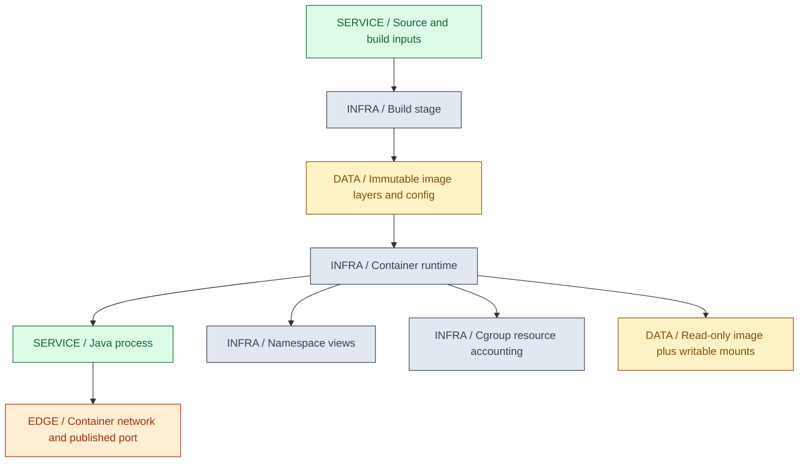
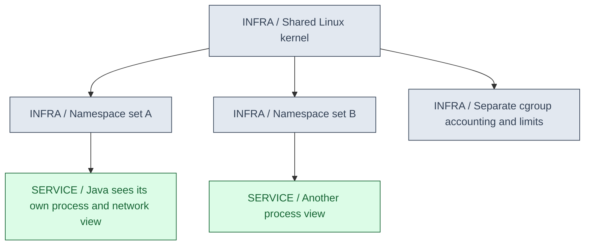
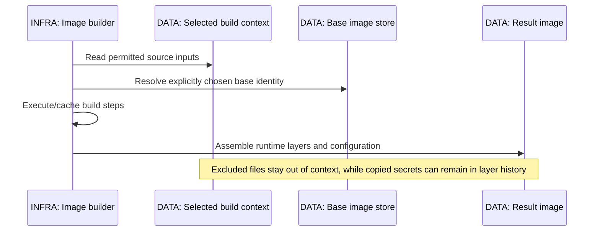

<a id="ch14-docker"></a>
# 14 / Docker and Container Internals

**A container is a constrained process environment, not a miniature independent kernel.** IntegrationHub is fictional. Packaging its Java service as an image makes the filesystem and startup contract portable, but resource budgets, secrets, networking and graceful shutdown still need deliberate design.

**Version assumptions:** Linux containers, an OCI-compatible image/runtime path and modern Docker Engine/BuildKit/Compose v2 concepts; Java 21, Spring Boot 4.0.x / Cloud 2025.1.x, PostgreSQL 17, Kafka 4.x and Kubernetes 1.34 remain surrounding baselines. On Windows, a Linux-container engine normally runs through a Linux VM/backend; Linux namespaces and cgroups are properties of that Linux kernel, not the Windows host kernel.

**Execution status:** NOT EXECUTED. Docker and javac are not installed on PATH. The saved Compose JSON parsed and local contract checks passed, but image build, Java compilation, daemon behavior, networking and container execution did not run. No base images were downloaded.

## Big Picture



## What You Will Be Able to Explain

- Distinguish image, container, runtime, host kernel, namespaces and cgroups.
- Trace image construction, layer caching and the difference between tags and digests.
- Build a multi-stage Java image without accidentally retaining build secrets or tools.
- Explain PID 1, signal delivery, shutdown deadlines and the JVM's full process memory budget.
- Diagnose container DNS, ports, localhost, volumes and Compose lifecycle assumptions.
- Apply non-root, read-only, capability and supply-chain controls without claiming containers are perfect isolation.

> [!PRODUCTION]
> **Where this lives in IntegrationHub.** [16](16-delivery.md#ch16-delivery) builds and promotes an immutable service image; [15](15-kubernetes.md#ch15-kubernetes) schedules it and manages readiness/rollout. [01](01-java-jvm.md#ch01-java-jvm) and [23](23-jvm-performance.md#ch23-jvm-performance) explain JVM memory, [21](21-network-os.md#ch21-network-os) owns network/OS mechanics, and [08](08-security.md#ch08-security) owns secrets and trust. A container restart does not undo [07's committed job effects](07-messaging.md#ch07-messaging).

<a id="ch14-runtime"></a>
## 1. Image, Container and Runtime

An image is a content-addressed filesystem/configuration artifact. A container is a runtime instance with a process tree, namespace/cgroup membership, mounts and network configuration. Multiple containers can start from the same image while having different runtime secrets, environment, volumes and limits. Those differences are part of the deployment contract and must be reproducible too.

Docker's user-facing API coordinates image and container operations through an engine and lower-level runtime components. OCI specifies interoperable image/runtime concepts; it does not mean every engine setting or Compose feature is identical. Kubernetes typically talks to a CRI-compatible runtime rather than requiring the Docker daemon on every node.

Containers share the kernel of their execution host, unlike a full virtual machine with its own guest kernel. Kernel vulnerabilities, privileged mode, host mounts and daemon access can weaken isolation. A container boundary can be useful and still be insufficient for running mutually hostile workloads under a particular threat model.

| Execution unit | Use when | Avoid when |
|---|---|---|
| Container | Reproducible process packaging and density fit the isolation requirement | A separate kernel is required but assumed rather than supplied |
| Virtual machine | Kernel separation or OS-level isolation matters | Every tiny process gets unnecessary guest-OS overhead |
| Local Compose environment | A bounded multi-service development topology is useful | It is presented as a production cluster scheduler |

**Interview checks:** basic: an image is not a running process. Internals: namespace/cgroup setup occurs at runtime. Debug: compare runtime configuration as well as image identity. Scenario: choose isolation from threat and operations requirements.

<a id="ch14-namespaces"></a>
## 2. Namespaces: Views of Shared Kernel Resources

Namespaces give processes different views of resources such as process IDs, mount trees, networking, hostnames, IPC and user IDs. A PID namespace can make a process see itself as PID 1 while the host sees a different PID. A mount namespace controls visible mount points; a network namespace has its own interfaces, routes and port bindings.

Visibility isolation is not resource capacity. A process can see a private PID space and still consume the host's CPU unless resource controls constrain it. User namespaces can map container user IDs to different host IDs, but support and interaction with storage/networking depend on the runtime. Running as root inside a default container is not automatically harmless just because it is not an ordinary host shell.



Sharing the host network or PID namespace intentionally removes part of this separation. Mounting the host filesystem or Docker socket grants powerful access outside the image's apparent boundaries. The Docker socket is effectively an administrative capability for the engine and often the host; do not pass it to untrusted application containers as a convenient build API.

**[VERIFY: confirm namespace/user-namespace/rootless behavior, runtime privileges and Docker Desktop backend details for the actual OS/engine version. No namespace, host-mount or daemon inspection ran.]**

**Interview checks:** basic: namespaces change visibility. Internals: host and container PID identities differ. Debug: inspect which namespaces are shared. Scenario: a privileged container or daemon socket changes the trust boundary substantially.

<a id="ch14-cgroups"></a>
## 3. Cgroups and JVM Resource Budgets

Cgroups account for and control resource usage of a process group. CPU quota can throttle execution even when the application has runnable threads; memory accounting can trigger termination when the group exceeds its configured limit. Relative CPU weights and hard quotas solve different scheduling problems. Neither a container's advertised CPU count nor a Java thread count is a throughput guarantee.

The JVM process consumes more than heap: metaspace, code cache, direct buffers, thread stacks, native allocations and other runtime overhead also matter. Setting heap maximum equal to the container memory limit leaves no room for those costs. Memory-mapped files and page-cache accounting can complicate diagnosis. Java container awareness helps interpret limits, but the exact runtime/collector behavior must be verified for the chosen JDK and cgroup version.

A Java OutOfMemoryError is not the same as a cgroup OOM kill. The JVM may throw an error while still alive, whereas the kernel can kill the process without giving Java a chance to execute cleanup. Exit 137 commonly indicates SIGKILL, but it is not sufficient evidence of a memory kill by itself. Check runtime termination reason and host/cgroup evidence instead of guessing from a number.

| Resource policy | Use when | Avoid when |
|---|---|---|
| CPU quota | Bound a workload's share of execution time | Throttling is mistaken for a Java deadlock |
| Memory limit with process headroom | Prevent one process from exhausting shared memory | Heap alone is treated as total process memory |
| Measured heap/native budget | Container limits need predictable behavior | A percentage is copied without workload evidence |

> [!TRAP]
> **A healthy heap graph does not rule out container memory exhaustion.** Direct/native allocations, stacks and other charged memory can exhaust the cgroup while Java heap appears comfortable. Correlate JVM and container metrics.

**[VERIFY: verify cgroup v1/v2 CPU, memory and swap accounting, JDK container awareness and collector/native headroom against the selected runtime and limits. No resource-limit or OOM/throttling experiment was executed.]**

**Interview checks:** basic: quotas limit resources, namespaces isolate views. Internals: process memory exceeds heap. Debug: distinguish JVM error from kernel kill. Scenario: size from measured memory categories and CPU throttling, not default flags alone.

<a id="ch14-layers"></a>
## 4. Image Layers, Build Context and Identity

Image layers represent filesystem changes; image configuration records startup and metadata. Build steps reuse cached results when inputs and builder rules allow it. Place stable dependency/build configuration before frequently changed source where it meaningfully improves caching, but do not confuse cache hits with reproducible dependency resolution.

A tag is a mutable name. A digest identifies content, and a multi-platform reference may identify an index whose platform-specific image is selected for a node. Record the appropriate digest/platform identity when promoting an artifact. A digest proves which bytes are referenced, not that those bytes are trusted, vulnerability-free or built from reviewed source.



The build context is a security and performance boundary. An overly broad COPY can include source credentials, caches, logs or huge unrelated directories. Use a narrow context and .dockerignore. Copying a secret and deleting it in a later layer does not guarantee removal from historical layers or build caches. Build arguments and environment variables are not appropriate general secret channels; use supported secret mounts and verify how the build tool handles them.

The writable container layer is ephemeral with the container lifecycle. Persistent data belongs in deliberately managed volumes or external services with backup/recovery policy. A bind mount can hide files that were present in the image and can give the container access to host data. Neither volume persistence nor a snapshot is automatically a verified backup.

**Interview checks:** basic: tag is a name, digest is identity. Internals: layers retain filesystem history. Debug: inspect context and mounts when files differ. Scenario: preserve artifact provenance as well as byte identity.

<a id="ch14-dockerfile"></a>
## 5. Dockerfile and Multi-Stage Java Builds

A multi-stage build separates the toolchain from the runtime artifact. The build stage contains a compiler and any required build tooling; the runtime stage receives only the outputs it needs. This reduces runtime surface and avoids shipping caches or source unintentionally, but the build stage remains part of the supply chain and needs trusted inputs.

The complete saved Dockerfile under `code/14-docker/` is reproduced below. BUILD_IMAGE must be an explicitly chosen existing Java 21-or-later JDK image and RUNTIME_IMAGE a compatible runtime containing the jdk.httpserver module. There are intentionally no implicit default base tags. Select supported, patched identities and record their digests before an authorized build.

```dockerfile
ARG BUILD_IMAGE
ARG RUNTIME_IMAGE
FROM ${BUILD_IMAGE} AS build
WORKDIR /work
COPY ProbeServer.java .
RUN javac --release 21 --add-modules jdk.httpserver -d out ProbeServer.java
RUN java --add-modules jdk.httpserver -cp out ProbeServer --self-test

FROM ${RUNTIME_IMAGE}
WORKDIR /app
COPY --from=build /work/out /app/classes
USER 10001:10001
EXPOSE 8080
ENTRYPOINT ["java", "--add-modules", "jdk.httpserver", "-cp", "/app/classes", "ProbeServer"]
```

**NOT EXECUTED:** neither base is supplied or downloaded, and no Docker/JDK exists locally. This is an executable build recipe once prerequisites are deliberately provided, not a claim of a built image. The build's self-test checks only the probe's status-selection function, not real HTTP shutdown or production readiness.

Use exec-form ENTRYPOINT so the intended process receives signals without an unexpected shell wrapper. USER supplies a numeric non-root identity, but file permissions and mounted volumes must allow the required access. EXPOSE documents the application port; it does not publish that port to the host. A runtime image without a shell can reduce surface but changes debugging options; do not assume curl or a package manager is available for health checks.

For a real Spring Boot service, copy the intended application artifact/layers, verify the selected launcher contract and avoid guessing archive paths. Maven/Gradle dependencies should be resolved from controlled repositories with reproducible versions. Do not embed database credentials into an image built once and promoted across environments.

| Build choice | Use when | Avoid when |
|---|---|---|
| Multi-stage build | Compiler/tooling should not ship in runtime | Build-stage secrets/caches are treated as harmless |
| Explicit base digest | Promotion requires stable byte identity | Digest pinning is mistaken for patch management |
| Non-root runtime | Application needs no elevated privileges | Volume ownership requires root because permissions were never designed |

**[VERIFY: build the recipe with explicitly approved compatible local base images, confirm module availability, target architecture, permissions and image scanning, and test the actual Java process. Dockerfile text checks are not Docker parser/build/runtime evidence.]**

**Interview checks:** basic: build stage and runtime stage have different responsibilities. Internals: EXPOSE does not bind a host port. Debug: distinguish missing runtime modules from compilation success. Scenario: patch bases while preserving traceable immutable promotion.

<a id="ch14-process"></a>
## 6. PID 1, Signals and Shutdown

Linux PID 1 has special responsibilities and signal behavior, including child reaping. A shell-form command can leave the application behind a shell that does not forward signals as expected. Exec-form entry points and, when appropriate, a minimal init process make the process tree and signal path clearer. An init does not implement the application's graceful business shutdown for it.

On termination, stop admitting new work, mark readiness false where applicable, finish or safely abandon in-flight work within a budget, release resources and exit. After the configured grace period, the runtime may force termination. Shutdown hooks cannot be relied on after SIGKILL, node loss or all fatal failures. Durable work must remain recoverable without a clean shutdown.

The probe sets its readiness flag false and stops its HTTP server in a shutdown hook. It has no business transactions, background queue or target integration. A real worker must coordinate poll/ack/commit boundaries from [07](07-messaging.md#ch07-messaging); simply closing the JVM does not settle an external provider's uncertain outcome.

> [!MECHANISM]
> **Graceful shutdown is a bounded protocol.** The platform sends a signal and eventually enforces a deadline. The application must decide which work can finish, which identity/checkpoint is durable and what a replacement can safely retry.

**Interview checks:** basic: signal delivery is not business rollback. Internals: the process tree affects signal forwarding. Debug: inspect PID 1 and stop timing. Scenario: test termination between effect commit and acknowledgement.

<a id="ch14-network"></a>
## 7. Container Networking and Storage

Inside a container, localhost refers to that network namespace. Another service in a separate container is normally addressed by its service name on a shared network, not localhost. Port publishing maps a host-facing endpoint to a container port under engine/network rules. The server must listen on a reachable container interface; binding only 127.0.0.1 inside it can make published traffic fail.

Compose can provide service-name discovery on its networks. Name resolution, connection establishment, TLS identity, application readiness and authorization are separate checks. A successful DNS lookup does not prove a database is listening or accepting this credential. Networks marked internal and port bindings can reduce exposure, but they are not substitutes for application authorization or host/firewall policy.

The lab publishes 127.0.0.1:18080 to container port 8080, deliberately avoiding a public host binding. Its filesystem is read-only with a temporary /tmp mount. The Java process listens on 0.0.0.0:8080 inside the container. These choices describe reachability and write permissions, not an authentication scheme; the probe is not a public service.

| Connectivity choice | Use when | Avoid when |
|---|---|---|
| Service-name networking | Containers on one intended network communicate | Host ports and hard-coded container IPs are used as service discovery |
| Loopback-only host publish | A development fixture should be reachable only locally | An unauthenticated diagnostic service is exposed to all interfaces |
| Named volume | Stateful local data must outlive a container | Persistent storage is assumed to be a tested backup |
| Read-only root plus explicit mounts | Required write paths are known | Broad host filesystem mounts compensate for unclear permissions |

**[VERIFY: confirm engine/Compose network isolation, DNS, port binding, rootless networking and volume permissions for the selected OS/backend. No container socket, network or storage experiment ran.]**

**Interview checks:** basic: localhost is relative to a namespace. Internals: EXPOSE, listen address and published port are distinct. Debug: trace DNS, port, TLS and readiness separately. Scenario: keep diagnostic bindings local by default.

<a id="ch14-compose"></a>
## 8. Compose and the Saved Fixture

Compose describes a local multi-container application's services, networks, volumes and runtime configuration. It is useful for repeatable development topology, but not a replacement for cluster scheduling, node failure recovery or a production rollout controller. A service dependency declaration does not automatically prove business readiness; readiness conditions and retry behavior must be explicit.

The saved `code/14-docker/compose.json` uses JSON, which is compatible with the YAML data model used by Compose, so built-in parsers can check it without new dependencies. It runs the locally built java-guide-probe:local image with pull_policy=never, init enabled, a read-only root, dropped capabilities, no-new-privileges, explicit memory/CPU examples and a ten-second stop grace period. Those resource values are teaching settings, not measured sizing recommendations.

Preflight command, Windows PowerShell from workspace root: `& './docs/java-fs-guide/code/14-docker/run.ps1'`. It parsed the JSON and checked no implicit pull, loopback binding, read-only runtime and expected multi-stage/non-root instructions. execution.json records staticStatus PASS and overall NOT EXECUTED.

When an approved engine and images exist, first inspect the selected base images and supply BUILD_IMAGE/RUNTIME_IMAGE explicitly. A build flag that disables pulling newer images does not guarantee a missing base will never be downloaded; enforce the no-download policy separately. Compose configuration validation and a local launch require separate execution authorization/prerequisites. No build/up/down command was run here.

**Interview checks:** basic: Compose describes local service topology. Internals: startup order is not readiness. Debug: inspect the resolved configuration rather than only its source template. Scenario: missing images are a prerequisite issue, not permission to download them silently.

<a id="ch14-security"></a>
## 9. Image and Runtime Security

Minimize runtime contents, run with an appropriate non-root identity, remove unnecessary capabilities, use seccomp/other supported confinement, and avoid privileged mode and uncontrolled host mounts. Read-only filesystems reduce accidental write surfaces but do not prevent data exfiltration or abuse of authorized network access. Supply secrets at runtime through a controlled mechanism and keep them out of image layers, environment dumps and logs.

Scan both application dependencies and OS packages, record an SBOM where the pipeline supports it, and verify provenance/signatures under a defined trust policy. A signed image proves something about signer and artifact integrity, not that the code is correct. A scan is a time-dependent input to risk decisions; newly discovered vulnerabilities can affect an unchanged digest.

Rebuild and promote patched images instead of manually upgrading packages inside running containers and losing reproducibility. Keep rollback artifacts and schema compatibility, but do not treat rollback to a vulnerable or compromised image as automatically acceptable. [16](16-delivery.md#ch16-delivery) owns the promotion and evidence chain.

> [!DECISION]
> **Separate build trust from runtime privilege.** The build needs a controlled compiler/dependency environment; the running service should receive only its required files, identity, mounts and network access. Neither stage should inherit broad host authority for convenience.

> [!INTERVIEW]
> **Trace one concrete failure:** image starts, port is published, but the process is unready or killed. Explain image identity, namespace reachability, process signals and cgroup evidence before changing random Docker flags.

<a id="ch14-concept-index"></a>
## Explained-Here Index and Sources

| Concept | Explanation |
|---|---|
| Docker image/container/runtime | [Execution model](#ch14-runtime) |
| Namespaces | [Resource views](#ch14-namespaces) |
| Cgroups | [Resource accounting](#ch14-cgroups) |
| Image layers | [Build context and identity](#ch14-layers) |
| Dockerfile and multi-stage build | [Saved recipe](#ch14-dockerfile) |
| Container networking | [Reachability and mounts](#ch14-network) |
| Compose | [Local fixture](#ch14-compose) |
| Image security | [Trust and runtime privilege](#ch14-security) |

Verification destinations: [Docker build documentation](https://docs.docker.com/build/), [Docker security](https://docs.docker.com/engine/security/), [Compose specification](https://docs.docker.com/reference/compose-file/), [OCI specifications](https://opencontainers.org/) and [Linux cgroup v2](https://docs.kernel.org/admin-guide/cgroup-v2.html). They are reference pointers, not newly measured runtime evidence.

## Related Chapters

Return to [00](00-master-map.md#ch00-master-map). Connect [01 JVM](01-java-jvm.md#ch01-java-jvm), [07 durable work](07-messaging.md#ch07-messaging), [08 security](08-security.md#ch08-security), [15 Kubernetes](15-kubernetes.md#ch15-kubernetes), [16 delivery](16-delivery.md#ch16-delivery), [17 cloud](17-cloud.md#ch17-cloud), [18 operations](18-operations.md#ch18-operations), [21 OS/network](21-network-os.md#ch21-network-os) and [23 profiling](23-jvm-performance.md#ch23-jvm-performance). Related links are reciprocal.

<a id="ch14-cheat-sheet"></a>
## One-Page Cheat Sheet

**Runtime:** image is filesystem/configuration identity; container is a process environment. Linux containers share their execution host kernel. Namespaces change views, cgroups account and limit resources.

**Memory/CPU:** process memory exceeds heap. JVM OOME and kernel OOM kill differ. Quotas can throttle runnable work. Size from evidence, not a copied heap percentage.

**Build:** use narrow context, .dockerignore, controlled bases and multi-stage outputs. Tags move; digests identify bytes, not trust. Deleted secrets can remain in layers/caches. Build arguments are not secret storage.

**Process/network:** exec-form entry points and appropriate init clarify signals. Shutdown is bounded and cannot be guaranteed. Localhost belongs to a namespace; EXPOSE does not publish. Keep local diagnostics bound to host loopback.

**Operations:** persistent volumes are not verified backups. Compose is local orchestration, not cluster HA. Non-root/read-only/capability controls reduce privilege but do not replace authorization. Static fixture checks passed; Java/image/container execution remains NOT EXECUTED.

<a id="ch14-interview"></a>
## Interview Corner

### Basic: Container Versus VM?

A container shares an execution-host kernel with isolated views and resource controls; a VM has a guest kernel. Choose based on required isolation and operational trade-offs, not merely startup time.

### Internals: Namespaces Versus Cgroups?

Namespaces change what a process can see; cgroups account for and control resources. Private PID/network views do not establish CPU or memory limits.

### Trace/Debug: Heap Looks Fine but the Container Dies.

Check total cgroup/process memory, native/direct buffers, stacks and termination reason. A cgroup kill can happen outside JVM heap management; exit code alone is insufficient diagnosis.

### Scenario: How Would You Package a Java Service?

Use controlled build/runtime bases, explicit artifact outputs, non-root identity, required modules/files only and runtime-injected configuration. Test signals, write paths and resource limits as well as startup.

### Basic: Does EXPOSE Open a Port?

No. It documents a port. The application listen address and engine/network publication determine reachability.

### Internals: Why Is COPY Secret Then Delete Unsafe?

Earlier layers and caches can retain the copied value. Keep secrets out of context and use supported temporary secret delivery with controlled build tooling.

### Trace/Debug: Published Port Is Unreachable.

Inspect whether the process started, listens on the correct container interface/port, is ready, and has an actual host mapping. Then check host/backend networking, not only EXPOSE.

### Scenario: What Must a Shutdown Test Cover?

Signal forwarding, readiness/admission, in-flight effects, checkpoint/ack gaps and enforced grace timeout. Durable recovery must remain correct even when hooks do not run.

### Basic: Is a Digest a Security Guarantee?

It identifies content. Trust additionally needs source/build provenance, signatures under policy, vulnerability assessment and appropriate runtime permissions.

### Internals: Why Is the Docker Socket Sensitive?

It grants control over the engine and can enable powerful host/container operations. Treat it as administrative authority rather than a harmless local API.

### Trace/Debug: Compose Dependency Started but the App Fails.

Container start is not dependency readiness or credential validity. Inspect resolved configuration, health/readiness conditions and the application's bounded connection retry behavior.

### Scenario: Can You Build Without Network Access?

Only when every required base and build input already exists and the builder is configured accordingly. Missing images or dependencies are blockers, not implicit download authorization.