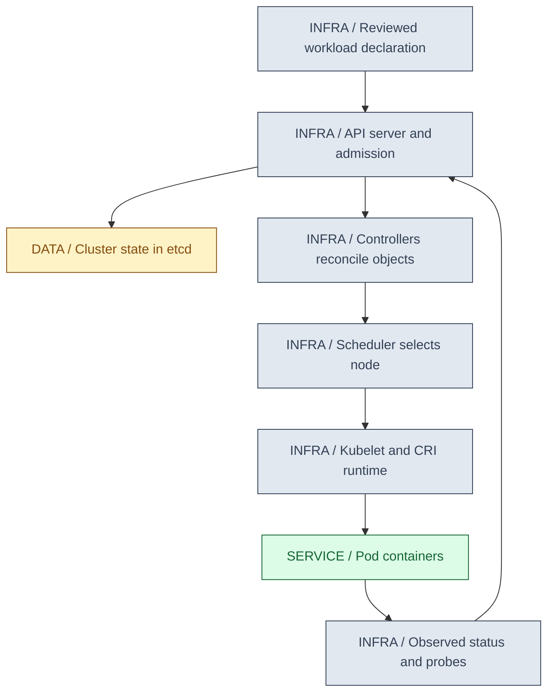
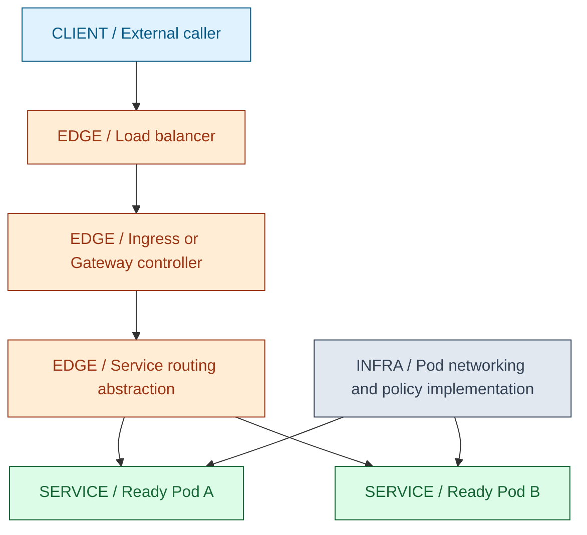
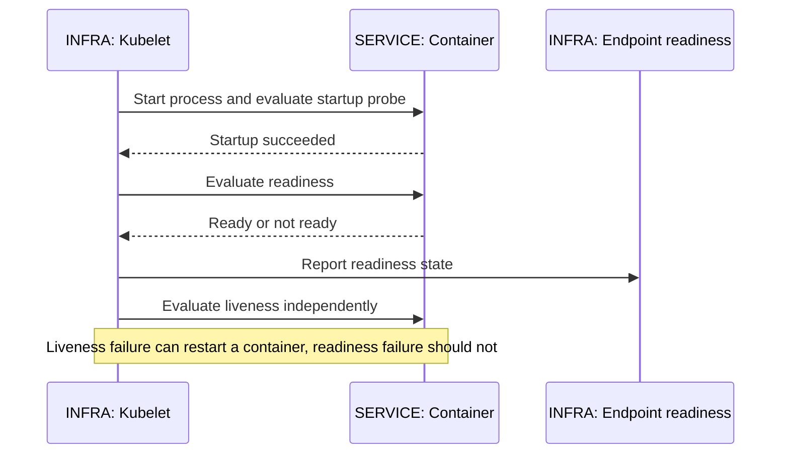
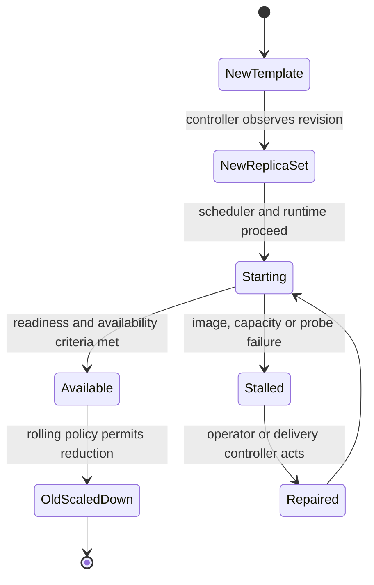
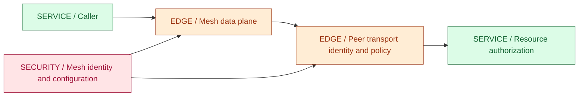

# 15 / Kubernetes and Production Workloads

**Kubernetes reconciles desired objects with observed infrastructure; it does not prove that your business operation succeeded.** IntegrationHub is fictional. A healthy Deployment can coexist with stuck Kafka work, rejected provider requests or an unsafe migration. This chapter connects platform state to the application contracts already established.

**Version assumptions:** Kubernetes 1.34, Linux nodes and a compatible CRI runtime; Java 21, Spring Boot 4.0.x / Cloud 2025.1.x, PostgreSQL 17 and Kafka 4.x remain the guide baseline. CNI, CSI, ingress/Gateway controllers, metrics components, VPA and service meshes are separately installed implementations with their own versions.

**Execution status:** NOT EXECUTED. No kubectl or cluster is available. Five local checks of the saved JSON manifest passed, but Kubernetes API schema validation, admission, image execution, probes, autoscaling and rollout were not exercised. No cluster resources or cloud load balancers were created.

## Big Picture

## What You Will Be Able to Explain

- Trace a workload declaration through admission, controllers, scheduling and node execution.
- Distinguish Pods, Deployments, Services, ingress, configuration, secrets and persistent storage.
- Design startup/readiness/liveness probes that do not cause cascading restarts.
- Explain requests, limits, HPA/VPA, resource pressure and JVM process memory.
- Trace a rolling deployment and explain why stalled progress does not automatically roll back.
- Diagnose Pending, ImagePullBackOff, CrashLoopBackOff, readiness failures and OOMKilled using evidence.
- Explain RBAC, Helm and Istio/Linkerd mesh responsibilities without outsourcing application authorization to them.

> [!PRODUCTION]
> **Where this lives in IntegrationHub.** [14](14-docker.md#ch14-docker) supplies the image and process contract; [16](16-delivery.md#ch16-delivery) changes desired image/configuration through GitOps. [07](07-messaging.md#ch07-messaging) protects durable work during restarts, [08](08-security.md#ch08-security) owns identity and secrets, and [18](18-operations.md#ch18-operations) correlates platform status with business SLOs. [17](17-cloud.md#ch17-cloud) supplies the managed/cloud boundaries beneath the cluster.

## 1. Control Plane and Reconciliation

The API server validates and admits resource changes, applies authentication/authorization and persists accepted state through the cluster's storage path. etcd stores cluster state; it is not the application's ordinary database. Controllers observe desired and current resources and take actions toward convergence. The scheduler binds eligible unscheduled Pods to nodes based on constraints and available requested resources. The kubelet coordinates execution and reports status on each node.

These components are asynchronous. An accepted API write is not a completed rollout. A controller can be delayed, an image can fail to pull, a volume can fail to attach, or application startup can fail. Read status conditions and events to identify which stage owns the current failure instead of treating apply success as readiness.

Desired and observed generations help detect whether a controller has processed a specification revision. Controllers can retry actions, so application operations still need idempotency. Kubernetes recreating a worker does not know whether an external connector effect committed before the old worker disappeared.

| Platform boundary | Use when | Avoid when |
|---|---|---|
| Declarative controller | A stable desired state should be continually reconciled | An accepted declaration is called completed execution |
| Job/CronJob-style execution | Finite work needs platform scheduling and status | Platform completion is assumed to mean exactly-once business effects |
| External managed state | Stateful reliability is better delegated to a database service | A Deployment is expected to supply database replication/backups |

**Interview checks:** basic: reconciliation is asynchronous. Internals: scheduler selects, kubelet executes. Debug: find the first unsatisfied stage. Scenario: durable job identity must survive replacement Pods.

## 2. Pods, Deployments and Workload Identity

A Pod is a scheduling unit containing one or more containers that share a network namespace and selected volumes. Containers in one Pod can reach each other through localhost; containers in different Pods generally cannot. A Pod has its own lifetime and UID. When a node is lost or a Pod is replaced, the controller creates another Pod rather than moving the same running process to a new node.

A Deployment manages ReplicaSets to maintain and roll out interchangeable replicas. Labels and selectors connect ownership and traffic targeting. Accidental selector changes or overly broad selectors can orphan intended traffic or include the wrong Pods. A Service should select only the intended workload, not every application in a namespace with a vague label.

StatefulSet adds stable ordinal/network/storage associations under its contract, useful for some stateful systems. It does not implement application replication or elect a database primary correctly by itself. DaemonSets place node-oriented work on eligible nodes. Jobs and CronJobs have different completion and concurrency semantics from long-running Deployments; all need application-level duplicate-safe effects.

| Workload | Use when | Avoid when |
|---|---|---|
| Deployment | Replicas are replaceable service instances | Stable per-instance data identity is required but ignored |
| StatefulSet | Stable identities/volume associations support a designed stateful system | It is treated as an automatic database HA solution |
| Job/CronJob | Finite or scheduled execution fits the lifecycle | Repeated scheduling is assumed impossible |
| DaemonSet | Node-local agents should follow eligible nodes | Ordinary request-serving replicas are tied unnecessarily to every node |

**Interview checks:** basic: a Pod is not a durable server identity. Internals: controller and Service selectors serve different roles. Debug: compare label sets before changing networking. Scenario: separate application identity from Pod UID/IP.

## 3. Services, Ingress and Network Policy

A Service provides a stable discovery/routing abstraction over endpoints. ClusterIP is internal service access; NodePort and LoadBalancer expose other access patterns according to implementation. EndpointSlices describe eligible backends. Data traffic normally goes to the selected application endpoint through the cluster's networking implementation, not through the Kubernetes API server for every request.

Ingress declares HTTP routing intent and needs an implementing controller. Gateway API offers another set of traffic-management resources; support and behavior depend on installed controllers. Do not assume applying an Ingress object creates a functioning public route without a controller, address, DNS, TLS and policy. Long-lived SSE paths require appropriate buffering and idle-timeout configuration at each intermediary.

CNI supplies Pod connectivity according to its implementation. Service routing can use kube-proxy rules or other mechanisms such as eBPF-based implementations; packet paths are not identical across clusters. NetworkPolicy declares allowed traffic under a supporting enforcement engine. Without such support, a policy object may not enforce the isolation you expect. Policies are not HTTP resource authorization.

**[VERIFY: confirm Kubernetes API support, CNI/Service routing, NetworkPolicy enforcement, ingress/Gateway controller behavior and load-balancer/TLS integration for the chosen cluster. No network policy, ingress or packet path was tested.]**

**Interview checks:** basic: Service discovery and HTTP ingress differ. Internals: API server is not the normal application data path. Debug: inspect endpoints/selectors before blaming DNS. Scenario: verify controller and policy enforcement, not merely object existence.

## 4. ConfigMap, Secret and Configuration Rollout

ConfigMaps hold nonsecret configuration; Secrets hold sensitive configuration under Kubernetes access controls. Base64 encoding is representation, not encryption. Encryption at rest, API authorization, audit policy and external secret integration require explicit configuration and operational controls. Do not put credentials into a ConfigMap because it is easier to inspect.

Environment variables are read when the container process starts; updating the source object does not rewrite a running process's environment. Mounted configuration can update under supported volume behavior, but the application still needs to notice/reload it. Subpath mounts and immutable objects have important update distinctions. Rebuilding a datasource, SSL context or connection pool is a separate step from replacing a file.

Version configuration or include content hashes in workload templates when a rollout should establish the new configuration consistently. Keep old versions available long enough for safe rollback, subject to secret compromise policy. A mixed fleet can run old/new config during a rollout, so both states must be compatible where they share dependencies.

| Delivery method | Use when | Avoid when |
|---|---|---|
| Environment variables | Startup configuration is simple and non-dynamic | Live refresh is assumed after editing a ConfigMap |
| Mounted files | Application supports controlled reload | File updates are assumed to rebuild stateful clients automatically |
| Versioned references | Reviewed rollout and rollback need explicit identity | Old/new pods use incompatible schemas or secrets without overlap policy |

**[VERIFY: verify Secret at-rest/access configuration, ConfigMap/Secret volume propagation, subpath behavior, application reload and external-secret rotation for the selected cluster/runtime. No configuration or secret rollout ran.]**

**Interview checks:** basic: encoded is not encrypted. Internals: delivery and reload are different transitions. Debug: inspect what the process actually loaded. Scenario: config compatibility matters during rolling coexistence.

## 5. Startup, Readiness and Liveness

A startup probe gives a slow-starting container a startup policy before ordinary readiness/liveness probing proceeds under the kubelet contract. Readiness answers whether this endpoint should receive new traffic. Liveness answers whether the container should be restarted after a configured failure threshold. They are not interchangeable URLs with different names.

Do not include a remote database or optional downstream service in liveness without a compelling recovery argument. If the dependency fails, restarting every application replica does not repair it and may increase load. Readiness may reflect dependencies necessary for serving, but an overbroad readiness check can remove every backend and eliminate useful degraded behavior.

Readiness changes do not instantly terminate all existing connections or guarantee propagation through every external load balancer. During shutdown, stop admission, withdraw readiness, drain under a budget and preserve durable work. A probe responding 200 means the implemented check passed, not that a user's sync completed or a payment settled.

The fixture uses /live for startup/liveness and /ready for readiness. Its Java probe only models its own startup/shutdown flag. A real Spring Boot readiness group must be chosen according to actual service behavior rather than copied from this diagnostic server.

**[VERIFY: confirm probe timing, startup gating, endpoint propagation, termination behavior and Spring Boot health-group configuration against the selected versions. The fixture's routes are statically matched; no kubelet probe or shutdown test ran.]**

**Interview checks:** basic: unready is not dead. Internals: probe policy affects routing versus restart. Debug: identify whether a remote outage caused a restart loop. Scenario: define the smallest check that proves the intended property.

## 6. Requests, Limits, HPA and VPA

Resource requests influence scheduling and other resource-policy behavior; limits constrain runtime consumption under the container runtime/kernel. A CPU limit can cause throttling; memory pressure can cause kills or eviction depending on the boundary. A memory request is not a promise that every allocation will succeed. Account for JVM heap plus native/process memory as [14](14-docker.md#ch14-docker) explains.

HPA adjusts replica count using configured metrics. CPU utilization targets are commonly relative to requested CPU, so requests are part of the control loop. Missing metrics, inappropriate requests, slow startup and a bottleneck outside the Pods can make scaling ineffective. Scaling a worker fleet beyond database connections, partition parallelism or provider quotas simply moves the failure.

VPA can recommend or adjust resource requests under its installed mode and version. It is a separate component, not a universal default feature. Combining VPA changes to CPU requests with HPA utilization targets can alter the denominator and create undesirable interactions. Choose complementary signals and verify behavior, including whether changes require disruption or support in-place updates.

| Control | Use when | Avoid when |
|---|---|---|
| Explicit requests | Scheduling needs honest resource demand | Zero/arbitrary requests distort packing and HPA interpretation |
| HPA | More replicas can increase useful throughput | Shared dependencies or hot partitions are the real bottleneck |
| VPA recommendations | Resource evidence should improve requests | Automatic changes conflict with another scaling loop |
| Load/backlog metric | CPU does not represent the constrained work | Queue depth alone ignores age, service time and downstream quota |

> [!MECHANISM]
> **Autoscaling is a feedback loop with delay.** Metrics arrive after work occurs, replicas take time to schedule/start, and dependencies may not gain capacity. Preserve headroom and admission control instead of expecting scaling to absorb every spike instantly.

**[VERIFY: verify requests/limits enforcement, metrics availability, HPA stabilization, VPA modes and in-place resizing support for the actual Kubernetes/components/JDK combination. No autoscaling, resource-pressure or OOM experiment ran.]**

**Interview checks:** basic: requests and limits differ. Internals: HPA's metric denominator matters. Debug: check missing metrics and shared constraints. Scenario: coordinate scaling with admission and recovery headroom.

## 7. Rollouts, Disruption Budgets and Helm

A Deployment rolling update creates new replicas and removes old ones according to surge/unavailable policy, readiness and progress. maxSurge needs spare schedulable capacity; maxUnavailable constrains rollout availability but does not prove enough business throughput. A new Pod that becomes ready too early can pass a rollout while failing real requests.

A progress deadline reports stalled progress; the basic Deployment controller does not promise automatic business-aware rollback. An external delivery controller or operator can choose rollback under evidence. A PodDisruptionBudget constrains eligible voluntary disruptions, not all node failures and not every Deployment rollout action. Plan application redundancy and rollout strategy separately.

Helm packages and templates Kubernetes resources with values and release metadata. Rendering a chart can produce syntactically valid but semantically unsafe resources. Review rendered output, scope values, avoid plaintext secrets in values/history, and validate chart changes like code. Helm rollback changes selected release resources; it cannot restore a database column that a migration deleted.

| Rollout tool | Use when | Avoid when |
|---|---|---|
| Rolling Deployment | Old/new versions can coexist and spare capacity exists | Shared schema changes break one version during rollout |
| PDB | Controlled voluntary eviction needs an availability budget | It is called protection against every outage |
| Helm | Parameterized reusable resource packages help | Template abstraction hides unsafe rendered policies |

**Interview checks:** basic: rollout progress is not business correctness. Internals: surge consumes capacity. Debug: inspect the new ReplicaSet and its Pods. Scenario: rollback includes config/schema compatibility, not only an image revision.

## 8. Stateful Workloads and Persistent Storage

PersistentVolumeClaims request storage under a StorageClass/CSI contract; volume provisioning, attachment, topology and access modes affect scheduling and failover. A Pod can remain Pending because a volume cannot bind or attach even when CPU and memory are available. An application that expects multiple writers cannot safely assume a single-writer volume will provide that behavior.

StatefulSet identity helps associate a replica with its volume and network identity. Replication, leader election, corruption recovery and backups still belong to the stateful application/operator. Recreating a Pod with the same claim does not mean the database has recovered or caught up. Test restore and failover, including key/credential availability, rather than equating persistent storage with durability against all failures.

Volume deletion/retention depends on resource policy and workflow. Do not casually delete claims to resolve an attachment problem. emptyDir is Pod-lifetime scratch, not persistent business storage. Node disk pressure and ephemeral-storage usage can evict workloads even when Java heap is fine.

**[VERIFY: confirm CSI/StorageClass topology, access modes, reclaim/retention policy, snapshot consistency and StatefulSet update/recovery behavior against the selected storage and operator. No volume, database operator or restore was exercised.]**

**Interview checks:** basic: persistence is not backup. Internals: storage topology constrains placement. Debug: inspect PVC/PV/events before deleting anything. Scenario: choose a managed database when it reduces the operational burden appropriately.

## 9. RBAC and Service Mesh

RBAC grants verbs on resource types within a scope. Bind the smallest roles required by a workload or operator; namespace scope is useful but not a complete tenant-security guarantee. Avoid mounting service-account credentials into a Pod that needs no Kubernetes API access. Admission/security policies, network policy and application authorization are complementary controls.

Istio and Linkerd are service-mesh options that provide configured transport identity, traffic policy and observability through their control/data-plane designs. Sidecars and other mesh architectures differ by product/version. A mesh can establish mTLS between workloads but cannot infer whether a caller may access a particular tenant's job.

Traffic splitting can support canaries, but evaluation and promotion still need workload metrics and a rollback decision. Mesh retries can compound application/gateway retries and repeat unsafe mutations. Mesh injection adds resource, startup and debugging responsibilities; validate probe interception, shutdown order and protocol behavior rather than assuming transparency.

> [!DECISION]
> **Adopt a mesh for a specific operational need.** Consistent workload identity or traffic policy can justify it, but a small system may be simpler with explicit TLS, good clients and platform routing. Count data-plane cost and failure diagnosis along with features.

**[VERIFY: confirm RBAC/admission enforcement and the chosen Istio/Linkerd data-plane architecture, mTLS identity, traffic split, retry, probe and shutdown behavior for installed versions. No mesh or RBAC authorization test ran.]**

**Interview checks:** basic: RBAC governs Kubernetes API actions. Internals: mesh transport identity is not tenant authorization. Debug: count retries at all layers. Scenario: add a mesh only with an owner for its configuration and failure modes.

## 10. Troubleshooting Playbook

Start with the intended revision, namespace, Pod UID and timeline. Inspect status conditions and recent events, then correlate container logs, previous termination state, resource metrics and application traces. These labels are diagnostic categories, not captured output from this environment.

| Symptom | First discriminating evidence | Direction of repair |
|---|---|---|
| Pending | Scheduling events, requested resources, taints/affinity, PVC binding | Fix placement/capacity/storage constraints rather than restarting the app |
| ImagePullBackOff | Image reference, registry credentials, node reachability and platform | Correct image availability/authentication; do not change application probes |
| CrashLoopBackOff | Previous container logs, exit reason, command/config and liveness events | Fix startup failure or inappropriate restart policy; backoff is a symptom |
| Readiness failure | Exact probe response/port/path and required dependencies | Correct readiness contract or serving failure; avoid automatic restart as the only response |
| OOMKilled | Termination reason plus cgroup/process/JVM memory | Bound allocations and budget process memory; distinguish heap/native pressure |
| Running but not serving | Service selectors/endpoints, listen port, network policy, TLS and ingress | Follow the data path hop by hop |

For CrashLoopBackOff, current logs may miss the prior process's failure; inspect previous container evidence under authorized access. For image failures, a mutable tag that existed on one node may not be available elsewhere. For Pending during rollout, maxSurge may request capacity the cluster lacks. For readiness oscillation, aggressive thresholds can cause unstable routing even when restarting is unnecessary.

Read-only diagnostics such as get/describe/logs still require authorization and can expose sensitive metadata or logged values. Select the approved cluster/context and namespace before use. Do not paste secrets or raw customer payloads into incident notes. This chapter executes no kubectl command and performs no forced deletion or resource mutation.

> [!TRAP]
> **Do not erase the evidence first.** Deleting Pods or raising limits immediately may hide the failure while preserving its cause. Capture termination reason, previous logs, events and resource history, then make the smallest change that tests the diagnosis.

**Interview checks:** basic: status reason narrows the owning layer. Internals: a restart loop is not a root cause. Debug: compare image, scheduling, process, probe and network evidence. Scenario: identify one falsifiable hypothesis before changing several settings.

## 11. Saved Workload and Validation Limits

`code/15-kubernetes/workload.json` is a native JSON Kubernetes List containing Namespace, Deployment, ClusterIP Service and autoscaling/v2 HPA. It references the local image from Chapter 14 with imagePullPolicy Never, two initial replicas, bounded surge/unavailability, non-root/read-only security settings, disabled service-account token mounting and explicit scratch storage.

The CPU/memory/probe/HPA values are illustrative, not benchmark-derived. The HPA needs a functioning metrics pipeline; the image must exist on every eligible node under the local-image approach. Production should promote approved immutable registry identities with the right pull policy and credentials. This diagnostic workload is not IntegrationHub-lite and contains no business backend or database.

Windows PowerShell from workspace root: `& './docs/java-fs-guide/code/15-kubernetes/run.ps1'`. The actual preflight parsed JSON and checked selector agreement, named ports, HPA target, local-image/token policy and probe paths. It recorded staticStatus PASS and overall NOT EXECUTED. It does not validate against Kubernetes OpenAPI schemas, admission policies or a running API server.

> [!INTERVIEW]
> **Describe which controller owns the next action.** API acceptance, Pod scheduling, image startup, readiness and business processing have different owners. This keeps an operational answer precise instead of treating every symptom as Kubernetes being down.

## Explained-Here Index and Sources

| Concepts | Explanation |
|---|---|
| Kubernetes and control plane | [Reconciliation](#ch15-control) |
| Pod, Deployment and StatefulSet | [Workloads](#ch15-workloads) |
| Service and Ingress | [Network path](#ch15-network) |
| ConfigMap and Secret | [Configuration](#ch15-config) |
| Probes and readiness | [Health contracts](#ch15-probes) |
| HPA, VPA and resource limits | [Resource control](#ch15-resources) |
| Rollout and Helm | [Change management](#ch15-rollout) |
| Stateful storage | [Persistence](#ch15-stateful) |
| RBAC, Istio, Linkerd and service mesh | [Policy](#ch15-rbac-mesh) |
| Pending, image pull, crash loop, OOM and readiness failures | [Troubleshooting](#ch15-troubleshooting) |

Verification destinations: [Kubernetes concepts](https://kubernetes.io/docs/concepts/), [probe configuration](https://kubernetes.io/docs/tasks/configure-pod-container/configure-liveness-readiness-startup-probes/), [resource management](https://kubernetes.io/docs/concepts/configuration/manage-resources-containers/), [Helm](https://helm.sh/docs/), [Istio](https://istio.io/latest/docs/) and [Linkerd](https://linkerd.io/2/overview/). No installed behavior is inferred solely from these pointers.

## Related Chapters

Use [00](00-master-map.md#ch00-master-map), [06 state](06-databases.md#ch06-databases), [07 workers](07-messaging.md#ch07-messaging), [08 security](08-security.md#ch08-security), [10 capacity](10-system-design.md#ch10-system-design), [14 containers](14-docker.md#ch14-docker), [16 delivery](16-delivery.md#ch16-delivery), [17 cloud](17-cloud.md#ch17-cloud), [18 operations](18-operations.md#ch18-operations), [21 network](21-network-os.md#ch21-network-os) and [23 JVM performance](23-jvm-performance.md#ch23-jvm-performance). Generated navigation is reciprocal.

## One-Page Cheat Sheet

**Control:** API acceptance is not convergence. Controllers reconcile, scheduler binds, kubelet/runtime executes. Replaced Pods have new lifetimes; business identity must outlive them.

**Traffic/config:** Service selectors and endpoints connect traffic, ingress requires a controller, CNI/policy implementation matters. Base64 is not encryption. Environment and file configuration have different refresh behavior.

**Health/resources:** startup, readiness and liveness prove different things. Do not restart every Pod because a remote dependency failed. Requests drive scheduling/metric interpretation; limits affect runtime. HPA/VPA are delayed loops with dependencies and constraints.

**Change/state:** surge needs capacity, stalled Deployment progress does not imply automatic rollback, and PDB covers particular voluntary disruptions. StatefulSet/PVC identity does not supply replication or backups. Helm output still requires review.

**Diagnosis:** Pending is placement/storage, ImagePullBackOff is image access, CrashLoopBackOff is repeated process/restart failure, OOMKilled needs memory evidence, and unready needs the exact probe contract. Mesh mTLS is not tenant authorization. File checks passed; all cluster runtime behavior remains NOT EXECUTED.

## Interview Corner

### Basic: What Happens After Applying a Deployment?

The API accepts desired state, controllers reconcile ReplicaSets/Pods, the scheduler selects nodes and kubelets start containers. Each stage can fail independently; apply success is not readiness.

### Internals: Is a Pod Moved to Another Node?

Normally a replacement Pod is created with a new identity/lifetime. The application must recover durable work independently of the original process or IP.

### Trace/Debug: A Service Has No Reachable Backends.

Check selectors, EndpointSlices, readiness and ports before DNS or ingress changes. Then inspect CNI/policy and the actual listen address.

### Scenario: Database Outage Causes Every Pod to Restart.

The liveness check may include a remote dependency that restarting cannot repair. Separate local liveness from readiness/degraded service policy and bound downstream retries.

### Basic: HPA Versus VPA?

HPA changes replica count from metrics; VPA recommends/adjusts resource requests under its mode. Their feedback loops can interact, especially when CPU utilization uses requests as a denominator.

### Internals: Why Can Rollout Stay Pending With Healthy Old Pods?

Surge requires spare resources and compatible placement/storage. Old replicas can remain healthy while new ones cannot schedule, pull an image or become ready.

### Trace/Debug: Exit 137 Means Heap Exhaustion?

Not necessarily. Inspect termination reason and cgroup/JVM evidence; SIGKILL can have other causes, and process memory includes more than heap.

### Scenario: A Secret Was Rotated but the App Uses the Old Value.

Check whether it was injected as environment, mounted with update limitations, or read into a long-lived client. Secret delivery and application reload/reconnect are separate.

### Basic: Does StatefulSet Make PostgreSQL Highly Available?

No. Stable identity/storage supports an application/operator design; replication, promotion, backups and restore testing remain separate responsibilities.

### Internals: Does PDB Prevent Every Outage?

No. It constrains eligible voluntary disruptions, not all failures or every rollout action. Redundancy, capacity and application recovery still matter.

### Trace/Debug: Mesh Enabled and Requests Are Duplicated.

Inspect retry policies at client, gateway, mesh and application layers. Multiple retry owners can multiply attempts, especially after uncertain mutation outcomes.

### Scenario: What Does a Manifest-Only Test Prove?

Only the checked file properties. API schemas, admission, scheduling, probes, networking and application correctness need their own environments and tests.