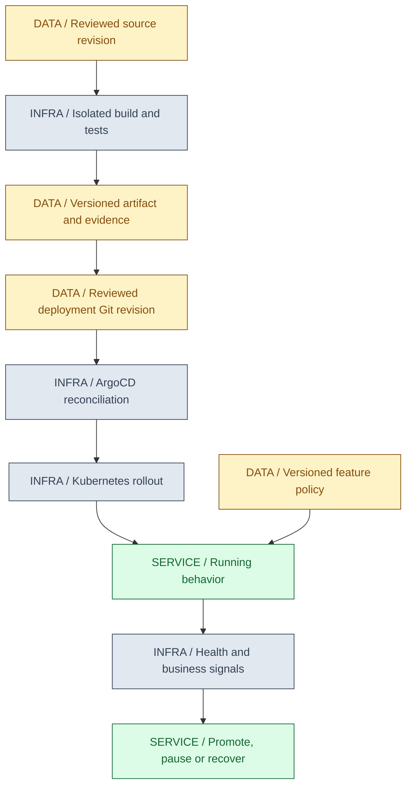
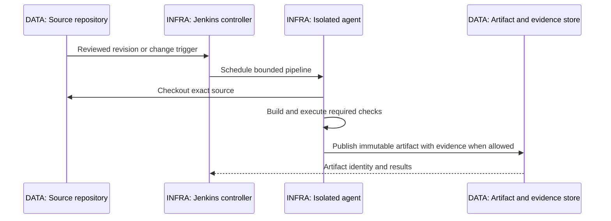
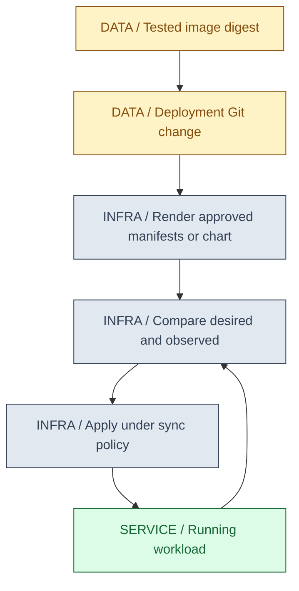
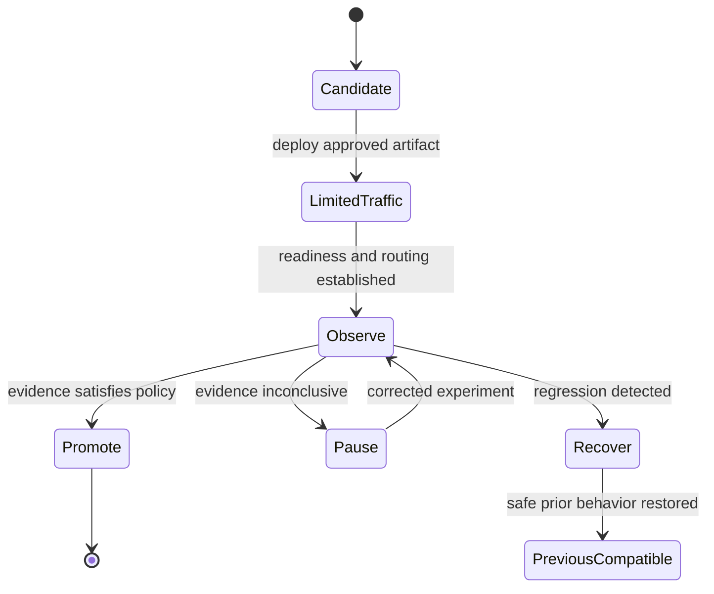

# 16 / Build, Ship and Roll Back

**A release is a traceable change to running behavior, not merely a successful build.** IntegrationHub is fictional. Source, dependencies, tests, image, deployment configuration, schema and feature flags all contribute to what a user experiences. Each needs identity, ownership and a recovery policy.

**Version assumptions:** Java 21, Spring Boot 4.0.x / Cloud 2025.1.x, PostgreSQL 17, Kafka 4.x and Kubernetes 1.34 remain the baseline. Maven/Gradle, Jenkins/plugins, ArgoCD, Harness and LaunchDarkly versions must be chosen and verified separately. The supplied Jenkinsfile expects an approved Linux agent with JDK 21+, not the current Windows shell.

**Execution evidence:** PromotionLab.mjs passed four synthetic policy checks on the existing Node-compatible runtime. Jenkins pipeline execution, Java builds, Maven/Gradle resolution, image publishing, GitOps reconciliation and deployment are NOT EXECUTED. No credentials, registry, cluster or cloud account were used.

## Big Picture

## What You Will Be Able to Explain

- Trace a reviewed source revision to an immutable promoted artifact and running configuration.
- Distinguish Maven lifecycle/scopes from Gradle task graphs and understand reproducible/offline build limits.
- Design Jenkins stages, shared-library use, agents and credentials around trust boundaries.
- Explain ArgoCD desired-state reconciliation and Harness-style orchestration without giving both conflicting ownership.
- Compare rolling, blue-green and canary releases and separate deployment from feature exposure.
- Plan application, schema, configuration and flag rollback together.
- Connect Agile/Kanban work-in-progress discipline with small, testable changes and operational feedback.

> [!PRODUCTION]
> **Where this lives in IntegrationHub.** Jenkins builds/test-checks [14's container inputs](14-docker.md#ch14-docker), deployment Git references immutable image identity, and ArgoCD drives [15's workload](15-kubernetes.md#ch15-kubernetes). [06](06-databases.md#ch06-databases) owns schema compatibility, [08](08-security.md#ch08-security) owns pipeline trust, [18](18-operations.md#ch18-operations) supplies promotion evidence, and [19](19-testing.md#ch19-testing) explains quality gates. The reference design does not require every delivery product to be deployed together.

## 1. Git Workflow and Release Identity

Short-lived branches and frequent integration reduce the amount of unreviewed divergence, while protected review/check policies make the mainline a useful integration point. Long-lived release branches can be justified for supported versions, but every additional line creates merge, testing and patch-propagation work. Branch naming does not establish quality; enforced checks and ownership do.

A release should identify source commit, dependency/build inputs, artifact digest, test/security evidence, configuration revision and applicable schema/flag state. A version label alone is too weak if the same tag can point to rebuilt bytes. Promote the same tested artifact rather than rebuilding independently for each environment and hoping outputs are identical.

Reverting a published change creates an auditable new history entry; rewriting shared history can break collaborators and evidence. A revert may still be unsafe if later data or schema changes depend on the removed code. Treat source reversal as one input to recovery, not an automatic undo of every side effect.

| Workflow | Use when | Avoid when |
|---|---|---|
| Frequent integration with protected checks | Small changes and rapid feedback fit the team | Mainline is deployable only by convention with skipped gates |
| Maintained release branches | Supported versions need independent patches | Branches drift without clear support and merge policy |
| Build once, promote by identity | Test evidence must follow exactly the deployed bytes | Each environment silently rebuilds from a moving dependency set |

**Interview checks:** basic: source revision and artifact identity differ. Internals: promotion preserves evidence-to-bytes linkage. Debug: compare digests, not only version names. Scenario: a revert still requires schema/data compatibility review.

## 2. Maven and Gradle Builds

Maven's lifecycle phases organize work: validate, compile, test, package, verify, install and deploy are not synonymous commands. Plugins bind goals to phases. verify can include integration/quality gates configured in the project; install places artifacts in the local repository; deploy publishes to an artifact repository, not automatically to Kubernetes. Skipping tests to get an artifact quickly changes what evidence that artifact has.

Dependency scopes separate production compilation/runtime from testing or platform-provided APIs. dependencyManagement/BOM entries control versions for dependencies actually used; they do not necessarily add all listed libraries to the application. Plugin versions and repositories matter too. A transitive upgrade can change behavior even when direct source did not change.

Gradle models a task graph supplied by plugins and project configuration. With common JVM plugins, build coordinates checks and assembly, but exact tasks and integration-test wiring are project-specific. api versus implementation under the Java Library plugin controls intended dependency exposure. A version catalog names coordinates; dependency locking and verification address different reproducibility/trust needs.

Java toolchains select a compiler/runtime, while --release 21 constrains Java language/API/bytecode compatibility for the compilation target. Running the build with a newer JDK does not automatically make every emitted artifact compatible with Java 21 unless configured appropriately. Record compiler and build-tool identity along with the dependency graph.

Offline flags mean required artifacts must already be available; they are not an instruction to install missing dependencies. A wrapper may need its own distribution before the build tool can even honor an offline flag. Maven's offline verify or Gradle's offline build still fail when plugins/dependencies are absent. Do not retry online silently under the guide's restriction.

| Build technique | Use when | Avoid when |
|---|---|---|
| Pinned toolchain and dependency policy | Repeated builds should have explainable inputs | Moving snapshots/plugins silently change outputs |
| Verified dependency cache | CI needs efficient repeatable resolution | Untrusted branches can poison a trusted cache |
| Separate integration-test gate | Real boundaries require more than unit tests | package success is assumed to include unconfigured integration tests |
| Offline mode | Inputs are intentionally preprovisioned | It is presented as a way to obtain missing artifacts |

**[VERIFY: confirm Maven/Gradle plugin lifecycle, toolchain, dependency locking/verification, wrapper distribution and test-task behavior against the actual project and versions. Neither build tool nor its dependency cache is available here; no Maven/Gradle build ran.]**

**Interview checks:** basic: Maven deploy is repository publication. Internals: phases/goals and task graphs differ. Debug: inspect effective configuration and resolved graph. Scenario: reproducibility includes plugins, toolchains and trusted caches.

## 3. Jenkins Pipelines, Agents and Shared Libraries

The controller coordinates jobs, configuration and scheduling; agents execute build steps in their assigned environments. Keep untrusted builds away from controller administration and protected credentials. An agent label expresses an environment requirement, not proof that the environment is correct or isolated. Prefer disposable or well-controlled workers with bounded workspaces and explicit tool versions.

A declarative pipeline organizes stages and policy such as timeouts, concurrency and post actions. Checkout identifies source, build produces outputs, tests create evidence, and artifact publication/promotion occurs only after required gates. A stage green because errors were swallowed is not evidence of success. Archive test results even on failure where safe, but do not publish a release artifact as approved after mandatory checks failed.

Shared libraries reduce repeated pipeline code but become powerful supply-chain inputs. Pin reviewed library versions, define stable step contracts and test changes before broad rollout. A trusted library may execute privileged logic; letting an untrusted pull request select arbitrary library code can cross a security boundary. Avoid a library that hides all stages and leaves teams unable to explain what ran.

Credential binding narrows how secrets are exposed to a step, but log masking is not containment. Malicious build code can exfiltrate values even if common string patterns are masked. Do not give untrusted change builds production deploy/signing credentials. Use short-lived scoped identity when supported, isolate environments, and prevent secrets entering command-line history, artifacts or caches.

The saved `code/16-delivery/Jenkinsfile` checks out this repository on a linux-jdk21 agent, compiles Chapter 14's ProbeServer.java, runs its self-test and archives class files. It deliberately has no registry push, credential binding or deployment step. Those require a real trusted environment, not placeholders that appear production-ready. The pipeline itself is NOT EXECUTED.

**[VERIFY: validate Jenkins declarative syntax, plugin/shared-library versions, agent isolation, credential binding and SCM/approval permissions in the selected controller. The saved Jenkinsfile is source-reviewed only; no Jenkins parser or agent executed it.]**

**Interview checks:** basic: agents execute, controller orchestrates. Internals: shared libraries and credentials are trust inputs. Debug: inspect actual stage exit status and archived results. Scenario: separate untrusted tests from privileged publication.

## 4. ArgoCD and Desired-State Ownership

GitOps makes reviewed configuration the desired-state source. ArgoCD compares rendered desired resources with the cluster, applies permitted changes under sync policy and reports sync/health status. It is not the same job as compiling source or proving business outcomes. A Synced application can be unhealthy; a healthy Kubernetes resource can still violate a business SLO.

Self-healing can restore declared state after manual drift; pruning can remove resources no longer desired. Both need boundaries and safeguards. A broad prune affecting shared or stateful resources can be destructive. A manual kubectl rollback may be reverted by reconciliation if Git still demands the new image, so durable rollback normally changes the desired revision as well.

Controllers may legitimately own fields such as replica count under HPA. Define ownership and precise diff/ignore behavior rather than letting GitOps and autoscaling repeatedly overwrite each other. Avoid blanket ignore rules that hide unsafe drift. Secrets should be referenced or rendered through an approved secret-management path, not committed as plaintext under the excuse that the repository is private.

| GitOps policy | Use when | Avoid when |
|---|---|---|
| Automatic reconciliation | Desired state is reviewed and changes are bounded | Unreviewed changes can immediately reach production |
| Controlled pruning | Resource ownership and deletion consequences are known | Shared data resources disappear from a chart accidentally |
| Explicit field ownership | HPA/operators legitimately mutate fields | Broad diff suppression hides all configuration drift |

**Interview checks:** basic: sync, resource health and business health differ. Internals: reconciliation can undo manual recovery changes. Debug: inspect rendered desired state and field ownership. Scenario: recover through the declared source, with emergency exceptions controlled and reconciled.

## 5. Harness and Delivery Orchestration Choices

Harness represents another delivery-platform approach with pipeline orchestration, environment/service abstractions, connectors and execution components such as delegates depending on product configuration. Compare it by which decisions it owns: build, deployment, verification, approvals, rollback and evidence. Do not assume a product integration makes the whole pipeline safe or that its default verification matches the service's SLO.

An execution delegate/agent needs scoped network reachability and credentials. A platform that can deploy to many environments can become a powerful central trust boundary; partition permissions and approval scopes deliberately. If Jenkins builds and another platform deploys, preserve artifact identity and evidence across the handoff. If ArgoCD reconciles the cluster, avoid an independent pipeline continuously writing conflicting live state.

| Delivery ownership | Use when | Avoid when |
|---|---|---|
| Jenkins plus ArgoCD | Build and Git-driven reconciliation have clear separate ownership | Jenkins also continually patches resources against GitOps intent |
| Managed delivery orchestration | Central approval/verification workflows justify the platform | Broad connector credentials span unrelated environments |
| Simpler single pipeline | Small deployment scope does not need extra control planes | Product count grows without reducing operational risk |

**[VERIFY: confirm ArgoCD sync/prune/health/rollback behavior and Harness product/delegate/connector/verification capabilities against deployed versions and policies. No GitOps controller or Harness pipeline was contacted or executed.]**

**Interview checks:** basic: compare responsibilities, not feature lists. Internals: handoffs must preserve artifact identity. Debug: look for two writers of desired state. Scenario: choose one clear deployment authority per resource.

## 6. Rolling, Blue-Green and Canary

Rolling updates gradually replace replicas and usually need old/new compatibility against shared dependencies. Blue-green maintains two environments/sets and switches traffic under a routing policy, improving rollback options but requiring capacity and careful shared-state handling. Canary exposes a new version to a limited cohort or traffic share, compares meaningful signals and decides whether to continue.

A native Deployment replica ratio is not a precise HTTP traffic-weight guarantee. Real canary routing may need a supported ingress/mesh/progressive-delivery controller and stable cohort rules. Low-volume canaries can produce inconclusive metrics; a few successes do not establish tail-latency safety. Compare error budgets, latency, correctness and tenant/provider-specific outcomes while accounting for baseline changes.

Blue-green switches do not instantly move existing connections. Long-lived SSE and worker leases require a drain/reconnect/recovery policy. Both environments may write one database, so schema compatibility remains necessary. A traffic reversal cannot erase new-version writes already committed.

| Strategy | Use when | Avoid when |
|---|---|---|
| Rolling | Compatible versions and modest spare capacity fit | Every old/new overlap breaks a shared schema |
| Blue-green | Fast routing reversal and duplicate capacity are valuable | Shared data/configuration makes the old environment incompatible |
| Canary | Representative traffic and measurable decision criteria exist | Traffic split is assumed exact or evidence is statistically meaningless |

> [!MECHANISM]
> **A rollout changes exposure over time.** Scheduling, readiness, routing and existing connections have different delays. Record which revision handled a request so an observed regression can be attributed to the correct cohort.

**Interview checks:** basic: deploy and traffic switch are separate. Internals: replica count does not necessarily equal traffic weight. Debug: compare cohorts and existing connections. Scenario: design the recovery decision before sending canary traffic.

## 7. Feature Flags and LaunchDarkly

A flag changes behavior independently of artifact deployment. This supports progressive exposure and rapid containment when old/new paths coexist safely. The flag has an owner, default, targeting policy, lifecycle and removal plan. Long-lived unused flags multiply test combinations and make behavior difficult to reconstruct.

LaunchDarkly is an example of managed flag evaluation and targeting infrastructure. Client/server SDKs and data delivery modes have different security and freshness properties. A browser flag must not enforce authorization; the backend still rejects forbidden operations. Never expose server-side SDK credentials to the browser or send unnecessary sensitive attributes to a targeting service.

Define behavior when the flag service is unreachable or initialization is incomplete. A cached last-known value and a code default are different fallback states. Record relevant flag/configuration version with diagnostics where privacy permits. Avoid doing a network round trip on every request if the chosen SDK is designed for local evaluation, but verify its actual caching/update model.

| Flag use | Use when | Avoid when |
|---|---|---|
| Gradual feature exposure | Both paths are compatible and observable | Disabled UI is treated as authorization |
| Kill switch | A bounded reversible behavior can be stopped safely | Turning off a flag leaves data halfway through an incompatible transition |
| Temporary migration flag | Controlled old/new coexistence is needed | The flag has no owner, expiry or cleanup test |

**[VERIFY: validate LaunchDarkly/selected SDK evaluation, offline/default behavior, targeting data, credential scope and event/privacy settings for the actual environment. No SDK, flag service or cohort experiment ran.]**

**Interview checks:** basic: feature release can differ from deployment. Internals: local/default/stale evaluation states differ. Debug: correlate flag version and artifact revision. Scenario: remove flags after the transition rather than retaining permanent accidental branches.

## 8. Rollback, Schema and Configuration

Rollback is restoring an acceptable behavior under current state, not rewinding time. A prior binary may no longer read the database after a destructive migration. A prior secret may be revoked. A prior flag value may invoke code that assumes fields no longer exist. Keep an explicit compatibility window across application, schema, messages and configuration.

Expand/contract migrations allow old/new versions to coexist: add compatible structure, dual-write/backfill where appropriate, switch readers and remove old structure only after evidence that it is no longer needed. Reversing traffic during the window is easier than reconstructing dropped data. [06](06-databases.md#ch06-databases) owns the database mechanics; the delivery pipeline must respect their ordering.

Approvals should bind to exact artifact/configuration intent and relevant current state. If another release changes the target after approval, the old approval may no longer be valid. Use a reviewed generation/revision or equivalent compare-and-set precondition so two promotions do not silently overwrite each other. Approval is not merely a reusable green button.

The PromotionLab models this with a current generation/schema, a synthetic artifact digest and evidence flags, and an approval matching that digest/generation. It rejects missing evidence, mutable tag-shaped identity, stale approval and an older artifact unable to read the current schema. Its booleans are placeholders for independently verified evidence; checking them does not validate a real signature, image or migration.

> [!TRAP]
> **A previous image is not automatically a safe rollback.** Compatibility depends on the current data, schema, secrets and behavior. A rollback that restarts successfully can still corrupt data or break consumers.

**Interview checks:** basic: rollback does not undo committed effects. Internals: approvals have a target revision. Debug: check schema/message compatibility before image reversal. Scenario: prefer a small forward repair when the old behavior is no longer compatible.

## 9. Supply Chain and Quality Gates

Protect source review, dependency resolution, build execution, artifact storage and deployment authority as one chain. Pin and verify inputs where appropriate, isolate untrusted builds, generate useful provenance/SBOM evidence and restrict signing/publishing rights. A digest proves identity; signatures and attestations are meaningful only under a defined trusted signer and verification policy.

Quality gates should correspond to risks: compilation, unit tests, integration/contract tests, static analysis, dependency/image policy, migration compatibility and deployment health. A scan's absence of findings is not proof of security. Thresholds and exceptions need owners and expiry, not blanket bypasses hidden in a shared library.

Keep release evidence retrievable: commit, build tool identity, resolved inputs, test outcomes, image digest, config revision and approval decision. Avoid collecting secrets or raw customer data in artifacts. Reproducible builds and provenance complement each other; neither alone proves business correctness.

> [!DECISION]
> **A gate should either prevent a named failure or supply a decision-relevant signal.** Add the check at the owning boundary and preserve its failure. Do not accumulate green badges whose scope nobody can explain.

**Interview checks:** basic: identity, provenance and correctness differ. Internals: untrusted caches/build code can cross trust boundaries. Debug: trace an artifact back to exact evidence. Scenario: exceptions require a reviewed risk decision and expiry.

## 10. Agile, Kanban and Operational Feedback

Small changes are easier to review, test, observe and reverse. Agile practices should shorten the feedback loop from a user need to evidence, not merely increase ceremony. A definition of done for a backend change includes tests, compatibility, operational visibility and recovery implications appropriate to its risk.

Kanban makes work and bottlenecks visible and limits work in progress. If many changes are waiting for one environment or reviewer, starting more work can increase lead time without increasing delivery throughput. Distinguish active implementation from blocked, review, validation and production observation. Operational work and incident follow-ups should be visible, not permanently squeezed between feature tickets.

Use deployment/recovery metrics to identify system constraints, not rank individuals without context. Faster deployment frequency is not useful if each release consumes error budget or hides untested changes. Retrospectives and incident learning should change a test, design, runbook or decision rule rather than only produce a document.

**Interview checks:** basic: WIP limits reduce uncontrolled queues. Internals: throughput and lead time depend on the bottleneck. Debug: inspect blocked work, not only coding speed. Scenario: make operability part of done for a change that affects production.

## 11. Saved Artifacts and Evidence

`code/16-delivery/Jenkinsfile` is a complete small declarative teaching pipeline for the existing Java probe. It requires configured Jenkins SCM/plugins and a Linux JDK agent; those are unavailable. It does not build IntegrationHub-lite, publish images, mutate Git or deploy anything.

`code/16-delivery/PromotionLab.mjs` and its Windows PowerShell runner execute only local synthetic policy checks. From workspace root: `& './docs/java-fs-guide/code/16-delivery/run.ps1'`. The actual result is PASS for four checks: valid reviewed intent promotes without mutating prior state; stale approval is rejected; missing evidence or a mutable tag is rejected; schema-incompatible rollback is rejected. The report explicitly records Jenkins NOT EXECUTED.

**[VERIFY: execute the saved Jenkinsfile on an approved isolated controller/agent and replace synthetic promotion evidence with validated artifact, test, approval and schema records. The local JavaScript PASS is not pipeline syntax, build, signature, deployment or rollback evidence.]**

> [!INTERVIEW]
> **Trace one immutable artifact through the pipeline.** Say which checks ran, who may publish it, how desired state references it, what observes its rollout and which compatibility facts permit recovery. That is a delivery design rather than a tool list.

## Explained-Here Index and Sources

| Concepts | Explanation |
|---|---|
| Git | [Source and release identity](#ch16-git) |
| Maven and Gradle | [Build models](#ch16-builds) |
| Jenkins, shared libraries, agents, credentials | [Trusted execution](#ch16-jenkins) |
| ArgoCD and GitOps | [Desired-state ownership](#ch16-gitops) |
| Harness | [Orchestration choices](#ch16-harness) |
| Rolling deployment, blue-green, canary | [Exposure strategy](#ch16-rollouts) |
| LaunchDarkly and feature flags | [Behavior release](#ch16-flags) |
| Rollback | [Compatibility](#ch16-rollback) |
| Supply chain | [Evidence and gates](#ch16-supply-chain) |
| Agile and Kanban | [Feedback and WIP](#ch16-agile) |

Verification destinations: [Maven lifecycle](https://maven.apache.org/guides/introduction/introduction-to-the-lifecycle.html), [Gradle user manual](https://docs.gradle.org/current/userguide/userguide.html), [Jenkins Pipeline](https://www.jenkins.io/doc/book/pipeline/), [ArgoCD](https://argo-cd.readthedocs.io/), [Harness](https://developer.harness.io/docs/) and [LaunchDarkly](https://launchdarkly.com/docs/). These are reference destinations, not claims of fresh installed-system validation.

## Related Chapters

Use [00](00-master-map.md#ch00-master-map), [03 Spring](03-spring.md#ch03-spring), [06 migrations](06-databases.md#ch06-databases), [08 security](08-security.md#ch08-security), [10 resilience](10-system-design.md#ch10-system-design), [13 integration](13-integration.md#ch13-integration), [14 images](14-docker.md#ch14-docker), [15 orchestration](15-kubernetes.md#ch15-kubernetes), [17 cloud](17-cloud.md#ch17-cloud), [18 operations](18-operations.md#ch18-operations), [19 quality](19-testing.md#ch19-testing) and [25 architecture](25-architecture.md#ch25-architecture). Generated links are reciprocal.

## One-Page Cheat Sheet

**Identity:** reviewed commit, controlled build inputs, immutable artifact, deployment revision, schema and flag state all matter. Build once and promote the tested bytes.

**Build:** Maven phases bind plugin goals; Gradle runs a configured task graph. install/deploy in Maven do not mean application rollout. Pin toolchains and verify dependencies/caches. Offline means inputs already exist.

**Trust:** agents execute code; controllers and shared libraries hold powerful authority. Masking is not secret containment. Keep untrusted builds away from release credentials and trusted caches.

**Delivery:** GitOps compares desired/observed resources, not business truth. Define sync/prune/field ownership. Rolling, blue-green and canary trade capacity and exposure risk; route changes do not undo data writes.

**Recovery:** flags alter behavior separately from deployment and need defaults/owners/cleanup. Old artifacts must remain compatible with current schema/secrets. Bind approval to exact intent and current revision.

**Evidence:** four synthetic promotion checks passed. Jenkins, Java, Maven/Gradle, registry, GitOps and deployment remain NOT EXECUTED. Small changes and WIP limits improve feedback only when quality and operability are part of done.

## Interview Corner

### Basic: CI Versus CD?

CI integrates and validates changes; delivery/deployment moves approved artifacts toward or into environments under policy. A build passing does not establish rollout or business success.

### Internals: Why Build Once and Promote?

It binds test evidence to the same bytes deployed later. Rebuilding per environment can introduce dependency/toolchain differences even from one source commit.

### Trace/Debug: Maven Package Passed but Integration Is Broken.

Inspect which goals/tests were actually bound and executed. Package success is not evidence for integration gates that were skipped or never configured.

### Scenario: How Do You Protect Jenkins Credentials?

Separate trusted publication from untrusted change builds, use scoped short-lived identity where possible, isolate agents and keep secrets out of arguments/artifacts/logs. Masking alone cannot contain malicious code.

### Basic: ArgoCD Synced Means Healthy?

No. Sync means desired and observed resources match under comparison rules. Resource health and user-visible behavior are separate signals.

### Internals: Why Did Manual Rollback Get Undone?

Desired Git state still required the newer revision and reconciliation restored it. Update the authoritative desired state or follow a controlled emergency override/reconciliation process.

### Trace/Debug: Canary Looks Fine but Full Rollout Fails.

The canary may have unrepresentative traffic, insufficient duration, different tenants or inadequate capacity signals. Compare cohorts and the bottleneck, not just a few successful responses.

### Scenario: Can You Roll Back After Dropping a Column?

Only if the chosen prior artifact is compatible with the current schema or a safe data recovery plan exists. Prefer expand/contract and retain a tested compatibility window.

### Basic: Flag Off Equals Rollback?

It changes one behavior path, not necessarily the artifact, schema or side effects. Define safe defaults and whether the old path still works with current data.

### Internals: Why Bind Approval to a Generation?

The environment may change after review. A stale approval must not silently overwrite a newer intent or promote against different compatibility assumptions.

### Trace/Debug: Dependency Cache Made a Build Untrustworthy.

Inspect cache writers, artifact verification and resolved coordinates. Reused bytes from untrusted builds can cross a supply-chain boundary even when source review was sound.

### Scenario: What Should a Delivery Retrospective Change?

A concrete gate, test, design, runbook or policy tied to the observed failure. A document alone does not improve the next release's safety.