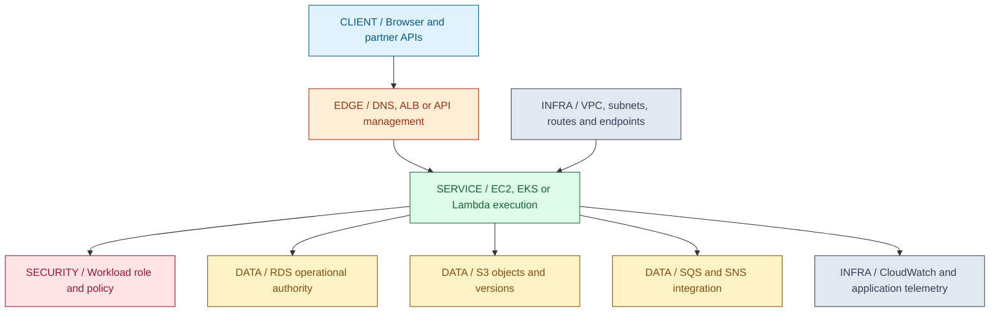
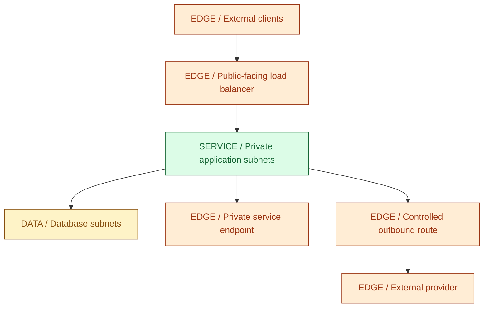
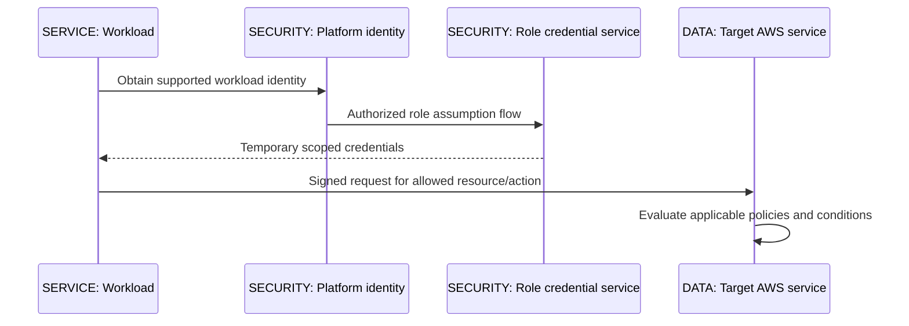
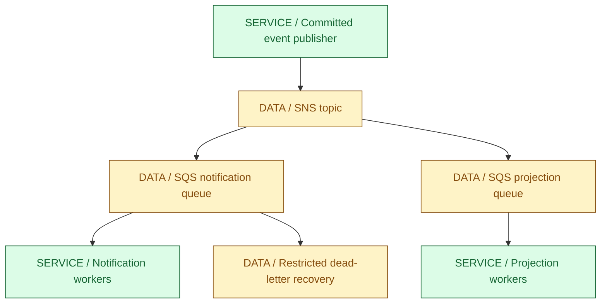
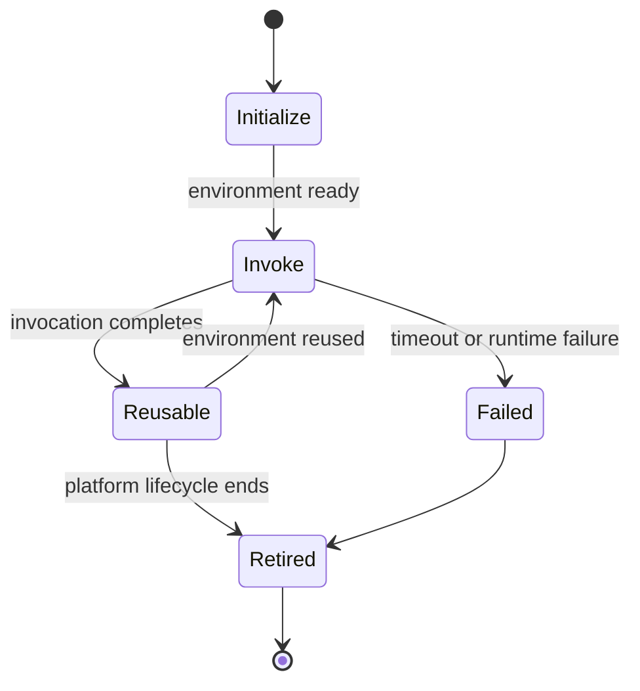
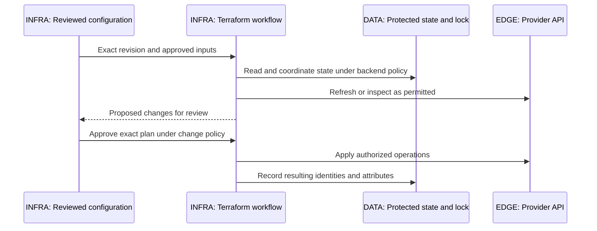

# 17 / Cloud and Infrastructure

**Managed infrastructure changes who operates a component; it does not remove your application contract.** IntegrationHub is fictional. AWS can operate control planes and storage services while the team still owns authorization, data classification, quotas, retry semantics, recovery objectives and cost. A cloud service name is not a substitute for those decisions.

**Version assumptions:** Java 21, Spring Boot 4.0.x / Cloud 2025.1.x, PostgreSQL 17, Kafka 4.x and Kubernetes 1.34 remain illustrative baselines. AWS features, regional availability and quotas change independently of those versions. The saved Terraform JSON uses a declared Terraform 1.5+ range and AWS provider 5.x constraint as an unexecuted example, not a current-patch recommendation.

**Execution status:** NOT EXECUTED. Terraform and AWS CLI are unavailable. Five local JSON/declaration checks passed, but no Terraform provider was installed, no plan or apply ran, and no AWS credentials/account/API were accessed. The examples create no billable resources in this session.

## Big Picture

## What You Will Be Able to Explain

- Separate region/AZ, account, network, workload and data ownership boundaries.
- Trace VPC routing, security groups, NACLs, NAT and private service access.
- Choose EC2, EKS or Lambda from runtime, operations and workload constraints.
- Explain S3 object/version behavior and RDS availability/read-replica/backup distinctions.
- Use IAM roles and temporary credentials without confusing network access with authorization.
- Compare SQS and SNS, ALB and API management, and reason about duplicates and deadlines.
- Explain Terraform plan/state/provider behavior and the difference between local file checks and actual infrastructure validation.

> [!PRODUCTION]
> **Where this lives in IntegrationHub.** [15's Kubernetes workloads](15-kubernetes.md#ch15-kubernetes) may run on EKS; RDS can host [06's PostgreSQL authority](06-databases.md#ch06-databases); S3 can hold governed import/export objects; queue/notification services complement [07's delivery design](07-messaging.md#ch07-messaging). [08](08-security.md#ch08-security) owns tenant and key policy, [16](16-delivery.md#ch16-delivery) owns infrastructure change control, and [18](18-operations.md#ch18-operations) owns observed reliability and cost signals.

## 1. Accounts, Regions, Availability Zones and Responsibility

An account is an important administrative/billing/permission boundary. Regions provide geographically distinct service deployments; Availability Zones provide separated infrastructure within a region under each service's design. Multi-AZ improves resilience to particular infrastructure failures, but does not automatically provide cross-region recovery or protect against a mistaken authorized delete.

Shared responsibility varies by service. On EC2, the customer commonly manages guest OS patching and application runtime in addition to data and identity. A managed database shifts more engine/infrastructure operations to the provider, but schema, access, capacity, backups/retention choices and application behavior remain customer responsibilities. Serverless shifts execution management again, not business correctness.

Choose account/environment separation and least-privilege roles before adding connectivity. Development automation should not inherit production permissions merely because both environments use the same repository. Region selection must account for data residency, latency, service availability, quotas and recovery strategy, not only a nearby map location.

| Boundary choice | Use when | Avoid when |
|---|---|---|
| Separate accounts/environments | Administrative blast radius and audit separation matter | One universal deploy identity controls every environment |
| Multi-AZ design | Zone-level failures should be tolerated | It is called a complete multi-region DR plan |
| Managed service | Provider operations reduce total burden | Application/data responsibility is assumed to disappear |

**Interview checks:** basic: AZ and region differ. Internals: responsibility changes per service. Debug: identify which account/region actually owns a resource. Scenario: recovery requirements determine topology before product selection.

## 2. VPC Networking and Reachability

A VPC defines a logical network boundary with subnets, routes and controls. A subnet is associated with an AZ and routing configuration. A route to an internet gateway is one ingredient of public access, not proof that every instance in the subnet is reachable: addresses, security policy, listener and return path still matter. Private subnets may reach external services through NAT or reach supported AWS services through endpoints/private connectivity.

Security groups provide stateful filtering for supported resources; network ACLs are subnet-level stateless controls whose return paths also need consideration. Routing sends packets toward a destination; policy decides whether they are allowed. DNS resolution is a separate step. A private endpoint may change both routing and DNS behavior, and its endpoint policy can add another authorization layer.

NAT supports outbound connectivity patterns but is not application authentication or a complete exfiltration defense. Centralizing NAT can create cost and availability dependencies; distribute or use private endpoints according to workload and service support. Do not assume all traffic to an AWS service is automatically private or free merely because both endpoints are in AWS.

For a connection failure, trace name resolution, route, security controls, port listener, TLS identity and IAM/application policy in order. A timeout and an access-denied response point at different layers. Avoid opening all ingress to debug a permissions problem.

**[VERIFY: confirm AWS regional/AZ availability, VPC routing, security-group/NACL/endpoint behavior, quotas and cost/availability implications for the selected services. No AWS network or account configuration was inspected or changed.]**

**Interview checks:** basic: a route is not permission. Internals: stateful and stateless return-path behavior differs. Debug: separate timeout from authorization denial. Scenario: private reachability still needs least-privilege identity and egress policy.

## 3. EC2 and EKS

EC2 supplies virtual compute with a selected instance type, image, storage/network configuration and identity. The team chooses capacity and owns the guest/application lifecycle appropriate to the service. Auto Scaling can replace or add instances according to policy, but it does not make stateful work safe to repeat or automatically fix a saturated database.

EBS-style block volumes are not interchangeable with S3 objects; their attachment, AZ, performance and recovery properties matter. Instance-local storage can disappear with instance lifecycle events. Externalize durable authority and test snapshots/restores under application consistency requirements. A volume persisting longer than an instance is not by itself protection against logical corruption.

EKS operates a managed Kubernetes control-plane service, while worker execution choices, add-ons, identity integration, upgrades, workload policy and application reliability still need ownership. Managed node groups and serverless worker options shift some responsibilities differently. The Kubernetes mechanisms from [15](15-kubernetes.md#ch15-kubernetes) still apply; EKS does not remove probes, resource budgets or CNI/CSI understanding.

| Compute option | Use when | Avoid when |
|---|---|---|
| EC2 | OS/runtime control and predictable long-lived processes are needed | Guest patching and capacity operations have no owner |
| EKS | Kubernetes ecosystem/operational consistency justifies it | A small workload gains unnecessary cluster complexity |
| Managed function execution | Bounded event/request work fits supported limits | Long-running or specialized runtime behavior conflicts with the service model |

**Interview checks:** basic: managed control plane is not managed application. Internals: worker/storage choices change responsibilities. Debug: inspect shared dependencies before adding nodes. Scenario: choose the simplest execution model that meets lifecycle and control requirements.

## 4. S3 and RDS

S3 stores objects under keys in buckets; prefixes are not ordinary filesystem directories. An object version can identify immutable input for an import job, while overwriting a key without recording its version can change what a restart reads. Versioning helps recover some overwrite/delete scenarios but is not an unlimited backup guarantee: lifecycle, permissions, key availability and independent recovery still matter.

Do not confuse documented object-operation consistency with asynchronously delivered notifications or cross-region replication. A newly stored object can be available while its event consumer has not processed a notification. Design event handling for duplicate/reordered delivery where applicable, and reconcile from authoritative object/version identity. Presigned URLs delegate bounded access under their policy; they can leak through logs or forwarding and need appropriate lifetime and scope.

RDS manages database infrastructure/operations under engine/deployment choices. Multi-AZ and read replicas are different concepts, and specific Multi-AZ DB-instance versus DB-cluster offerings have different standby/read behavior. Do not assert that every Multi-AZ deployment has readable standbys or that every replica is synchronous. Ask which engine and topology are actually configured.

Read-after-write may require the writer or a supported consistency mechanism rather than an asynchronous read replica. Failover changes connections/endpoints under service behavior, so clients need bounded reconnect and transaction retry semantics without duplicating external effects. Total connection budgets must include all application replicas, workers and maintenance jobs.

| Storage choice | Use when | Avoid when |
|---|---|---|
| S3 object/version | Files, exports and immutable input identities fit object semantics | Random filesystem operations or unversioned restart identity are assumed |
| RDS writer | Relational invariants need an operational authority | Managed hosting is treated as a replacement for schema/index design |
| Read replica | Reads tolerate the actual lag/consistency | Immediate read-after-write is promised without a supporting mechanism |
| Backup/PITR | Recovery from logical damage is required | Replication alone is called backup |

**[VERIFY: confirm S3 consistency, versioning, notification and replication behavior and RDS engine-specific Multi-AZ, replica, failover, backup/PITR and connection semantics for the selected deployment. No storage, failover or restore operation ran.]**

**Interview checks:** basic: object, block and relational storage differ. Internals: availability copies and read replicas are not one feature. Debug: inspect object versions and writer/reader endpoints. Scenario: restore testing belongs in the design, not after an incident.

## 5. IAM and Workload Identity

IAM controls access through principals, actions, resources and conditions under AWS policy evaluation. Roles let workloads obtain temporary credentials through supported trust relationships instead of embedding long-lived access keys. Trust policy determines who may assume a role; permission policy determines what the assumed role may do. Those are distinct decisions.

Policy evaluation can involve identity/resource policies, session restrictions, permission boundaries and organization controls. Explicit deny is powerful, while boundaries and service-control policies constrain rather than independently grant permission. Avoid reducing all cases to one simplistic union/intersection rule; principal type, account relationship and service policy matter.

EC2 instance profiles, EKS workload-identity integrations and Lambda execution roles supply different acquisition paths. Scope each role to required resources/actions, including environment and tenant-relevant data boundaries where enforceable. A node role with broad permission is not automatically an appropriate role for every Pod. Application tenant authorization remains necessary even if a role can access a shared bucket or database.

Protect metadata/credential access and validate outbound destinations as [08](08-security.md#ch08-security) describes. Stronger metadata protocols and network policy reduce risk but do not make SSRF or overbroad IAM safe. Avoid logging credential values and account for temporary-credential renewal in long-lived clients.

> [!TRAP]
> **Private subnet does not mean authorized workload.** Network reachability, role trust, AWS permission and application tenant policy are separate layers. A private process with an overbroad role can still read or modify too much.

**[VERIFY: verify IAM role trust, policy evaluation, permission boundaries/organization controls, EC2 metadata protections and EKS/Lambda workload-identity configuration against the actual account and service. No credentials or IAM APIs were accessed.]**

**Interview checks:** basic: trust and permission policies differ. Internals: temporary identity still needs least privilege. Debug: identify the effective principal and policy denial layer. Scenario: give workloads their own scoped roles rather than inheriting node-wide authority.

## 6. SQS and SNS

SQS provides queued work consumption; SNS distributes notifications to configured subscriptions. Together, SNS-to-SQS can fan an event into durable independent consumer queues. That is different from placing many consumers on one queue, where they compete for deliveries. Keep [07's distinction](07-messaging.md#ch07-messaging) between work distribution and independent fan-out.

With a standard queue, design for duplicate delivery and the documented ordering behavior. Receiving a message makes it temporarily invisible under visibility timeout; successful processing normally deletes it. If processing exceeds visibility, another consumer can receive it. Extend visibility under a bounded ownership policy when appropriate, but do not assume invisibility physically prevents an old worker from acting.

FIFO features provide ordering/deduplication under their documented group/window constraints, not unlimited exactly-once external effects. Stable business identities and transactional receipts are still needed. A DLQ needs an owner, age/volume alerts and controlled replay; queue transfer does not make failed business processing successful.

Lambda event-source mappings add batch and failure semantics. If one item fails, the configured response/retry policy determines what is retried; repeated already-applied items must remain safe. SNS endpoint delivery policies vary by subscription type. Do not copy Kafka offset semantics directly onto an SQS delete/visibility workflow.

**[VERIFY: confirm SQS standard/FIFO ordering, deduplication windows, visibility limits, DLQ/redrive and SNS subscription delivery behavior, including Lambda partial-batch handling, for the selected configurations. No queue, notification or event-source mapping was created or tested.]**

**Interview checks:** basic: queue consumption and topic fan-out differ. Internals: visibility timeout is not effect completion. Debug: inspect duplicate deliveries and partial-batch retries. Scenario: commit effect/receipt before deleting the message where that boundary is supported.

## 7. ALB and API Management

An Application Load Balancer routes supported application traffic to target groups under listener/rule and health policies. TLS termination, target registration, connection draining and idle timeouts affect behavior. A healthy target check does not authorize a user's resource request or prove a long-running operation completed.

API management adds capabilities such as API publication, stages, authentication integration, quotas/throttling, request policies and observability under the chosen service/product. AWS API Gateway is a particular product family; the architectural idea of an API gateway is broader. Choose features from client and governance requirements rather than stacking gateways without a clear responsibility split.

Long-lived SSE/WebSocket paths have service-specific protocol/duration/buffering support. Verify the exact endpoint type rather than assuming ordinary request routing applies unchanged. A usage-plan API key can identify a consumer or apply a plan, but is not automatically adequate user/resource authorization. Backend services retain domain policy.

| Edge option | Use when | Avoid when |
|---|---|---|
| ALB-style routing | HTTP-aware balancing and target health meet the need | Every domain workflow is implemented in listener rules |
| API management | Consumer/API policy and supported integrations justify it | Throttling or API keys are mistaken for complete authorization |
| Explicit streaming route | Protocol and connection limits are verified | A buffered/request-limited path is assumed to carry an indefinite stream |

**Interview checks:** basic: load balancing and API governance differ. Internals: health and authorization are separate. Debug: inspect edge timeouts and buffering. Scenario: give each intermediary one clear policy role and deadline budget.

## 8. Lambda and Serverless Trade-Offs

Lambda executes functions in managed execution environments. A cold invocation can include initialization and runtime/application setup; a warm invocation may reuse an environment, but reuse is not guaranteed. Java initialization, dependency size and JIT behavior can affect latency. Do not promise a fixed cold-start penalty independent of runtime, configuration and workload.

Environment reuse permits caching clients/configuration within their lifecycle, but mutable tenant data must not leak between invocations. Temporary filesystem contents are not a durable business store. Open connections and cached credentials need renewal/health policy; stale clients can fail after idle periods or failover.

Reserved concurrency and provisioned concurrency address different concerns: limiting/allocating concurrent execution versus preparing execution capacity under service semantics. Neither creates more database or provider capacity. Many concurrent functions can overwhelm an RDS connection budget, so use appropriate pooling/proxy patterns and admission controls with measured limits.

Invocation modes have different retry behavior. Synchronous caller retries, asynchronous delivery and event-source mapping retries must be designed separately. A function timeout does not prove the remote side effect did not happen. Idempotency and reconciliation remain necessary; returning an error may repeat input under the configured source policy.

| Function execution | Use when | Avoid when |
|---|---|---|
| Bursty bounded event work | Managed scaling/lifecycle and supported limits fit | Work requires indefinite execution or unsupported process/runtime behavior |
| Prepared execution capacity | Measured startup latency justifies its cost | It is assumed to eliminate every latency source |
| Long-lived service on EC2/EKS | Persistent connections/control or steady workload fit | Functions are forced into a model requiring continual local state |

**[VERIFY: confirm Lambda runtime support, initialization/cold-start options, timeout/concurrency limits, VPC networking, temporary storage and retry/event-source semantics for the selected region/configuration. No function or latency benchmark was deployed or measured.]**

**Interview checks:** basic: serverless still has execution limits. Internals: warm reuse is an optimization, not durable identity. Debug: correlate initialization, duration and downstream saturation. Scenario: use idempotent effects regardless of invocation retry mode.

## 9. CloudWatch, Cost and Recovery

CloudWatch provides monitoring/logging/alarm capabilities whose coverage depends on service configuration and instrumentation. Provider metrics such as instance CPU or queue age complement application SLIs; they do not automatically measure successful tenant jobs. OpenTelemetry and application correlation connect the cloud resources to the request journey in [18](18-operations.md#ch18-operations).

CloudTrail-style account API auditing and application request logs serve different purposes. An infrastructure change audit can show who altered a policy, while a business audit records who authorized a tenant export. Keep sensitive data out of both and scope access/retention. High-cardinality metrics, verbose logs and unbounded retention can create cost and privacy problems.

Cost is another resource budget. Include compute, idle headroom, storage versions/backups, data transfer, NAT/endpoints, requests and observability. Pricing varies by region/service and time; no price is assumed here. Budget alerts are not universal hard spending caps. Tag ownership and environment, set reviewed retention/lifecycle policy and make teardown responsibility explicit for sandbox resources.

Recovery requires both data and the control/identity path needed to use it. A backup in another region is insufficient if the needed key, role, configuration or connectivity is unavailable. Test restore/promotion with RPO/RTO evidence. Multi-region doubles some operational surfaces and introduces authority/fencing questions from [10](10-system-design.md#ch10-system-design), not just another copy of a diagram.

> [!MECHANISM]
> **Managed service health and business health are different observations.** A queue can be available while every consumer fails authorization; a database can be healthy while a bad query exhausts connection pools. Alert on the user's outcome and use provider signals to locate its cause.

**Interview checks:** basic: provider metrics do not define the business SLO. Internals: cost follows several resource dimensions. Debug: correlate identity/configuration changes with failures. Scenario: recovery rehearsals must include keys, roles and network paths.

## 10. Terraform, State and Reviewed Infrastructure Change

Terraform configuration declares resources and relationships, providers translate them to service APIs, and state maps declarations to observed resource identities and attributes. A plan compares intended changes with state/provider observations under the selected workflow. Applying changes is a separate authorized action. A plan is not a guarantee that conditions will remain unchanged until apply.

Remote state needs encryption, access control, backups and supported concurrency/locking behavior. State can contain sensitive values even when output is marked sensitive; that flag is not encryption. Do not let unrelated pipelines concurrently own the same resources/state without coordination. Imported resources and manual drift need review, not blind state surgery.

Provider initialization can download plugins and contact configured backends. validate requires suitable initialization/provider schemas for many configurations; parsing JSON alone is much narrower. Pin provider constraints and record a reviewed dependency lock where generated appropriately. Do not invent a lockfile checksum without actually resolving the provider.

The saved `code/17-cloud/main.tf.json` declares a bucket with public-access blocks, ownership controls, versioning and S3-managed AES256 storage encryption. It requires an explicitly selected bucket name and does not embed credentials. force_destroy=false and prevent_destroy=true are Terraform guardrails under their configuration semantics, not protection against every console/API deletion or removal of the declaration itself. Real retention and access policy are separate controls.

| IaC practice | Use when | Avoid when |
|---|---|---|
| Protected remote state and locking | Multiple operators need coordinated ownership | State files or secrets are committed casually to source control |
| Reviewed saved plan and revision | Approval should bind to exact changes | Approval is reused after configuration or target state changed |
| Deletion guardrails | Accidental destructive changes should be caught | They are mistaken for complete backup or account-policy protection |

Windows PowerShell from workspace root: `& './docs/java-fs-guide/code/17-cloud/run.ps1'`. Five local checks actually passed: JSON parse, deletion guards, public-access blocks, versioning and encryption declaration. The report remains NOT EXECUTED for Terraform syntax/provider validation, initialization, plan/apply and AWS operations. This is not a deployed private bucket or a compliance result.

**[VERIFY: validate native Terraform JSON, provider 5.x resource schemas, state/backend locking, plan/apply identity and deletion/encryption/access semantics using approved installed tools and a sandbox account. No provider download, Terraform validation or AWS API operation ran.]**

> [!DECISION]
> **Prefer the smallest managed-service set with a clear owner for each remaining responsibility.** EC2, EKS and Lambda are execution choices; S3, RDS and queues own different data contracts. Adding all of them does not by itself improve reliability.

> [!INTERVIEW]
> **Trace one request and one failure across account, network, identity and data boundaries.** State which service owns the fact, which permission allows the action, what happens after a timeout and how recovery is verified.

## Explained-Here Index and Sources

| Concepts | Explanation |
|---|---|
| AWS and shared responsibility | [Boundaries](#ch17-boundaries) |
| VPC | [Routes and policy](#ch17-vpc) |
| EC2 and EKS | [Compute](#ch17-compute) |
| S3 and RDS | [Storage](#ch17-storage) |
| IAM | [Workload identity](#ch17-iam) |
| SQS and SNS | [Message contracts](#ch17-messaging) |
| ALB and API management | [Edge responsibilities](#ch17-edge) |
| Lambda and cold start | [Execution lifecycle](#ch17-lambda) |
| CloudWatch | [Observability and cost](#ch17-operations) |
| Terraform | [State and change](#ch17-terraform) |

Verification destinations: [AWS documentation](https://docs.aws.amazon.com/), [AWS shared responsibility](https://aws.amazon.com/compliance/shared-responsibility-model/), [IAM policy evaluation](https://docs.aws.amazon.com/IAM/latest/UserGuide/reference_policies_evaluation-logic.html), [Lambda documentation](https://docs.aws.amazon.com/lambda/), [Terraform JSON syntax](https://developer.hashicorp.com/terraform/language/syntax/json) and [AWS provider](https://registry.terraform.io/providers/hashicorp/aws/latest/docs). These are pointers for validation, not claims of fresh retrieval or account inspection.

## Related Chapters

Return to [00](00-master-map.md#ch00-master-map). Connect [06 databases](06-databases.md#ch06-databases), [07 messaging](07-messaging.md#ch07-messaging), [08 identity](08-security.md#ch08-security), [10 system design](10-system-design.md#ch10-system-design), [12 HLD](12-hld.md#ch12-hld), [13 integration](13-integration.md#ch13-integration), [14 containers](14-docker.md#ch14-docker), [15 Kubernetes](15-kubernetes.md#ch15-kubernetes), [16 delivery](16-delivery.md#ch16-delivery), [18 reliability](18-operations.md#ch18-operations), [21 networking](21-network-os.md#ch21-network-os) and [22 distribution](22-distributed.md#ch22-distributed). Generated links are reciprocal.

## One-Page Cheat Sheet

**Boundaries:** account, region and AZ serve different purposes. Managed infrastructure changes responsibilities, not application invariants. Multi-AZ is not every form of disaster recovery.

**Network/identity:** route, security group/NACL, DNS, TLS, IAM and tenant policy are distinct. Private connectivity does not grant permission. Prefer scoped temporary workload roles over embedded access keys.

**Data:** S3 object versions can stabilize input identity; notifications/replication have separate timing. RDS topology determines standby/read/failover behavior. Backups and replicas solve different failures.

**Execution/messages:** EC2/EKS provide control with operational obligations; Lambda fits bounded work with explicit limits and retry modes. SQS queues work, SNS fans out; visibility/FIFO features do not remove external duplicate effects.

**Operations/IaC:** CloudWatch metrics complement business SLIs. Budget alerts are not universal spending caps. Terraform state is sensitive ownership metadata, plan is not apply, and local JSON checks are not provider validation. No AWS resource was created or accessed here.

## Interview Corner

### Basic: Region Versus Availability Zone?

Regions provide geographically distinct service deployments; AZs separate infrastructure within a region. Select topology from failure and recovery requirements rather than treating the terms as interchangeable.

### Internals: What Makes a Subnet Public?

Routing toward an internet gateway is an important property, but actual reachability also needs addresses, security controls and a listening service. A route alone does not expose every resource.

### Trace/Debug: An AWS Call Times Out Versus Access Denied.

A timeout suggests a network/endpoint/service path to investigate; access denied points toward effective identity/policy. Trace DNS/routes/security/TLS and principal permissions separately before broadening access.

### Scenario: EC2, EKS or Lambda?

Choose the required runtime control, duration/connection model, scaling shape and operational ownership. Do not adopt a cluster for a small function or force an indefinite worker into a bounded invocation contract.

### Basic: RDS Multi-AZ Equals Read Replica?

No. Behavior depends on engine and deployment type, including DB-instance versus DB-cluster offerings. Verify which instances accept reads and what replication/failover guarantees apply.

### Internals: Why Do SQS Consumers Still Need Idempotency?

Messages can be redelivered, visibility can expire and a consumer can commit before delete succeeds. Protect the effect at its authority instead of assuming queue receipt equals completion.

### Trace/Debug: A Function Times Out but the Provider Charged.

The remote effect may have committed before local timeout. Use stable provider identity and reconciliation; a failed invocation is not proof of no external effect.

### Scenario: How Would You Give a Pod AWS Access?

Use the cluster's supported workload-role integration with scoped trust and resource permissions. Do not inherit a broad node role or embed long-lived keys; retain tenant authorization in the application.

### Basic: Terraform State Versus Configuration?

Configuration declares desired resources; state tracks resource identities/attributes used by the workflow. Both need controlled ownership, and state can contain sensitive values.

### Internals: Does Sensitive Output Encrypt State?

No. It controls presentation in supported contexts. Backend encryption/access policy and secret minimization are separate responsibilities.

### Trace/Debug: An IaC Plan Passed but Apply Failed.

The target, permissions, quotas or provider conditions may have changed, or an operation failed during execution. Inspect partial results and state under the approved workflow; do not blindly repeat destructive actions.

### Scenario: What Must a Cloud DR Rehearsal Include?

Data restore/promotion plus keys, roles, configuration, network paths, application compatibility and stale-writer prevention. Measure RPO/RTO rather than assuming a remote copy is enough.