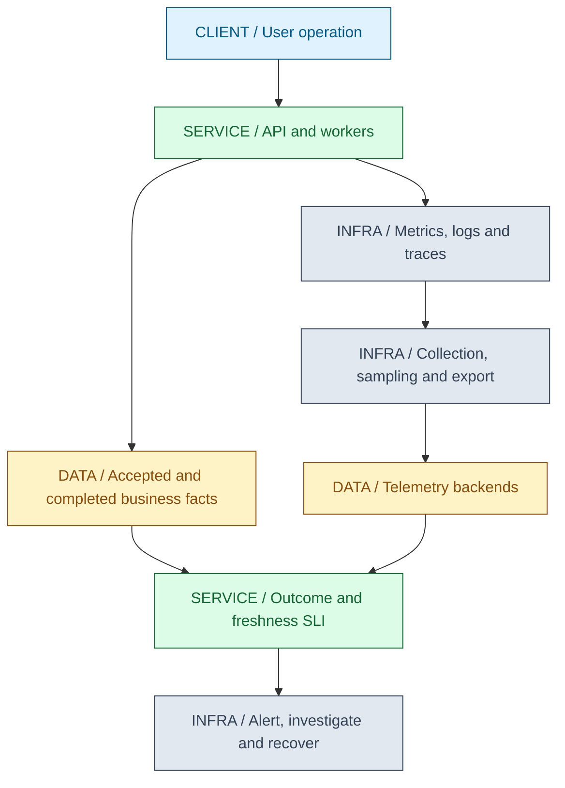
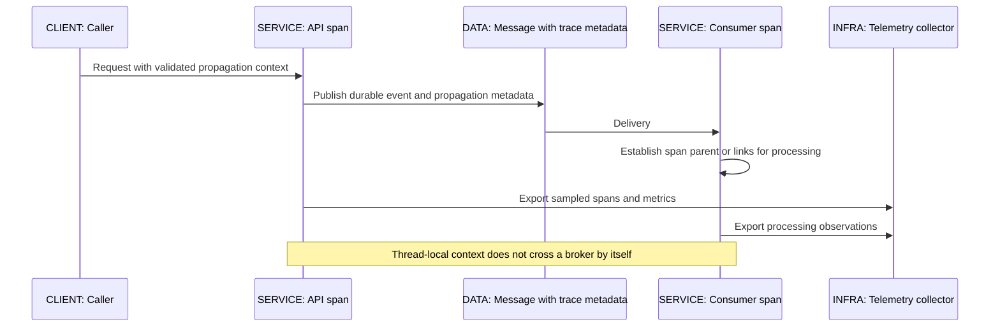
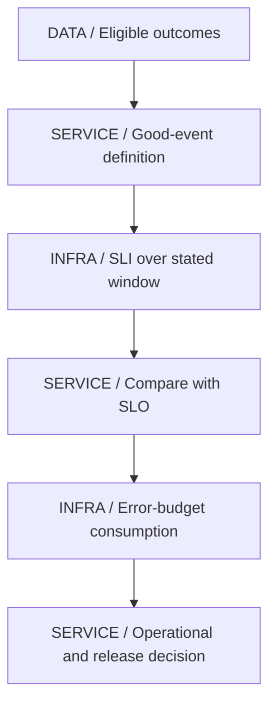
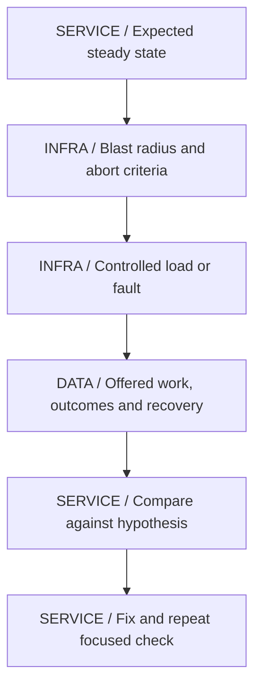
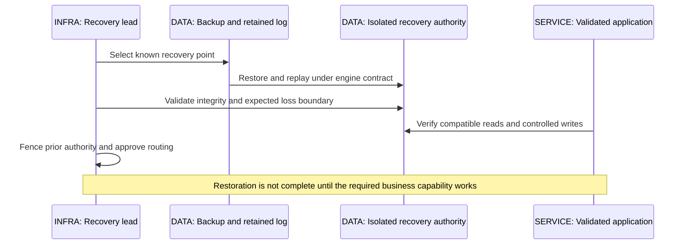

# 18 / Observability, Reliability and Operations

**An operational signal is useful when it changes a decision.** IntegrationHub is fictional. Its API can be healthy while accepted jobs never finish, and its consumer offset can advance while work waits in an unbounded application queue. Observe the user's outcome, then use infrastructure evidence to explain it.

**Version assumptions:** Java 21, Spring Boot 4.0.x / Cloud 2025.1.x, PostgreSQL 17, Kafka 4.x and Kubernetes 1.34 remain the guide baseline. Prometheus, Grafana, Loki and OpenTelemetry versions/export protocols need explicit selection. The existing Boot/Cloud family check is retained; no telemetry deployment is installed here.

**Execution evidence:** SloLab.mjs passed five synthetic arithmetic checks on the existing Node-compatible runtime. No production metrics, logs, traces, load test, chaos experiment, restore or JVM profile was collected. Calculations below are illustrative inputs, not measured IntegrationHub behavior.

## Big Picture

## What You Will Be Able to Explain

- Design logs, metrics and traces around questions rather than collecting everything.
- Trace OpenTelemetry context and collector behavior across HTTP and asynchronous work.
- Explain Prometheus counters/histograms, label cardinality, Grafana views and Loki label design.
- Define request and asynchronous-work SLIs, SLOs, error budgets and actionable alerts.
- Run an evidence-driven incident response and write a usable runbook/postmortem.
- Diagnose high CPU, memory growth, blocked work, slow queries and consumer lag at their owning layer.
- Plan capacity, load/chaos experiments and disaster recovery without inventing measurements.

> [!PRODUCTION]
> **Where this lives in IntegrationHub.** [05's accepted job](05-apis-realtime.md#ch05-apis-realtime) and [07's committed worker result](07-messaging.md#ch07-messaging) define separate outcomes. [15](15-kubernetes.md#ch15-kubernetes) supplies process/platform evidence; [16](16-delivery.md#ch16-delivery) supplies release identity; [17](17-cloud.md#ch17-cloud) supplies managed-service signals. [23](23-jvm-performance.md#ch23-jvm-performance) owns deep CPU, allocation and heap analysis. Correlation crosses these boundaries without placing credentials or personal payloads in telemetry.

## 1. Logs, Metrics and Traces

Metrics aggregate numeric observations over time and dimensions; they are good for rates, distributions and alerting. Logs record discrete events and contextual details; they help explain individual failures. Traces connect timed operations across execution boundaries; they help locate where an observed request spent time. None alone proves every causal relationship, and collecting all three does not automatically make a system observable.

Start from an operational question. Is the service rejecting requests? Are accepted jobs waiting too long? Is one dependency slow? Which release introduced a change? Choose a signal that can answer it with bounded storage, cardinality and privacy cost. A structured failure code plus job correlation can be more useful than ten stack traces containing raw input.

Use consistent service/environment/version identifiers. Trace IDs can correlate restricted logs, but should not become a Prometheus label on every measurement. Request IDs and tenant IDs are often high-cardinality or sensitive. Logging a token or putting customer data in trace baggage creates additional copies beyond the application's normal data controls.

| Signal | Use when | Avoid when |
|---|---|---|
| Metric | Aggregate rates/distributions support diagnosis and alerting | Every request ID creates a separate series |
| Structured log | A specific event needs safe context | Full payloads or credentials are dumped for convenience |
| Trace | Cross-service timing and parent/link relationships matter | Sampled traces are treated as a complete event ledger |
| Durable audit record | Accountable business/security decisions must be reconstructable | Best-effort diagnostic retention is assumed sufficient |

**Interview checks:** basic: the signals answer different questions. Internals: sampling and aggregation discard information. Debug: identify the missing question before adding logs. Scenario: instrument accepted and completed work separately.

## 2. OpenTelemetry and Context Propagation

OpenTelemetry provides instrumentation, APIs/SDKs and a collection/export ecosystem. It is not itself the durable storage or visualization backend. An SDK creates observations under configured resource attributes, processors, sampling and exporters. A Collector can receive, batch, transform and export telemetry while enforcing resource/privacy policy. Its queue, retry and memory behavior are another operational system to monitor.

HTTP propagation carries context through agreed headers. Async callbacks, executors, virtual threads and message consumers need correct context capture/restoration. A pooled worker must not retain the previous task's context. For batches or fan-in, span links may describe multiple causal inputs more accurately than arbitrarily selecting one parent. Trace context is correlation metadata, not authorization evidence.

Head sampling decides early whether to retain a trace; tail sampling can select after more of the trace is available, such as errors or high latency, at the cost of buffering, routing and completeness assumptions. A trace absent from storage is not proof that the request did not occur. Baggage travels widely and should contain only allowed bounded information, not tenant secrets or arbitrary client input.

Exporter failure must not silently become a business outage. Bound queues and memory, choose drop/retry policy, and monitor exporter/collector loss. Critical audit facts belong in an appropriate durable path rather than relying on best-effort span export. Instrumentation overhead also needs measurement; an allocation-heavy tracing configuration can alter the workload it observes.

**[VERIFY: check OpenTelemetry SDK/agent, semantic conventions, propagation, sampling, Collector queue/retry behavior and Spring instrumentation compatibility for selected versions. No agent, collector or cross-process trace was executed.]**

**Interview checks:** basic: OTel is not a storage backend. Internals: async propagation needs explicit supported context handling. Debug: distinguish missing instrumentation from sampled-out traces. Scenario: isolate telemetry export failure from normal business execution.

## 3. Prometheus Metrics and Cardinality

Counters accumulate events and can reset when a process restarts. Gauges represent current quantities such as queue depth. Histograms record distributions in a representation that supports selected aggregate calculations. Choose units and dimensions consistently; seconds and milliseconds in similarly named metrics are an expensive source of false conclusions.

Compute counter rates per original series before aggregation so resets remain detectable under the query function's semantics. Summing process counters and then taking a derivative can obscure restarts. Scrape gaps, stale series and missing targets need a policy; no observed errors is not the same as a healthy observable service.

Classic histograms expose cumulative bucket series plus count and sum. A quantile query estimates within bucket boundaries; it is not the exact raw sample percentile. Aggregate compatible bucket distributions before estimating a fleet percentile. Averaging per-instance p99 values does not produce the fleet p99. Native histogram support and query behavior differ by selected versions and configuration.

Assume ten routes, six outcome categories and five instances, all combinations present, with twelve classic bucket series including the infinity bucket. Buckets plus count and sum give 10 times 6 times 5 times 14 = 4,200 series for that metric family. This is an illustrative upper-combination count, not observed cardinality. Adding an unbounded user/job label can dominate it.

| Metric design | Use when | Avoid when |
|---|---|---|
| Bounded route/outcome labels | Aggregate service behavior needs segmentation | Raw URLs with IDs create unbounded route labels |
| Histogram | Latency distributions need fleet aggregation | Bucket boundaries cannot resolve the relevant SLO threshold |
| Gauge | Current backlog or occupancy matters | A gauge is used as a monotonic event counter without reset semantics |
| Exemplars/correlation | Selected traces explain aggregate observations | Trace identity becomes a dimension of every series |

**[VERIFY: verify Prometheus rate/reset/staleness semantics, classic/native histogram support, query aggregation and scrape/export configuration against the selected stack. SloLab checks arithmetic only; no PromQL or Prometheus rule evaluation ran.]**

**Interview checks:** basic: counters reset and gauges can fall. Internals: quantiles are not generally composable averages. Debug: inspect label combinations and missing scrape targets. Scenario: choose histogram resolution from the decision threshold.

## 4. Grafana, Loki and Useful Dashboards

Grafana organizes queries and visualizations over configured data sources; it is not automatically the source of metric truth. A dashboard should lead from user outcome to likely constrained resource: request success/latency, accepted-work age, completion rate, dependency failures, queue/pool occupancy and relevant platform state. Annotate releases and policy changes so timelines have operational meaning.

Loki indexes log labels under its storage design rather than making every log field an index dimension. Use low-cardinality labels such as service/environment where appropriate and parse or query selected structured content deliberately. Per-job labels can create excessive streams and operational cost. Redaction must happen before sensitive data reaches the shared backend where possible, not only in a dashboard view.

Use a common time range and understand clock skew, ingestion delay and query resolution. Two charts sampled at different windows can appear correlated or contradictory for purely technical reasons. A dashboard that shows averages alone may hide a small but important tail or tenant cohort; segmentation must remain bounded and authorized.

**[VERIFY: confirm Grafana data-source/query behavior and Loki label, ingestion, retention and access policies for the deployed versions. No dashboard, log backend or telemetry retention policy was exercised.]**

**Interview checks:** basic: visualization and storage are different roles. Internals: labels determine indexing cost. Debug: compare time windows and ingestion delays. Scenario: build a dashboard around decisions rather than every available metric.

## 5. SLI, SLO, SLA and Error Budgets

An SLI is a defined measurement of service behavior; an SLO is a target for it over a window; an SLA is an external agreement with its own definitions and consequences. They should be related but are not interchangeable. Specify eligible events, success criteria, window and data source before quoting a percentage.

For API availability, decide which requests count and where observation occurs. Server-side metrics can miss traffic rejected before the application. A client error caused by a documented invalid request differs from a valid request rejected because infrastructure failed; status class alone may not capture that distinction. Exclusions must be reviewed, not tuned to make the graph green.

For asynchronous jobs, measure accepted work that completes correctly within a defined duration, plus backlog age and unresolved outcomes. A fast 202 response does not satisfy the completion SLO. Define how cancelled, quarantined or partially completed jobs count. Reconcile the measurement against durable job records rather than treating a sampled trace as the ledger.

Assume a request SLO of 99.9% over a window containing one million eligible requests. The allowance is 1,000 bad events. If 2,000 are bad, the observed error fraction consumes allowance at two times the target rate for that window, and the window budget is exceeded by 1,000 events. These are synthetic arithmetic inputs. A request-based budget is not automatically convertible into a fixed number of downtime minutes unless its assumptions support that conversion.

No traffic or missing data should not silently evaluate as perfect health. The lab returns unknown availability for a zero denominator. Alerting needs a separate telemetry/traffic health policy so that absence can be distinguished from a legitimately idle service.

> [!MECHANISM]
> **Burn rate compares observed bad-event fraction with the allowed fraction.** It describes how quickly budget is consumed under the chosen definition. It does not explain the root cause or prove that future traffic will behave the same way.

**Interview checks:** basic: measurement, target and agreement differ. Internals: denominator/exclusions decide meaning. Debug: inspect missing traffic and asynchronous completion. Scenario: define both acceptance and completion objectives for IntegrationHub.

## 6. Alerting and Incident Response

Page when timely human action can reduce material user impact. Route lower-urgency capacity or hygiene issues to a ticket/work queue. A CPU threshold without an action or user-risk link can generate noise, while a rapidly consuming error budget or stuck accepted-work queue can justify urgent intervention.

Multi-window burn alerts can require both a longer window showing sustained consumption and a shorter window showing the problem is still active. Choose windows/thresholds from the service's objective and operational response; copying a numeric threshold without its assumptions is not SLO engineering. Suppress duplicate symptoms under a known incident carefully, without hiding independent failures.

An alert should include service/operation, impact, observed condition, time window, environment/revision, a focused dashboard and a runbook owner. Do not include raw credentials or customer payloads. Test routing, silences, escalation and recovery notification under controlled conditions; an untested contact chain is part of the failure surface.

During an incident, establish an incident lead, communication channel, scribe/timeline and bounded hypotheses. Stabilize before deep optimization: stop a bad rollout, reduce harmful retries, shed noncritical load or isolate a failing tenant/provider when those actions are safe. Record commands, owners, timestamps and observed effects. Keep speculation separate from confirmed facts.

| Response | Use when | Avoid when |
|---|---|---|
| Page | Immediate action can protect a meaningful objective | A low-value metric is noisy but nonactionable |
| Ticket | A trend needs planned remediation | A fast outage is deferred into an ordinary backlog |
| Mitigation | A reversible bounded action reduces impact | Several unrelated changes erase diagnostic evidence |
| Escalation | Authority or expertise is missing | One responder silently owns everything indefinitely |

**Interview checks:** basic: pages require actionability. Internals: window choice affects detection/recovery delay. Debug: distinguish root signal from symptom fan-out. Scenario: assign roles and preserve evidence while restoring service.

## 7. Production Playbooks: Find the Owning Layer

Begin with scope and recent changes: affected operation, tenant/provider cohort, release, start time and whether demand changed. Compare healthy and unhealthy instances only when workloads/configuration are comparable. A single screenshot is rarely enough to establish a trend.

| Symptom | First discriminating evidence | Next bounded action |
|---|---|---|
| High CPU | Process/container CPU, throttling, request volume and CPU profile | Separate demand, hot code, GC and quota pressure before tuning |
| Memory growth | Heap after collection, allocation rate, native/RSS and retained paths | Bound collection or capture approved evidence under disk/privacy limits |
| Blocked/slow requests | Pool wait, thread states, dependency latency and deadlines | Find the occupied resource and its owner before enlarging pools |
| Slow queries | Actual plan/rows, lock waits, transaction age and query volume | Test index/plan/transaction hypothesis on representative data |
| Consumer lag | Per-partition lag, oldest event age, processing time, retries and rebalance/restore state | Distinguish hot partition, slow sink and lost capacity |
| OOMKilled or restart loop | Platform termination reason, previous logs, probe and memory evidence | Correct the specific runtime or health policy, not only replica count |

Thread dumps show sampled thread states and stacks, not an exact CPU accounting history. Several spaced observations can distinguish stable waiting from transient work. Heap dumps show retained object graphs and can contain credentials or personal data; capturing one can require substantial pause/disk and should be authorized. [23](23-jvm-performance.md#ch23-jvm-performance) owns deeper interpretation and tool commands.

Consumer lag can fall because offsets advanced into a local queue rather than because business work completed. Track the oldest accepted but incomplete job and committed progress as well. If completion rate equals arrival rate, an existing backlog cannot drain; more consumers help only if partition and downstream capacity permit it. A paused stateful stream restoring local state can be alive but not yet productive.

> [!TRAP]
> **Do not destroy evidence as the first diagnostic step.** Restarting every Pod or flushing every cache can hide the cause and trigger a recovery storm. Capture the relevant state, make one justified mitigation and watch its expected effect.

**Interview checks:** basic: high CPU is a symptom, not a cause. Internals: lag and completed work differ. Debug: choose a measurement that separates local hypotheses. Scenario: make dump collection a controlled operational action.

## 8. Capacity, Load Tests and Chaos

Capacity planning uses arrival distribution, service demand, concurrency, headroom and recovery work. Include tenant skew, burst timing, expensive requests, cache cold starts and dependency quotas. Little's law can relate stable mean quantities under a consistent boundary; it does not predict tail latency or choose a safe thread pool without more evidence. [10](10-system-design.md#ch10-system-design) supplies the arithmetic foundation.

Load tests should state the workload model, data distribution, environment, warmup, duration, offered/achieved throughput, error classification and latency percentiles. Closed-loop clients issue new work after prior completion and can reduce offered load when the server slows; open-loop arrival models expose different queueing behavior. Coordinated omission can underrepresent latency during stalls when the generator stops issuing expected work. Record generator saturation and dropped/timed-out work too.

Chaos testing tests a specific resilience hypothesis under bounded fault injection. Define authorization, target, stop conditions, safe rollback, monitoring and excluded systems before injecting anything. Start with a controlled environment and small blast radius. A random production outage is not automatically a useful chaos experiment. Failure injection can have cost/data consequences even when it targets infrastructure rather than business code.

Examples for future tests: pause one consumer after effect commit but before ack; interrupt one provider path; make one replica unready; restore a cold cache under admitted traffic. Assert durable outcomes, bounded recovery and isolation, not simply that all Pods returned to Running. None of these faults is injected here.

**[VERIFY: select load-generator arrival semantics, latency recording, telemetry sampling and fault-injection controls for the actual environment. No load, chaos, saturation or production fault experiment was run; all suggested experiments require explicit scoped authorization.]**

**Interview checks:** basic: a benchmark needs a workload and environment. Internals: offered and completed rates differ. Debug: inspect the generator before trusting a flat latency curve. Scenario: every chaos experiment needs an abort path and a falsifiable hypothesis.

## 9. Disaster Recovery and Restore Evidence

RPO defines acceptable loss of data under a stated failure; RTO defines acceptable restoration time for a stated capability. Define whether recovery includes only database availability or also keys, roles, networking, configuration, clients, replay and reconciliation. A backup timestamp is not a measured RPO, and a replica existing in another region is not a tested RTO.

Replication handles selected infrastructure failures but can reproduce mistaken deletes or bad writes. Base backups plus retained logs can support point-in-time recovery under the engine's contract. Keep copies and required keys accessible to the recovery environment without placing all authority in one failure domain. Verify retention, integrity and restoration regularly.

Promotion/failover must prevent stale writers, not merely change DNS. Reconcile queued events, idempotency records and external uncertain effects after recovery. A rollback to an earlier database point can make previously completed external operations appear pending again; blindly replaying them can duplicate effects. Restore procedures must account for this mismatch explicitly.

**[VERIFY: verify backup/PITR integrity, key availability, regional promotion/fencing, replay/reconciliation and measured RPO/RTO with the selected engines/providers. No backup, restore or failover rehearsal ran.]**

**Interview checks:** basic: replica is not backup. Internals: recovery includes keys and effect identities. Debug: compare restored state with external committed effects. Scenario: rehearse a business operation, not just a database start.

## 10. Runbooks, RCA and Postmortems

A runbook should make the next safe action clear under pressure. Include purpose, affected service/owner, required access, trigger symptoms, first evidence to collect, decision branches, bounded mitigation, abort/rollback conditions and how to verify recovery. Commands need approved context/namespace/account and explicit side-effect warnings. Do not include secrets in the document or assume every responder has administrative access.

Use the following compact runbook structure as content in the service's operational system, not as fabricated incident evidence: identify revision and impact; check user SLI plus dependency/resource signals; separate likely causes with one discriminating check; apply a scoped mitigation; verify outcome and backlog drain; escalate if the expected change does not occur. Record the actual action and result.

RCA should distinguish trigger, contributing conditions and missing controls. Human action can be part of the timeline without becoming the entire explanation. Ask why the action was possible, why feedback did not prevent it, why impact spread and why recovery took as long as it did. A single deepest root is often less useful than a causal chain with fixable boundaries.

**Postmortem format:** summary and impact; timeline with evidence links; triggering change; contributing technical and organizational conditions; detection/response assessment; what worked; corrective actions with owner, priority and verification; unresolved questions. Separate confirmed facts from hypotheses. Follow-ups should change a test, guardrail, design or runbook and be checked later, not disappear as a vague promise to be more careful.

| Operational artifact | Use when | Avoid when |
|---|---|---|
| Runbook | A repeated failure needs safe consistent response | It is a long unexplained command dump |
| Postmortem | Learning should produce verifiable system improvements | Blame or hindsight replaces evidence |
| Capacity review | Demand/recovery needs changed | Last year's averages are treated as permanent guarantees |

> [!DECISION]
> **Prefer one tested recovery procedure over many unverified settings.** The design should state who can act, which boundary is changed, what can go wrong and what observation proves success.

## 11. Executed Arithmetic Lab

`code/18-operations/SloLab.mjs` and its Windows PowerShell runner use only the existing Node-compatible runtime. From workspace root, run `& './docs/java-fs-guide/code/18-operations/run.ps1'`. execution.json records five PASS checks: error-budget arithmetic, no-traffic unknown state, two-window condition, classic histogram cardinality and invalid-input rejection.

The model uses floating-point calculations with explicit comparison tolerances in tests; it is not an accounting system. Its shouldPage function demonstrates the conjunction of two burn windows, not a complete production alert: minimum traffic, no-data monitoring, scheduling, notification routing and SLO policy remain outside it. No PromQL expression or live alert was evaluated.

> [!INTERVIEW]
> **Start an incident answer with impact, evidence and the next discriminating check.** Then explain mitigation and verification. Listing tools before stating the failing user contract usually hides the important reasoning.

## Explained-Here Index and Sources

| Concepts | Explanation |
|---|---|
| Logs, metrics, traces | [Signal choice](#ch18-signals) |
| OpenTelemetry | [Propagation and export](#ch18-otel) |
| Prometheus | [Counters, distributions and labels](#ch18-prometheus) |
| Grafana and Loki | [Views and log storage](#ch18-views) |
| SLI, SLO and SLA | [Outcome contract](#ch18-slo) |
| Alerting and incident response | [Actionable signals](#ch18-alerting) |
| Consumer lag and production playbooks | [Diagnosis](#ch18-playbooks) |
| Capacity, load and chaos testing | [Experiments](#ch18-capacity) |
| Disaster recovery, RPO, RTO | [Recovery evidence](#ch18-recovery) |
| RCA, runbook and postmortem | [Operational learning](#ch18-runbooks) |

Verification destinations: [OpenTelemetry](https://opentelemetry.io/docs/), [Prometheus practices](https://prometheus.io/docs/practices/), [Grafana documentation](https://grafana.com/docs/), [Loki](https://grafana.com/docs/loki/latest/) and [Google SRE workbook](https://sre.google/workbook/table-of-contents/). References are pointers, not claims of new runtime evidence.

## Related Chapters

Connect [00](00-master-map.md#ch00-master-map), [05 APIs](05-apis-realtime.md#ch05-apis-realtime), [06 databases](06-databases.md#ch06-databases), [07 messaging](07-messaging.md#ch07-messaging), [08 security](08-security.md#ch08-security), [10 capacity](10-system-design.md#ch10-system-design), [15 Kubernetes](15-kubernetes.md#ch15-kubernetes), [16 releases](16-delivery.md#ch16-delivery), [17 cloud](17-cloud.md#ch17-cloud), [19 tests](19-testing.md#ch19-testing), [21 network](21-network-os.md#ch21-network-os), [22 distributed recovery](22-distributed.md#ch22-distributed) and [23 JVM profiling](23-jvm-performance.md#ch23-jvm-performance). Generated links are reciprocal.

## One-Page Cheat Sheet

**Signals:** metrics aggregate, logs explain events, traces connect sampled execution. OTel instruments/exports; backends store and query. Context is not authorization and baggage is not a secret channel.

**Metrics:** counters reset; histogram quantiles are estimates; do not average p99s. Bound labels and distinguish missing observations from success. Loki labels and Prometheus labels both need cardinality discipline.

**Reliability:** define eligible good outcomes, window and authority. Acceptance and completion need separate SLIs. SLO is a target, SLA an agreement. Burn rate consumes a stated error allowance; no traffic is not automatically healthy.

**Response:** page actionable impact, preserve evidence, mitigate one bounded cause and verify recovery. Diagnose CPU, heap/native memory, locks, queries and consumer lag at the owning layer. Deep JVM work belongs to 23.

**Recovery:** load models need offered rates and generator evidence; chaos needs authorization and abort conditions. Restore data, keys, identity and business capability, and fence old writers. Five arithmetic checks passed; production telemetry and recovery tests did not run.

## Interview Corner

### Basic: SLI, SLO and SLA?

A measurement, a target for that measurement, and an external agreement. Define eligible outcomes and window before interpreting any percentage.

### Internals: Why Not Average Instance p99 Values?

Quantiles are not generally composable that way. Aggregate compatible observations/distributions and estimate the desired fleet quantile, with resolution and sampling limits understood.

### Trace/Debug: API Is Green but Jobs Never Finish.

Acceptance health is not completion health. Inspect oldest accepted work, committed progress, consumer processing, provider outcomes and local queue occupancy rather than only HTTP status.

### Scenario: What Should Page an Engineer?

A condition where timely action can protect a meaningful objective, with context, ownership and a runbook. Use lower-urgency workflows for trends that do not require immediate intervention.

### Basic: Is OpenTelemetry the Monitoring Database?

No. It supplies instrumentation and collection/export components. Storage/query/visualization are backend responsibilities, and collector failure needs its own bounds.

### Internals: What Does Tail Sampling Cost?

It needs later trace information and therefore buffering, coordination/routing and incomplete-trace policies. It can select important traces but does not make the stored set complete.

### Trace/Debug: Consumer Lag Falls but Completion Is Flat.

Offsets may have advanced before work left a local queue, or downstream effects are stalled. Compare broker position with durable business completion and oldest pending age.

### Scenario: How Do You Investigate Memory Growth?

Separate allocation churn from retained heap and native/process memory. Capture approved evidence with disk/privacy/overhead bounds, then inspect retained paths rather than assuming every growing chart is a leak.

### Basic: RPO Versus RTO?

Acceptable data loss versus acceptable restoration time under a defined failure and capability. Both require observed restore/recovery evidence.

### Internals: Why Can Restore Repeat an External Effect?

The database may return to a point before a provider action that already committed. Reconciliation and stable external identity are needed before replaying restored pending work.

### Trace/Debug: A Load Test Shows Excellent Latency During Stalls.

Check whether the generator stopped issuing expected work, dropped samples or saturated. Closed-loop behavior and coordinated omission can hide waiting that real arrivals would experience.

### Scenario: What Makes a Postmortem Useful?

Evidence-backed impact and timeline, contributing conditions, and corrective actions with owners and verification. Blame or an untracked promise does not reduce recurrence.