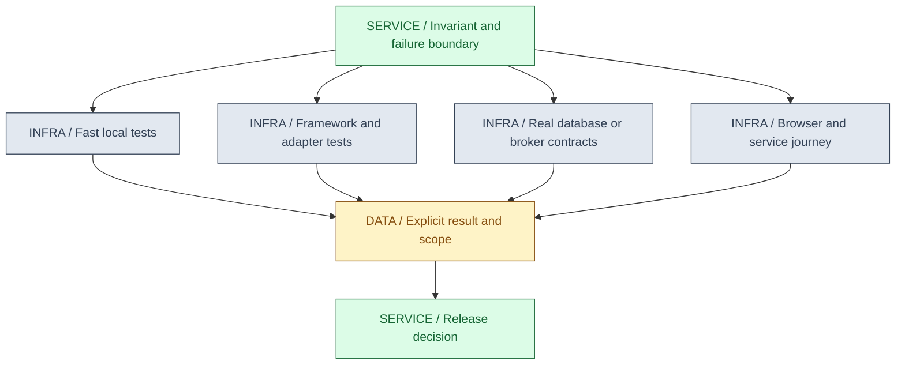
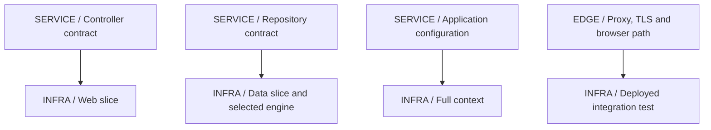
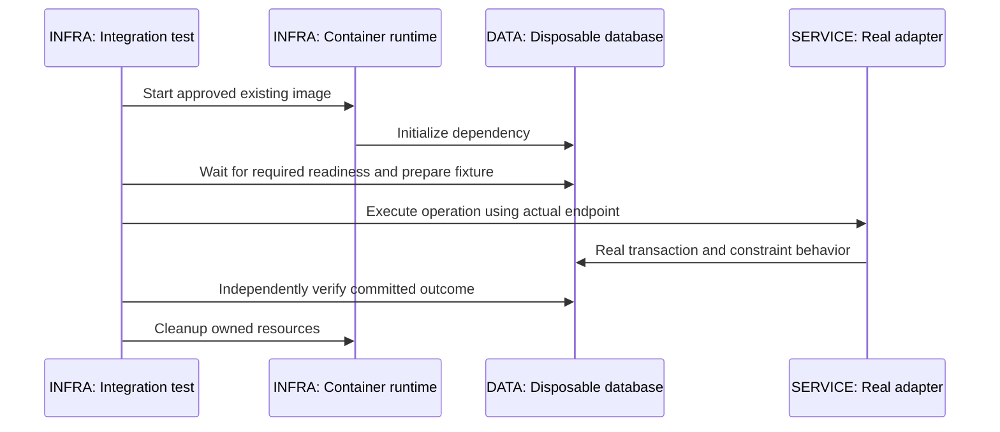
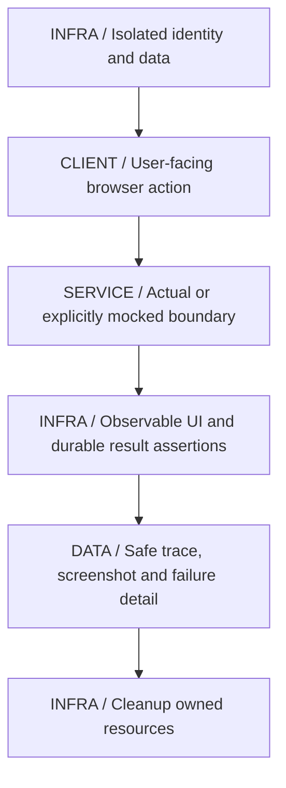

# 19 / Testing and Quality

**A test is evidence for the boundary it actually exercises.** A mocked repository cannot establish PostgreSQL isolation, and a source-listing comparison cannot establish Java compilation. IntegrationHub is fictional. This chapter uses that distinction to build a layered test strategy without inflating the meaning of a green result.

**Version assumptions:** Java 21, Spring Boot 4.0.x / Cloud 2025.1.x, PostgreSQL 17, Kafka 4.x and Kubernetes 1.34 remain the surrounding baseline. The standalone lab deliberately pins JUnit Jupiter 5.11.4, Mockito 5.14.2, compiler plugin 3.13.0 and Surefire 3.5.2; it does not import the Boot BOM or claim these are its managed/current versions. Framework imports and Testcontainers/Playwright versions require their own compatibility check.

**Execution status:** NOT EXECUTED. The runner parsed the POM and found both source files, but no existing JDK/Maven is available. No dependency resolution, Java test, Spring context, container or business-browser integration ran. The guide's publication checks and prior pure JavaScript models are separate evidence.

## Big Picture

## What You Will Be Able to Explain

- Choose tests by risk and ownership rather than a rigid numerical pyramid.
- Use JUnit lifecycle/parameterization and Mockito deliberately, without testing only mock setup.
- Distinguish Spring test slices, full application contexts and deployed network behavior.
- Design Testcontainers tests around the real engine, transaction and crash boundaries.
- Separate schema compatibility, consumer contracts and end-to-end behavior.
- Use Playwright assertions, fixtures and traces without arbitrary sleeps or shared-state leakage.
- Make performance, flakiness and quality gates explicit rather than hiding failed or skipped checks.

> [!PRODUCTION]
> **Where this lives in IntegrationHub.** Test [05's idempotent acceptance](05-apis-realtime.md#ch05-apis-realtime), [06's constraints](06-databases.md#ch06-databases), [07's effect/ack gap](07-messaging.md#ch07-messaging), [08's tenant authorization](08-security.md#ch08-security) and [09's request generations](09-frontend.md#ch09-frontend) at their actual boundaries. [16](16-delivery.md#ch16-delivery) consumes the results, and [18](18-operations.md#ch18-operations) determines which load/failure signals matter after deployment.

## 1. Test Pyramid, Scope and Risk

The pyramid encourages many fast focused tests and fewer expensive broad tests because speed, isolation and diagnosis affect feedback. It is not a requirement that every system have the same percentage of unit versus integration tests. A thin SQL-heavy service may gain more value from engine-backed tests than from mocking every query. A complex pure algorithm deserves extensive fast cases.

For each invariant, identify the smallest environment that could falsify it. Decimal conversion can be tested locally; tenant scoping may need both policy tests and real query paths; transaction atomicity needs the actual transaction arrangement; a buffering proxy requires the proxy in the path. An end-to-end test can show a journey failed but may be poor at explaining which layer caused it.

Distinguish tests from checks. A static schema check, source presence, compilation, unit assertions, deployed health and measured SLO each establish different facts. Mark unavailable tests as NOT EXECUTED rather than silently skipping them under a PASS umbrella. A command exiting successfully with no discovered tests should fail the intended test gate.

| Layer | Use when | Avoid when |
|---|---|---|
| Pure unit | Local rules can be verified without infrastructure | A mock stands in for the very behavior under question |
| Component/slice | Framework wiring or one adapter is the risk | Slice success is called proof of the whole deployment |
| Real dependency integration | SQL, broker or network semantics matter | A substitute engine is assumed identical |
| End-to-end | A critical user journey crosses several boundaries | Every edge case becomes a slow broad browser test |

**Interview checks:** basic: test shape follows risk. Internals: the exercised boundary defines evidence. Debug: inspect discovered tests and skipped reasons. Scenario: choose a test that would fail for the actual former bug.

## 2. JUnit 5 and Deterministic Fixtures

JUnit Platform discovers/runs test engines; Jupiter supplies the JUnit 5 programming and extension model. Test annotations alone are insufficient if the engine or build plugin is missing/misconfigured. Keep test discovery, lifecycle and assertion policy explicit in the build.

Use focused arrange/act/assert structure and meaningful assertion messages where they improve diagnosis. Parameterized tests apply one behavioral contract to multiple inputs, such as invalid lifecycle states or boundary values. Avoid a loop that catches every exception and lets the test pass. Assert the expected failure category and important state/effects after it.

Fixtures should isolate mutable state. A static shared collection or reused database row can make tests depend on order. Setup/cleanup must remain correct when a test fails partway through. Time-dependent logic should accept a clock or controllable scheduler; asynchronous tests should use gates, completion signals and bounded deadlines rather than sleeps that happen to work locally.

Timeouts are guards, not performance assertions unless the test is explicitly a controlled performance experiment. Preemptively interrupting a test can change thread-local transaction/context behavior. A bounded future wait that fails gives evidence of no completion within that guard, not a calibrated throughput result.

**[VERIFY: resolve and execute the pinned standalone JUnit/Mockito/plugin versions on Java 21, and separately verify the actual Boot-managed test stack, discovery and lifecycle behavior. The POM was parsed only; no JUnit engine or compiler ran.]**

**Interview checks:** basic: engine discovery matters. Internals: fixtures and lifecycle define isolation. Debug: look for shared static state and cleanup after failure. Scenario: inject time and use completion signals for reproducible async cases.

## 3. Mockito, Fakes and Behavioral Assertions

A mock supplies configured behavior and records interactions; a stub is often described by the behavior it supplies; a fake has a working simplified implementation. These labels help communicate intent, but none establishes the real dependency's semantics. An in-memory repository can be useful and still fail to model unique constraints, collation or transaction isolation.

Mock only collaborators outside the local rule under test. If a service's entire implementation is configured away, the test may only verify Mockito. Prefer assertions on returned state and required effects. Interaction checks are valuable when the interaction is itself the contract, such as denying a tenant before accessing a repository or ensuring an invalid transition never writes.

Avoid asserting every internal call in order when the public behavior permits alternatives. Such tests break during harmless refactoring and pressure code toward an incidental implementation. Conversely, verifying no unauthorized repository interaction is a meaningful security-boundary assertion. Argument capture helps inspect a command actually sent to a dependency, but captured values need semantic assertions.

The saved lab's Repository interface exposes find(tenant,id) and conditional replace(expected,next). Mockito can arrange replace=false to test the service's conflict response. It cannot prove the production adapter performs an atomic versioned SQL update; that needs an engine-backed adapter test.

| Test double | Use when | Avoid when |
|---|---|---|
| Mock | Local orchestration needs controlled dependency outcomes | Mock success is treated as SQL/broker correctness |
| Fake | A small deterministic working model improves tests | Missing real constraints create false confidence |
| Real adapter | Behavior depends on actual serialization/storage | Every local validation case pays unnecessary infrastructure cost |

**Interview checks:** basic: test doubles replace evidence at a boundary. Internals: verify interactions that are contractual. Debug: a green mocked repository can hide a broken query. Scenario: pair service conflict tests with real optimistic-write tests.

## 4. Spring Test Slices and Full Contexts

A web slice can exercise controller mapping, validation, serialization, exception handling and selected web/security configuration without loading every service. A data slice can exercise entity/repository integration with its configured database and transaction defaults. A full application-context test checks more wiring, but still may not include the deployed gateway, identity provider, broker or real network path.

Do not disable security filters to make a controller test pass and then claim authorization coverage. Import the required configuration deliberately and test unauthenticated, forbidden and authorized cases. MockMvc exercises a servlet application path without necessarily opening a real TCP socket; other web test arrangements exercise different boundaries. Name which one ran.

Transactional test rollback can hide commit-time failures, detach/serialization behavior and outbox publication timing. Tests of commit durability need explicit committed transactions and independent reads where appropriate. A JPA test using an embedded database can be useful for mapping but is not evidence of PostgreSQL locking, JSON operators or query plans.

Context caching speeds tests but can conceal shared singleton state or leaked resources. Rebuilding every context is not the first solution; keep configuration stable and fixtures isolated. External property binding and startup profiles should be explicit, especially when tests might accidentally select a production endpoint.

**[VERIFY: check Spring Boot test-slice packages/imports, security inclusion, database replacement, transaction defaults and context caching for the selected Boot generation. No Spring slice or full-context test ran; older tutorial imports may not match Boot 4.]**

**Interview checks:** basic: a slice is intentionally incomplete. Internals: transaction rollback changes what is observed. Debug: inspect effective test database and security configuration. Scenario: run a real network test for proxy/TLS behavior.

## 5. Testcontainers and Real Infrastructure Contracts

Testcontainers can provision disposable dependencies under an available container runtime and expose their actual connection details to tests. It reduces environment drift but does not automatically make a test isolated, fast or offline. Images may need downloading; the guide's no-download restriction is still in force. No container is launched in this chapter.

Use the production engine family/version where semantics matter, initialize a minimal schema/fixture and wait for the intended service readiness rather than only a process start. Obtain dynamic ports from the container API, not a hard-coded assumption. Test ownership of lifecycle/cleanup, especially under failures and parallel execution. Container reuse changes isolation and needs an explicit policy.

For idempotent acceptance, send concurrent requests with one logical key against a real unique constraint, then verify one durable job/result/outbox set. For consumer processing, fail before and after the local commit and verify effect/receipt consistency under redelivery. For locking, use independent connections with arranged interleavings; a single test transaction cannot demonstrate concurrent isolation.

Container health does not prove representative performance. Small disposable data can hide an index/plan issue, and host resource noise changes timing. Separate correctness tests from deliberate load experiments with documented volume, warmup and measurement. Use timeouts to avoid hanging tests, not to claim a stable production latency limit from an uncalibrated laptop run.

**[VERIFY: validate Testcontainers version, runtime/image availability, readiness strategy, lifecycle cleanup and production-engine compatibility before execution. No images were pulled, containers started or database/broker tests run.]**

**Interview checks:** basic: disposable real engines improve semantic evidence. Internals: readiness and dynamic endpoints matter. Debug: isolate data and connections per case. Scenario: control commit/ack interleavings rather than sleeping and hoping to hit the race.

## 6. Contract Testing and Evolution

A schema/OpenAPI document describes allowed shapes and protocol details. A consumer-driven contract captures assumptions a particular consumer needs and can be verified against the provider. Neither automatically proves every business invariant, performance property or cross-tenant permission. Contract scope should include meaningful error/status/nullability behavior, not only one happy response.

Test compatibility across deployment skew: old client with new provider, new client with still-old provider where that rollout is possible, and historical events with new consumers. Additive fields are compatible only under the agreed reader behavior. Unknown enum values, changed defaults and stricter validation can be breaking even if JSON still parses.

A provider can satisfy a stubbed contract while its production adapter fails; keep the provider verification boundary clear. Publish contracts and verification evidence with immutable versions and a deployment decision that understands which consumers exist. Do not let a stale contract repository become a substitute for actual traffic and deprecation telemetry.

| Contract check | Use when | Avoid when |
|---|---|---|
| Schema validation | Representation shape should be enforced | Parsing success is called business correctness |
| Consumer contract | Independently deployed clients need explicit expectations | A generated mock is never verified against the provider |
| Historical event compatibility | Retained messages outlive code versions | Every fixture is generated only by today's serializer |

**Interview checks:** basic: schema and consumer expectation are related but distinct. Internals: deployment skew defines compatibility cases. Debug: inspect nulls/enums/errors, not just added fields. Scenario: gate deployment on relevant verified contracts rather than one static document.

## 7. Playwright and Browser Journeys

Playwright exercises a browser through controlled pages/contexts, locators and assertions. Prefer user-facing roles/labels and explicit contracts over brittle CSS positions. Locator auto-waiting helps synchronize supported actions, but it does not infer arbitrary business completion. Wait for an observable result or a specific response/state, not an arbitrary sleep.

Isolate browser contexts and test identities. Persisted authentication state can contain sensitive cookies/tokens; keep it out of ordinary source control and logs. A reused tenant fixture can leak between tests or create order dependence. Seed approved disposable data through a controlled test interface or setup path, and clean only resources the test owns.

Test failure and recovery journeys: wrong tenant access, stale request after navigation, logout while work is in flight, failed submission with safe retry, expired replay cursor and reconnect through the actual gateway. Browser mocks can deterministically arrange races but remove network/server evidence. Maintain a smaller set of deployed-path tests for cookies, CORS, proxies and actual effects.

Screenshots help visual diagnosis, but pixel equality alone does not establish accessibility or business correctness. Check keyboard navigation, focus, accessible names, error association and responsive overflow. Capture traces/screenshots on failure under a privacy policy; they can contain sensitive page data. A test-runner retry may distinguish flaky symptoms but must not erase the initial failure from quality metrics.

**[VERIFY: check Playwright/browser versions, locator/assertion behavior, authentication-state handling and test-environment routing before running business journeys. Reader publication browser checks are separate; no IntegrationHub end-to-end application was deployed or tested.]**

**Interview checks:** basic: auto-waiting is not business completion. Internals: contexts isolate browser state. Debug: inspect traces and test data ownership. Scenario: retain actual gateway coverage where the bug can only occur through it.

## 8. Performance, Fault and Concurrency Tests

A unit test deadline guards liveness; a performance test measures a workload under controlled conditions. Keep them distinct. Define target operations, arrival model, payload/data distribution, warmup, duration, environment, errors and acceptance criteria. Record offered and achieved throughput, percentiles and resource use. [18](18-operations.md#ch18-operations) explains coordinated omission and generator limits; [23](23-jvm-performance.md#ch23-jvm-performance) explains JMH for local JVM questions.

Concurrency tests should arrange the contested boundary using latches/barriers or deterministic schedulers where possible. Assert an invariant over results, not an imagined thread order. Repeating a test many times can reveal a race but a pass is not a proof of all interleavings. Use specialized tools or model checking when risk and complexity justify them, without pretending the local environment ran them.

Fault tests need a named hypothesis and authorized blast radius. Injecting failure before transaction commit differs from failure after commit before ack. Test the durable state from an independent observer and verify retry/cleanup. A mocked exception at the wrong layer may not reproduce the production failure at all.

> [!MECHANISM]
> **Make the failure happen at the boundary the invariant depends on.** If the bug is commit-time, a method stub throwing before any transaction starts tests another scenario. Arrange the actual commit or use a model whose narrower meaning is explicit.

**Interview checks:** basic: time guard is not benchmark. Internals: interleaving placement determines the test. Debug: inspect what work actually executed before failure. Scenario: verify durable effects independently after injected faults.

## 9. Quality Gates and Flaky Tests

Gates should reject a specific unacceptable risk or supply a decision-relevant signal. Compilation, unit tests, adapter integration, contract compatibility, static analysis, security/dependency policy and deployment health have different scopes. Preserve each result and skipped reason. A mandatory check unavailable because tooling is missing is NOT EXECUTED, not silently successful.

Coverage reports execution of instrumented code, not assertion quality. A test can execute a branch and fail to check its result. Mutation testing can reveal some weak assertions by changing behavior and seeing whether tests fail, but surviving/killed mutants still require interpretation. Avoid chasing one percentage while critical failure cases remain absent.

Flakiness often comes from shared state, uncontrolled time, order assumptions, resource contention or external services. Quarantine a flaky test only with an owner and expiry/repair plan; do not permanently remove coverage to restore a green dashboard. Reruns should remain visible so reliability of the test suite can be measured.

> [!TRAP]
> **A green command with zero discovered tests is not a test pass.** Configure discovery checks and inspect test counts. Likewise, a source parser, mocked adapter and real system test cannot all be reported as the same kind of validation.

| Gate | Use when | Avoid when |
|---|---|---|
| Fast mandatory checks | Every change needs quick reliable feedback | Slow environmental noise blocks unrelated local work unnecessarily |
| Boundary integration gate | A change can break storage/protocol behavior | Mock-only tests replace required real-engine evidence |
| Flaky-test quarantine | Temporary isolation protects delivery while repair is owned | The missing test is forgotten indefinitely |

**Interview checks:** basic: coverage is not correctness. Internals: a gate's scope should be auditable. Debug: track initial failures and discovery counts. Scenario: choose a repair that reduces nondeterminism without weakening assertions.

## 10. Saved JUnit/Mockito Fixture

The complete sources are `code/19-testing/src/main/java/guide/testing/JobService.java` and `code/19-testing/src/test/java/guide/testing/JobServiceTest.java`. The POM is standalone and pins its test tools deliberately. The service cancels only an ACCEPTED job in an authorized tenant, creates the next version and requires conditional repository replacement to succeed.

Four test methods describe five planned cases: tenant denial before repository interaction; accepted cancellation with expected version; optimistic conflict; and two non-ACCEPTED states through parameterization. These are meaningful local assertions, but the repository is a mock. The fixture cannot establish database locking, transactions, Spring security, external cancellation or provider effects.

Windows PowerShell from workspace root: `& './docs/java-fs-guide/code/19-testing/run.ps1'`. Optional -JdkHome uses an existing JDK. The runner parses XML, checks source presence and uses Maven -o -B test if tools exist. Surefire is configured to fail if no tests are found. It never downloads a JDK or switches to online Maven.

The actual preflight recorded staticStatus PASS for the POM and source files and overall NOT EXECUTED with zero tests run. Compilation, dependency compatibility, Mockito instrumentation and Jupiter assertions remain unverified. A future PASS must be read alongside the actual Surefire results and scope.

> [!DECISION]
> **Spend infrastructure where it can falsify a real assumption.** Use a pure unit test for transition rules, a database for conditional-write semantics and a deployed browser path for cookie/proxy behavior. Do not make every test large or every dependency imaginary.

> [!INTERVIEW]
> **For each test, name what stays real and what is replaced.** Then state the invariant asserted and the important behavior it cannot prove. That is stronger than listing test frameworks or a coverage percentage.

## Explained-Here Index and Sources

| Concept | Explanation |
|---|---|
| Test pyramid | [Risk and scope](#ch19-strategy) |
| JUnit 5 | [Discovery and fixtures](#ch19-junit) |
| Mockito | [Doubles and assertions](#ch19-mockito) |
| Test slices | [Spring boundaries](#ch19-spring) |
| Testcontainers | [Real adapters](#ch19-containers) |
| Contract testing | [Evolution](#ch19-contracts) |
| Playwright | [Browser journeys](#ch19-playwright) |
| Performance testing | [Measurement and faults](#ch19-performance) |
| Quality gates | [Evidence and flakiness](#ch19-gates) |

Verification destinations: [JUnit 5 guide](https://docs.junit.org/5.11.4/user-guide/), [Mockito](https://site.mockito.org/), [Spring Boot testing](https://docs.spring.io/spring-boot/reference/testing/index.html), [Testcontainers Java](https://java.testcontainers.org/) and [Playwright](https://playwright.dev/docs/intro). These are reference pointers, not resolved local dependencies.

## Related Chapters

Use [00](00-master-map.md#ch00-master-map), [02 concurrency](02-concurrency.md#ch02-concurrency), [03 Spring](03-spring.md#ch03-spring), [04 ORM](04-jpa.md#ch04-jpa), [05 APIs](05-apis-realtime.md#ch05-apis-realtime), [06 database](06-databases.md#ch06-databases), [07 messaging](07-messaging.md#ch07-messaging), [08 security](08-security.md#ch08-security), [09 browser](09-frontend.md#ch09-frontend), [16 gates](16-delivery.md#ch16-delivery), [18 reliability](18-operations.md#ch18-operations) and [23 benchmarking](23-jvm-performance.md#ch23-jvm-performance). Generated links are reciprocal.

## One-Page Cheat Sheet

**Scope:** unit rules, framework wiring, real dependency semantics and deployed journeys need different evidence. A test double cannot validate the behavior it replaces.

**JUnit/Mockito:** ensure engine discovery, isolated fixtures and meaningful assertions. Inject clocks and arrange concurrency. Verify contractual interactions, not every incidental call. Fail gates when zero required tests are discovered.

**Spring/infrastructure:** slices are intentionally partial. Test rollback can hide commit failures. Use the actual engine family for locks/dialects and controlled container lifecycle with approved images.

**Contracts/browser:** test deployment skew, historical events, errors and nullability. Browser contexts isolate state; locators and observable completion beat arbitrary sleeps. Keep a real gateway path for cookie/CORS/streaming behavior.

**Quality:** coverage is not assertion strength, retries do not erase flakiness, and deadlines are not benchmarks. The saved five-case JUnit fixture remains NOT EXECUTED; POM/source checks passed only.

## Interview Corner

### Basic: What Should Be Mocked?

Dependencies outside the local contract when controlling them isolates the rule. Do not mock the database if the question is whether the SQL constraint works.

### Internals: Why Can Transactional Tests Hide Failures?

Automatic rollback and one persistence context can bypass real commit timing, independent visibility and detach/serialization paths. Exercise explicit commits and independent observers for those contracts.

### Trace/Debug: CI Passed With No Tests.

Inspect engine/plugin discovery, naming and task configuration. Require nonzero discovery for mandatory suites and retain reports rather than trusting the exit code alone.

### Scenario: How Would You Test Concurrent Idempotent Submission?

Arrange callers around the same logical key against a real unique constraint, then inspect durable job/result/outbox rows. A map-based model can teach the idea but not prove database wiring.

### Basic: Slice Test Versus Full Context?

A slice loads a targeted framework surface; a full context loads broader application wiring. Neither automatically includes actual proxies, networks or remote infrastructure outside that process.

### Internals: Why Is a Fake Not a Real Database?

It can omit locking, transaction timing, collation, constraints and SQL behavior. Pair it with adapter tests for the assumptions it cannot express.

### Trace/Debug: Browser Test Passes Only With Sleeps.

Identify the real completion condition and test data/lifecycle race. Replace timing guesses with observable assertions or controlled signals, and inspect failure traces.

### Scenario: When Is Testcontainers Worth Its Cost?

When engine/protocol semantics are the risk and disposable real dependencies make the test reproducible. It still requires approved images, runtime resources and clear cleanup.

### Basic: Does High Coverage Mean Good Tests?

No. It records execution, not whether meaningful outcomes were asserted. Inspect failure cases, invariants and mutation evidence where useful.

### Internals: What Does a Consumer Contract Prove?

The verified provider satisfies specified consumer expectations under the verification setup. It is not universal business correctness or evidence for every deployed adapter.

### Trace/Debug: A Retry Made the Test Green.

Preserve the first failure and investigate shared state, time, external dependencies or contention. Rerunning can diagnose flakiness but must not silently waive a regression.

### Scenario: How Do You Report Missing Tools?

State NOT EXECUTED, identify which checks did run and list the blocked scope. Do not relabel parsing or source review as compilation or integration success.