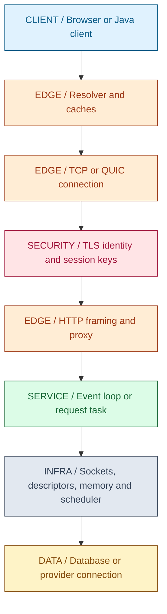
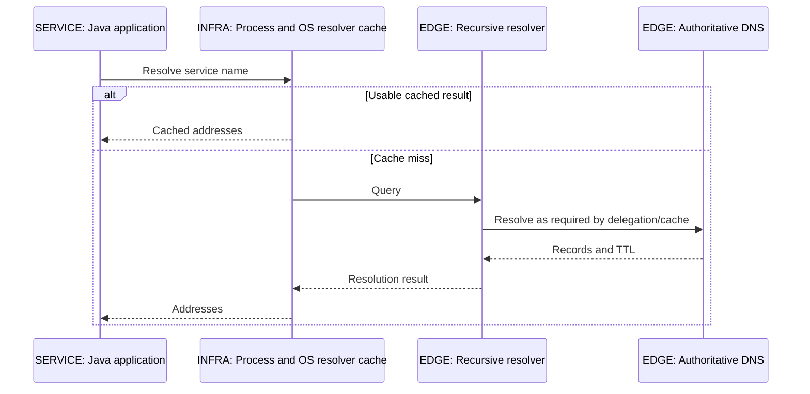
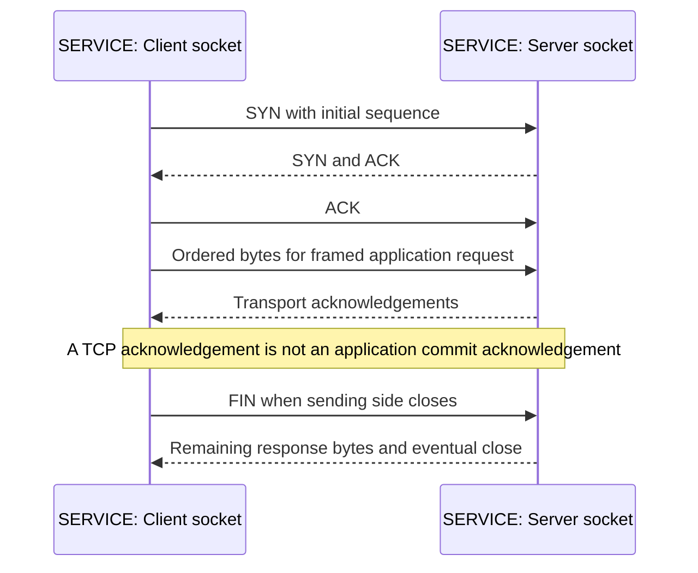
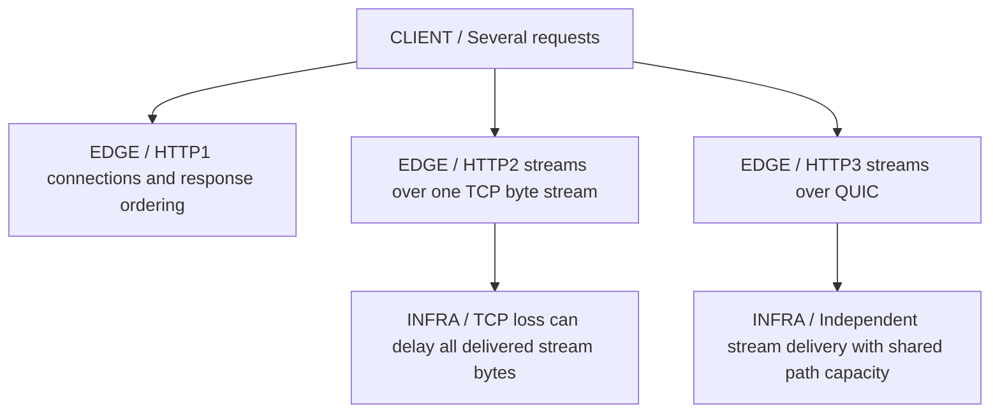
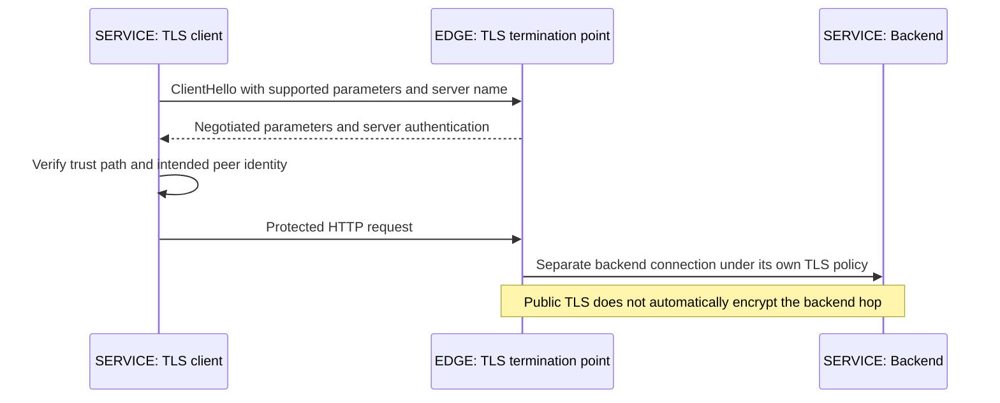
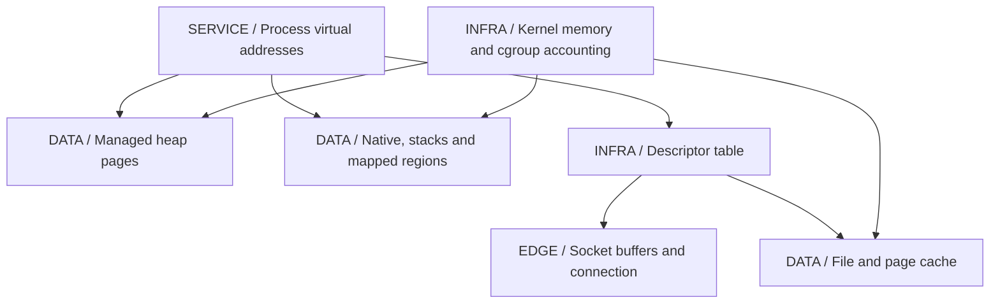
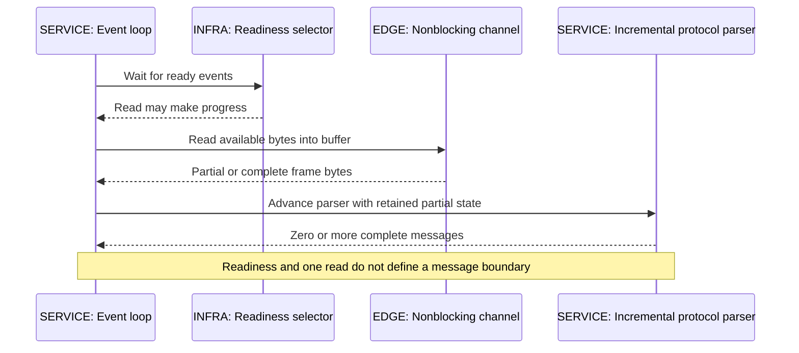

# 21 / Networking and Operating Systems

**A socket is a stream of bytes carried by several independent state machines.** DNS chooses an address, routing finds a path, TCP or QUIC manages transport, TLS establishes protected peer communication, and HTTP frames application messages. IntegrationHub is fictional; this chapter follows that request path without treating a timeout as proof that no remote effect occurred.

**Version assumptions:** Linux networking/OS concepts, Java 21 and modern HTTP/TLS implementations. Spring Boot 4.0.x / Cloud 2025.1.x, PostgreSQL 17, Kafka 4.x and Kubernetes 1.34 remain the guide baseline. The actual workspace is Windows. The saved Node-compatible lab exercised only local stream decoding and loopback HTTP; Linux commands, Java NIO, DNS and TLS experiments were NOT EXECUTED.

## Big Picture

## What You Will Be Able to Explain

- Trace DNS resolution and caching, including JVM-specific stale-address behavior.
- Explain TCP setup, byte ordering, flow/congestion control, half-close, TIME_WAIT and keep-alive.
- Compare HTTP/1.1, HTTP/2 and HTTP/3 multiplexing and head-of-line blocking.
- Explain TLS 1.2/1.3 handshake differences, certificate verification, SNI and mTLS boundaries.
- Diagnose connect/read/pool timeouts, NAT/port exhaustion and L4/L7 proxy behavior.
- Distinguish processes, threads, virtual memory, page cache, file descriptors and cgroups.
- Explain blocking/nonblocking I/O, readiness APIs, Java NIO/Netty and conditional zero-copy paths.
- Choose a bounded diagnostic command that can distinguish the suspected failure.

> [!PRODUCTION]
> **Where this lives in IntegrationHub.** The [00 request journey](00-master-map.md#ch00-master-map) uses these layers before reaching [03's controller](03-spring.md#ch03-spring). [05](05-apis-realtime.md#ch05-apis-realtime) depends on incremental streaming through proxies, [08](08-security.md#ch08-security) owns trust and authorization, and [14](14-docker.md#ch14-docker)/[15](15-kubernetes.md#ch15-kubernetes) change namespace and resource boundaries. [18](18-operations.md#ch18-operations) correlates transport evidence with user impact.

## 1. DNS, TTL and Address Selection

An application commonly asks a resolver for address records; caches may exist in the process, operating system, local resolver and recursive infrastructure. The recursive resolver follows DNS delegation as needed and returns records subject to TTL and policy. A lookup's returned address is not a live health check, and a cached negative result can keep a newly available name appearing absent.

DNS-based load balancing returns addresses or routing answers; clients decide when to resolve and which address to use. Existing pooled connections can outlive a TTL, so changing DNS does not instantly redirect traffic. Failover also needs to establish which backend is authorized to write; changing an address does not fence an old writer.

Java InetAddress caching has runtime/security-property policy, including positive and negative cache behavior. Do not assume a generic -D option changes every security property or that OS TTL behavior equals JVM behavior. Inspect the chosen JDK configuration and client connection-pool lifecycle. Resolve once at startup and retaining that address forever can defeat a carefully configured DNS failover.

| Resolution policy | Use when | Avoid when |
|---|---|---|
| Bounded caching | Reduce resolver latency/load while permitting change | TTL is assumed to close existing connections |
| Service discovery with explicit endpoints | Application policy needs health/metadata beyond DNS | Discovery metadata is assumed to route requests itself |
| Negative caching | Repeated absent names should not overload DNS | Long negative lifetimes hide newly created services |

**[VERIFY: verify JVM positive/negative DNS cache security properties, resolver behavior, client address selection and pool refresh against the selected JDK/OS/client. No DNS failover or cache experiment ran.]**

**Interview checks:** basic: DNS returns naming information, not guaranteed health. Internals: multiple caches and existing connections affect change propagation. Debug: compare process resolution and actual remote socket address. Scenario: coordinate DNS with connection and write-authority policy.

## 2. TCP Setup, Byte Streams and Close

TCP provides an ordered reliable byte stream between endpoints under its failure model. A connection is identified by protocol and endpoint addresses/ports; the familiar handshake exchanges SYN, SYN-ACK and ACK to establish initial sequence state. Connect success establishes transport readiness, not authentication, HTTP validity or successful business processing.

Application write calls do not define read or packet boundaries. Two writes can be read together, one write can require several reads, and a multibyte character can cross a buffer boundary. Frame messages using the actual protocol or a maintained parser. Do not parse JSON, HTTP or SSE by assuming each received chunk is one complete message.

Sequence numbers and acknowledgements track bytes. Retransmission can recover missing segments while preserving the stream abstraction. A successful write may mean bytes entered a local buffer, not that the peer application consumed them. A timeout after sending therefore leaves a remote mutation's outcome unknown. [05](05-apis-realtime.md#ch05-apis-realtime) explains the idempotency response.

TCP supports closing one direction before the other. End-of-stream is not the same as a reset or a zero-byte nonblocking read. TIME_WAIT commonly occurs on the active closer and protects connection reuse against delayed segments under TCP's rules. It is not simply a leaked application socket, and eliminating it indiscriminately can break assumptions. High connection churn can still consume practical port/state capacity and deserves investigation.

**Interview checks:** basic: TCP orders bytes, not messages. Internals: local write and remote application completion differ. Debug: identify reset, EOF and timeout separately. Scenario: preserve request identity when transport failure leaves the effect uncertain.

## 3. Flow Control, Congestion and Keep-Alive

Flow control protects the receiving endpoint from more data than its advertised buffer/window can accept. Congestion control adapts sending to conditions along the network path. Receiver window and congestion window are different constraints; a slow-reading application can reduce progress even on a healthy uncongested path.

TCP algorithms increase and reduce outstanding traffic based on acknowledgements and congestion signals under the selected implementation. Slow start, loss recovery, retransmission timeouts and congestion avoidance influence throughput and latency. The details vary by algorithm and OS; do not infer one universal ramp-up duration or that every delay is packet loss.

TCP keepalive, HTTP connection reuse and application heartbeats are different mechanisms. TCP probes can help detect some dead idle peers under configured timing; HTTP keep-alive commonly means reusing a connection; an SSE comment heartbeat can keep an intermediary from treating the application stream as idle. None is an instant perfect failure detector.

| Mechanism | Use when | Avoid when |
|---|---|---|
| Receive flow control | Receiver buffers/application need bounded input | It is confused with end-to-end application demand semantics |
| Congestion control | Shared paths need adaptive sending | Application throughput is assumed independent of path conditions |
| Connection reuse | Handshake and port churn should be reduced | Stale pooled connections have no timeout/recovery policy |
| Application heartbeat | A protocol needs bounded liveness/idle behavior | It is taken as proof a peer can complete business work |

**[VERIFY: confirm TCP congestion algorithm, keepalive, retransmission, TIME_WAIT and socket-buffer behavior for the actual kernel/network path. The loopback lab is not a packet trace or congestion test.]**

**Interview checks:** basic: flow and congestion control protect different resources. Internals: transport and application liveness differ. Debug: inspect whether the receiver is reading. Scenario: reuse connections with bounded stale-connection recovery.

## 4. HTTP/1.1, HTTP/2 and HTTP/3

HTTP/1.1 commonly reuses connections for multiple requests. Pipelined responses are ordered, which can cause application-level head-of-line blocking; clients often use several connections instead. HTTP message framing uses defined lengths, transfer coding and status/method rules, not connection read boundaries.

HTTP/2 multiplexes independent streams over a connection and has framing and header compression. Responses on different streams can progress independently at the HTTP layer, but they share the underlying ordered TCP byte stream. Loss delaying delivery of required TCP bytes can stall delivery across those streams even though their HTTP messages are independent.

HTTP/3 runs over QUIC, which uses UDP transport while implementing secure reliable streams and congestion control. Independent stream delivery avoids the same TCP-wide transport ordering blockage, but streams still share connection/path resources and can have higher-level dependencies. QUIC is not unreliable fire-and-forget HTTP, and it does not eliminate congestion or every form of head-of-line delay.

Multiplexing changes pool sizing and server concurrency, not business idempotency. One connection can carry many active requests, so connection count is not request count. Flow-control windows, proxy support and backend translation can create bottlenecks. A front door accepting HTTP/2 may forward HTTP/1.1 to the application; inspect each hop rather than assuming one protocol end to end.

| Protocol | Use when | Avoid when |
|---|---|---|
| HTTP/1.1 | Broad compatibility and ordinary request patterns fit | Many concurrent streams are forced through a small serialized connection set |
| HTTP/2 | Multiplexing and supported infrastructure help | TCP-wide transport delays are assumed impossible |
| HTTP/3 | Supported clients/edge and path behavior justify it | UDP restrictions or operational tooling gaps are ignored |

**[VERIFY: confirm HTTP/2 and HTTP/3 support, QUIC/UDP reachability, flow-control and proxy translation behavior for the deployed clients and edge. No protocol negotiation or packet capture ran.]**

**Interview checks:** basic: HTTP/2 streams still share TCP. Internals: QUIC supplies reliability rather than discarding it. Debug: inspect protocol per hop. Scenario: size concurrency and deadlines independently of connection count.

## 5. TLS Handshake, Certificates, SNI and mTLS

TLS protects transport with peer authentication, key establishment and encrypted integrity-protected records under configuration. A typical full TLS 1.3 handshake reduces round-trip work compared with a typical full TLS 1.2 handshake, but DNS, transport setup, resumption and network conditions determine actual latency. Do not quote one total connection time as a protocol constant.

Certificate validation includes a path to an accepted trust anchor, validity, intended identity such as hostname/SAN, and usage/policy checks. A trusted signature alone is not enough if the certificate belongs to a different host. SNI allows the client to indicate the intended hostname during connection setup for routing/certificate selection; it is not tenant authorization.

mTLS adds client certificate authentication under the server's policy. Map that identity to permitted actions and resources; certificate possession does not authorize every tenant operation. Keep trust rotation and application credential policy coordinated but distinct.

Session resumption can reduce handshake work. TLS 1.3 early data/0-RTT has replay considerations; do not allow unsafe state-changing actions solely because the data arrived on an encrypted transport. Use the protocol/application's supported anti-replay and idempotency policy. [08](08-security.md#ch08-security) owns detailed identity and key lifecycle.

**[VERIFY: confirm TLS 1.2/1.3 negotiation, resumption/early-data policy, certificate verification, SNI and mTLS behavior for the actual JVM, browser and proxy. No handshake timing or certificate-validation experiment ran.]**

**Interview checks:** basic: encryption and peer identity are separate checks. Internals: termination creates a new trust/transport boundary. Debug: inspect hostname and trust configuration, not only expiry. Scenario: early data needs replay-safe application policy.

## 6. L4/L7 Proxies, Pools and Timeout Budgets

L4 balancing routes transport connections; L7 reverse proxies understand supported application protocols and may terminate TLS, buffer bodies, retry requests or rewrite headers. These behaviors are operationally significant. A streaming response buffered by a proxy can appear hung even though the backend writes regularly. A proxy retry can repeat a mutation after the backend already committed.

Connection pools reuse expensive connections and bound active resource use under their configuration. Distinguish waiting for a pooled lease from establishing a new connection and from waiting for response data. A client can time out waiting for a pool while no new SYN is ever sent. Increasing connect timeout does not fix that queue.

Read timeout often bounds inactivity between reads, not total operation duration; a peer sending a byte periodically can keep it alive under such a policy. Total deadlines bound the whole logical attempt or request, including retries where designed. Document semantics in the actual client, then divide the parent's remaining budget across stages and cleanup.

| Deadline/limit | Use when | Avoid when |
|---|---|---|
| Pool acquisition timeout | Waiting callers must be bounded | It is misdiagnosed as remote network failure |
| Connect timeout | New connection setup must not wait indefinitely | It is assumed to cover a reused connection's response |
| Read/inactivity timeout | Stalled peers need detection | Slow trickle responses are assumed bounded in total duration |
| Parent deadline | End-to-end work/retries need a total budget | Independent timeouts sum far beyond user patience |

**Interview checks:** basic: timeout names have different boundaries. Internals: a pool wait can occur before any network attempt. Debug: locate where the timer started. Scenario: retry only repeatable work within one parent budget.

## 7. NAT, Ports and Connection Churn

Outbound connections use local addresses/ephemeral ports and remote endpoint tuples. NAT and connection-tracking infrastructure maintain mappings under capacity and timeout policies. High churn, many connections to a small destination set, idle retention or leaked sockets can exhaust practical port/state limits. There is no single universal connections-per-host number independent of addresses, destinations, protocol and implementation.

TIME_WAIT accumulation can be a normal consequence of active connection closure, while CLOSE_WAIT often indicates the local application has not completed closing after the peer did. Interpret states with process ownership and traffic pattern, not as automatic proof of a leak. Reuse connections and close resources deliberately; do not disable protocol safeguards as the first response.

A cluster's source-NAT topology can concentrate many Pods behind a smaller egress address set. Adding application replicas can therefore worsen egress pressure rather than increase usable capacity. Inspect node/NAT metrics and actual remote destinations. Server listen backlog, file descriptors and client pools are separate limits that can produce similar connection symptoms.

**Interview checks:** basic: endpoint tuple and translation state matter. Internals: churn consumes state after calls finish. Debug: separate TIME_WAIT from application close leaks. Scenario: model aggregate egress, not only each Pod's local pool.

## 8. Processes, Threads and Context Switching

A process owns an address-space/resource context; threads execute within a process and share memory while retaining execution state such as stacks and registers. Shared memory needs synchronization under the language/runtime model. Operating-system thread scheduling does not by itself establish Java happens-before relationships from [02](02-concurrency.md#ch02-concurrency).

Context switches move execution among runnable tasks and can involve register/state changes and cache effects. More runnable threads do not create more CPU cores. Oversubscription can increase scheduling overhead and latency; blocked I/O and CPU work need different concurrency reasoning. Java virtual threads are runtime-managed logical threads scheduled onto carriers, not one new OS thread per task.

Priorities, affinity and scheduler implementation can affect behavior but should not be used to paper over a broken application ownership model. A process can be CPU-throttled by cgroups while host-wide CPU appears available. Inspect the namespace/cgroup where the workload actually runs before interpreting host metrics.

| Execution model | Use when | Avoid when |
|---|---|---|
| Process isolation | Separate address spaces and ownership are needed | Process boundaries are assumed to remove all shared-resource contention |
| Threads | Shared in-process work benefits from low-overhead coordination | Mutable state is shared without a synchronization contract |
| Virtual threads | Blocking task structure fits cheap waiting | CPU or downstream resource limits are assumed to disappear |

**Interview checks:** basic: threads share a process's memory. Internals: scheduling is not language-level synchronization. Debug: inspect runnable work and cgroup throttling. Scenario: bound downstream resources even with cheap threads.

## 9. Virtual Memory, Page Cache and Descriptors

Virtual memory maps process addresses onto physical memory or other backing under OS policy. A large virtual address reservation is not the same as resident physical memory. Page faults can involve ordinary mapping/zeroing work or storage I/O depending on the situation. RSS, heap committed/used and virtual size answer different questions.

The page cache retains file-backed data to avoid repeated storage access. Warm file reads can be fast without the application holding the entire file in Java heap. Dirty pages eventually need writeback; a successful buffered write does not necessarily imply power-loss durability. Databases implement logging and flush protocols to establish stronger guarantees, as [06](06-databases.md#ch06-databases) explains.

File descriptors identify open resources such as files, sockets and pipes within a process. Descriptor limits and leaks can cause too-many-open-files failures even when CPU and heap are fine. Closing the high-level Java resource must actually release the underlying descriptor; abandoned streams or response bodies can hold both descriptors and pool capacity.

Container namespaces change what processes see; cgroups change resource accounting/control. A container's process view may hide the host PID needed by a host profiler. Limits can differ between host, container and process configuration. [14](14-docker.md#ch14-docker) and [15](15-kubernetes.md#ch15-kubernetes) own packaging and scheduling implications.

**[VERIFY: confirm Linux virtual/resident memory accounting, page-cache/writeback, descriptor limits and cgroup behavior for the actual kernel/container runtime. No Linux resource or descriptor experiment ran in this Windows workspace.]**

**Interview checks:** basic: virtual size, RSS and heap differ. Internals: cached file data can sit outside Java heap. Debug: inspect open descriptors and unclosed response bodies. Scenario: capture evidence from the correct process/namespace.

## 10. Blocking, Readiness, NIO and Netty

A blocking operation waits until progress or failure under its contract. A nonblocking socket operation can return without transferring all requested bytes. Readiness APIs tell the application which operations may make progress; readiness is not completion of a full message or a guarantee another thread has not consumed the ready data first.

select and poll inspect sets of descriptors with different APIs/limits and scanning behavior. epoll maintains interest in descriptors and returns ready events under configured semantics. It does not run all application handlers in parallel or remove the need for correct buffering, close handling and backpressure. Edge-triggered and level-triggered handling have different obligations; use the framework's documented event model.

Java NIO uses channels, buffers and selectors for supported nonblocking operations. A read can return positive bytes, zero when no progress is made, or end-of-stream according to the channel contract. A write can consume only part of a buffer. ByteBuffer position/limit and flip/compact control which bytes are produced, consumed or preserved; confusing them can drop partial frames.

Netty combines event loops, channels, pipelines and buffer abstractions. A channel's handlers commonly execute on its assigned event-loop thread under configuration. Blocking a handler can delay many channels served by that loop. Offload necessary blocking work to a bounded executor and preserve response ordering, cancellation and context. Reference-counted buffers need correct ownership/release under the selected APIs; leaking direct buffers can grow process memory outside heap.

Register interest in write readiness only while output remains pending, according to the framework contract; a continuously writable socket can otherwise drive a busy loop. Bound queued outbound data for slow readers. Nonblocking I/O changes where waiting lives, not the finite bandwidth or memory available.

Zero-copy is shorthand for optimized paths that avoid some user-space copies, such as suitable file-to-socket transfer. It is not zero CPU, zero kernel work or a guarantee for every TLS/compression path. Java transfer APIs may use platform optimizations or fallbacks; measure the actual path rather than relying on the name.

**[VERIFY: verify Java NIO selector/channel semantics, Netty event-loop and buffer ownership, epoll modes and zero-copy/TLS support against the selected OS/JDK/library. No Java NIO, Netty or zero-copy benchmark ran.]**

**Interview checks:** basic: readiness is not message completion. Internals: partial buffers survive across events. Debug: look for blocking handlers or permanent write interest. Scenario: preserve bounded queues and buffer ownership when offloading work.

## 11. Diagnostic Toolbox and Safe Scope

Choose a command that separates hypotheses and record the host/container context. The examples below are Linux-oriented unless otherwise stated, require the named tools and are NOT EXECUTED here. Read-only inspection can reveal credentials, addresses, process arguments or customer data; authorization and redaction still apply. Packet capture and tracing can require elevated capabilities and impose overhead.

| Tool/example | Use when | Avoid when |
|---|---|---|
| curl -v with an approved URL and a bounded timeout | Inspect DNS/connect/TLS/HTTP behavior from one client path | Verbose output containing authorization/cookies is shared unredacted |
| dig for an approved hostname | Compare resolver records and TTL behavior | Resolver output is assumed to describe a JVM's cached connection |
| ss -lntp and ss -s | Inspect listeners, socket states and aggregate connection pressure | Missing process detail under permissions is interpreted as no owner |
| tcpdump with approved interface/host filter and packet count | A scoped packet observation can distinguish retransmission/reset behavior | Broad production capture runs without authority, privacy or stop bounds |
| top in bounded batch mode | Identify process/thread CPU and memory candidates | One instantaneous sample is treated as a complete profile |
| vmstat | Compare runnable work, memory and system activity over a defined interval | Counters are interpreted without OS/version/time-window context |
| iostat | Investigate storage latency/utilization signals | Device averages alone are used to identify a Java call site |
| strace with an approved PID and bounded capture | Observe selected syscalls/waits to test an I/O hypothesis | Attaching to sensitive or busy production processes is assumed harmless |

Do not equate curl success from an administrator host with success from a Pod using another DNS, route, proxy, truststore or role. Likewise, encrypted packet capture generally cannot show an application payload without additional sensitive instrumentation; metadata can still be useful. Thread/CPU profiles and OS traces answer different questions and should be correlated, not substituted blindly.

> [!DECISION]
> **Localize the failure before changing a setting.** Name resolution, pool wait, connect, TLS, HTTP status, application processing and return-path streaming are separate stages. The right diagnostic is the one that can disprove the current stage hypothesis.

## 12. Executed Stream Lab

`code/21-network-os/StreamLab.mjs` uses built-in StringDecoder, readline and HTTP libraries rather than implementing a protocol parser. Its Windows PowerShell runner is `& './docs/java-fs-guide/code/21-network-os/run.ps1'` from workspace root. It binds one temporary HTTP server to 127.0.0.1 on an ephemeral port, uses a bounded client deadline and closes all server connections afterward.

The actual three PASS checks show that a UTF-8 decoder preserves a character split across input buffers, line framing preserves records split across chunks, and the HTTP client assembles JSON from two server write calls. The test does not assert that each write becomes a separate TCP packet/read; the OS is free to coalesce or segment them. It measures no latency or bandwidth and contacts no external host.

> [!MECHANISM]
> **Protocol state must survive buffer boundaries.** The decoder/parser remembers incomplete input until enough bytes arrive. This is why a maintained framing implementation is safer than treating each read callback as a complete application message.

> [!TRAP]
> **A transport acknowledgement or cancelled client wait does not settle a remote transaction.** Preserve logical request identity and resolve the outcome at the service authority instead of assuming the network exception undid the work.

> [!INTERVIEW]
> **Explain one connection from name to resource.** Then identify which timeout, identity check, queue or kernel limit can fail at each step. That is more useful than listing socket flags without a causal model.

## Explained-Here Index and Sources

| Concepts | Explanation |
|---|---|
| DNS | [Resolution and caches](#ch21-dns) |
| TCP, ports and TIME_WAIT | [Transport lifecycle](#ch21-tcp) |
| Keep-alive | [Flow and liveness](#ch21-flow) |
| HTTP/1.1, HTTP/2, HTTP/3 and QUIC | [Framing and multiplexing](#ch21-http) |
| TLS handshake and SNI | [Protected transport](#ch21-tls) |
| L4 vs L7, reverse proxy, connect/read timeouts | [Proxy and pool budgets](#ch21-proxies) |
| NAT and port pressure | [Connection churn](#ch21-nat) |
| Processes, threads, context switch | [Execution](#ch21-os) |
| Virtual memory, page cache, file descriptors | [OS resources](#ch21-memory) |
| Blocking I/O, NIO, Netty, event loop, select/poll/epoll, zero-copy | [Readiness and buffers](#ch21-io) |
| Linux, curl, dig, ss, tcpdump, top, vmstat, iostat, strace | [Toolbox](#ch21-toolbox) |

Verification destinations: [TCP RFC 9293](https://www.rfc-editor.org/rfc/rfc9293.html), [TLS 1.3 RFC 8446](https://www.rfc-editor.org/rfc/rfc8446.html), [HTTP/2 RFC 9113](https://www.rfc-editor.org/rfc/rfc9113.html), [HTTP/3 RFC 9114](https://www.rfc-editor.org/rfc/rfc9114.html), [Java NIO](https://docs.oracle.com/en/java/javase/21/docs/api/java.base/java/nio/package-summary.html) and [Netty documentation](https://netty.io/wiki/). These are verification pointers; no protocol trace is fabricated.

## Related Chapters

Use [00](00-master-map.md#ch00-master-map), [01 JVM](01-java-jvm.md#ch01-java-jvm), [02 concurrency](02-concurrency.md#ch02-concurrency), [03 web stack](03-spring.md#ch03-spring), [05 streaming](05-apis-realtime.md#ch05-apis-realtime), [06 durability](06-databases.md#ch06-databases), [08 security](08-security.md#ch08-security), [10 deadlines](10-system-design.md#ch10-system-design), [14 containers](14-docker.md#ch14-docker), [15 cluster networking](15-kubernetes.md#ch15-kubernetes), [18 diagnostics](18-operations.md#ch18-operations), [22 failures](22-distributed.md#ch22-distributed) and [23 profiling](23-jvm-performance.md#ch23-jvm-performance). Generated links are reciprocal.

## One-Page Cheat Sheet

**Names/connections:** DNS caching and existing pools both delay address changes. TCP orders bytes, not messages. Connect/write/transport acknowledgement do not prove application commit. TIME_WAIT is protocol state, not automatically a leak.

**Transport:** flow control protects the receiver, congestion control the path. HTTP/2 multiplexes over TCP and retains transport-wide loss effects; HTTP/3 uses reliable QUIC streams but still shares path resources. Keepalive, HTTP reuse and application heartbeat differ.

**Trust/deadlines:** validate certificate identity and trust, not only a signature. SNI routes, mTLS authenticates peers, services authorize resources. Pool acquisition, connect, read inactivity and total deadline cover different waits.

**OS:** processes isolate address spaces, threads share memory, context switching does not create capacity. Virtual size, RSS and heap differ. Page cache and native buffers matter. Close descriptors and response bodies deliberately.

**I/O:** selectors report readiness, reads/writes can be partial, parsers retain state and event loops must not block. Zero-copy is path-dependent. Three stream/loopback checks passed; Linux, DNS, TLS and Java NIO experiments remain unexecuted.

## Interview Corner

### Basic: Why Can One Write Require Several Reads?

TCP exposes bytes without preserving application write boundaries. Framing and decoding must retain partial input and may produce zero, one or several complete messages per read.

### Internals: Flow Control Versus Congestion Control?

Receiver capacity versus network-path conditions. Both constrain sending but diagnose different bottlenecks; a slow reader can stall an otherwise healthy path.

### Trace/Debug: DNS Changed but Traffic Still Uses the Old Server.

Inspect JVM/OS/resolver caches and long-lived pooled connections. TTL changes do not close existing sockets, and failover also needs write-authority control.

### Scenario: A Client Times Out After Posting a Job.

The server may have committed. Retry/query using the same logical identity under the API contract rather than creating a fresh request and assuming the old effect vanished.

### Basic: Does HTTP/2 Eliminate All Head-of-Line Blocking?

No. Streams are independent at the HTTP layer but share an ordered TCP transport. HTTP/3 changes that transport relationship but still shares congestion and other resources.

### Internals: What Does a Selector Event Mean?

An operation may make progress under the readiness model. It does not guarantee a full message, a full write or exclusive ownership after another thread acts.

### Trace/Debug: Read Timeout Never Fires During a Slow Response.

The configured timer may measure inactivity between bytes, not total duration. A trickle can reset it; add an appropriate total deadline and inspect client semantics.

### Scenario: An Event Loop Calls a Blocking Database Driver.

One blocked loop can delay many connections. Use the appropriate blocking stack or bounded offload while preserving context, ordering and backpressure; more channels do not fix it.

### Basic: Virtual Memory Versus RSS?

Address-space mappings/reservations versus resident physical pages under the OS accounting model. Neither is identical to Java heap used.

### Internals: Why Can NAT Limit a Scaled-Out Service?

Many workloads can share egress addresses and translation state. Connection churn and destination concentration may exhaust practical capacity even as application replicas increase.

### Trace/Debug: Too Many Open Files With Normal Heap.

Inspect descriptors, unclosed sockets/files/response bodies, process limits and namespace context. Descriptor exhaustion is a different resource failure from heap growth.

### Scenario: Which Tool Do You Run First?

Choose the one that distinguishes the suspected stage: resolver lookup, bounded HTTP client trace, socket state, CPU/storage metric or authorized syscall/packet capture. Do not begin with a broad intrusive capture without a hypothesis.