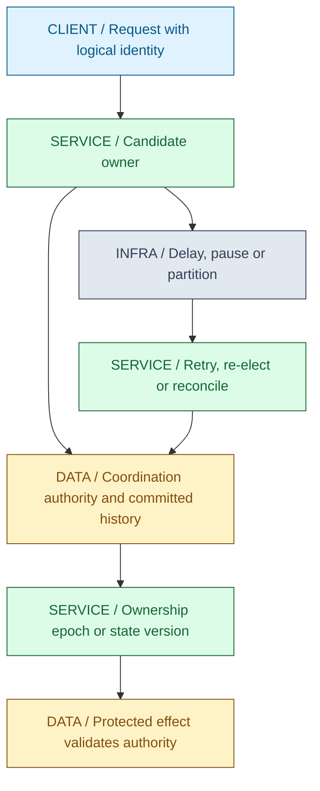
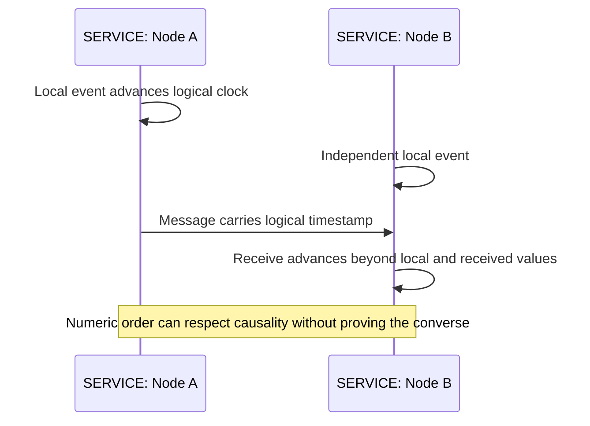
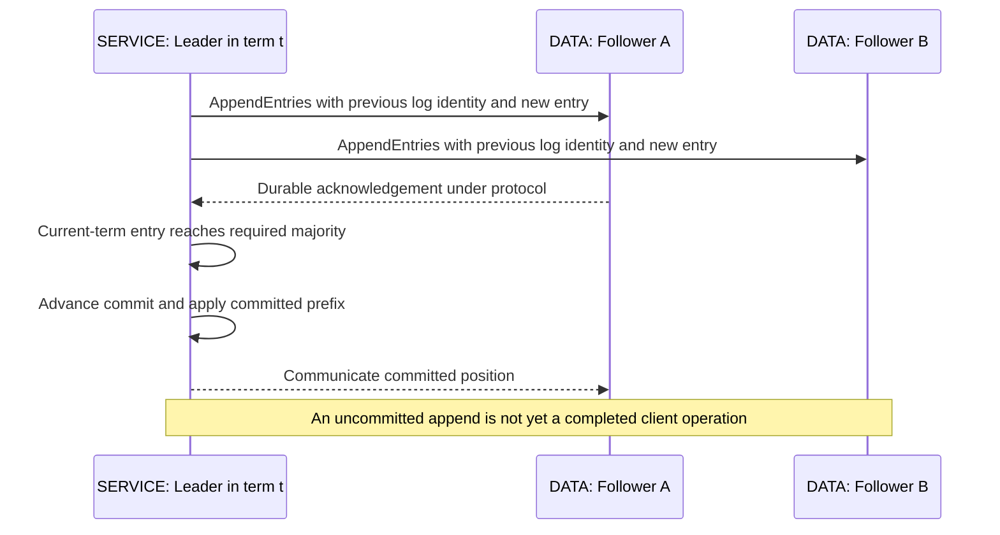
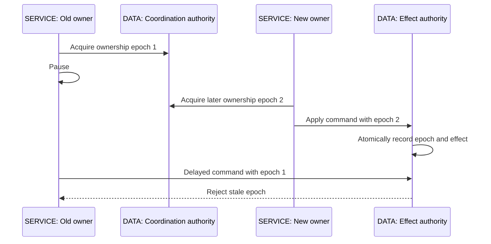
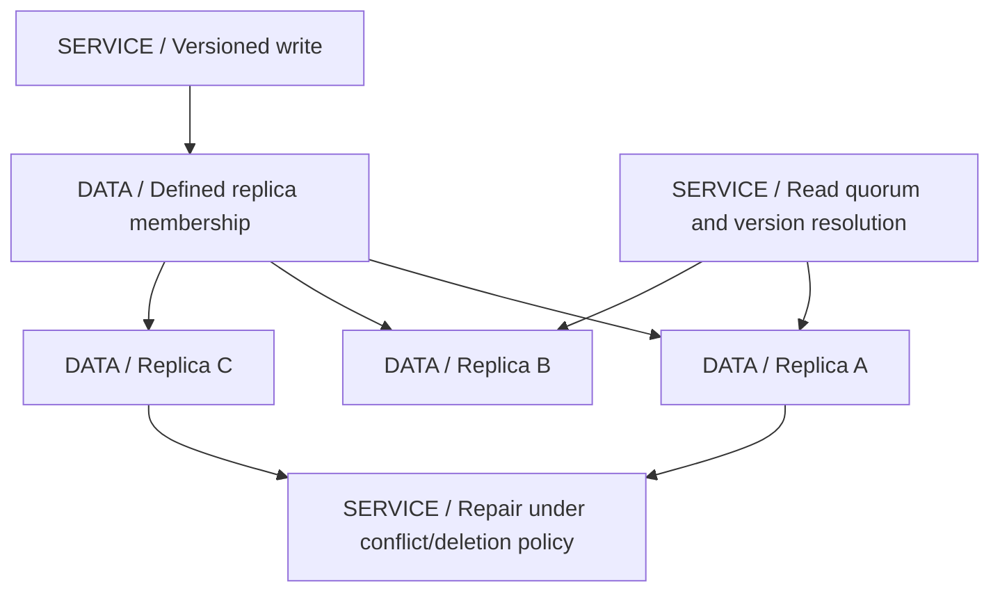
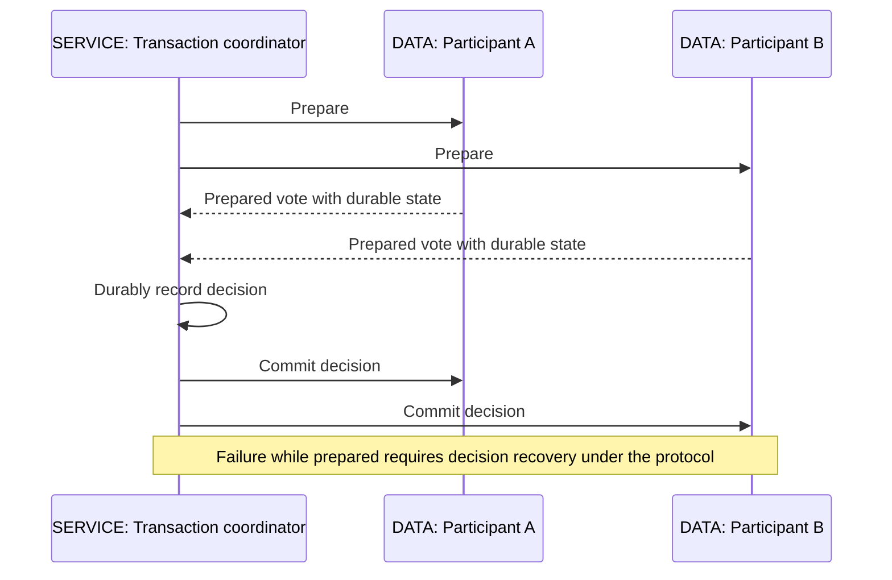

# 22 / Distributed Systems Theory

**A timeout is an observation of silence, not proof of failure.** A process can pause, a response can be delayed, and two healthy regions can disagree about who is reachable. IntegrationHub is fictional. This chapter makes the assumptions behind its leadership, storage and retry contracts explicit rather than borrowing guarantees from product names.

**Version assumptions:** Java 21, Spring Boot 4.0.x / Cloud 2025.1.x, PostgreSQL 17, Kafka 4.x and Kubernetes 1.34 remain illustrative baselines. Raft/Paxos concepts are algorithmic, not claims about a configured cluster. etcd, ZooKeeper, lease clients and Redis implementations need pinned-version review. The Redis locking documentation, Martin Kleppmann's critique and Salvatore Sanfilippo's response were consulted for the contested Redlock section.

**Execution evidence:** OrderingLab.mjs passed four single-process logical-clock/fencing checks. No distributed consensus, lease, quorum storage, clock fault, Redlock or regional-failover experiment was executed. A local model illustrates a boundary; it does not certify a distributed implementation.

## Big Picture

## What You Will Be Able to Explain

- Separate crash, pause, omission, partition and Byzantine failure models, and safety from liveness.
- Explain physical clock error, Lamport/vector/HLC ordering and what timestamps cannot prove.
- Trace basic Paxos and Raft agreement, leader election, quorum and log-safety reasoning.
- Design one scheduled job across many Pods using durable identity, election and effect-side fencing/idempotency.
- Present Redlock's assumptions and critique fairly instead of calling every majority algorithm consensus.
- Distinguish linearizable, sequential, causal and eventual consistency; explain CAP/PACELC precisely.
- Reason about replication, quorum reads/writes, partitioning, failure detectors and the limits of exactly-once/2PC/saga claims.

> [!PRODUCTION]
> **Where this lives in IntegrationHub.** [12's scheduler](12-hld.md#ch12-hld) needs durable fire identity and stale-owner protection; [07's consumers](07-messaging.md#ch07-messaging) need effect/ack recovery; [06](06-databases.md#ch06-databases) owns local constraints. [10](10-system-design.md#ch10-system-design) chooses consistency by operation, [15](15-kubernetes.md#ch15-kubernetes) replaces processes, and [18](18-operations.md#ch18-operations) observes recovery without treating a heartbeat as proof of correctness.

## 1. Failure Models, Safety and Liveness

Crash-stop means a process stops and does not return in the modeled execution; crash-recovery permits return with whatever durable state survived. Omission means messages or actions may not occur; delay/reordering and partitions can make otherwise healthy peers appear unavailable. Byzantine behavior permits arbitrary faulty or malicious responses. An algorithm designed for crash faults is not automatically safe when members lie or its persistent state is corrupted outside the model.

Safety says something bad never happens, such as two conflicting committed values for one log position. Liveness says useful progress eventually occurs under stated conditions. A system can preserve safety by refusing writes when it lacks enough authority. Improving availability by accepting uncoordinated writes changes the consistency contract rather than proving the old contract still holds.

In an asynchronous model, no fixed upper delay bound distinguishes a slow process from a failed one. FLP's result concerns guaranteed termination of deterministic consensus under its fully asynchronous failure assumptions; it does not mean practical consensus is useless. Practical systems use conditions such as eventual synchrony, timeouts and randomized election behavior for progress while preserving algorithmic safety under their fault model.

| Assumption | Use when | Avoid when |
|---|---|---|
| Crash-fault model | Members follow protocol but can stop/recover | Malicious members or corrupted persistence are silently included |
| Eventual synchrony | Progress is expected once delays become well behaved | A timeout is treated as proof of permanent death |
| Refuse unsafe operations | A consistency invariant must survive partition | Rejection is mislabeled as successful acceptance |

**Interview checks:** basic: safety and progress differ. Internals: timeouts are suspicions. Debug: ask whether a peer stopped or only communication did. Scenario: define the fault model before claiming a quorum makes a design safe.

## 2. Physical Time, Lamport Clocks, Vectors and HLC

Wall clocks can have offset and rate error and can be adjusted. Monotonic clocks help measure elapsed time within one process/host contract, but do not create a globally comparable instant across machines. Lease safety that depends on bounded clock drift must state and enforce that assumption. A log timestamp alone is not proof of causal order.

Lamport clocks increment locally and on receive advance beyond both local and received values. If event A causally precedes B under the protocol, A's Lamport value is smaller. The converse is false: a smaller value does not prove causality. Adding a node-ID tie breaker gives a deterministic total order, not a proof that it matches physical time or business causality.

Vector clocks track components for participating actors. A vector precedes another when every component is no greater and at least one is smaller. Incomparable vectors can represent concurrent histories. This retains more causal information but increases metadata and requires careful actor lifecycle/pruning policy. Deleting components casually can discard information needed to identify conflicts.

Hybrid logical clocks combine a physical-time component with a logical counter so timestamps can remain causally ordered under the algorithm while staying near wall time under assumptions. They do not make clocks perfectly synchronized or capture all concurrency information that a vector can express. Timestamp-based last-write-wins can discard concurrent updates; a deterministic winner is not necessarily the business-correct one.

**[VERIFY: verify physical/monotonic clock, drift/offset bounds and the selected HLC/vector metadata policy in the actual system. The local lab checks Lamport receive and vector comparison only; no clock synchronization or lease-timing experiment ran.]**

**Interview checks:** basic: physical and logical time answer different questions. Internals: Lamport's implication is one-way. Debug: equal-looking timestamps can hide concurrent events. Scenario: select version/conflict semantics from the business invariant.

## 3. Consensus, Paxos and Raft

Consensus lets participants agree on a value/history under a fault model. Replicated state machines use an agreed order of commands so deterministic application of that history produces coherent state. This does not automatically include an external database transaction, HTTP call or nondeterministic side effect. Those need their own coordination/idempotency boundaries.

In basic Paxos, a proposer uses a numbered proposal. A prepare phase obtains promises from a quorum and learns relevant previously accepted proposals; the proposer must preserve a value required by that history rather than freely choose a conflicting one. An accept phase asks acceptors to accept the selected proposal, and quorum acceptance can establish the chosen value. Persistent promises/accepted state and overlapping quorums are essential. Multi-Paxos amortizes parts of agreement across a sequence under suitable leader behavior; it is not simply broadcast-and-count.

Raft organizes the problem around terms, leader election and log replication. A candidate increments term, votes for itself and requests votes. A voter grants at most its permitted vote per term and checks log freshness under the protocol. The winner needs a majority of the configured voting set. Randomized election timeout reduces repeated split votes; it does not make an isolated candidate authoritative.

Raft checks previous log index/term to repair divergent uncommitted suffixes. Term/vote/log persistence must satisfy the implementation's crash-recovery assumptions. A leader does not declare arbitrary old-term entries committed solely by counting replicas; the current-term commitment rule is part of preserving safety, with preceding entries committed through the prefix once the rule permits it.

A leader can be stale after partition. Linearizable reads need the protocol's authority confirmation or a correctly implemented lease/read-index mechanism; merely reading a former leader's local state is insufficient. Membership changes must preserve the required quorum relationships through a supported reconfiguration protocol. Independently changing node lists can destroy the intersection reasoning.

| Coordination choice | Use when | Avoid when |
|---|---|---|
| Proven consensus service | Critical shared metadata needs one agreed authority | A hand-written majority loop substitutes for a complete protocol |
| Replicated state machine | Ordered deterministic commands fit the domain | External side effects are assumed rolled back by log agreement |
| Quorum refusal | Safety must survive lost majority | Split clusters both accept conflicting authoritative writes |

**[VERIFY: verify Raft/Paxos implementation persistence, read semantics, membership change and crash-recovery assumptions against the selected proven service and primary algorithm references. No consensus algorithm or cluster was implemented or tested here.]**

**Interview checks:** basic: agreement is more than replication. Internals: quorum overlap works with protocol rules and durable history. Debug: distinguish append from commit. Scenario: use a proven coordination service and explain how its guarantee reaches the application effect.

## 4. Leader Election and One Scheduled Job Per Fleet

etcd provides a coordination store built around its consistency and lease/watch APIs; ZooKeeper provides coordinated state, sessions and recipes such as ephemeral sequential-node election. Kubernetes Lease objects can coordinate leader-election clients under their own update/timing protocol. A database can arbitrate ownership through transactional rows, conditional writes or advisory locking. Each mechanism has a different failure/session/resource scope.

The useful application question is not simply which Pod is leader, but what the old leader can still do. It may pause after checking ownership, lose its lease, then resume while a new leader runs. A watch/disconnect notification is not instantaneous and cannot reliably recall an already sent provider request.

For one scheduled IntegrationHub sync, use a stable fire-instance identity such as schedule/version/logical fire time, durable claiming and an idempotent effect. Election can reduce duplicate planning work, but unique fire records and protected execution remain valuable after leader loss. A cron callback on each Pod plus a local boolean is not distributed scheduling.

Database advisory locks can be session- or transaction-scoped under engine rules; losing a connection releases ownership according to that contract but does not undo an already sent external effect. Row leases need atomic ownership/expiry updates and a clock authority policy. Avoid holding a database transaction open for arbitrary long provider work merely to simulate a distributed mutex.

**[VERIFY: check etcd/ZooKeeper lease/session/watch behavior, Kubernetes leader-election client semantics, database lock scope and usable fencing revisions for the selected versions. No election, disconnect, expired lease or singleton scheduling experiment ran.]**

**Interview checks:** basic: election selects an owner under a protocol. Internals: lost ownership does not stop a process. Debug: inspect durable fire identity and external effects. Scenario: protect the effect, not only the election record.

## 5. Distributed Locks and Fencing Tokens

A lease bounds how long ownership is intended to remain valid. A random unique lock value can help release only the caller's own lock using atomic compare-and-delete. It is not automatically a monotonically ordered fencing token. Deleting an expired/replaced lock without checking its owner can remove someone else's lock.

Fencing requires a monotonically ordered authority token and an effect-side check that rejects stale authority atomically with the protected mutation. Every relevant writer must participate. Sending the token to a service that ignores it establishes nothing. The resource's remembered highest epoch must survive the failure modes for which safety is claimed.

There is an important boundary: issuing epoch 2 in a coordination service does not instantly inform every protected resource. A resource that has only seen epoch 1 can still accept it under a highest-seen-token policy until the newer fence reaches it. If the requirement is immediate revocation at grant time, the grant/resource protocol must establish that stronger property. Within one epoch, message ordering and duplicate effects may still need sequence/version or idempotency checks.

OrderingLab makes that distinction explicit: it accepts an old-owner write before the higher epoch reaches the local resource, then rejects it after epoch 2 is applied. This is not a lease implementation, durable storage or a distributed safety proof. It illustrates where enforcement occurs.

> [!MECHANISM]
> **Fencing works at the effect boundary.** The resource atomically compares authority with its stored state before applying a mutation. A client-side expiry check can be followed by an arbitrary pause and is therefore a different, weaker mechanism.

| Lock use | Use when | Avoid when |
|---|---|---|
| Best-effort duplicate-work suppression | Occasional duplicate computation is acceptable | Correctness depends on perfect exclusion but this is undocumented |
| Lease plus protected effects | Stale owners must not corrupt a supported resource | The target ignores fencing/idempotency metadata |
| Local transaction/constraint | The invariant fits one database authority | A distributed lock is added instead of using the existing atomic boundary |

**Interview checks:** basic: unique owner token and fencing order differ. Internals: enforcement must be atomic with effect. Debug: check every write path and durable epoch state. Scenario: a provider without fencing support needs idempotency or reconciliation under its own contract.

## 6. Redlock: Algorithm, Critique and Decision

The Redis documentation describes acquiring a key with the same unique owner value and TTL on independent masters, accepting the acquisition only after obtaining the required majority quickly enough and subtracting elapsed time plus a drift allowance from validity. Failed partial acquisitions are released, and release must compare the owner value atomically. This is not a Raft log and does not inherit Raft's guarantees merely because it uses a majority.

The proposed argument relies on an interval in which a majority of lock keys coexist under timing/persistence assumptions. During that interval, a competing acquisition cannot also set a majority of the same keys. Client work must stay inside the valid interval, and restart/persistence policy must prevent old lock information from disappearing unsafely. Lease extension also needs a valid protocol, not an assumption that a live process owns the lock forever.

Kleppmann's critique distinguishes efficiency locks from correctness locks. For correctness, a paused client or delayed request can act after lease expiry, and timing/clock assumptions can fail. He argues for effect-side fencing and a stronger coordination approach where required, noting that a random token alone is not a monotonic fencing token. He also questions the value of a multi-node protocol for merely approximate duplicate-work suppression.

Sanfilippo's response defends the algorithm under bounded relative-time error and emphasizes that it measures elapsed acquisition time: a delayed acquisition response should not simply be accepted as a fresh full lease. He separates delays during acquisition from work continuing after expiration, discusses resource-specific check-and-set/token approaches and persistence/restart assumptions, and argues that the critique's requirements do not fit every use case. That is not equivalent to claiming arbitrary pauses after validation are harmless.

The current Redis page itself highlights fencing and warns about TTL/clock concerns. The practical decision is to specify the target resource and failure assumptions, not declare every Redis lock safe or every Redis use invalid. For IntegrationHub's correctness-sensitive job/ledger state, prefer its database transaction/unique identity or a proven coordination service plus effect protection. Use approximate locks only when duplicate work is an accepted efficiency cost.

**[VERIFY: Redlock is contested. Consult the Redis distributed-lock specification, Kleppmann's analysis and Sanfilippo's response, and validate the exact client/server timing, persistence, renewal and effect-side fencing assumptions. All three sources were consulted; no Redis/Redlock or fault-injection experiment was executed.]**

**Interview checks:** basic: majority does not automatically mean consensus. Internals: elapsed acquisition checks and post-expiry effects are separate issues. Debug: state whether exclusion protects efficiency or correctness. Scenario: choose a resource-enforced safety contract rather than relying on a library name.

## 7. Consistency Models

Linearizability makes each operation appear atomic at a point between invocation and response while respecting real-time ordering. Sequential consistency provides one order consistent with each process's program order but need not preserve the same real-time precedence across processes. Causal consistency preserves dependencies between causally related operations while allowing unrelated operations to be ordered differently. Eventual consistency promises convergence under its stated conditions, not any particular intermediate read result.

Read-your-writes and monotonic reads are useful session guarantees. A client switching replicas can otherwise see its own write disappear or observe older state after newer state. A browser's local optimistic state is not a storage consistency guarantee; the API must explain when authority or projections become visible.

Linearizability of individual operations is not the same as serializability of multi-operation transactions. Two individually atomic reads/writes do not automatically make a read-modify-write sequence atomic. Strict serializability combines transaction serializability with real-time constraints under its definition. Pick the scope needed by the invariant, not the strongest-sounding adjective.

| Model | Use when | Avoid when |
|---|---|---|
| Linearizable operation | One latest authority decision is required | Multiple operations are assumed to form a transaction automatically |
| Causal/session guarantees | Dependency order and user continuity matter | Concurrent updates need a total business order that is not supplied |
| Eventual projection | Search/analytics can tolerate bounded operational lag policy | Stale data authorizes spending or cross-tenant access |

**Interview checks:** basic: eventual does not mean instantly correct. Internals: real-time and program/causal order differ. Debug: identify which replica and session read the value. Scenario: use the minimum guarantee that actually preserves the invariant.

## 8. CAP and PACELC in Practice

CAP concerns the inability to guarantee both linearizable consistency and its formal availability property during a network partition under the theorem's assumptions. It is not a permanent choose-any-two menu, and partition tolerance is not an option to turn real network failures off. Practical systems choose per operation what may reject, wait or return weaker results.

For IntegrationHub, a stale search result may be acceptable, but a conflicting authoritative ownership grant should not be reported as valid on both sides of a partition. A pending durable command can be a valid API result if that is the contract, but relabeling uncommitted work successful does not satisfy the original consistency promise. Timeouts and retries need explicit user-visible outcomes.

PACELC points to another trade-off: without a partition, coordination for stronger consistency can still cost latency. Cross-region acknowledgement choices affect normal operation as well as disaster behavior. Neither acronym tells you whether a specific database configuration has a guarantee; inspect the service's actual protocol, read mode and failure policy.

> [!TRAP]
> **Availability percentages and CAP availability are not the same definition.** A system can have an excellent operational uptime SLO while deliberately rejecting unsafe writes during a partition. State which meaning you are using.

**Interview checks:** basic: CAP is about a failure condition and precise properties. Internals: normal-operation coordination still has latency cost. Debug: identify which operation degraded and how. Scenario: decide stale read versus rejected write per business requirement.

## 9. Replication and Quorum Reads/Writes

Leader-follower replication centralizes write ordering and replicates to followers with chosen acknowledgement and read policies. Multi-leader replication permits writes in several places and must handle conflicting histories. Leaderless systems coordinate reads/writes across replica sets under versioning, repair and quorum policy. Each shifts conflict and availability responsibilities; none can be summarized safely by node count alone.

For a fixed replica set of size N, R+W>N gives an intersection between a read set of size R and a completed write set of size W. This is a useful set fact, not a complete linearizability proof. Concurrent/partial writes, version selection, durable acknowledgements, membership changes and repair behavior matter. Sloppy quorums using fallback nodes can change the intersection assumptions entirely.

Read repair and anti-entropy help converge divergent replicas; hinted handoff can temporarily store work for an unavailable replica under its contract. Repair must distinguish obsolete versions and deletions. A deleted item can reappear if tombstone retention is shorter than the supported offline/repair horizon and no stronger reconciliation protects it.

Last-write-wins using wall time can discard a valid concurrent update if clocks differ or operations conflict semantically. Vector versions can expose concurrency but do not choose the business resolution for you. Some operations can use carefully chosen convergent data types; not every invariant, such as bounded balance spending, can be solved by an arbitrary merge.

**[VERIFY: validate read/write quorum membership, durability, conflict resolution, repair, tombstones and failover against the selected storage implementation. R+W>N alone is not an asserted product consistency guarantee; no replicated-store experiment ran.]**

**Interview checks:** basic: quorum overlap is necessary reasoning, not a whole protocol. Internals: concurrent versions and membership affect results. Debug: inspect stale repair/tombstone behavior. Scenario: make conflict resolution a domain decision.

## 10. Partitioning, Consistent Hashing and Split Brain

Partitioning assigns keys/work to ownership ranges. Range partitioning supports ordered access and can hotspot recent ranges; hash partitioning spreads many keys but can make range queries expensive. Consistent hashing reduces expected remapping when membership changes under its model. Virtual nodes can improve distribution and rebalancing flexibility, but a single hot key still belongs somewhere.

Partition metadata itself needs an authority and transition protocol. During movement, define who accepts writes, how data is copied, how changes are caught up, how stale routes are handled and when the old owner is fenced. Copying rows then flipping an unversioned map can lose concurrent writes. Tenant locality helps common operations but a giant tenant may require a further partitioning strategy.

Split brain means participants operate under conflicting authority views, often after partition/failover. Preventing it may require rejecting writes without quorum, fencing old owners or using a conflict-resolution model that genuinely tolerates concurrent writers. Rejoining two regions is not automatically safe merely because connectivity returns; divergent effects need reconciliation.

| Placement choice | Use when | Avoid when |
|---|---|---|
| Range partition | Ordered locality and retention operations matter | A moving hot range overloads one owner |
| Hash/consistent hashing | Broad keys and membership changes justify distribution | Hot keys and metadata authority are ignored |
| Tenant affinity | Most invariants stay within one tenant | One tenant exceeds a shard and no migration strategy exists |

**Interview checks:** basic: hashing distributes keys, not arbitrary workload evenly. Internals: movement needs a write-authority protocol. Debug: inspect routing generation and overlapping ownership. Scenario: reconcile effects before reopening divergent writers.

## 11. Heartbeats, Phi Accrual and Gossip

A heartbeat tells an observer that some sender/path was responsive at a moment. Failure detection turns elapsed silence and other signals into suspicion under a policy. Phi-accrual detectors express a suspicion measure based on observed arrival behavior rather than only one fixed interval; threshold choice still trades false suspicion against detection delay and depends on the statistical model/workload.

Gossip disseminates membership/state through repeated peer exchanges. It can scale dissemination and tolerate partial failure, but membership convergence is not consensus on one authoritative write. A node absent from one observer's view may still be processing work elsewhere. Do not use gossip membership alone to grant mutually exclusive correctness-sensitive ownership.

Detection and action must be separated. Suspecting a leader can trigger an election attempt, but the new owner still needs the coordination protocol's authority and effect-side protections. Aggressive timeouts can create repeated elections and load precisely when the system is slow. Conservative timeouts may preserve stability but delay recovery; measure and set policy accordingly.

**Interview checks:** basic: detection is suspicion, not certainty. Internals: adaptive thresholds still rely on assumptions. Debug: distinguish membership dissemination from authoritative agreement. Scenario: a heartbeat timeout must not directly authorize conflicting external effects.

## 12. Exactly-Once Effects, 2PC and Saga

Exactly-once needs a named boundary: records emitted by a broker transaction, one local database mutation, or an external provider effect. Re-executing code can still produce one committed effect if identity and atomicity suppress duplicates. Conversely, processing two separately identified business duplicates once each still creates two effects.

Two-phase commit coordinates atomic outcome among participating resource managers. In prepare, participants durably promise that they can commit or vote no; after the required votes the coordinator records and communicates a decision. A prepared participant may need to retain locks/resources while awaiting recovery of the decision. Coordinator replication can improve decision availability, but 2PC is not simply replaced by saying consensus, and arbitrary HTTP endpoints do not become transaction participants automatically.

A saga commits local steps and uses business compensations, with visible intermediate states and possible failed/unknown compensation. It is not an isolated distributed rollback. Choose 2PC when actual supported participants and operational constraints justify atomic coordination; choose saga when business semantics can tolerate and repair staged effects. Keep one local transaction when the invariant already belongs to one owner.

**Interview checks:** basic: execution count and effect count differ. Internals: prepared state has recovery obligations. Debug: inspect which resources actually participate. Scenario: external provider uncertainty often needs idempotency/reconciliation rather than pretending it joined a transaction.

## 13. Executed Model and Evidence

`code/22-distributed/OrderingLab.mjs` and its Windows PowerShell runner use the existing Node-compatible runtime. Command from workspace root: `& './docs/java-fs-guide/code/22-distributed/run.ps1'`. The actual four PASS checks cover Lamport receive/overflow, vector order and concurrency, the need for a higher epoch to reach the resource, and stale-write rejection afterward.

The register is single-process and not persistent; epochs are supplied by the test rather than generated by a distributed authority. It has no lease expiry, membership, crash recovery, quorum storage or consensus. Multiple writes within the same epoch are allowed, so separate operation idempotency/order remains a different contract. These limits are intentional and prevent a local test being advertised as proof of Redlock or Raft.

> [!DECISION]
> **Put the invariant at an authority that can enforce it.** Prefer a database constraint/transaction when sufficient. Add a proven coordination service when ownership really spans processes, then make sure its authority is enforced at every relevant effect boundary.

> [!INTERVIEW]
> **State assumptions before guarantees:** who may fail, which state survives, what time can be trusted, which quorum/membership applies, and where a stale actor is rejected. That makes a distributed answer falsifiable.

## Explained-Here Index and Sources

| Concepts | Explanation |
|---|---|
| Failure models | [Safety and liveness](#ch22-failures) |
| Clock skew, Lamport, vector and hybrid logical clocks | [Time and order](#ch22-time) |
| Consensus, Paxos, Raft, quorum | [Agreed history](#ch22-consensus) |
| Leader election, etcd, ZooKeeper, Kubernetes lease | [Ownership](#ch22-leader) |
| Distributed lock and fencing token | [Protected effect](#ch22-fencing) |
| Redlock | [Contested assumptions](#ch22-redlock) |
| Linearizable, sequential, causal, eventual consistency | [Read/write guarantees](#ch22-consistency) |
| CAP and PACELC | [Availability and latency trade-offs](#ch22-cap) |
| Leader-follower, multi-leader, leaderless | [Replication](#ch22-replication) |
| Consistent hashing and split brain | [Partition ownership](#ch22-partitioning) |
| Heartbeats, phi accrual and gossip | [Failure detection](#ch22-detectors) |
| 2PC and saga | [Atomicity and compensation](#ch22-transactions) |

Consulted on 2026-10-06: [Redis distributed locks](https://redis.io/docs/latest/develop/clients/patterns/distributed-locks/), [Kleppmann's analysis](https://martin.kleppmann.com/2016/02/08/how-to-do-distributed-locking.html) and [Sanfilippo's response](https://antirez.com/news/101). Additional verification destinations: [Raft paper/resources](https://raft.github.io/), [etcd documentation](https://etcd.io/docs/) and [ZooKeeper](https://zookeeper.apache.org/). Source discussion is not a fault test or an assertion that historical implementation details remain current.

## Related Chapters

Use [00](00-master-map.md#ch00-master-map), [02 memory ordering](02-concurrency.md#ch02-concurrency), [05 identity](05-apis-realtime.md#ch05-apis-realtime), [06 database](06-databases.md#ch06-databases), [07 messaging/sagas](07-messaging.md#ch07-messaging), [10 consistency choices](10-system-design.md#ch10-system-design), [12 scheduler](12-hld.md#ch12-hld), [15 leases](15-kubernetes.md#ch15-kubernetes), [18 recovery](18-operations.md#ch18-operations), [21 transport](21-network-os.md#ch21-network-os), [23 pauses](23-jvm-performance.md#ch23-jvm-performance) and [27 monetary effects](27-payments.md#ch27-payments). Generated links are reciprocal.

## One-Page Cheat Sheet

**Failures/time:** silence is suspicion. Safety and progress have different assumptions. Wall time is not causal proof; Lamport order is one-way evidence, vectors can represent concurrency and HLC does not create perfect clocks.

**Agreement:** proven consensus preserves agreed history through its quorum, persistence and membership rules. Append is not commit; stale leaders need valid read/write authority. A majority loop is not automatically Raft/Paxos.

**Ownership:** leases expire without stopping clients. Unique lock values prevent another owner's unlock; monotonic fences require atomic effect-side enforcement. A new token must reach the protected resource to change its highest-seen policy.

**Redlock:** compare stated timing/persistence assumptions, elapsed acquisition checks and the separate post-expiry effect problem. Both critique and response matter. Use approximate locks only where duplicate work is acceptable; correctness needs the actual resource contract.

**Storage:** consistency scope matters; R+W>N is an intersection fact, not a full proof. Membership, concurrent writes, repair and tombstones matter. Hashing does not remove hot keys. Gossip spreads views, not exclusive authority.

**Transactions:** exactly-once names an effect boundary. 2PC requires real prepared participants and decision recovery; sagas compensate visible local commits. Four local model checks passed; distributed algorithms and failures were not executed.

## Interview Corner

### Basic: Safety Versus Liveness?

Preventing invalid outcomes versus eventually making progress under stated conditions. A majority-loss write refusal can preserve safety while reducing availability.

### Internals: Does a Smaller Lamport Timestamp Prove Causality?

No. Causality implies the ordering under the protocol, not the converse. Independent events can still receive numerically ordered timestamps.

### Trace/Debug: Two Pods Both Think They Are Leader.

Inspect terms/lease state, delays and the effect-side authority check. Local belief or an old successful acquire response is not enough to permit a current protected write.

### Scenario: Run One Scheduled Job Across Many Pods.

Use a durable fire identity and atomic claim, optionally coordinated election to reduce duplicate planning, plus idempotency/fencing at the effect. Recovery must handle a paused old owner returning.

### Basic: Is Redlock Consensus?

No. Its independent-master timed acquisition protocol has different assumptions from a replicated consensus log. A shared use of majorities does not transfer guarantees.

### Internals: What Must a Fencing Target Do?

Atomically compare authority and mutate protected state, persist relevant authority history, and reject stale writers on every path. A token ignored by the target does nothing.

### Trace/Debug: The New Lease Exists but the Old Write Was Accepted.

Under a highest-seen fence, the higher token may not yet have reached that resource. Stronger immediate-revocation requirements need a protocol coordinating grant and resource authority.

### Scenario: How Do You Present the Redlock Debate?

Explain elapsed acquisition validity and relative-time assumptions, then the critique's delayed-client/effect concerns and fencing requirement. State target resource and failure model instead of issuing an unqualified product verdict.

### Basic: Linearizable Versus Serializable?

Linearizability concerns atomic operations respecting real time; serializability concerns transactions equivalent to a serial order. Scope and real-time requirements must be stated separately.

### Internals: Why Is R+W>N Insufficient Alone?

It assumes a fixed replica set and says nothing by itself about concurrent versions, durable acknowledgements, partial writes, sloppy membership or conflict resolution.

### Trace/Debug: Deleted Data Returned After Repair.

Inspect tombstone retention, offline replica duration, stale versions and repair policy. Convergence must preserve deletion information under the supported recovery horizon.

### Scenario: 2PC or Saga?

Use actual resource participation, isolation needs and recovery costs to decide. 2PC coordinates an atomic decision with prepared-state obligations; saga exposes local commits and business compensation. Prefer one local transaction when it already owns the invariant.