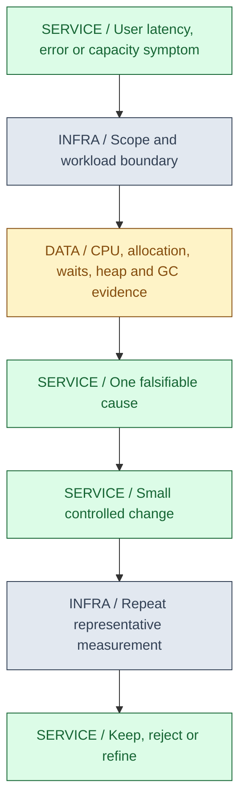
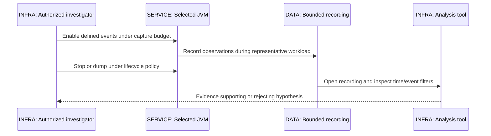
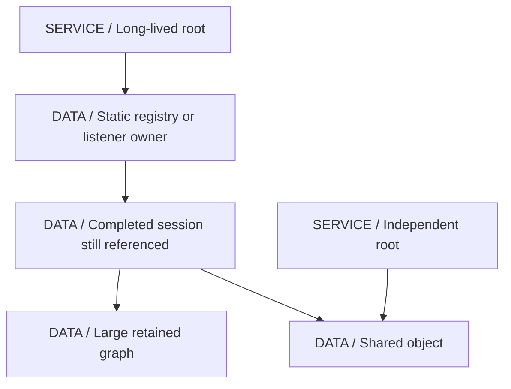
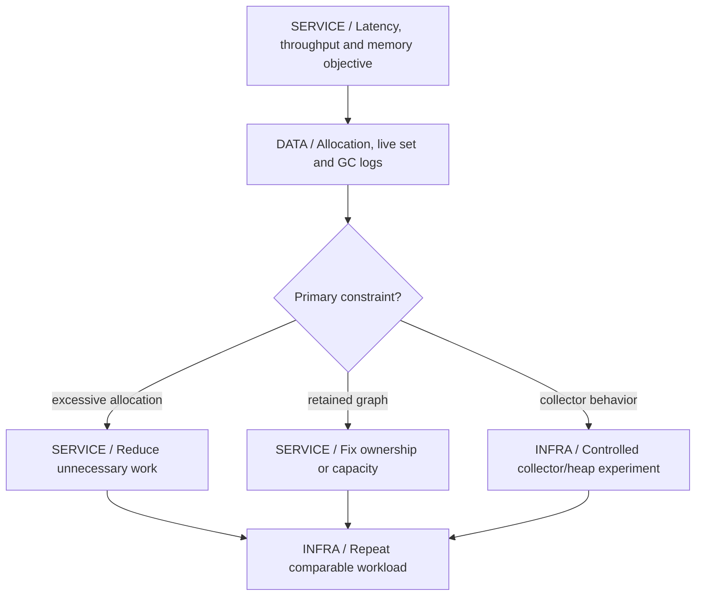
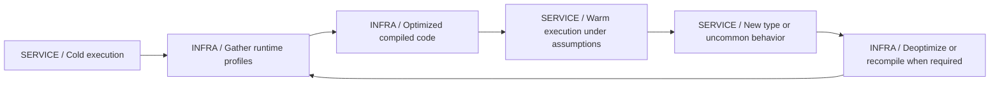

# 23 / JVM Performance Engineering

**Measure the constrained resource before changing the runtime.** A slow request can be waiting for a connection, blocked on a lock, throttled by its cgroup, allocating rapidly or executing expensive code. IntegrationHub is fictional. This chapter explains how to distinguish those cases without converting guesses into benchmark claims.

**Version assumptions:** Java 21 HotSpot-oriented examples, Spring Boot 4.0.x / Cloud 2025.1.x, PostgreSQL 17, Kafka 4.x and Kubernetes 1.34. Collector modes, container support, diagnostic events and flags can change in later JDKs. The optional benchmark pins JMH 1.37 and build plugins as unexecuted teaching inputs, not current-patch recommendations.

**Execution status:** NOT EXECUTED. The runner parsed the POM and found JFR/JMH sources, but no JDK compiler is available. No recording, profile, flame graph, heap dump, thread dump, GC log or benchmark result was generated. No existing process was attached to. Every workload amount in the fixture is an input choice, not a measured capacity result.

## Big Picture

## What You Will Be Able to Explain

- Select JFR/JMC, async-profiler, thread dumps and heap analysis for the question at hand.
- Read CPU versus allocation profiles and flame graphs without treating them as request timelines.
- Diagnose retained-memory growth, direct/native pressure, lock waits and collector behavior separately.
- Explain G1/ZGC choices, unified GC logging and container headroom under a pinned JDK.
- Explain warmup, tiered JIT, inlining, speculative optimization and deoptimization.
- Use JMH with parameters, state, warmup and forks while recognizing its scope limits.
- Size pools using consistent boundaries, occupancy and downstream limits rather than a universal formula.

> [!PRODUCTION]
> **Where this lives in IntegrationHub.** [18](18-operations.md#ch18-operations) identifies impact and operational evidence; this chapter deepens JVM interpretation. [02](02-concurrency.md#ch02-concurrency) owns task/lock contracts, [06](06-databases.md#ch06-databases) owns query and connection cost, [14](14-docker.md#ch14-docker)/[15](15-kubernetes.md#ch15-kubernetes) bound process resources, and [21](21-network-os.md#ch21-network-os) explains OS/socket waits. Optimization must preserve tenant, idempotency and transaction guarantees.

## 1. A Repeatable Investigation

Define the symptom precisely: p99 response latency under a named load, completion throughput, allocation rate, post-collection heap growth or CPU per operation. Capture workload shape, data sizes/skew, runtime flags, container limits, release/configuration identity and warm/cold state. Comparing two runs with different input or resource allocation cannot isolate a code change reliably.

Start with cheap discriminating observations. Low CPU with high latency suggests waiting or throttled/blocked progress rather than a pure compute hot loop, but inspect the relevant CPU denominator and cgroup throttling. High CPU can be application computation, garbage collection, serialization, retries or native code. A large heap alone is not proof of a leak.

Choose one hypothesis and one measurement capable of rejecting it. If query time dominates, a method microbenchmark may not improve the request. If the heap remains stable after collection but allocation is high, investigate churn rather than retained roots. Change one meaningful factor, rerun under comparable conditions, and inspect correctness plus resource trade-offs.

| Question | Use when | Avoid when |
|---|---|---|
| CPU profile | Runnable compute cost is suspected | Most elapsed time is waiting on a remote service |
| Allocation profile | Object creation/GC work is suspected | Retained-memory leaks are inferred from allocations alone |
| Thread/wait evidence | Locks, pools or blocking dominate | One sampled stack is called a complete timeline |
| Heap retained graph | Objects remain live unexpectedly | A dump is captured without privacy/disk/pause planning |

**Interview checks:** basic: latency is not CPU time. Internals: workload boundaries determine comparable evidence. Debug: distinguish waiting, computation and memory pressure. Scenario: optimize the measured contribution, not the most familiar method.

## 2. JFR and JMC

Java Flight Recorder records selected JVM/application events under a configuration. Events can include execution samples, allocations, locks, GC, threads and I/O depending on the runtime/settings. Java Mission Control is a tool for inspecting recordings and related diagnostics, not the source of all events itself. A recording's event configuration and time window determine which conclusions it can support.

JFR can run with bounded size/age policies, and custom events can describe meaningful application operations when carefully designed. Record only safe bounded attributes, not credentials or entire payloads. More events, stack traces and shorter intervals can increase overhead/storage, so low overhead is a property to verify for the chosen configuration rather than a universal promise.

For an existing process, diagnostic attachment needs the correct PID/namespace and permissions. Recording can contain sensitive paths, arguments, SQL-related context or application fields. Agree on output location, retention, access and capture duration. Do not run privileged attachment variations blindly when access is denied; use the approved operations path.

Correlate event time with the incident window, workload and release. Absence of a sampled stack does not prove absence of execution. A short recording can legitimately contain no GC or CPU samples for the question, especially when the workload ends quickly. Distinguish unavailable/disabled events from a measured zero.

**[VERIFY: verify JFR event names/defaults, sampling/stack settings, recording bounds, JMC compatibility and attach permissions for the selected JDK/OS. No JFR recording or JMC analysis ran locally.]**

**Interview checks:** basic: event configuration controls evidence. Internals: sampling and thresholds omit information. Debug: inspect the recording's actual event/time coverage. Scenario: capture under a privacy, disk and overhead budget.

## 3. async-profiler and Flame Graphs

async-profiler can collect selected CPU, allocation and other profiles under supported runtime/OS mechanisms. Native and Java stack visibility, permissions, kernel perf restrictions and profiling mode affect results. It is useful for questions that ordinary Java-only stack sampling may not fully explain, but it is not a universal zero-overhead truth source.

A flame graph aggregates stack weights. In a CPU sample graph, width commonly represents sampled on-CPU weight; in an allocation graph it may represent sampled allocated bytes or objects according to the mode. The horizontal axis is usually an arrangement of stacks, not chronological time. Depth represents call nesting, not directly request latency. Read the legend/units before making a claim.

Inclusive cost includes callees; self cost attributes work directly to the frame under the tool's model. A wide serialization frame may represent many ordinary calls rather than one slow call. A narrow but blocking operation can dominate user elapsed time while consuming little CPU. Compare CPU and wall-clock/wait evidence where supported and appropriate.

| Profile | Use when | Avoid when |
|---|---|---|
| CPU samples | Identify where execution consumes processor time | Off-CPU waits are expected to appear as wide CPU bars |
| Allocation samples | Locate high object/byte creation paths | Allocation volume is treated as retained heap size |
| Wall/wait-oriented evidence | Elapsed waiting and blocked work matter | Different sample units are compared as if identical |

**[VERIFY: confirm async-profiler release, supported event modes, native stack visibility, kernel permissions and interpretation of flame-graph units on the actual host. No profiler was installed, attached or executed.]**

**Interview checks:** basic: flame width depends on metric. Internals: inclusive and self cost differ. Debug: do not read stack layout as a timeline. Scenario: select CPU versus allocation/wait mode from the hypothesis.

## 4. Allocation Rate Versus Retained Memory

Allocation creates objects; retention keeps them reachable. A workload can allocate heavily and retain little, producing collection work without an ever-growing live set. Another workload can allocate modestly but retain references indefinitely, causing a slow leak. Comparing only heap used at an arbitrary instant conflates both.

Measure allocation sites and bytes/operation under representative traffic. Temporary DTOs, parsing buffers, boxing, string construction and repeated serialization can create churn. Some source-level allocations may be eliminated by JIT optimization, so counting new expressions is not a runtime allocation measurement. A cache that improves CPU can increase retained heap; evaluate the trade-off instead of assuming every reduced allocation is beneficial overall.

For suspected leaks, compare live-set trends after comparable collections or equivalent workload phases, not two random heap samples. A larger workload legitimately retains more state. Identify expected lifetime and ownership: who should release the object graph when a request, tenant session, subscription or class loader ends?

> [!MECHANISM]
> **GC reclaims unreachable memory, not obsolete business data.** A completed job still referenced by a static map remains live from the collector's perspective. Fix the reference/lifetime contract rather than asking the collector to recognize business completion.

**Interview checks:** basic: allocation and retention are different. Internals: reachability defines collection eligibility. Debug: compare live set under comparable workload. Scenario: inspect ownership of long-lived registries and callbacks.

## 5. Heap Dumps and MAT

A heap dump represents an object graph at a capture point under the tool's semantics. It can be large and sensitive. Collection/pause behavior and inclusion of unreachable objects depend on the capture option/runtime. Plan disk space, process impact, secure transfer and analysis access before capturing one from production.

MAT and similar tools provide histograms, dominator analysis and paths to GC roots. Shallow size counts an object's immediate storage; retained size concerns memory that remains dependent on its reachability under the graph analysis. A dominator lies on every root path to dominated objects. A large retained subtree is a clue to ownership, not automatically proof that the subtree is a leak.

Inspect root paths and expected lifecycle. Common patterns include unbounded caches, listeners never removed, ThreadLocal values on pooled threads, class-loader retention, accumulated futures/callbacks and unclosed resources retaining buffers. Weak or soft references are not universal fixes; they change reachability/reclamation semantics and may make cache behavior unpredictable without solving ownership.

Compare several captures or a controlled reproduction when possible. The biggest object can be legitimate, and the actual leak may be a small root retaining many graphs. Native/direct memory may not appear as ordinary payload bytes in the heap dump; a small Java wrapper can reference substantial external allocation.

**[VERIFY: confirm heap-dump capture semantics, pause/disk impact, MAT retained-size interpretation and sensitive-data handling for the actual JVM and environment. No heap dump or leak analysis was performed.]**

**Interview checks:** basic: shallow and retained size differ. Internals: root paths explain lifetime. Debug: a large graph is not necessarily a leak. Scenario: fix removal/closure and verify the retained graph disappears under comparable load.

## 6. Thread Dumps, Locks and Pool Waits

A thread dump samples execution states and stacks. RUNNABLE can include work in native calls under JVM reporting and does not automatically mean a busy CPU loop. WAITING or TIMED_WAITING can be healthy idle behavior. BLOCKED has a particular Java monitor meaning and is not a generic label for every resource wait. Lock ownership and thread names help trace contention, but compare with CPU and timing evidence.

Repeated dumps can show the same owner holding a lock while many callers wait, or a pool whose workers wait for child tasks queued to the same exhausted executor. Database acquisition waits point to query duration, leaks or admission pressure rather than necessarily a network connect failure. [02](02-concurrency.md#ch02-concurrency) owns those concurrency contracts.

Virtual-thread diagnostics differ across JDK/tool versions and can contain far more logical tasks than OS threads. Carrier pinning behavior also changed after Java 21 for some synchronization cases. Do not copy an old monitor-pinning conclusion into every later runtime. Resource limits still matter even when thousands of blocked tasks are cheap to represent.

**Interview checks:** basic: state is a sampled classification. Internals: monitor wait, pool wait and native I/O differ. Debug: correlate repeated stacks with CPU and ownership. Scenario: a larger executor can worsen downstream contention instead of resolving it.

## 7. G1, ZGC and Unified GC Logging

Collector selection trades pause behavior, CPU, throughput, memory footprint and available headroom. Start with application allocation/live-set evidence and current defaults rather than a bag of tuning flags. A pause target is generally a goal under the collector's control policy, not a hard real-time guarantee.

G1 organizes heap into regions, performs young evacuation and uses concurrent marking/mixed collection work to manage old regions under its design. Remembered-set/barrier work tracks references across relevant boundaries. Large objects and fragmentation can affect region use. Insufficient headroom or changing allocation patterns can trigger expensive recovery behavior; inspect logs rather than assuming every pause has the same cause.

ZGC moves much marking/relocation work concurrently using barriers and its object/reference representation. That can reduce pause exposure while requiring CPU and memory headroom for concurrent work. It does not eliminate all pauses, stop-world events or the effect of allocation outrunning collection. Java 21 offers generation-related choices that changed in later releases; pin the exact version before selecting flags.

Unified logging selects tags, levels, decorators and output rotation. GC and safepoint logs help separate heap-collection pauses from other stop events; choose bounded file size/count and safe locations. Useful flag concepts include explicit heap sizing, collector selection and unified-log configuration. Do not mix flags from incompatible JDK generations or infer that a process accepted a flag merely because it appears in a deployment template.

Compare allocation rate, pause distribution, concurrent CPU, full-cycle behavior, throughput and memory after the change. Reducing one pause percentile while exhausting CPU or increasing failure rate is not an unqualified improvement. Keep changes reversible and record actual effective flags with the result.

**[VERIFY: verify G1/ZGC mode availability and defaults, GC/safepoint log syntax, pause-target semantics and effective flags for the selected JDK. Java 21 and later ZGC generations differ; no collector comparison or GC-log experiment ran.]**

**Interview checks:** basic: collector choice is a trade-off. Internals: concurrent work still consumes resources. Debug: classify pauses and allocation/live-set behavior. Scenario: change one supported setting and remeasure correctness and the whole resource budget.

## 8. Container Awareness and MaxRAMPercentage

The JVM's view of processors/memory can be influenced by container limits and its implementation. MaxRAMPercentage participates in heap sizing under the relevant configuration; it is not a cap on total process memory and can interact with explicit heap flags. Native memory, direct buffers, stacks, metaspace, code cache and other charged resources need room beyond the heap.

CPU quota/throttling can delay request progress and concurrent GC even while host-wide CPU is not fully occupied. A pool sized from physical host cores may be inappropriate inside a constrained container if runtime detection/configuration differs. Memory-backed volumes and mapped/file cache accounting can also affect cgroup pressure.

A kernel OOM kill can prevent Java shutdown hooks and heap-dump-on-error paths from running. A JVM OutOfMemoryError may arise from heap, direct buffer, thread creation or other resource limits depending on the failure. Treat termination reason, effective limits and native/heap evidence as separate inputs. [15](15-kubernetes.md#ch15-kubernetes) covers platform diagnosis.

**[VERIFY: verify container processor/memory detection, MaxRAMPercentage and explicit heap interaction, native-memory visibility, virtual-thread diagnostics and pinning behavior against the actual JDK/cgroup version. No container or thread-memory experiment ran.]**

**Interview checks:** basic: heap percentage is not total RSS. Internals: throttling can change GC and request latency. Debug: inspect effective limits/flags, not only declared YAML. Scenario: reserve process headroom and verify under representative concurrency.

## 9. JIT, Warmup, Inlining and Deoptimization

HotSpot can start with interpreted execution, gather profiling information and compile hot code through tiers according to its configuration. Optimized code depends on observed behavior and compiler assumptions. Cold startup and warmed steady state are therefore different workloads; neither is inherently the only one that matters.

Inlining removes call boundaries and exposes further optimization opportunities. Escape analysis and related optimizations may eliminate some allocations/locking when semantics permit. Constant inputs, unused results and predictable state can let a microbenchmark measure optimized-away work. Conversely, forcing every operation through an artificial blackhole or interface can change the code path compared with production.

Speculative assumptions can become invalid as new types or paths appear, causing deoptimization and later recompilation. Code-cache pressure, class loading and uncommon paths can affect tail latency. Do not attribute every slow warmup interval to GC without compilation/class-loading evidence.

**Interview checks:** basic: Java performance changes with runtime history. Internals: inlining enables other optimizations. Debug: check compile/deopt activity as well as GC. Scenario: benchmark the startup or steady-state requirement you actually need.

## 10. JMH and Benchmark Pitfalls

JMH supplies a harness for controlled JVM microbenchmarks. It manages warmup, measurement iterations, forks and result consumption under its configuration. It cannot choose representative inputs, remove environmental noise or turn a local loop result into a distributed service throughput claim.

The saved SumBenchmark compares indexed iteration and a long stream over runtime-initialized arrays. @Param varies array size, @State(Scope.Thread) gives per-thread state, setup checks equivalent results, @Warmup/@Measurement define trial phases and @Fork separates JVM runs. Each benchmark returns its result so the harness consumes it. The reported unit would be nanoseconds per whole method invocation, not automatically per array element.

Warmup counts and trial duration in the fixture are teaching choices, not proof of stabilized production behavior. Separate forks help reduce cross-benchmark JVM-history effects, but hardware, OS load, CPU quotas, frequency/power state and data cache warmth still matter. Inspect run variance and confidence, not just a winning mean with misleading decimals.

Avoid timing a tiny operation with one manual nanoTime loop and reporting it as reliable. Measurement overhead, dead-code elimination, constant folding, batching, loop optimization and allocation elimination can dominate. Do not add a loop inside the benchmark solely to make numbers larger without understanding that it changes optimization and units.

| Benchmark decision | Use when | Avoid when |
|---|---|---|
| JMH local comparison | A CPU/allocation hypothesis has a representative isolated operation | The real bottleneck is network, locks or database I/O elsewhere |
| Parameterized runtime state | Different input sizes/shapes matter | One constant example is optimized into an unrepresentative path |
| Separate forks and enough warmup | JVM history must be controlled | One warmed method contaminates another comparison invisibly |
| End-to-end load test | System latency/throughput is the requirement | A microbenchmark result is extrapolated without the rest of the workload |

**[VERIFY: resolve JMH 1.37 and its annotation processor/shaded harness, verify benchmark discovery and run representative trials on an approved JDK/host. The fixture was not compiled or run; no benchmark ranking or timing is claimed.]**

**Interview checks:** basic: JMH is a harness, not a guarantee of representativeness. Internals: setup, forks and consumption affect optimization. Debug: verify discovery, units and variance. Scenario: use a microbenchmark only for the local contribution it actually measures.

## 11. Pool Sizing and Little's Law

Under stable conditions and a consistent boundary, mean occupancy equals throughput times mean residence time. This can inform expected in-flight work, but it does not directly determine a safe maximum thread or connection count. Tail distributions, bursts, queueing, CPU service demand and downstream saturation need separate evidence.

A connection pool is an admission/concurrency boundary for a finite database. Increasing it can increase contention rather than capacity. An executor with cheap virtual threads still needs bounded access to expensive resources. Separate how much work may wait from how much may actively use the dependency, and budget across all replicas rather than one process.

If response time rises with offered load while throughput plateaus, queueing near a bottleneck is a strong hypothesis. Lowering concurrency can sometimes improve throughput/latency by reducing contention, but measure the workload rather than treating that as a universal rule. Include recovery headroom so backlog can drain after failure.

> [!TRAP]
> **A formula cannot repair a mismatched boundary.** Using end-to-end latency with a database-only throughput count, or using p99 in a mean-value relation, produces an impressive-looking but unjustified pool size.

**Interview checks:** basic: mean occupancy is not a tail guarantee. Internals: active use and admitted waiters are separate. Debug: look for throughput plateaus and growing queues. Scenario: size all replicas against shared database/provider capacity.

## 12. Saved Fixtures and Safe Execution

`code/23-jvm-performance/ProfilingLab.java` records its own bounded synthetic workload through the JFR API. It retains only a small fixed number of byte arrays while allocating repeated replacements, then stops/dumps the recording and checks that a nonempty file exists. A nonempty JFR file can contain metadata without enough samples for a useful performance conclusion; the fixture is a recording-path smoke check, not a profile of a real service.

`code/23-jvm-performance/src/main/java/guide/performance/SumBenchmark.java` and pom.xml form a separate JMH project. The annotation processor generates harness metadata and the package step creates an executable benchmark jar. Dependencies and plugin versions are explicit, and Maven runs offline only.

Windows PowerShell from workspace root: `& './docs/java-fs-guide/code/23-jvm-performance/run.ps1'` attempts only the self-generated JFR fixture with an existing JDK. Add -Benchmark only when an existing Maven and approved cached dependencies are available. No command attaches to an existing user process; no tool or dependency download is attempted. Actual preflight: POM/source checks PASS, JFR and JMH NOT EXECUTED.

**[VERIFY: execute the self-generated JFR smoke fixture and optional offline JMH project with the approved toolchain, inspect recording event coverage and actual benchmark output, and record the environment before drawing performance conclusions. No recording, dump, profile or benchmark output exists from this session.]**

> [!DECISION]
> **Choose the least intrusive evidence that can reject the hypothesis.** Start with existing metrics and bounded recordings, then escalate to dumps or specialized profiles only with an impact/privacy plan. More data is not automatically a better diagnosis.

> [!INTERVIEW]
> **Close the loop:** symptom, workload, evidence, hypothesis, change, repeated measurement and trade-off. Naming JFR or ZGC without that loop is not performance engineering.

## Explained-Here Index and Sources

| Concepts | Explanation |
|---|---|
| JFR and JMC | [Recording and analysis](#ch23-jfr) |
| async-profiler, flame graph, CPU profiling | [Stack weights](#ch23-profiler) |
| Allocation profiling | [Churn versus retention](#ch23-allocation) |
| Heap dump, MAT, memory leak | [Retained graphs](#ch23-heap) |
| Thread dump | [Waits and ownership](#ch23-threads) |
| G1, ZGC and GC logging | [Collector workflow](#ch23-gc) |
| MaxRAMPercentage | [Container budget](#ch23-container) |
| JIT, warm-up, inlining, deoptimization | [Runtime optimization](#ch23-jit) |
| JMH | [Microbenchmark design](#ch23-jmh) |
| Little's law and pool sizing | [Boundary-consistent sizing](#ch23-sizing) |

Verification destinations: [JFR API](https://docs.oracle.com/en/java/javase/21/docs/api/jdk.jfr/jdk/jfr/package-summary.html), [JDK Mission Control](https://openjdk.org/projects/jmc/), [async-profiler](https://github.com/async-profiler/async-profiler), [Eclipse MAT](https://eclipse.dev/mat/), [JMH](https://github.com/openjdk/jmh) and [Java 21 GC tuning guide](https://docs.oracle.com/en/java/javase/21/gctuning/). These are owning references, not fresh runtime evidence.

## Related Chapters

Use [00](00-master-map.md#ch00-master-map), [01 JVM](01-java-jvm.md#ch01-java-jvm), [02 concurrency](02-concurrency.md#ch02-concurrency), [04 ORM](04-jpa.md#ch04-jpa), [06 database](06-databases.md#ch06-databases), [08 evidence privacy](08-security.md#ch08-security), [10 capacity](10-system-design.md#ch10-system-design), [14 containers](14-docker.md#ch14-docker), [15 resource limits](15-kubernetes.md#ch15-kubernetes), [18 operations](18-operations.md#ch18-operations), [19 testing](19-testing.md#ch19-testing), [21 OS](21-network-os.md#ch21-network-os) and [22 pauses/leases](22-distributed.md#ch22-distributed). Generated links are reciprocal.

## One-Page Cheat Sheet

**Workflow:** define user symptom, workload and runtime/resource identity. Measure the suspected boundary, make one falsifiable hypothesis, change one factor and repeat comparable validation.

**Evidence:** JFR event configuration controls coverage; JMC analyzes it. CPU profiles show CPU weights, allocation profiles creation, dumps retained graphs and thread samples waits/ownership. Flame width is metric weight, not chronological duration.

**Memory/GC:** allocation churn is not a leak. Find roots and expected lifetime. G1/ZGC trade pause/CPU/memory/throughput; targets are not hard guarantees. Process memory exceeds heap and kernel kills can bypass Java cleanup.

**JIT/JMH:** warmup and speculative optimization matter. Use representative runtime state, forks and correct consumption/units. A local benchmark does not prove service throughput. Do not invent results for unexecuted code.

**Sizing:** Little's law uses consistent mean quantities; pool limits still face bursts and shared bottlenecks. Cheap threads do not expand database capacity. JFR/JMH sources are supplied, but compilation, recordings and benchmarks remain NOT EXECUTED.

## Interview Corner

### Basic: CPU Profile Versus Allocation Profile?

One attributes sampled execution cost, the other object/byte creation under its event model. Neither alone proves retained-memory growth or end-to-end latency.

### Internals: What Does a Wide Flame-Graph Frame Mean?

A large aggregate weight in the selected metric, often inclusive of callees. It is not necessarily one slow invocation or a chronological interval.

### Trace/Debug: Heap Grows Between Collections but Then Falls.

That can be allocation churn rather than a leak. Compare retained live set under comparable workload and collection phases before diagnosing lost ownership.

### Scenario: How Would You Capture Production Evidence Safely?

Select an approved process and bounded event/time/size configuration, assess overhead and privacy, choose secure storage and record the workload/revision. Escalate only when the current evidence cannot distinguish causes.

### Basic: Shallow Versus Retained Size?

Immediate object storage versus the graph whose liveness depends on it under retained-size analysis. Root paths and expected lifetime determine whether the retained graph is wrong.

### Internals: Why Can JIT Eliminate Benchmark Work?

Unused results, constant inputs and provably nonescaping allocations can be optimized away. Use a proper harness and representative state while understanding that the harness cannot choose a realistic workload for you.

### Trace/Debug: Low Heap but OOMKilled.

Inspect total cgroup memory, native/direct allocation, stacks and other charged resources, plus the termination reason. JVM heap is only part of process/container memory.

### Scenario: Would You Switch Collectors First?

Only if evidence identifies collector behavior as the relevant constraint. Allocation, retention, blocked work or throttling may be the root cause; measure trade-offs with one controlled change.

### Basic: Warmup Versus Measurement?

Warmup exercises runtime compilation/profile behavior before recorded trials; measurement observes the selected phase. Both need durations appropriate to the actual benchmark, not blindly copied counts.

### Internals: Why Use Separate JMH Forks?

They help separate JVM histories and reveal run variation. They do not remove hardware noise, bad input design or incorrect interpretation of units.

### Trace/Debug: More Connections Made the Database Slower.

The server may already be saturated; extra concurrency adds contention and queueing. Inspect query cost, locks, active work and aggregate pools across replicas.

### Scenario: What Can the Saved Fixture Prove Today?

Only that its source and POM passed local presence/XML checks. Without a JDK, no compilation or recording ran. A future smoke PASS still would not establish a production performance conclusion.