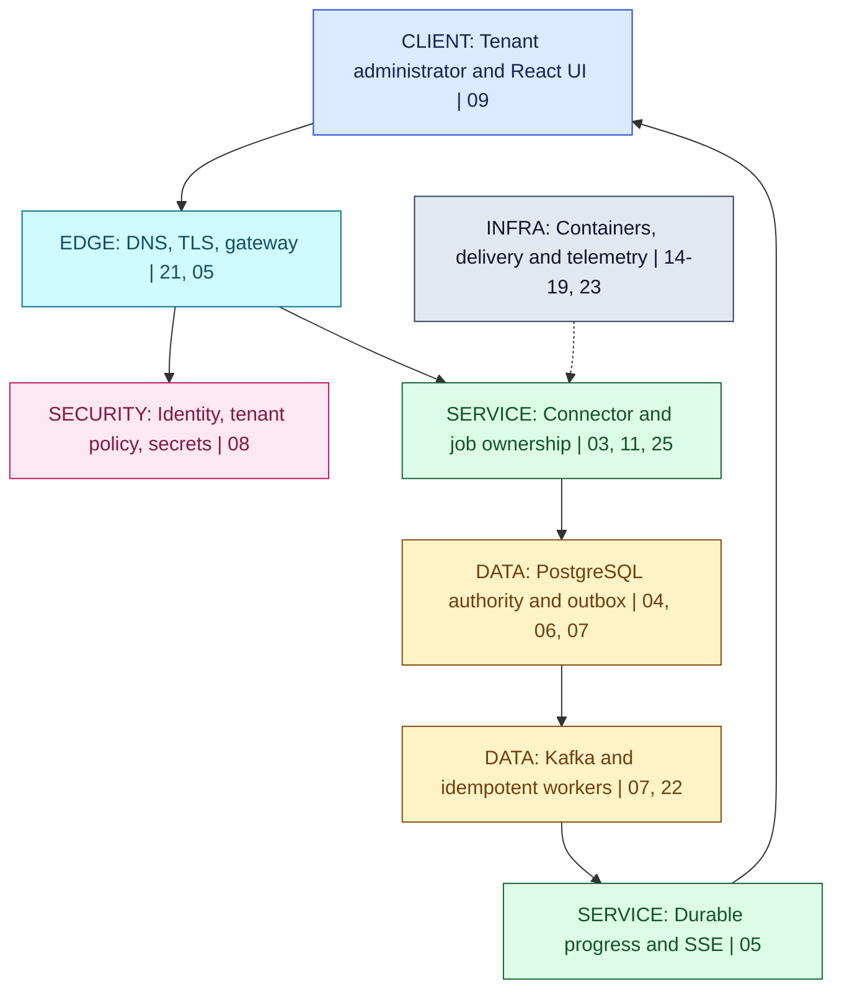
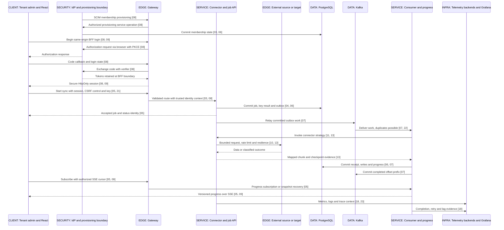
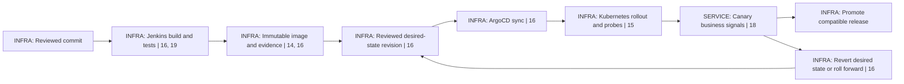
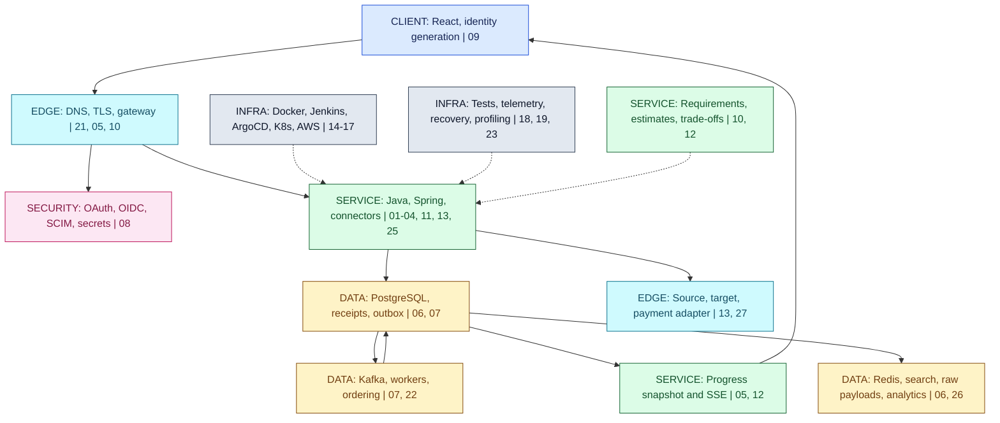

# 24 / IntegrationHub in Motion

**This is Part A: one connected system, not another theory chapter.** IntegrationHub is the fictional multi-tenant platform used throughout the guide. Follow one accepted job from identity to durable state, delivery, live progress and operations. Each stop points back to the chapter that explains its mechanism.

**Version assumptions:** reuse the guide's Java 21, Spring, PostgreSQL 17, Kafka 4.x and Kubernetes assumptions with their original verification markers. This chapter introduces no new compatibility claim. **Execution status:** the story is a design walkthrough, NOT EXECUTED as an integrated application. Chapter-level models are not an end-to-end deployment. Part B, `integrationhub-lite`, is not built without an explicit `lite` request.

## Big Picture

## What You Will Be Able to Explain

- Narrate one accepted sync without confusing login, authorization, commit, delivery and completion.
- Connect a deployment to probes, business evidence and rollback compatibility.
- Walk from a production symptom to evidence, the responsible boundary and a repair.
- Explain what could saturate at 10x traffic under explicit assumptions.
- Describe refresh-token reuse containment without promising immediate JWT revocation.
- Draw the whole system and explain it in approximately five minutes.

> [!PRODUCTION]
> **Where this lives in IntegrationHub.** This is the whole fictional system from [00](00-master-map.md#ch00-master-map). The diagrams show responsibilities, not a claim that every box must be a separately deployed microservice. Architecture ownership comes from [25](25-architecture.md#ch25-architecture); [20](20-toolkit.md#ch20-toolkit) supplies revision routes and the final index.

## 1. A Day in the Life

**Onboard:** an authorized enterprise provisioning client creates or changes membership through SCIM. SCIM does not log the user in. An invitation, tenant membership and permission to configure a particular connector remain separate checks. See [08 identity and provisioning](08-security.md#ch08-security).

**Log in:** React starts the selected Authorization Code + PKCE flow through the same-origin gateway/BFF. The BFF validates the login transaction, exchanges the code and retains tokens; the browser receives a secure HttpOnly session. State-changing cookie requests need CSRF protection, and SSE does not put bearer tokens in URLs. Downstream APIs still validate authority and resource ownership. PKCE protects the code exchange, not every later use of a stolen token. UI state belongs to the active identity generation so an old request cannot populate a new tenant's screen. See [09 browser state](09-frontend.md#ch09-frontend).

**Accept:** DNS, TCP/TLS and the edge get the request to the gateway ([21](21-network-os.md#ch21-network-os)). The gateway routes and applies its controls; the service still authorizes the requested tenant resource. A local transaction commits the job, bound idempotency result and outbox. The response means accepted, not completed. The exact transaction and entity mechanics live in [03](03-spring.md#ch03-spring), [04](04-jpa.md#ch04-jpa) and [06](06-databases.md#ch06-databases).

**Execute:** committed work reaches Kafka through the outbox relay. A worker uses the connector strategy with tenant-aware rate limits, time budgets, backoff and circuit-breaker policy. A timeout can leave an external effect unknown; the connector contract determines how to recover it. Chunk writes, duplicate receipt and checkpoint progression follow [07](07-messaging.md#ch07-messaging) and [13](13-integration.md#ch13-integration). Payments need the stricter reconciliation treatment in [27](27-payments.md#ch27-payments).

**Observe:** durable progress backs live SSE. A reconnect either replays retained events or fetches a versioned snapshot before resuming. React ignores obsolete generations and versions. A slow browser does not block shared workers. Metrics, traces and logs reach appropriate backends; Grafana queries them rather than being assumed to store every signal itself. See [05](05-apis-realtime.md#ch05-apis-realtime), [09](09-frontend.md#ch09-frontend) and [18](18-operations.md#ch18-operations).

> [!MECHANISM]
> **There are several acknowledgements.** API acceptance follows the job commit. Broker acknowledgement concerns delivery storage. Consumer completion follows the relevant effect commit. SSE delivery only tells a client what it observed. None is a substitute for the others.

## 2. The Deploy Story

Jenkins checks the reviewed source, runs the appropriate tests, and produces a versioned artifact and image. Evidence binds to the image digest; it does not apply to whichever mutable tag is current tomorrow. A reviewed configuration change selects that digest. ArgoCD reconciles declared state; Kubernetes creates and replaces Pods. These boundaries are explained in [14](14-docker.md#ch14-docker), [16](16-delivery.md#ch16-delivery) and [19](19-testing.md#ch19-testing).

Startup, readiness and liveness checks answer different questions. A ready process can still double-publish, reject tenants or make slow queries. A rolling release therefore needs business signals and compatible schema. For a weighted canary, explicitly supply the rollout or routing mechanism; a plain Deployment is not assumed to provide percentage traffic control. See [15](15-kubernetes.md#ch15-kubernetes) and [18](18-operations.md#ch18-operations).

Rollback changes desired state back to a known compatible artifact, not just an imperative Pod mutation that GitOps will overwrite. If new code wrote a schema the old code cannot read, rolling forward or restoring compatible behavior may be necessary. Expand/contract migrations keep both versions viable through the overlap. **[VERIFY: validate the actual Jenkins, ArgoCD, rollout-controller/routing, Kubernetes probe and schema-compatibility configuration before performing this deployment story. No integrated build, rollout, canary or rollback was executed.]**

## 3. Five Failure Stories

### Downstream Timeout and Circuit Breaker

**Symptom:** sync jobs stay active while retries increase. **Detect:** per-provider timeout counts, queue age and traces show where time is spent. **Root-cause path:** follow one attempt through DNS/connect/read timing and provider evidence; distinguish overload from expired credentials or bad mapping. **Fix:** bound retries and concurrency, respect rate limits, stop new work through the breaker where appropriate, and reconcile ambiguous external writes before retrying. **Chapters involved:** [10 resilience](10-system-design.md#ch10-system-design), [13 connector recovery](13-integration.md#ch13-integration), [18 signals](18-operations.md#ch18-operations), [21 network timing](21-network-os.md#ch21-network-os).

### Duplicate Request and Idempotency

**Symptom:** a user double-clicks or retries after losing a response. **Detect:** correlate logical key, tenant, content fingerprint and job ID; transport request IDs may differ. **Root-cause path:** verify the unique key and job commit share a transaction, and that key expiry did not silently permit new work. **Fix:** replay the stored accepted result for identical content, reject changed content, and repair existing duplicates through an explicit domain workflow. **Chapters involved:** [05 request identity](05-apis-realtime.md#ch05-apis-realtime), [06 transaction constraints](06-databases.md#ch06-databases), [07 duplicate effects](07-messaging.md#ch07-messaging).

### Pod OOMKilled

**Symptom:** a worker disappears and Kubernetes reports OOMKilled. **Detect:** termination evidence, container memory, restart counts, native/direct usage and workload size. **Root-cause path:** compare process memory with container budget; distinguish heap retention, direct buffers, thread stacks and a large in-flight batch. **Fix:** cap admission and batch size, correct retention or resource configuration, replay from the committed checkpoint, and profile an authorized representative workload. Increasing heap alone can reduce native headroom. **Chapters involved:** [14 cgroups](14-docker.md#ch14-docker), [15 resource troubleshooting](15-kubernetes.md#ch15-kubernetes), [23 JVM evidence](23-jvm-performance.md#ch23-jvm-performance), [07 restart](07-messaging.md#ch07-messaging).

### Kafka Consumer Lag

**Symptom:** API acceptance is fast but completion falls behind. **Detect:** lag by partition, oldest work age, worker error rate and sink latency. **Root-cause path:** inspect hot keys, slow database calls, poison input, rebalance churn and retry loops before adding consumers. **Fix:** remove the bottleneck, quarantine under policy, adjust partition/worker capacity only where ordering permits, and scale within sink limits. Preserve the completed offset prefix. **Chapters involved:** [07 ordering](07-messaging.md#ch07-messaging), [06 pooling](06-databases.md#ch06-databases), [18 capacity](18-operations.md#ch18-operations), [22 partitioning](22-distributed.md#ch22-distributed).

### Schema Migration Mismatch across Regions

**Symptom:** one region rejects writes or cannot decode new events. **Detect:** schema versions, migration history, deploy revision and region-labeled errors. **Root-cause path:** compare actual database and application compatibility, event schemas and traffic routing; do not assume a successful migration job ran everywhere. **Fix:** stop the incompatible rollout, restore a compatible route or code path, apply the approved additive change, reconcile partial work, and delay destructive contraction until every consumer is ready. **Chapters involved:** [06 expand/contract](06-databases.md#ch06-databases), [16 rollback](16-delivery.md#ch16-delivery), [17 regional boundaries](17-cloud.md#ch17-cloud), [22 failure models](22-distributed.md#ch22-distributed).

> [!TRAP]
> **Restarting is not the root-cause explanation.** For every story, identify the violated budget or contract and the durable recovery point. A restart can restore service while leaving duplicate work, lost evidence or the same saturation trigger intact.

## 4. The 10x Traffic Story

This ordering is conditional, not a measured forecast. Assume the database and provider budgets stay fixed, average job size stays similar, and external calls already dominate service time. Ten times the request rate does not create ten times the downstream capacity.

**First: admission and provider concurrency.** Requests accumulate faster than the provider permits. Bound per-tenant accepted work and active calls, return an explicit overload policy, and prioritize existing work. Queue depth without an age budget only delays the failure. Use [10](10-system-design.md#ch10-system-design) and [02](02-concurrency.md#ch02-concurrency).

**Second: database and consumer throughput.** More workers reach the same connection pool, hot rows and I/O budget. Measure transaction duration, pool waits, query plans and partition skew; tune access and batching before raising connection counts. Add workers only when the sink has capacity. Use [06](06-databases.md#ch06-databases), [07](07-messaging.md#ch07-messaging) and [23](23-jvm-performance.md#ch23-jvm-performance).

**Third: progress fan-out and telemetry.** More jobs and browsers amplify SSE updates and high-cardinality labels. Coalesce allowed progress states, bound per-client buffers, preserve snapshot recovery and reduce unbounded label dimensions. Analytical reporting can lag under its own contract. Use [05](05-apis-realtime.md#ch05-apis-realtime), [18](18-operations.md#ch18-operations) and [26](26-data-platform.md#ch26-data-platform).

> [!DECISION]
> **Scale the limiting resource, not the most visible box.** If the bottleneck is provider quota, more Pods increase retries. If it is one hot key, more Kafka consumers do not split its ordered stream. If it is one query, more connections can worsen contention. Revise the order above when measured evidence contradicts its assumptions.

## 5. Stolen or Reused Refresh Token

With a rotation-and-reuse-detection policy, a successful refresh replaces the old credential in a tracked token family. Later use of an invalidated old credential can signal theft or a client race. Record the event without logging tokens, preserve relevant session/client context, and apply the issuer's family revocation and reauthentication policy. Contain exposed sessions and investigate access already granted; do not assume revoking a refresh token instantly invalidates every issued JWT.

Already-issued access tokens remain subject to resource-server validation and revocation strategy. Depending on the design, containment can include short remaining lifetime, session/version checks, introspection or deny controls, alongside credential cleanup and user notification. UI logout clears active state and subscriptions but does not undo external effects. See [08](08-security.md#ch08-security) and [09](09-frontend.md#ch09-frontend).

**[VERIFY: verify the selected issuer's refresh rotation, reuse detection, concurrent refresh handling, family revocation and access-token containment behavior against current OAuth security guidance and provider configuration. This security story was not exercised against an identity provider.]**

## 6. Whole System on a Whiteboard

This compact poster groups auxiliary stores for legibility. Redis is a cache or coordination tool under explicit contracts, Elasticsearch is a derived search view, and MongoDB can retain selected raw payloads under access and retention policy. None replaces the job authority merely by appearing in the same box.

## 7. Five-Minute Spoken Script

**0:00-1:00 / Goal and boundaries.** “IntegrationHub is a fictional multi-tenant integration platform. A tenant configures a connector and starts a bulk sync from a React UI. My first concern is ownership: the authenticated user must belong to the tenant and be authorized for that connector. SCIM manages membership; OAuth and OIDC support login and API access. Those are different responsibilities. DNS, TLS and the gateway deliver the request, but service-level authorization remains mandatory. I would begin with clear modules and extract services only when independent deployment, scaling or failure isolation justifies the cost.”

**1:00-2:00 / Acceptance and durable work.** “Starting a sync carries an idempotency key bound to the intent. In one PostgreSQL transaction the service stores the job, its accepted result and an outbox record. Only then do I return acceptance. This is not a promise that the sync has completed. A relay sends committed work to Kafka. If it crashes after publishing but before recording progress, it can publish again; the consumer therefore needs duplicate-safe effects. The important unit is the business identity and transaction boundary, not an assumption that the transport delivers once.”

**2:00-3:00 / Execution and progress.** “A worker invokes the selected connector strategy with bounded concurrency, rate limits and a time budget. Retries use classified errors, backoff and jitter; a circuit breaker prevents continued submissions into a failing dependency. An ambiguous external write is recovered rather than assumed to have failed. Mapped chunks, receipts and durable progress are committed before advancing the relevant checkpoint. The UI subscribes over SSE and can recover from a retained cursor or a versioned snapshot. Slow clients have bounded buffers and cannot hold up shared processing.”

**3:00-4:00 / Delivery and diagnosis.** “Jenkins builds and tests a reviewed revision, produces an immutable image and binds evidence to it. A reviewed desired-state change lets ArgoCD reconcile Kubernetes. Probes manage process startup, routing and restarts, but I also watch completion latency, errors and lag before promotion. Rollback requires compatibility with current data, so migrations expand first and contract later. In an incident I follow one request and job identity through traces, logs and metrics, compare demand with resource budgets, and preserve evidence before changing capacity.”

**4:00-5:00 / Trade-offs and recovery.** “At higher traffic, the first bottleneck depends on measured service time and downstream limits. More Pods cannot overcome a fixed provider quota or a serialized account. I separate authoritative state from caches, search and analytics, and state how stale each view may be. Payment integrations need balanced journals, stable provider identity and independent reconciliation because a timeout is not a financial result. My final checks are tenant isolation, duplicate and crash recovery, restore evidence and operational ownership. The diagrams are a proposed design; I distinguish local model tests from an actually deployed end-to-end system.”

The timing is an approximate rehearsal allocation, not a measured speaking result. Adjust pacing instead of skipping the commit and unknown-outcome boundaries.

## 8. Technology Poster

| Technology or concept | Problem it solves | Chapter |
|---|---|---|
| Java, collections, JVM and concurrency | Implement and schedule bounded application work | [01](01-java-jvm.md#ch01-java-jvm), [02](02-concurrency.md#ch02-concurrency) |
| Spring Boot, MVC, proxies and transactions | Wire the service and define request and transaction interception | [03](03-spring.md#ch03-spring) |
| Hibernate and JPA | Map object state to persistence operations deliberately | [04](04-jpa.md#ch04-jpa) |
| REST, OpenAPI and SSE | Publish contracts and recoverable live progress | [05](05-apis-realtime.md#ch05-apis-realtime) |
| PostgreSQL and Liquibase | Durable state, constraints and compatible schema evolution | [06](06-databases.md#ch06-databases) |
| Redis, Elasticsearch and MongoDB | Explicit cache, search and raw-data roles | [06](06-databases.md#ch06-databases) |
| Kafka, outbox and Spring Batch | Decouple work while preserving recovery identities | [07](07-messaging.md#ch07-messaging) |
| OAuth, OIDC, PKCE, SCIM, TLS and secret management | Establish identity, provision membership and protect data | [08](08-security.md#ch08-security) |
| React and browser request generations | Keep the visible state attached to the current user and tenant | [09](09-frontend.md#ch09-frontend) |
| Resilience4j and capacity budgets | Bound retries, calls and failure propagation | [10](10-system-design.md#ch10-system-design) |
| Strategy, Adapter, state and design method | Turn requirements into testable component and system boundaries | [11](11-lld.md#ch11-lld), [12](12-hld.md#ch12-hld) |
| IICS, MuleSoft, Anaplan and connector contracts | Integrate external systems with mapping and restart rules | [13](13-integration.md#ch13-integration) |
| Docker and Kubernetes | Package workloads and reconcile resource-constrained execution | [14](14-docker.md#ch14-docker), [15](15-kubernetes.md#ch15-kubernetes) |
| Jenkins, ArgoCD, Harness and feature flags | Build evidence and control promotion and exposure | [16](16-delivery.md#ch16-delivery) |
| AWS and Terraform | Define infrastructure, identity and recovery responsibilities | [17](17-cloud.md#ch17-cloud) |
| OpenTelemetry, Prometheus, Grafana and Loki | Relate user outcomes to metrics, traces and logs | [18](18-operations.md#ch18-operations) |
| JUnit, Mockito, Testcontainers and Playwright | Test progressively wider contracts and user journeys | [19](19-testing.md#ch19-testing) |
| DNS, TCP, Linux and event loops | Explain transport, resource limits and waiting | [21](21-network-os.md#ch21-network-os) |
| Consensus, fencing and consistency models | State distributed guarantees and failure assumptions | [22](22-distributed.md#ch22-distributed) |
| JFR, profilers and JMH | Investigate JVM cost with scoped evidence | [23](23-jvm-performance.md#ch23-jvm-performance) |
| Bounded contexts, ports and ADRs | Preserve ownership and reasons for decisions | [25](25-architecture.md#ch25-architecture) |
| CDC, facts, dimensions and lineage | Publish trustworthy analytical views | [26](26-data-platform.md#ch26-data-platform) |
| Journal, payment identity and reconciliation | Preserve financial intent and resolve external evidence | [27](27-payments.md#ch27-payments) |

> [!INTERVIEW]
> **Draw less, explain the boundaries.** Choose one user action, name its authoritative commit, show where duplication can happen, and explain how an operator proves completion. Add a technology only when it solves a stated problem.

## Concepts Explained Here

The [day in the life](#ch24-day), [deploy story](#ch24-deploy), [failure stories](#ch24-failures), [10x traffic](#ch24-scale), [security story](#ch24-security), [system whiteboard](#ch24-whiteboard), [spoken script](#ch24-script) and [technology poster](#ch24-poster) connect earlier explanations rather than introduce new theory.

## Related Chapters

Start at [00](00-master-map.md#ch00-master-map); the journey and poster above link every technical chapter. Finish with [20 toolkit and index](20-toolkit.md#ch20-toolkit). The build generates reciprocal links so any chapter can return to this synthesis.

## One-Page Cheat Sheet

**Journey:** provision, authenticate, authorize, commit job and outbox, deliver, deduplicate, execute, commit progress, replay to the UI.

**Deploy:** reviewed source, tested artifact, immutable image, desired-state change, reconciliation, probes, business signals, compatible rollback.

**Failure:** symptom, evidence, violated boundary, bounded repair, durable recovery point. A timeout is not failure proof; a restart is not an explanation.

**Scale:** name assumptions and measured bottlenecks. Admission, external quotas, database limits and progress fan-out have different controls.

**Security:** detect credential reuse, contain the token family under issuer policy, address already-issued access, clear client state and preserve audit evidence.

**Whiteboard:** identity, edge, service, durable state, transport, external effects, progress, delivery and operations. Part A is a design synthesis; Part B is not built.

## Interview Corner

### Basic: Explain the System in One Minute.

An authorized tenant starts a sync; a durable job and outbox record establish acceptance; duplicate-tolerant workers perform bounded connector work; committed progress reaches a recoverable UI stream; delivery and observability protect that flow.

### Internals: Where Is the Most Important Boundary?

The answer depends on the question. For acceptance it is the database commit; for external effects it is the provider's accepted operation; for tenant safety it is resource authorization. State which guarantee you mean.

### Trace/Debug: The UI Says Running Forever.

Check durable job state, worker and provider progress, consumer lag, SSE cursor retention and UI generation. Do not assume a stale stream means unfinished durable work.

### Scenario: Roll Back a Bad Release.

Stop promotion, preserve evidence, verify old-code compatibility with current data, change desired state or roll forward safely, and validate user outcomes after controller convergence.

### Scenario: What Changes at 10x?

Recalculate budgets from demand and service time, identify the first saturated resource, and test the proposed change. Ten times the Pods is not a capacity model.

### Scenario: What Has Actually Been Proven Here?

Chapter-specific local models and publication checks have their recorded evidence. This connected application, its deployment and its failure drills were not executed. The distinction is part of a credible design explanation.