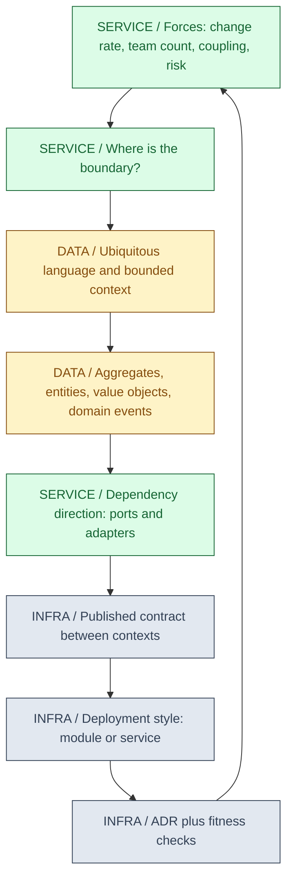
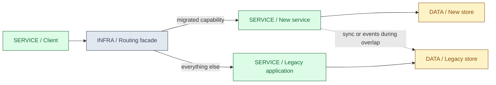
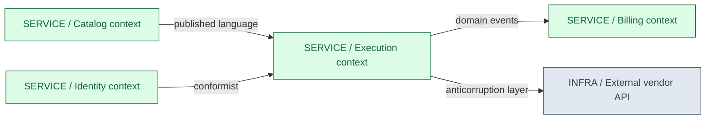
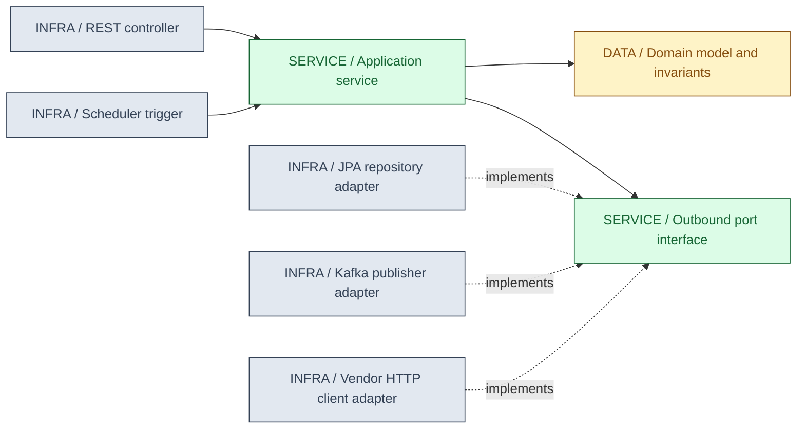

<a id="ch25-architecture"></a>
# 25 / Architecture Styles and Domain Design

**Architecture is the set of decisions that are expensive to reverse.** Choosing a deployment style, drawing a boundary around a model, and deciding which direction dependencies point will outlive most of the code written inside them. IntegrationHub is fictional. This chapter explains how to argue those decisions from forces that can be checked, instead of from a preferred diagram shape.

**Version assumptions:** Java 21, Spring Boot 4.0.x / Cloud 2025.1.x, PostgreSQL 17 and Kafka 4.x, matching the rest of the guide. Package layouts, build-time enforcement tooling and specification versions change independently of this text, so treat every named tool version as a verification target rather than a fixed fact.

**Execution status:** the model in `code/25-architecture/ArchitectureLab.mjs` ran and PASSED five checks on the existing Node runtime. Java and Spring shapes in this chapter are structural illustrations and are NOT EXECUTED: no JDK, Maven or Gradle is available here, so no compilation, no build-time architecture rule and no running application was produced. No organizational claim in this chapter was measured.

## Big Picture



## What You Will Be Able to Explain

- State the forces that favor a monolith, a modular monolith or separate services, and the costs each one adds.
- Migrate a running system incrementally with a strangler-fig approach instead of a rewrite.
- Find bounded contexts from language and change patterns, then map the relationships between them.
- Design aggregates that own an invariant, and separate entities from value objects deliberately.
- Publish domain events without turning them into a hidden synchronous call chain.
- Map hexagonal and clean architecture onto a concrete Spring package structure with an enforceable dependency rule.
- Run API-first and contract-first work so consumers are not blocked and breaking changes are visible.
- Write an ADR that records forces and consequences, and manage technical debt as a tracked decision rather than a complaint.

> [!PRODUCTION]
> **Where this lives in IntegrationHub.** This chapter sets the boundaries that the rest of the guide fills in. [10](10-system-design.md#ch10-system-design) sizes and shapes the system, [11](11-lld.md#ch11-lld) designs the classes inside a boundary, [12](12-hld.md#ch12-hld) applies both to case studies, [03](03-spring.md#ch03-spring) wires the chosen structure, [05](05-apis-realtime.md#ch05-apis-realtime) publishes the contract, [07](07-messaging.md#ch07-messaging) carries events across boundaries and [22](22-distributed.md#ch22-distributed) explains what distribution costs.

<a id="ch25-styles"></a>
## 1. Monolith, Modular Monolith and Microservices

A **monolith** is one deployable unit containing the whole application. Internal calls are in-process method calls, one transaction can span multiple features, and one build and release covers everything. Nothing about a monolith requires bad structure; the common failure is that nothing stops any class from reaching any other class, so boundaries erode silently over years.

A **modular monolith** keeps the single deployable unit but makes modules explicit: each module owns its data and its public API, and cross-module access goes through that API rather than through another module's internals. The enforcement has to be mechanical, because convention alone does not survive deadlines. Java tooling for this includes the module system, build-module separation, package-private visibility and build-time dependency rules [VERIFY: current ArchUnit and Spring Modulith capabilities and versions at https://www.archunit.org/ and https://spring.io/projects/spring-modulith].

**Microservices** split the system into independently deployable services with explicit data ownership. The potential gains are independent deployment, scaling and failure isolation, provided contracts and resource boundaries support them. Calls crossing a new service boundary become remote operations that can be slow, duplicated or lost; internal method calls remain local. A local transaction no longer spans independently owned stores. Those costs belong to [22](22-distributed.md#ch22-distributed).

> [!MECHANISM]
> **A service boundary converts a compiler error into a runtime failure.** Inside one deployable unit, an incompatible change to a method signature fails the build. Across a service boundary, the same change compiles on both sides and fails in production when an old consumer sends an old payload. That is the single most important mechanical difference between the styles, and it is why contract testing ([19](19-testing.md#ch19-testing)) and versioning ([05](05-apis-realtime.md#ch05-apis-realtime)) become mandatory rather than optional once you split.

| Style | Use when | Avoid when |
|---|---|---|
| Monolith | One small team, unclear domain boundaries, early product, strong need for simple transactions | Many teams block each other on one release train, or one feature's load forces the whole app to scale |
| Modular monolith | Boundaries are becoming clear but deployment independence is not yet needed, and operational budget is limited | Modules genuinely need different runtimes, scaling profiles or release cadences, and the team will not enforce module rules |
| Microservices | Independent deployment, independent scaling or failure isolation is a real and current requirement, and platform/observability investment exists | Boundaries are still being discovered, the team is small, or distributed transactions would be introduced for a single workflow |

<a id="ch25-decision"></a>
## 2. Deciding, and the Costs People Forget

Decide from forces, not from fashion. The useful questions are: how many teams need to release without coordinating, which parts change at different rates, which parts have different availability or scaling requirements, where does a failure need to stay contained, and what is the blast radius of a bad deploy. If the honest answer to all of these is "one team, similar rates, same requirements", a well-structured single deployable unit is the cheaper correct answer.

The costs that get omitted from the optimistic version are operational. Every service needs its own pipeline, image, configuration, secrets, dashboards, alerts, on-call ownership and data store lifecycle. Cross-service debugging needs distributed tracing ([18](18-operations.md#ch18-operations)). Cross-service consistency needs sagas or outbox patterns ([07](07-messaging.md#ch07-messaging)) because a single database transaction no longer covers the workflow. None of that is impossible; it simply has to be budgeted as part of the decision instead of discovered afterward.

A common anti-pattern deserves a name: the **distributed monolith**, where services are deployed separately but must be released together because their contracts are coupled, they share a database, or a single user request fans out through a synchronous chain where any failure fails the whole request. It pays the full cost of distribution and collects none of the independence benefit. The diagnostic question is simple: can you deploy one of these services, alone, on a Friday, without coordinating with another team?

> [!TRAP]
> **"We will split it later" and "we will fix the boundaries later" are different promises.** Splitting a well-modularized system is mechanical work. Splitting a system whose modules share tables, share mutable entities and call each other's internals is a rewrite, because you must first discover the boundary that was never written down. The boundary work is the hard part, and it is equally valuable inside a single deployable unit — which is why a modular monolith is a legitimate destination, not only a waypoint.

**Interview checks:** basic: name the real forces, not team preference. Internals: explain what the compiler stops enforcing after a split. Debug: identify a distributed monolith from its release coupling. Scenario: propose the cheapest structure that satisfies the stated requirement.

<a id="ch25-strangler"></a>
## 3. Strangler-Fig Migration

A rewrite freezes delivery, invites scope drift and produces one enormous cutover risk. The strangler-fig approach instead routes traffic through a facade, moves one capability at a time behind that facade, and lets the old system shrink until it can be removed [VERIFY: original formulation and current guidance at https://martinfowler.com/bliki/StranglerFigApplication.html].



The sequence that works: put the facade in first and prove it is transparent; pick a capability with a clear boundary and real value; move reads before writes where possible; run the new path in parallel and compare outputs before trusting it; shift traffic incrementally with a fast rollback; then delete the old path and its data. The deletion step is the one most often skipped, and skipping it leaves you permanently paying for two systems.

Data is the hard part, not routing. During the overlap window, two stores can hold the same facts. Pick one writer per fact at any moment and synchronize in one direction, using change data capture or events ([07](07-messaging.md#ch07-messaging), [26](26-data-platform.md#ch26-data-platform)). Bidirectional synchronization creates conflicts that you then have to resolve with rules nobody can state precisely. Define the overlap end date when you start it, because an indefinite dual-write is a permanent correctness liability.

<a id="ch25-ddd"></a>
## 4. Domain-Driven Design and Ubiquitous Language

Domain-driven design is primarily about modelling a business domain in code using the same language the domain experts use [VERIFY: terminology and canonical definitions against Evans' and Vernon's published material and https://martinfowler.com/tags/domain%20driven%20design.html]. The **ubiquitous language** is that shared vocabulary: if the business says "a sync run is quarantined", the code says `SyncRun.quarantine()` and not `JobEntity.setStatus(7)`. Translation layers between business language and code language are where misunderstanding accumulates.

The practical test for whether the language is working: can a domain expert read a method name, an event name or a state name and confirm or reject it without a developer explaining it? If every concept needs translation, the model is encoding the database schema or the UI, not the domain.

DDD is usually divided into strategic design — bounded contexts, context mapping, how teams and systems divide the domain — and tactical design — aggregates, entities, value objects, repositories, domain services, domain events. Strategic design is what matters most in architecture interviews, because getting the boundaries wrong cannot be fixed by writing better classes inside them. Tactical patterns applied inside badly drawn boundaries just make the wrong model more elaborate.

Not every part of a system deserves this investment. A **core domain** — the part that differentiates the business — justifies careful modelling. Supporting and generic subdomains (notifications, file storage, audit export) are usually better served by simple code or a bought product. Spending the richest modelling effort on a generic subdomain is a common and expensive misallocation.

<a id="ch25-boundaries"></a>
## 5. Bounded Contexts and Context Mapping

A **bounded context** is the scope within which a model and its language are consistent. The same word can legitimately mean different things in different contexts: in IntegrationHub, a "connector" in the catalog context is a purchasable capability with a tier and a price, while in the execution context it is a runtime adapter with credentials, a rate limit and a health state. Forcing one `Connector` class to serve both produces a type with two unrelated halves and conflicting invariants.

Find candidate boundaries by looking for language that changes meaning, data that changes at different rates, features that are always deployed together, and parts the organization already treats as separate responsibilities. Organizational communication structure tends to show up in system structure, so boundaries that cut across team ownership tend to be contested continuously [VERIFY: Conway's law statement and the "inverse Conway" practice as described at https://martinfowler.com/bliki/ConwaysLaw.html].

**Context mapping** names the relationship between two contexts, which is what tells you how much coupling you are accepting:

| Relationship | What it means | Use when / avoid when |
|---|---|---|
| Shared kernel | Two contexts share a small common model and must agree on changes | Use when two teams genuinely share an invariant and will coordinate; avoid when it becomes a dumping ground for shared DTOs |
| Customer/supplier | Downstream's needs are negotiated into the upstream's plan | Use when teams can prioritize together; avoid when the upstream has no incentive to deliver |
| Conformist | Downstream accepts the upstream model as-is | Use when the upstream is a fixed external system and translation is not worth it; avoid when the foreign model pollutes your core domain |
| Anticorruption layer | Downstream translates the foreign model into its own at the boundary | Use when integrating a legacy or external model you cannot change; avoid when the upstream model is already a good fit and translation adds pure cost |
| Published language | Both sides use an explicit, versioned, documented contract | Use for contracts with several consumers; avoid when a single internal consumer makes the formality unnecessary |
| Separate ways | No integration at all | Use when duplication is cheaper than coupling; avoid when the two copies must agree on a fact |



The executed model detects a cycle in a declared context dependency map. A cycle signals coupling to investigate, not proof that independent testing or deployment is impossible. Compatible contracts and asynchronous interaction can preserve independence; coordinated releases and synchronous availability dependencies are the stronger warning signs.

<a id="ch25-aggregates"></a>
## 6. Aggregates, Entities and Value Objects

An **entity** has identity that persists through change: a sync run with id `job-1` is the same run whether its status is `RUNNING` or `DONE`. A **value object** has no identity and is defined entirely by its attributes: `Money(500, "EUR")` equals any other `Money(500, "EUR")`, and changing it means producing a new one. The executed model asserts exactly this distinction — equality by value for one, equality by identifier for the other.

Value objects are undervalued. Making `TenantId`, `Money`, `EmailAddress` and `RateLimit` into types instead of `String`, `BigDecimal` and `int` moves a class of bugs from runtime to compile time, gives validation one home, and makes method signatures self-documenting. Java records fit value objects well: they are final, value-like and give equality by components.

An **aggregate** is a cluster of objects treated as one unit for the purpose of enforcing an invariant, with a single **aggregate root** as the only entry point. The root enforces the rule; nothing outside holds a reference to an internal part and mutates it directly. The invariant is the reason the aggregate exists — if you cannot name the rule that must always hold, you probably have a data grouping rather than an aggregate.

```java
// Structural illustration. NOT EXECUTED: no JDK is available in this environment.
public final class ConnectorCatalog {               // aggregate root
    private final TenantId tenant;                  // value object
    private final int connectorLimit;               // invariant parameter
    private final Set<ConnectorName> connectors = new LinkedHashSet<>();
    private final List<DomainEvent> events = new ArrayList<>();

    public boolean add(ConnectorName name) {
        if (connectors.contains(name)) {
            return false;                           // idempotent, no event
        }
        if (connectors.size() >= connectorLimit) {
            throw new ConnectorLimitReached(tenant, connectorLimit);
        }
        connectors.add(name);
        events.add(new ConnectorAdded(tenant, name));
        return true;
    }
}
```

The executed model implements that same logic and asserts the two properties that matter: a command violating the invariant is rejected **and records no event**, and a duplicate command is idempotent **without producing a second event**. Both are frequent production bugs — the first publishes an event for a change that never happened, the second causes downstream double-processing.

Keep aggregates small. One aggregate per transaction is a useful design heuristic, not a database law. Reference other aggregates by identifier and use asynchronous consistency where the business allows it. A genuine cross-aggregate invariant may justify a coordinated local transaction or a revised boundary. Large aggregates can increase contention ([02](02-concurrency.md#ch02-concurrency)), loading ([04](04-jpa.md#ch04-jpa)) and conflicts on unrelated fields; choose from the actual invariant rather than table relationships alone.

> [!TRAP]
> **An aggregate is not a table group and not a JPA entity graph.** Mapping every foreign key into a bidirectional association and calling the top object an aggregate root produces an object that loads half the database and locks rows nobody touched. Start from the invariant, decide the smallest consistency boundary that enforces it, and only then decide the persistence mapping.

<a id="ch25-events"></a>
## 7. Domain Events

A **domain event** states that something meaningful happened in the domain, in past tense, with the facts needed to react to it: `SyncRunCompleted`, `ConnectorAdded`, `PaymentCaptured`. It is not a command, and the publisher does not know or care what happens next. That decoupling is the point: the execution context does not need to know that billing exists.

External consumers must not observe an accepted fact before its state is durable. In-process handlers can participate in the current transaction if their effects roll back with it; irreversible external actions cannot. For cross-process delivery, commit publication intent in an outbox and relay it after commit ([07](07-messaging.md#ch07-messaging)). The local model records events only for accepted in-memory changes; it does not test transaction commit or publication.

Event payload design is a boundary decision. A thin event carries identifiers and forces consumers to call back for details, which couples them to your API and multiplies load. A fat event carries a snapshot of the facts, which decouples consumers but publishes model details you must then keep stable. Inside one context, thin is usually fine; across a published boundary, carry the facts the consumer needs and treat the event schema as a versioned contract.

> [!DECISION]
> **Use events to decouple reactions, not to hide a required sequence.** If step B must happen for step A to be correct and the user is waiting for the result, an event plus eventual consistency has made a synchronous requirement invisible rather than removing it. Either keep it in one transaction inside one aggregate, or make the asynchronous workflow explicit with a saga that has compensation and a visible state ([07](07-messaging.md#ch07-messaging), [22](22-distributed.md#ch22-distributed)).

<a id="ch25-hexagonal"></a>
## 8. Hexagonal and Clean Architecture

Hexagonal architecture — ports and adapters — puts the application at the center, defines **ports** as interfaces describing what the application needs or offers, and makes **adapters** the implementations that connect those ports to HTTP, databases, message brokers or external APIs [VERIFY: original description at https://alistair.cockburn.us/hexagonal-architecture/]. Clean architecture, onion architecture and similar formulations differ in vocabulary and layer count but share the governing rule [VERIFY: layer naming and the dependency rule as published at https://blog.cleancoder.com/uncle-bob/2012/08/13/the-clean-architecture.html].

That governing rule is **dependency direction**: source-code dependencies point inward, toward the domain. The domain knows nothing about HTTP, JPA, Kafka or Spring. An inbound adapter calls into the application; the application calls an outbound port interface that it owns; infrastructure implements that interface. This is dependency inversion applied at architectural scale ([11](11-lld.md#ch11-lld)).



The benefit is testability and replaceability: the domain and application can be tested with plain unit tests and in-memory port implementations, with no container start and no database ([19](19-testing.md#ch19-testing)). The cost is indirection — more interfaces, and mapping between domain types and persistence or transport types. That mapping is the honest price of the boundary, not an accident to be optimized away by annotating domain classes with `@Entity` and `@JsonProperty`.

The executed model checks the rule mechanically on a declared module graph: it accepts application depending on domain and rejects a domain module depending on an adapter module. Real projects enforce the same rule at build time with an architecture-test library, which turns an architectural agreement into a failing build instead of a code-review comment.

<a id="ch25-spring-structure"></a>
## 9. Mapping It onto a Spring Package Structure

The abstraction only pays off when it becomes a package layout people can follow. Organize by feature first, then by layer inside the feature — the reverse (top-level `controller`, `service`, `repository`, `model`) groups unrelated features together and makes any boundary invisible.

```
com.integrationhub
  syncrun                          <- one bounded context / module
    domain                         <- no Spring, no JPA, no HTTP imports
      SyncRun.java                 <- aggregate root, invariants
      SyncRunId.java               <- value object
      SyncRunCompleted.java        <- domain event
    application
      StartSyncRunService.java     <- use case, @Transactional boundary
      port
        SyncRunRepository.java     <- outbound port, owned by application
        ConnectorGateway.java      <- outbound port for the vendor call
    adapter
      in
        web
          SyncRunController.java   <- @RestController, DTOs, validation
        messaging
          SyncCommandListener.java <- @KafkaListener
      out
        persistence
          SyncRunJpaEntity.java    <- @Entity, persistence shape only
          SyncRunJpaRepository.java<- implements SyncRunRepository
        vendor
          HttpConnectorGateway.java<- implements ConnectorGateway
    SyncRunModule.java             <- module-level configuration
  catalog                          <- another bounded context
  billing                          <- another bounded context
  shared                           <- deliberately small: ids, Money, errors
```

Practical rules that make this hold up. Keep the `domain` package free of framework imports; it should compile against plain Java. Put the transaction boundary in the application service, one use case per class, so the unit of work matches the aggregate ([04](04-jpa.md#ch04-jpa)). Keep the persistence entity separate from the domain aggregate when their shapes diverge; collapsing them is a legitimate pragmatic choice for simple modules, but it is a choice with consequences, not a default. Make cross-module access go through a small published interface and keep everything else package-private. Keep `shared` tiny — a shared package that grows without limit is the shared kernel turning into a distributed global object.

Constructor injection keeps collaborators explicit. This illustrated layout permits Spring's @Transactional in the application layer, so only the domain is strictly framework-free. For a fully framework-free application layer, put transaction interception in an outer decorator or configuration. Extraction can preserve much domain code, but remote failure, authorization and data-migration contracts still need redesign; an adapter swap alone does not prove a safe service migration.

<a id="ch25-api-first"></a>
## 10. API-First and Contract-First Design

API-first means the interface between a provider and its consumers is designed, reviewed and agreed before the implementation is written. Contract-first means that agreement is captured in a machine-readable artifact — an OpenAPI document for HTTP, a schema for events — which is then used to generate or validate both sides [VERIFY: current OpenAPI specification version and tooling at https://spec.openapis.org/ and schema-registry behavior for your broker].

The mechanical benefits are concrete. Consumers can build against a mock derived from the contract instead of waiting for the provider. Both sides generate types from the same source, which removes an entire category of field-name and nullability mismatch. Incompatible changes become visible in a diff of the contract rather than in a production error. And the contract becomes the artifact that contract tests verify, so "we agreed on this" is enforced by CI ([19](19-testing.md#ch19-testing)).

The discipline that matters is compatibility. Adding an optional field is usually safe; removing a field, renaming it, narrowing a type, making an optional field required or changing an enum's meaning is not. Decide the versioning strategy before the first external consumer exists, because retrofitting it is far more expensive ([05](05-apis-realtime.md#ch05-apis-realtime)). For events, the schema is the contract and the compatibility mode of the registry is the enforcement point ([07](07-messaging.md#ch07-messaging)).

Contract-first does not mean generated code must leak into the domain. Generated request and response types belong in the inbound adapter, and the application service takes domain types. Otherwise a contract change propagates straight into your core model, which is precisely the coupling the boundary was supposed to prevent.

<a id="ch25-adr"></a>
## 11. Architecture Decision Records

An ADR is a short document capturing one decision, written when it is made [VERIFY: template variants and current practice at https://adr.github.io/]. The reason to write one is that six months later nobody remembers which constraints were in force, so a decision made under a real constraint gets reversed casually, or an obsolete decision gets preserved out of fear.

A usable ADR has: a title naming the decision, a status (proposed, accepted, superseded by a later ADR), the context and forces in play, the decision itself stated plainly, the alternatives considered with why they were rejected, and the consequences including the negative ones. The consequences section is the one that earns its keep, because it is where you record what you knowingly gave up.

Keep them immutable and append-only. You do not edit an accepted ADR when you change your mind; you write a new one that supersedes it. The chain of superseded decisions is the architecture's history, and losing it means relitigating the same arguments. Store them in the repository next to the code so they are versioned with the system they describe.

Write one when a decision is costly to reverse, affects more than one team, or will look arbitrary to someone who was not in the room — choosing a messaging technology, defining a module boundary, accepting eventual consistency for a workflow, or picking a migration strategy. Do not write one for choices that a single commit can undo.

<a id="ch25-evolution"></a>
## 12. Evolutionary Architecture and Fitness Functions

Architecture is never finished, because the forces that justified a decision change. Evolutionary architecture treats change as expected and asks what you can automate to keep the system from drifting away from its stated properties [VERIFY: fitness function terminology and current guidance at https://www.thoughtworks.com/insights/topic/evolutionary-architecture].

A **fitness function** is an automated check for an architectural characteristic, run in CI like a test. Examples that are practical to implement: a dependency-direction rule that fails the build if the domain package imports an adapter package; a check that no module imports another module's internal package; a limit on p95 latency in a performance test ([19](19-testing.md#ch19-testing)); a license and vulnerability scan ([16](16-delivery.md#ch16-delivery)); a check that every public endpoint appears in the OpenAPI document. Each one converts an intention into a mechanism.

The executed model in this chapter is a miniature fitness function: it fails if a declared module graph violates the inward dependency rule or if the context map contains a cycle. The real version runs against compiled bytecode or the actual package graph; the principle is identical, which is that an architectural rule nobody can break accidentally is worth more than a diagram nobody reads.

> [!INTERVIEW]
> **The strongest architecture answer names the enforcement mechanism.** Anyone can say "we used hexagonal architecture". The follow-up that separates candidates is: what stopped a developer from calling the repository directly from the controller? Acceptable answers are a build-time dependency rule, module visibility, a separate build module, or a review checklist — and admitting it was only a convention, with the drift that caused, is a better answer than implying an enforcement that did not exist.

<a id="ch25-tech-debt"></a>
## 13. Managing Technical Debt

The debt metaphor is about interest, not about bad code: a deliberate shortcut taken to ship sooner, which then costs extra on every subsequent change until it is repaid. Distinguish deliberate debt taken with a known reason from accidental debt caused by not knowing better, and from code that is simply old but working. Code you dislike is not debt. Debt is a shortcut that measurably slows the next change or raises the risk of the next failure.

Make it visible and comparable. Record each item with where it is, what it costs now (time per change, incident frequency, blocked work), what repaying it costs, and what triggers repayment. That turns "we need to refactor" into a comparison a product owner can actually weigh against a feature. Items that cannot be stated in those terms usually turn out to be preferences.

Repay it where you are already working. Opportunistic improvement inside a module you are changing anyway is cheap and low-risk. A large separate refactoring project with no feature attached tends to lose funding halfway, which leaves the system in a worse state than either endpoint. Reserve big-bang repayment for cases where the debt blocks a committed objective, and then treat it with the same migration discipline as a strangler-fig move.

Prevent new unexamined debt by making the cost visible at decision time, which is exactly what an ADR's consequences section does. A shortcut recorded as "we accepted this to hit the launch date, revisit when the second tenant onboards" is manageable. The same shortcut with no record becomes mysterious code that nobody dares to touch.

<a id="ch25-lab"></a>
## 14. Executed Model and Evidence

`code/25-architecture/ArchitectureLab.mjs` and its Windows PowerShell runner use the existing Node-compatible runtime. Command from the workspace root: `& './docs/java-fs-guide/code/25-architecture/run.ps1'`. The five PASS checks are: the inward dependency rule detects a domain-to-adapter leak; a context-map cycle is detected; the aggregate invariant rejects a command **and records no event**; a duplicate command is idempotent **without a second event**; and value equality differs from entity identity.

The scope limits are deliberate. The module graph is declared in the test rather than scanned from Java bytecode, so this is not ArchUnit and does not prove anything about a real codebase. The aggregate is in-memory and single-threaded, with no persistence, no transaction, no concurrency and no event publication to a broker. Nothing here measures team structure, delivery speed or migration outcomes. It demonstrates that these rules are mechanically checkable, which is the only claim being made.

## Explained-Here Index and Sources

| Concepts | Explanation |
|---|---|
| Monolith, modular monolith, microservices, distributed monolith | [Deployment styles](#ch25-styles) and [choosing](#ch25-decision) |
| Strangler fig, overlap window, dual-write risk | [Incremental migration](#ch25-strangler) |
| DDD, ubiquitous language, core and generic subdomains | [Domain modelling](#ch25-ddd) |
| Bounded context, context mapping, anticorruption layer | [Boundaries](#ch25-boundaries) |
| Aggregate, aggregate root, entity, value object | [Consistency boundaries](#ch25-aggregates) |
| Domain event, thin versus fat payload | [Events](#ch25-events) |
| Hexagonal architecture, clean architecture, ports and adapters | [Dependency direction](#ch25-hexagonal) |
| Spring package structure, module visibility | [Concrete layout](#ch25-spring-structure) |
| API-first, contract-first, compatibility | [Contracts](#ch25-api-first) |
| ADR, superseding, consequences | [Decision records](#ch25-adr) |
| Evolutionary architecture, fitness function | [Keeping it true](#ch25-evolution) |
| Technical debt, deliberate versus accidental | [Debt management](#ch25-tech-debt) |

Consulted on 2026-10-06 as verification destinations rather than quoted authorities: [strangler fig](https://martinfowler.com/bliki/StranglerFigApplication.html), [Conway's law](https://martinfowler.com/bliki/ConwaysLaw.html), [hexagonal architecture](https://alistair.cockburn.us/hexagonal-architecture/), [clean architecture](https://blog.cleancoder.com/uncle-bob/2012/08/13/the-clean-architecture.html), [ADR templates](https://adr.github.io/), [OpenAPI specification](https://spec.openapis.org/), [Spring Modulith](https://spring.io/projects/spring-modulith) and [ArchUnit](https://www.archunit.org/). No tool was installed, run or benchmarked.

## Related Chapters

Use [00](00-master-map.md#ch00-master-map), [03 wiring](03-spring.md#ch03-spring), [04 persistence mapping](04-jpa.md#ch04-jpa), [05 published contracts](05-apis-realtime.md#ch05-apis-realtime), [07 events and sagas](07-messaging.md#ch07-messaging), [10 system design](10-system-design.md#ch10-system-design), [11 class-level design](11-lld.md#ch11-lld), [12 case studies](12-hld.md#ch12-hld), [16 delivery gates](16-delivery.md#ch16-delivery), [19 contract tests](19-testing.md#ch19-testing), [22 distribution costs](22-distributed.md#ch22-distributed), [24 the system end to end](24-capstone.md#ch24-capstone) and [26 analytics boundaries](26-data-platform.md#ch26-data-platform). Generated links are reciprocal.

<a id="ch25-cheat-sheet"></a>
## One-Page Cheat Sheet

**Styles:** decide from release independence, change rate, scaling profile and failure isolation. A split converts compile-time errors into runtime failures, so contracts and tracing become mandatory. Separate deployment with coupled releases is a distributed monolith and is the worst of both.

**Migration:** facade first, one capability at a time, reads before writes, parallel comparison, incremental traffic shift, then delete. One writer per fact during the overlap, and an agreed end date for the overlap.

**Strategic DDD:** ubiquitous language means the code uses the business's words. A bounded context is where one model stays consistent. Context mapping names the coupling you accepted; a cycle means neither side stands alone.

**Tactical DDD:** value objects are equal by value, entities by identity. An aggregate owns named invariants; keep it small and reference other aggregates by id. One aggregate per transaction is a heuristic, not an absolute rule. Rejected commands produce no accepted event; duplicates need no second effect.

**Dependency rule:** source dependencies point inward. The domain compiles without the framework. Ports are owned by the application, adapters implement them. Package by feature, then by layer; keep `shared` small; generated contract types stay in the adapter.

**Governance:** ADRs record forces, alternatives and consequences, and are superseded rather than edited. Fitness functions turn architectural rules into failing builds. Debt is a measurable interest payment, repaid where you are already working. Five local model checks passed; no Java build, no architecture scan and no organizational claim was executed.

<a id="ch25-interview"></a>
## Interview Corner

### Basic: Monolith or Microservices?

Neither by default. Name the forces: number of teams needing independent release, differing change rates, differing scaling or availability needs, and required failure isolation. If those are weak, a modular monolith delivers the boundary benefit without the operational cost.

### Internals: What Exactly Does a Service Boundary Change?

It replaces an in-process call with a network call that can be slow, duplicated, reordered or lost, removes the shared transaction, and turns a compile-time contract check into a runtime failure. That is why idempotency, timeouts, retries, tracing and contract tests stop being optional.

### Trace/Debug: Why Can We Not Deploy This Service Alone?

Look for a shared database, synchronous call chains in the request path, and contracts that change on both sides together. Each one is a coupling that has to be removed before independence exists; until then you are paying distribution costs without the benefit.

### Scenario: Break a Ten-Year-Old Monolith Apart.

Put a routing facade in front, verify transparency, choose one bounded capability with real value, move reads first, run both paths in parallel and compare, shift traffic gradually with rollback, synchronize data in one direction only, then delete the old path and its data by an agreed date.

### Basic: Entity or Value Object?

If identity survives attribute change, it is an entity. If the attributes are the thing, it is a value object and should be immutable. `Money` and `TenantId` are value objects; a sync run is an entity.

### Internals: How Do You Choose an Aggregate Boundary?

Name the invariant that must always hold, then take the smallest cluster that can enforce it in one transaction. Reference other aggregates by identifier and reach consistency between them with events. A large aggregate causes lock contention and loads data no rule needs.

### Trace/Debug: A Downstream Consumer Processed a Change That Was Rolled Back.

The event was published before the state change was durable, or outside the transaction. Record events on the aggregate when the change is accepted and publish them after commit, using an outbox for cross-process delivery.

### Scenario: Two Teams Disagree About What "Connector" Means.

That is evidence of two bounded contexts, not of a naming problem. Let each context keep its own model and language, choose the relationship explicitly — published language, anticorruption layer or conformist — and translate at the boundary instead of merging the two meanings into one class.

### Internals: What Is the Dependency Rule and Why Does It Matter?

Source-code dependencies point inward toward the domain, so the domain never imports HTTP, persistence or broker code. It makes the core testable without infrastructure and lets adapters be replaced or extracted into a separate service without touching the model.

### Trace/Debug: Our Hexagonal Architecture Drifted.

Ask what enforced it. If the answer is code review, drift was inevitable. Add a build-time dependency rule or module visibility so a violating import fails the build, then fix violations incrementally rather than in one large change.

### Scenario: A Consumer Team Is Blocked Waiting for Your API.

Agree the contract first as a machine-readable document, publish it, and let them build against a generated mock while you implement. Keep generated types in the adapter layer, and verify both sides against the contract in CI so "we agreed" is enforced rather than remembered.

### Basic: What Belongs in an ADR?

The decision, its status, the context and forces, the alternatives rejected with reasons, and the consequences including what you gave up. Supersede it with a new record rather than editing it, and keep it in the repository with the code.

### Internals: What Is a Fitness Function?

An automated check for an architectural property, run in CI like a test: a dependency-direction rule, a module-visibility rule, a latency ceiling, a dependency scan, or a check that every endpoint is in the published contract. It converts an architectural intention into a mechanism.

### Scenario: The Team Wants a Six-Month Refactoring Project.

Ask what it unblocks and what the current cost is per change or per incident. Prefer opportunistic repayment inside modules already being changed, record the shortcut and its trigger in an ADR, and reserve a large migration for debt that genuinely blocks a committed objective — then run it with facade, parallel run and incremental cutover.
