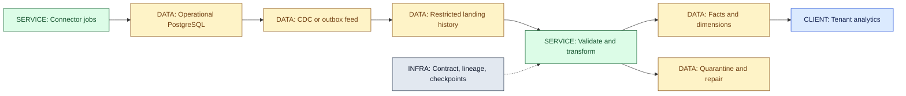
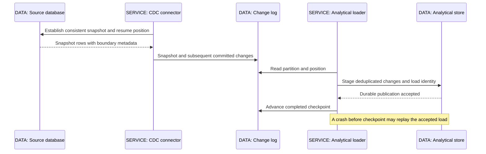
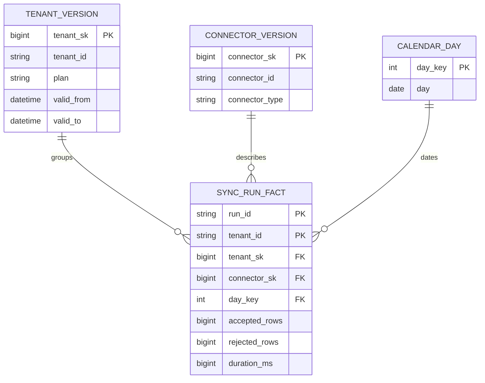

# 26 / Data Platform Basics

**Operational truth and analytical usefulness are different contracts.** A sync service answers whether one job was accepted. An analytical system answers which connector types failed most often last month, under the definitions and dimensions valid for that report. IntegrationHub is fictional; its analytical platform is a derived view, never the authority for job acceptance or a wallet balance.

**Version assumptions:** Java 21, PostgreSQL 17 and Kafka 4.x are the guide's reference environment, not locally tested dependencies. Warehouse and table-format features are engine-specific. No Spring Cloud behavior is introduced here; retain the compatibility checks in [03](03-spring.md#ch03-spring).

**Execution status:** `code/26-data-platform/WarehouseLab.mjs` has five recorded PASS checks on Node v24.20.0. It models dimensions and facts in memory. No SQL, warehouse, CDC connector, object store, orchestration engine or BI query was executed. All deployment workflows below are design exercises, not command transcripts.

## Big Picture

## What You Will Be Able to Explain

- Separate transaction-serving workloads from analytical scans without confusing replication with a data platform.
- Choose warehouse, lake or lakehouse from governance and query requirements.
- Trace a change from snapshot to CDC, replay, transformation and publication.
- Declare a fact grain before adding measures and dimension joins.
- Handle late events, historical dimensions, deletes and backfills deliberately.
- Define data quality, lineage and an owner for every published metric.

> [!PRODUCTION]
> **Where this lives in IntegrationHub.** Job outcomes feed tenant reliability reports and connector adoption analysis. PostgreSQL remains authoritative for operational jobs ([06](06-databases.md#ch06-databases)); Kafka transports changes ([07](07-messaging.md#ch07-messaging)); connectors own mapping and quarantine ([13](13-integration.md#ch13-integration)). Reporting never reads secrets or trusts a tenant filter supplied by the browser. Security and retention belong to [08](08-security.md#ch08-security), and billing reconciliation belongs to [27](27-payments.md#ch27-payments).

## 1. OLTP and OLAP: Start with the Question

**OLTP** serves short transactions over operational entities: create a sync job, claim a batch, update a checkpoint. Useful work is usually selective, indexed and latency-sensitive. Transactions enforce invariants over concurrent changes. **OLAP** serves analytical questions over many records: failure rates by connector, day and subscription tier, or a trend over a year. Scans, grouping, joins and column pruning matter more than updating a single row quickly.

These are workload descriptions, not hard product categories. A relational database can serve both at modest scale. A separate analytical system is justified when large scans, long snapshots or arbitrary BI queries compete with request traffic, or when multiple source systems need shared historical definitions. Moving the query to a read replica can isolate some compute, but replica lag, history, schema coupling and replica-side query costs still require decisions. It does not automatically produce a governed model.

Trace the interference: a dashboard scans a large table, consumes CPU and I/O, evicts useful pages, and holds resources while users wait for operational requests. Adding an index may help one report but increases write and maintenance costs. Separate the workload only after defining its freshness requirement; a daily report rarely needs every row to appear within a second.

| Choice | Use when | Avoid when |
|---|---|---|
| Indexed queries in OLTP | Small bounded reports fit the operational resource budget | Arbitrary historical scans can exhaust request capacity |
| Read replica for reports | Same schema and some lag are acceptable | You need independent history, cross-source semantics or guaranteed current balances |
| Analytical store | Repeated large scans, governed metrics and historical joins justify a pipeline | A simple report would acquire unnecessary ingestion and on-call machinery |

**IntegrationHub decision:** operational progress is served by the job API, not yesterday's reporting mart. A chart says its data cutoff and freshness status. An empty result during ingestion failure must not be labeled zero failures. The SLI discussion in [18](18-operations.md#ch18-operations) applies: missing evidence differs from a healthy result.

## 2. Warehouse, Lake and Lakehouse

A **warehouse** provides managed analytical tables and a query environment organized for business consumption. A **data lake** stores files or objects, often retaining source-shaped data for multiple downstream uses. A **lakehouse** combines lake-style storage with table-management features such as transactional metadata and schema evolution. None of these labels promises correct definitions, low cost or access isolation.

Mechanically, an analytical query needs to discover the right data files or table partitions, select columns, scan relevant data and aggregate it. In a lake, unmanaged file listings alone give little protection against partial loads, duplicate files or conflicting writers. A table format can introduce snapshots and metadata that identify a consistent table state. A query engine still has to support the format and its chosen features. Object storage is not itself a SQL transaction coordinator.

| Storage approach | Use when | Avoid when |
|---|---|---|
| Warehouse | Teams need governed SQL access and managed analytical operations | Its access patterns or economics do not fit required raw-data uses |
| Lake | Diverse retained inputs need replay and several consumers | No owner will manage catalog, permissions, file layout and cleanup |
| Lakehouse | Shared object data needs table snapshots and compatible query engines | The team assumes a format removes operational work or universalizes feature support |

**[VERIFY: check the selected warehouse, object store, table format and query engine for snapshot isolation, concurrent writes, schema evolution, delete support and catalog interoperability. No warehouse or lakehouse implementation was executed.]**

IntegrationHub can start with restricted landing objects and a small warehouse mart. It does not need three different platforms because three names appear in an interview. Separate landing access from curated access: source-shaped payloads may include attributes that reports must never expose. Encryption alone does not implement that separation.

## 3. ETL, ELT and Streaming Are Different Axes

**ETL** transforms before loading the analytical destination. **ELT** loads first and transforms there. **Streaming** describes continuous processing rather than a scheduled bounded run; either transformation placement can be used with continuous ingestion. A scheduled micro-batch and a record-at-a-time processor can produce the same business table under different latency and operating costs.

An ETL flow reads a source manifest, validates records, normalizes units and types, writes a staged result, then publishes a completed load. It can exclude sensitive fields before they reach the destination. An ELT flow lands a controlled source copy, executes versioned transformations near the data, checks quality, then exposes curated tables. It makes reprocessing convenient only when the source copy, transformation version and permissions are actually retained.

| Choice | Use when | Avoid when |
|---|---|---|
| ETL | Data must be minimized or transformed before the destination | Every change would require rereading an unavailable source |
| ELT | Governed landing data enables repeatable warehouse transformations | Raw sensitive data cannot be permitted in the destination |
| Scheduled batch | Minutes or hours of freshness meet the requirement | Decisions genuinely require lower-latency change visibility |
| Streaming | Continuous updates have explicit business value | The team cannot support replay, ordering, lag and evolving state |

> [!DECISION]
> **Ask for freshness before choosing technology.** IntegrationHub's daily adoption report can be a bounded batch. A near-live operational anomaly feed may justify streaming. Billing close needs completeness and reconciliation, not merely a short ingestion delay. One dataset can support all three through separate published contracts.

For either mode, pin input identity, transformation version and output destination. Write into a staging generation, validate, then switch the published pointer or commit the final table operation. Readers must not see half a daily partition. Restartability is not "run yesterday again"; it means repeating the same logical input does not duplicate its accepted output. See the checkpoint mechanism in [13](13-integration.md#ch13-integration).

## 4. CDC into Analytics: Snapshot, Changes and Recovery

**Analytics CDC** turns committed source changes into analytical updates. Log-based CDC can avoid repeated full-table polling, but still needs a consistent starting snapshot, a source position and enough retained log history to resume. The source's log position is not automatically comparable with another source's position or a different Kafka partition offset.

Trace a source update: the source transaction commits; capture reads its change record; transport can redeliver; the loader identifies the entity, source epoch and version; an idempotent merge or batch identity avoids repeated effects; only then does its progress advance. The source database transaction, broker offset commit and warehouse commit are not automatically one transaction. A crash in the gap is expected, so replay must be safe.

For a current-state projection, newer entity versions can replace older ones and old arrivals can be ignored. For a historical change log, discarding an older arrival may lose required history. Store the event occurrence separately if the business needs every transition. An update setting total processed rows to 1,200 is replacement state, not an increment of 1,200; summing every version invents throughput.

**[VERIFY: confirm Debezium and the selected database connector's consistent snapshot, source-position, transaction metadata, tombstone, schema-history and recovery semantics for the deployed versions. No CDC snapshot, log-retention or restart test ran.]**

Deletes need a contract. A deleted source row may close a dimension's current version, remove a current-state projection, or trigger a governed erasure process. A broker tombstone is a transport representation, not a complete deletion of landing files, historical tables and backups. Retention and privacy decisions must cover every copy, as described in [08](08-security.md#ch08-security).

> [!TRAP]
> **A healthy consumer is not evidence of complete data.** It may be consuming the wrong topic, silently quarantining a column, ignoring a schema change or starting after a lost log segment. Monitor coverage, rejected records, source-to-target control totals and last complete watermark, not only process uptime.

> [!INTERVIEW]
> **Name the grain before the tool.** Explain the business row, its unique identity, measure units, freshness target and replay behavior before selecting a warehouse or streaming product.

If capture falls behind retained source logs, do not invent continuity. Stop claiming completeness, establish a new snapshot generation, reconcile it with the retained analytical history and explicitly hand over to the new stream. Rebuilds need an epoch or namespace so positions from an old stream cannot reject legitimate new input.

## 5. Star Schema: Declare the Grain First

A **fact table** records measurements at an explicit grain. A **dimension** provides descriptive attributes used to filter and group those measurements. A star schema links the central fact to dimensions. The grain sentence is the most important part: “one row per completed sync run per tenant” differs from “one row per connector per tenant per UTC day.” Mixing both in one additive report double-counts.

For the run-grain design, `(tenant_id, run_id)` is the business uniqueness boundary. `tenant_sk` identifies a particular historical tenant dimension version; it does not replace operational tenant authorization. A surrogate key is an analytical row identity, while a natural key identifies the source entity. Maintain both and validate the mapping.

Measures have aggregation rules. Accepted-row counts may be additive across disjoint runs; a daily active-connector count cannot be added across days to get monthly distinct connectors. Balances are often additive across accounts at a point in time, but not across snapshots of the same account. Percentages need their numerators and denominators, not an unweighted average of tenant percentages. A percentile cannot generally be averaged into a fleet percentile.

Avoid join fan-out: if a run has five errors and three tags, joining both detail tables before summing run volume produces fifteen joined rows. Aggregate each detail to the declared grain first, or use an explicitly modeled bridge with the correct allocation rules. A foreign key that matches is not proof that the resulting measure is meaningful.

### Historical Dimensions

Type 1 changes overwrite an attribute, suitable when the report intentionally uses the current classification. Type 2 changes close one version and open another with a new surrogate key, suitable when the report must preserve the classification at the time of an event. For half-open intervals, the effective time belongs to `valid_from <= time < valid_to`; an open row has no upper bound. Enforce nonoverlap and define the source of effective time.

Suppose a tenant changes from standard to premium in February. A January fact joined to the current dimension answers “January usage by today's plan.” Joined to the January version, it answers “usage by plan at the time.” Both are legitimate questions; silently choosing one changes the metric. Late corrections can require splitting historical intervals and restating affected facts, not merely opening a row at processing time.

| Dimension policy | Use when | Avoid when |
|---|---|---|
| Type 1 overwrite | Current categorization is the intended report meaning | Auditable historical categorization must be preserved |
| Type 2 versions | Historical attributes affect interpretation | No owner can define effective dates and correction rules |
| Separate event facts | Every transition is part of the required history | A current-state view alone satisfies the question |

**[VERIFY: validate merge/upsert atomicity, unique-key enforcement, interval checks and partition publication with the chosen analytical engine. The in-memory fixture does not execute SQL or enforce concurrent historical intervals.]**

## 6. Late Data, Backfills and Metric Finality

Keep event time, ingestion time and processing time distinct. A sync may complete just before midnight, arrive after midnight and be aggregated the next morning. The metric contract must name the timezone and which time selects its day. UTC storage helps unambiguous instants but does not decide the business reporting calendar.

A watermark is a completeness policy, not proof that nothing older will ever arrive. Publish provisional results until the lateness contract closes the window. Late input may cause a correction, an exception workflow or an explicit restatement. “Final” must mean something an owner can defend, especially when a financial report consumes the result.

A safe backfill selects immutable input boundaries, pins the transformation and dimension policy, writes a separate generation, compares row counts and control totals, validates tenant isolation, then replaces the agreed partitions atomically where supported. Live ingestion must not overwrite that generation with older logic. Establish a handoff boundary and reconcile the overlap. Rollback is switching to a retained valid generation, not hoping the previous files were not deleted.

Hypothetical sizing: 100,000 run facts per day at an assumed 500 bytes each gives 50,000,000 bytes of logical daily input before encoding, metadata, indexing, replicas or retained versions. This is arithmetic, not measured storage. Retaining raw changes, current projections and historical marts can multiply bytes; compression must be measured with representative input rather than asserted from a vendor name.

## 7. Data Quality Is a Publication Contract

Quality has several independent dimensions: schema validity, uniqueness at grain, referential integrity, completeness, freshness and semantic validity. A perfectly typed negative duration may still be invalid. A complete partition containing duplicated runs may still be wrong. A low-latency table with missing tenants may still be unusable.

At ingestion, verify the envelope, source identity and required fields. During transformation, check currency or unit consistency, supported enum meanings and dimension references. Before publication, reconcile counts and meaningful totals against the selected source boundary. After publication, monitor drift and consumer-facing freshness. Store rejection reason, original identity and mapping version in restricted quarantine; never drop malformed input silently.

> [!MECHANISM]
> **Publish data and its completeness evidence together.** A load manifest can bind source ranges, transformation version, row counts, rejection counts, control totals and the output generation. A dashboard reads the published generation and its cutoff. A failed quality gate leaves the last valid generation visible with a stale warning, rather than replacing it with a partial success.

Null is not automatically zero. Zero failures means observed runs had no failures; null might mean not collected, unknown, inapplicable or rejected. A quality rule must preserve the intended distinction. Similarly, a quarantine policy has to say whether a partition with rejected rows may be published as partial, must stop, or may exclude a documented class of optional records.

**[VERIFY: validate the chosen orchestration and data-quality tooling's retry, backfill, dependency, alerting and atomic-publication behavior in a sandbox. No scheduler, quality framework or BI freshness alert was executed.]**

## 8. Lineage and the Backend Service Contract

**Lineage** records how an output was derived: source table or event schema, fields, transformations, versions, runs and destinations. It makes “why did this number change?” answerable. A diagram alone is insufficient if it cannot identify which transformation revision produced a particular partition. Record both dataset-level dependencies and field-level derivation where sensitive fields or disputed measures require it.

Backend services should publish stable identities, tenant scope, occurrence time, entity version and explicit units. A domain event can state business intent better than a raw row change, but events need versioning and retention too. A CDC consumer tied to internal tables must coordinate schema evolution with the owner. An outbox reduces dual-write risk; it does not define the meaning of “successful run.”

The contract names the owner, grain, schema, metric definition, freshness target, replay window, delete semantics and compatibility policy. Consumers need notice before a column changes meaning, even if its SQL type does not change. An integer that used to mean milliseconds and now means seconds is structurally valid and semantically breaking.

Access controls must survive transformations and exports. A shared analytical table requires server-enforced tenant isolation and narrowly scoped service identities. Avoid raw tokens, certificates and payload secrets in landing data. For erasure or retention changes, lineage identifies affected stores; governing deletion from historical copies and backups remains a policy and implementation question, not a promise made by a CDC tombstone.

**[VERIFY: confirm retention, erasure, audit and cross-border data obligations with the responsible privacy/legal team and current jurisdiction-specific guidance. Validate access enforcement across landing, curated tables and BI exports; no legal determination or live access audit was performed.]**

## 9. Executable Model and Its Limits

`WarehouseLab.mjs` supplies `DimensionTable` and `FactTable`. Five checks cover ignoring replayed or older positions in a current-state projection, opening a changed dimension version while closing the old one, closing a deleted dimension without erasing prior history, suppressing repeated fixture grain keys and rejecting noninteger fixture measures. The report is `code/26-data-platform/execution.json`; the Windows runner is `code/26-data-platform/run.ps1`.

The fixture uses ordered per-key integer positions and supplied observation dates, not a real source log or event-time correction model. It is not a complete Type 2 loader: it has no concurrent writers, transactional checkpoint, durable restart or interval validation. Its fact keys join fixture values with a separator; production keys must be typed tuples or an unambiguous encoding. It ignores repeated fact keys without checking changed content, so a production loader must add content binding or an explicit correction contract. Integer measures describe this test dataset only; exact decimals are valid analytical measures elsewhere.

Recommended unexecuted acceptance tests: crash after analytical commit before offset commit; replay the same range; deliver a late dimension correction; change a source unit without a schema type change; load a fact with no dimension; delete a tenant across every retained copy; compare a backfill with the live projection at the same cutoff. Specify expected invariant, rollback and evidence before running them.

## Concepts Explained Here

- [OLTP and OLAP](#ch26-workloads): workload isolation and freshness.
- [Warehouse, data lake and lakehouse](#ch26-storage): storage and table-management choices.
- [ETL, ELT and streaming](#ch26-pipelines): placement versus cadence.
- [Analytics CDC](#ch26-cdc): snapshot boundaries, positions, replay and deletes.
- [Star schema](#ch26-star): facts, grain, measures and historical dimensions.
- [Data quality](#ch26-quality): checks that gate publication.
- [Lineage](#ch26-lineage): source-to-output evidence and ownership.

## Related Chapters

Use [00 master map](00-master-map.md#ch00-master-map), [06 databases](06-databases.md#ch06-databases), [07 transport and CDC](07-messaging.md#ch07-messaging), [08 data protection](08-security.md#ch08-security), [13 connectors](13-integration.md#ch13-integration), [18 reliability](18-operations.md#ch18-operations), [19 test boundaries](19-testing.md#ch19-testing), [25 ownership](25-architecture.md#ch25-architecture), [27 financial reconciliation](27-payments.md#ch27-payments) and [24 the connected journey](24-capstone.md#ch24-capstone). Generated relationships are reciprocal.

## One-Page Cheat Sheet

**Workload:** OLTP protects request transactions; OLAP answers scan-heavy historical questions. A replica does not automatically supply historical semantics.

**Storage:** warehouse for governed analytics, lake for retained diverse objects, lakehouse for table-managed lake data. Product names do not establish correctness.

**Pipeline:** ETL versus ELT chooses where transformation occurs. Batch versus stream chooses cadence. Both need replay identity, checkpoints and publication boundaries.

**Model:** declare one fact grain; preserve measure units; distinguish additive counts, distinct counts and snapshots. Dimension versioning changes the question a join answers.

**Recovery:** retain source positions and epochs; replay idempotently; handle late changes and deletes; backfill into an isolated generation before publishing.

**Trust:** quality gates, lineage, tenant enforcement and a visible completeness cutoff travel with the data. Five local checks passed; no data-platform runtime was tested.

## Interview Corner

### Basic: Why Not Run Every Report on PostgreSQL?

You can run bounded reports there. Separate analytics when scans, history or cross-source definitions exceed the operational resource and schema budget. First state freshness and completeness requirements.

### Internals: What Does CDC Actually Guarantee?

A specific connector exposes changes under documented snapshot and log semantics. It does not automatically coordinate the analytical commit with its offset. Explain the commit gap and idempotent replay.

### Trace/Debug: A Dashboard Doubled After a Restart.

Check whether cumulative values were summed, a batch was appended twice, or joins multiplied fact rows. Compare business grain keys, source ranges and output generation manifests before changing the chart.

### Scenario: A Connector's Category Changed Last Month.

Ask whether old reports use current or historical categorization. Choose overwrite or versioned dimensions deliberately, define effective time and handle late corrections without overlapping intervals.

### Basic: Warehouse or Lakehouse?

Decide from consumers, governance, existing skills, engine compatibility and cost. A table format adds metadata semantics, not automatic metric quality or universal query compatibility.

### Internals: How Is a Percentage Aggregated?

Preserve and aggregate its numerator and denominator at compatible grain. Averaging tenant percentages weights tiny and large tenants equally unless that is the intended metric.

### Trace/Debug: The Pipeline Is Green but a Tenant Is Missing.

Inspect source coverage, schema rejection, quarantine and last complete watermark. Process uptime and offset movement do not prove semantic completeness.

### Scenario: Rebuild One Year While Live Ingestion Continues.

Pin source and transformation identity, write a separate generation, define an overlap cutoff, reconcile counts and totals, then publish atomically and retain rollback evidence.

### Basic: What Is Lineage?

The evidence connecting an output to source datasets, fields, transformations, versions and runs. It supports impact analysis, repair and data-protection work.

### Internals: Can a Source Delete Erase the Lake?

No. It is an input signal. Every retained representation needs its own authorized deletion or retention workflow, including derived tables and exports.

### Trace/Debug: Why Did a Historical Number Change?

Compare input cutoff, transformation revision, dimension-effective dates, lateness policy and backfill generation. A reproducible report needs all of them, not only the query text.

### Scenario: Does the Lab Prove Production Idempotency?

No. It checks a few in-memory transitions and duplicate fixture keys. Durable atomicity, conflicting content, concurrent ingestion and real source positions remain untested.