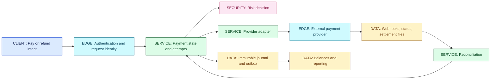
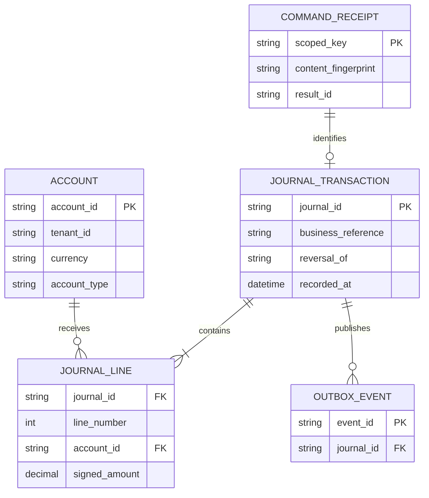
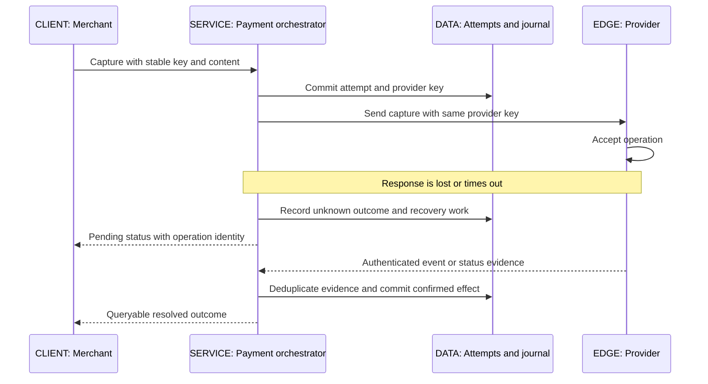
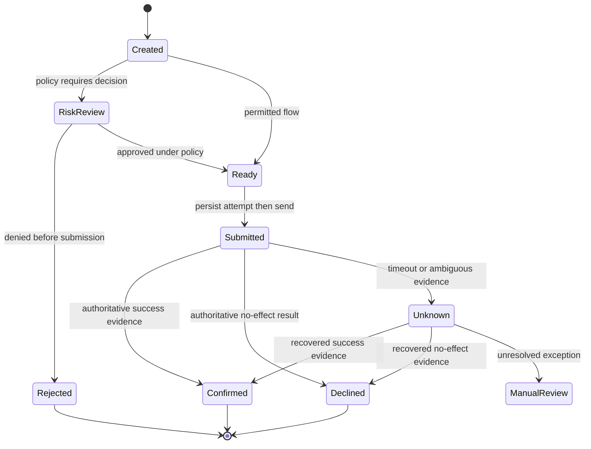
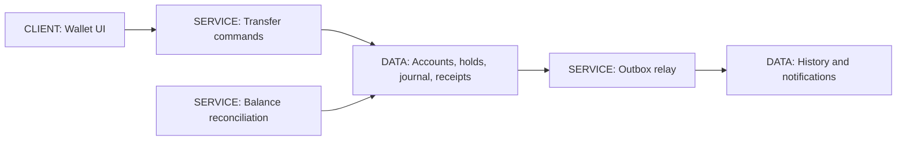
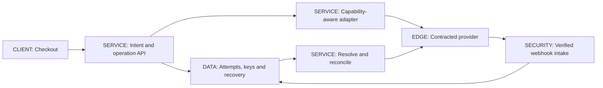
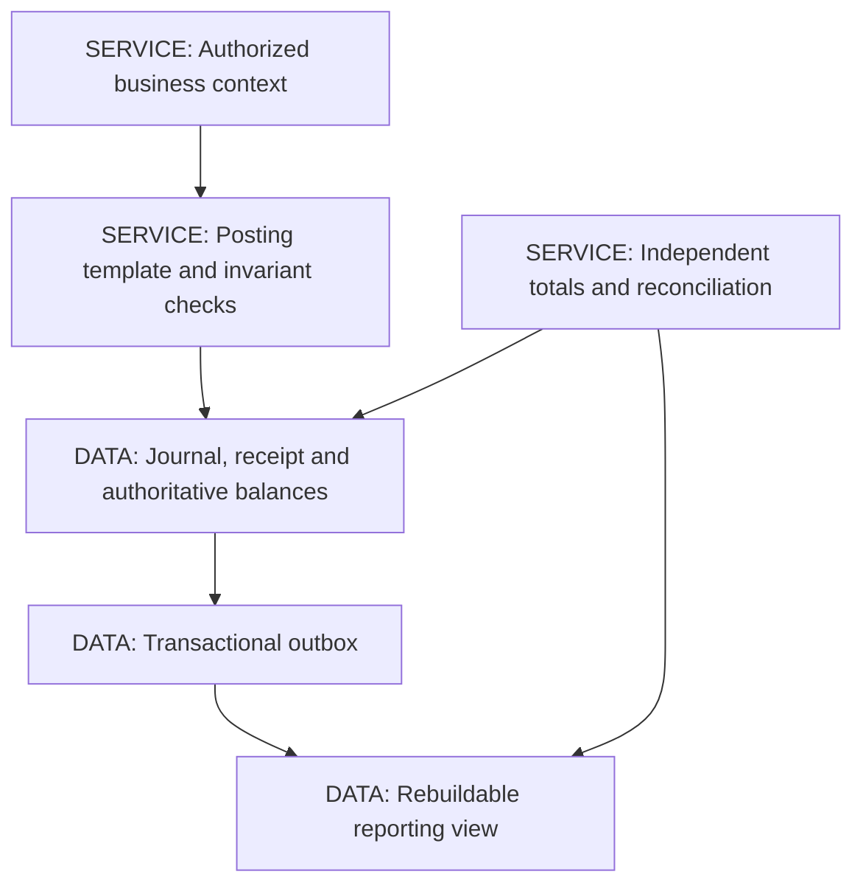

# 27 / Fintech and Payments Engineering

**A timeout is not a financial outcome.** Payment engineering combines ordinary distributed-system failures with obligations that cannot be repaired by silently changing a counter. Start with identities, money invariants, evidence and reconciliation; then select providers and deployment topology. IntegrationHub is fictional. The payment examples extend its connector and tenant model for teaching; they do not claim that it operates a real wallet or regulated payment business.

**Version assumptions:** Java 21, PostgreSQL 17 and Kafka 4.x are reference versions, not executed services. Spring transaction behavior follows [03](03-spring.md#ch03-spring). Provider APIs, currencies, network rules and regulatory obligations must be checked for the selected product, jurisdiction and date. This is engineering education, not legal, accounting or compliance advice.

**Execution status:** `code/27-payments/LedgerLab.mjs` passed eight local check groups on Node v24.20.0. It is a single-process, single-currency model. No bank, gateway, payment network, SQL transaction, compliance control or money movement was executed. The case studies and fault exercises below are NOT EXECUTED designs.

## Big Picture

## What You Will Be Able to Explain

- Distinguish authorization, capture, settlement, refunds and disputes without treating them as one boolean.
- Design a balanced, append-only journal and a concurrency-safe spend decision.
- Bind idempotency to immutable intent and recover unknown provider outcomes.
- Reconcile internal obligations against independent external evidence.
- Place fraud, identity, audit and sensitive-data controls at their actual boundaries.
- Present wallet, gateway integration and ledger designs with estimates, APIs, failure paths and testable invariants.

> [!PRODUCTION]
> **Where this lives in IntegrationHub.** A provider connector uses the same retry and timeout machinery as bulk sync, but a payment timeout must remain unresolved until supported by evidence. Tenant authorization comes from [08](08-security.md#ch08-security), durable state from [06](06-databases.md#ch06-databases), delivery from [07](07-messaging.md#ch07-messaging), and financial analytics from [26](26-data-platform.md#ch26-data-platform). The ledger is authoritative for recorded obligations; a provider is authoritative for its own accepted operations. Reconciliation connects these views rather than pretending they share one commit.

## 1. Payment Lifecycle: More Than Paid or Failed

In a typical card-oriented flow, **authorization** asks whether a proposed payment may proceed and can reserve spending capacity; **capture** requests collection against an authorization; **clearing** exchanges the information needed to determine obligations; **settlement** discharges those obligations between participants. A merchant's payout timing can be a separate process. A **void** cancels an eligible uncaptured authorization. A **refund** is a new return-of-funds operation after an earlier payment. A **chargeback** is a network dispute mechanism, not merely a merchant-triggered refund. Exact stages, partial operations and deadlines depend on the provider and network. **[VERIFY: confirm authorization, capture, clearing, settlement, void, refund, payout and chargeback semantics, supported partial operations and deadlines against the selected acquirer/provider and current card-network rules. No network flow was executed.]**

Use these as distinct records or state dimensions. A payment can be captured, partly refunded, awaiting settlement and under dispute without fitting a clean linear enum. Maintain an intent, provider attempts, captures, refunds, disputes and settlement allocations as related records. A status summary is a projection of those records, not the only history.

Before sending an operation, persist its business identity and desired action. After receiving evidence, validate its relationship to that operation, transition under a version or lock, record the evidence and publish a durable event. Never let an uncorrelated webhook update a payment merely because the amount looks right.

| Operation | Use when | Avoid when |
|---|---|---|
| Authorization then capture | The business needs to confirm eligibility before fulfillment and the provider supports the flow | You assume authorization means collected or settled funds |
| Immediate collection flow | The selected product combines the needed steps under its documented contract | The business needs a separate fulfillment decision but cannot reverse its effects safely |
| Refund | A confirmed earlier payment needs a tracked return operation | The original operation is still unknown and a refund would guess at its outcome |
| Reconciliation case | Evidence is missing, contradictory or unmatched | A normal timeout is being relabeled failure to simplify the UI |

The table is a design choice, not a guarantee that every payment rail supports those operations. Preserve provider-specific meanings in the adapter while exposing a carefully defined internal vocabulary.

## 2. Money Representation and Posting Invariants

Money is amount plus currency and a rounding policy. Do not use binary floating-point for authoritative arithmetic. Integer minor units are convenient when the selected currency and operation have a defined fixed scale; exact decimal types are appropriate when the domain requires another scale. Java `BigDecimal` supports decimal arithmetic but still needs explicit construction, scale, rounding and comparison policies. An exchange rate, a tax calculation and a posted amount do not necessarily use the same precision.

**[VERIFY: confirm current ISO 4217 currency metadata and provider-specific amount, rounding, zero-decimal and special-unit conventions before integrating. The lab uses synthetic EUR minor-unit integers and does not validate a currency registry or provider amount format.]**

An amount entering an API must have valid sign, scale and range. A capture or refund request is normally modeled as a positive amount plus an operation type; signed journal lines express debit and credit direction internally. Reject zero, negative, fractional-for-this-contract and overflow values before mutation. Also reject a currency mismatch and changed content under an existing logical request identity.

A **double-entry ledger** records a journal transaction with at least two lines whose debits equal credits. Pick a consistent sign convention. In this chapter's examples, debit is positive and credit is negative. Assets and expenses normally increase with debits; liabilities, equity and income normally increase with credits. Account classifications and recognition events require an agreed accounting model; balanced mathematics alone does not prove the classification is correct.

For a purely illustrative 5,000-minor-unit payment receivable, debit a processor receivable by 5,000 and credit merchant payable by 5,000. On settlement, debit cash and credit processor receivable. A separately identified fee has its own expense, revenue or contractual allocation, not an unexplained difference hidden in the payment amount. These examples do not prescribe when a real business should recognize an asset or obligation.

Every journal transaction must balance within each currency. Never sum EUR and INR into zero and call it balanced. An FX conversion involves separately balanced currency legs and explicit exchange, clearing or position accounts under an approved model. Preserve rate identity, rounding and residual treatment. Correct an erroneous posted journal with linked reversing and replacement entries; changing history destroys the evidence needed to explain the balance.

> [!MECHANISM]
> **Commit the whole posting boundary.** Validate command identity, account eligibility, currency and amount; serialize the relevant balance or version checks; insert journal header and all lines; persist the command result and outbox intent; then commit. A retry sees the stored result. A crash before commit leaves no accepted partial posting. A database constraint on one line cannot by itself enforce the sum of all lines.

## 3. Ledger Model, Balances and Concurrency

Use stable journal identities and unique business command scope. A receipt may represent an accepted nonposting command, hence the optional journal relationship. In an implemented relational schema, line uniqueness, account tenant and currency consistency, referential integrity and posting status all need enforcement. Keep draft preparation separate from irrevocably posted entries.

The journal is the audit source for recorded accounting effects. A balance table may be a transactionally maintained projection, or a rebuildable asynchronous projection used only for display. Decide which one authorizes spending. If two transfers both read a stale balance of 100 and spend 80, a perfectly balanced journal can still produce an unauthorized overdraft. Double entry preserves conservation; it does not impose a no-negative-available-balance policy.

For a single database wallet, lock or conditionally update the relevant authoritative balance rows in a deterministic order. In the same transaction, verify spendable funds, reserve or debit, write both sides of the transfer and record idempotency. Retry serialization failures under the same intent identity. If a hold already reduced availability, capturing that hold must consume the reservation without subtracting the same amount twice.

Define displayed balances: posted balance, outstanding holds, pending credits and spendable amount are not synonyms. Whether a pending credit becomes spendable is a product and risk rule. Do not turn delayed analytics or a cache into spend authority. See isolation and locks in [06](06-databases.md#ch06-databases).

**[VERIFY: validate account constraints, posting atomicity, balance serialization, unique receipt scope, outbox commit and failover durability with the chosen database and accounting design. The JavaScript model has no SQL transaction, crash durability or concurrent spend test.]**

## 4. Exactly-Once Effects Need a Named Boundary

An idempotency key identifies one logical operation, not one HTTP attempt. Scope it by tenant or merchant, operation and stable business identity. Bind it to canonical amount, currency, target and intent. Same key and same content replays the original result; same key with different content is a conflict. Preserve the result even if current payment state has since advanced: replaying a first partial refund can correctly return its original accepted response while the payment is now fully refunded.

**Exactly-once effects** means at most one committed business effect for that identity, plus a retry or recovery policy that eventually resolves valid intent under stated availability assumptions. It does not mean packets arrive once. Inside one database, a unique receipt committed with the effect can enforce the local duplicate boundary. Across a gateway, the provider must recognize a stable operation identity or supply an authoritative lookup and reconciliation process. Kafka's transactional scope does not automatically extend to a bank API.

Record provider idempotency key, merchant reference, request fingerprint and attempt identity before sending. Retrying the same provider operation uses the same identity. Switching providers after an unknown outcome is not a harmless retry: both providers may succeed. Route selection can change before submission, or after definitive evidence the previous path had no effect under its contract; otherwise resolve ambiguity first.

**[VERIFY: confirm provider idempotency scope, key retention, content-conflict behavior, concurrent-request handling, status lookup and retry guidance for every integrated operation. No external idempotency or gateway failover was tested.]**

> [!TRAP]
> **A new key does not repair an old timeout.** It creates a new operation. Retrying with a new key can charge twice, and automatically refunding one side before learning its outcome can compound the inconsistency. Keep the original operation pending and recover evidence.

## 5. Gateway Timeouts, Webhooks and Recovery

Use bounded connect and read deadlines, an overall operation budget, backoff with jitter and per-provider bulkheads. A circuit breaker can stop new submissions during a failure burst; it does not cancel remote work already accepted. Read-only status recovery may need its own resource budget so submission failures do not starve reconciliation.

Authenticate webhooks using the provider's documented mechanism, preserve the raw bytes needed for verification, enforce replay defenses and validate merchant ownership. Store a unique event receipt before acknowledging durable acceptance. Process asynchronously if needed; acknowledge only what your contract has actually retained. Events can be duplicated or arrive out of order. Compare provider operation identities and versions where supplied; a late authorization notice must not revert a confirmed capture.

**[VERIFY: verify webhook signature/certificate validation, signed payload format, timestamp tolerance, event identifiers, delivery ordering, redelivery and authoritative status semantics in the selected provider documentation. No webhook endpoint or provider signature was executed.]**

A “failed to persist webhook” incident is different from “payment failed.” Keep operational delivery status separate from financial state. If webhook evidence conflicts with a query or settlement report, open a reconciliation exception, retain provenance and follow the provider's evidence hierarchy. Do not choose whichever event arrived last by local clock.

## 6. Money State Machines and Fraud Hooks

This is an **operation-attempt** lifecycle, not a universal card-network state diagram. Separate capture, refund and dispute state machines reference the payment. Every transition needs allowed predecessor states, required evidence, amount constraints, a version check and an audit entry. “Unknown” is local knowledge about an attempt, not a claim that the provider has an unknown state.

Fraud hooks can run before authorization, capture, refund or payout as appropriate to the product. Store decision identity, model or rules version, reasons permitted for retention, expiry and any human approval. A risk approval for one amount and beneficiary must not authorize a later changed request. Automated retries must not bypass a required review. Timeouts in the risk service need an explicit fail-open, fail-closed or hold-for-review policy based on the operation's risk; there is no universally correct default.

| Risk response | Use when | Avoid when |
|---|---|---|
| Reject or hold on unavailable checks | Unchecked movement exceeds the accepted risk | It is adopted accidentally without considering customer impact or recovery |
| Permit within bounded policy | A documented low-risk class and limits support it | It bypasses mandatory controls or has no exposure ceiling |
| Manual review | Evidence is contradictory or a policy requires judgment | An unbounded queue silently becomes permanent pending money |

> [!INTERVIEW]
> **State the invariant before the enum.** “Refunded amount never exceeds confirmed captured amount” is testable under two concurrent refund requests. “We use a state machine” says nothing about whether the amount check and transition share one commit.

## 7. Reconciliation: Independent Evidence, Not a Retry Loop

Reconciliation compares internal intent and journal records with independent provider reports, settlement data or bank evidence at a defined cutoff. It answers whether accepted operations, fees, reversals and funds movements match. A status-polling worker can help resolve one timeout, but a full reconciliation also discovers operations you did not know were missing.

Ingest the report under an immutable file or API range identity and retain checksum, provider account, currency, timezone and version. Validate counts and control totals before parsing rows into matching candidates. Match first on stable references; then classify amount, currency, lifecycle or cutoff differences. Never auto-match solely by amount and nearby timestamp when several payments can share both.

Separate matched records, timing differences, missing-internal, missing-external, duplicate evidence and amount/fee discrepancies. Timing differences remain open until the expected window closes. A correction is an authorized command that appends the necessary journal entries with provenance, not a script overwriting a balance until the totals look equal. Maintain exception owner, age, next action and resolution evidence.

**[VERIFY: confirm settlement and payout report schemas, fee/netting rules, currencies, business-day cutoffs, report revisions and authoritative matching references with the provider and finance team. No settlement file, bank statement or close process was processed.]**

Observe unknown-outcome count and age, unmatched amount by currency, duplicate-event rate, failed posting count and reconciliation backlog. Never add unmatched amounts across currencies without an explicit valuation policy. Alert on unresolved financial exposure as well as API errors. A green HTTP dashboard can coexist with a serious settlement mismatch.

## 8. PCI Scope, Audit, KYC and AML

Scope reduction starts with data flow. Prefer a provider-hosted collection path and token references where appropriate so raw card data does not traverse ordinary application services, logs and support exports. Tokenization and outsourcing can reduce exposure but do not automatically remove all PCI responsibilities; the collection integration, scripts, systems and contracts still determine scope. Sensitive authentication data and cardholder-data handling have specific requirements. **[VERIFY: establish PCI DSS applicability, current version, assessment scope, hosted-payment integration responsibilities and storage prohibitions with the current PCI SSC documents, acquirer and qualified assessor. No compliance certification or scope determination is claimed.]**

An engineering audit trail records actor or workload identity, tenant, operation, before/after state references, authorization decision, request and provider identifiers, time and correlation. Keep secrets and unnecessary personal data out. Separate append permissions from correction approvals; record attempted denied operations where appropriate. Retention, tamper evidence, access review and recoverability matter more than merely naming a table `audit_log`.

**KYC** concerns establishing and verifying customer identity under applicable rules. **AML** concerns controls against money laundering, including risk-based monitoring and escalation under the relevant regime. Engineers build evidence collection, restricted access, workflow states, screening integrations and auditability; they do not invent legal thresholds or infer that a successful API response establishes compliance. **[VERIFY: confirm KYC, AML, sanctions-screening, reporting, retention and approval obligations with qualified compliance/legal owners for the actual jurisdiction, entity and product. No regulatory control or screening provider was validated.]**

Keep access boundaries narrow. Support staff may view a case without being permitted to issue a refund. A manual correction can require separate preparation and approval identities under the organization's policy. A stolen service credential must not authorize arbitrary journal entries; permitted command types and account scopes should constrain it. See [08](08-security.md#ch08-security) for authentication, data protection and secret rotation.

## 9. Card Networks and UPI: Conceptual Maps

A conceptual card payment connects the cardholder, merchant, gateway or processor, acquirer, network and issuer. Roles can be combined by a provider, but they represent different responsibilities. Authorization messaging and later clearing, settlement or merchant payout must not be collapsed into one synchronous API call. Authentication mechanisms such as 3-D Secure address a different question from the merchant's own API authorization. **[VERIFY: confirm current network participant roles, issuer/acquirer flows, 3-D Secure responsibilities, dispute processes and regional variations against selected network, EMVCo and provider documentation. This is a conceptual overview, not a certified integration.]**

UPI is an Indian account-to-account payment system operated by NPCI, with participating banks and application/provider roles. Its addressing and authorization flows differ from a card authorization/capture model. Do not assume a UPI API has a separate capture stage because your card adapter does. Internal intent, attempt, pending/confirmed evidence and reconciliation concepts still apply, while operation names and capabilities belong to the rail-specific adapter. **[VERIFY: confirm current UPI participant roles, permitted flows, status/reversal/dispute handling, limits, authentication and integration obligations using NPCI, RBI and the contracted PSP/bank documentation. No UPI integration, limits or regulatory status was tested.]**

An adapter translates a provider's documented states into internal evidence without discarding distinctions. Preserve the raw provider status and reference. A portable abstraction should expose capabilities rather than pretend every rail supports holds, partial capture, refunds and disputes in the same way. Avoid encoding network limits in this guide as timeless constants.

## 10. HLD Case Study: Wallet

### Requirements and Estimate

Design a fictional closed-scope wallet exercise: authenticated tenants can transfer an existing recorded balance between eligible accounts, query history and reserve funds. External funding, legal product classification, FX and real-world custody are outside the implemented exercise. Invariants: no unauthorized cross-tenant transfer, no double posting, no overspend under the configured policy, and every accepted transfer has balanced entries.

Hypothetical load: 100 transfers per second, one journal with two lines per transfer, gives 200 journal lines per second and 17,280,000 lines per 24-hour day at a constant rate. This excludes receipts, indexes, audit, outbox and replication. It is an estimate, not observed throughput. A single hot account can serialize traffic even if overall capacity is adequate.

### API and Data Model

Design interfaces: `POST /transfers` with source, destination, currency, amount and idempotency key; `GET /transfers/{id}`; account balance and history queries with scoped pagination. These are API sketches, NOT EXECUTED endpoints. Store accounts, holds, transfers, command receipts, journal transactions and lines, plus an outbox. Tenant and account authority come from validated identity, not a freely supplied tenant header.

### Flow, Deep Dive and Failures

Authorize both account relationships, normalize intent, claim the unique request, acquire account serialization in deterministic order, validate available funds, debit and credit in one transaction, record result and outbox, then commit. On response loss, replay the stored transfer result. For a hold, create reservation identity and expiry policy under the same spend authority; a capture consumes the hold exactly once. Expiry and capture racing must have one winning transition.

Use one transactional boundary initially. Partitioning by account can split a transfer across shards and create a distributed money workflow. Do not introduce it before measuring a real limit and specifying reservations, recovery and reconciliation. A cache can serve a labeled display balance but cannot authorize spending from stale data.

| Choice | Use when | Avoid when |
|---|---|---|
| One database posting boundary | Transfer volume fits and strong local atomicity is valuable | A measured scale or regulatory partition requirement forbids it |
| Cross-partition workflow | Scale or ownership requires separate authorities | The design cannot specify pending funds, compensation and recovery |

**IntegrationHub mapping:** the tenant and connector ownership rules remain; wallet state belongs to a separate financial context, not connector-owned counters.

**Acceptance check:** race two spends whose sum exceeds available funds; exactly the allowed spend commits. Retry each accepted command after response loss; journal count does not grow. Crash before commit; neither side appears. These database/concurrency tests are NOT EXECUTED.

## 11. HLD Case Study: Payment Gateway Integration

### Requirements and Estimate

Support create, capture or equivalent provider operation, refund, status query and authenticated webhooks. Preserve provider capability differences and unresolved outcomes. Hypothetical traffic: 50 submissions per second with mean in-flight provider time of two seconds suggests 100 average in-flight submissions by Little's law. Tail latency, status polling and retries require a separate concurrency budget; the calculation does not justify an unbounded queue.

### API and Data Model

Design `POST /payment-intents`, `POST /payments/{id}/captures`, `POST /payments/{id}/refunds` and `GET /operations/{id}`. A durable pending response includes a stable operation resource. Model intent, operation, attempt, provider reference, webhook receipt, risk decision and recovery work item. A refund identity is separate from the original payment identity and binds its own amount.

### Flow, Deep Dive and Failures

Persist the operation and selected provider before submission. Apply rate limit, timeout and risk policy. On authoritative success, transition and record the required accounting command. On definitive decline, store the no-effect outcome. On ambiguity, leave recovery pending and preserve the provider key. The browser may reconnect or repeat the same request without initiating another payment.

Webhook and polling workers can race. A unique event receipt suppresses repeated transport input; a conditional operation transition and journal command identity suppress repeated business effects. Those are separate deduplication boundaries. Retry only error classes allowed by the provider contract and the end-to-end budget; do not retry malformed requests indefinitely.

| Choice | Use when | Avoid when |
|---|---|---|
| One provider initially | Simpler reconciliation and operational learning matter | Business requirements genuinely require independent provider paths |
| Capability-aware multi-provider routing | Routing and reconciliation can preserve per-provider identity and semantics | An unknown response would trigger blind failover and possible duplicate charge |

**IntegrationHub mapping:** use Strategy/Adapter from [11](11-lld.md#ch11-lld), bulkheads from [10](10-system-design.md#ch10-system-design), and outbox delivery from [07](07-messaging.md#ch07-messaging).

**Acceptance check:** drop a successful provider response, replay the webhook, return an old event after a new state, and repeat a key with changed amount. One effect is recorded, state does not regress, and conflicting content is rejected. Provider tests remain NOT EXECUTED.

## 12. HLD Case Study: Ledger Service

### Requirements and Estimate

Accept authorized posting commands, expose immutable journals and balances, support reversals, and prove balanced entries per currency. The service is not a generic “write any debit” endpoint for every application. Define approved posting templates and caller account scope. Hypothetical load: 500 journals per second with four lines each means 2,000 lines per second; storage and index capacity need measured row sizes, retention and workload distribution.

### API and Data Model

Design `POST /journal-commands` with command type, business reference, content and idempotency identity; `GET /journals/{id}`; balance queries with consistency and cutoff. Reuse the account/header/line/receipt model above. Store recorded time separately from effective business date. Backdated entries do not rewrite the order in which the system learned facts, and period-close policy must define whether they are allowed.

### Flow, Deep Dive and Failures

Resolve the permitted template, validate accounts and currency, bind content to command identity, serialize affected spend constraints, insert all lines, update any authoritative balance projection and commit the receipt/outbox. A read projection reports its cutoff; a rebuild compares per-account, per-currency sums against the journal at that same cutoff. If a projection is wrong, repair or rebuild it from authority rather than editing journal history to match the cache.

An immutable table is not magically tamper-proof: permissions, backup retention, audit controls, change approvals and restore procedures are separate. Prevent ordinary callers from UPDATE/DELETE on posted entries and constrain direct database access. A recovery must preserve journal identity and idempotency receipts together; restoring only the balances can permit old requests to post again.

| Choice | Use when | Avoid when |
|---|---|---|
| Transactionally updated balance | It participates in an immediate spend decision | Updates are outside the posting transaction |
| Asynchronous balance view | History and analytics tolerate declared lag | It is used as current spend authority |
| Reversal plus replacement | An accepted posting needs correction with preserved provenance | It is mistaken for deleting the original real-world event |

**IntegrationHub mapping:** ledger ownership is a bounded context from [25](25-architecture.md#ch25-architecture). Analytics consumes it through [26](26-data-platform.md#ch26-data-platform), not by mutating its tables.

**Acceptance check:** attempt an unbalanced transaction, cross-currency sum, duplicate reference, unauthorized account and crash between inserts. None may produce a partial accepted journal. Rebuild balances at a fixed journal boundary and compare totals. Only the smaller local model checks were executed.

## 13. Local Model and Failure Review

`LedgerLab.mjs` tests rejection before posting, capture limits, stored capture replay, refund limits, unknown-outcome recording, conflicting request content, repeated refunds and invalid operation amounts. The Windows runner is `code/27-payments/run.ps1`; its report records eight PASS check groups. The refund replay test intentionally returns the first response even after later refunds changed current state.

The fixture is not a production ledger. It has public mutable storage, no persistence or transactional rollback, no tenant boundary, no authenticated callers, no concurrent requests and only a simplified single-capture lifecycle. Its signed account labels are arithmetic examples, not the debit-positive account model described above. Individual amounts use safe integers, but accumulated balance reads are not a general arbitrary-precision accounting engine. Do not reuse it for real funds.

> [!DECISION]
> **Choose the narrowest proven boundary.** Local assertions establish arithmetic and a few transition rules. Database fault tests establish local atomicity under a tested failure model. Provider sandbox tests establish selected integration behavior. None establishes regulatory compliance or production readiness by itself.

Review failures by evidence: duplicate HTTP requests need request receipts; duplicate events need inbox receipts and effect identity; unknown submissions need provider recovery; unmatched settlement needs reconciliation; concurrent overspend needs authoritative serialization; cross-tenant access needs authorization; bad accounting classification needs finance-approved templates. One “exactly once” configuration cannot replace these different controls.

## Concepts Explained Here

- [Authorization, capture, settlement, refund and chargeback](#ch27-lifecycle).
- [Double-entry ledger](#ch27-money), [ledger model](#ch27-ledger-model) and [ledger HLD](#ch27-ledger).
- [Exactly-once effects](#ch27-idempotency), [gateway timeout](#ch27-timeout) and [reconciliation](#ch27-reconciliation).
- [Money state machine and fraud hooks](#ch27-state).
- [PCI scope, KYC and AML](#ch27-controls); [UPI and card network](#ch27-networks).
- [Wallet](#ch27-wallet) and [payment gateway](#ch27-gateway) designs.

## Related Chapters

Use [00 master map](00-master-map.md#ch00-master-map), [03 transactions](03-spring.md#ch03-spring), [05 API identity](05-apis-realtime.md#ch05-apis-realtime), [06 durable invariants](06-databases.md#ch06-databases), [07 delivery](07-messaging.md#ch07-messaging), [08 security](08-security.md#ch08-security), [10 resilience](10-system-design.md#ch10-system-design), [11 adapters](11-lld.md#ch11-lld), [12 design method](12-hld.md#ch12-hld), [18 recovery](18-operations.md#ch18-operations), [19 testing](19-testing.md#ch19-testing), [22 distributed guarantees](22-distributed.md#ch22-distributed), [25 domain boundaries](25-architecture.md#ch25-architecture), [26 analytical evidence](26-data-platform.md#ch26-data-platform) and [24 synthesis](24-capstone.md#ch24-capstone). Generated relationships are reciprocal.

## One-Page Cheat Sheet

**Lifecycle:** payment intent, provider attempts, captures, refunds, disputes and settlement are distinct records. Preserve unknown outcomes and raw provider evidence.

**Money:** exact representation, explicit currency and rounding; positive command amounts; balanced journal lines per currency. Conservation does not prevent overspend.

**Commit:** command receipt, approved journal, authoritative balance change and outbox share the local transaction. A provider does not share it.

**Identity:** tenant and operation scope, content binding, stable provider key, retained original result. Never blindly fail over an unknown payment.

**Recovery:** verified duplicate-tolerant webhooks, status lookup, independent reconciliation, owned exceptions and auditable correcting entries.

**Controls:** minimize sensitive data, constrain posting authority, retain evidence and verify PCI, KYC, AML and rail-specific obligations. Eight local check groups passed; no real money or compliance workflow ran.

## Interview Corner

### Basic: Is Authorized the Same as Paid?

No. Explain the selected provider's lifecycle, distinguish capture and settlement, and preserve their evidence separately. Do not promise uniform rail semantics.

### Internals: Why Is Double Entry Insufficient for a Wallet?

It balances journal effects but does not prevent two concurrent commands spending the same available funds. Spend authorization and posting must share the relevant serialized boundary.

### Trace/Debug: The Provider Timed Out after a Capture.

Keep the operation unknown, preserve its provider key, and recover through authenticated evidence, status lookup and reconciliation. A timeout is not proof of no effect.

### Scenario: A Retry Uses the Same Key and a Different Amount.

Reject a content conflict. The key names the original intent, not permission to replace it. Return the stored result only for the same content.

### Basic: Refund or Reversal?

A refund is its own business operation under the provider contract; an accounting reversal corrects or offsets a journal entry. Their evidence and meaning must not be conflated.

### Internals: How Does an Outbox Help?

It makes publication intent atomic with local financial state. Delivery can still repeat, so downstream receipt and business-effect identities remain necessary.

### Trace/Debug: Two Webhooks Posted Two Credits.

Inspect both event receipts and journal command identity. Different event IDs can describe the same financial operation, so transport deduplication alone is insufficient.

### Scenario: Capture Is Unknown and a Second Provider Is Healthy.

Do not resubmit blindly. Resolve the first operation or use an explicitly supported recovery contract before creating an independent effect at another provider.

### Basic: What Is Reconciliation?

Comparison of internal records with independent external evidence at a defined cutoff, followed by owned exception resolution and auditable correction.

### Internals: How Do You Handle Two Concurrent Refunds?

Serialize the remaining refundable amount and transition, bind each refund identity, and commit each accepted effect once. A status enum without amount concurrency control is insufficient.

### Trace/Debug: All Journals Balance but Cash Does Not Match.

Check classification, missing operations, fees, settlement timing, currency, report revisions and cutoff alignment. Balanced entries can record the wrong business facts.

### Scenario: Can Hosted Checkout Make Us PCI Compliant?

It can reduce exposure, but applicability and responsibilities require assessment of the actual data flow and current rules. Do not equate a provider token with a compliance conclusion.

### Basic: Can a Card State Machine Be Reused for UPI?

Reuse intent identity, evidence and recovery concepts, not unsupported card-specific operations. The adapter must preserve each rail's verified capabilities and meanings.

### Internals: What Must a Restore Preserve?

Journal identity, accepted receipts, state and reconciliation evidence at a coherent boundary. Restoring only balances can replay previously accepted financial effects.

### Trace/Debug: The Original Partial Refund Now Replays as Fully Refunded.

The handler recomputed current state instead of replaying the original operation result. Keep command outcome and current payment projection separate.

### Scenario: What Would You Test before Launch?

Concurrent overspend, commit/response gaps, duplicate and reordered evidence, unknown provider outcomes, reconciliation mismatches, tenant authorization, restore and correction approvals. The local lab covers only a small subset.